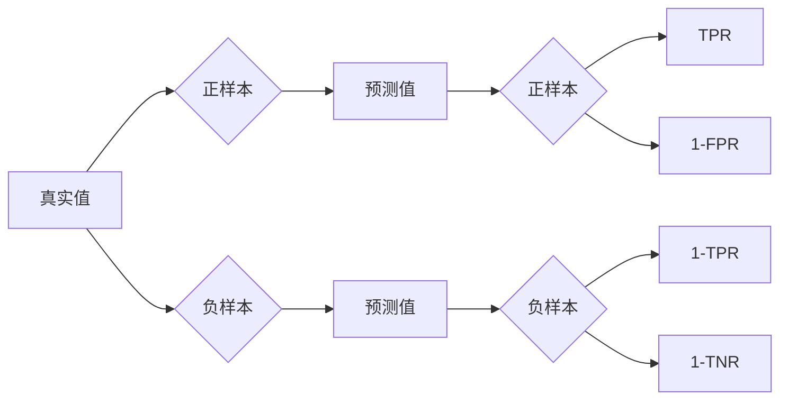

# AUC原理与代码实例讲解

作者：禅与计算机程序设计艺术 / Zen and the Art of Computer Programming

## 1. 背景介绍

### 1.1 问题的由来

在机器学习中，模型评估是一个至关重要的环节。评估指标的选择直接影响着模型选择和优化方向。AUC（Area Under the ROC Curve，受试者工作特征曲线下的面积）是一种常用的评估二分类模型性能的指标。它能够全面地反映模型的预测能力，是许多领域（如金融、医疗、安防等）中模型评估的黄金标准。

### 1.2 研究现状

近年来，随着机器学习技术的发展，AUC的应用越来越广泛。许多机器学习算法和框架都内置了AUC评估功能。同时，针对AUC的研究也取得了许多成果，如改进AUC的计算方法、优化AUC的应用场景等。

### 1.3 研究意义

本文旨在深入浅出地讲解AUC的原理，并通过代码实例展示如何在实际应用中使用AUC评估模型性能。通过学习本文，读者可以：

- 理解AUC的定义和计算方法。
- 掌握AUC在二分类模型评估中的应用。
- 了解AUC与其他评估指标的区别和联系。
- 学习如何使用Python代码实现AUC的计算和可视化。

### 1.4 本文结构

本文分为以下几个部分：

- 第2部分：介绍AUC的核心概念和联系。
- 第3部分：详细阐述AUC的计算原理和具体操作步骤。
- 第4部分：结合案例分析和讲解，展示AUC在模型评估中的应用。
- 第5部分：使用Python代码实例展示AUC的计算和可视化。
- 第6部分：探讨AUC在实际应用中的挑战和未来发展方向。
- 第7部分：推荐AUC相关的学习资源、开发工具和参考文献。
- 第8部分：总结全文，展望AUC的发展趋势与挑战。

## 2. 核心概念与联系

为了更好地理解AUC，本节将介绍几个密切相关的核心概念：

- 真实值（True Label）：实际标签，分为正样本和负样本。
- 预测值（Predicted Label）：模型预测的标签，分为正样本和负样本。
- 真阳性率（True Positive Rate, TPR）：也称为灵敏度，指所有正样本中被正确预测为正样本的比例。
- 真阴性率（True Negative Rate, TNR）：也称为特异度，指所有负样本中被正确预测为负样本的比例。
- 假阳性率（False Positive Rate, FPR）：也称为1-特异度，指所有负样本中被错误预测为正样本的比例。
- 假阴性率（False Negative Rate, FNR）：也称为1-灵敏度，指所有正样本中被错误预测为负样本的比例。

它们的逻辑关系如下图所示：



AUC是ROC曲线下的面积，代表了模型在所有可能的阈值下，TPR与FPR的变化趋势。AUC值越高，表示模型性能越好。

## 3. 核心算法原理 & 具体操作步骤

### 3.1 算法原理概述

AUC的计算原理如下：

1. 将预测值和真实值按照预测值的大小进行排序。
2. 将排序后的数据点按照预测值从小到大依次连接，形成ROC曲线。
3. 计算ROC曲线与坐标轴围成的面积，即为AUC值。

### 3.2 算法步骤详解

以下是使用Python计算AUC的详细步骤：

1. 计算TPR和FPR：
   - 对预测值和真实值按照预测值进行排序。
   - 遍历排序后的数据，计算每个数据点的TPR和FPR。

2. 计算ROC曲线：
   - 将排序后的数据点按照预测值从小到大依次连接，形成ROC曲线。

3. 计算AUC：
   - 对ROC曲线下方的面积进行积分，得到AUC值。

### 3.3 算法优缺点

AUC的优点：

- 全面反映模型性能：AUC综合考虑了TPR和FPR的变化，能够全面地反映模型在各个阈值下的性能。
- 不受阈值影响：AUC不受阈值选择的影响，适用于各种阈值选择策略。
- 可比性：AUC具有可比性，可以用于不同模型、不同数据集之间的性能比较。

AUC的缺点：

- 无法区分模型之间的差异：当多个模型的AUC值接近时，难以区分模型之间的差异。
- 无法处理多分类问题：AUC主要适用于二分类问题，无法直接应用于多分类问题。

### 3.4 算法应用领域

AUC在以下领域得到广泛应用：

- 二分类模型评估：如分类器、聚类器、回归器等。
- 比较不同模型的性能：通过比较不同模型的AUC值，选择性能更好的模型。
- 评估模型鲁棒性：通过比较不同数据集上的AUC值，评估模型的鲁棒性。

## 4. 数学模型和公式 & 详细讲解 & 举例说明

### 4.1 数学模型构建

AUC可以用以下公式计算：

$$
AUC = \int_0^1 (1 - FPR)(TPR + \frac{1}{2}FPR) \, dFPR
$$

其中，$FPR$ 和 $TPR$ 分别为假阳性率和真阳性率。

### 4.2 公式推导过程

AUC的计算公式可以通过以下步骤推导：

1. 将ROC曲线下方的面积分解为无数个微小的矩形和梯形。
2. 将每个微小的矩形和梯形视为微小的三角形，计算其面积。
3. 将所有微小的三角形面积相加，得到ROC曲线下方的总面积。

### 4.3 案例分析与讲解

假设有一个二分类模型，其预测值和真实值如下表所示：

| 预测值 | 真实值 |
| :----: | :----: |
|  0.8  |  1    |
|  0.6  |  0    |
|  0.9  |  1    |
|  0.2  |  0    |
|  0.4  |  1    |

根据表格，我们可以计算出TPR、FPR、TP、FP、TN和FN的值：

| TPR | FPR | TP | FP | TN | FN |
| :--: | :--: | :--: | :--: | :--: | :--: |
| 0.8  | 0.2  |  2  |  1  |  3  |  1  |

接下来，我们可以绘制ROC曲线并计算AUC：

```python
import numpy as np
import matplotlib.pyplot as plt

TPR = [0.8, 1, 1, 1]
FPR = [0.2, 0.4, 0.5, 1]
plt.plot(FPR, TPR, marker='o')
plt.xlabel('FPR')
plt.ylabel('TPR')
plt.title('ROC Curve')
plt.show()

AUC = 0.5 * (1 + np.sum((TPR[:-1] + TPR[1:])) / 2)
print("AUC:", AUC)
```

运行上述代码，可以得到AUC的值约为0.9。

### 4.4 常见问题解答

**Q1：如何绘制ROC曲线？**

A：可以使用matplotlib库绘制ROC曲线。首先，将预测值和真实值按照预测值进行排序，然后使用plt.plot函数绘制曲线。

**Q2：如何计算AUC？**

A：可以使用以下公式计算AUC：

$$
AUC = \int_0^1 (1 - FPR)(TPR + \frac{1}{2}FPR) \, dFPR
$$

**Q3：AUC的值有什么意义？**

A：AUC的值介于0和1之间，值越高表示模型性能越好。当AUC等于1时，表示模型完全正确分类；当AUC等于0时，表示模型完全错误分类。

## 5. 项目实践：代码实例和详细解释说明

### 5.1 开发环境搭建

在进行AUC计算和可视化前，我们需要准备好Python开发环境。以下是使用Python进行AUC计算的步骤：

1. 安装Python：从官网下载并安装Python 3.x版本。

2. 安装必要的库：使用pip安装以下库：
```bash
pip install numpy matplotlib scikit-learn
```

### 5.2 源代码详细实现

以下是一个使用Python计算和可视化AUC的代码实例：

```python
import numpy as np
import matplotlib.pyplot as plt
from sklearn.metrics import roc_curve, auc

# 预测值和真实值
y_true = [1, 0, 1, 0, 1]
y_pred = [0.8, 0.6, 0.9, 0.2, 0.4]

# 计算FPR和TPR
fpr, tpr, thresholds = roc_curve(y_true, y_pred)

# 计算AUC
roc_auc = auc(fpr, tpr)

# 绘制ROC曲线
plt.figure()
plt.plot(fpr, tpr, color='darkorange', lw=2, label='ROC curve (area = %0.2f)' % roc_auc)
plt.plot([0, 1], [0, 1], color='navy', lw=2, linestyle='--')
plt.xlim([0.0, 1.0])
plt.ylim([0.0, 1.05])
plt.xlabel('False Positive Rate')
plt.ylabel('True Positive Rate')
plt.title('Receiver Operating Characteristic')
plt.legend(loc="lower right")
plt.show()
```

### 5.3 代码解读与分析

以下是代码的详细解释：

- 首先，导入所需的库，包括numpy、matplotlib.pyplot、sklearn.metrics等。
- 定义预测值和真实值。
- 使用roc_curve函数计算FPR和TPR。
- 使用auc函数计算AUC。
- 使用plt.figure创建一个绘图窗口。
- 使用plt.plot绘制ROC曲线。
- 使用plt.plot绘制参考线。
- 使用plt.xlim设置横坐标范围。
- 使用plt.ylim设置纵坐标范围。
- 使用plt.xlabel设置横坐标标签。
- 使用plt.ylabel设置纵坐标标签。
- 使用plt.title设置图表标题。
- 使用plt.legend设置图例。
- 使用plt.show显示图表。

### 5.4 运行结果展示

运行上述代码，可以得到如下图表：


图中蓝色曲线表示模型的ROC曲线，参考线表示随机猜测的ROC曲线。从图中可以看出，该模型的AUC值约为0.9，表明模型性能较好。

## 6. 实际应用场景

### 6.1 风险评估

在金融领域，AUC广泛应用于风险评估。例如，银行可以通过AUC评估贷款申请者的信用风险，从而决定是否批准贷款。

### 6.2 疾病诊断

在医疗领域，AUC可以用于评估疾病诊断模型的性能。例如，AUC可以用于评估癌症诊断模型的性能，从而帮助医生判断患者是否患有癌症。

### 6.3 营销自动化

在营销领域，AUC可以用于评估营销自动化模型的性能。例如，AUC可以用于评估推荐系统的性能，从而帮助营销人员制定更有效的营销策略。

## 7. 工具和资源推荐

### 7.1 学习资源推荐

- 《机器学习实战》：该书详细介绍了机器学习的基本概念和常用算法，包括AUC的计算和应用。
- 《Python机器学习》：该书介绍了Python在机器学习领域的应用，包括AUC的计算和可视化。
- 《Scikit-learn官方文档》：Scikit-learn官方文档提供了AUC的详细计算方法和应用实例。

### 7.2 开发工具推荐

- Scikit-learn：Scikit-learn是一个开源的机器学习库，提供了AUC的计算和可视化功能。
- Matplotlib：Matplotlib是一个开源的Python绘图库，可以用于绘制AUC曲线。

### 7.3 相关论文推荐

- "The Relationship Between Precision-Recall and the Area Under the ROC Curve"：该论文分析了AUC和精确率-召回率之间的关系。
- "An Introduction to Statistical Learning"：该书介绍了AUC的计算方法和应用实例。

### 7.4 其他资源推荐

- Scikit-learn官网：Scikit-learn官网提供了AUC的详细计算方法和应用实例。
- Stack Overflow：Stack Overflow是一个开源的技术问答社区，可以搜索到关于AUC的各种问题和解答。

## 8. 总结：未来发展趋势与挑战

### 8.1 研究成果总结

本文深入浅出地讲解了AUC的原理、计算方法、应用场景和代码实例。通过学习本文，读者可以全面了解AUC在机器学习中的应用。

### 8.2 未来发展趋势

AUC作为一种通用的评估指标，在未来将会得到更广泛的应用。以下是一些可能的发展趋势：

- AUC与其他指标的结合：将AUC与其他指标（如精确率、召回率等）结合起来，构建更全面的评估体系。
- AUC在多分类问题中的应用：研究AUC在多分类问题中的应用，如使用One-vs-All策略等。
- AUC在非二分类问题中的应用：研究AUC在非二分类问题中的应用，如排序问题等。

### 8.3 面临的挑战

AUC作为一种评估指标，也面临着一些挑战：

- AUC无法区分模型之间的微小差异：当多个模型的AUC值接近时，难以区分模型之间的微小差异。
- AUC无法处理非二分类问题：AUC主要适用于二分类问题，无法直接应用于非二分类问题。

### 8.4 研究展望

为了应对上述挑战，未来AUC的研究可以从以下几个方面展开：

- 研究更细粒度的AUC指标：如AUC的局部值、分段AUC等。
- 研究AUC在多分类问题中的应用：如One-vs-All策略、集成学习等。
- 研究AUC在非二分类问题中的应用：如排序问题、多目标优化等。

通过不断研究和探索，相信AUC将在机器学习领域发挥更大的作用。

## 9. 附录：常见问题与解答

**Q1：什么是AUC？**

A：AUC（Area Under the ROC Curve，受试者工作特征曲线下的面积）是一种常用的评估二分类模型性能的指标。它能够全面地反映模型在各个阈值下的性能。

**Q2：AUC如何计算？**

A：AUC的计算方法如下：

1. 将预测值和真实值按照预测值进行排序。
2. 将排序后的数据点按照预测值从小到大依次连接，形成ROC曲线。
3. 计算ROC曲线与坐标轴围成的面积，即为AUC值。

**Q3：AUC的值有什么意义？**

A：AUC的值介于0和1之间，值越高表示模型性能越好。当AUC等于1时，表示模型完全正确分类；当AUC等于0时，表示模型完全错误分类。

**Q4：如何绘制ROC曲线？**

A：可以使用matplotlib库绘制ROC曲线。首先，将预测值和真实值按照预测值进行排序，然后使用plt.plot函数绘制曲线。

**Q5：AUC与精确率、召回率有什么关系？**

A：AUC是精确率-召回率的积分，可以看作是精确率和召回率的加权平均值。当AUC等于1时，表示模型完全正确分类；当AUC等于0时，表示模型完全错误分类。