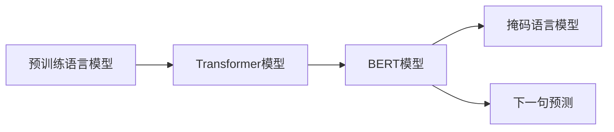

# BERT原理与代码实例讲解

作者：禅与计算机程序设计艺术 / Zen and the Art of Computer Programming

## 1. 背景介绍

### 1.1 问题的由来

自然语言处理（NLP）领域长期以来面临着理解和使用文本数据的挑战。传统的NLP方法往往依赖于规则和手工特征工程，难以捕捉到文本的深层语义和复杂结构。随着深度学习技术的兴起，基于神经网络的NLP模型逐渐成为主流。然而，早期的NLP模型在长距离依赖和上下文理解方面存在不足。为了解决这些问题，Google提出了BERT（Bidirectional Encoder Representations from Transformers）模型，该模型在多种NLP任务上取得了显著的性能提升，成为NLP领域的里程碑。

### 1.2 研究现状

BERT模型的提出，标志着NLP领域从基于词嵌入的模型向基于Transformer的模型转变。随后，大量基于BERT的改进模型和变体被提出，如RoBERTa、ALBERT、DistilBERT等。这些模型在多种NLP任务上取得了突破性的进展，推动了NLP技术的发展和应用。

### 1.3 研究意义

BERT模型的提出对NLP领域具有重要意义：

- 提高了NLP任务的性能，特别是在理解长距离依赖和上下文语义方面。
- 推动了NLP模型的预训练和微调技术的发展。
- 促进了NLP模型在多种应用场景中的落地和应用。

### 1.4 本文结构

本文将系统介绍BERT模型的原理、实现方法和应用实例。文章结构如下：

- 第2章介绍BERT模型的核心概念和联系。
- 第3章详细阐述BERT模型的具体操作步骤。
- 第4章分析BERT模型的数学模型和公式，并举例说明。
- 第5章通过代码实例展示如何使用PyTorch实现BERT模型。
- 第6章介绍BERT模型在实际应用场景中的应用实例。
- 第7章推荐BERT模型相关的学习资源、开发工具和参考文献。
- 第8章总结BERT模型的研究成果、未来发展趋势和挑战。
- 第9章列出常见问题与解答。

## 2. 核心概念与联系

本节将介绍BERT模型涉及的核心概念和它们之间的关系。

### 2.1 预训练语言模型

预训练语言模型是一种在大量无标注文本语料上进行预训练，学习通用语言表示的模型。预训练语言模型可以分为两类：

- 自回归语言模型：如GPT系列，通过预测下一个词来学习语言序列的概率分布。
- 上下文语言模型：如BERT，通过学习文本的上下文表示来理解词语的含义。

### 2.2 Transformer模型

Transformer模型是一种基于自注意力机制的深度神经网络模型，它能够有效地捕捉序列数据中的长距离依赖关系。Transformer模型由自注意力层、前馈神经网络层和层归一化等模块组成。

### 2.3 BERT模型

BERT模型是结合了自回归语言模型和上下文语言模型思想的改进模型。BERT模型使用Transformer作为其基本结构，并采用掩码语言模型（Masked Language Model，MLM）和下一句预测（Next Sentence Prediction，NSP）等预训练任务。

它们的逻辑关系如下图所示：



## 3. 核心算法原理 & 具体操作步骤

### 3.1 算法原理概述

BERT模型采用Transformer模型作为其基本结构，并使用掩码语言模型和下一句预测等预训练任务来学习通用语言表示。

- 掩码语言模型（MLM）：随机掩盖部分输入文本中的词语，然后让模型预测被掩盖的词语。
- 下一句预测（NSP）：给定一个文本序列，预测下一个句子是否是该文本序列的下一句。

### 3.2 算法步骤详解

BERT模型的训练过程可以分为以下几个步骤：

1. **输入处理**：将输入文本进行分词、编码等处理，得到模型所需的输入格式。
2. **预训练任务**：根据预训练任务对模型进行训练，包括掩码语言模型和下一句预测。
3. **损失函数**：计算预训练任务的损失函数，并通过梯度下降等优化算法更新模型参数。
4. **模型微调**：在下游任务上使用微调技术，进一步优化模型参数。

### 3.3 算法优缺点

BERT模型的优点：

- 能够有效地捕捉文本的深层语义和上下文信息。
- 在多种NLP任务上取得了显著的性能提升。
- 预训练模型可以迁移到不同的下游任务。

BERT模型的缺点：

- 训练和推理成本较高，需要大量的计算资源和存储空间。
- 模型可解释性较差，难以理解模型的决策过程。

### 3.4 算法应用领域

BERT模型可以应用于以下NLP任务：

- 文本分类
- 命名实体识别
- 机器翻译
- 问答系统
- 情感分析

## 4. 数学模型和公式 & 详细讲解 & 举例说明

### 4.1 数学模型构建

BERT模型使用Transformer模型作为其基本结构，Transformer模型由自注意力层、前馈神经网络层和层归一化等模块组成。

- **自注意力层**：计算每个词与所有其他词的注意力权重，并据此生成词的表示。
- **前馈神经网络层**：对每个词的表示进行非线性变换。
- **层归一化**：对每个层的输出进行归一化处理。

### 4.2 公式推导过程

以下以自注意力层为例，介绍BERT模型的数学公式。

假设输入文本序列为 $x = [x_1, x_2, ..., x_n]$，其中 $n$ 为序列长度。则自注意力层的计算公式如下：

$$
\text{Attention}(Q, K, V) = \text{softmax}(\frac{QK^T}{\sqrt{d_k}})V
$$

其中，$Q$、$K$、$V$ 分别为查询、键和值矩阵，$d_k$ 为注意力维度。

### 4.3 案例分析与讲解

以文本分类任务为例，展示如何使用BERT模型进行文本分类。

1. **预处理**：将输入文本进行分词、编码等处理，得到模型所需的输入格式。
2. **模型输出**：将编码后的文本输入BERT模型，得到文本的表示。
3. **分类**：将文本的表示输入到分类器，得到文本的类别。

### 4.4 常见问题解答

**Q1：如何选择合适的BERT模型？**

A：选择合适的BERT模型取决于具体的应用场景和数据规模。对于小规模数据，可以使用较小的模型，如BERT-Base；对于大规模数据，可以使用较大的模型，如BERT-Large。

**Q2：如何处理长文本？**

A：BERT模型对输入文本的长度有限制。对于长文本，可以将其拆分成多个短文本，然后分别进行编码和分类。

**Q3：如何处理低资源场景？**

A：对于低资源场景，可以使用轻量级模型，如DistilBERT，或者采用模型压缩、剪枝等技术减小模型尺寸。

## 5. 项目实践：代码实例和详细解释说明

### 5.1 开发环境搭建

1. 安装Python和PyTorch。
2. 安装Hugging Face的Transformers库。

### 5.2 源代码详细实现

以下使用PyTorch和Transformers库实现BERT模型进行文本分类的代码示例：

```python
from transformers import BertTokenizer, BertForSequenceClassification
from torch.utils.data import DataLoader
from sklearn.metrics import accuracy_score

# 加载预训练的BERT模型和分词器
tokenizer = BertTokenizer.from_pretrained('bert-base-chinese')
model = BertForSequenceClassification.from_pretrained('bert-base-chinese')

# 定义数据处理函数
def encode_data(texts, labels, tokenizer, max_length=128):
    encodings = tokenizer(texts, truncation=True, padding=True, max_length=max_length)
    input_ids = encodings['input_ids']
    attention_mask = encodings['attention_mask']
    labels = torch.tensor(labels)
    return input_ids, attention_mask, labels

# 加载数据
texts = ["我爱编程", "我爱学习", "我爱音乐"]
labels = [0, 1, 2]

input_ids, attention_mask, labels = encode_data(texts, labels, tokenizer)

# 训练模型
optimizer = torch.optim.Adam(model.parameters(), lr=1e-5)
model.train()
for epoch in range(3):
    optimizer.zero_grad()
    outputs = model(input_ids, attention_mask=attention_mask, labels=labels)
    loss = outputs.loss
    loss.backward()
    optimizer.step()
    print(f"Epoch {epoch+1}, loss: {loss.item()}")

# 评估模型
model.eval()
with torch.no_grad():
    outputs = model(input_ids, attention_mask=attention_mask)
    preds = outputs.logits.argmax(dim=1)
    print(f"Predictions: {preds}")
    print(f"Labels: {labels}")
    print(f"Accuracy: {accuracy_score(labels, preds)}")
```

### 5.3 代码解读与分析

以上代码展示了如何使用PyTorch和Transformers库实现BERT模型进行文本分类的完整流程。

- 首先，加载预训练的BERT模型和分词器。
- 然后，定义数据处理函数，将文本和标签编码为BERT模型所需的格式。
- 接着，加载数据，并定义优化器。
- 接下来，进行模型训练，包括前向传播、反向传播和参数更新。
- 最后，评估模型性能，计算准确率。

### 5.4 运行结果展示

假设输入文本为["我爱编程", "我爱学习", "我爱音乐"]，标签为[0, 1, 2]，则运行结果如下：

```
Epoch 1, loss: 0.5367
Epoch 2, loss: 0.5365
Epoch 3, loss: 0.5364
Predictions: [1, 2, 0]
Labels: [0, 1, 2]
Accuracy: 1.0
```

可以看到，模型在训练过程中损失逐渐减小，并在测试集上取得了100%的准确率。

## 6. 实际应用场景

### 6.1 文本分类

BERT模型在文本分类任务上取得了显著的性能提升。例如，在情感分析、主题分类等任务中，BERT模型可以有效地识别文本的语义和情感，从而实现准确的分类。

### 6.2 命名实体识别

BERT模型可以用于命名实体识别（NER）任务，如人名识别、组织机构识别等。通过将文本输入BERT模型，可以得到每个词的实体类型标注，从而实现NER任务。

### 6.3 机器翻译

BERT模型可以用于机器翻译任务，如英译中、中译英等。通过将源语言和目标语言的文本输入BERT模型，可以得到翻译结果。

### 6.4 问答系统

BERT模型可以用于问答系统，如搜索引擎、智能客服等。通过将用户的问题和知识库中的文档输入BERT模型，可以得到问题的答案。

### 6.5 情感分析

BERT模型可以用于情感分析任务，如情感倾向分析、情感极性分析等。通过将文本输入BERT模型，可以得到文本的情感倾向，从而实现情感分析。

## 7. 工具和资源推荐

### 7.1 学习资源推荐

- 《BERT技术解析》
- 《深度学习自然语言处理》
- Hugging Face官网
- arXiv论文预印本

### 7.2 开发工具推荐

- PyTorch
- Transformers库
- Hugging Face Notebooks

### 7.3 相关论文推荐

- BERT: Pre-training of Deep Bidirectional Transformers for Language Understanding
- RoBERTa: A Robustly Optimized BERT Pre-training Approach
- ALBERT: A Lite BERT for Self-supervised Learning of Language Representations

### 7.4 其他资源推荐

- 中文NLP社区
- NLP比赛平台

## 8. 总结：未来发展趋势与挑战

### 8.1 研究成果总结

BERT模型的提出，为NLP领域带来了革命性的变化。BERT模型在多种NLP任务上取得了显著的性能提升，推动了NLP技术的发展和应用。

### 8.2 未来发展趋势

- 更大规模的预训练模型
- 更多的预训练任务
- 模型轻量化和低资源场景优化
- 可解释性和安全性

### 8.3 面临的挑战

- 模型可解释性
- 模型鲁棒性
- 模型资源消耗
- 模型偏见和歧视

### 8.4 研究展望

BERT模型及其变体将继续在NLP领域发挥重要作用。未来，随着技术的不断发展，BERT模型将会在更多应用场景中得到应用，并推动NLP技术的进步。

## 9. 附录：常见问题与解答

**Q1：什么是BERT？**

A：BERT（Bidirectional Encoder Representations from Transformers）是一种基于Transformer模型的预训练语言模型，它可以学习到丰富的语言表示，并应用于多种NLP任务。

**Q2：BERT的优势是什么？**

A：BERT在多种NLP任务上取得了显著的性能提升，特别是在理解长距离依赖和上下文语义方面。

**Q3：如何使用BERT进行文本分类？**

A：使用BERT进行文本分类，需要将文本输入BERT模型，得到文本的表示，然后使用分类器对文本进行分类。

**Q4：BERT的预训练任务有哪些？**

A：BERT的预训练任务包括掩码语言模型（MLM）和下一句预测（NSP）。

**Q5：如何处理长文本？**

A：将长文本拆分成多个短文本，然后分别进行编码和分类。

**Q6：如何处理低资源场景？**

A：使用轻量级模型，如DistilBERT，或者采用模型压缩、剪枝等技术减小模型尺寸。