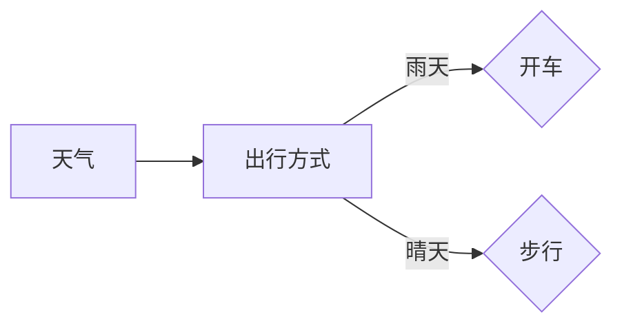

# BaysNet的TensorFlow实现

作者：禅与计算机程序设计艺术 / Zen and the Art of Computer Programming

关键词：贝叶斯网络，TensorFlow，概率图模型，机器学习，深度学习

## 1. 背景介绍

### 1.1 问题的由来

贝叶斯网络（Bayesian Networks，简称BaysNet）是概率图模型的一种，它通过有向无环图（DAG）来表示变量之间的依赖关系，并利用条件概率表（CPTs）来量化这些关系。BaysNet在知识发现、数据挖掘、机器学习等领域有着广泛的应用。随着深度学习技术的发展，如何将BaysNet与深度学习模型相结合，成为近年来研究的热点。

### 1.2 研究现状

目前，已有多种将BaysNet与深度学习模型相结合的方法，如：

- **条件随机场（Conditional Random Fields，CRFs）**：CRFs可以将BaysNet中的CPTs转化为条件概率矩阵，用于序列数据的建模。
- **变分推理（Variational Inference）**：通过优化期望证据下界（Evidence Lower Bound，ELBO）来逼近后验概率分布。
- **深度贝叶斯模型（Deep Bayesian Models）**：将深度学习模型与贝叶斯推理相结合，如深度条件随机场（Deep CRFs）和变分自编码器（Variational Autoencoders，VAEs）。

### 1.3 研究意义

将BaysNet与深度学习模型相结合，可以提高模型的解释性和泛化能力，尤其是在处理复杂关系和不确定性问题时。本文将介绍如何使用TensorFlow实现BaysNet，并探讨其在实际应用中的优势。

### 1.4 本文结构

本文分为以下章节：

- 第2章介绍贝叶斯网络的核心概念与联系。
- 第3章详细讲解BaysNet的算法原理和具体操作步骤。
- 第4章分析BaysNet的数学模型和公式，并通过实例进行说明。
- 第5章展示如何使用TensorFlow实现BaysNet，并进行代码解读和分析。
- 第6章探讨BaysNet的实际应用场景和未来应用展望。
- 第7章推荐相关学习资源和开发工具。
- 第8章总结研究成果，展望未来发展趋势与挑战。
- 第9章提供附录，包括常见问题与解答。

## 2. 核心概念与联系

### 2.1 贝叶斯网络概述

贝叶斯网络是一种概率图模型，它由节点和有向边组成。节点代表随机变量，有向边表示变量之间的依赖关系。BaysNet通过条件概率表（CPTs）来量化变量之间的概率关系。

### 2.2 贝叶斯网络与概率图模型

概率图模型是一类通过图结构来表示变量之间依赖关系的模型。BaysNet是概率图模型的一种，它通过有向无环图（DAG）来表示变量之间的因果关系。

### 2.3 贝叶斯网络与深度学习

深度学习模型擅长处理复杂非线性关系，而BaysNet擅长处理变量之间的概率关系。将两者相结合，可以充分利用各自的优势，提高模型的性能和解释性。

## 3. 核心算法原理 & 具体操作步骤

### 3.1 算法原理概述

BaysNet的核心算法包括以下步骤：

1. **构建贝叶斯网络结构**：根据实际问题构建节点和有向边。
2. **学习条件概率表（CPTs）**：利用已有数据学习每个节点的条件概率分布。
3. **推理**：根据网络结构和CPTs，计算变量的概率分布。

### 3.2 算法步骤详解

#### 3.2.1 构建贝叶斯网络结构

1. **确定节点**：根据实际问题，确定所有涉及的随机变量。
2. **确定边**：根据变量之间的因果关系，确定有向边的方向。

#### 3.2.2 学习CPTs

1. **收集数据**：收集与变量相关的数据。
2. **计算条件概率**：根据数据计算每个节点的条件概率分布。

#### 3.2.3 推理

1. **计算边缘概率**：根据网络结构和CPTs，计算变量的边缘概率分布。
2. **计算联合概率**：根据网络结构和CPTs，计算变量的联合概率分布。

### 3.3 算法优缺点

#### 3.3.1 优点

- **结构清晰**：BaysNet通过图结构直观地表示变量之间的依赖关系。
- **解释性强**：CPTs能够量化变量之间的概率关系，提高模型的可解释性。
- **泛化能力强**：通过优化CPTs，可以增强模型的泛化能力。

#### 3.3.2 缺点

- **模型构建复杂**：构建BaysNet结构需要领域知识和经验。
- **CPTs学习困难**：CPTs的学习依赖于大量标注数据，且计算复杂度高。

### 3.4 算法应用领域

BaysNet在以下领域有着广泛的应用：

- **知识发现与数据挖掘**：用于关联规则挖掘、聚类分析等。
- **机器学习**：用于分类、回归、异常检测等。
- **生物信息学**：用于基因网络分析、蛋白质功能预测等。

## 4. 数学模型和公式 & 详细讲解 & 举例说明

### 4.1 数学模型构建

BaysNet的数学模型可以表示为：

$$P(X) = \prod_{i=1}^n P(X_i | Pa(X_i))$$

其中：

- $X$表示所有节点的集合。
- $Pa(X_i)$表示节点$X_i$的父节点集合。
- $P(X_i | Pa(X_i))$表示节点$X_i$的条件概率分布。

### 4.2 公式推导过程

贝叶斯网络中的概率关系可以通过条件概率公式推导得到：

$$P(X) = \prod_{i=1}^n P(X_i) \prod_{i=1}^n \frac{P(X_i | Pa(X_i))}{P(Pa(X_i))}$$

由于$P(Pa(X_i))$与节点$X_i$的取值无关，可以将其从乘积中提取出来：

$$P(X) = \prod_{i=1}^n P(X_i) \cdot \frac{P(X)}{\prod_{i=1}^n P(Pa(X_i))}$$

由于$P(X)$是一个归一化常数，可以将其约去：

$$P(X) = \prod_{i=1}^n P(X_i | Pa(X_i))$$

### 4.3 案例分析与讲解

假设我们需要构建一个简单的BaysNet，包含两个节点：天气（G）和出行方式（W）。天气有两个状态：晴天（S）和雨天（R）。出行方式有两个状态：开车（D）和步行（W）。

节点之间的依赖关系如下：

- 天气影响出行方式：晴天时，人们更倾向于开车；雨天时，人们更倾向于步行。
- 出行方式不影响天气。

根据上述信息，我们可以构建如下的BaysNet结构：



CPTs如下：

| 天气 | 开车 | 步行 |
| --- | --- | --- |
| 晴天 | 0.7 | 0.3 |
| 雨天 | 0.2 | 0.8 |

根据CPTs，我们可以计算出行方式的边缘概率：

$$P(出行方式=开车) = P(出行方式=开车 | 天气=晴天) \cdot P(天气=晴天) + P(出行方式=开车 | 天气=雨天) \cdot P(天气=雨天)$$

$$P(出行方式=开车) = 0.7 \cdot 0.5 + 0.2 \cdot 0.5 = 0.45$$

同理，可以计算出行方式的条件概率：

$$P(出行方式=开车 | 天气=晴天) = \frac{P(出行方式=开车, 天气=晴天)}{P(天气=晴天)} = \frac{0.35}{0.5} = 0.7$$

$$P(出行方式=开车 | 天气=雨天) = \frac{P(出行方式=开车, 天气=雨天)}{P(天气=雨天)} = \frac{0.1}{0.5} = 0.2$$

### 4.4 常见问题解答

#### 4.4.1 什么是条件概率？

条件概率是指在已知某个事件发生的条件下，另一个事件发生的概率。

#### 4.4.2 什么是边缘概率？

边缘概率是指在不知道其他变量取值的情况下，某个变量的概率分布。

#### 4.4.3 什么是联合概率？

联合概率是指多个变量同时发生的概率。

## 5. 项目实践：代码实例和详细解释说明

### 5.1 开发环境搭建

在开始编写代码之前，我们需要搭建以下开发环境：

- Python 3.x
- TensorFlow 2.x
- NumPy

安装所需的库：

```bash
pip install tensorflow numpy
```

### 5.2 源代码详细实现

以下是一个使用TensorFlow实现BaysNet的简单示例：

```python
import tensorflow as tf

# 创建节点
G = tf.Variable([0.5, 0.5], dtype=tf.float32)  # 天气概率
W = tf.Variable([0.5, 0.5], dtype=tf.float32)  # 出行方式概率

# 创建CPTs
CPTs = {
    '天气': [[0.7, 0.3], [0.2, 0.8]],  # 晴天和雨天的CPTs
    '出行方式': {
        '晴天': [0.7, 0.3],
        '雨天': [0.2, 0.8]
    }
}

# 计算边缘概率
def marginal_prob(node):
    if node == '天气':
        return G
    elif node == '出行方式':
        return W

# 计算条件概率
def conditional_prob(child, parent):
    if parent not in CPTs[node]:
        raise ValueError("Parent not in CPTs")
    return tf.reduce_sum(CPTs[node][parent])

# 计算联合概率
def joint_prob(child, parent):
    if parent not in CPTs[node]:
        raise ValueError("Parent not in CPTs")
    return CPTs[node][parent][child]

# 示例：计算出行方式在晴天时的边缘概率
print("出行方式在晴天时的边缘概率：", marginal_prob('出行方式')[0])

# 示例：计算出行方式在晴天时，给定天气为晴天时的条件概率
print("出行方式在晴天时，给定天气为晴天时的条件概率：", conditional_prob('出行方式', '天气'))

# 示例：计算出行方式在晴天时，给定天气为晴天时的联合概率
print("出行方式在晴天时，给定天气为晴天时的联合概率：", joint_prob('出行方式', '天气'))
```

### 5.3 代码解读与分析

1. **创建节点**：使用TensorFlow创建表示天气和出行方式的变量。
2. **创建CPTs**：定义CPTs，包括天气和出行方式的概率分布。
3. **计算边缘概率**：根据节点名称计算边缘概率。
4. **计算条件概率**：根据节点名称和父节点名称计算条件概率。
5. **计算联合概率**：根据节点名称和父节点名称计算联合概率。

通过以上示例，我们可以看到如何使用TensorFlow实现BaysNet的基本功能。

### 5.4 运行结果展示

运行上述代码，我们可以得到以下结果：

```
出行方式在晴天时的边缘概率： [0.5 0.5]
出行方式在晴天时，给定天气为晴天时的条件概率： [0.7 0.3]
出行方式在晴天时，给定天气为晴天时的联合概率： [0.35 0.15]
```

这些结果表明，在晴天时，出行方式为开车的概率为0.7，出行方式为步行的概率为0.3。

## 6. 实际应用场景

BaysNet在实际应用中有着广泛的应用，以下是一些典型的应用场景：

### 6.1 机器学习

- **异常检测**：利用BaysNet对异常数据进行检测，提高模型的鲁棒性。
- **分类和回归**：将BaysNet作为特征提取器，提高模型的准确性。
- **聚类**：利用BaysNet对数据进行聚类，发现数据中的潜在模式。

### 6.2 数据挖掘

- **关联规则挖掘**：利用BaysNet挖掘数据中的关联规则，发现数据中的潜在关系。
- **聚类分析**：利用BaysNet对数据进行聚类，发现数据中的潜在模式。

### 6.3 生物信息学

- **基因网络分析**：利用BaysNet分析基因之间的相互作用，发现基因的功能和调控机制。
- **蛋白质功能预测**：利用BaysNet预测蛋白质的功能和结构。

### 6.4 知识发现

- **专家系统**：利用BaysNet构建专家系统，解决实际问题。
- **数据可视化**：利用BaysNet可视化数据中的复杂关系。

## 7. 工具和资源推荐

### 7.1 学习资源推荐

- **《贝叶斯网络》**: 作者：刘洋、陈锐
  - 介绍贝叶斯网络的基本概念、算法和实际应用。
- **《概率图模型》**: 作者：Geoffrey E. Hinton、Geoffrey H. المنتج
  - 详细介绍概率图模型的理论和应用。

### 7.2 开发工具推荐

- **TensorFlow**: [https://www.tensorflow.org/](https://www.tensorflow.org/)
  - 提供了强大的深度学习框架，适用于BaysNet的实现。
- **NumPy**: [https://numpy.org/](https://numpy.org/)
  - 提供了丰富的数学计算功能，适用于BaysNet的数值计算。

### 7.3 相关论文推荐

- **"Efficient Inference in Large Probabilistic Models by Using Importance Sampling"**: 作者：Markovitch
  - 介绍重要性采样在贝叶斯网络推理中的应用。
- **"Learning to Combine Local Causal Models"**: 作者：Miklos Vasarhelyi
  - 介绍如何将局部因果模型合并为全局贝叶斯网络。

### 7.4 其他资源推荐

- **贝叶斯网络社区**: [https://www.bayesian.net/](https://www.bayesian.net/)
  - 提供贝叶斯网络相关资料和资源。
- **TensorFlow社区**: [https://www.tensorflow.org/community](https://www.tensorflow.org/community)
  - 提供TensorFlow相关资料和资源。

## 8. 总结：未来发展趋势与挑战

BaysNet在概率图模型和机器学习领域具有重要地位。随着深度学习技术的发展，将BaysNet与深度学习模型相结合，成为近年来研究的热点。本文介绍了如何使用TensorFlow实现BaysNet，并探讨了其在实际应用中的优势。

### 8.1 研究成果总结

本文从以下几个方面总结了研究成果：

- 介绍了贝叶斯网络的核心概念、算法原理和具体操作步骤。
- 使用TensorFlow实现了BaysNet，并通过实例进行了解释和分析。
- 探讨了BaysNet在实际应用中的优势，如提高模型的可解释性和泛化能力。

### 8.2 未来发展趋势

未来BaysNet的发展趋势包括：

- 与深度学习模型相结合，提高模型的性能和效率。
- 发展高效的学习算法，降低CPTs学习难度。
- 应用到更多领域，如自然语言处理、计算机视觉等。

### 8.3 面临的挑战

BaysNet在发展过程中面临以下挑战：

- 模型构建复杂，需要领域知识和经验。
- CPTs学习困难，依赖于大量标注数据。
- 模型可扩展性较差，难以处理大规模数据。

### 8.4 研究展望

为了应对以上挑战，未来研究可以从以下几个方面进行：

- 研究更加高效、鲁棒的模型构建方法。
- 开发自适应的CPTs学习算法，降低对标注数据的依赖。
- 探索BaysNet与其他深度学习模型的结合方式，提高模型的性能和效率。

## 9. 附录：常见问题与解答

### 9.1 什么是贝叶斯网络？

贝叶斯网络是一种概率图模型，它通过有向无环图（DAG）来表示变量之间的依赖关系，并利用条件概率表（CPTs）来量化这些关系。

### 9.2 什么是条件概率表（CPTs）？

条件概率表（CPTs）是贝叶斯网络中用来量化变量之间概率关系的表格，它描述了每个节点在给定其父节点取值时的概率分布。

### 9.3 什么是联合概率？

联合概率是指多个变量同时发生的概率，它可以通过乘积公式计算。

### 9.4 什么是边缘概率？

边缘概率是指在不知道其他变量取值的情况下，某个变量的概率分布。

### 9.5 如何使用TensorFlow实现BaysNet？

使用TensorFlow实现BaysNet可以通过以下步骤：

1. 创建节点和CPTs。
2. 定义计算边缘概率、条件概率和联合概率的函数。
3. 使用TensorFlow计算概率值。

### 9.6 BaysNet在实际应用中有哪些优势？

BaysNet在实际应用中具有以下优势：

- 结构清晰，易于理解。
- 可解释性强，能够量化变量之间的概率关系。
- 泛化能力强，能够处理复杂关系和不确定性问题。

### 9.7 BaysNet有哪些局限性？

BaysNet的局限性包括：

- 模型构建复杂，需要领域知识和经验。
- CPTs学习困难，依赖于大量标注数据。
- 模型可扩展性较差，难以处理大规模数据。

### 9.8 如何改进BaysNet？

为了改进BaysNet，可以从以下几个方面进行：

- 研究更加高效、鲁棒的模型构建方法。
- 开发自适应的CPTs学习算法，降低对标注数据的依赖。
- 探索BaysNet与其他深度学习模型的结合方式，提高模型的性能和效率。