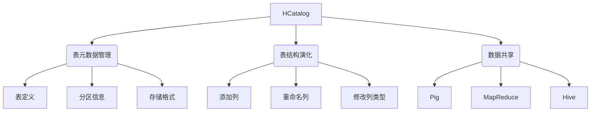

# HCatalog Table 原理与代码实例讲解

## 1. 背景介绍

### 1.1 问题的由来

在大数据时代,海量的结构化和非结构化数据源源不断地产生,对于数据的存储、管理和分析变得越来越重要和具有挑战性。Apache Hive 作为基于 Hadoop 的数据仓库工具,为大数据场景下的数据分析提供了强大的 SQL 查询能力。然而,随着数据量的不断增长和应用场景的多样化,Hive 在元数据管理、表结构演化、数据共享等方面面临着新的挑战。

### 1.2 研究现状

为了解决上述问题,Apache 社区推出了 HCatalog,作为 Hive 元数据服务层的一个重要组件。HCatalog 提供了一个统一的元数据管理层,支持不同的数据处理工具(如 Pig、MapReduce、Hive 等)共享和访问相同的元数据。它还支持表结构演化,使得在不丢失数据的情况下,可以对表结构进行修改和升级。

### 1.3 研究意义

深入理解 HCatalog 的原理和实现机制,对于构建高效、可扩展的大数据平台至关重要。本文将全面剖析 HCatalog 的核心概念、算法原理、数学模型、代码实现等,为读者提供一个全景式的视角,帮助读者掌握 HCatalog 的本质,并在实际项目中更好地应用和优化该技术。

### 1.4 本文结构

本文将从以下几个方面深入探讨 HCatalog:

1. 核心概念与联系
2. 核心算法原理与具体操作步骤
3. 数学模型和公式详细讲解与案例分析
4. 项目实践:代码实例和详细解释说明
5. 实际应用场景
6. 工具和资源推荐
7. 总结:未来发展趋势与挑战
8. 附录:常见问题与解答

## 2. 核心概念与联系



HCatalog 作为 Hive 的元数据服务层,主要包括以下三个核心概念:

1. **表元数据管理**: HCatalog 提供了一个统一的元数据管理层,用于存储和管理表的元数据信息,包括表定义、分区信息、存储格式等。

2. **表结构演化**: HCatalog 支持在不丢失数据的情况下,对表结构进行修改和升级,如添加列、重命名列、修改列类型等。

3. **数据共享**: HCatalog 使得不同的数据处理工具(如 Pig、MapReduce、Hive 等)可以共享和访问相同的元数据,从而实现数据的互操作性。

这三个核心概念相互关联、相辅相成,共同构建了 HCatalog 的核心功能和价值。

## 3. 核心算法原理与具体操作步骤

### 3.1 算法原理概述

HCatalog 的核心算法原理基于元数据的统一管理和表结构演化的支持。它采用了一种分层的元数据存储架构,将元数据分为两个层次:

1. **存储层**: 使用关系数据库(如 MySQL)存储表的元数据信息,包括表定义、分区信息、存储格式等。

2. **缓存层**: 在内存中维护一个元数据缓存,用于加速元数据的读取和写入操作。

当需要访问或修改表的元数据时,HCatalog 首先会查询内存缓存,如果缓存中没有相应的元数据,则会从存储层中加载。修改元数据时,首先更新内存缓存,然后异步地将变更写入存储层。

### 3.2 算法步骤详解

1. **初始化**: 在启动时,HCatalog 会从存储层加载所有表的元数据信息到内存缓存中。

2. **读取元数据**:
    a. 查询内存缓存,如果缓存中存在所需的元数据,直接返回。
    b. 如果缓存中不存在,则从存储层加载相应的元数据到缓存,并返回。

3. **修改元数据**:
    a. 更新内存缓存中的元数据。
    b. 异步地将变更写入存储层,以确保元数据的持久性。

4. **表结构演化**:
    a. 验证表结构变更的合法性和一致性。
    b. 更新内存缓存中的表结构信息。
    c. 异步地将新的表结构写入存储层。
    d. 根据需要,对已存储的数据进行相应的转换和调整。

5. **数据共享**:
    a. 不同的数据处理工具通过 HCatalog 客户端访问统一的元数据。
    b. 根据元数据信息,各工具可以读取和处理相同的数据集。

### 3.3 算法优缺点

**优点**:

1. **元数据统一管理**: 提供了一个统一的元数据管理层,简化了元数据的维护和访问。

2. **表结构演化**: 支持在不丢失数据的情况下,对表结构进行修改和升级,提高了数据管理的灵活性。

3. **数据共享**: 不同的数据处理工具可以共享和访问相同的元数据,实现了数据的互操作性。

4. **高性能**: 采用分层缓存机制,加速了元数据的读取和写入操作。

**缺点**:

1. **增加了系统复杂性**: 引入了额外的元数据管理层,增加了系统的复杂性和维护成本。

2. **元数据一致性**: 需要确保内存缓存和存储层之间的元数据一致性,否则可能导致数据不一致或丢失。

3. **扩展性**: 随着数据量和并发访问量的增加,单节点元数据服务可能会成为性能瓶颈。

### 3.4 算法应用领域

HCatalog 算法主要应用于以下领域:

1. **大数据处理**: 在 Hadoop 生态系统中,HCatalog 为不同的数据处理工具(如 Pig、MapReduce、Hive 等)提供了统一的元数据管理和访问接口,支持数据的互操作性和共享。

2. **数据仓库**: HCatalog 可以作为数据仓库的元数据管理组件,支持表结构演化和数据治理,满足企业级数据管理的需求。

3. **数据湖**: 在构建数据湖时,HCatalog 可以提供元数据管理和数据发现功能,帮助组织有效地管理和利用海量的数据资产。

4. **云计算**: 在云环境下,HCatalog 可以为多租户提供元数据隔离和共享,支持数据的安全访问和管理。

## 4. 数学模型和公式详细讲解与举例说明

在 HCatalog 中,一个重要的概念是表结构演化,即在不丢失数据的情况下,对表结构进行修改和升级。这个过程涉及到一些数学模型和公式,用于确保数据的一致性和完整性。

### 4.1 数学模型构建

假设一个表 T 的初始结构为:

$$
T = (C_1, C_2, \ldots, C_n)
$$

其中 $C_i$ 表示第 i 个列,共有 n 个列。

现在需要对表结构进行修改,例如添加一个新列 $C_{n+1}$,新的表结构为:

$$
T' = (C_1, C_2, \ldots, C_n, C_{n+1})
$$

为了确保数据的一致性,我们需要构建一个映射函数 $f$,将旧表结构中的数据行映射到新表结构中:

$$
f: T \rightarrow T'
$$

其中,对于任意一行数据 $r = (v_1, v_2, \ldots, v_n)$,映射函数 $f$ 的定义如下:

$$
f(r) = (v_1, v_2, \ldots, v_n, \text{default}(C_{n+1}))
$$

其中 $\text{default}(C_{n+1})$ 表示新添加列 $C_{n+1}$ 的默认值。

通过这个映射函数,我们可以将旧表结构中的所有数据行转换为新表结构,从而实现表结构的平滑升级。

### 4.2 公式推导过程

在上述数学模型的基础上,我们可以进一步推导出一些公式,用于描述表结构演化过程中的数据转换规则。

假设旧表结构为 $T$,新表结构为 $T'$,映射函数为 $f$,则对于任意一行数据 $r \in T$,我们有:

$$
f(r) \in T'
$$

也就是说,通过映射函数 $f$,旧表结构中的任意一行数据都可以被转换为新表结构中的一行数据。

进一步,我们可以定义一个逆映射函数 $g$,用于将新表结构中的数据行映射回旧表结构:

$$
g: T' \rightarrow T
$$

对于任意一行数据 $r' \in T'$,逆映射函数 $g$ 的定义如下:

$$
g(r') = (v_1, v_2, \ldots, v_n)
$$

其中 $(v_1, v_2, \ldots, v_n)$ 是 $r'$ 中前 n 个列的值。

通过这个逆映射函数,我们可以从新表结构中恢复出旧表结构中的数据,从而确保数据的完整性。

### 4.3 案例分析与讲解

为了更好地理解上述数学模型和公式,我们来看一个具体的案例。

假设我们有一个表 `students`,初始结构如下:

```
students(id, name, age)
```

现在需要为这个表添加一个新列 `gender`,表结构变为:

```
students(id, name, age, gender)
```

根据前面的数学模型,我们可以构建一个映射函数 $f$,将旧表结构中的数据行映射到新表结构中:

$$
f(r) = (v_1, v_2, v_3, \text{default}(\text{gender}))
$$

其中 $v_1$、$v_2$、$v_3$ 分别表示 `id`、`name`、`age` 列的值,`default(gender)` 表示新添加的 `gender` 列的默认值,假设为 `'未知'`。

例如,对于一行数据 `(1, 'Alice', 20)`,通过映射函数 $f$,我们可以得到新表结构中的一行数据:

$$
f((1, \text{'Alice'}, 20)) = (1, \text{'Alice'}, 20, \text{'未知'})
$$

同时,我们也可以定义一个逆映射函数 $g$,用于从新表结构中恢复出旧表结构的数据:

$$
g(r') = (v_1, v_2, v_3)
$$

对于新表结构中的一行数据 `(1, 'Alice', 20, '女')`,通过逆映射函数 $g$,我们可以恢复出旧表结构中的数据:

$$
g((1, \text{'Alice'}, 20, \text{'女'})) = (1, \text{'Alice'}, 20)
$$

通过这个案例,我们可以看到数学模型和公式如何应用于表结构演化过程中,确保数据的一致性和完整性。

### 4.4 常见问题解答

1. **问题**: 在表结构演化过程中,如何处理已存储的数据?

   **解答**: HCatalog 会自动构建映射函数,将旧表结构中的数据转换为新表结构。对于新添加的列,可以设置默认值或者通过自定义函数进行转换。已存储的数据不会丢失,但可能需要进行相应的调整和转换。

2. **问题**: 如果删除了一个列,会发生什么情况?

   **解答**: 如果删除了一个列,HCatalog 会自动构建逆映射函数,从新表结构中恢复出旧表结构的数据。删除的列的数据会被丢弃,但其他列的数据不会受到影响。

3. **问题**: 表结构演化是否支持修改列的数据类型?

   **解答**: 是的,HCatalog 支持修改列的数据类型。在这种