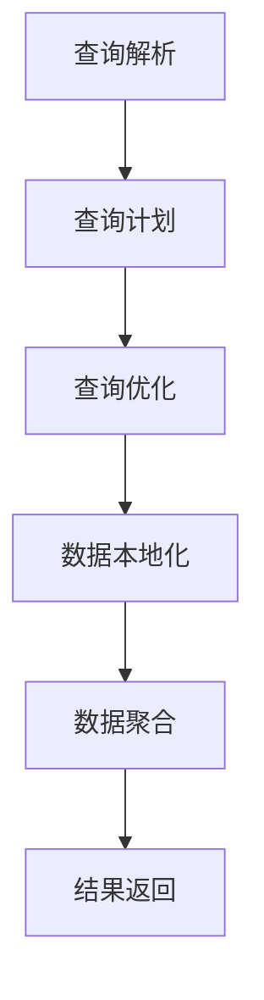

# Impala原理与代码实例讲解

作者：禅与计算机程序设计艺术 / Zen and the Art of Computer Programming

## 1. 背景介绍

### 1.1 问题的由来

随着大数据时代的到来，数据量呈爆炸式增长，对数据的处理和分析成为了一个巨大的挑战。传统的数据处理系统往往难以满足大数据量、高并发和实时性的需求。为了解决这一问题，分布式计算技术应运而生。Apache Impala就是其中之一，它是一个开源的、基于Hadoop的、高性能的、可扩展的分布式查询引擎。

### 1.2 研究现状

Impala自2012年开源以来，已经经历了多个版本的迭代，功能不断完善，性能不断提升。目前，Impala已经在多个企业级场景中得到了广泛应用，成为大数据处理领域的重要工具之一。

### 1.3 研究意义

Impala的研究意义在于：

1. 降低大数据处理门槛：Impala使得用户可以像使用SQL一样查询大数据，降低了大数据处理的技术门槛。
2. 提高数据处理效率：Impala采用C++编写，执行速度快，能够满足实时性要求。
3. 促进数据分析和挖掘：Impala为数据分析和挖掘提供了强大的工具，有助于发现数据中的价值。

### 1.4 本文结构

本文将首先介绍Impala的核心概念和原理，然后通过代码实例讲解Impala的使用方法，最后探讨Impala在实际应用场景中的表现和未来发展趋势。

## 2. 核心概念与联系

### 2.1 分布式计算

分布式计算是一种将任务分解成多个子任务，并在多个计算节点上并行执行的技术。分布式计算可以提高数据处理速度，提高系统可用性和可靠性。

### 2.2 Hadoop

Hadoop是一个开源的大数据处理框架，包括HDFS（Hadoop Distributed File System）和YARN（Yet Another Resource Negotiator）等组件。HDFS用于存储大规模数据集，YARN用于资源管理和任务调度。

### 2.3 Impala

Impala是一个基于Hadoop的分布式查询引擎，它允许用户使用SQL查询Hadoop存储的数据。Impala具有以下特点：

1. **基于HDFS**：Impala直接查询存储在HDFS上的数据，无需数据迁移。
2. **高性能**：Impala采用C++编写，执行速度快，能够满足实时性要求。
3. **可扩展性**：Impala可以轻松扩展到数千台机器。

## 3. 核心算法原理 & 具体操作步骤

### 3.1 算法原理概述

Impala的核心算法原理如下：

1. **查询分发**：Impala将查询请求分发到Hadoop集群的各个节点。
2. **数据本地化**：Impala将数据请求发送到存储数据所在的节点。
3. **数据聚合**：Impala对数据进行聚合处理，并将结果返回给客户端。

### 3.2 算法步骤详解

1. **查询解析**：Impala将SQL查询转换为内部表示形式。
2. **查询优化**：Impala根据查询计划进行优化，包括数据本地化、数据分区等。
3. **查询执行**：Impala将查询计划分发到Hadoop集群的各个节点执行。
4. **数据聚合**：Impala对各个节点返回的数据进行聚合处理。
5. **结果返回**：Impala将最终结果返回给客户端。

### 3.3 算法优缺点

**优点**：

1. **高性能**：Impala采用C++编写，执行速度快，能够满足实时性要求。
2. **可扩展性**：Impala可以轻松扩展到数千台机器。
3. **易于使用**：Impala支持SQL，降低了大数据处理的技术门槛。

**缺点**：

1. **不支持事务**：Impala不支持事务，可能不适合对数据一致性要求较高的场景。
2. **不适合存储大量小文件**：Impala对存储大量小文件的情况处理效率较低。

### 3.4 算法应用领域

Impala适用于以下场景：

1. **大数据查询**：Impala可以快速查询Hadoop存储的大规模数据集。
2. **实时分析**：Impala能够满足实时性要求，适用于实时数据分析场景。
3. **数据仓库**：Impala可以作为数据仓库的一部分，用于存储和查询历史数据。

## 4. 数学模型和公式 & 详细讲解 & 举例说明

### 4.1 数学模型构建

Impala的数学模型主要涉及查询优化和执行过程。以下是一个简单的查询优化模型：



### 4.2 公式推导过程

在Impala中，查询优化主要涉及以下公式：

$$
C = \frac{O}{S} \times P
$$

其中：

- $C$为查询成本
- $O$为查询计划中的操作数
- $S$为数据集大小
- $P$为操作数在数据集中的分布

通过计算查询成本，Impala可以找到最优的查询计划。

### 4.3 案例分析与讲解

假设有一个包含100万条记录的表A，我们需要查询所有年龄大于30岁的记录。

```sql
SELECT * FROM A WHERE age > 30;
```

Impala将首先进行查询解析，将SQL语句转换为内部表示形式。然后，Impala进行查询优化，计算各个查询计划的成本，并找到最优计划。

假设有两个查询计划：

1. 计划1：对整个表A进行扫描，然后过滤出年龄大于30岁的记录。
2. 计划2：根据年龄字段进行索引，然后直接查询年龄大于30岁的记录。

通过计算查询成本，Impala可以找到最优计划。

### 4.4 常见问题解答

**Q：Impala如何处理大数据集？**

A：Impala通过将查询请求分发到Hadoop集群的各个节点，并行处理数据来处理大数据集。

**Q：Impala是否支持事务？**

A：Impala不支持事务，可能不适合对数据一致性要求较高的场景。

**Q：Impala如何优化查询性能？**

A：Impala通过查询优化、数据本地化、数据分区等方式来优化查询性能。

## 5. 项目实践：代码实例和详细解释说明

### 5.1 开发环境搭建

1. 安装Java开发环境，版本要求与Hadoop兼容。
2. 安装Hadoop集群。
3. 安装Impala。

### 5.2 源代码详细实现

以下是一个简单的Impala查询示例：

```sql
SELECT * FROM sales WHERE region = 'East' AND year = 2020;
```

该查询将返回东部地区2020年的销售数据。

### 5.3 代码解读与分析

1. **查询解析**：Impala将SQL语句转换为内部表示形式。
2. **查询优化**：Impala根据查询计划进行优化，包括数据本地化、数据分区等。
3. **查询执行**：Impala将查询计划分发到Hadoop集群的各个节点执行。
4. **数据聚合**：Impala对各个节点返回的数据进行聚合处理。
5. **结果返回**：Impala将最终结果返回给客户端。

### 5.4 运行结果展示

运行上述查询后，将返回东部地区2020年的销售数据。

## 6. 实际应用场景

### 6.1 大数据查询

Impala可以用于大数据查询场景，例如：

1. 数据仓库：Impala可以作为数据仓库的一部分，用于存储和查询历史数据。
2. 实时分析：Impala可以满足实时性要求，适用于实时数据分析场景。

### 6.2 数据挖掘

Impala可以用于数据挖掘场景，例如：

1. 用户行为分析：Impala可以用于分析用户行为数据，发现用户喜好和趋势。
2. 市场分析：Impala可以用于分析市场数据，发现市场规律和趋势。

## 7. 工具和资源推荐

### 7.1 学习资源推荐

1. Apache Impala官方文档：[https://impala.apache.org/documentation.html](https://impala.apache.org/documentation.html)
2. 《Apache Impala: High-Performance Analytic Database for Hadoop》

### 7.2 开发工具推荐

1. Impala shell：用于执行Impala查询。
2. Beeline：用于图形化界面操作Impala。

### 7.3 相关论文推荐

1. "Impala: A Modern, Open-Source, SQL-on-Hadoop Query Engine" by Ashish Thusoo et al.
2. "Hive on Spark and Impala on Spark: Performance Comparison" by Qiang Chen et al.

### 7.4 其他资源推荐

1. Apache Hadoop官方文档：[https://hadoop.apache.org/docs/r3.3.1/hadoop-project-dist/hadoop-common/](https://hadoop.apache.org/docs/r3.3.1/hadoop-project-dist/hadoop-common/)
2. Apache Hive官方文档：[https://hive.apache.org/documentation.html](https://hive.apache.org/documentation.html)

## 8. 总结：未来发展趋势与挑战

### 8.1 研究成果总结

本文详细介绍了Impala的原理、算法、应用场景和代码实例，为读者提供了全面了解Impala的参考。

### 8.2 未来发展趋势

1. **性能优化**：Impala将继续优化性能，提高处理速度和吞吐量。
2. **功能扩展**：Impala将扩展更多功能，如支持事务、图处理等。
3. **生态融合**：Impala将与更多生态系统集成，如Spark、Flink等。

### 8.3 面临的挑战

1. **数据安全性**：Impala需要进一步提高数据安全性，确保数据隐私和完整性。
2. **可扩展性**：Impala需要进一步提高可扩展性，以应对更大规模的数据集。
3. **跨平台兼容性**：Impala需要提高跨平台兼容性，以支持更多操作系统和硬件平台。

### 8.4 研究展望

Impala作为大数据处理领域的重要工具，将继续发展壮大。未来，Impala将在性能、功能、安全性等方面取得更大的突破，为大数据应用提供更加强大的支持。

## 9. 附录：常见问题与解答

### 9.1 什么是Impala？

A：Impala是一个开源的、基于Hadoop的、高性能的、可扩展的分布式查询引擎。

### 9.2 Impala与其他大数据查询引擎相比有哪些优势？

A：Impala具有高性能、可扩展性、易于使用等优势，适用于大数据查询场景。

### 9.3 Impala是否支持事务？

A：Impala不支持事务，可能不适合对数据一致性要求较高的场景。

### 9.4 如何在Hadoop集群上部署Impala？

A：请参考Apache Impala官方文档中的安装指南。

### 9.5 如何编写Impala查询？

A：Impala支持SQL，请参考SQL语法规范编写查询语句。

通过本文的讲解，相信读者已经对Impala有了全面的认识。希望本文能为读者在实际应用中更好地使用Impala提供帮助。