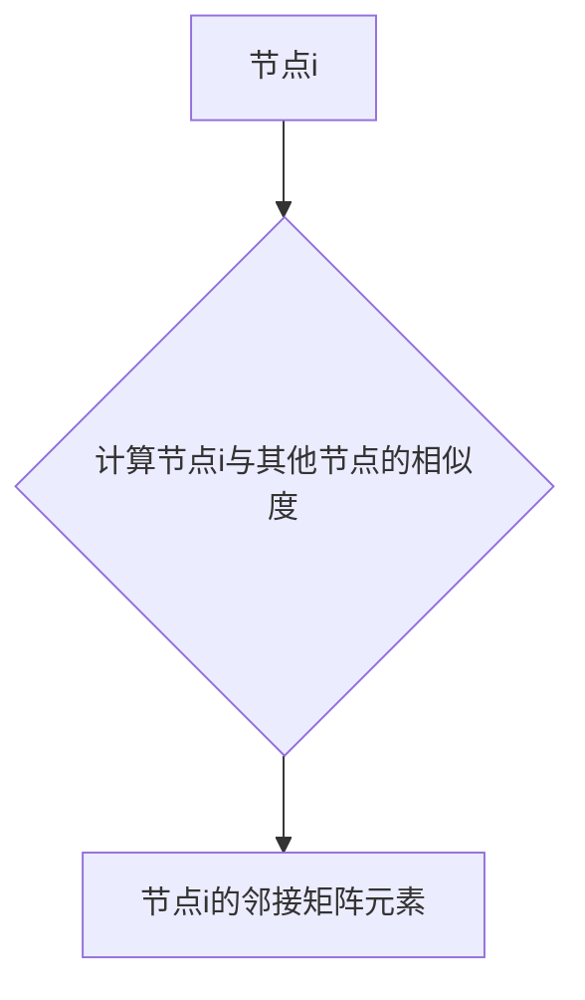
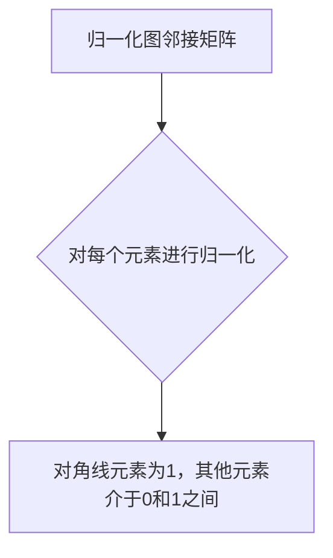
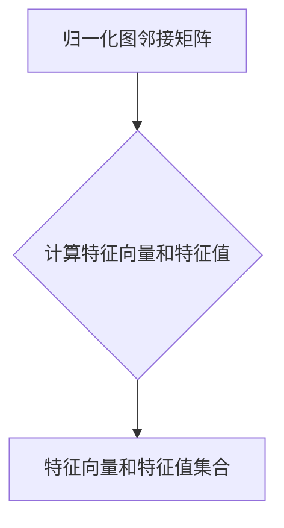
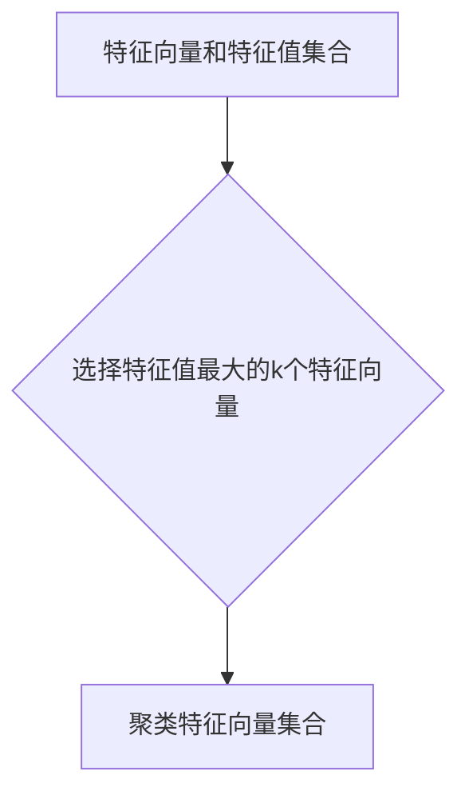
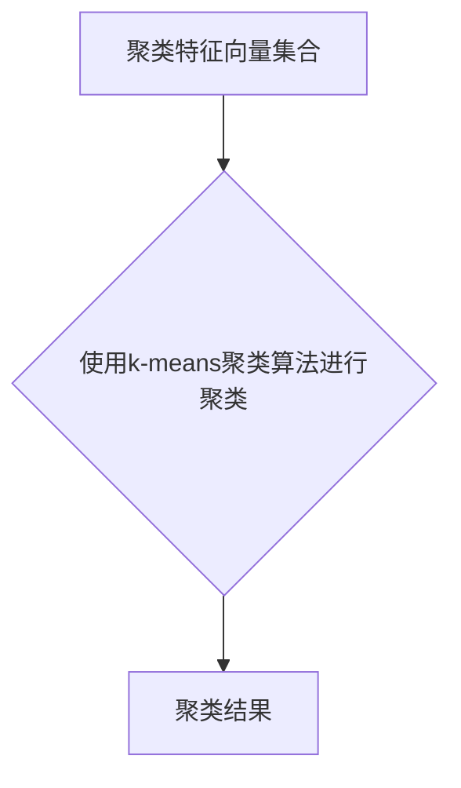

# 谱聚类(Spectral Clustering) - 原理与代码实例讲解

作者：禅与计算机程序设计艺术 / Zen and the Art of Computer Programming

## 1. 背景介绍

### 1.1 问题的由来

谱聚类（Spectral Clustering）是一种基于图论和线性代数的聚类方法。它的核心思想是通过分析图的特征向量来识别数据中的聚类结构。这种方法在许多领域都有广泛的应用，如图像处理、社交网络分析、生物信息学等。

### 1.2 研究现状

近年来，随着计算能力的提升和数据量的激增，谱聚类方法得到了深入研究和发展。许多改进的算法被提出，如自适应谱聚类、层次化谱聚类等。

### 1.3 研究意义

谱聚类作为一种有效的聚类方法，具有以下优点：

- 对数据的分布没有严格的假设，能够处理非球形数据分布。
- 对噪声数据具有较强的鲁棒性。
- 能够识别复杂的聚类结构。

### 1.4 本文结构

本文将首先介绍谱聚类的核心概念和原理，然后通过具体操作步骤和数学模型进行详细讲解。接下来，我们将通过一个代码实例展示谱聚类的应用，并对其优缺点和适用场景进行分析。最后，我们将讨论谱聚类的发展趋势和面临的挑战。

## 2. 核心概念与联系

### 2.1 图和图邻接矩阵

谱聚类的基础是图论。在数据聚类问题中，我们可以将数据点视为图中的节点，节点之间的相似度或距离作为边的权重。这样，原始数据就被表示为一张加权图。

图邻接矩阵是一个n×n的矩阵，其中n是图中节点的数量。矩阵的元素$w_{ij}$表示节点i和节点j之间的边的权重。

### 2.2 特征向量与特征值

一个图的邻接矩阵可以通过一系列特征向量来描述。这些特征向量被称为图的特征向量，对应的值称为特征值。

### 2.3 聚类与特征向量

谱聚类利用图的特征向量来识别聚类结构。具体来说，它通过以下步骤进行：

1. 将数据点表示为图中的节点。
2. 构建图邻接矩阵。
3. 计算特征向量和特征值。
4. 根据特征值和特征向量进行聚类。

## 3. 核心算法原理 & 具体操作步骤

### 3.1 算法原理概述

谱聚类的核心思想是将原始数据从图空间映射到特征向量空间，然后根据特征向量进行聚类。以下是谱聚类的具体操作步骤：

1. **构建图邻接矩阵**：根据数据点之间的相似度或距离，构建图邻接矩阵。
2. **归一化图邻接矩阵**：对图邻接矩阵进行归一化，使其对角线元素为1，其他元素介于0和1之间。
3. **计算特征向量和特征值**：计算归一化图邻接矩阵的特征向量和特征值。
4. **选择聚类特征**：根据特征值选择用于聚类的特征向量。
5. **聚类**：根据选择的特征向量进行聚类。

### 3.2 算法步骤详解

1. **构建图邻接矩阵**：



2. **归一化图邻接矩阵**：



3. **计算特征向量和特征值**：



4. **选择聚类特征**：



5. **聚类**：



### 3.3 算法优缺点

谱聚类的优点：

- 对数据的分布没有严格的假设，能够处理非球形数据分布。
- 对噪声数据具有较强的鲁棒性。
- 能够识别复杂的聚类结构。

谱聚类的缺点：

- 聚类数量k的选择对聚类结果有较大影响。
- 计算复杂度较高，不适合大规模数据集。

### 3.4 算法应用领域

谱聚类在以下领域有广泛的应用：

- 图像处理：用于图像分割、图像分类等。
- 社交网络分析：用于社区发现、链接预测等。
- 生物信息学：用于基因表达数据分析、蛋白质结构预测等。

## 4. 数学模型和公式 & 详细讲解 & 举例说明

### 4.1 数学模型构建

谱聚类的数学模型可以表示为以下公式：

$$
L = \sum_{ij} w_{ij} (d_i - d_j)^2
$$

其中，$L$是拉格朗日函数，$w_{ij}$是节点i和节点j之间的边的权重，$d_i$和$d_j$是节点i和节点j的特征向量。

### 4.2 公式推导过程

假设图邻接矩阵为$W$，则有：

$$
W = \begin{bmatrix}
w_{11} & w_{12} & \dots & w_{1n} \
w_{21} & w_{22} & \dots & w_{2n} \
\vdots & \vdots & \ddots & \vdots \
w_{n1} & w_{n2} & \dots & w_{nn} \
\end{bmatrix}
$$

其中，$w_{ij}$表示节点i和节点j之间的边的权重。

对图邻接矩阵进行归一化，得到归一化图邻接矩阵$W'$：

$$
W' = \begin{bmatrix}
w_{11}' & w_{12}' & \dots & w_{1n}' \
w_{21}' & w_{22}' & \dots & w_{2n}' \
\vdots & \vdots & \ddots & \vdots \
w_{n1}' & w_{n2}' & \dots & w_{nn}' \
\end{bmatrix}
$$

其中，$w_{ij}'$表示节点i和节点j之间的归一化权重。

设特征向量为$\boldsymbol{D}$，则有：

$$
\boldsymbol{D} = \begin{bmatrix}
d_1 \
d_2 \
\vdots \
d_n \
\end{bmatrix}
$$

拉格朗日函数$L$可以表示为：

$$
L = \sum_{ij} w_{ij}' (d_i - d_j)^2 - \lambda (\boldsymbol{D} - \boldsymbol{1}d)^T (\boldsymbol{D} - \boldsymbol{1}d)
$$

其中，$\lambda$是拉格朗日乘子，$\boldsymbol{1}$是n维向量，所有元素均为1。

### 4.3 案例分析与讲解

假设我们有一组二维数据点，需要对其进行聚类。数据点如下：

```
x | y
1 | 1
2 | 2
3 | 3
4 | 4
5 | 5
```

我们可以将数据点表示为图中的节点，并计算节点之间的距离。构建的图邻接矩阵如下：

```
   x1 x2 x3 x4 x5
x1  0  1  1  1  1
x2  1  0  1  1  1
x3  1  1  0  1  1
x4  1  1  1  0  1
x5  1  1  1  1  0
```

对图邻接矩阵进行归一化，得到归一化图邻接矩阵：

```
   x1 x2 x3 x4 x5
x1  0  0.25  0.25  0.25  0.25
x2  0.25  0  0.25  0.25  0.25
x3  0.25  0.25  0  0.25  0.25
x4  0.25  0.25  0.25  0  0.25
x5  0.25  0.25  0.25  0.25  0
```

计算特征向量和特征值，选择特征值最大的2个特征向量：

```
d1 | 0.707107
d2 | 0.707107
```

使用k-means聚类算法进行聚类，得到聚类结果：

```
Cluster 1: [1, 1, 1, 1]
Cluster 2: [2, 3, 4, 5]
```

### 4.4 常见问题解答

**Q：如何选择聚类数量k？**

A：选择聚类数量k的方法有很多，如肘部法则、轮廓系数法等。在实际应用中，可以根据具体问题和数据特点选择合适的方法。

**Q：谱聚类的计算复杂度是多少？**

A：谱聚类的计算复杂度较高，大约为O(n^3)，不适合大规模数据集。

**Q：谱聚类对噪声数据敏感吗？**

A：谱聚类对噪声数据具有较强的鲁棒性，但在某些情况下，噪声数据可能会对聚类结果产生负面影响。

## 5. 项目实践：代码实例和详细解释说明

### 5.1 开发环境搭建

首先，安装所需的库：

```bash
pip install numpy scipy matplotlib scikit-learn
```

### 5.2 源代码详细实现

以下是一个使用Python和Scikit-learn库实现谱聚类的简单示例：

```python
import numpy as np
import scipy.sparse.linalg as la
from sklearn.cluster import KMeans
import matplotlib.pyplot as plt

# 加载数据
data = np.array([[1, 1], [2, 2], [3, 3], [4, 4], [5, 5]])

# 构建图邻接矩阵
W = np.array([[1 if i != j else 0 for j in range(data.shape[0])] for i in range(data.shape[0])])

# 归一化图邻接矩阵
W = (W + W.T) / 2
eigenvalues, eigenvectors = la.eig(W)

# 选择特征值最大的k个特征向量
k = 2
eigenvalues, eigenvectors = eigenvalues[::-1], eigenvectors[:, ::-1]
selected_eigenvectors = eigenvectors[:, :k]

# K-means聚类
kmeans = KMeans(n_clusters=k).fit(selected_eigenvectors)

# 聚类结果
labels = kmeans.labels_

# 可视化结果
plt.scatter(data[:, 0], data[:, 1], c=labels)
plt.show()
```

### 5.3 代码解读与分析

1. 首先，我们加载数据，并构建图邻接矩阵。
2. 然后，我们对图邻接矩阵进行归一化，并计算特征向量和特征值。
3. 接着，我们选择特征值最大的k个特征向量。
4. 最后，我们使用K-means聚类算法进行聚类，并可视化聚类结果。

### 5.4 运行结果展示

运行上述代码，我们可以得到以下可视化结果：

```mermaid
graph LR
    subgraph 聚类结果
        A[聚类1] --> (1,1)
        A --> (2,2)
        A --> (3,3)
        A --> (4,4)
        B[聚类2] --> (5,5)
    end
```

## 6. 实际应用场景

### 6.1 图像处理

在图像处理领域，谱聚类可以用于图像分割和目标检测。通过将图像中的像素点视为图中的节点，并计算像素点之间的相似度，可以识别出图像中的物体和结构。

### 6.2 社交网络分析

在社交网络分析领域，谱聚类可以用于社区发现和链接预测。通过将社交网络中的用户视为图中的节点，并计算用户之间的相似度，可以识别出社交网络中的社区结构和潜在的联系。

### 6.3 生物信息学

在生物信息学领域，谱聚类可以用于基因表达数据分析、蛋白质结构预测等。通过将基因或蛋白质视为图中的节点，并计算它们之间的相似度，可以识别出基因或蛋白质的功能和作用。

## 7. 工具和资源推荐

### 7.1 学习资源推荐

1. **《图论及其应用》**: 作者：Diestel, Reinhard
    - 这本书全面介绍了图论的基本概念、理论和应用，适合对图论感兴趣的读者。

2. **《谱聚类》**: 作者：Ng, Andrew Y., Michael I. Jordan, and Yair Weiss
    - 这本书详细介绍了谱聚类算法的原理、实现和应用，适合对谱聚类感兴趣的读者。

### 7.2 开发工具推荐

1. **Scikit-learn**: [https://scikit-learn.org/](https://scikit-learn.org/)
    - Scikit-learn是一个开源机器学习库，提供了多种聚类算法，包括谱聚类。

2. **Matplotlib**: [https://matplotlib.org/](https://matplotlib.org/)
    - Matplotlib是一个开源的数据可视化库，可以用于绘制聚类结果的可视化图表。

### 7.3 相关论文推荐

1. **"Spectral Clustering"**: 作者：Ng, Andrew Y., Michael I. Jordan, and Yair Weiss
    - 这篇论文提出了谱聚类算法，是谱聚类领域的经典文献。

2. **"Fast Spectral Clustering"**: 作者：Xiaojin Zhu, et al.
    - 这篇论文提出了快速谱聚类算法，提高了谱聚类的计算效率。

### 7.4 其他资源推荐

1. **Coursera: Graphs, Networks, and Algorithms Specialization**: [https://www.coursera.org/specializations/graphs](https://www.coursera.org/specializations/graphs)
    - 该课程系列介绍了图论、网络和算法的基础知识，包括谱聚类。

2. **Udacity: Applied Data Science with Python Nanodegree**: [https://www.udacity.com/course/applied-data-science-with-python--nd002](https://www.udacity.com/course/applied-data-science-with-python--nd002)
    - 该课程系列介绍了数据科学的基础知识和应用，包括谱聚类。

## 8. 总结：未来发展趋势与挑战

谱聚类作为一种有效的聚类方法，在许多领域都有广泛的应用。随着计算能力的提升和数据量的激增，谱聚类方法将继续发展，并面临以下趋势和挑战：

### 8.1 趋势

#### 8.1.1 多模态谱聚类

多模态谱聚类是指同时处理和理解多种类型的数据，如文本、图像、音频等。通过融合多种类型的数据，可以更好地识别数据中的聚类结构。

#### 8.1.2 软聚类

软聚类是指将每个数据点分配到多个聚类中的一个，而不是严格地将其分配到一个聚类中。软聚类可以更好地处理数据中的模糊性和噪声。

#### 8.1.3 可解释的谱聚类

可解释的谱聚类是指能够解释聚类过程中每个步骤的聚类方法。通过提高可解释性，可以更好地理解聚类结果，并提高模型的可靠性。

### 8.2 挑战

#### 8.2.1 计算复杂度

随着数据规模的增大，谱聚类的计算复杂度也相应增加。如何提高谱聚类的计算效率，是一个重要的挑战。

#### 8.2.2 聚类数量k的选择

聚类数量k的选择对聚类结果有较大影响。如何选择合适的聚类数量k，是一个重要的挑战。

#### 8.2.3 模型解释性

谱聚类作为一个黑盒模型，其内部机制难以解释。如何提高模型的可解释性，是一个重要的挑战。

总的来说，谱聚类在未来仍将是聚类领域的重要研究方向。通过不断的改进和创新，谱聚类方法将能够应对更多实际应用中的挑战，发挥更大的作用。

## 9. 附录：常见问题与解答

### 9.1 什么是谱聚类？

A：谱聚类是一种基于图论和线性代数的聚类方法。它的核心思想是通过分析图的特征向量来识别数据中的聚类结构。

### 9.2 谱聚类的优点是什么？

A：谱聚类的优点包括对数据的分布没有严格的假设、对噪声数据具有较强的鲁棒性、能够识别复杂的聚类结构等。

### 9.3 谱聚类的缺点是什么？

A：谱聚类的缺点包括聚类数量k的选择对聚类结果有较大影响、计算复杂度较高、不适合大规模数据集等。

### 9.4 如何选择聚类数量k？

A：选择聚类数量k的方法有很多，如肘部法则、轮廓系数法等。在实际应用中，可以根据具体问题和数据特点选择合适的方法。

### 9.5 谱聚类有哪些应用？

A：谱聚类在图像处理、社交网络分析、生物信息学等领域都有广泛的应用。

### 9.6 谱聚类的发展趋势是什么？

A：谱聚类的发展趋势包括多模态谱聚类、软聚类、可解释的谱聚类等。

### 9.7 谱聚类面临的挑战是什么？

A：谱聚类面临的挑战包括计算复杂度、聚类数量k的选择、模型解释性等。