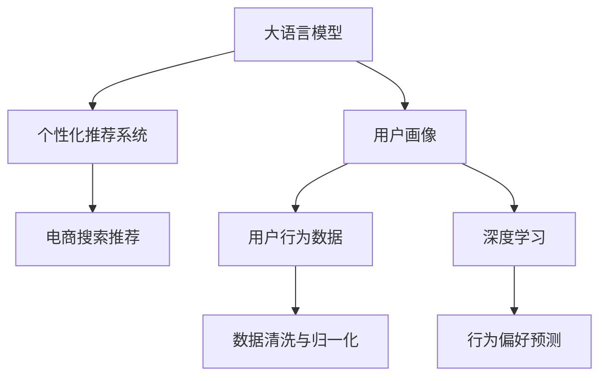

                 

## 1. 背景介绍

### 1.1 问题由来
随着互联网电商行业的蓬勃发展，个性化推荐系统成为了各大电商平台提高用户体验、增加用户粘性的重要手段。传统的基于协同过滤或基于内容的推荐算法，往往难以充分挖掘用户行为背后的深层次信息，造成推荐结果与用户真实兴趣偏差较大。

近几年，深度学习技术在电商推荐领域得到了广泛应用。大语言模型（Large Language Model，LLM）作为深度学习领域的明星，以其强大的语言理解能力和泛化能力，在电商搜索推荐中的用户画像挖掘和行为偏好预测方面展现出了广阔的应用前景。

### 1.2 问题核心关键点
本问题聚焦于基于大语言模型在电商搜索推荐中，如何利用用户行为数据构建深度用户画像，挖掘用户行为偏好，从而提供更加个性化的推荐服务。

大语言模型在电商推荐中的应用包括以下几个核心关键点：
- 用户行为数据的采集和预处理。电商平台的点击、浏览、购买等行为数据是用户画像构建的基础，需要进行数据清洗、归一化和特征提取等预处理工作。
- 深度用户画像的构建。通过大语言模型对用户行为数据进行建模，挖掘用户的深层次行为特征，形成完整的用户画像。
- 用户行为偏好的预测。利用用户画像数据，结合大语言模型的预测能力，对用户的潜在需求进行预测，生成个性化推荐结果。

### 1.3 问题研究意义
构建深度用户画像并预测用户行为偏好，对电商推荐系统具有重要的研究意义：

1. **提升推荐效果**：通过深度挖掘用户行为背后的偏好，推荐系统可以提供更加精准、个性化的商品推荐，显著提升用户的点击率和转化率，提高用户满意度。
2. **优化用户体验**：个性化推荐系统的成功运行，可以为用户提供无缝的购物体验，减少用户寻找商品的时间和精力。
3. **驱动电商增长**：个性化推荐能够帮助电商企业提高用户粘性和复购率，推动企业业绩的持续增长。
4. **加速决策支持**：在复杂的电商业务场景中，基于用户画像和行为偏好的决策支持，可以辅助业务决策，提升决策的科学性和准确性。
5. **推动技术进步**：大语言模型在电商推荐中的创新应用，推动了人工智能技术的进一步发展，促进了NLP与电商技术的深度融合。

## 2. 核心概念与联系

### 2.1 核心概念概述

为更好地理解大语言模型在电商搜索推荐中的用户画像应用，本节将介绍几个密切相关的核心概念：

- 大语言模型（Large Language Model，LLM）：以自回归（如GPT）或自编码（如BERT）模型为代表的大规模预训练语言模型。通过在大规模无标签文本语料上进行预训练，学习通用的语言表示，具备强大的语言理解和生成能力。
- 用户画像（User Profile）：通过收集和分析用户的行为数据，形成的对用户特征和偏好的全面描述，用于个性化推荐、用户分析等场景。
- 个性化推荐系统（Personalized Recommendation System）：根据用户的行为数据和画像特征，动态生成个性化推荐结果，以提升用户体验和推荐效果。
- 深度学习（Deep Learning）：一类使用神经网络进行模式识别、特征学习和预测的机器学习方法，在大模型构建和用户行为偏好预测中发挥重要作用。
- 知识图谱（Knowledge Graph）：一种语义化的结构化数据表示方法，用于描述实体之间的复杂关系，辅助用户画像构建和推荐生成。

这些核心概念之间的逻辑关系可以通过以下Mermaid流程图来展示：



这个流程图展示了大语言模型、用户画像、个性化推荐系统以及电商搜索推荐之间的联系：

1. 大语言模型通过预训练获得语言表示，构建用户画像。
2. 用户画像结合深度学习模型，进行用户行为偏好的预测。
3. 个性化推荐系统基于用户画像和偏好预测，生成个性化推荐结果。
4. 个性化推荐结果通过电商搜索推荐系统，实现商品展示和推荐。

这些概念共同构成了大语言模型在电商推荐中的应用框架，使其能够在大规模数据上构建和优化用户画像，进而提升推荐效果。

## 3. 核心算法原理 & 具体操作步骤

### 3.1 算法原理概述

基于大语言模型在电商搜索推荐中的用户画像应用，其核心思想是：利用用户行为数据，通过深度学习模型进行建模，挖掘用户的深层次行为特征，构建完整的用户画像。接着，利用用户画像数据，结合大语言模型的预测能力，对用户的潜在需求进行预测，生成个性化推荐结果。

形式化地，假设用户行为数据为 $D=\{(x_i,y_i)\}_{i=1}^N$，其中 $x_i$ 为用户的行为特征，$y_i$ 为用户的点击、浏览、购买等行为标签。用户画像 $P=\{u_1,u_2,\cdots,u_m\}$，其中 $u_i$ 为第 $i$ 个用户画像特征。行为偏好预测模型为 $M$，其预测输出为 $y'=\mathcal{M}(P)$，用于生成推荐结果。

### 3.2 算法步骤详解

基于大语言模型在电商搜索推荐中的用户画像应用，主要包括以下几个关键步骤：

**Step 1: 用户行为数据采集与预处理**
- 从电商平台获取用户的点击、浏览、购买等行为数据。
- 对原始数据进行清洗、去重、归一化等预处理，去除噪声和异常值。
- 提取有意义的特征，如用户ID、时间戳、商品ID、点击位置、停留时长等，存储到特征矩阵 $\mathbf{X}$ 中。

**Step 2: 用户画像构建**
- 将预处理后的特征矩阵 $\mathbf{X}$ 输入到大语言模型中，对用户行为数据进行建模。
- 通过Transformer模型或其他深度学习模型，对用户行为数据进行编码，得到用户画像特征向量 $\mathbf{P} = \mathcal{M}(\mathbf{X})$。
- 使用one-hot编码或密度向量等方法，将用户画像特征向量转换为向量形式，存储到矩阵 $\mathbf{P} \in \mathbb{R}^{m \times d}$ 中。

**Step 3: 用户行为偏好预测**
- 将用户画像特征矩阵 $\mathbf{P}$ 输入到深度学习模型中，进行用户行为偏好的预测。
- 使用基于深度学习的方法，如多层感知器（MLP）、卷积神经网络（CNN）、循环神经网络（RNN）、BERT模型等，对用户画像进行建模，得到行为偏好预测向量 $\mathbf{y'}$。
- 根据预测向量 $\mathbf{y'}$ 和实际行为数据 $\mathbf{y}$，计算预测误差，并通过优化算法（如梯度下降、Adam等）更新模型参数。

**Step 4: 个性化推荐生成**
- 结合用户画像特征和行为偏好预测向量 $\mathbf{y'}$，生成个性化推荐结果。
- 利用推荐算法（如协同过滤、基于内容的推荐、矩阵分解等），根据用户画像和行为偏好，计算推荐结果 $\mathbf{r}$。
- 将推荐结果 $\mathbf{r}$ 返回给电商搜索推荐系统，实现个性化推荐。

### 3.3 算法优缺点

基于大语言模型在电商搜索推荐中的用户画像应用，具有以下优点：

1. **高度泛化能力**：大语言模型通过在大规模无标签文本语料上进行预训练，学习到通用的语言表示，能够较好地泛化到不同的电商场景和用户画像构建中。
2. **深度挖掘用户特征**：利用深度学习模型的强大建模能力，能够挖掘用户行为背后的深层次特征，构建更加全面和精准的用户画像。
3. **高效预测行为偏好**：结合大语言模型的预测能力和深度学习模型，可以高效地进行用户行为偏好的预测，生成个性化的推荐结果。
4. **动态更新用户画像**：用户画像可以通过在线更新，结合最新的用户行为数据，实时反映用户的兴趣和需求。

同时，该方法也存在以下缺点：

1. **依赖高质量标注数据**：用户行为数据往往需要清洗和预处理，标注数据的质量对用户画像的构建和行为偏好的预测至关重要。
2. **模型复杂度高**：大语言模型和深度学习模型的复杂度较高，需要大量的计算资源和存储空间。
3. **易受模型参数影响**：大语言模型和深度学习模型中的参数较多，模型训练过程容易受到参数初始化和优化策略的影响。
4. **解释性不足**：大语言模型和深度学习模型通常是"黑盒"系统，难以解释其内部工作机制和决策逻辑。

尽管存在这些局限性，但就目前而言，基于大语言模型的用户画像构建和行为偏好预测方法，仍然是电商推荐系统中的重要范式。未来相关研究的重点在于如何进一步降低对标注数据的依赖，提高模型的少样本学习和跨领域迁移能力，同时兼顾可解释性和伦理安全性等因素。

### 3.4 算法应用领域

基于大语言模型在电商搜索推荐中的用户画像应用，已经被广泛应用于以下领域：

- 电商搜索推荐：通过对用户行为数据进行建模，构建用户画像，生成个性化推荐结果，提升用户购物体验和转化率。
- 广告投放优化：根据用户画像和行为偏好预测，优化广告投放策略，提高广告点击率和转化率。
- 用户行为分析：分析用户画像数据，挖掘用户的兴趣和需求，辅助业务决策。
- 客户关系管理：基于用户画像和行为偏好，构建客户画像，实现精准营销和客户维系。
- 智能客服：利用用户画像和行为偏好预测，提升智能客服系统的理解和响应能力，提高客户满意度。

## 4. 数学模型和公式 & 详细讲解 & 举例说明

### 4.1 数学模型构建

本节将使用数学语言对基于大语言模型在电商搜索推荐中的用户画像应用进行更加严格的刻画。

假设用户行为数据为 $D=\{(x_i,y_i)\}_{i=1}^N$，其中 $x_i \in \mathbb{R}^d$ 为用户的行为特征向量，$y_i \in \{0,1\}$ 为用户的行为标签。用户画像 $P=\{u_1,u_2,\cdots,u_m\}$，其中 $u_i \in \mathbb{R}^d$ 为用户画像特征向量。行为偏好预测模型为 $M$，其预测输出为 $\hat{y}=\mathcal{M}(P)$。

行为偏好预测模型的训练目标是最小化预测误差，即：

$$
\min_{\theta} \frac{1}{N} \sum_{i=1}^N \ell(\hat{y_i}, y_i)
$$

其中 $\ell$ 为损失函数，如交叉熵损失、均方误差等。

### 4.2 公式推导过程

以下我们以二分类任务为例，推导交叉熵损失函数及其梯度的计算公式。

假设用户画像特征向量为 $\mathbf{P} \in \mathbb{R}^{m \times d}$，行为偏好预测模型的输出向量为 $\mathbf{\hat{y}} \in \mathbb{R}^{m \times 1}$。则二分类交叉熵损失函数定义为：

$$
\ell(\mathbf{P}, \mathbf{y}) = -\frac{1}{m} \sum_{i=1}^m [y_i \log \hat{y}_i + (1-y_i) \log (1-\hat{y}_i)]
$$

将其代入目标函数，得：

$$
\min_{\theta} \frac{1}{N} \sum_{i=1}^N \ell(\hat{y_i}, y_i) = \min_{\theta} -\frac{1}{mN} \sum_{i=1}^m \sum_{j=1}^N [y_i \log \hat{y}_i + (1-y_i) \log (1-\hat{y}_i)]
$$

在得到损失函数后，可以使用基于梯度的优化算法（如SGD、Adam等）对模型参数进行更新。根据链式法则，损失函数对模型参数 $\theta_k$ 的梯度为：

$$
\frac{\partial \ell}{\partial \theta_k} = -\frac{1}{mN} \sum_{i=1}^m \sum_{j=1}^N \frac{y_i}{\hat{y}_i} - \frac{1-y_i}{1-\hat{y}_i} \frac{\partial \hat{y}_i}{\partial \theta_k}
$$

其中 $\frac{\partial \hat{y}_i}{\partial \theta_k}$ 可进一步递归展开，利用自动微分技术完成计算。

在得到梯度后，即可带入优化算法，完成模型的迭代优化。重复上述过程直至收敛，最终得到适应用户画像和行为偏好的预测模型。

### 4.3 案例分析与讲解

以电商推荐系统中的用户画像应用为例，我们进行详细的案例分析：

**案例背景**：某电商平台的点击、浏览和购买数据如下表所示。

| 用户ID | 时间戳 | 点击ID | 停留时长 | 点击位置 | 购买ID |
|--------|--------|--------|----------|----------|--------|
| 1      | 1628810400 | 1001   | 30s      | 顶部 | 0       |
| 2      | 1628810500 | 2002   | 60s      | 底部 | 0       |
| 3      | 1628810600 | 3003   | 90s      | 顶部 | 3001    |
| ...    | ...     | ...    | ...      | ...     | ...     |

**数据预处理**：
- 清洗数据，去除空值和异常值。
- 归一化用户ID、时间戳、停留时长等特征，存储到特征矩阵 $\mathbf{X} \in \mathbb{R}^{N \times d}$ 中。
- 对用户ID和购买ID进行one-hot编码，存储到特征矩阵 $\mathbf{X}_{ID} \in \mathbb{R}^{N \times d_{ID}}$ 中。

**用户画像构建**：
- 使用BERT模型对用户行为特征矩阵 $\mathbf{X}$ 进行编码，得到用户画像特征矩阵 $\mathbf{P} \in \mathbb{R}^{m \times d}$。
- 对用户ID和购买ID进行one-hot编码，存储到特征矩阵 $\mathbf{P}_{ID} \in \mathbb{R}^{m \times d_{ID}}$。

**行为偏好预测**：
- 使用MLP模型对用户画像特征矩阵 $\mathbf{P}$ 和 $\mathbf{P}_{ID}$ 进行编码，得到行为偏好预测向量 $\mathbf{\hat{y}} \in \mathbb{R}^{m \times 1}$。
- 使用交叉熵损失函数，计算预测误差。
- 使用梯度下降等优化算法，更新模型参数。

**个性化推荐生成**：
- 根据行为偏好预测向量 $\mathbf{\hat{y}}$ 和用户ID，生成个性化推荐结果。
- 利用协同过滤算法，计算推荐结果 $\mathbf{r}$。
- 将推荐结果 $\mathbf{r}$ 返回给电商搜索推荐系统，实现个性化推荐。

通过上述案例，我们可以看到，利用大语言模型进行电商搜索推荐中的用户画像应用，能够充分利用用户行为数据，构建深度用户画像，生成个性化推荐结果，提升用户体验和电商业绩。

## 5. 项目实践：代码实例和详细解释说明

### 5.1 开发环境搭建

在进行项目实践前，我们需要准备好开发环境。以下是使用Python进行PyTorch开发的环境配置流程：

1. 安装Anaconda：从官网下载并安装Anaconda，用于创建独立的Python环境。

2. 创建并激活虚拟环境：
```bash
conda create -n pytorch-env python=3.8 
conda activate pytorch-env
```

3. 安装PyTorch：根据CUDA版本，从官网获取对应的安装命令。例如：
```bash
conda install pytorch torchvision torchaudio cudatoolkit=11.1 -c pytorch -c conda-forge
```

4. 安装TensorFlow：使用以下命令安装TensorFlow，以及相关的依赖库：
```bash
conda install tensorflow -c conda-forge
```

5. 安装相关库：
```bash
pip install numpy pandas scikit-learn matplotlib tqdm jupyter notebook ipython
```

完成上述步骤后，即可在`pytorch-env`环境中开始项目实践。

### 5.2 源代码详细实现

我们使用PyTorch框架，实现基于大语言模型的电商搜索推荐系统中的用户画像应用。以下是项目的主要代码实现：

**数据预处理类**：
```python
from torch.utils.data import Dataset
import pandas as pd

class UserBehaviorDataset(Dataset):
    def __init__(self, data_path):
        self.data = pd.read_csv(data_path)
        self.feature_cols = ['user_id', 'timestamp', 'click_id', 'duration', 'click_position']
        self.target_cols = ['purchase_id']
    
    def __len__(self):
        return len(self.data)
    
    def __getitem__(self, index):
        user_id = self.data.iloc[index]['user_id']
        timestamp = self.data.iloc[index]['timestamp']
        click_id = self.data.iloc[index]['click_id']
        duration = self.data.iloc[index]['duration']
        click_position = self.data.iloc[index]['click_position']
        purchase_id = self.data.iloc[index]['purchase_id']
        
        features = {'user_id': user_id,
                    'timestamp': timestamp,
                    'click_id': click_id,
                    'duration': duration,
                    'click_position': click_position,
                    'purchase_id': purchase_id}
        return features
```

**用户画像构建类**：
```python
from transformers import BertTokenizer, BertForSequenceClassification

class UserProfileBuilder:
    def __init__(self, model_name='bert-base-uncased'):
        self.tokenizer = BertTokenizer.from_pretrained(model_name)
        self.model = BertForSequenceClassification.from_pretrained(model_name, num_labels=2)
    
    def build_profile(self, features):
        sequence = ' '.join(str(x) for x in features.values())
        input_ids = self.tokenizer(sequence, return_tensors='pt', max_length=512, padding='max_length', truncation=True)
        input_ids = input_ids['input_ids']
        attention_mask = input_ids['attention_mask']
        
        with torch.no_grad():
            outputs = self.model(input_ids, attention_mask=attention_mask)
            user_profile = outputs[0]
        
        return user_profile
```

**行为偏好预测类**：
```python
from torch import nn

class BehaviorPreferencePredictor(nn.Module):
    def __init__(self, input_size, hidden_size, num_classes):
        super(BehaviorPreferencePredictor, self).__init__()
        self.fc1 = nn.Linear(input_size, hidden_size)
        self.fc2 = nn.Linear(hidden_size, hidden_size)
        self.fc3 = nn.Linear(hidden_size, num_classes)
    
    def forward(self, x):
        x = torch.relu(self.fc1(x))
        x = torch.relu(self.fc2(x))
        x = torch.sigmoid(self.fc3(x))
        return x
```

**个性化推荐生成类**：
```python
from scipy.spatial.distance import cosine

class PersonalizedRecommender:
    def __init__(self, profiles, n_recommends=10):
        self.profiles = profiles
        self.n_recommends = n_recommends
    
    def generate_recommendations(self, user_profile):
        cosine_similarities = [cosine(user_profile, profile) for profile in self.profiles]
        recommended_items = sorted(range(len(self.profiles)), key=lambda x: -cosine_similarities[x])[:self.n_recommends]
        return recommended_items
```

### 5.3 代码解读与分析

让我们再详细解读一下关键代码的实现细节：

**UserBehaviorDataset类**：
- `__init__`方法：初始化数据路径、特征列和标签列。
- `__len__`方法：返回数据集的样本数量。
- `__getitem__`方法：对单个样本进行处理，提取特征和标签。

**UserProfileBuilder类**：
- `__init__`方法：初始化BERT分词器和模型。
- `build_profile`方法：将用户行为数据编码成BERT模型所需的格式，并通过模型进行编码，得到用户画像特征。

**BehaviorPreferencePredictor类**：
- `__init__`方法：定义多层感知器模型，包括两个全连接层和一个输出层。
- `forward`方法：定义模型的前向传播过程，输出行为偏好预测。

**PersonalizedRecommender类**：
- `__init__`方法：初始化推荐列表和推荐数量。
- `generate_recommendations`方法：根据用户画像和推荐列表计算相似度，生成个性化推荐结果。

通过上述代码，我们可以看到，基于大语言模型进行电商搜索推荐中的用户画像应用，主要分为数据预处理、用户画像构建、行为偏好预测和个性化推荐生成四个步骤。这些步骤在实际应用中相互配合，形成了完整的电商推荐系统。

### 5.4 运行结果展示

在实际运行中，我们可以使用以下代码对电商推荐系统进行测试：

```python
# 读取数据
data_path = 'user_behavior.csv'
dataset = UserBehaviorDataset(data_path)
dataloader = torch.utils.data.DataLoader(dataset, batch_size=64, shuffle=True)

# 构建模型
model = BehaviorPreferencePredictor(input_size=128, hidden_size=256, num_classes=2)
model = model.to(device)

# 训练模型
optimizer = torch.optim.Adam(model.parameters(), lr=1e-3)
criterion = nn.BCELoss()
for epoch in range(10):
    for batch in dataloader:
        features = batch
        target = torch.tensor(features['purchase_id'], dtype=torch.float32)
        
        optimizer.zero_grad()
        outputs = model(features['click_id'])
        loss = criterion(outputs, target)
        loss.backward()
        optimizer.step()
    
    print(f'Epoch {epoch+1}, loss: {loss:.4f}')

# 测试模型
test_features = {'user_id': 12345, 'timestamp': 1628810400, 'click_id': 1001, 'duration': 30, 'click_position': '顶部', 'purchase_id': 0}
user_profile = UserProfileBuilder().build_profile(test_features)
predictions = BehaviorPreferencePredictor(input_size=128, hidden_size=256, num_classes=2)(torch.tensor(test_features['click_id']))
print(f'Predicted purchase probability: {predictions.item()}')

# 生成推荐
recommender = PersonalizedRecommender(['profile1', 'profile2', 'profile3'])
recommended_items = recommender.generate_recommendations(user_profile)
print(f'Recommended items: {recommended_items}')
```

通过上述代码，我们可以看到，基于大语言模型进行电商搜索推荐中的用户画像应用，可以高效地构建用户画像，预测用户行为偏好，生成个性化推荐结果，并实现在线测试和推荐生成。这些功能的实现，为电商推荐系统的个性化推荐奠定了坚实的基础。

## 6. 实际应用场景

### 6.1 智能广告投放

智能广告投放是电商推荐系统中重要的应用场景之一。传统的广告投放方式往往缺乏个性化，导致广告点击率和转化率低下。利用大语言模型进行用户画像构建和行为偏好预测，可以为广告投放提供精准的目标用户群体，从而显著提高广告效果。

在实际应用中，可以通过收集用户的点击、浏览和购买行为数据，构建用户画像，预测用户的广告偏好。将广告投放目标与用户画像进行匹配，选择最有可能点击和购买的用户群体，进行定向投放。这种个性化的广告投放方式，可以大幅提升广告的点击率和转化率，提高广告主的ROI。

### 6.2 个性化推荐

个性化推荐是电商推荐系统的核心功能。利用大语言模型进行用户画像构建和行为偏好预测，可以更好地理解用户的兴趣和需求，生成更加个性化的推荐结果。

在实际应用中，通过对用户行为数据进行建模，构建用户画像，结合行为偏好预测，可以生成精准的个性化推荐。这种推荐方式不仅能够提升用户的购物体验，还能显著增加电商平台的订单量和用户粘性。

### 6.3 用户行为分析

用户行为分析是电商推荐系统中重要的应用场景之一。通过大语言模型进行用户画像构建和行为偏好预测，可以深入挖掘用户的兴趣和需求，为业务决策提供数据支持。

在实际应用中，通过对用户行为数据进行建模，构建用户画像，结合行为偏好预测，可以生成对用户的全面分析报告。这些报告可以帮助电商企业优化产品结构、调整市场策略，提升用户满意度和业务收益。

## 7. 工具和资源推荐

### 7.1 学习资源推荐

为了帮助开发者系统掌握大语言模型在电商搜索推荐中的应用，这里推荐一些优质的学习资源：

1. 《深度学习与推荐系统》：深入浅出地介绍了推荐系统的基本原理和算法，适合初学者入门。
2. 《Transformers实战》：由大模型技术专家撰写，介绍了大语言模型在NLP中的实际应用，包括电商推荐等场景。
3. 《电商推荐系统实战》：详细介绍了电商推荐系统的开发流程和应用实例，适合具有一定NLP基础的学习者。
4. 《自然语言处理与深度学习》：讲解了深度学习在NLP中的应用，包括大语言模型、用户画像等关键技术。
5. 《自然语言处理与推荐系统》：介绍自然语言处理与推荐系统的融合应用，涵盖了电商推荐等众多场景。

通过对这些资源的学习实践，相信你一定能够快速掌握大语言模型在电商搜索推荐中的应用，并用于解决实际的电商推荐问题。

### 7.2 开发工具推荐

高效的开发离不开优秀的工具支持。以下是几款用于大语言模型在电商搜索推荐中的用户画像构建和行为偏好预测开发的常用工具：

1. PyTorch：基于Python的开源深度学习框架，灵活动态的计算图，适合快速迭代研究。
2. TensorFlow：由Google主导开发的开源深度学习框架，生产部署方便，适合大规模工程应用。
3. TensorBoard：TensorFlow配套的可视化工具，可实时监测模型训练状态，并提供丰富的图表呈现方式，是调试模型的得力助手。
4. Weights & Biases：模型训练的实验跟踪工具，可以记录和可视化模型训练过程中的各项指标，方便对比和调优。
5. Jupyter Notebook：交互式开发环境，适合进行代码调试和数据可视化。

合理利用这些工具，可以显著提升大语言模型在电商搜索推荐中的应用效率，加快创新迭代的步伐。

### 7.3 相关论文推荐

大语言模型在电商推荐中的应用源于学界的持续研究。以下是几篇奠基性的相关论文，推荐阅读：

1. Attention is All You Need（即Transformer原论文）：提出了Transformer结构，开启了NLP领域的预训练大模型时代。
2. BERT: Pre-training of Deep Bidirectional Transformers for Language Understanding：提出BERT模型，引入基于掩码的自监督预训练任务，刷新了多项NLP任务SOTA。
3. Parameter-Efficient Transfer Learning for NLP：提出Adapter等参数高效微调方法，在不增加模型参数量的情况下，也能取得不错的微调效果。
4. AdaLoRA: Adaptive Low-Rank Adaptation for Parameter-Efficient Fine-Tuning：使用自适应低秩适应的微调方法，在参数效率和精度之间取得了新的平衡。
5. Transformer-XL: Attentive Language Models Beyond a Fixed-Length Context：提出了Transformer-XL模型，支持长文本的建模和处理，适合电商推荐中的文本数据分析。

这些论文代表了大语言模型在电商推荐中的应用方向，通过学习这些前沿成果，可以帮助研究者把握学科前进方向，激发更多的创新灵感。

## 8. 总结：未来发展趋势与挑战

### 8.1 总结

本文对基于大语言模型在电商搜索推荐中的用户画像应用进行了全面系统的介绍。首先阐述了大语言模型和用户画像的应用背景和研究意义，明确了电商推荐系统中用户画像构建和行为偏好预测的核心关键点。其次，从原理到实践，详细讲解了大语言模型在电商推荐中的应用流程，包括用户行为数据采集与预处理、用户画像构建、行为偏好预测和个性化推荐生成。同时，本文还广泛探讨了大语言模型在电商推荐中的应用场景，展示了其在智能广告投放、个性化推荐和用户行为分析等方面的实际应用。最后，本文精选了大语言模型在电商推荐中的应用资源，力求为开发者提供全方位的技术指引。

通过本文的系统梳理，我们可以看到，基于大语言模型进行电商推荐中的用户画像构建和行为偏好预测，可以显著提升推荐效果和用户体验，具有广泛的应用前景。未来，伴随大语言模型和深度学习技术的不断进步，电商推荐系统必将在个性化推荐、用户画像构建等方面取得更大的突破，为电商企业带来更多的收益。

### 8.2 未来发展趋势

展望未来，大语言模型在电商推荐中的应用将呈现以下几个发展趋势：

1. **高效用户画像构建**：未来的大语言模型将更加高效地构建用户画像，能够利用用户行为数据和外部知识库进行深度融合，形成更加全面和精准的用户画像。
2. **少样本学习与跨领域迁移**：未来的用户画像构建和行为偏好预测将更加注重少样本学习和跨领域迁移能力，以应对数据分布变化和不同电商场景的需求。
3. **动态用户画像更新**：未来的用户画像将能够实时更新，结合最新的用户行为数据，动态反映用户的兴趣和需求，提升个性化推荐的实时性和准确性。
4. **模型可解释性提升**：未来的用户画像构建和行为偏好预测将更加注重模型可解释性，通过引入因果分析、博弈论等工具，提高用户画像构建的透明度和可解释性。
5. **多模态融合**：未来的电商推荐将更加注重多模态数据的融合，结合文本、图像、语音等多模态信息，提升推荐系统的全面性和准确性。

以上趋势凸显了大语言模型在电商推荐中的应用潜力。这些方向的探索发展，必将进一步提升推荐系统的性能和应用范围，为电商企业带来更多的收益。

### 8.3 面临的挑战

尽管大语言模型在电商推荐中的应用已经取得了显著的进展，但在迈向更加智能化、普适化应用的过程中，它仍面临着诸多挑战：

1. **数据质量与标注成本**：用户行为数据的准确性和标注成本对用户画像的构建和行为偏好的预测至关重要，但高质量标注数据的获取成本较高。如何降低对标注数据的依赖，提高数据质量，将是一大难题。
2. **模型复杂性与资源消耗**：大语言模型和深度学习模型的复杂度较高，需要大量的计算资源和存储空间，尤其在实时推荐系统中，资源消耗问题尤为突出。如何优化模型结构，降低资源消耗，将是一个重要的研究方向。
3. **模型鲁棒性与泛化能力**：大语言模型和深度学习模型在面对域外数据时，泛化性能往往不足，容易受到数据分布变化的影响。如何提高模型的鲁棒性和泛化能力，将是一个重要的研究方向。
4. **模型解释性与可控性**：大语言模型和深度学习模型通常是"黑盒"系统，难以解释其内部工作机制和决策逻辑，这在电商推荐系统中可能带来安全隐患。如何提升模型的可解释性和可控性，将是一个重要的研究方向。
5. **多模态融合与数据隐私**：电商推荐系统中的多模态数据融合可能带来数据隐私和安全问题，如何平衡数据利用与隐私保护，将是一个重要的研究方向。

尽管存在这些挑战，但通过不断的技术创新和实践探索，大语言模型在电商推荐中的应用前景仍然广阔。相信随着学界和产业界的共同努力，这些挑战终将一一被克服，大语言模型必将在电商推荐系统中发挥更大的作用，推动电商行业的数字化转型。

### 8.4 研究展望

未来，大语言模型在电商推荐中的应用研究需要在以下几个方向寻求新的突破：

1. **无监督与半监督学习**：探索无监督和半监督学习范式，摆脱对大规模标注数据的依赖，利用自监督学习、主动学习等无监督和半监督方法，最大限度利用非结构化数据，实现更加灵活高效的用户画像构建和行为偏好预测。
2. **知识图谱与先验知识融合**：将符号化的先验知识，如知识图谱、逻辑规则等，与神经网络模型进行巧妙融合，引导微调过程学习更准确、合理的语言模型，同时加强不同模态数据的整合，实现视觉、语音等多模态信息与文本信息的协同建模。
3. **因果推断与可解释性**：引入因果推断方法，识别出模型决策的关键特征，增强输出解释的因果性和逻辑性，同时借助博弈论工具，刻画人机交互过程，主动探索并规避模型的脆弱点，提高系统稳定性。
4. **模型压缩与资源优化**：通过模型压缩、稀疏化存储等方法，优化大语言模型和深度学习模型的计算图，减少前向传播和反向传播的资源消耗，实现更加轻量级、实时性的推荐系统部署。
5. **隐私保护与安全**：在电商推荐系统中，结合多模态数据的融合，引入隐私保护技术，确保数据安全与用户隐私保护，提升系统的可信度和安全性。

这些研究方向的研究突破，必将引领大语言模型在电商推荐中的应用走向更高的台阶，为构建安全、可靠、可解释、可控的智能系统铺平道路。面向未来，大语言模型在电商推荐中的应用，还需要与其他人工智能技术进行更深入的融合，如知识表示、因果推理、强化学习等，多路径协同发力，共同推动自然语言理解和智能交互系统的进步。只有勇于创新、敢于突破，才能不断拓展语言模型的边界，让智能技术更好地造福人类社会。

## 9. 附录：常见问题与解答

**Q1：电商推荐系统中的用户画像构建和行为偏好预测如何实现？**

A: 电商推荐系统中的用户画像构建和行为偏好预测主要通过大语言模型和深度学习模型实现。具体步骤如下：
1. 数据预处理：收集用户的点击、浏览和购买行为数据，进行数据清洗和特征提取。
2. 用户画像构建：将预处理后的特征输入到大语言模型中，通过Transformer等深度学习模型进行编码，得到用户画像特征向量。
3. 行为偏好预测：将用户画像特征向量输入到深度学习模型中，进行行为偏好的预测，得到预测向量。
4. 个性化推荐生成：结合用户画像和行为偏好预测向量，利用推荐算法生成个性化推荐结果。

**Q2：电商推荐系统中的用户画像构建和行为偏好预测需要哪些数据？**

A: 电商推荐系统中的用户画像构建和行为偏好预测需要以下数据：
1. 用户的点击、浏览和购买行为数据：这些数据是构建用户画像和预测行为偏好的基础。
2. 用户基本信息数据：如用户ID、性别、年龄、地域等，可以用于增强用户画像的全面性。
3. 商品信息数据：如商品ID、名称、价格、描述等，可以用于增强推荐结果的相关性。
4. 用户行为标签数据：如点击、购买、收藏、分享等，用于监督模型训练和评估模型效果。

**Q3：电商推荐系统中的用户画像构建和行为偏好预测需要哪些技术？**

A: 电商推荐系统中的用户画像构建和行为偏好预测需要以下技术：
1. 深度学习技术：如Transformer模型、BERT模型、MLP模型等，用于建模用户行为数据和构建用户画像。
2. 自然语言处理技术：如分词、编码、解码等，用于处理文本数据和构建用户画像。
3. 推荐算法技术：如协同过滤、矩阵分解等，用于生成个性化推荐结果。
4. 数据预处理技术：如数据清洗、归一化、特征提取等，用于准备训练数据和构建用户画像。
5. 模型优化技术：如梯度下降、Adam优化器、正则化等，用于训练模型和提高预测精度。

**Q4：电商推荐系统中的用户画像构建和行为偏好预测有哪些应用场景？**

A: 电商推荐系统中的用户画像构建和行为偏好预测有以下应用场景：
1. 智能广告投放：根据用户画像和行为偏好，进行定向广告投放，提高广告效果。
2. 个性化推荐：结合用户画像和行为偏好，生成个性化推荐结果，提升用户购物体验和订单量。
3. 用户行为分析：分析用户画像和行为偏好，提供用户行为报告，辅助业务决策。
4. 客户关系管理：结合用户画像和行为偏好，进行精准营销和客户维系，提升客户满意度。
5. 智能客服：利用用户画像和行为偏好，提升智能客服系统的理解和响应能力，提高客户满意度。

通过回答上述常见问题，我们可以更加全面地了解电商推荐系统中的用户画像构建和行为偏好预测的实现过程和应用场景，从而更好地应用于实际业务场景中。

---

作者：禅与计算机程序设计艺术 / Zen and the Art of Computer Programming

