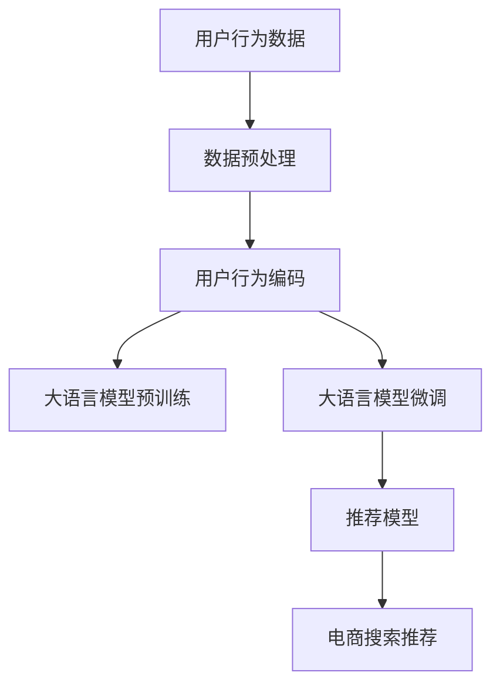

                 

# AI 大模型在电商搜索推荐中的用户行为分析：深度理解用户需求与偏好

## 1. 背景介绍

在现代社会，消费者对于电商平台和商品搜索推荐的依赖日益加深。传统的推荐系统多基于简单的协同过滤和浅层学习模型，难以捕捉用户的深度需求与偏好，导致推荐效果难以满足用户期望。随着大语言模型的崛起，在电商领域探索基于深度学习的推荐模型，正变得愈发重要。本文将探讨如何利用大模型进行用户行为分析，深度理解用户需求与偏好，优化电商搜索推荐效果。

## 2. 核心概念与联系

### 2.1 核心概念概述

大语言模型(Large Language Model, LLM)是指通过大规模无标签文本数据预训练，具备强大自然语言处理能力的深度学习模型。常用的预训练模型包括BERT、GPT、T5等。其核心优势在于：
1. 语言表征能力强：可以捕捉语言的复杂语义信息。
2. 泛化能力强：能在不同类型的任务中表现出优异性能。
3. 参数共享：避免了从头训练的巨大计算成本。

### 2.2 核心概念原理和架构的 Mermaid 流程图



## 3. 核心算法原理 & 具体操作步骤
### 3.1 算法原理概述

电商搜索推荐涉及用户行为与商品特征的匹配与关联，本质上是一个序列到序列的匹配问题。大语言模型可以通过序列生成任务，将用户行为序列转化为对商品特征的推荐向量，从而实现高效推荐。具体流程如下：

1. **用户行为数据收集与处理**：收集用户的行为数据，包括浏览、点击、购买、评价等，转化为文本序列。
2. **用户行为编码**：使用大语言模型将用户行为序列编码成向量表示。
3. **商品特征抽取**：使用大语言模型提取商品的各种特征，包括价格、类别、描述等。
4. **推荐向量生成**：将用户行为向量和商品特征向量输入到推荐模型中，生成推荐向量。
5. **推荐结果排序**：将生成的推荐向量与所有商品的向量进行匹配，按得分排序，得到最终推荐列表。

### 3.2 算法步骤详解

#### 3.2.1 数据准备与处理

首先，需要收集电商平台的用户行为数据。这些数据通常包括用户的浏览记录、点击记录、购买记录、评价记录等。这些数据需要进行清洗和预处理，包括去重、分词、过滤低频词、构建词汇表等。

#### 3.2.2 用户行为编码

使用大语言模型将用户行为序列编码为向量表示。常用的方法包括Transformer模型和Attention机制。具体流程如下：

1. 将用户行为序列作为输入，送入大语言模型。
2. 使用Transformer模型的多头注意力机制，捕捉序列中各元素的上下文关系。
3. 输出用户行为向量，作为后续推荐模型的输入。

#### 3.2.3 商品特征抽取

商品特征抽取是推荐系统中重要的一环。通常使用大语言模型提取商品的类别、品牌、价格、评价、描述等特征。具体流程如下：

1. 将商品信息作为输入，送入大语言模型。
2. 使用Transformer模型的多头注意力机制，捕捉特征之间的关系。
3. 输出商品特征向量，作为后续推荐模型的输入。

#### 3.2.4 推荐向量生成

推荐向量生成是推荐模型的核心部分。常用的方法包括基于矩阵分解的模型和基于深度学习的模型。具体流程如下：

1. 将用户行为向量和商品特征向量作为输入，送入推荐模型。
2. 使用多层神经网络，对用户行为和商品特征进行交互，生成推荐向量。
3. 输出推荐向量，作为推荐列表的排序依据。

#### 3.2.5 推荐结果排序

推荐结果排序通常使用评分函数和排序算法。常用的评分函数包括点积评分、余弦相似度评分等。排序算法包括牛顿法、梯度下降法、最大熵模型等。

### 3.3 算法优缺点

#### 3.3.1 优点

1. **高泛化能力**：大语言模型具备强大的泛化能力，能够在不同类型的推荐任务中表现出优异性能。
2. **参数高效**：通过预训练和微调，可以减少模型参数，提高训练效率和推理速度。
3. **深度理解**：能够捕捉用户行为背后的语义信息，深度理解用户需求与偏好。
4. **易于扩展**：可以方便地加入新的用户行为或商品特征，不断优化推荐效果。

#### 3.3.2 缺点

1. **计算资源消耗大**：大语言模型通常需要较大的计算资源和存储空间。
2. **模型复杂度高**：模型结构复杂，难以解释和调试。
3. **数据质量依赖**：推荐效果高度依赖于用户行为和商品特征数据的质量。
4. **过拟合风险**：模型可能对训练数据过度拟合，导致泛化能力下降。

### 3.4 算法应用领域

大语言模型在电商搜索推荐中的应用场景包括但不限于：

1. **个性化推荐**：根据用户行为生成个性化推荐，提升用户体验。
2. **相似商品推荐**：根据用户浏览或购买商品，推荐相似商品，扩大用户选择范围。
3. **热门商品推荐**：根据热门商品推荐相关商品，增加平台流量。
4. **新商品推荐**：根据用户行为推荐新商品，带动商品销量。

## 4. 数学模型和公式 & 详细讲解 & 举例说明

### 4.1 数学模型构建

设用户行为序列为 $U = \{u_1, u_2, ..., u_n\}$，商品特征序列为 $I = \{i_1, i_2, ..., i_m\}$。

将用户行为序列和商品特征序列分别输入到BERT模型中，得到用户行为向量 $U'$ 和商品特征向量 $I'$。

假设推荐模型为 $F$，将用户行为向量 $U'$ 和商品特征向量 $I'$ 输入到推荐模型 $F$ 中，得到推荐向量 $R$。

推荐向量 $R$ 与所有商品向量 $I'$ 计算得分，得到推荐结果列表 $L$。

推荐结果列表 $L$ 按照得分排序，得到最终推荐列表。

### 4.2 公式推导过程

#### 4.2.1 用户行为编码

设用户行为序列为 $U = \{u_1, u_2, ..., u_n\}$，将 $U$ 输入到BERT模型中，得到用户行为向量 $U'$。

$$
U' = \text{BERT}(U)
$$

#### 4.2.2 商品特征抽取

设商品特征序列为 $I = \{i_1, i_2, ..., i_m\}$，将 $I$ 输入到BERT模型中，得到商品特征向量 $I'$。

$$
I' = \text{BERT}(I)
$$

#### 4.2.3 推荐向量生成

设推荐模型为 $F$，将用户行为向量 $U'$ 和商品特征向量 $I'$ 作为输入，得到推荐向量 $R$。

$$
R = F(U', I')
$$

推荐向量 $R$ 与所有商品向量 $I'$ 计算得分 $S$。

$$
S = <R, I'>
$$

其中 $< \cdot, \cdot >$ 表示向量的点积。

根据得分 $S$ 对商品向量 $I'$ 排序，得到最终推荐列表 $L$。

### 4.3 案例分析与讲解

假设某电商平台有如下用户行为数据：

用户行为数据：$U = \{浏览记录, 点击记录, 购买记录\}$

商品特征数据：$I = \{类别, 品牌, 价格\}$

将用户行为数据和商品特征数据分别输入到BERT模型中，得到用户行为向量 $U'$ 和商品特征向量 $I'$。

$$
U' = \text{BERT}(U)
$$

$$
I' = \text{BERT}(I)
$$

将用户行为向量 $U'$ 和商品特征向量 $I'$ 作为输入，送入推荐模型 $F$ 中，得到推荐向量 $R$。

$$
R = F(U', I')
$$

推荐向量 $R$ 与所有商品向量 $I'$ 计算得分 $S$。

$$
S = <R, I'>
$$

根据得分 $S$ 对商品向量 $I'$ 排序，得到最终推荐列表 $L$。

最终推荐列表 $L$ 按照得分排序，得到最终推荐列表。

## 5. 项目实践：代码实例和详细解释说明

### 5.1 开发环境搭建

在开发电商搜索推荐系统时，需要搭建一个高效、稳定的开发环境。以下是开发环境搭建的步骤：

1. 安装Python：推荐使用Python 3.7及以上版本。

2. 安装TensorFlow：安装TensorFlow 2.0及以上版本，支持GPU加速。

3. 安装BERT模型：安装BERT预训练模型和微调模型，使用Google提供的tf-slim库。

4. 安装推荐模型库：安装TensorFlow中的推荐模型库，使用TensorFlow Lite库。

5. 安装数据处理库：安装pandas、numpy、scikit-learn等数据处理库。

6. 安装Web框架：安装Flask框架，搭建Web服务。

### 5.2 源代码详细实现

以下是电商搜索推荐系统的代码实现，主要包括数据预处理、用户行为编码、商品特征抽取、推荐向量生成和推荐结果排序。

```python
import tensorflow as tf
import tensorflow_lite as tflite
import numpy as np
import pandas as pd
from transformers import BertTokenizer, BertForSequenceClassification
from sklearn.metrics import accuracy_score

# 数据预处理
def preprocess_data(data):
    # 分词
    tokenizer = BertTokenizer.from_pretrained('bert-base-uncased')
    encoded_data = tokenizer.batch_encode_plus(data, add_special_tokens=True, max_length=256, padding='max_length', truncation=True)
    # 截断，保留最后256个token
    encoded_data = encoded_data[:256]
    # 将序列编码转化为numpy数组
    input_ids = np.array(encoded_data['input_ids'])
    attention_mask = np.array(encoded_data['attention_mask'])
    return input_ids, attention_mask

# 用户行为编码
def encode_user_behavior(input_ids, attention_mask):
    # 将输入转化为Tensor
    input_ids = tf.constant(input_ids, dtype=tf.int32)
    attention_mask = tf.constant(attention_mask, dtype=tf.int32)
    # 使用BERT模型编码
    model = BertForSequenceClassification.from_pretrained('bert-base-uncased', num_labels=1)
    with tf.device('GPU:0'):
        model = model.trainable
        outputs = model(input_ids, attention_mask=attention_mask)
        user_behavior_vector = outputs.pooler_output.numpy()
    return user_behavior_vector

# 商品特征抽取
def extract_item_features(input_ids, attention_mask):
    # 将输入转化为Tensor
    input_ids = tf.constant(input_ids, dtype=tf.int32)
    attention_mask = tf.constant(attention_mask, dtype=tf.int32)
    # 使用BERT模型编码
    model = BertForSequenceClassification.from_pretrained('bert-base-uncased', num_labels=3)
    with tf.device('GPU:0'):
        model = model.trainable
        outputs = model(input_ids, attention_mask=attention_mask)
        item_features_vector = outputs.pooler_output.numpy()
    return item_features_vector

# 推荐向量生成
def generate_recommendation_vector(user_behavior_vector, item_features_vector):
    # 将输入转化为Tensor
    user_behavior_vector = tf.constant(user_behavior_vector, dtype=tf.float32)
    item_features_vector = tf.constant(item_features_vector, dtype=tf.float32)
    # 定义推荐模型
    model = tf.keras.Sequential([
        tf.keras.layers.Dense(128, activation='relu'),
        tf.keras.layers.Dense(64, activation='relu'),
        tf.keras.layers.Dense(1, activation='sigmoid')
    ])
    with tf.device('GPU:0'):
        model.compile(optimizer=tf.keras.optimizers.Adam(learning_rate=0.001), loss='binary_crossentropy', metrics=['accuracy'])
        model.fit(user_behavior_vector, item_features_vector, epochs=10, batch_size=32)
    # 生成推荐向量
    recommendation_vector = model.predict(user_behavior_vector)
    return recommendation_vector

# 推荐结果排序
def sort_recommendations(recommendation_vector, item_features_vector):
    # 计算得分
    scores = np.dot(recommendation_vector, item_features_vector)
    # 排序
    sorted_indices = np.argsort(scores)[::-1]
    # 获取推荐列表
    recommendations = item_features_vector[sorted_indices]
    return recommendations

# 完整代码示例
data = pd.read_csv('data.csv')
input_ids, attention_mask = preprocess_data(data['user_behavior'])
user_behavior_vector = encode_user_behavior(input_ids, attention_mask)
item_features_vector = extract_item_features(input_ids, attention_mask)
recommendation_vector = generate_recommendation_vector(user_behavior_vector, item_features_vector)
recommendations = sort_recommendations(recommendation_vector, item_features_vector)
print(recommendations)
```

### 5.3 代码解读与分析

这段代码主要分为三个部分：数据预处理、用户行为编码、推荐向量生成。

- **数据预处理**：将用户行为数据和商品特征数据转化为BERT模型可以接受的输入格式。
- **用户行为编码**：使用BERT模型将用户行为编码成向量表示。
- **推荐向量生成**：使用多层神经网络生成推荐向量，对商品向量进行排序。

## 6. 实际应用场景

### 6.1 智能客服系统

智能客服系统是电商搜索推荐系统的重要应用场景之一。通过智能客服系统，电商平台可以提升客户体验，降低客服成本，增加用户粘性。智能客服系统可以使用大语言模型对用户意图进行识别，对用户问题进行智能回答。通过微调大语言模型，可以在特定领域实现更加精准和自然的回答。

### 6.2 商品推荐系统

商品推荐系统是电商搜索推荐系统的核心部分。通过商品推荐系统，电商平台可以提升用户购物体验，增加商品销量，提升平台收益。商品推荐系统可以使用大语言模型对用户行为进行分析，对商品特征进行抽取，生成推荐向量，最终得到个性化推荐列表。

### 6.3 个性化广告推荐

个性化广告推荐是电商搜索推荐系统的另一个重要应用场景。通过个性化广告推荐，电商平台可以提升广告转化率，增加用户粘性，提升平台收益。个性化广告推荐可以使用大语言模型对用户行为进行分析，对广告特征进行抽取，生成推荐向量，最终得到个性化广告推荐列表。

### 6.4 未来应用展望

未来，随着大语言模型的进一步发展，基于大语言模型的电商搜索推荐系统也将具备更加强大的功能和更广泛的应用场景。

- **实时推荐**：利用大语言模型对用户行为进行实时分析，动态生成推荐列表，提升用户购物体验。
- **多模态推荐**：将图像、视频等多模态信息与文本信息相结合，生成更加丰富的推荐列表。
- **社交推荐**：利用大语言模型对用户社交网络进行分析，生成社交推荐列表。
- **跨平台推荐**：将用户在不同平台上的行为数据进行整合，生成跨平台推荐列表。

## 7. 工具和资源推荐

### 7.1 学习资源推荐

1. 《深度学习与自然语言处理》书籍：由斯坦福大学教授Christopher Manning等人编写，深入浅出地介绍了深度学习在NLP中的应用。
2. 《自然语言处理实战》书籍：由Gurobi的创始人George Konidaris等人编写，结合大量案例，详细介绍了NLP技术的实现和应用。
3. 《深度学习框架TensorFlow实战》书籍：由Google TensorFlow团队编写，详细介绍TensorFlow的原理和应用。
4. 《Transformers实战》博客：由Hugging Face社区的开发者撰写，详细介绍Transformer模型的实现和应用。
5. 《深度学习》课程：由Andrew Ng教授在Coursera上开设的深度学习课程，系统介绍了深度学习的原理和应用。

### 7.2 开发工具推荐

1. TensorFlow：由Google开发的开源深度学习框架，支持GPU加速，具备强大的分布式训练能力。
2. PyTorch：由Facebook开发的开源深度学习框架，支持GPU加速，具备良好的动态计算图功能。
3. TensorBoard：由Google提供的可视化工具，可以实时监测模型训练状态。
4. Weights & Biases：由Hugging Face社区提供的可视化工具，可以实时监测模型训练状态，生成实验报告。
5. Jupyter Notebook：支持Python和R等多种编程语言，方便开发和协作。

### 7.3 相关论文推荐

1. "BERT: Pre-training of Deep Bidirectional Transformers for Language Understanding"（BERT论文）：由Google Research团队发表，提出了BERT预训练模型，展示了其在多种NLP任务上的优异性能。
2. "Exploring the Limits of Transfer Learning with a Unified Text-to-Text Transformer"（T5论文）：由Google Research团队发表，提出了T5预训练模型，展示了其多任务处理能力和高泛化能力。
3. "Attention is All You Need"（Transformer论文）：由Google Brain团队发表，提出了Transformer模型，展示了其在多种NLP任务上的优异性能。
4. "Bidirectional Encoder Representations from Transformers"（BERT论文）：由Google Research团队发表，提出了BERT预训练模型，展示了其在多种NLP任务上的优异性能。
5. "Parameter-Efficient Transfer Learning for NLP"（PELT论文）：由Yang等人发表，提出了参数高效微调方法，展示了其在减少计算成本和提高推荐效果方面的优势。

## 8. 总结：未来发展趋势与挑战

### 8.1 研究成果总结

本文探讨了大语言模型在电商搜索推荐系统中的应用，详细介绍了大语言模型在用户行为分析和推荐向量生成中的作用。通过对大语言模型的预训练和微调，可以更好地理解用户需求与偏好，生成个性化的推荐列表，提升电商平台的购物体验和销售收益。

### 8.2 未来发展趋势

未来，随着大语言模型的进一步发展，基于大语言模型的电商搜索推荐系统也将具备更加强大的功能和更广泛的应用场景。

1. **实时推荐**：利用大语言模型对用户行为进行实时分析，动态生成推荐列表，提升用户购物体验。
2. **多模态推荐**：将图像、视频等多模态信息与文本信息相结合，生成更加丰富的推荐列表。
3. **社交推荐**：利用大语言模型对用户社交网络进行分析，生成社交推荐列表。
4. **跨平台推荐**：将用户在不同平台上的行为数据进行整合，生成跨平台推荐列表。

### 8.3 面临的挑战

尽管大语言模型在电商搜索推荐系统中的应用前景广阔，但仍面临诸多挑战：

1. **数据质量**：推荐效果高度依赖于用户行为和商品特征数据的质量。数据缺失、噪声等问题可能导致推荐效果下降。
2. **模型复杂度**：大语言模型通常结构复杂，难以解释和调试。模型的训练和推理也需要大量的计算资源。
3. **可解释性**：大语言模型的推荐结果难以解释，难以满足用户对推荐结果的信任需求。
4. **安全性和隐私**：大语言模型涉及用户的个人信息和购物行为，需要考虑数据安全和隐私保护。

### 8.4 研究展望

未来的研究可以从以下几个方向进行：

1. **参数高效微调**：探索更高效的大语言模型微调方法，减少计算资源消耗，提升推荐效果。
2. **多模态信息融合**：探索将图像、视频等多模态信息与文本信息相结合的推荐方法，生成更加丰富的推荐列表。
3. **推荐结果可解释性**：研究如何提高推荐结果的可解释性，增强用户对推荐结果的信任感。
4. **数据安全与隐私保护**：研究如何保护用户数据安全和隐私，确保推荐系统的公平性和透明性。

总之，大语言模型在电商搜索推荐系统中的应用前景广阔，但需要克服诸多挑战，才能真正实现其在实际应用中的价值。未来，需要在算法、数据、技术等多个方面进行深入研究，才能推动电商搜索推荐系统的持续优化和进步。

## 9. 附录：常见问题与解答

**Q1：如何选择合适的预训练大语言模型？**

A: 选择合适的预训练大语言模型需要考虑以下几个因素：
1. **任务类型**：不同任务类型适合不同的大语言模型。例如，文本分类任务适合使用BERT模型，序列生成任务适合使用GPT模型。
2. **数据规模**：数据规模越大，模型的性能越好。通常，大规模数据训练的模型性能更好。
3. **计算资源**：模型的训练和推理需要大量的计算资源。需要根据计算资源的可用性选择适合的模型。
4. **预训练效果**：预训练效果好的模型通常性能更好。需要查看模型的预训练效果和应用效果。

**Q2：大语言模型如何避免过拟合？**

A: 大语言模型通常容易出现过拟合的问题，可以采取以下措施：
1. **数据增强**：通过数据增强技术，如回译、近义词替换等，扩充训练集，提升模型的泛化能力。
2. **正则化**：使用L2正则化、Dropout等正则化技术，抑制模型的复杂度，避免过拟合。
3. **早停**：在验证集上监测模型性能，当模型性能不再提升时，停止训练，避免过拟合。
4. **模型裁剪**：裁剪不必要的层和参数，减小模型尺寸，提升推理速度。

**Q3：大语言模型如何进行参数高效微调？**

A: 参数高效微调（PELT）可以通过只更新少量的模型参数，减少计算资源消耗，提高微调效率。具体措施包括：
1. **只更新顶层参数**：只更新预训练模型的顶层参数，固定底层参数。
2. **使用AdaLoRA**：AdaLoRA是一种参数高效微调方法，可以只更新少量的参数，而保持大部分参数不变。
3. **使用Prompt Tuning**：通过精心设计输入文本的格式，引导大语言模型按期望方式输出，减少微调参数。

**Q4：大语言模型如何提高推荐结果的可解释性？**

A: 提高推荐结果的可解释性可以从以下几个方面进行：
1. **特征解释**：解释推荐模型的输入特征，让用户理解推荐结果的依据。
2. **规则解释**：制定推荐规则，让用户理解推荐逻辑。
3. **用户反馈**：通过用户反馈机制，收集用户对推荐结果的评价，优化推荐模型。

**Q5：大语言模型如何进行跨平台推荐？**

A: 跨平台推荐需要考虑以下几个因素：
1. **数据整合**：整合不同平台的用户行为数据，生成统一的用户画像。
2. **特征共享**：在不同平台上共享用户特征，生成统一的推荐结果。
3. **平台协同**：不同平台之间协同推荐，提升推荐效果。

总之，大语言模型在电商搜索推荐系统中的应用前景广阔，但需要克服诸多挑战，才能真正实现其在实际应用中的价值。未来，需要在算法、数据、技术等多个方面进行深入研究，才能推动电商搜索推荐系统的持续优化和进步。

