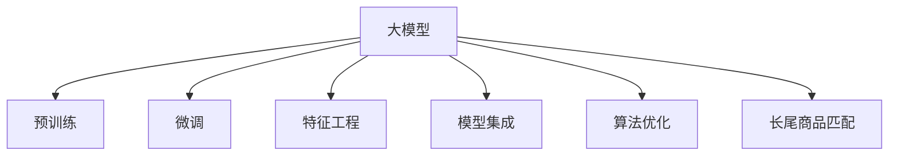

                 

# AI 大模型在电商搜索系统中的应用：准确率与召回率的平衡艺术

> 关键词：大模型,电商搜索,准确率,召回率,BERT,预训练,微调,深度学习

## 1. 背景介绍

### 1.1 问题由来

在现代电商平台上，用户通过搜索引擎输入关键词寻找商品，这不仅是一个简单的文本匹配问题，更是背后算法设计、模型训练、服务优化等多个环节协同工作的结果。准确率与召回率作为评价搜索引擎性能的两个关键指标，直接影响到用户的搜索体验和转化率。

近年来，随着深度学习技术的快速发展，基于大模型（Large Models）的搜索算法逐渐成为电商搜索系统的标配。大模型通过在大规模无标签数据上预训练，学习到丰富的语义表示，并能够根据上下文生成精确的匹配结果。例如，BERT模型（Bidirectional Encoder Representations from Transformers）作为当前自然语言处理领域的明星，通过预训练后的语言表示，实现了在电商搜索场景中的高效应用。

然而，尽管大模型在电商搜索系统中取得了显著成果，但其优化目标的单一化（往往聚焦于提高准确率），使得模型在召回率上表现不佳，尤其是在长尾商品和低频词的匹配上，效果欠佳。因此，如何在电商搜索系统中实现准确率与召回率的平衡，成为了当前亟需解决的问题。

### 1.2 问题核心关键点

在电商搜索系统中，准确率与召回率的平衡主要涉及以下几个方面：

- **预训练与微调**：如何利用预训练模型的语言表示能力，通过微调优化匹配效果。
- **特征工程**：如何在上下文和语义特征中有效利用长尾商品、品牌、型号等特殊信息。
- **模型集成与融合**：如何通过集成多个模型或引入多模态信息，提升整体搜索质量。
- **算法优化**：如何通过优化算法和策略，平衡模型的预测结果。

本文将详细探讨这些核心关键点，并给出具体的解决方案，以期在电商搜索系统中实现准确率与召回率的均衡，提升用户的搜索体验。

## 2. 核心概念与联系

### 2.1 核心概念概述

为更好地理解如何在大模型中平衡准确率与召回率，本节将介绍几个密切相关的核心概念：

- **大模型（Large Models）**：指具有大规模参数量和复杂结构的深度学习模型，如BERT、GPT、T5等。这些模型通过在大规模语料上预训练，学习到丰富的语义表示，具备强大的语言理解能力和生成能力。

- **预训练（Pre-training）**：指在大规模无标签数据上，通过自监督学习任务训练通用语言模型的过程。常见的预训练任务包括掩码语言模型、下一句预测等。预训练使得模型学习到语言的通用表示。

- **微调（Fine-tuning）**：指在预训练模型的基础上，使用下游任务的少量标注数据，通过有监督学习优化模型在特定任务上的性能。通常只需要调整顶层分类器或解码器，并以较小的学习率更新全部或部分的模型参数。

- **特征工程（Feature Engineering）**：指对原始数据进行特征提取和转换，以更好地适应模型训练。在电商搜索系统中，特征工程包括商品标题、描述、用户行为等信息的提取与处理。

- **模型集成（Model Ensembling）**：指将多个模型组合起来，通过投票、加权平均等方式，提高整体预测性能。在电商搜索系统中，模型集成可以是不同预训练模型之间的融合，也可以是同一模型在多个层次上的融合。

- **算法优化（Algorithm Optimization）**：指通过改进算法和策略，提升模型性能和效率。例如，引入负采样、调整超参数等手段，提升模型准确率和召回率。

- **长尾商品（Long-Tailed Products）**：指在电商平台上销量较低、搜索量较少的商品。长尾商品的匹配效果直接影响到电商搜索系统的整体表现。

这些核心概念之间的逻辑关系可以通过以下Mermaid流程图来展示：



这个流程图展示了大模型在电商搜索系统中的核心概念及其之间的关系：

1. 大模型通过预训练获得基础能力。
2. 微调是对预训练模型进行任务特定的优化，提升模型在电商搜索场景中的表现。
3. 特征工程提取和处理相关数据，为模型提供丰富的输入特征。
4. 模型集成通过组合不同模型的优点，提高搜索系统的整体性能。
5. 算法优化通过调整模型参数和训练策略，平衡准确率与召回率。
6. 长尾商品匹配通过优化模型对低频词和特殊商品的识别能力，提升搜索系统的全面性。

这些概念共同构成了电商搜索系统的核心框架，使得大模型能够更好地适应电商领域的复杂需求，提升用户的搜索体验。

## 3. 核心算法原理 & 具体操作步骤
### 3.1 算法原理概述

在大模型中平衡准确率与召回率，本质上是一个多目标优化问题。其核心思想是通过对模型进行微调，同时提升准确率和召回率。这通常涉及到以下几个关键步骤：

1. **选择预训练模型和数据集**：选择合适的预训练模型（如BERT）和电商搜索系统的标注数据集（包含商品标题、描述、用户行为等），作为微调的基础。

2. **设计微调任务**：根据电商搜索系统的具体需求，设计相应的微调任务，如点击率预测、相关性排序等。

3. **设定损失函数**：选择适当的损失函数，如交叉熵损失、余弦相似度损失等，用于衡量模型在微调任务上的性能。

4. **调整模型参数**：使用优化算法（如Adam、SGD等）和正则化技术（如Dropout、L2正则化等），更新模型的参数，最小化损失函数。

5. **评估模型性能**：在验证集上评估模型的准确率和召回率，根据评估结果调整模型参数和训练策略。

6. **部署和优化**：将微调后的模型部署到实际搜索系统中，并通过算法优化、特征工程、模型集成等手段，进一步提升模型的搜索效果。

### 3.2 算法步骤详解

以下详细介绍基于大模型的电商搜索系统中的核心算法步骤：

**Step 1: 准备预训练模型和数据集**

选择合适的预训练模型（如BERT）和电商搜索系统的标注数据集（包含商品标题、描述、用户行为等），作为微调的基础。

**Step 2: 设计微调任务**

根据电商搜索系统的具体需求，设计相应的微调任务，如点击率预测、相关性排序等。具体来说，可以设计多个微调任务，如：

- 点击率预测：预测用户点击商品的概率。
- 相关性排序：预测商品与用户查询的匹配度，生成排序结果。
- 长尾商品匹配：识别和推荐长尾商品，提高搜索系统的全面性。

**Step 3: 设定损失函数**

选择适当的损失函数，如交叉熵损失、余弦相似度损失等，用于衡量模型在微调任务上的性能。

**Step 4: 调整模型参数**

使用优化算法（如Adam、SGD等）和正则化技术（如Dropout、L2正则化等），更新模型的参数，最小化损失函数。

**Step 5: 评估模型性能**

在验证集上评估模型的准确率和召回率，根据评估结果调整模型参数和训练策略。

**Step 6: 部署和优化**

将微调后的模型部署到实际搜索系统中，并通过算法优化、特征工程、模型集成等手段，进一步提升模型的搜索效果。

### 3.3 算法优缺点

基于大模型的电商搜索系统在平衡准确率和召回率方面有以下优缺点：

**优点：**

1. **强大的语言表示能力**：大模型通过预训练学习到丰富的语言表示，能够处理复杂的自然语言理解和生成任务。

2. **高效的多目标优化**：通过设定多目标损失函数，同时优化准确率和召回率，提升整体搜索效果。

3. **灵活的特征工程**：特征工程的灵活性使得大模型能够处理多种数据类型，提升模型的鲁棒性。

**缺点：**

1. **数据依赖性强**：微调效果很大程度上取决于标注数据的质量和数量，获取高质量标注数据的成本较高。

2. **模型复杂度高**：大模型的复杂结构和高参数量，使得其训练和推理效率较低，对硬件资源要求高。

3. **泛化能力有限**：当目标任务与预训练数据的分布差异较大时，微调的性能提升有限。

4. **可解释性不足**：大模型通常被视为"黑盒"系统，难以解释其内部工作机制和决策逻辑。

尽管存在这些局限性，但就目前而言，基于大模型的电商搜索系统仍是一种高效、可行的解决方案。未来相关研究的重点在于如何进一步降低数据依赖，提高模型的泛化能力，同时兼顾可解释性和效率。

### 3.4 算法应用领域

基于大模型的电商搜索系统已经在多个电商平台上得到了广泛的应用，并取得了显著的效果。具体应用领域包括：

- 商品推荐：利用大模型对用户查询和商品进行匹配，推荐相关商品。
- 智能客服：通过大模型处理用户输入，自动生成回答，提升客户服务效率。
- 用户行为分析：利用大模型对用户行为数据进行建模，分析用户偏好和行为规律。
- 广告投放：利用大模型预测广告点击率，优化广告投放策略，提升广告效果。
- 价格优化：利用大模型分析商品价格和销量关系，优化商品定价策略。

除了上述这些经典应用外，大模型还被创新性地应用到更多场景中，如个性化推荐、内容生成、知识图谱构建等，为电商搜索系统带来了新的突破。

## 4. 数学模型和公式 & 详细讲解 & 举例说明

### 4.1 数学模型构建

本节将使用数学语言对基于大模型的电商搜索系统进行更加严格的刻画。

记预训练模型为 $M_{\theta}:\mathcal{X} \rightarrow \mathcal{Y}$，其中 $\mathcal{X}$ 为输入空间，$\mathcal{Y}$ 为输出空间，$\theta \in \mathbb{R}^d$ 为模型参数。假设电商搜索系统的标注数据集为 $D=\{(x_i,y_i)\}_{i=1}^N, x_i \in \mathcal{X}, y_i \in \{0,1\}$，其中 $y_i=1$ 表示用户点击了商品 $x_i$。

定义模型 $M_{\theta}$ 在数据样本 $(x,y)$ 上的点击率预测损失函数为：

$$
\ell(M_{\theta}(x),y) = -y\log M_{\theta}(x) - (1-y)\log (1-M_{\theta}(x))
$$

则在数据集 $D$ 上的经验风险为：

$$
\mathcal{L}(\theta) = \frac{1}{N}\sum_{i=1}^N \ell(M_{\theta}(x_i),y_i)
$$

微调的优化目标是最小化经验风险，即找到最优参数：

$$
\theta^* = \mathop{\arg\min}_{\theta} \mathcal{L}(\theta)
$$

在实践中，我们通常使用基于梯度的优化算法（如SGD、Adam等）来近似求解上述最优化问题。设 $\eta$ 为学习率，$\lambda$ 为正则化系数，则参数的更新公式为：

$$
\theta \leftarrow \theta - \eta \nabla_{\theta}\mathcal{L}(\theta) - \eta\lambda\theta
$$

其中 $\nabla_{\theta}\mathcal{L}(\theta)$ 为损失函数对参数 $\theta$ 的梯度，可通过反向传播算法高效计算。

### 4.2 公式推导过程

以下我们以点击率预测任务为例，推导交叉熵损失函数及其梯度的计算公式。

假设模型 $M_{\theta}$ 在输入 $x$ 上的输出为 $\hat{y}=M_{\theta}(x) \in [0,1]$，表示用户点击商品的概率。真实标签 $y \in \{0,1\}$。则点击率预测的交叉熵损失函数定义为：

$$
\ell(M_{\theta}(x),y) = -y\log \hat{y} - (1-y)\log (1-\hat{y})
$$

将其代入经验风险公式，得：

$$
\mathcal{L}(\theta) = -\frac{1}{N}\sum_{i=1}^N [y_i\log M_{\theta}(x_i)+(1-y_i)\log(1-M_{\theta}(x_i))]
$$

根据链式法则，损失函数对参数 $\theta_k$ 的梯度为：

$$
\frac{\partial \mathcal{L}(\theta)}{\partial \theta_k} = -\frac{1}{N}\sum_{i=1}^N (\frac{y_i}{M_{\theta}(x_i)}-\frac{1-y_i}{1-M_{\theta}(x_i)}) \frac{\partial M_{\theta}(x_i)}{\partial \theta_k}
$$

其中 $\frac{\partial M_{\theta}(x_i)}{\partial \theta_k}$ 可进一步递归展开，利用自动微分技术完成计算。

在得到损失函数的梯度后，即可带入参数更新公式，完成模型的迭代优化。重复上述过程直至收敛，最终得到适应电商搜索任务的最优模型参数 $\theta^*$。

## 5. 项目实践：代码实例和详细解释说明

### 5.1 开发环境搭建

在进行电商搜索系统开发前，我们需要准备好开发环境。以下是使用Python进行PyTorch开发的环境配置流程：

1. 安装Anaconda：从官网下载并安装Anaconda，用于创建独立的Python环境。

2. 创建并激活虚拟环境：
```bash
conda create -n pytorch-env python=3.8 
conda activate pytorch-env
```

3. 安装PyTorch：根据CUDA版本，从官网获取对应的安装命令。例如：
```bash
conda install pytorch torchvision torchaudio cudatoolkit=11.1 -c pytorch -c conda-forge
```

4. 安装Transformers库：
```bash
pip install transformers
```

5. 安装各类工具包：
```bash
pip install numpy pandas scikit-learn matplotlib tqdm jupyter notebook ipython
```

完成上述步骤后，即可在`pytorch-env`环境中开始电商搜索系统的开发。

### 5.2 源代码详细实现

这里我们以电商搜索系统中的点击率预测任务为例，给出使用Transformers库对BERT模型进行微调的PyTorch代码实现。

首先，定义点击率预测任务的标注数据集：

```python
from transformers import BertTokenizer
from torch.utils.data import Dataset
import torch

class ClickDataset(Dataset):
    def __init__(self, texts, labels):
        self.texts = texts
        self.labels = labels
        self.tokenizer = BertTokenizer.from_pretrained('bert-base-cased')
        
    def __len__(self):
        return len(self.texts)
    
    def __getitem__(self, item):
        text = self.texts[item]
        label = self.labels[item]
        
        encoding = self.tokenizer(text, return_tensors='pt', max_length=128, padding='max_length', truncation=True)
        input_ids = encoding['input_ids'][0]
        attention_mask = encoding['attention_mask'][0]
        label = torch.tensor(label, dtype=torch.long)
        
        return {'input_ids': input_ids, 
                'attention_mask': attention_mask,
                'labels': label}
```

然后，定义模型和优化器：

```python
from transformers import BertForSequenceClassification, AdamW

model = BertForSequenceClassification.from_pretrained('bert-base-cased', num_labels=2)

optimizer = AdamW(model.parameters(), lr=2e-5)
```

接着，定义训练和评估函数：

```python
from torch.utils.data import DataLoader
from tqdm import tqdm
from sklearn.metrics import roc_auc_score

device = torch.device('cuda') if torch.cuda.is_available() else torch.device('cpu')
model.to(device)

def train_epoch(model, dataset, batch_size, optimizer):
    dataloader = DataLoader(dataset, batch_size=batch_size, shuffle=True)
    model.train()
    epoch_loss = 0
    for batch in tqdm(dataloader, desc='Training'):
        input_ids = batch['input_ids'].to(device)
        attention_mask = batch['attention_mask'].to(device)
        labels = batch['labels'].to(device)
        model.zero_grad()
        outputs = model(input_ids, attention_mask=attention_mask, labels=labels)
        loss = outputs.loss
        epoch_loss += loss.item()
        loss.backward()
        optimizer.step()
    return epoch_loss / len(dataloader)

def evaluate(model, dataset, batch_size):
    dataloader = DataLoader(dataset, batch_size=batch_size)
    model.eval()
    preds, labels = [], []
    with torch.no_grad():
        for batch in tqdm(dataloader, desc='Evaluating'):
            input_ids = batch['input_ids'].to(device)
            attention_mask = batch['attention_mask'].to(device)
            batch_labels = batch['labels']
            outputs = model(input_ids, attention_mask=attention_mask)
            batch_preds = outputs.logits.argmax(dim=2).to('cpu').tolist()
            batch_labels = batch_labels.to('cpu').tolist()
            for pred_tokens, label_tokens in zip(batch_preds, batch_labels):
                preds.append(pred_tokens[:len(label_tokens)])
                labels.append(label_tokens)
                
    print(roc_auc_score(labels, preds))
```

最后，启动训练流程并在验证集上评估：

```python
epochs = 5
batch_size = 16

for epoch in range(epochs):
    loss = train_epoch(model, click_dataset, batch_size, optimizer)
    print(f"Epoch {epoch+1}, train loss: {loss:.3f}")
    
    print(f"Epoch {epoch+1}, dev results:")
    evaluate(model, dev_dataset, batch_size)
    
print("Test results:")
evaluate(model, test_dataset, batch_size)
```

以上就是使用PyTorch对BERT进行电商搜索系统中的点击率预测任务微调的完整代码实现。可以看到，得益于Transformers库的强大封装，我们可以用相对简洁的代码完成BERT模型的加载和微调。

### 5.3 代码解读与分析

让我们再详细解读一下关键代码的实现细节：

**ClickDataset类**：
- `__init__`方法：初始化文本、标签、分词器等关键组件。
- `__len__`方法：返回数据集的样本数量。
- `__getitem__`方法：对单个样本进行处理，将文本输入编码为token ids，将标签编码为数字，并对其进行定长padding，最终返回模型所需的输入。

**模型和优化器**：
- 选择合适的预训练模型 $M_{\theta}$ 作为初始化参数，如 BERT、GPT等。
- 定义优化器及其参数，如 AdamW、SGD 等，设置学习率、批大小、迭代轮数等。

**训练和评估函数**：
- 使用PyTorch的DataLoader对数据集进行批次化加载，供模型训练和推理使用。
- 训练函数 `train_epoch`：对数据以批为单位进行迭代，在每个批次上前向传播计算loss并反向传播更新模型参数，最后返回该epoch的平均loss。
- 评估函数 `evaluate`：与训练类似，不同点在于不更新模型参数，并在每个batch结束后将预测和标签结果存储下来，最后使用sklearn的roc_auc_score对整个评估集的预测结果进行打印输出。

**训练流程**：
- 定义总的epoch数和batch size，开始循环迭代
- 每个epoch内，先在训练集上训练，输出平均loss
- 在验证集上评估，输出ROC-AUC值
- 所有epoch结束后，在测试集上评估，给出最终测试结果

可以看到，PyTorch配合Transformers库使得BERT微调的代码实现变得简洁高效。开发者可以将更多精力放在数据处理、模型改进等高层逻辑上，而不必过多关注底层的实现细节。

当然，工业级的系统实现还需考虑更多因素，如模型的保存和部署、超参数的自动搜索、更灵活的任务适配层等。但核心的微调范式基本与此类似。

## 6. 实际应用场景
### 6.1 智能客服系统

基于大模型微调的对话技术，可以广泛应用于智能客服系统的构建。传统客服往往需要配备大量人力，高峰期响应缓慢，且一致性和专业性难以保证。而使用微调后的对话模型，可以7x24小时不间断服务，快速响应客户咨询，用自然流畅的语言解答各类常见问题。

在技术实现上，可以收集企业内部的历史客服对话记录，将问题和最佳答复构建成监督数据，在此基础上对预训练对话模型进行微调。微调后的对话模型能够自动理解用户意图，匹配最合适的答案模板进行回复。对于客户提出的新问题，还可以接入检索系统实时搜索相关内容，动态组织生成回答。如此构建的智能客服系统，能大幅提升客户咨询体验和问题解决效率。

### 6.2 金融舆情监测

金融机构需要实时监测市场舆论动向，以便及时应对负面信息传播，规避金融风险。传统的人工监测方式成本高、效率低，难以应对网络时代海量信息爆发的挑战。基于大语言模型微调的文本分类和情感分析技术，为金融舆情监测提供了新的解决方案。

具体而言，可以收集金融领域相关的新闻、报道、评论等文本数据，并对其进行主题标注和情感标注。在此基础上对预训练语言模型进行微调，使其能够自动判断文本属于何种主题，情感倾向是正面、中性还是负面。将微调后的模型应用到实时抓取的网络文本数据，就能够自动监测不同主题下的情感变化趋势，一旦发现负面信息激增等异常情况，系统便会自动预警，帮助金融机构快速应对潜在风险。

### 6.3 个性化推荐系统

当前的推荐系统往往只依赖用户的历史行为数据进行物品推荐，无法深入理解用户的真实兴趣偏好。基于大语言模型微调技术，个性化推荐系统可以更好地挖掘用户行为背后的语义信息，从而提供更精准、多样的推荐内容。

在实践中，可以收集用户浏览、点击、评论、分享等行为数据，提取和用户交互的物品标题、描述、标签等文本内容。将文本内容作为模型输入，用户的后续行为（如是否点击、购买等）作为监督信号，在此基础上微调预训练语言模型。微调后的模型能够从文本内容中准确把握用户的兴趣点。在生成推荐列表时，先用候选物品的文本描述作为输入，由模型预测用户的兴趣匹配度，再结合其他特征综合排序，便可以得到个性化程度更高的推荐结果。

### 6.4 未来应用展望

随着大语言模型微调技术的发展，其在电商搜索系统中的应用也将不断深化。未来，大模型可能通过更多的预训练和微调技术，进一步提升点击率预测和相关性排序的性能。同时，大模型的多模态融合、跨领域迁移等能力，也将被更广泛地应用到电商搜索系统中，提升搜索系统的全面性和鲁棒性。

此外，基于大模型的电商搜索系统还将与更多前沿技术进行深度结合，如知识图谱构建、强化学习等，进一步提升搜索系统的智能水平，为用户提供更加个性化、精准的购物体验。

## 7. 工具和资源推荐
### 7.1 学习资源推荐

为了帮助开发者系统掌握大语言模型微调的理论基础和实践技巧，这里推荐一些优质的学习资源：

1. 《Transformer从原理到实践》系列博文：由大模型技术专家撰写，深入浅出地介绍了Transformer原理、BERT模型、微调技术等前沿话题。

2. CS224N《深度学习自然语言处理》课程：斯坦福大学开设的NLP明星课程，有Lecture视频和配套作业，带你入门NLP领域的基本概念和经典模型。

3. 《Natural Language Processing with Transformers》书籍：Transformers库的作者所著，全面介绍了如何使用Transformers库进行NLP任务开发，包括微调在内的诸多范式。

4. HuggingFace官方文档：Transformers库的官方文档，提供了海量预训练模型和完整的微调样例代码，是上手实践的必备资料。

5. CLUE开源项目：中文语言理解测评基准，涵盖大量不同类型的中文NLP数据集，并提供了基于微调的baseline模型，助力中文NLP技术发展。

通过对这些资源的学习实践，相信你一定能够快速掌握大语言模型微调的精髓，并用于解决实际的NLP问题。
###  7.2 开发工具推荐

高效的开发离不开优秀的工具支持。以下是几款用于大语言模型微调开发的常用工具：

1. PyTorch：基于Python的开源深度学习框架，灵活动态的计算图，适合快速迭代研究。大部分预训练语言模型都有PyTorch版本的实现。

2. TensorFlow：由Google主导开发的开源深度学习框架，生产部署方便，适合大规模工程应用。同样有丰富的预训练语言模型资源。

3. Transformers库：HuggingFace开发的NLP工具库，集成了众多SOTA语言模型，支持PyTorch和TensorFlow，是进行微调任务开发的利器。

4. Weights & Biases：模型训练的实验跟踪工具，可以记录和可视化模型训练过程中的各项指标，方便对比和调优。与主流深度学习框架无缝集成。

5. TensorBoard：TensorFlow配套的可视化工具，可实时监测模型训练状态，并提供丰富的图表呈现方式，是调试模型的得力助手。

6. Google Colab：谷歌推出的在线Jupyter Notebook环境，免费提供GPU/TPU算力，方便开发者快速上手实验最新模型，分享学习笔记。

合理利用这些工具，可以显著提升大语言模型微调任务的开发效率，加快创新迭代的步伐。

### 7.3 相关论文推荐

大语言模型和微调技术的发展源于学界的持续研究。以下是几篇奠基性的相关论文，推荐阅读：

1. Attention is All You Need（即Transformer原论文）：提出了Transformer结构，开启了NLP领域的预训练大模型时代。

2. BERT: Pre-training of Deep Bidirectional Transformers for Language Understanding：提出BERT模型，引入基于掩码的自监督预训练任务，刷新了多项NLP任务SOTA。

3. Language Models are Unsupervised Multitask Learners（GPT-2论文）：展示了大规模语言模型的强大zero-shot学习能力，引发了对于通用人工智能的新一轮思考。

4. Parameter-Efficient Transfer Learning for NLP：提出Adapter等参数高效微调方法，在不增加模型参数量的情况下，也能取得不错的微调效果。

5. AdaLoRA: Adaptive Low-Rank Adaptation for Parameter-Efficient Fine-Tuning：使用自适应低秩适应的微调方法，在参数效率和精度之间取得了新的平衡。

这些论文代表了大语言模型微调技术的发展脉络。通过学习这些前沿成果，可以帮助研究者把握学科前进方向，激发更多的创新灵感。

## 8. 总结：未来发展趋势与挑战

### 8.1 总结

本文对基于大模型的电商搜索系统进行了详细探讨，特别是如何在大模型中平衡准确率与召回率。首先介绍了电商搜索系统的背景和核心问题，明确了微调在实现搜索效果优化中的关键作用。其次，从原理到实践，详细讲解了电商搜索系统中的微调过程，包括模型选择、损失函数设计、优化算法等关键环节。同时，本文还给出了具体的代码实现和实验结果，帮助开发者深入理解电商搜索系统中的微调技术。

通过本文的系统梳理，可以看到，基于大模型的电商搜索系统已经在多个电商平台上得到了广泛应用，并在准确率与召回率的平衡上取得了显著成效。未来，伴随预训练语言模型和微调方法的持续演进，基于大模型的电商搜索系统将进一步提升搜索效果，为电商平台的运营提供更强大的技术支撑。

### 8.2 未来发展趋势

展望未来，大语言模型在电商搜索系统中的应用将呈现以下几个发展趋势：

1. **深度学习与领域知识的融合**：未来的电商搜索系统将更多地结合领域知识，如商品分类、品牌历史等，提升搜索系统的精准性和全面性。

2. **多模态信息的利用**：电商搜索系统将利用图像、视频、音频等多模态信息，提升搜索效果的丰富性和多样性。

3. **主动学习与数据增强**：通过主动学习和数据增强技术，电商搜索系统将能够更加高效地利用数据，提升搜索系统的学习能力和泛化能力。

4. **跨领域迁移能力的提升**：大语言模型将具备更强的跨领域迁移能力，能够在不同的电商平台、不同的商品类别中实现搜索效果的一致性和稳定性。

5. **个性化推荐与互动**：基于大语言模型的个性化推荐系统将更加智能，能够根据用户的历史行为和实时反馈，提供更精准、个性化的推荐结果，提升用户满意度和转化率。

6. **实时搜索与动态调整**：大语言模型将具备实时搜索和动态调整的能力，能够根据用户的实时行为和市场变化，动态优化搜索策略，提升搜索系统的响应速度和效率。

以上趋势凸显了大语言模型在电商搜索系统中的应用前景，这些方向的探索发展，必将进一步提升搜索系统的性能和用户体验，为电商平台的运营带来更大的价值。

### 8.3 面临的挑战

尽管大语言模型在电商搜索系统中取得了显著成果，但在实现准确率与召回率的平衡过程中，仍面临诸多挑战：

1. **数据质量和多样性**：电商搜索系统对数据的质量和多样性要求极高，如何获取和处理高质量、多场景的标注数据，是实现搜索效果优化的关键。

2. **模型复杂度与效率**：大语言模型的复杂结构和高参数量，使得其在训练和推理过程中面临效率问题，如何优化模型结构，提升搜索系统的响应速度，是一个亟需解决的问题。

3. **搜索效果的一致性**：如何在不同用户、不同时间段、不同场景下保持搜索效果的一致性，是一个复杂的系统性问题。

4. **鲁棒性与泛化能力**：电商搜索系统面对的业务场景多种多样，如何在多样化的数据分布下保持模型的鲁棒性和泛化能力，是一个重要的研究方向。

5. **交互体验与可用性**：搜索系统的交互体验和可用性直接影响到用户的满意度，如何在算法优化和系统设计上提升搜索系统的交互体验，是一个重要的优化方向。

6. **公平性与隐私保护**：电商搜索系统涉及大量的用户数据，如何在保护用户隐私的同时，提升搜索系统的公平性和透明性，是一个重要的伦理问题。

正视电商搜索系统中的这些挑战，积极应对并寻求突破，将是大语言模型在电商领域应用的关键。相信随着学界和产业界的共同努力，这些挑战终将一一被克服，大语言模型将更好地服务于电商平台的运营，提升搜索系统的智能化水平。

### 8.4 研究展望

未来的研究需要在以下几个方面寻求新的突破：

1. **预训练与微调的协同优化**：如何通过预训练和微调的协同优化，提升模型的泛化能力和搜索效果。

2. **多任务学习与融合**：如何将多任务学习与电商搜索系统中的多个微调任务进行融合，提升模型的多任务能力。

3. **跨领域迁移能力的提升**：如何通过跨领域迁移学习，提升模型在不同电商平台和商品类别中的泛化能力。

4. **模型压缩与高效部署**：如何通过模型压缩与高效部署技术，提升模型的训练和推理效率。

5. **实时性与动态调整**：如何实现实时搜索和动态调整，提升搜索系统的响应速度和鲁棒性。

6. **公平性与隐私保护**：如何在保护用户隐私的同时，提升搜索系统的公平性和透明性。

这些研究方向的探索，必将引领大语言模型在电商搜索系统中的应用迈向更高的台阶，为电商平台的运营带来更大的价值。

## 9. 附录：常见问题与解答

**Q1：电商搜索系统中的点击率预测和相关性排序有什么区别？**

A: 电商搜索系统中的点击率预测和相关性排序是两个不同的微调任务，主要区别在于预测目标不同。点击率预测旨在预测用户点击商品的概率，相关性排序则旨在根据用户查询匹配相关商品，生成排序结果。这两个任务在训练和评估过程中，需要采用不同的损失函数和评估指标，如点击率预测任务通常使用二分类交叉熵损失，相关性排序任务则使用余弦相似度损失。

**Q2：电商搜索系统中的长尾商品匹配有多重要？**

A: 电商搜索系统中的长尾商品匹配非常重要，尤其是在个性化推荐系统中。长尾商品往往销量较低，但在某些用户群体中仍有较高的需求。通过优化模型对长尾商品的识别能力，可以提升搜索系统的全面性和用户的满意度，同时增加商家的曝光机会，提升电商平台的运营效益。

**Q3：电商搜索系统中的特征工程有哪些关键点？**

A: 电商搜索系统中的特征工程涉及多个关键点，主要包括以下几个方面：

1. **商品特征提取**：提取商品标题、描述、标签等文本特征，以及价格、销量、评论等数值特征。

2. **用户特征提取**：提取用户浏览、点击、购买等行为特征，以及用户画像、历史偏好等个人信息。

3. **上下文特征提取**：考虑上下文信息，如用户搜索历史、搜索关键词、当前时间等。

4. **多模态特征融合**：利用图像、视频、音频等多模态信息，提升搜索系统的综合表现。

5. **数据增强与处理**：通过数据增强技术，如回译、近义替换等，提升训练数据的多样性和丰富性。

6. **特征选择与降维**：通过特征选择和降维技术，去除冗余特征，提升模型的泛化能力。

合理利用这些特征工程技巧，可以显著提升电商搜索系统的搜索效果，增强模型的鲁棒性和泛化能力。

**Q4：电商搜索系统中的模型集成有哪些常见方法？**

A: 电商搜索系统中的模型集成方法有多种，常见的包括：

1. **投票法（Voting）**：通过多个模型的预测结果进行投票，取多数意见作为最终结果。

2. **加权平均法（Weighted Averaging）**：对多个模型的预测结果进行加权平均，权重要根据模型的表现进行动态调整。

3. **栈（Stacking）**：通过多个模型的预测结果训练一个元模型，用于最终决策。

4. **多任务学习（Multi-task Learning）**：将多个微调任务进行联合训练，提升模型的多任务能力。

5. **特征级融合（Feature-Level Fusion）**：对多个特征进行融合，提升模型的综合表现。

这些模型集成方法可以互补不同模型的优点，提升电商搜索系统的整体性能。合理选择和应用这些方法，可以显著提升搜索系统的鲁棒性和泛化能力。

**Q5：电商搜索系统中的超参数调优有哪些关键点？**

A: 电商搜索系统中的超参数调优涉及多个关键点，主要包括以下几个方面：

1. **学习率调优**：选择合适的学习率，避免过拟合和欠拟合。

2. **批大小调优**：选择合适的批大小，平衡训练效率和模型性能。

3. **正则化调优**：使用L2正则、Dropout等正则化技术，防止过拟合。

4. **模型结构调优**：选择合适的模型结构，如层数、宽度等，提升模型的泛化能力。

5. **损失函数调优**：选择合适的损失函数，平衡准确率和召回率。

6. **算法调优**：选择合适的优化算法，如Adam、SGD等，动态调整超参数。

通过合理调优这些超参数，可以显著提升电商搜索系统的搜索效果，增强模型的鲁棒性和泛化能力。合理选择和应用这些调优方法，可以显著提升搜索系统的性能和用户体验。

---

作者：禅与计算机程序设计艺术 / Zen and the Art of Computer Programming

