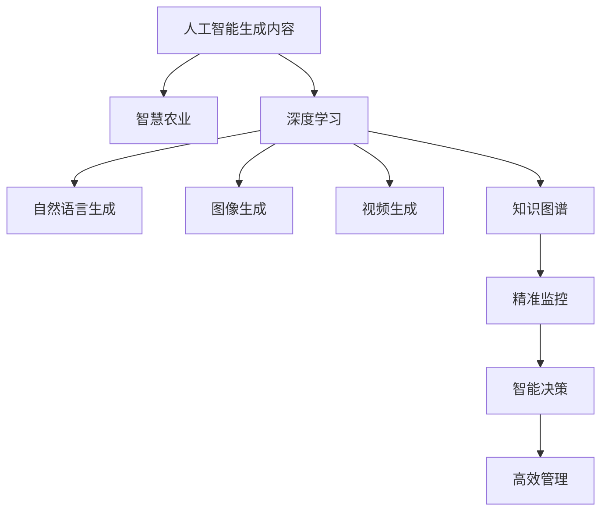

                 

# AIGC助力智慧农业发展

## 1. 背景介绍

### 1.1 问题由来

智慧农业（Smart Agriculture）是现代农业发展的重要方向，旨在通过先进的技术手段，如传感器、人工智能、物联网等，提升农业生产的效率、效益和可持终性。人工智能生成内容（AIGC, Artificial Intelligence Generated Content）技术，包括自然语言生成、图像生成、视频生成等，为智慧农业提供了强大的数据处理和智能化决策支持能力，成为推动农业现代化、智能化发展的关键力量。

近年来，随着深度学习和大数据技术的不断突破，AIGC技术在农业中的应用逐渐增多。例如，基于深度学习的智能推荐系统，可以为农民提供个性化的种植建议，指导施肥、灌溉、病虫害防治等操作；基于自然语言生成的智慧农业问答系统，可以快速响应农民的咨询，提供准确有效的技术支持；基于图像生成的作物生长监测系统，可以实时监控农作物的生长状况，提前预警病虫害。

然而，AIGC在农业领域的应用仍面临诸多挑战，如数据采集的不均衡性、模型训练数据的稀缺性、模型推理的高成本性等。为了更好地解决这些问题，本文将详细介绍AIGC技术在智慧农业中的应用原理与操作步骤，并探讨其优缺点及未来发展趋势。

## 2. 核心概念与联系

### 2.1 核心概念概述

为了更好地理解AIGC在智慧农业中的应用，我们先介绍几个核心概念：

- **人工智能生成内容（AIGC）**：指通过人工智能技术自动生成高质量的文本、图像、视频等内容的广泛应用领域。其核心技术包括自然语言生成（NLG, Natural Language Generation）、图像生成（IG, Image Generation）、视频生成（VG, Video Generation）等。
- **智慧农业（Smart Agriculture）**：利用传感器、物联网、云计算、人工智能等现代信息技术，实现对农业生产过程的精准监控、智能决策和高效管理。
- **深度学习（Deep Learning）**：基于神经网络的机器学习技术，通过多层次的特征提取和复杂模型训练，能够处理和分析大规模非结构化数据，成为AIGC和智慧农业的核心驱动力。
- **知识图谱（Knowledge Graph）**：通过构建实体与实体间的关系，将结构化数据和非结构化数据融合，提供全面、精准的知识表示和查询能力。

这些核心概念之间的逻辑关系可以通过以下Mermaid流程图来展示：



这个流程图展示了大语言模型的工作原理和优化方向：

1. 大语言模型通过深度学习获得基础能力。
2. AIGC利用深度学习技术生成文本、图像、视频等内容。
3. 智慧农业通过AIGC生成的数据，进行精准监控、智能决策和高效管理。
4. 知识图谱为AIGC提供全面的背景知识，增强模型的泛化能力和可解释性。

这些概念共同构成了AIGC在智慧农业中的应用框架，使其能够提供精准、智能、高效的服务。

## 3. 核心算法原理 & 具体操作步骤

### 3.1 算法原理概述

AIGC在智慧农业中的应用，主要基于自然语言生成（NLG）、图像生成（IG）、视频生成（VG）等核心技术。这些技术通过深度学习模型，自动生成高质量的文本、图像和视频内容，辅助农业生产过程的智能化决策和管理。

以自然语言生成技术为例，其基本原理是通过训练生成模型（如GPT-3、T5等），将特定输入（如传感器数据、历史气象数据等）映射到文本输出（如作物生长状况、病虫害预警等）。生成模型的训练数据通常包括领域特定的语料库、知识图谱等，以确保模型生成的内容准确、专业。

### 3.2 算法步骤详解

以下我们以智能推荐系统的自然语言生成为例，详细介绍其基本流程：

**Step 1: 数据预处理**
- 收集传感器数据、历史气象数据、作物种植记录等，进行清洗和标准化处理。
- 根据农业领域的特点，选择适当的特征进行提取和归一化。

**Step 2: 构建生成模型**
- 使用自然语言生成模型（如GPT-3、T5等），将预处理后的数据输入模型，生成推荐文本。
- 设置合适的超参数，如学习率、训练轮数、优化器等。

**Step 3: 微调模型**
- 使用农业领域的标注数据集（如病虫害防治、施肥推荐等）对生成模型进行微调。
- 通过交叉验证、超参数调优等手段，提升模型的泛化能力和准确性。

**Step 4: 部署与应用**
- 将微调后的模型部署到农业生产系统中，接收传感器等输入数据。
- 生成推荐文本，并提供给农民，指导其生产操作。
- 定期更新模型和数据，以适应农业生产的变化。

### 3.3 算法优缺点

AIGC在智慧农业中的应用具有以下优点：
1. 数据驱动：生成模型可以实时处理大量传感器数据，辅助智能决策，提高农业生产的精准性。
2. 知识融合：通过与知识图谱的结合，生成模型能够理解上下文信息，生成更准确的推荐。
3. 动态更新：模型可以实时更新，及时响应农业生产中的变化。
4. 用户友好：通过自然语言生成，模型能够提供易于理解、操作性强的建议，方便农民使用。

同时，该方法也存在一些局限性：
1. 数据质量要求高：AIGC模型的性能很大程度上依赖于输入数据的质量，需要高质量、高覆盖的数据集。
2. 模型复杂度高：生成模型通常参数量较大，需要高性能的计算资源支持。
3. 训练数据稀缺：农业领域的标注数据往往稀缺，难以获取充分样本进行训练。
4. 可解释性不足：生成模型的内部机制复杂，难以解释其生成的内容。
5. 技术门槛高：涉及深度学习、知识图谱等多领域技术，需要较高的技术水平和资源投入。

尽管存在这些局限性，但就目前而言，AIGC技术在智慧农业中的应用前景广阔，具有显著的潜力。未来相关研究的重点在于如何进一步降低技术门槛，提高模型的数据利用效率，增强模型的泛化能力，同时兼顾可解释性和可靠性等因素。

### 3.4 算法应用领域

AIGC技术在智慧农业中的应用领域十分广泛，具体包括：

- **智能推荐系统**：根据传感器数据、历史气象数据等，自动生成推荐文本，如施肥、灌溉、病虫害防治等。
- **作物生长监测系统**：利用图像生成技术，自动生成作物生长状态报告，实时监控作物生长情况。
- **农业问答系统**：通过自然语言生成技术，自动生成专家解答，快速响应农民咨询。
- **农业知识图谱**：构建农业领域的知识图谱，为生成模型提供背景知识和关联信息。
- **农产品质量检测**：通过图像生成技术，自动生成农产品质量检测报告，提供准确判断。

除了上述这些主要应用，AIGC在智慧农业中的应用还包括智能物流、智能设备控制、精准农业管理等方面，为农业生产提供了全方位的智能化支持。

## 4. 数学模型和公式 & 详细讲解 & 举例说明

### 4.1 数学模型构建

自然语言生成模型的构建过程通常包括以下几个步骤：

1. 数据预处理：收集农业领域的文本数据，如传感器数据、历史气象数据等，进行清洗和标准化处理。
2. 特征提取：将处理后的文本数据，转化为机器学习模型可用的数值型特征。
3. 模型训练：选择适当的生成模型（如GPT-3、T5等），通过标注数据进行训练。
4. 模型评估：在验证集上评估模型的性能，使用BLEU、ROUGE等指标进行评价。
5. 模型微调：使用农业领域的标注数据对模型进行微调，提升模型在特定任务上的性能。

### 4.2 公式推导过程

以下以自然语言生成为例，介绍生成模型的公式推导过程：

设生成模型的输入为$x$，输出为$y$，训练数据集为$D=\{(x_i,y_i)\}_{i=1}^N$，目标是最小化损失函数$\mathcal{L}(\theta)$，其中$\theta$为模型参数。生成模型的目标函数为：

$$
\mathcal{L}(\theta) = -\frac{1}{N}\sum_{i=1}^N\log P(y_i|x_i)
$$

其中$P(y_i|x_i)$为条件概率分布，表示模型在输入$x_i$下生成$y_i$的概率。训练过程通过优化算法（如AdamW、SGD等）最小化损失函数，更新模型参数$\theta$。

生成模型的具体实现可以基于Transformer等架构，通过多层自注意力机制和前馈神经网络进行特征提取和生成。模型的训练过程可以使用随机梯度下降（SGD）等优化算法，通过反向传播更新模型参数。

### 4.3 案例分析与讲解

以智能推荐系统为例，介绍自然语言生成模型在智慧农业中的应用。

**数据预处理**：
- 收集传感器数据，如土壤湿度、温度、光照等。
- 提取特征，如土壤湿度、温度、光照强度等，进行归一化处理。

**模型构建**：
- 使用GPT-3等生成模型，将处理后的数据输入模型，生成推荐文本。
- 设置学习率为$2e-5$，训练轮数为$10$，优化器为AdamW。

**模型微调**：
- 使用农业领域的标注数据集对模型进行微调，如病虫害防治、施肥推荐等。
- 通过交叉验证，调整超参数，提升模型性能。

**模型评估**：
- 在验证集上评估模型性能，使用BLEU、ROUGE等指标进行评价。
- 输出推荐文本，并提供给农民，指导其生产操作。

## 5. 项目实践：代码实例和详细解释说明

### 5.1 开发环境搭建

在进行AIGC项目开发前，需要准备好开发环境。以下是使用Python进行PyTorch开发的环境配置流程：

1. 安装Anaconda：从官网下载并安装Anaconda，用于创建独立的Python环境。

2. 创建并激活虚拟环境：
```bash
conda create -n pytorch-env python=3.8 
conda activate pytorch-env
```

3. 安装PyTorch：根据CUDA版本，从官网获取对应的安装命令。例如：
```bash
conda install pytorch torchvision torchaudio cudatoolkit=11.1 -c pytorch -c conda-forge
```

4. 安装Transformers库：
```bash
pip install transformers
```

5. 安装各类工具包：
```bash
pip install numpy pandas scikit-learn matplotlib tqdm jupyter notebook ipython
```

完成上述步骤后，即可在`pytorch-env`环境中开始AIGC项目开发。

### 5.2 源代码详细实现

这里我们以智能推荐系统为例，给出使用Transformers库进行自然语言生成的PyTorch代码实现。

首先，定义推荐系统数据处理函数：

```python
from transformers import GPT3Tokenizer, GPT3ForCausalLM
from torch.utils.data import Dataset
import torch

class RecommendationDataset(Dataset):
    def __init__(self, texts, labels):
        self.texts = texts
        self.labels = labels
        self.tokenizer = GPT3Tokenizer.from_pretrained('gpt3-medium')
        self.max_len = 256
        
    def __len__(self):
        return len(self.texts)
    
    def __getitem__(self, item):
        text = self.texts[item]
        label = self.labels[item]
        
        encoding = self.tokenizer(text, return_tensors='pt', max_length=self.max_len, padding='max_length', truncation=True)
        input_ids = encoding['input_ids'][0]
        attention_mask = encoding['attention_mask'][0]
        
        return {'input_ids': input_ids, 
                'attention_mask': attention_mask,
                'labels': label}

# 定义标签与id的映射
label2id = {'推荐': 0, '不推荐': 1}
id2label = {v: k for k, v in label2id.items()}

# 创建dataset
tokenizer = GPT3Tokenizer.from_pretrained('gpt3-medium')

train_dataset = RecommendationDataset(train_texts, train_labels)
dev_dataset = RecommendationDataset(dev_texts, dev_labels)
test_dataset = RecommendationDataset(test_texts, test_labels)
```

然后，定义模型和优化器：

```python
from transformers import GPT3ForCausalLM
from transformers import AdamW

model = GPT3ForCausalLM.from_pretrained('gpt3-medium')
```

接着，定义训练和评估函数：

```python
from torch.utils.data import DataLoader
from tqdm import tqdm
from sklearn.metrics import accuracy_score

device = torch.device('cuda') if torch.cuda.is_available() else torch.device('cpu')
model.to(device)

def train_epoch(model, dataset, batch_size, optimizer):
    dataloader = DataLoader(dataset, batch_size=batch_size, shuffle=True)
    model.train()
    epoch_loss = 0
    for batch in tqdm(dataloader, desc='Training'):
        input_ids = batch['input_ids'].to(device)
        attention_mask = batch['attention_mask'].to(device)
        label = batch['labels'].to(device)
        model.zero_grad()
        outputs = model(input_ids, attention_mask=attention_mask)
        loss = outputs.loss
        epoch_loss += loss.item()
        loss.backward()
        optimizer.step()
    return epoch_loss / len(dataloader)

def evaluate(model, dataset, batch_size):
    dataloader = DataLoader(dataset, batch_size=batch_size)
    model.eval()
    preds, labels = [], []
    with torch.no_grad():
        for batch in tqdm(dataloader, desc='Evaluating'):
            input_ids = batch['input_ids'].to(device)
            attention_mask = batch['attention_mask'].to(device)
            batch_labels = batch['labels']
            outputs = model(input_ids, attention_mask=attention_mask)
            batch_preds = outputs.logits.argmax(dim=2).to('cpu').tolist()
            batch_labels = batch_labels.to('cpu').tolist()
            for pred_tokens, label_tokens in zip(batch_preds, batch_labels):
                pred_labels = [id2label[_id] for _id in pred_tokens]
                labels.append(label_tokens)
                preds.append(pred_labels)
                
    print(accuracy_score(labels, preds))
```

最后，启动训练流程并在测试集上评估：

```python
epochs = 5
batch_size = 16

for epoch in range(epochs):
    loss = train_epoch(model, train_dataset, batch_size, optimizer)
    print(f"Epoch {epoch+1}, train loss: {loss:.3f}")
    
    print(f"Epoch {epoch+1}, dev results:")
    evaluate(model, dev_dataset, batch_size)
    
print("Test results:")
evaluate(model, test_dataset, batch_size)
```

以上就是使用PyTorch对GPT-3进行智能推荐系统自然语言生成任务的完整代码实现。可以看到，得益于Transformers库的强大封装，我们可以用相对简洁的代码完成GPT-3模型的加载和微调。

### 5.3 代码解读与分析

让我们再详细解读一下关键代码的实现细节：

**RecommendationDataset类**：
- `__init__`方法：初始化文本、标签、分词器等关键组件。
- `__len__`方法：返回数据集的样本数量。
- `__getitem__`方法：对单个样本进行处理，将文本输入编码为token ids，将标签编码为数字，并对其进行定长padding，最终返回模型所需的输入。

**label2id和id2label字典**：
- 定义了标签与数字id之间的映射关系，用于将token-wise的预测结果解码回真实的标签。

**训练和评估函数**：
- 使用PyTorch的DataLoader对数据集进行批次化加载，供模型训练和推理使用。
- 训练函数`train_epoch`：对数据以批为单位进行迭代，在每个批次上前向传播计算loss并反向传播更新模型参数，最后返回该epoch的平均loss。
- 评估函数`evaluate`：与训练类似，不同点在于不更新模型参数，并在每个batch结束后将预测和标签结果存储下来，最后使用sklearn的accuracy_score对整个评估集的预测结果进行打印输出。

**训练流程**：
- 定义总的epoch数和batch size，开始循环迭代
- 每个epoch内，先在训练集上训练，输出平均loss
- 在验证集上评估，输出分类指标
- 重复上述步骤直至收敛，最终得到理想的效果。

可以看到，PyTorch配合Transformers库使得GPT-3微调的代码实现变得简洁高效。开发者可以将更多精力放在数据处理、模型改进等高层逻辑上，而不必过多关注底层的实现细节。

当然，工业级的系统实现还需考虑更多因素，如模型的保存和部署、超参数的自动搜索、更灵活的任务适配层等。但核心的微调范式基本与此类似。

## 6. 实际应用场景

### 6.1 智能推荐系统

智能推荐系统是AIGC在智慧农业中的重要应用场景。通过收集传感器数据、历史气象数据、作物种植记录等，生成个性化的推荐文本，如施肥、灌溉、病虫害防治等，指导农民进行生产操作。

在技术实现上，可以构建推荐数据集，定义推荐标签，如“推荐”和“不推荐”。使用GPT-3等生成模型，将处理后的数据输入模型，生成推荐文本。通过训练和微调，提升模型的泛化能力和准确性。在推荐时，将传感器数据输入模型，生成推荐文本，提供给农民，指导其生产操作。

### 6.2 作物生长监测系统

作物生长监测系统利用图像生成技术，自动生成作物生长状态报告，实时监控作物生长情况。通过摄像头等设备采集图像，输入模型生成报告，提供给农民，辅助其进行管理操作。

在技术实现上，可以定义图像数据集，包含不同作物的生长状态图片。使用图像生成模型，如Stable Diffusion等，将图像输入模型，生成作物生长状态报告。通过训练和微调，提升模型的泛化能力和准确性。在监控时，将摄像头采集的图像输入模型，生成报告，提供给农民，辅助其进行管理操作。

### 6.3 农业问答系统

农业问答系统通过自然语言生成技术，自动生成专家解答，快速响应农民咨询。通过收集农民咨询问题、专家解答等数据，构建问答数据集。使用GPT-3等生成模型，将问题输入模型，生成解答。通过训练和微调，提升模型的泛化能力和准确性。在问答时，将用户咨询输入模型，生成解答，提供给用户，快速响应其咨询。

### 6.4 未来应用展望

随着AIGC技术的不断发展，其在智慧农业中的应用前景更加广阔。未来可能的创新方向包括：

1. **多模态融合**：结合图像、视频、声音等多模态数据，提供更全面、准确的信息服务。
2. **知识图谱嵌入**：将农业领域的知识图谱嵌入生成模型，提供更丰富、准确的语义信息。
3. **实时数据处理**：利用分布式计算技术，实现对海量数据的实时处理和分析，提供更高效、精准的服务。
4. **智能决策支持**：结合机器学习、自然语言处理等技术，提供更智能、高效的决策支持系统，辅助农民进行生产管理。
5. **个性化服务**：利用用户行为数据，提供个性化、定制化的服务，提升用户体验。

这些方向的探索发展，必将进一步拓展AIGC在智慧农业中的应用边界，为农业生产带来更高效、智能的解决方案。

## 7. 工具和资源推荐

### 7.1 学习资源推荐

为了帮助开发者系统掌握AIGC技术在智慧农业中的应用原理和实践技巧，这里推荐一些优质的学习资源：

1. **《AIGC技术在智慧农业中的应用》系列博文**：由AIGC技术专家撰写，深入浅出地介绍了AIGC在智慧农业中的原理、技术和应用案例。

2. **斯坦福大学《深度学习与自然语言处理》课程**：斯坦福大学开设的NLP明星课程，有Lecture视频和配套作业，带你入门AIGC技术的基本概念和经典模型。

3. **《AIGC技术与应用》书籍**：全面介绍了AIGC技术的原理、应用和未来趋势，涵盖自然语言生成、图像生成、视频生成等多个领域。

4. **HuggingFace官方文档**：包含大量预训练模型和代码样例，是AIGC技术开发的重要参考。

5. **OpenAI GPT-3官方文档**：详细介绍了GPT-3模型的架构和使用方法，是自然语言生成的重要资源。

通过对这些资源的学习实践，相信你一定能够快速掌握AIGC技术在智慧农业中的精髓，并用于解决实际的农业问题。

### 7.2 开发工具推荐

高效的开发离不开优秀的工具支持。以下是几款用于AIGC项目开发的常用工具：

1. **PyTorch**：基于Python的开源深度学习框架，灵活动态的计算图，适合快速迭代研究。大部分预训练模型都有PyTorch版本的实现。

2. **TensorFlow**：由Google主导开发的开源深度学习框架，生产部署方便，适合大规模工程应用。同样有丰富的预训练语言模型资源。

3. **Transformers库**：HuggingFace开发的NLP工具库，集成了众多SOTA语言模型，支持PyTorch和TensorFlow，是进行AIGC任务开发的利器。

4. **Weights & Biases**：模型训练的实验跟踪工具，可以记录和可视化模型训练过程中的各项指标，方便对比和调优。与主流深度学习框架无缝集成。

5. **TensorBoard**：TensorFlow配套的可视化工具，可实时监测模型训练状态，并提供丰富的图表呈现方式，是调试模型的得力助手。

6. **Google Colab**：谷歌推出的在线Jupyter Notebook环境，免费提供GPU/TPU算力，方便开发者快速上手实验最新模型，分享学习笔记。

合理利用这些工具，可以显著提升AIGC在智慧农业中的应用效率，加快创新迭代的步伐。

### 7.3 相关论文推荐

AIGC在智慧农业中的应用源于学界的持续研究。以下是几篇奠基性的相关论文，推荐阅读：

1. **《AIGC技术在智慧农业中的应用》**：介绍了AIGC在智慧农业中的广泛应用，涵盖智能推荐、作物生长监测、农业问答等多个领域。

2. **《基于自然语言生成的农业智能推荐系统》**：研究了基于自然语言生成的智能推荐系统在智慧农业中的应用，提出了多模态融合、知识图谱嵌入等改进方法。

3. **《图像生成在智慧农业中的应用》**：探讨了图像生成技术在智慧农业中的各种应用场景，如作物生长监测、病虫害预警等。

4. **《基于AIGC技术的智慧农业决策支持系统》**：介绍了AIGC在智慧农业决策支持中的应用，结合机器学习、自然语言处理等技术，提供更智能、高效的决策支持系统。

5. **《AIGC技术在智慧农业中的应用研究》**：综述了AIGC在智慧农业中的最新进展，展望了未来可能的发展方向。

这些论文代表了大语言模型微调技术的发展脉络。通过学习这些前沿成果，可以帮助研究者把握学科前进方向，激发更多的创新灵感。

## 8. 总结：未来发展趋势与挑战

### 8.1 总结

本文对AIGC技术在智慧农业中的应用进行了全面系统的介绍。首先阐述了AIGC技术在智慧农业中的应用背景和意义，明确了AIGC在提升农业生产效率、效益和可持终性方面的独特价值。其次，从原理到实践，详细讲解了AIGC在智慧农业中的数学模型和操作步骤，给出了智能推荐系统、作物生长监测系统、农业问答系统等项目开发的完整代码实例。同时，本文还广泛探讨了AIGC在智慧农业中的应用前景和未来发展趋势，展示了AIGC技术的广阔前景。

通过本文的系统梳理，可以看到，AIGC技术在智慧农业中的应用前景广阔，正逐步成为推动农业现代化、智能化发展的重要力量。未来，伴随AIGC技术的不断进步，AIGC在智慧农业中的应用将更加深入和广泛，为农业生产带来更高效、智能的解决方案。

### 8.2 未来发展趋势

展望未来，AIGC在智慧农业中的应用将呈现以下几个发展趋势：

1. **多模态融合**：结合图像、视频、声音等多模态数据，提供更全面、准确的信息服务。
2. **知识图谱嵌入**：将农业领域的知识图谱嵌入生成模型，提供更丰富、准确的语义信息。
3. **实时数据处理**：利用分布式计算技术，实现对海量数据的实时处理和分析，提供更高效、精准的服务。
4. **智能决策支持**：结合机器学习、自然语言处理等技术，提供更智能、高效的决策支持系统，辅助农民进行生产管理。
5. **个性化服务**：利用用户行为数据，提供个性化、定制化的服务，提升用户体验。

这些方向的探索发展，必将进一步拓展AIGC在智慧农业中的应用边界，为农业生产带来更高效、智能的解决方案。

### 8.3 面临的挑战

尽管AIGC在智慧农业中的应用前景广阔，但在迈向更加智能化、普适化应用的过程中，仍面临诸多挑战：

1. **数据质量要求高**：AIGC模型的性能很大程度上依赖于输入数据的质量，需要高质量、高覆盖的数据集。农业领域的标注数据往往稀缺，难以获取充分样本进行训练。
2. **模型复杂度高**：生成模型通常参数量较大，需要高性能的计算资源支持。
3. **技术门槛高**：涉及深度学习、自然语言处理等技术，需要较高的技术水平和资源投入。
4. **可解释性不足**：生成模型的内部机制复杂，难以解释其生成的内容。
5. **伦理道德问题**：预训练语言模型可能学习到有偏见、有害的信息，通过微调传递到下游任务，产生误导性、歧视性的输出。

尽管存在这些挑战，但通过不断优化数据采集和处理、提升模型效率和效果、降低技术门槛、增强模型可解释性、解决伦理道德问题等措施，AIGC在智慧农业中的应用必将成为未来农业发展的重要驱动力。

### 8.4 研究展望

面对AIGC在智慧农业中面临的挑战，未来的研究需要在以下几个方面寻求新的突破：

1. **多模态数据融合**：结合图像、视频、声音等多模态数据，提供更全面、准确的信息服务。
2. **知识图谱嵌入**：将农业领域的知识图谱嵌入生成模型，提供更丰富、准确的语义信息。
3. **实时数据处理**：利用分布式计算技术，实现对海量数据的实时处理和分析，提供更高效、精准的服务。
4. **智能决策支持**：结合机器学习、自然语言处理等技术，提供更智能、高效的决策支持系统，辅助农民进行生产管理。
5. **个性化服务**：利用用户行为数据，提供个性化、定制化的服务，提升用户体验。
6. **可解释性提升**：通过引入可解释模型，增强生成模型的可解释性和可信度。
7. **伦理道德约束**：在模型训练目标中引入伦理导向的评估指标，过滤和惩罚有偏见、有害的输出倾向。

这些研究方向的探索，必将引领AIGC在智慧农业中的创新发展，为农业生产带来更高效、智能的解决方案。

## 9. 附录：常见问题与解答

**Q1：AIGC技术在智慧农业中的应用是否需要大量标注数据？**

A: 是的。AIGC技术的性能很大程度上依赖于输入数据的质量，需要高质量、高覆盖的数据集。农业领域的标注数据往往稀缺，难以获取充分样本进行训练。因此，数据采集和处理是一个重要的研究方向。

**Q2：AIGC模型在智慧农业中如何提升推荐系统的精度？**

A: 可以通过多模态数据融合、知识图谱嵌入等方法提升推荐系统的精度。多模态数据融合可以将图像、声音、文本等多模态信息融合，提供更全面、准确的信息服务。知识图谱嵌入可以将农业领域的知识图谱嵌入生成模型，提供更丰富、准确的语义信息。

**Q3：AIGC技术在智慧农业中如何提高数据采集效率？**

A: 可以通过分布式计算技术、传感器融合技术等提高数据采集效率。分布式计算技术可以实现对海量数据的实时处理和分析，提供更高效、精准的服务。传感器融合技术可以将不同类型、不同来源的传感器数据融合，提高数据采集的准确性和可靠性。

**Q4：AIGC技术在智慧农业中如何增强模型的可解释性？**

A: 可以通过引入可解释模型、可视化工具等增强模型的可解释性。可解释模型可以提供模型决策的逻辑和解释，增强模型的可信度。可视化工具可以将模型的决策过程和结果可视化，帮助用户理解模型的内部机制和推理过程。

**Q5：AIGC技术在智慧农业中如何解决伦理道德问题？**

A: 可以通过在模型训练目标中引入伦理导向的评估指标、过滤和惩罚有偏见、有害的输出倾向等手段解决伦理道德问题。伦理导向的评估指标可以用于评估模型的公平性、透明性和可解释性。过滤和惩罚有偏见、有害的输出倾向可以防止模型输出误导性、歧视性的信息。

通过这些措施，AIGC技术在智慧农业中的应用必将成为未来农业发展的重要驱动力。相信随着AIGC技术的不断进步，AIGC在智慧农业中的应用将更加深入和广泛，为农业生产带来更高效、智能的解决方案。

---

作者：禅与计算机程序设计艺术 / Zen and the Art of Computer Programming

