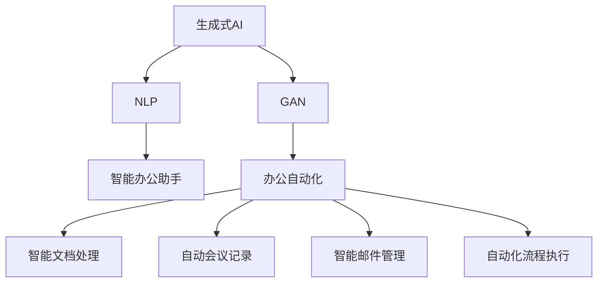

                 

# AIGC推动智能办公升级

> 关键词：人工智能办公、生成式AI、自然语言处理(NLP)、生成对抗网络(GAN)、办公自动化、自动化流程

## 1. 背景介绍

### 1.1 问题由来
随着信息技术的不断进步，数字化办公环境正成为各行各业的标准配置。然而，尽管数字化办公带来了效率提升，但诸多繁琐、重复的行政管理工作仍困扰着企业。办公室人员大量时间消耗在处理邮件、文档、会议等事务上，难以抽身从事核心业务。同时，随着企业信息化水平的提升，海量数据如文档、报表、邮件等逐渐积累，管理和维护这些数据也成了一项艰巨的挑战。

为解决这些问题，人工智能办公(AI Office)技术应运而生。通过引入智能办公系统，将AI技术应用于日常办公流程，可以大幅提升工作效率，减少重复劳动，同时释放办公室人员，使其专注于更具创造性的工作。生成式AI(Generative AI, GAI)技术作为AIGC的核心，通过模拟人类的创造性思维和感知能力，在自然语言处理、图像生成、自动化流程等多个层面推动办公效率的升级，正逐渐成为推动办公自动化发展的新引擎。

### 1.2 问题核心关键点
当前，生成式AI技术在办公自动化中的应用主要集中在以下几个方面：

1. **智能文档处理**：使用OCR技术自动识别文档中的文字、表格、图片等，并自动进行分类、提取、归档等处理。
2. **自动会议记录**：通过语音识别技术自动转录会议内容，并生成会议纪要，帮助办公室人员快速了解会议要点。
3. **智能邮件管理**：使用自然语言处理技术自动分类、提取邮件内容，并自动生成邮件摘要，提升邮件处理的效率和质量。
4. **自动化流程执行**：通过智能决策、自动执行工具，将繁琐的流程自动化，如考勤打卡、报销审批等。
5. **智能办公助手**：结合自然语言处理和智能推荐技术，自动提供信息查询、任务分配、日程管理等办公支持。

这些应用场景的实现依赖于生成式AI技术的支持，尤其是自然语言处理、图像生成、生成对抗网络(GAN)等技术的发展。通过智能化办公自动化，企业能够释放更多人力资源，提升管理效率，进而增强企业竞争力。

## 2. 核心概念与联系

### 2.1 核心概念概述

为更好地理解生成式AI技术在智能办公中的应用，本节将介绍几个密切相关的核心概念：

- **生成式AI(Generative AI, GAI)**：利用机器学习模型生成与真实数据相似的新数据，如自然语言、图像、音频等，广泛应用于内容生成、数据生成、图像修复等领域。
- **自然语言处理(Natural Language Processing, NLP)**：通过计算机处理、理解、生成自然语言的技术，如文本分类、情感分析、语言生成等。
- **生成对抗网络(GAN, Generative Adversarial Networks)**：通过两个对抗神经网络模型互相训练，生成逼真、高质量的新数据，如图像生成、音乐生成等。
- **办公自动化(Office Automation)**：通过引入AI技术，自动化日常办公任务，提升办公效率和质量。
- **智能办公助手**：结合NLP和智能推荐技术，提供信息查询、任务管理、日程安排等智能办公支持。

这些概念之间的逻辑关系可以通过以下Mermaid流程图来展示：



这个流程图展示了生成式AI、自然语言处理、生成对抗网络等关键技术在智能办公自动化中的作用，以及这些技术是如何相互配合提升办公效率的。

## 3. 核心算法原理 & 具体操作步骤
### 3.1 算法原理概述

生成式AI技术在智能办公中的应用主要基于生成模型、判别模型和优化算法三个核心组件。

- **生成模型**：如变分自编码器(VAE)、生成对抗网络(GAN)等，用于生成逼真、高质量的新数据。
- **判别模型**：如分类器、判别器等，用于区分生成数据和真实数据。
- **优化算法**：如梯度下降、对抗训练等，用于训练生成模型和判别模型，使其协同工作，生成逼真、高质量的数据。

智能办公自动化系统中，生成式AI技术主要用于以下场景：

1. **智能文档处理**：通过OCR技术自动识别文本，并结合NLP技术进行分类、提取、归档等操作。
2. **自动会议记录**：使用语音识别技术自动转录会议内容，并生成会议纪要。
3. **智能邮件管理**：使用NLP技术自动分类、提取邮件内容，并生成邮件摘要。
4. **自动化流程执行**：通过智能决策、自动执行工具，将繁琐的流程自动化，如考勤打卡、报销审批等。
5. **智能办公助手**：结合NLP和智能推荐技术，自动提供信息查询、任务分配、日程管理等办公支持。

这些应用的实现依赖于生成式AI技术的支持，尤其是NLP、GAN等关键技术的集成和应用。

### 3.2 算法步骤详解

以下是基于生成式AI的智能办公自动化系统的主要实现步骤：

**Step 1: 数据预处理**
- 收集办公环境中的各种数据，如文档、邮件、会议记录等，并进行清洗、标注等预处理工作。

**Step 2: 训练生成模型**
- 使用收集到的数据，训练生成式AI模型，如GAN、VAE等。生成模型用于生成与真实数据相似的新数据。

**Step 3: 训练判别模型**
- 使用生成数据和真实数据，训练判别模型，如分类器、判别器等。判别模型用于区分生成数据和真实数据。

**Step 4: 模型优化与测试**
- 使用对抗训练等方法，优化生成模型和判别模型，直至生成数据与真实数据无明显差异。
- 在实际办公环境中测试系统性能，根据反馈不断优化模型。

**Step 5: 应用集成**
- 将训练好的生成式AI模型集成到办公自动化系统中，实现智能文档处理、自动会议记录、智能邮件管理、自动化流程执行等应用。
- 提供智能办公助手功能，结合NLP和智能推荐技术，提供信息查询、任务分配、日程管理等支持。

### 3.3 算法优缺点

基于生成式AI的智能办公自动化系统具有以下优点：

1. **提升效率**：自动化处理繁琐的文档、邮件、会议等事务，大幅提升办公效率。
2. **减少人工干预**：自动化的流程执行减少人工干预，降低出错率。
3. **降低成本**：通过智能办公助手，减少办公室人员的工作负担，降低人力成本。
4. **数据管理**：自动化的数据分类、提取、归档等操作，提升数据管理效率。

然而，该系统也存在一定的局限性：

1. **数据依赖性**：系统性能依赖于数据的质量和数量，数据不完整或不准确将影响系统效果。
2. **模型复杂度**：生成式AI模型训练复杂，需要大量的计算资源和标注数据。
3. **模型泛化能力**：当前生成模型泛化能力有限，可能对特定领域的文档、邮件等生成效果不佳。
4. **安全性问题**：自动生成的文档、邮件等可能包含敏感信息，需要严格的数据安全措施。
5. **交互性不足**：智能办公助手与用户交互缺乏人性化设计，用户体验有待提升。

尽管存在这些局限性，但基于生成式AI的智能办公自动化系统仍是大数据时代提高办公效率的重要手段，具有广阔的应用前景。

### 3.4 算法应用领域

生成式AI技术在智能办公中的应用已经涵盖了办公自动化系统中的多个关键领域，具体包括：

1. **智能文档处理**：如自动提取文档中的表格、图片、关键字等，并自动分类、归档等。
2. **自动会议记录**：使用语音识别技术自动转录会议内容，并生成会议纪要。
3. **智能邮件管理**：自动分类、提取邮件内容，并生成邮件摘要，提升邮件处理的效率和质量。
4. **自动化流程执行**：将繁琐的流程自动化，如考勤打卡、报销审批等。
5. **智能办公助手**：结合自然语言处理和智能推荐技术，自动提供信息查询、任务分配、日程管理等办公支持。

此外，生成式AI技术还应用于办公环境的图像生成、自动化报告生成、自动化内容创作等多个方向，为智能办公提供了更加多样化的应用场景。

## 4. 数学模型和公式 & 详细讲解 & 举例说明

### 4.1 数学模型构建

以下以GAN模型为例，介绍智能办公自动化系统中的生成对抗网络模型构建过程。

GAN模型由生成器(G)和判别器(D)两部分组成，通过对抗训练的方式，生成逼真、高质量的新数据。GAN模型的数学模型可以表示为：

$$
G(z) = \begin{cases}
x_G & z \sim \mathcal{N}(0, 1) \\
\text{Otherwise}
\end{cases}
$$

其中，$z$ 为生成器输入的噪声向量，$x_G$ 为生成的数据样本。

判别器的数学模型可以表示为：

$$
D(x) = \begin{cases}
1 & x \in \text{Real Data} \\
0 & x \in \text{Fake Data}
\end{cases}
$$

判别器的作用是区分真实数据和生成数据。

GAN模型的目标函数为：

$$
L_{GAN} = \mathbb{E}_{x \sim p_{data}} [\log D(x)] + \mathbb{E}_{z \sim p_z} [\log (1 - D(G(z))]]
$$

其中，$\mathbb{E}$ 为期望，$p_{data}$ 为真实数据分布，$p_z$ 为噪声向量分布。

通过最小化上述目标函数，训练生成器和判别器，使生成数据与真实数据无法区分。

### 4.2 公式推导过程

GAN模型的训练过程分为两个阶段：

1. 判别器的训练
- 真实数据 $x$ 通过判别器 $D$，得到判别概率 $p(D(x))$。
- 将真实数据的判别概率 $p(D(x))$ 作为判别器的目标，使用梯度下降法优化判别器参数。

2. 生成器的训练
- 噪声向量 $z$ 通过生成器 $G$，得到生成的数据样本 $x_G$。
- 将生成的数据样本 $x_G$ 通过判别器 $D$，得到判别概率 $p(D(x_G))$。
- 将生成的数据样本的判别概率 $p(D(x_G))$ 作为生成器的目标，使用梯度下降法优化生成器参数。

### 4.3 案例分析与讲解

假设我们有一个简单的文本生成任务，目标生成与输入文本风格相似的文本。我们可以使用GAN模型来训练生成器，使得生成的文本与真实文本无明显差异。

具体步骤如下：

1. 准备数据集：收集与目标文本风格相似的文本数据集，作为真实数据集。

2. 初始化生成器和判别器：使用神经网络模型，如LSTM、GRU等，初始化生成器和判别器。

3. 训练判别器：使用真实数据和噪声数据（通过随机噪声生成）训练判别器，使其能够区分真实数据和生成数据。

4. 训练生成器：使用噪声数据训练生成器，使其生成的文本与真实数据相似。

5. 对抗训练：在生成器和判别器之间进行对抗训练，不断优化生成器和判别器，直至生成的文本与真实数据无明显差异。

通过上述过程，我们可以训练出高质量的文本生成模型，应用于智能办公中的自动内容生成、自动化报告生成等场景。

## 5. 项目实践：代码实例和详细解释说明
### 5.1 开发环境搭建

在进行生成式AI技术的应用实践前，我们需要准备好开发环境。以下是使用Python进行TensorFlow开发的环境配置流程：

1. 安装Anaconda：从官网下载并安装Anaconda，用于创建独立的Python环境。

2. 创建并激活虚拟环境：
```bash
conda create -n tf-env python=3.8 
conda activate tf-env
```

3. 安装TensorFlow：根据CUDA版本，从官网获取对应的安装命令。例如：
```bash
conda install tensorflow=2.6 -c pytorch -c conda-forge
```

4. 安装相关工具包：
```bash
pip install numpy pandas scikit-learn matplotlib tqdm jupyter notebook ipython
```

完成上述步骤后，即可在`tf-env`环境中开始生成式AI的应用实践。

### 5.2 源代码详细实现

下面我们以基于GAN的文本生成任务为例，给出使用TensorFlow对GAN模型进行训练的PyTorch代码实现。

首先，定义生成器和判别器的模型结构：

```python
import tensorflow as tf
from tensorflow.keras.layers import Input, Dense, LeakyReLU, Dropout, Concatenate

class Generator(tf.keras.Model):
    def __init__(self, latent_dim, img_shape):
        super(Generator, self).__init__()
        self.img_shape = img_shape
        self.model = self.build_model(latent_dim)
        
    def build_model(self, latent_dim):
        dense_1 = Dense(128, input_dim=latent_dim)
        leakyrelu_1 = LeakyReLU(alpha=0.2)
        dropout_1 = Dropout(0.2)
        dense_2 = Dense(128)
        leakyrelu_2 = LeakyReLU(alpha=0.2)
        dropout_2 = Dropout(0.2)
        dense_3 = Dense(np.prod(self.img_shape))
        res = tf.reshape(dense_3, self.img_shape)
        return tf.keras.Sequential([
            Input(shape=(latent_dim,)),
            dense_1, leakyrelu_1, dropout_1,
            dense_2, leakyrelu_2, dropout_2,
            dense_3, res
        ])

class Discriminator(tf.keras.Model):
    def __init__(self, img_shape):
        super(Discriminator, self).__init__()
        self.model = self.build_model(img_shape)
        
    def build_model(self, img_shape):
        dense_1 = Dense(128, input_shape=img_shape)
        leakyrelu_1 = LeakyReLU(alpha=0.2)
        dense_2 = Dense(128)
        leakyrelu_2 = LeakyReLU(alpha=0.2)
        dense_3 = Dense(1)
        return tf.keras.Sequential([
            Input(shape=img_shape),
            dense_1, leakyrelu_1,
            dense_2, leakyrelu_2,
            dense_3
        ])
```

然后，定义训练函数：

```python
def train_step(gan, batch_size, latent_dim):
    noise = tf.random.normal([batch_size, latent_dim])
    with tf.GradientTape() as tape:
        generated_images = gan(noise)
        real_images = dataset[0]
        real_labels = tf.ones_like(real_images)
        fake_labels = tf.zeros_like(real_images)
        
        disc_real_loss = gan.discriminator.train_on_batch(real_images, real_labels)
        disc_fake_loss = gan.discriminator.train_on_batch(generated_images, fake_labels)
        gen_loss = gan.train_on_batch(noise, fake_labels)
        
    disc_loss = 0.5 * (disc_real_loss + disc_fake_loss)
    gen_loss = 0.5 * gen_loss
    tape.watch(gan.model)
    grads = tape.gradient(gen_loss, gan.model.trainable_weights)
    gan.model.apply_gradients(zip(grads, gan.model.trainable_weights))
```

最后，启动训练流程：

```python
epochs = 100
batch_size = 64
latent_dim = 100

for epoch in range(epochs):
    train_step(gan, batch_size, latent_dim)
    if epoch % 10 == 0:
        print(f"Epoch {epoch+1}, disc loss: {disc_loss:.4f}, gen loss: {gen_loss:.4f}")
```

以上就是使用TensorFlow对GAN模型进行文本生成任务训练的完整代码实现。可以看到，TensorFlow提供了丰富的工具和库支持，使得模型的搭建和训练过程变得简洁高效。

### 5.3 代码解读与分析

让我们再详细解读一下关键代码的实现细节：

**Generator类**：
- `__init__`方法：初始化生成器模型，定义输入维度和模型结构。
- `build_model`方法：构建生成器模型的网络结构，包括多个全连接层、LeakyReLU激活函数、Dropout等。

**Discriminator类**：
- `__init__`方法：初始化判别器模型，定义输入维度和模型结构。
- `build_model`方法：构建判别器模型的网络结构，包括多个全连接层、LeakyReLU激活函数等。

**train_step函数**：
- 通过噪声向量生成与真实数据相同的文本样本，计算判别器的损失。
- 将生成文本通过判别器，计算判别器的损失。
- 将生成的文本通过生成器，计算生成器的损失。
- 使用梯度下降优化生成器和判别器的参数。

通过上述过程，我们可以训练出高质量的文本生成模型，应用于智能办公中的自动内容生成、自动化报告生成等场景。

## 6. 实际应用场景
### 6.1 智能文档处理

智能文档处理是生成式AI在智能办公中最为常见和重要的应用之一。通过OCR技术自动识别文档中的文字、表格、图片等，并结合NLP技术进行分类、提取、归档等操作，可以大大提升文档处理的效率和准确性。

具体实现方式如下：

1. **OCR识别**：使用OCR技术自动识别文档中的文字，转换为可编辑文本格式。
2. **文本分类**：使用NLP技术对文本进行分类，如将文档自动分类为合同、报告、邮件等。
3. **信息提取**：使用NLP技术提取文档中的关键信息，如公司名称、项目名称、时间等。
4. **归档管理**：将处理好的文档进行归档管理，建立文档索引，方便查询和检索。

通过智能文档处理，企业能够快速处理大量文档，减少人工干预，提升文档管理效率。

### 6.2 自动会议记录

自动会议记录是生成式AI在智能办公中的另一个重要应用。通过语音识别技术自动转录会议内容，并生成会议纪要，能够显著提高会议记录的效率和准确性。

具体实现方式如下：

1. **语音转录**：使用语音识别技术将会议录音转换为文本格式。
2. **会议纪要生成**：使用NLP技术对会议文本进行摘要生成、关键词提取等处理，自动生成会议纪要。
3. **自动分类**：根据会议主题和内容，自动将会议纪要进行分类归档。

通过自动会议记录，企业能够快速生成和整理会议纪要，提高会议管理效率，减少人工录入的工作负担。

### 6.3 智能邮件管理

智能邮件管理是生成式AI在智能办公中的关键应用之一。通过自然语言处理技术自动分类、提取邮件内容，并生成邮件摘要，能够显著提升邮件处理的效率和质量。

具体实现方式如下：

1. **邮件分类**：使用NLP技术自动分类邮件内容，如将邮件自动分类为工作邮件、私人邮件、垃圾邮件等。
2. **信息提取**：使用NLP技术提取邮件中的关键信息，如收件人、主题、时间等。
3. **摘要生成**：使用NLP技术自动生成邮件摘要，方便快速浏览邮件内容。

通过智能邮件管理，企业能够快速处理海量邮件，减少人工干预，提升邮件处理效率。

### 6.4 自动化流程执行

自动化流程执行是生成式AI在智能办公中的重要应用方向之一。通过智能决策、自动执行工具，将繁琐的流程自动化，能够显著提升办公效率。

具体实现方式如下：

1. **流程自动化**：使用自然语言处理技术自动提取流程中需要的信息，如时间、地点、人员等。
2. **决策自动化**：根据流程规则和条件，自动进行决策，如审批、打卡、请假等。
3. **任务分配**：自动将任务分配给相关人员，并提醒任务执行时间和状态。

通过自动化流程执行，企业能够减少人工干预，提高流程执行效率，降低出错率。

### 6.5 智能办公助手

智能办公助手是生成式AI在智能办公中的新兴应用方向之一。通过结合自然语言处理和智能推荐技术，自动提供信息查询、任务分配、日程管理等办公支持，能够提升办公助手的人性化和智能化水平。

具体实现方式如下：

1. **信息查询**：使用自然语言处理技术自动查询企业内部的文档、数据库等信息。
2. **任务分配**：根据任务优先级和人员工作状态，自动分配任务，并进行任务提醒。
3. **日程管理**：自动管理日程安排，提醒会议、审批等事项。

通过智能办公助手，企业能够提升办公助手的智能化水平，减少人工干预，提升办公效率。

## 7. 工具和资源推荐
### 7.1 学习资源推荐

为了帮助开发者系统掌握生成式AI技术在智能办公中的应用，这里推荐一些优质的学习资源：

1. TensorFlow官方文档：提供了详尽的TensorFlow学习资源，包括官方教程、示例代码、API文档等，适合初学者和进阶开发者。

2. PyTorch官方文档：提供了详尽的PyTorch学习资源，包括官方教程、示例代码、API文档等，适合初学者和进阶开发者。

3. Udacity《深度学习基础》课程：斯坦福大学开设的深度学习入门课程，涵盖深度学习的基本概念和经典模型。

4. Coursera《深度学习》课程：由深度学习领域的知名专家Andrew Ng主讲，适合深入学习深度学习理论和实践。

5. 《生成对抗网络：理论、算法与应用》书籍：详细介绍了GAN的理论基础、算法实现和应用案例，适合对GAN技术感兴趣的读者。

通过对这些资源的学习实践，相信你一定能够快速掌握生成式AI技术在智能办公中的应用，并用于解决实际的办公问题。

### 7.2 开发工具推荐

高效的开发离不开优秀的工具支持。以下是几款用于生成式AI技术应用的常用工具：

1. PyTorch：基于Python的开源深度学习框架，灵活动态的计算图，适合快速迭代研究。

2. TensorFlow：由Google主导开发的开源深度学习框架，生产部署方便，适合大规模工程应用。

3. HuggingFace Transformers库：提供了大量预训练模型和智能助手，适合快速搭建生成式AI应用。

4. Weights & Biases：模型训练的实验跟踪工具，可以记录和可视化模型训练过程中的各项指标，方便对比和调优。

5. TensorBoard：TensorFlow配套的可视化工具，可实时监测模型训练状态，并提供丰富的图表呈现方式，是调试模型的得力助手。

合理利用这些工具，可以显著提升生成式AI技术的开发效率，加快创新迭代的步伐。

### 7.3 相关论文推荐

生成式AI技术在智能办公中的应用源于学界的持续研究。以下是几篇奠基性的相关论文，推荐阅读：

1. DCGAN: Generative Adversarial Nets：提出了一种基于GAN的生成模型，用于生成高质量的图像。

2. Attention is All You Need：提出了Transformer模型，开启了深度学习领域的预训练大模型时代。

3. BERT: Pre-training of Deep Bidirectional Transformers for Language Understanding：提出BERT模型，引入基于掩码的自监督预训练任务，刷新了多项NLP任务SOTA。

4. GPT-3：推出了一款基于Transformer的大语言模型，具备强大的生成和理解能力，推动了NLP技术的突破。

5. StyleGAN: A Generative Adversarial Network for Realistic Image Synthesis：提出了一种高质量图像生成的GAN模型，应用于智能办公的自动化报告生成等场景。

这些论文代表了大生成式AI技术的发展脉络。通过学习这些前沿成果，可以帮助研究者把握学科前进方向，激发更多的创新灵感。

## 8. 总结：未来发展趋势与挑战
### 8.1 总结

本文对生成式AI技术在智能办公中的应用进行了全面系统的介绍。首先阐述了生成式AI技术在智能办公中的应用背景和意义，明确了智能办公自动化系统在提升办公效率、降低人工成本方面的独特价值。其次，从原理到实践，详细讲解了生成式AI的数学模型和算法原理，给出了生成式AI技术在智能办公中的应用实例和详细代码实现。同时，本文还探讨了生成式AI技术在智能文档处理、自动会议记录、智能邮件管理、自动化流程执行、智能办公助手等多个方向的应用前景，展示了生成式AI技术在智能办公中的广阔应用空间。此外，本文还精选了生成式AI技术的各类学习资源，力求为读者提供全方位的技术指引。

通过本文的系统梳理，可以看到，生成式AI技术在智能办公自动化中的应用正在成为企业数字化转型的重要推动力，极大地提升了办公效率和质量，释放了人力资源，降低了管理成本。未来，伴随生成式AI技术的不断进步，智能办公系统还将拓展到更多领域，如智能客户服务、智能制造等，为各行各业带来变革性影响。

### 8.2 未来发展趋势

展望未来，生成式AI技术在智能办公中的应用将呈现以下几个发展趋势：

1. **多模态融合**：未来生成式AI技术将不仅限于文本和图像，还将拓展到语音、视频、增强现实等多种模态数据的融合，提升智能办公的感知和交互能力。

2. **智能决策支持**：通过引入因果推断、知识图谱等技术，提升智能办公决策的准确性和合理性，辅助办公室人员进行更高效的工作。

3. **个性化服务**：利用用户行为数据，提供个性化的信息查询、任务分配、日程管理等服务，提升用户体验。

4. **自动化办公流程**：通过智能决策、自动执行工具，将更多繁琐的办公流程自动化，释放办公室人员，提升办公效率。

5. **跨领域应用**：生成式AI技术将进一步拓展到更多领域，如智能制造、智能交通等，推动各行各业的数字化转型升级。

以上趋势凸显了生成式AI技术在智能办公中的重要地位，为其在企业中的应用提供了广阔前景。

### 8.3 面临的挑战

尽管生成式AI技术在智能办公中的应用已经取得了显著进展，但在迈向更加智能化、普适化应用的过程中，仍面临诸多挑战：

1. **数据隐私和安全**：智能办公系统需要处理大量敏感数据，数据隐私和安全问题尤为重要。如何在保障数据安全的前提下，充分利用数据进行智能办公，将是重要的研究方向。

2. **模型鲁棒性**：智能办公系统面临多样化的输入数据，模型的鲁棒性和泛化能力不足可能导致系统失效。如何提高生成式AI模型的鲁棒性，是一个亟待解决的问题。

3. **交互体验**：智能办公助手与用户的交互体验需要进一步提升，以更好地满足用户需求。如何在提升智能水平的同时，增强系统的友好性和易用性，还需要持续优化。

4. **计算资源**：生成式AI模型的训练和推理对计算资源要求较高，需要在保证效率的同时，优化模型资源占用，提高系统性能。

5. **伦理和法律问题**：智能办公系统涉及大量用户数据，可能引发隐私泄露、歧视等伦理和法律问题。如何在设计和使用智能办公系统时，遵循伦理和法律规范，是一个重要课题。

尽管面临这些挑战，但相信通过学界和产业界的共同努力，这些挑战终将一一克服，生成式AI技术必将在智能办公中发挥更大的作用，推动企业数字化转型的进程。

### 8.4 研究展望

面对生成式AI技术在智能办公中面临的挑战，未来的研究需要在以下几个方向寻求新的突破：

1. **数据隐私保护**：开发更加安全、可靠的数据隐私保护技术，保障数据在智能办公系统中的安全存储和使用。

2. **模型鲁棒性增强**：开发更加鲁棒、泛化能力强的生成式AI模型，以应对多样化的输入数据和复杂的应用场景。

3. **人机交互优化**：设计更加人性化、智能化的用户交互界面，提升智能办公助手与用户的互动体验。

4. **计算资源优化**：优化生成式AI模型的计算图，提高模型的计算效率和推理速度，降低资源消耗。

5. **伦理与法律合规**：研究智能办公系统中的伦理和法律问题，设计合规的智能办公系统，确保用户数据的安全和隐私保护。

这些研究方向的探索，必将引领生成式AI技术在智能办公中的进一步发展，为构建安全、可靠、智能化的智能办公系统提供新的突破点。面向未来，生成式AI技术需要在智能办公中发挥更大作用，推动企业数字化转型的进程。

## 9. 附录：常见问题与解答

**Q1：生成式AI在智能办公中的应用有哪些？**

A: 生成式AI在智能办公中的应用主要包括以下几个方面：
1. 智能文档处理：通过OCR技术自动识别文档中的文字、表格、图片等，并自动进行分类、提取、归档等操作。
2. 自动会议记录：使用语音识别技术自动转录会议内容，并生成会议纪要。
3. 智能邮件管理：自动分类、提取邮件内容，并生成邮件摘要，提升邮件处理的效率和质量。
4. 自动化流程执行：将繁琐的流程自动化，如考勤打卡、报销审批等。
5. 智能办公助手：结合自然语言处理和智能推荐技术，自动提供信息查询、任务分配、日程管理等办公支持。

**Q2：如何提升生成式AI模型的鲁棒性？**

A: 提升生成式AI模型的鲁棒性可以从以下几个方面入手：
1. 数据增强：通过数据扩充、增强技术，增加模型对不同输入的适应能力。
2. 对抗训练：使用对抗样本训练模型，提升模型对噪声和扰动的抵抗能力。
3. 模型优化：使用正则化、Dropout等技术，优化模型参数，减少过拟合。
4. 多模型集成：训练多个生成式AI模型，通过集成提升整体鲁棒性。
5. 知识融合：结合符号化的先验知识，引导模型学习更全面、准确的语言模型。

**Q3：智能办公系统中如何保护用户数据隐私？**

A: 智能办公系统中保护用户数据隐私可以从以下几个方面入手：
1. 数据匿名化：对用户数据进行去标识化处理，避免泄露个人隐私。
2. 数据加密：对用户数据进行加密存储和传输，保障数据安全。
3. 访问控制：通过身份认证、权限管理等技术，限制对用户数据的访问权限。
4. 数据审计：建立数据使用审计机制，跟踪数据的使用情况，确保数据合规使用。
5. 合规性设计：在设计智能办公系统时，遵循相关的隐私保护法规和标准，确保系统符合伦理和法律要求。

**Q4：智能办公系统如何提高生成式AI模型的计算效率？**

A: 提高生成式AI模型的计算效率可以从以下几个方面入手：
1. 模型压缩：通过剪枝、量化等技术，减小模型参数量和计算量。
2. 计算图优化：优化生成式AI模型的计算图，减少前向传播和反向传播的资源消耗。
3. 分布式训练：利用分布式计算技术，提高模型训练效率。
4. 硬件优化：利用GPU、TPU等高性能计算资源，加速模型训练和推理。
5. 模型融合：将多个生成式AI模型进行融合，提升整体计算效率。

**Q5：智能办公系统中如何优化智能办公助手的用户体验？**

A: 优化智能办公助手的用户体验可以从以下几个方面入手：
1. 交互界面设计：设计简洁、易用的用户界面，提升用户操作体验。
2. 自然语言处理：提升智能办公助手对自然语言的理解能力，使其能够更好地理解用户需求。
3. 智能推荐：通过用户行为数据分析，提供个性化的信息查询、任务分配、日程管理等服务，提升用户体验。
4. 可视化设计：使用图表、仪表盘等可视化工具，直观展示系统状态和结果，提升用户理解能力。
5. 用户反馈机制：建立用户反馈机制，及时收集用户意见和建议，持续优化系统功能。

这些措施可以帮助提升智能办公助手的用户体验，使其更好地服务于企业内部用户，提升办公效率。

---

作者：禅与计算机程序设计艺术 / Zen and the Art of Computer Programming

