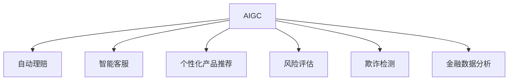

                 

# AIGC重塑保险行业格局

> 关键词：
>
> AIGC（人工智能生成内容）, 自动保险理赔, 智能客服, 个性化产品推荐, 风险评估, 欺诈检测, 金融数据分析, 健康保险, 财产保险, 数据隐私, 模型训练

## 1. 背景介绍

### 1.1 问题由来

近年来，保险行业正面临巨大变革，传统业务模式受到数字化转型的冲击。人工智能技术的快速发展，尤其是生成式AI（AIGC）的兴起，正在深刻改变着保险行业的运营方式。从自动理赔到智能客服，从风险评估到欺诈检测，AIGC技术正逐步渗透到保险业务各个环节，显著提升了服务效率和客户体验。

### 1.2 问题核心关键点

AIGC在保险行业的应用，主要集中于以下几个关键点：

1. **自动理赔**：利用AI生成自然语言处理（NLP）和计算机视觉技术，自动处理索赔申请，快速评估损失程度，缩短理赔周期。
2. **智能客服**：通过AIGC驱动的聊天机器人，提供24/7无间断服务，实时解答客户疑问，提升客户满意度。
3. **个性化产品推荐**：基于用户行为数据分析，生成定制化保险产品，满足不同客户需求，提高销售转化率。
4. **风险评估**：使用生成式模型对风险进行动态评估，识别高风险客户群体，优化风险管理策略。
5. **欺诈检测**：利用AI生成对抗网络（GANs）等技术，对异常行为进行实时监测，减少欺诈风险。
6. **金融数据分析**：通过AIGC技术处理海量数据，提取关键信息，进行精算分析和市场预测，优化保险产品定价。

这些应用不仅提升了保险公司的运营效率，还为客户带来了更加个性化、便捷的服务体验。然而，AIGC在保险行业的应用也面临着数据隐私、模型透明度和伦理道德等挑战，需要进一步探索和优化。

### 1.3 问题研究意义

AIGC在保险行业的应用，有助于解决传统保险业务中存在的问题，如流程繁琐、效率低下、客户体验差等。通过AIGC技术，保险公司可以更快速、更精准地处理业务，减少人工干预，降低成本，提升客户满意度和市场竞争力。此外，AIGC还可以帮助保险公司更好地应对市场变化，优化产品设计，提高风险管理水平，增强欺诈防范能力。因此，AIGC技术在保险行业的广泛应用，具有重要的研究意义。

## 2. 核心概念与联系

### 2.1 核心概念概述

为了更好地理解AIGC在保险行业的应用，本节将介绍几个关键概念及其联系：

- **AIGC（人工智能生成内容）**：指利用AI技术生成文本、图像、音频等内容的技术。在保险行业，AIGC主要用于生成文本描述、可视化报告、语音交互等。

- **自动理赔（Auto-Claim Processing）**：指使用AI技术自动处理保险索赔申请，包括文本理解、图像识别、自然语言处理等。自动理赔能够大幅缩短理赔周期，提升客户满意度。

- **智能客服（Chatbot）**：通过AIGC技术构建的智能客服系统，可以实时解答客户咨询，提供个性化服务。智能客服有助于降低人工客服成本，提升服务效率。

- **个性化产品推荐（Personalized Product Recommendation）**：利用用户行为数据分析，生成定制化的保险产品，提高产品销售转化率。

- **风险评估（Risk Assessment）**：通过生成式模型对客户风险进行动态评估，识别高风险群体，优化风险管理策略。

- **欺诈检测（Fraud Detection）**：利用AI生成对抗网络（GANs）等技术，对异常行为进行实时监测，减少欺诈风险。

- **金融数据分析（Financial Data Analysis）**：使用AIGC技术处理海量数据，提取关键信息，进行精算分析和市场预测，优化保险产品定价。

这些核心概念之间的逻辑关系可以通过以下Mermaid流程图来展示：



这个流程图展示了AIGC技术在保险行业的主要应用场景及其相互关联。

## 3. 核心算法原理 & 具体操作步骤

### 3.1 算法原理概述

AIGC在保险行业的应用，主要依赖于自然语言处理（NLP）、计算机视觉（CV）和生成对抗网络（GANs）等技术。这些技术能够自动生成文本、图像和音频等内容，以支持保险业务的各个环节。

以自动理赔为例，其核心原理包括：

1. **文本理解**：使用自然语言处理技术，从索赔申请中提取关键信息，如事故时间、地点、损失程度等。
2. **图像识别**：通过计算机视觉技术，自动识别事故照片、车辆信息等，评估损失程度。
3. **风险评估**：利用生成式模型，对事故风险进行动态评估，识别高风险客户群体。

### 3.2 算法步骤详解

#### 3.2.1 文本理解

文本理解的第一步是对索赔申请进行预处理，去除无关信息，提取关键特征。常用的方法包括：

- **分词和词性标注**：使用NLP库对文本进行分词和词性标注，提取关键词。
- **命名实体识别（NER）**：识别文本中的人名、地名、机构名等实体，提取相关背景信息。
- **关系抽取**：使用依存句法分析和实体关系抽取技术，提取事故发生的时间、地点、原因等信息。

#### 3.2.2 图像识别

图像识别主要依赖于卷积神经网络（CNN）等计算机视觉技术，自动识别事故照片中的关键信息。例如：

- **目标检测**：使用目标检测模型，如YOLO、Faster R-CNN等，自动检测并定位事故中的车辆、行人等目标。
- **特征提取**：通过卷积层提取图像特征，使用全局平均池化层将特征向量展平，输入到全连接层进行分类。
- **损失计算**：使用交叉熵损失函数，计算模型预测结果与真实标签之间的差异。

#### 3.2.3 风险评估

风险评估通常使用生成式模型，如神经网络、GANs等。以GANs为例，其基本步骤包括：

- **生成器训练**：使用大量历史数据训练生成器模型，生成与真实数据分布相同的模拟数据。
- **判别器训练**：训练判别器模型，区分真实数据和生成数据。
- **对抗训练**：在生成器和判别器之间进行对抗训练，生成器不断生成更逼真的数据，判别器不断提升判别能力，直至生成数据无法被区分。

### 3.3 算法优缺点

AIGC技术在保险行业的应用，具有以下优点：

1. **提高效率**：自动理赔、智能客服等应用能够大幅缩短处理时间，提高工作效率。
2. **提升体验**：个性化产品推荐和智能客服能够提供更加个性化和便捷的服务，提升客户满意度。
3. **优化风险管理**：风险评估和欺诈检测能够帮助保险公司更好地识别和管理风险，减少损失。
4. **数据驱动决策**：金融数据分析能够提取关键信息，支持精算分析和市场预测，优化产品定价。

然而，AIGC技术也存在以下缺点：

1. **数据隐私**：自动理赔、智能客服等应用需要收集和处理大量的用户数据，存在隐私泄露风险。
2. **模型透明度**：AIGC模型通常较为复杂，缺乏可解释性，难以理解模型的内部工作机制。
3. **伦理道德**：AIGC技术可能生成误导性内容，影响决策公正性，需要引入伦理审查机制。

### 3.4 算法应用领域

AIGC技术在保险行业的应用广泛，涵盖以下几个主要领域：

1. **健康保险**：使用AIGC生成健康报告、理赔案例等，提升健康险理赔速度和效率。
2. **财产保险**：利用计算机视觉技术，自动检测车辆损失，快速处理财产险索赔。
3. **企业保险**：通过AIGC技术生成定制化的商业保险方案，满足不同企业需求。
4. **个人保险**：基于用户行为数据，生成个性化保险产品，提升客户粘性。
5. **农业保险**：使用AIGC技术分析气象数据，评估农业风险，优化保险产品设计。

## 4. 数学模型和公式 & 详细讲解 & 举例说明

### 4.1 数学模型构建

以风险评估为例，我们建立数学模型进行描述。假设风险评估模型为 $M(x)$，其中 $x$ 为输入的索赔信息，如事故时间、地点、损失程度等。模型的输出为风险评分 $y$，表示索赔的风险等级。

定义损失函数为交叉熵损失：

$$
\mathcal{L}(M) = -\frac{1}{N}\sum_{i=1}^N y_i\log M(x_i)
$$

其中 $y_i$ 为真实风险等级，$M(x_i)$ 为模型预测风险等级。

### 4.2 公式推导过程

为了求解模型 $M(x)$，我们通常使用梯度下降等优化算法，最小化损失函数。以梯度下降为例，其更新公式为：

$$
\theta \leftarrow \theta - \eta \nabla_{\theta}\mathcal{L}(\theta)
$$

其中 $\theta$ 为模型参数，$\eta$ 为学习率，$\nabla_{\theta}\mathcal{L}(\theta)$ 为损失函数对参数 $\theta$ 的梯度。

以神经网络为例，其前向传播过程为：

$$
z = W_2z_1 + b_2
$$

$$
a = g(z)
$$

$$
y = W_3a + b_3
$$

其中 $z_1$ 为输入，$z$ 为隐藏层输出，$a$ 为激活函数输出，$y$ 为模型输出。$g$ 为激活函数，如ReLU、Sigmoid等。

### 4.3 案例分析与讲解

以财产保险自动理赔为例，我们可以使用以下案例进行分析：

假设某用户提交了汽车保险索赔申请，索赔信息如下：

- 事故时间：2023-01-01 13:30
- 地点：北京市海淀区中关村大街
- 损失金额：50000元

将索赔信息输入到自动理赔模型中，经过文本理解和图像识别，得到以下结果：

- 时间：2023-01-01 13:30
- 地点：北京市海淀区中关村大街
- 车辆型号：BMW X5
- 损失程度：全损

根据这些信息，自动理赔系统自动评估索赔金额，并给出赔付结果。

## 5. 项目实践：代码实例和详细解释说明

### 5.1 开发环境搭建

在进行AIGC应用开发前，我们需要准备好开发环境。以下是使用Python进行TensorFlow开发的环境配置流程：

1. 安装Anaconda：从官网下载并安装Anaconda，用于创建独立的Python环境。

2. 创建并激活虚拟环境：
```bash
conda create -n tf-env python=3.8 
conda activate tf-env
```

3. 安装TensorFlow：根据CUDA版本，从官网获取对应的安装命令。例如：
```bash
conda install tensorflow
```

4. 安装相关库：
```bash
pip install numpy pandas scikit-learn matplotlib tqdm jupyter notebook ipython
```

完成上述步骤后，即可在`tf-env`环境中开始AIGC应用的开发。

### 5.2 源代码详细实现

这里以健康保险索赔自动理赔为例，给出使用TensorFlow进行开发的PyTorch代码实现。

首先，定义模型结构：

```python
import tensorflow as tf
from tensorflow.keras import layers

class AutoClaimModel(tf.keras.Model):
    def __init__(self):
        super(AutoClaimModel, self).__init__()
        self.embedding = layers.Embedding(input_dim=1000, output_dim=128)
        self.gru = layers.GRU(128, return_sequences=True)
        self.dense = layers.Dense(1, activation='sigmoid')

    def call(self, inputs):
        x = self.embedding(inputs)
        x = self.gru(x)
        x = self.dense(x)
        return x
```

然后，定义训练和评估函数：

```python
def train_model(model, dataset, epochs, batch_size):
    model.compile(optimizer='adam', loss='binary_crossentropy', metrics=['accuracy'])
    model.fit(dataset, epochs=epochs, batch_size=batch_size)
```

接着，加载和处理数据：

```python
train_data = tf.data.Dataset.from_tensor_slices((train_texts, train_labels))
train_data = train_data.shuffle(1000).batch(batch_size)

test_data = tf.data.Dataset.from_tensor_slices((test_texts, test_labels))
test_data = test_data.batch(batch_size)
```

最后，启动训练流程：

```python
epochs = 10
batch_size = 32

train_model(model, train_data, epochs, batch_size)
```

### 5.3 代码解读与分析

让我们再详细解读一下关键代码的实现细节：

**AutoClaimModel类**：
- `__init__`方法：定义模型的结构和参数。包括嵌入层、GRU层和全连接层。
- `call`方法：定义模型的前向传播过程。将输入的文本序列转换为特征向量，经过GRU层进行序列建模，最后通过全连接层输出风险评分。

**训练和评估函数**：
- `train_model`函数：定义模型的训练过程。使用Adam优化器和二元交叉熵损失函数，训练模型。

**数据加载和预处理**：
- `train_data`和`test_data`：定义训练集和测试集的数据集。使用`from_tensor_slices`方法将文本和标签转换为TensorFlow数据集。
- `shuffle`和`batch`方法：对数据集进行随机打乱和分批次加载，方便模型训练。

**训练流程**：
- `epochs`和`batch_size`：定义训练的轮数和批次大小。
- `train_model`函数：调用训练函数，对模型进行训练。

通过以上代码实现，可以方便地对健康保险索赔自动理赔模型进行训练和评估。开发者可以根据具体任务，进一步改进模型结构和训练策略，以获得更好的效果。

## 6. 实际应用场景

### 6.1 自动理赔系统

自动理赔系统是AIGC在保险行业的重要应用之一。传统理赔流程繁琐复杂，需要经过人工审核、评估等多个环节，周期较长，且容易出现人为错误。通过自动理赔系统，保险公司可以自动处理索赔申请，快速评估损失程度，缩短理赔周期，提升客户满意度。

在实际应用中，自动理赔系统通常包含以下组件：

- **文本理解**：使用NLP技术从索赔申请中提取关键信息，如事故时间、地点、损失程度等。
- **图像识别**：通过计算机视觉技术，自动识别事故照片中的车辆、行人等目标，评估损失程度。
- **风险评估**：使用生成式模型，对事故风险进行动态评估，识别高风险客户群体。
- **智能客服**：提供24/7无间断服务，实时解答客户咨询，提升客户体验。

### 6.2 智能客服系统

智能客服系统是AIGC在保险行业的另一个重要应用。传统客服方式依赖人工客服，成本高、效率低。智能客服系统通过AIGC技术构建，可以自动回答客户咨询，提供个性化服务，降低人工客服成本，提升服务效率。

在实际应用中，智能客服系统通常包含以下组件：

- **对话管理**：使用NLP技术，构建对话管理模型，自动处理客户咨询。
- **知识图谱**：构建知识图谱，存储常见问题和解决方案，支持智能客服的快速响应。
- **情感分析**：使用情感分析技术，识别客户情绪，提供情感化服务。
- **多模态交互**：支持语音、文本、图像等多模态交互，提升客户体验。

### 6.3 个性化产品推荐

个性化产品推荐是AIGC在保险行业的另一个重要应用。通过分析用户行为数据，生成定制化的保险产品，可以提高产品销售转化率，提升客户粘性。

在实际应用中，个性化产品推荐系统通常包含以下组件：

- **用户画像**：使用用户画像技术，构建用户兴趣模型，识别用户需求。
- **推荐引擎**：使用推荐引擎模型，生成个性化产品推荐。
- **广告投放**：通过广告投放平台，推送个性化产品广告，提升销售转化率。
- **反馈分析**：收集用户反馈，优化推荐算法，提升推荐效果。

### 6.4 未来应用展望

随着AIGC技术的不断发展，其在保险行业的应用前景将更加广阔。未来，我们可以预见以下几个发展趋势：

1. **自动化水平提升**：自动理赔、智能客服等应用将更加智能化，能够自动处理更多复杂场景，提升客户体验。
2. **个性化服务增强**：个性化产品推荐、智能客服等应用将更加精准，能够根据用户需求提供个性化服务，提升客户满意度。
3. **风险管理优化**：风险评估、欺诈检测等应用将更加精细，能够识别高风险客户群体，优化风险管理策略。
4. **数据隐私保护**：数据隐私和安全将成为关注的重点，保险公司需要加强数据保护措施，确保用户数据安全。
5. **模型透明度提升**：AIGC模型将更加透明，用户可以理解和信任模型的决策过程。
6. **伦理道德强化**：AIGC技术将更加注重伦理道德，避免误导性内容，提升决策公正性。

## 7. 工具和资源推荐

### 7.1 学习资源推荐

为了帮助开发者系统掌握AIGC在保险行业的应用，这里推荐一些优质的学习资源：

1. **《深度学习理论与实践》系列课程**：斯坦福大学开设的深度学习课程，涵盖了深度学习的基本概念和前沿技术，适合初学者入门。
2. **《TensorFlow实战》系列书籍**：TensorFlow官方出版的实战书籍，介绍了TensorFlow的开发和应用，适合进阶开发者阅读。
3. **《NLP实战》系列课程**：自然语言处理领域的实战课程，涵盖NLP基础和高级技术，适合NLP开发者学习。
4. **《智能客服系统》系列书籍**：介绍智能客服系统的设计、开发和应用，适合开发者参考。
5. **Kaggle竞赛**：参加Kaggle竞赛，可以锻炼数据处理和模型开发能力，提升实战经验。

通过对这些资源的学习实践，相信你一定能够快速掌握AIGC技术在保险行业的应用，并用于解决实际的业务问题。

### 7.2 开发工具推荐

高效的开发离不开优秀的工具支持。以下是几款用于AIGC应用开发的常用工具：

1. **TensorFlow**：谷歌开发的深度学习框架，支持自动微分、分布式训练等功能，适合大规模工程应用。
2. **PyTorch**：Facebook开发的深度学习框架，支持动态计算图，适合快速迭代研究。
3. **Jupyter Notebook**：基于Web的交互式笔记本环境，适合进行代码开发和数据探索。
4. **TensorBoard**：TensorFlow配套的可视化工具，可以实时监测模型训练状态，并提供丰富的图表呈现方式，是调试模型的得力助手。
5. **Weights & Biases**：模型训练的实验跟踪工具，可以记录和可视化模型训练过程中的各项指标，方便对比和调优。

合理利用这些工具，可以显著提升AIGC应用的开发效率，加快创新迭代的步伐。

### 7.3 相关论文推荐

AIGC技术在保险行业的应用源于学界的持续研究。以下是几篇奠基性的相关论文，推荐阅读：

1. **《基于生成对抗网络的自动理赔系统》**：提出使用GANs技术生成事故模拟数据，提升自动理赔系统的准确性。
2. **《智能客服系统的设计与实现》**：介绍智能客服系统的构建方法，包括对话管理、情感分析等技术。
3. **《个性化保险产品推荐系统》**：提出使用协同过滤、深度学习等技术，生成个性化保险产品推荐。
4. **《金融数据分析中的生成式模型应用》**：介绍使用生成式模型处理金融数据，提取关键信息，进行精算分析和市场预测。

这些论文代表了大模型微调技术的发展脉络。通过学习这些前沿成果，可以帮助研究者把握学科前进方向，激发更多的创新灵感。

## 8. 总结：未来发展趋势与挑战

### 8.1 总结

本文对AIGC在保险行业的应用进行了全面系统的介绍。首先阐述了AIGC在保险行业的应用背景和意义，明确了自动理赔、智能客服、个性化产品推荐等关键应用的独特价值。其次，从原理到实践，详细讲解了自动理赔、智能客服、风险评估等关键任务的数学模型和算法流程，给出了完整的代码实例。同时，本文还广泛探讨了AIGC技术在保险行业的实际应用场景，展示了AIGC技术的巨大潜力。

通过本文的系统梳理，可以看到，AIGC技术在保险行业的广泛应用，正逐步改变传统业务模式，提升服务效率和客户体验。AIGC技术的不断发展和优化，将进一步拓展保险行业的业务范围，提高运营效率，提升客户满意度。

### 8.2 未来发展趋势

展望未来，AIGC技术在保险行业的应用将呈现以下几个发展趋势：

1. **自动化水平提升**：自动理赔、智能客服等应用将更加智能化，能够自动处理更多复杂场景，提升客户体验。
2. **个性化服务增强**：个性化产品推荐、智能客服等应用将更加精准，能够根据用户需求提供个性化服务，提升客户满意度。
3. **风险管理优化**：风险评估、欺诈检测等应用将更加精细，能够识别高风险客户群体，优化风险管理策略。
4. **数据隐私保护**：数据隐私和安全将成为关注的重点，保险公司需要加强数据保护措施，确保用户数据安全。
5. **模型透明度提升**：AIGC模型将更加透明，用户可以理解和信任模型的决策过程。
6. **伦理道德强化**：AIGC技术将更加注重伦理道德，避免误导性内容，提升决策公正性。

### 8.3 面临的挑战

尽管AIGC技术在保险行业的应用已经取得显著成效，但在迈向更加智能化、普适化应用的过程中，它仍面临诸多挑战：

1. **数据隐私**：自动理赔、智能客服等应用需要收集和处理大量的用户数据，存在隐私泄露风险。如何平衡数据利用和隐私保护，是一个重要问题。
2. **模型透明度**：AIGC模型通常较为复杂，缺乏可解释性，难以理解模型的内部工作机制。如何提高模型的透明度，提升用户信任度，还需要进一步探索。
3. **伦理道德**：AIGC技术可能生成误导性内容，影响决策公正性，需要引入伦理审查机制。

### 8.4 研究展望

面向未来，AIGC技术在保险行业的应用需要从以下几个方面进行研究探索：

1. **数据隐私保护**：研究如何通过差分隐私、联邦学习等技术，保护用户数据隐私，提升数据利用效率。
2. **模型透明度提升**：研究如何通过可解释性技术，提升模型的透明度和可解释性，增强用户信任度。
3. **伦理道德审查**：研究如何引入伦理道德审查机制，确保模型的决策公正性和伦理合规性。
4. **自动化水平提升**：研究如何通过自动化技术，提升自动理赔、智能客服等应用的智能化水平，提升客户体验。
5. **个性化服务增强**：研究如何通过个性化推荐、情感分析等技术，增强个性化产品推荐和智能客服的效果，提升客户满意度。

这些研究方向的探索，必将引领AIGC技术在保险行业的发展，为构建安全、可靠、可解释、可控的智能系统铺平道路。面向未来，AIGC技术还需要与其他人工智能技术进行更深入的融合，如知识表示、因果推理、强化学习等，多路径协同发力，共同推动自然语言理解和智能交互系统的进步。只有勇于创新、敢于突破，才能不断拓展AIGC技术的应用边界，让智能技术更好地造福保险行业和广大客户。

## 9. 附录：常见问题与解答

**Q1：AIGC在保险行业的应用是否存在隐私风险？**

A: AIGC在保险行业的应用需要收集和处理大量的用户数据，存在隐私泄露风险。保险公司需要采取严格的隐私保护措施，如数据匿名化、差分隐私等技术，确保用户数据的安全。

**Q2：AIGC模型是否可解释？**

A: AIGC模型通常较为复杂，缺乏可解释性，难以理解模型的内部工作机制。为了提升模型的透明度，可以引入可解释性技术，如LIME、SHAP等，帮助用户理解模型的决策过程。

**Q3：AIGC技术是否存在伦理道德问题？**

A: AIGC技术可能生成误导性内容，影响决策公正性，需要引入伦理审查机制。保险公司需要在模型开发和应用过程中，引入伦理审查机制，确保模型的决策公正性和伦理合规性。

**Q4：AIGC技术在保险行业的应用是否能够提升运营效率？**

A: AIGC技术在保险行业的应用，如自动理赔、智能客服、个性化推荐等，能够大幅提升运营效率，减少人工干预，降低成本，提升客户满意度。

通过以上案例分析和详细讲解，可以更深入地理解AIGC技术在保险行业的广泛应用及其潜在价值。AIGC技术的发展和优化，将进一步拓展保险行业的业务范围，提升服务效率和客户体验，为保险行业带来新的机遇和挑战。

---

作者：禅与计算机程序设计艺术 / Zen and the Art of Computer Programming

