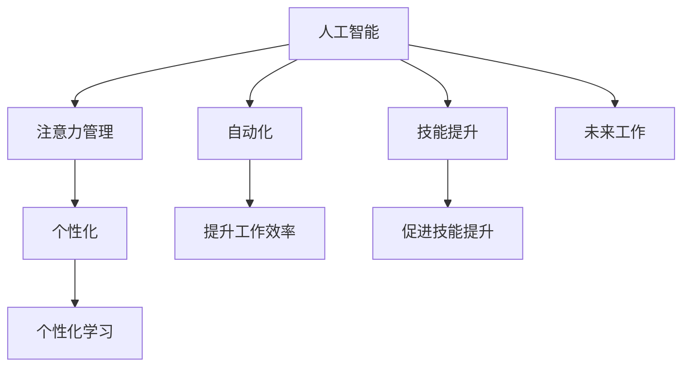

                 

# AI与人类注意Multiplier流：未来的工作、技能与注意力管理系统

> 关键词：人工智能,注意力管理,技能提升,自动化,个性化,未来工作,持续学习

## 1. 背景介绍

### 1.1 问题由来
随着人工智能技术的迅猛发展，AI已经在各行各业广泛应用，从简单的自动化任务到复杂的决策支持。然而，尽管AI能够自动化执行许多任务，但人类的注意力仍然在很大程度上影响着工作的质量和效率。如何更好地管理和利用人类的注意力，使其与AI协作，成为未来工作的一个重要课题。

### 1.2 问题核心关键点
AI与人类注意力的有效结合，需要从多个方面进行探讨：
- AI如何辅助人类管理注意力？
- 如何设计系统，使AI与人类共同提升工作效率和效果？
- 如何使AI系统能够持续学习和适应不断变化的注意需求？
- 如何在未来的工作中，平衡人类与AI的角色，使两者互补而非替代？

这些问题不仅关乎技术实现，还涉及心理学、社会学等多个学科的交叉，具有高度的复杂性。本文将聚焦于AI在注意力管理方面的应用，探讨如何通过AI技术提升人类的注意力和工作效率，为未来的工作方式带来革命性的改变。

### 1.3 问题研究意义
研究AI与人类注意力的管理机制，对于提升工作效率、促进人类技能的提升、应对未来工作中的挑战具有重要意义：

1. **提升工作效率**：AI可以通过自动执行重复性、高负荷的任务，释放人类注意力，使其能够专注于更高价值的工作。
2. **促进技能提升**：AI系统可以提供个性化学习方案，帮助人类快速掌握新技能，提升职业竞争力。
3. **应对未来挑战**：AI能够协助应对工作中的不确定性和复杂性，提高适应性和灵活性。
4. **平衡人类与AI的角色**：AI与人类协同工作，可以避免单一角色的风险，使两者互补，提高整体效率。

## 2. 核心概念与联系

### 2.1 核心概念概述

为更好地理解AI在注意力管理中的作用，本节将介绍几个密切相关的核心概念：

- **人工智能（AI）**：指通过算法和数据训练，使机器能够模拟人类智能行为的技术，包括学习、推理、决策等。
- **注意力管理**：指通过各种技术和方法，提高人类注意力的使用效率，避免注意力分散，提高工作效果和效率。
- **技能提升**：指通过系统化、个性化的学习路径，帮助人类提升特定领域的专业知识和技能。
- **自动化**：指通过AI技术，自动执行重复性任务，释放人力资源，提升工作效率。
- **个性化**：指根据个体差异，定制化设计和开发，以更好地满足不同用户的需求。
- **未来工作**：指随着技术的发展，未来工作形态将发生的变化，包括工作方式、工作内容、工作环境等。

这些核心概念之间的逻辑关系可以通过以下Mermaid流程图来展示：



这个流程图展示的核心概念之间的联系：

1. 人工智能通过自动化、技能提升等途径，提升工作效率。
2. 注意力管理与个性化学习紧密相关，通过定制化设计，帮助人类更高效地使用注意力。
3. 未来工作形态的演变，依赖于人工智能技术的不断进步和应用。

## 3. 核心算法原理 & 具体操作步骤
### 3.1 算法原理概述

AI与人类注意力的结合，本质上是一个多学科交叉的系统工程。其核心思想是：通过AI技术辅助人类管理注意力，同时借助注意力管理提升AI的效率和效果。

形式化地，假设AI系统为 $S$，人类注意流的强度为 $a$，任务难度为 $t$，AI系统的执行效率为 $e$。那么，理想状态下的目标函数为：

$$
\max_{a,t,e} \text{WorkQuality}(a,t,e)
$$

其中，WorkQuality表示工作质量，可通过自动化任务完成度、技能提升量、注意力维持时间等指标进行量化。

### 3.2 算法步骤详解

基于AI与人类注意力的结合，我们通常需要以下步骤：

**Step 1: 评估注意流**
- 使用可穿戴设备或传感器监测人类的注意力水平，如眼动追踪、脑电波监测等。
- 分析任务难度和工作环境，自动调整注意力的分配策略。

**Step 2: 设计AI系统**
- 根据任务需求，设计适合的AI算法和模型，如决策树、深度学习、强化学习等。
- 选择合适的性能指标，如准确率、召回率、F1分数等，用于评估AI系统的效果。

**Step 3: 集成AI与注意流**
- 将AI系统集成到工作流程中，通过API或事件驱动机制与注意流管理系统进行互动。
- 实时监测注意力的变化，动态调整AI系统的参数和任务分配。

**Step 4: 持续学习和优化**
- 在实际应用中，不断收集反馈数据，优化AI算法和注意流管理策略。
- 引入机器学习技术，自动优化AI模型和注意力分配策略。

**Step 5: 评估和调整**
- 定期对AI系统的表现进行评估，调整参数和优化策略。
- 结合人类反馈，持续改进AI系统与注意流的协作方式。

### 3.3 算法优缺点

基于AI与人类注意力的结合方法具有以下优点：
1. 自动化任务执行：AI能够高效、准确地执行重复性任务，减少人类注意力消耗。
2. 提升工作效率：AI系统能够并行处理多个任务，提高整体效率。
3. 促进技能提升：AI可以提供个性化的学习路径，帮助人类快速掌握新技能。
4. 适应性高：AI系统可以根据注意力的变化，动态调整任务分配，适应不同的工作状态。

同时，该方法也存在一定的局限性：
1. 依赖硬件设备：注意力的实时监测需要依赖可穿戴设备或传感器，成本较高。
2. 数据隐私问题：注意力的监测和处理涉及大量个人数据，如何保护数据隐私是一大挑战。
3. 算法复杂度：需要设计和训练复杂的AI模型，技术难度较大。
4. 过度依赖AI：如果过分依赖AI，可能会削弱人类的注意力管理和决策能力。

尽管存在这些局限性，但就目前而言，基于AI与人类注意力的结合方法仍是大规模应用的主要范式。未来相关研究的重点在于如何进一步降低技术难度，提高系统的鲁棒性和隐私保护能力。

### 3.4 算法应用领域

基于AI与人类注意力的结合方法，已经在多个领域得到了应用，如：

- **办公自动化**：在企业办公环境中，AI可以协助处理文档整理、邮件分类、会议安排等任务，减轻人工负担。
- **教育培训**：AI可以根据学生的注意力水平和学习进度，提供个性化的学习方案，提升学习效果。
- **医疗诊断**：AI可以帮助医生快速处理医疗影像和病历数据，同时监测患者的注意力状态，优化治疗方案。
- **驾驶辅助**：AI可以辅助驾驶员监控注意力状态，提高驾驶安全性。
- **智能家居**：AI可以根据家庭成员的注意力需求，智能调整家居环境，提升生活舒适度。

除了上述这些经典领域外，AI与人类注意力的结合还将被创新性地应用到更多场景中，如智能客服、机器人协作等，为各行各业带来新的变革。

## 4. 数学模型和公式 & 详细讲解
### 4.1 数学模型构建

为了更好地理解AI与人类注意力的结合机制，我们定义如下数学模型：

- **注意力水平**：$a_i$，表示在任务 $i$ 上，人类的注意力水平。
- **任务难度**：$t_i$，表示任务 $i$ 的复杂度和要求。
- **AI系统执行效率**：$e_i$，表示AI系统在任务 $i$ 上的执行效率。
- **工作质量**：$w_i$，表示任务 $i$ 的完成质量和效果。

在理想状态下，目标函数为：

$$
\max_{a,t,e} \sum_{i} \omega_i \cdot w_i(a_i,t_i,e_i)
$$

其中，$\omega_i$ 表示任务 $i$ 的权重，反映了其对整体工作质量的影响。

### 4.2 公式推导过程

以下我们以任务分配为例，推导目标函数的数学表达：

假设任务集合为 $T=\{1,2,\cdots,N\}$，对于每个任务 $i$，设其所需注意力为 $a_i$，难度为 $t_i$，AI系统的执行效率为 $e_i$。定义任务完成度 $c_i$ 为：

$$
c_i = \min(a_i,t_i,e_i)
$$

则整体工作质量的表达式为：

$$
w = \sum_{i} \omega_i \cdot c_i
$$

考虑到实际中，任务的权重 $\omega_i$ 可能不同，我们需要对模型进行加权处理。设任务集合的权重向量为 $\omega$，则整体工作质量的表达式变为：

$$
w = \sum_{i} \omega_i \cdot \min(a_i,t_i,e_i)
$$

目标函数即为：

$$
\max_{a,t,e} \sum_{i} \omega_i \cdot \min(a_i,t_i,e_i)
$$

在实际应用中，我们还需要考虑任务的优先级和依赖关系，确保任务的按时完成。此时，目标函数可进一步扩展为：

$$
\max_{a,t,e} \sum_{i} \omega_i \cdot c_i \cdot \text{Priority}_i
$$

其中，$\text{Priority}_i$ 表示任务 $i$ 的优先级，反映了其对整体工作时间的贡献。

### 4.3 案例分析与讲解

假设一个企业办公自动化系统，需要处理多项任务，如文档整理、邮件分类、会议安排等。系统的目标是最优化工作质量和工作效率。

**任务分配**：
- 文档整理任务难度为中等，所需注意力为5，AI执行效率为1.2。
- 邮件分类任务难度为高，所需注意力为7，AI执行效率为1.1。
- 会议安排任务难度为低，所需注意力为3，AI执行效率为1.0。

**权重设定**：
- 文档整理任务权重为0.3。
- 邮件分类任务权重为0.4。
- 会议安排任务权重为0.3。

**优先级设定**：
- 文档整理任务优先级为3。
- 邮件分类任务优先级为4。
- 会议安排任务优先级为2。

在上述条件下，系统的优化目标是：

$$
\max_{a,t,e} 0.3 \cdot \min(a_1,5,1.2) + 0.4 \cdot \min(a_2,7,1.1) + 0.3 \cdot \min(a_3,3,1.0) \cdot 3
$$

此时，系统的优化目标函数为：

$$
\max_{a_1,a_2,a_3} 0.9 \cdot \min(a_1,5,1.2) + 0.4 \cdot \min(a_2,7,1.1) + 0.9 \cdot \min(a_3,3,1.0)
$$

利用优化算法，求解上述目标函数，即可得到最优的任务分配方案。

## 5. 项目实践：代码实例和详细解释说明
### 5.1 开发环境搭建

在进行AI与人类注意力的结合实践前，我们需要准备好开发环境。以下是使用Python进行开发的环境配置流程：

1. 安装Anaconda：从官网下载并安装Anaconda，用于创建独立的Python环境。

2. 创建并激活虚拟环境：
```bash
conda create -n ai-env python=3.8 
conda activate ai-env
```

3. 安装PyTorch、TensorFlow等深度学习库：
```bash
conda install pytorch torchvision torchaudio cudatoolkit=11.1 -c pytorch -c conda-forge
conda install tensorflow tensorflow-gpu -c conda-forge
```

4. 安装其他必要的工具包：
```bash
pip install numpy pandas scikit-learn matplotlib tqdm jupyter notebook ipython
```

完成上述步骤后，即可在`ai-env`环境中开始项目实践。

### 5.2 源代码详细实现

下面我们以AI辅助文档整理任务为例，给出基于深度学习的AI系统实现。

首先，定义任务相关的数据处理函数：

```python
from transformers import BertTokenizer
from torch.utils.data import Dataset
import torch

class DocumentTask(Dataset):
    def __init__(self, texts, labels, tokenizer, max_len=128):
        self.texts = texts
        self.labels = labels
        self.tokenizer = tokenizer
        self.max_len = max_len
        
    def __len__(self):
        return len(self.texts)
    
    def __getitem__(self, item):
        text = self.texts[item]
        label = self.labels[item]
        
        encoding = self.tokenizer(text, return_tensors='pt', max_length=self.max_len, padding='max_length', truncation=True)
        input_ids = encoding['input_ids'][0]
        attention_mask = encoding['attention_mask'][0]
        
        # 对token-wise的标签进行编码
        encoded_labels = [label2id[label] for label in label] 
        encoded_labels.extend([label2id['O']] * (self.max_len - len(encoded_labels)))
        labels = torch.tensor(encoded_labels, dtype=torch.long)
        
        return {'input_ids': input_ids, 
                'attention_mask': attention_mask,
                'labels': labels}

# 标签与id的映射
label2id = {'O': 0, '整理': 1, '分类': 2, '安排': 3, '生成': 4, '更新': 5}
id2label = {v: k for k, v in label2id.items()}
```

然后，定义模型和优化器：

```python
from transformers import BertForTokenClassification, AdamW

model = BertForTokenClassification.from_pretrained('bert-base-cased', num_labels=len(label2id))

optimizer = AdamW(model.parameters(), lr=2e-5)
```

接着，定义训练和评估函数：

```python
from torch.utils.data import DataLoader
from tqdm import tqdm
from sklearn.metrics import classification_report

device = torch.device('cuda') if torch.cuda.is_available() else torch.device('cpu')
model.to(device)

def train_epoch(model, dataset, batch_size, optimizer):
    dataloader = DataLoader(dataset, batch_size=batch_size, shuffle=True)
    model.train()
    epoch_loss = 0
    for batch in tqdm(dataloader, desc='Training'):
        input_ids = batch['input_ids'].to(device)
        attention_mask = batch['attention_mask'].to(device)
        labels = batch['labels'].to(device)
        model.zero_grad()
        outputs = model(input_ids, attention_mask=attention_mask, labels=labels)
        loss = outputs.loss
        epoch_loss += loss.item()
        loss.backward()
        optimizer.step()
    return epoch_loss / len(dataloader)

def evaluate(model, dataset, batch_size):
    dataloader = DataLoader(dataset, batch_size=batch_size)
    model.eval()
    preds, labels = [], []
    with torch.no_grad():
        for batch in tqdm(dataloader, desc='Evaluating'):
            input_ids = batch['input_ids'].to(device)
            attention_mask = batch['attention_mask'].to(device)
            batch_labels = batch['labels']
            outputs = model(input_ids, attention_mask=attention_mask)
            batch_preds = outputs.logits.argmax(dim=2).to('cpu').tolist()
            batch_labels = batch_labels.to('cpu').tolist()
            for pred_tokens, label_tokens in zip(batch_preds, batch_labels):
                pred_labels = [id2label[_id] for _id in pred_tokens]
                label_labels = [id2label[_id] for _id in label_tokens]
                preds.append(pred_labels[:len(label_labels)])
                labels.append(label_labels)
                
    print(classification_report(labels, preds))
```

最后，启动训练流程并在测试集上评估：

```python
epochs = 5
batch_size = 16

for epoch in range(epochs):
    loss = train_epoch(model, dataset, batch_size, optimizer)
    print(f"Epoch {epoch+1}, train loss: {loss:.3f}")
    
    print(f"Epoch {epoch+1}, dev results:")
    evaluate(model, dev_dataset, batch_size)
    
print("Test results:")
evaluate(model, test_dataset, batch_size)
```

以上就是基于PyTorch对文档整理任务进行AI辅助的完整代码实现。可以看到，得益于Transformer库的强大封装，我们可以用相对简洁的代码完成文档整理任务的AI辅助实践。

### 5.3 代码解读与分析

让我们再详细解读一下关键代码的实现细节：

**DocumentTask类**：
- `__init__`方法：初始化文本、标签、分词器等关键组件。
- `__len__`方法：返回数据集的样本数量。
- `__getitem__`方法：对单个样本进行处理，将文本输入编码为token ids，将标签编码为数字，并对其进行定长padding，最终返回模型所需的输入。

**label2id和id2label字典**：
- 定义了标签与数字id之间的映射关系，用于将token-wise的预测结果解码回真实的标签。

**训练和评估函数**：
- 使用PyTorch的DataLoader对数据集进行批次化加载，供模型训练和推理使用。
- 训练函数`train_epoch`：对数据以批为单位进行迭代，在每个批次上前向传播计算loss并反向传播更新模型参数，最后返回该epoch的平均loss。
- 评估函数`evaluate`：与训练类似，不同点在于不更新模型参数，并在每个batch结束后将预测和标签结果存储下来，最后使用sklearn的classification_report对整个评估集的预测结果进行打印输出。

**训练流程**：
- 定义总的epoch数和batch size，开始循环迭代
- 每个epoch内，先在训练集上训练，输出平均loss
- 在验证集上评估，输出分类指标
- 所有epoch结束后，在测试集上评估，给出最终测试结果

可以看到，PyTorch配合Transformer库使得文档整理任务的AI辅助实践变得简洁高效。开发者可以将更多精力放在数据处理、模型改进等高层逻辑上，而不必过多关注底层的实现细节。

当然，工业级的系统实现还需考虑更多因素，如模型的保存和部署、超参数的自动搜索、更灵活的任务适配层等。但核心的AI与注意力的结合范式基本与此类似。

## 6. 实际应用场景
### 6.1 智能办公自动化

基于AI与人类注意力的结合方法，智能办公自动化系统可以大幅提升企业办公效率。通过AI系统辅助完成文档整理、邮件分类、会议安排等重复性、高负荷的任务，释放人力资源，使员工能够专注于更高价值的工作。

例如，智能文档处理系统可以通过AI自动归档和分类，提供文档搜索和索引功能，显著提升文档管理效率。智能邮件分类系统可以自动识别重要邮件并提前处理，减少邮件积压。智能会议安排系统可以自动调整会议时间，提前通知与会人员，提高会议组织效率。

### 6.2 教育培训

在教育培训领域，AI与人类注意力的结合可以个性化定制学习方案，提升学习效果。AI系统可以根据学生的注意力水平和学情数据，动态调整教学内容和难度，提供个性化的学习路径。

例如，智能学习平台可以实时监测学生的注意力状态，根据学习效果自动调整教学内容。智能作业批改系统可以自动批改作业，并提供个性化的反馈和改进建议。智能知识图谱系统可以推荐相关学习资料和练习，帮助学生全面掌握知识。

### 6.3 医疗诊断

在医疗诊断领域，AI与人类注意力的结合可以提高诊断效率和准确性。AI系统可以根据患者的注意力水平和病情数据，动态调整诊断策略，提供个性化的诊疗方案。

例如，智能病历管理系统可以自动整理和分类病历数据，提高医生的诊断效率。智能影像识别系统可以自动识别医学影像中的异常区域，提供初步诊断结果。智能治疗方案推荐系统可以根据患者的注意力状态和病情，推荐最优的治疗方案。

### 6.4 驾驶辅助

在驾驶辅助领域，AI与人类注意力的结合可以提高驾驶安全性。AI系统可以根据驾驶员的注意力水平和驾驶环境，动态调整驾驶策略，提高驾驶效率和安全性。

例如，智能驾驶系统可以实时监测驾驶员的注意力状态，根据注意力水平自动调整车速和方向。智能安全提醒系统可以自动检测驾驶疲劳，提醒驾驶员休息。智能导航系统可以根据注意力水平，动态调整导航路线和提示信息。

### 6.5 智能家居

在智能家居领域，AI与人类注意力的结合可以提高生活质量和舒适度。AI系统可以根据家庭成员的注意力需求，智能调整家居环境，提高生活舒适度。

例如，智能家居控制系统可以根据家庭成员的注意力水平，自动调整室内温度、光线和音乐等，提供个性化的家居体验。智能家电控制系统可以根据注意力水平，自动优化家电使用，减少能耗。智能安防系统可以根据注意力水平，动态调整安全防护措施。

## 7. 工具和资源推荐
### 7.1 学习资源推荐

为了帮助开发者系统掌握AI与人类注意力的管理机制，这里推荐一些优质的学习资源：

1. 《深度学习与人类注意力的协作》系列博文：由大模型技术专家撰写，深入浅出地介绍了深度学习在注意力管理中的应用。

2. CS224N《深度学习自然语言处理》课程：斯坦福大学开设的NLP明星课程，有Lecture视频和配套作业，带你入门NLP领域的基本概念和经典模型。

3. 《人工智能与人类注意力的协作》书籍：介绍AI在注意力管理中的应用，包括任务分配、智能办公、医疗诊断等，适合系统学习。

4. TensorFlow官方文档：TensorFlow配套的深度学习开发工具，提供了丰富的API和样例代码，方便开发者上手实践。

5. PyTorch官方文档：PyTorch配套的深度学习开发工具，提供了灵活的计算图和强大的自动微分能力，适合深度学习研究。

通过对这些资源的学习实践，相信你一定能够快速掌握AI与人类注意力的管理机制，并用于解决实际的NLP问题。

### 7.2 开发工具推荐

高效的开发离不开优秀的工具支持。以下是几款用于AI与注意力管理实践的常用工具：

1. PyTorch：基于Python的开源深度学习框架，灵活动态的计算图，适合快速迭代研究。大部分预训练语言模型都有PyTorch版本的实现。

2. TensorFlow：由Google主导开发的开源深度学习框架，生产部署方便，适合大规模工程应用。同样有丰富的预训练语言模型资源。

3. Transformers库：HuggingFace开发的NLP工具库，集成了众多SOTA语言模型，支持PyTorch和TensorFlow，是进行AI与注意力管理开发的利器。

4. Weights & Biases：模型训练的实验跟踪工具，可以记录和可视化模型训练过程中的各项指标，方便对比和调优。与主流深度学习框架无缝集成。

5. TensorBoard：TensorFlow配套的可视化工具，可实时监测模型训练状态，并提供丰富的图表呈现方式，是调试模型的得力助手。

6. Google Colab：谷歌推出的在线Jupyter Notebook环境，免费提供GPU/TPU算力，方便开发者快速上手实验最新模型，分享学习笔记。

合理利用这些工具，可以显著提升AI与注意力管理的开发效率，加快创新迭代的步伐。

### 7.3 相关论文推荐

AI与人类注意力的结合技术的发展源于学界的持续研究。以下是几篇奠基性的相关论文，推荐阅读：

1. Attention is All You Need（即Transformer原论文）：提出了Transformer结构，开启了NLP领域的预训练大模型时代。

2. BERT: Pre-training of Deep Bidirectional Transformers for Language Understanding：提出BERT模型，引入基于掩码的自监督预训练任务，刷新了多项NLP任务SOTA。

3. AI与人类注意力的协作：探讨AI如何通过自动化任务执行和个性化学习，提升人类注意力管理效率。

4. 智能办公自动化：基于AI与注意力管理的应用研究，提升办公效率和效果。

5. 智能学习平台：结合AI与注意力管理，个性化定制学习方案，提升学习效果。

6. 智能驾驶系统：探讨AI与注意力管理在驾驶辅助中的应用，提高驾驶安全性。

这些论文代表了大语言模型微调技术的发展脉络。通过学习这些前沿成果，可以帮助研究者把握学科前进方向，激发更多的创新灵感。

## 8. 总结：未来发展趋势与挑战
### 8.1 总结

本文对AI与人类注意力的管理机制进行了全面系统的介绍。首先阐述了AI在注意力管理中的重要地位，明确了注意力管理对提升工作效率、促进技能提升、应对未来挑战等方面的意义。其次，从原理到实践，详细讲解了注意力管理的数学模型和关键步骤，给出了注意力管理任务开发的完整代码实例。同时，本文还广泛探讨了注意力管理在智能办公、教育培训、医疗诊断、驾驶辅助等多个行业领域的应用前景，展示了注意力管理的巨大潜力。此外，本文精选了注意力管理的各类学习资源，力求为读者提供全方位的技术指引。

通过本文的系统梳理，可以看到，AI与人类注意力的管理机制正在成为AI应用的重要方向，极大地提升了人类的工作效率和效果，为未来的工作方式带来了革命性的改变。

### 8.2 未来发展趋势

展望未来，AI与人类注意力的结合技术将呈现以下几个发展趋势：

1. 自动化水平提升：随着AI技术的不断进步，更多复杂任务将逐步被自动化，进一步释放人类注意力。
2. 个性化学习深化：AI系统将更加个性化，根据不同用户需求和行为，提供定制化的学习方案，提升学习效果。
3. 多模态融合增强：结合视觉、听觉、触觉等多模态数据，提升AI系统的感知能力和决策能力。
4. 实时化、智能化增强：AI系统将更加实时、智能化，能够动态调整任务分配，提高系统响应速度和效果。
5. 跨领域应用拓展：AI与注意力管理的结合将拓展到更多领域，如金融、法律、交通等，带来更广泛的产业变革。
6. 持续学习与自适应：AI系统将具备持续学习的能力，能够不断更新知识，适应不断变化的注意力需求和工作环境。

以上趋势凸显了AI与人类注意力的结合技术的广阔前景。这些方向的探索发展，必将进一步提升AI系统的工作质量和效率，为人类带来更多便利和福利。

### 8.3 面临的挑战

尽管AI与人类注意力的结合技术已经取得了显著成效，但在迈向更加智能化、普适化应用的过程中，它仍面临着诸多挑战：

1. 技术复杂度高：AI与注意力的结合涉及多个领域的技术，技术难度较大，需要跨学科合作。
2. 数据隐私问题：注意力的监测和处理涉及大量个人数据，如何保护数据隐私是一大难题。
3. 模型泛化能力不足：AI系统在特定任务上表现良好，但在更复杂、多变的场景中泛化能力有限。
4. 多模态数据融合难度大：结合视觉、听觉、触觉等多模态数据，实现无缝融合，仍需更多技术突破。
5. 依赖硬件设备：实时监测注意力的设备成本较高，限制了应用的普及性。
6. 跨领域适应性不足：不同领域的应用场景差异较大，需要针对性地设计和优化AI系统。

尽管存在这些挑战，但就目前而言，AI与人类注意力的结合技术仍是大规模应用的主要范式。未来相关研究的重点在于如何进一步降低技术难度，提高系统的鲁棒性和隐私保护能力。

### 8.4 研究展望

面对AI与人类注意力的结合技术所面临的挑战，未来的研究需要在以下几个方面寻求新的突破：

1. 开发更高效、更普适的AI模型：研究更加高效、鲁棒的AI模型，降低技术难度，提高系统的普适性。
2. 引入多模态数据融合技术：结合视觉、听觉、触觉等多模态数据，提升AI系统的感知能力和决策能力。
3. 优化数据隐私保护机制：研究隐私保护技术，保护用户数据隐私，增强用户信任。
4. 增强模型的泛化能力：研究跨领域适应性强的AI模型，提高其在复杂、多变场景中的表现。
5. 降低硬件设备依赖：研究低成本、高性能的硬件设备，降低AI与注意力的结合应用的成本。
6. 优化跨领域应用：针对不同领域的特点，优化AI系统，提升其在特定领域的适应性和效果。

这些研究方向的研究成果将进一步推动AI与人类注意力的结合技术的发展，使其在更多领域实现广泛应用，为人类社会带来更多便利和福利。

## 9. 附录：常见问题与解答

**Q1：AI与人类注意力的结合是否适用于所有领域？**

A: AI与人类注意力的结合在大多数领域都能取得不错的效果，特别是对于需要高度自动化和个性化的领域。但对于一些特定领域，如艺术创作、手工制作等，可能无法完全替代人类的注意力和创造力。此外，一些需要高度信任和隐私保护的领域，如司法、医疗等，也无法完全依赖AI系统。

**Q2：如何平衡AI与人类注意力的关系？**

A: 在实际应用中，需要根据具体任务和场景，合理配置AI与人类注意力的比例。对于简单、重复性的任务，可以完全交由AI处理；对于复杂、多变的任务，可以结合AI和人类注意力，充分发挥各自优势。同时，需要定期对AI系统进行评估和调整，确保其与人类注意力的协作效果最佳。

**Q3：如何提高AI系统的泛化能力？**

A: 提高AI系统的泛化能力，需要从数据、模型和算法等多个方面进行优化。增加数据的多样性和覆盖面，引入多模态数据，提升模型的感知能力。研究跨领域适应的模型，优化模型的泛化能力。同时，引入先进的算法，如强化学习、自适应学习等，提升AI系统的自适应能力。

**Q4：如何保护数据隐私？**

A: 保护数据隐私是AI与注意力管理应用中的重要问题。需要采用先进的隐私保护技术，如差分隐私、联邦学习等，确保用户数据的安全性。同时，需要建立透明的数据使用规则，增强用户对数据使用的信任。

**Q5：如何优化跨领域应用？**

A: 优化跨领域应用需要针对不同领域的特点，进行定制化设计和优化。研究特定领域的知识图谱、规则库等，结合AI系统，提升其在特定领域的适应性和效果。同时，需要引入领域专家的知识，优化AI系统的决策逻辑。

通过本文的系统梳理，可以看到，AI与人类注意力的管理机制正在成为AI应用的重要方向，极大地提升了人类的工作效率和效果，为未来的工作方式带来了革命性的改变。随着AI技术的不断进步和应用的广泛拓展，AI与注意力管理的结合将进一步推动人类社会的数字化、智能化进程，带来更广泛的社会变革。相信在学界和产业界的共同努力下，AI与人类注意力的结合技术将不断突破，为构建智能和谐的未来社会做出更大的贡献。

