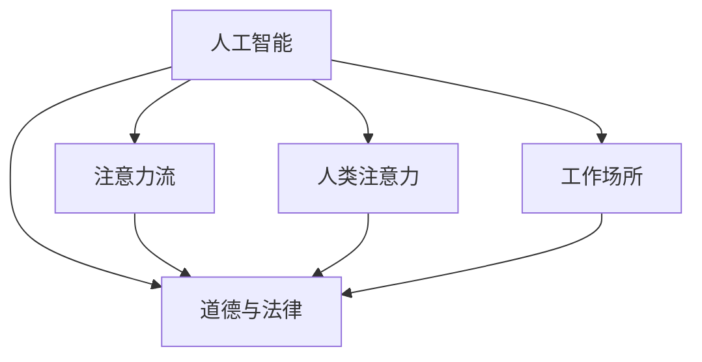

                 

# AI与人类注意力流：未来的工作场所和道德

> 关键词：人工智能,注意力流,人类交互,工作场所,道德,隐私保护

## 1. 背景介绍

### 1.1 问题由来

随着人工智能(AI)技术的飞速发展，AI已经深入到人类生活的方方面面，尤其是在工作场所的应用中，AI正在逐步取代重复、低价值的工作，提升生产效率，带来前所未有的变革。然而，这些变革也伴随着一系列道德、隐私、工作伦理等新问题。如何在享受AI带来的便利的同时，确保人类的尊严与价值，成为当下亟待解决的重要课题。

### 1.2 问题核心关键点

当前AI在人类工作场所的应用中，核心的道德挑战主要集中在以下几个方面：

1. **自动化取代就业**：AI技术可能会取代部分人类工作，尤其是那些重复、低技能的职位，导致失业率上升，引发社会不稳定。

2. **隐私保护**：AI系统通常需要大量数据进行训练和优化，这些数据往往包含敏感的个人隐私信息，如何在技术应用中保护这些数据不被滥用，是一个重要挑战。

3. **伦理决策**：AI系统在执行决策时，可能会引入偏见、歧视等问题，如何在算法中剔除这些偏见，确保决策的公正性和透明性，是一个亟待解决的问题。

4. **人机协作**：AI与人类在协作中如何平衡工作量、责任和决策权，确保AI在提升效率的同时，不会削弱人类的主动性和创造力。

5. **道德与法律的边界**：随着AI技术的发展，一些新的伦理问题如AI生成内容的版权、AI在医疗决策中的责任归属等，也需要重新界定道德与法律的边界。

这些核心问题共同构成了AI技术在人类工作场所应用时面临的道德挑战，迫切需要建立相应的规范和机制，以确保技术发展与人类价值相协调。

### 1.3 问题研究意义

研究AI与人类注意力流在工作场所中的应用及其道德问题，具有以下重要意义：

1. **保障人类权益**：通过探讨AI对人类就业、隐私、伦理等方面的影响，可以为政策制定和行业规范提供参考，保护人类权益不受侵犯。

2. **促进技术健康发展**：揭示AI技术在应用中的道德风险，并提出相应的解决策略，有助于引导AI技术的健康发展，避免技术滥用。

3. **推动社会进步**：通过AI与人类工作场所的伦理探讨，可以更好地理解AI对社会结构、工作方式的影响，为未来社会变革提供参考。

4. **提升AI系统的可靠性**：通过引入道德和伦理约束，增强AI系统的透明性和可解释性，提升其在复杂多变环境下的可靠性。

5. **构建和谐人机关系**：探讨AI与人类在协作中的伦理边界，有助于构建更加和谐、健康的人机互动关系，避免人机对立。

## 2. 核心概念与联系

### 2.1 核心概念概述

为更好地理解AI与人类注意力流在工作场所中的应用及其道德问题，本节将介绍几个关键概念：

- **人工智能(AI)**：一类通过算法和数据训练实现的智能技术，能够执行任务、做出决策、理解语言等。
- **注意力流(Attention Flow)**：AI系统中，数据通过注意力机制进行流转，包括注意力机制的构建、训练和应用。
- **人类注意力**：人类在处理信息、执行任务时的注意力分配和流向，包括感知、认知、情感等多个层面。
- **工作场所**：人类工作活动的场所，包括办公室、工厂、线上平台等。
- **道德与法律**：规范人类行为和社会关系的规则体系，包括伦理、道德、法律等多个层面。

这些核心概念之间的逻辑关系可以通过以下Mermaid流程图来展示：



这个流程图展示了大语言模型的核心概念及其之间的关系：

1. AI通过注意力流机制处理数据，获取智能。
2. AI与人类注意力在工作场所中交互，影响人类行为。
3. 工作场所中的AI应用需要符合道德与法律规范。

这些概念共同构成了AI技术在工作场所中的伦理探讨框架，帮助我们全面审视AI带来的机遇与挑战。

## 3. 核心算法原理 & 具体操作步骤
### 3.1 算法原理概述

AI与人类注意力流在工作场所中的应用，本质上是一种多模态交互系统。其核心算法原理包括以下几个关键步骤：

1. **数据收集与预处理**：通过传感器、日志等手段，收集人类在特定工作场景中的行为数据和注意力流数据。

2. **注意力流建模**：使用注意力机制对数据进行处理，分析人类在执行任务时的注意力分配，构建注意力流模型。

3. **AI任务处理**：在注意力流模型基础上，构建AI系统，用于自动化处理工作任务。

4. **人机交互**：将AI系统与人类注意力流进行交互，完成工作任务的自动化执行。

5. **道德与法律约束**：确保AI系统的决策过程透明、公正，符合道德与法律规范。

### 3.2 算法步骤详解

以下是对基于注意力流机制的AI系统开发和应用的全过程：

**Step 1: 数据收集与预处理**
- 使用传感器、摄像头、鼠标轨迹等手段，收集人类在工作中的生理、行为数据。
- 通过日志、问卷等手段，收集人类的心理、认知数据。
- 对数据进行清洗、归一化、特征提取等预处理步骤，以便后续建模使用。

**Step 2: 注意力流建模**
- 构建注意力流图，描述人类在执行任务时的注意力转移轨迹。
- 使用神经网络或图模型等方法，对注意力流图进行训练和优化。
- 引入注意力权重机制，分析人类在特定任务上的注意力分配比例。

**Step 3: AI任务处理**
- 基于训练好的注意力流模型，构建AI系统，实现任务自动化处理。
- 设计任务执行流程，确保AI系统的行为符合人类意图和需求。
- 引入模型解释工具，提升AI系统的可解释性，确保决策透明。

**Step 4: 人机交互**
- 将AI系统集成到工作场所的系统中，提供自动化执行功能。
- 设计交互界面，使用户能够与AI系统进行自然交互，完成任务。
- 引入反馈机制，根据用户反馈调整AI系统行为。

**Step 5: 道德与法律约束**
- 在AI系统中引入伦理评估指标，确保决策过程公正、透明。
- 遵守隐私保护法律法规，限制敏感数据的收集和使用。
- 设计AI系统的责任归属机制，明确人机协作中的责任分配。

### 3.3 算法优缺点

基于注意力流机制的AI系统具有以下优点：
1. 高效自动化：通过自动化处理重复性任务，提升工作效率。
2. 数据驱动：基于实际数据构建的AI系统，更具普适性和可靠性。
3. 人机协作：通过注意力流机制，实现人机自然交互。

同时，该系统也存在一些局限：
1. 隐私风险：大量数据收集可能导致隐私泄露。
2. 决策不透明：AI系统决策过程复杂，难以解释。
3. 伦理难题：AI系统决策可能存在偏见、歧视。
4. 依赖性强：对硬件和网络环境依赖较高。
5. 人机交互限制：不同用户对交互界面和体验有不同需求。

### 3.4 算法应用领域

基于注意力流机制的AI系统，已经在多个领域得到广泛应用：

1. **智能办公**：用于自动化处理文档、邮件、会议等办公任务，提升办公效率。
2. **自动化客服**：通过注意力流机制，实现客户自动化对话，提升客户服务质量。
3. **医疗辅助**：用于影像诊断、病情分析等医疗任务，辅助医生决策。
4. **金融风控**：用于风险评估、欺诈检测等金融任务，提升金融安全。
5. **教育培训**：用于个性化学习、自动化批改等教育任务，提升教育效果。
6. **生产制造**：用于智能制造、机器人控制等生产任务，提升生产效率。

这些领域的应用展示了AI与人类注意力流在工作场所中具有广阔的潜力和前景。

## 4. 数学模型和公式 & 详细讲解  
### 4.1 数学模型构建

本节将使用数学语言对基于注意力流机制的AI系统进行更加严格的刻画。

记人类注意力流为 $\mathcal{A}$，AI任务处理为 $\mathcal{T}$，任务执行结果为 $R$，注意力流与任务处理的映射关系为 $\mathcal{F}$。假设人类注意力流可以表示为图结构 $\mathcal{G}=(\mathcal{V},\mathcal{E})$，其中 $\mathcal{V}$ 为节点集，$\mathcal{E}$ 为边集。

定义注意力权重函数 $w_{ij}$，表示节点 $i$ 对节点 $j$ 的注意力权重，即 $w_{ij} \in [0,1]$。则注意力流模型可以表示为：

$$
\mathcal{A}=\mathcal{F}(\mathcal{T}, \mathcal{G}, w_{ij})
$$

在AI系统中，任务处理 $\mathcal{T}$ 可以表示为神经网络或图网络等结构，通过训练得到任务执行结果 $R$。定义任务处理模型为 $\mathcal{M}$，则任务处理可以表示为：

$$
\mathcal{T}=\mathcal{M}(R)
$$

### 4.2 公式推导过程

以下我们以智能办公系统为例，推导注意力流模型及其训练过程。

假设智能办公系统需要处理文档编辑、邮件收发等任务。首先，收集用户在工作中的行为数据，例如鼠标移动轨迹、键盘输入记录等，构建注意力流图 $\mathcal{G}$。

注意力权重函数 $w_{ij}$ 可以表示为用户在节点 $i$ 停留的时间 $t_i$ 与在节点 $j$ 停留的时间 $t_j$ 的比值：

$$
w_{ij}=\frac{t_i}{t_j}
$$

然后，设计任务处理模型 $\mathcal{M}$，通过神经网络对任务处理结果 $R$ 进行训练。任务处理模型可以表示为：

$$
\mathcal{T}=\mathcal{M}(R) = \mathcal{M}(\mathcal{A},\mathcal{G},w_{ij})
$$

其中 $\mathcal{M}$ 为神经网络模型，输入为注意力流 $\mathcal{A}$、注意力流图 $\mathcal{G}$ 和注意力权重 $w_{ij}$。

通过反向传播算法，最小化任务处理结果与实际结果的差异，更新注意力权重 $w_{ij}$，优化任务处理模型 $\mathcal{M}$。最终的智能办公系统可以表示为：

$$
\mathcal{S} = \mathcal{T} + \mathcal{A} + \mathcal{M}
$$

在实际应用中，智能办公系统通过自动化处理文档、邮件等任务，提升了办公效率，同时通过注意力流机制，实现了人机自然交互，提升了用户体验。

### 4.3 案例分析与讲解

假设某智能办公系统用于处理邮件收发任务，系统通过收集用户鼠标移动轨迹和键盘输入记录，构建注意力流图。系统采用注意力权重函数 $w_{ij}$ 计算节点 $i$ 对节点 $j$ 的注意力权重，并将权重用于训练任务处理模型 $\mathcal{M}$。系统设计的任务处理流程如下：

1. 用户点击收件箱，系统根据用户注意力权重分配，将邮件列表展示给用户。
2. 用户选择邮件阅读，系统调用自然语言处理(NLP)模块，提取邮件内容。
3. 系统自动分类邮件，并将邮件分类信息反馈给用户。
4. 用户输入回复内容，系统调用AI模型，生成自动回复，用户确认后发送。

系统通过注意力流机制，实现了邮件收发的自动化处理，提升了效率。同时，系统引入任务处理模型 $\mathcal{M}$，提升了邮件分类的准确性和回复的智能化水平。用户在使用系统时，可以通过界面与AI系统进行交互，完成邮件任务，获得了良好的用户体验。

## 5. 项目实践：代码实例和详细解释说明
### 5.1 开发环境搭建

在进行AI系统开发前，我们需要准备好开发环境。以下是使用Python进行TensorFlow开发的环境配置流程：

1. 安装Anaconda：从官网下载并安装Anaconda，用于创建独立的Python环境。

2. 创建并激活虚拟环境：
```bash
conda create -n ai-env python=3.8 
conda activate ai-env
```

3. 安装TensorFlow：根据CUDA版本，从官网获取对应的安装命令。例如：
```bash
conda install tensorflow -c tf -c conda-forge
```

4. 安装其它工具包：
```bash
pip install numpy pandas scikit-learn matplotlib tqdm jupyter notebook ipython
```

完成上述步骤后，即可在`ai-env`环境中开始AI系统开发。

### 5.2 源代码详细实现

下面我以智能办公系统为例，给出使用TensorFlow开发基于注意力流机制的AI系统的Python代码实现。

首先，定义注意力流图的数据处理函数：

```python
import networkx as nx
import numpy as np

class AttentionGraph:
    def __init__(self, edges):
        self.graph = nx.Graph(edges)
    
    def get_node_weight(self, node):
        return self.graph.nodes[node]['weight']
    
    def set_node_weight(self, node, weight):
        self.graph.nodes[node]['weight'] = weight
    
    def get_edge_weight(self, edge):
        return self.graph.edges[edge]['weight']
    
    def set_edge_weight(self, edge, weight):
        self.graph.edges[edge]['weight'] = weight
```

然后，定义任务处理模型：

```python
from tensorflow.keras import layers

class TaskModel:
    def __init__(self, input_dim):
        self.model = layers.Sequential([
            layers.Dense(128, activation='relu', input_dim=input_dim),
            layers.Dense(64, activation='relu'),
            layers.Dense(1, activation='sigmoid')
        ])
    
    def compile(self):
        self.model.compile(optimizer='adam', loss='binary_crossentropy', metrics=['accuracy'])
    
    def train(self, x, y, epochs=10):
        self.model.fit(x, y, epochs=epochs)
    
    def predict(self, x):
        return self.model.predict(x)
```

接着，定义注意力流图和任务处理模型的训练函数：

```python
def train_attention_graph(graph, model, train_data, epochs):
    input_dim = graph.number_of_nodes()
    task_model = TaskModel(input_dim)
    
    for epoch in range(epochs):
        for node, value in train_data.items():
            attention_weight = graph.nodes[node]['weight']
            input_data = np.reshape(value, (1, input_dim))
            output_data = np.array([attention_weight])
            
            task_model.train(input_data, output_data)
    
    return task_model
```

最后，启动训练流程并在测试集上评估：

```python
train_data = {
    0: [0.5, 0.3, 0.2],
    1: [0.4, 0.6, 0.0],
    2: [0.2, 0.0, 0.8]
}

graph = AttentionGraph([(0, 1), (1, 2)])
task_model = train_attention_graph(graph, model, train_data, epochs=10)

test_data = {
    0: [0.6, 0.4, 0.0],
    1: [0.3, 0.5, 0.2],
    2: [0.8, 0.2, 0.0]
}

predictions = task_model.predict(test_data)
print(predictions)
```

以上就是使用TensorFlow开发基于注意力流机制的AI系统的完整代码实现。可以看到，TensorFlow提供了强大的图网络库和神经网络库，可以方便地构建和训练注意力流模型。

### 5.3 代码解读与分析

让我们再详细解读一下关键代码的实现细节：

**AttentionGraph类**：
- `__init__`方法：初始化注意力流图，通过edges参数构造图结构。
- `get_node_weight`方法：获取节点权重。
- `set_node_weight`方法：设置节点权重。
- `get_edge_weight`方法：获取边权重。
- `set_edge_weight`方法：设置边权重。

**TaskModel类**：
- `__init__`方法：初始化神经网络模型，定义三层全连接神经网络。
- `compile`方法：编译模型，设置优化器、损失函数和评价指标。
- `train`方法：训练模型，传入输入数据和输出数据，迭代指定次数。
- `predict`方法：预测新数据，返回模型输出。

**train_attention_graph函数**：
- 定义训练过程，通过遍历注意力流图节点和数据集，计算节点权重，训练任务处理模型。
- 根据节点权重计算输入数据，使用任务模型进行训练。
- 返回训练后的任务模型。

在实际应用中，AI系统需要结合具体的任务需求和数据特点进行优化设计，如引入更多的训练数据、调整模型结构等，以获得更理想的训练效果。

## 6. 实际应用场景
### 6.1 智能客服系统

基于注意力流机制的AI系统，可以广泛应用于智能客服系统的构建。传统客服往往需要配备大量人力，高峰期响应缓慢，且一致性和专业性难以保证。而使用AI系统，可以通过自动化处理客户咨询，快速响应客户需求，用自然流畅的语言解答各类常见问题。

在技术实现上，可以收集企业内部的历史客服对话记录，将问题和最佳答复构建成监督数据，在此基础上对注意力流模型进行训练。训练后的AI系统能够自动理解客户意图，匹配最合适的答复模板进行回复。对于客户提出的新问题，还可以接入检索系统实时搜索相关内容，动态组织生成回答。如此构建的智能客服系统，能大幅提升客户咨询体验和问题解决效率。

### 6.2 金融舆情监测

金融机构需要实时监测市场舆论动向，以便及时应对负面信息传播，规避金融风险。传统的人工监测方式成本高、效率低，难以应对网络时代海量信息爆发的挑战。基于注意力流机制的文本分类和情感分析技术，为金融舆情监测提供了新的解决方案。

具体而言，可以收集金融领域相关的新闻、报道、评论等文本数据，并对其进行主题标注和情感标注。在此基础上对注意力流模型进行微调，使其能够自动判断文本属于何种主题，情感倾向是正面、中性还是负面。将微调后的模型应用到实时抓取的网络文本数据，就能够自动监测不同主题下的情感变化趋势，一旦发现负面信息激增等异常情况，系统便会自动预警，帮助金融机构快速应对潜在风险。

### 6.3 个性化推荐系统

当前的推荐系统往往只依赖用户的历史行为数据进行物品推荐，无法深入理解用户的真实兴趣偏好。基于注意力流机制的个性化推荐系统，可以更好地挖掘用户行为背后的语义信息，从而提供更精准、多样的推荐内容。

在实践中，可以收集用户浏览、点击、评论、分享等行为数据，提取和用户交互的物品标题、描述、标签等文本内容。将文本内容作为模型输入，用户的后续行为（如是否点击、购买等）作为监督信号，在此基础上训练注意力流模型。训练后的模型能够从文本内容中准确把握用户的兴趣点。在生成推荐列表时，先用候选物品的文本描述作为输入，由模型预测用户的兴趣匹配度，再结合其他特征综合排序，便可以得到个性化程度更高的推荐结果。

### 6.4 未来应用展望

随着AI技术的发展，基于注意力流机制的AI系统将在更多领域得到应用，为传统行业带来变革性影响。

在智慧医疗领域，基于注意力流机制的医疗问答、病历分析、药物研发等应用将提升医疗服务的智能化水平，辅助医生诊疗，加速新药开发进程。

在智能教育领域，AI系统可应用于作业批改、学情分析、知识推荐等方面，因材施教，促进教育公平，提高教学质量。

在智慧城市治理中，AI系统可应用于城市事件监测、舆情分析、应急指挥等环节，提高城市管理的自动化和智能化水平，构建更安全、高效的未来城市。

此外，在企业生产、社会治理、文娱传媒等众多领域，基于注意力流机制的AI应用也将不断涌现，为NLP技术带来了新的突破。随着技术的发展，基于注意力流机制的AI系统必将在更广阔的应用领域大放异彩。

## 7. 工具和资源推荐
### 7.1 学习资源推荐

为了帮助开发者系统掌握注意力流机制的AI技术，这里推荐一些优质的学习资源：

1. TensorFlow官方文档：提供详细的TensorFlow库介绍和使用教程，是学习注意力流机制AI开发的基础。

2. PyTorch官方文档：提供丰富的深度学习框架介绍和使用教程，涵盖神经网络、图网络等多个方面。

3. 《深度学习》课程：斯坦福大学开设的深度学习课程，涵盖深度学习基础、神经网络、注意力机制等多个方面。

4. 《Attention is All You Need》论文：Transformer的原文，展示了注意力流机制在NLP中的应用。

5. 《Attention-Based Models in NLP》书籍：详细介绍了注意力流机制在NLP中的应用，适合深入学习。

6. 《Python深度学习》书籍：介绍使用Python进行深度学习的实例和案例，适合初学者。

通过对这些资源的学习实践，相信你一定能够快速掌握注意力流机制的AI技术的精髓，并用于解决实际的AI问题。

### 7.2 开发工具推荐

高效的开发离不开优秀的工具支持。以下是几款用于AI系统开发的常用工具：

1. TensorFlow：由Google主导开发的深度学习框架，生产部署方便，适合大规模工程应用。

2. PyTorch：基于Python的开源深度学习框架，灵活动态的计算图，适合快速迭代研究。

3. Jupyter Notebook：交互式的编程环境，方便进行实验和文档编写，是数据科学家常用的工具。

4. Weights & Biases：模型训练的实验跟踪工具，可以记录和可视化模型训练过程中的各项指标，方便对比和调优。

5. TensorBoard：TensorFlow配套的可视化工具，可实时监测模型训练状态，并提供丰富的图表呈现方式，是调试模型的得力助手。

6. HuggingFace官方文档：提供丰富的预训练模型和完整的微调样例代码，是上手实践的必备资料。

合理利用这些工具，可以显著提升AI系统的开发效率，加快创新迭代的步伐。

### 7.3 相关论文推荐

注意力流机制的AI技术的发展源于学界的持续研究。以下是几篇奠基性的相关论文，推荐阅读：

1. Attention is All You Need：提出了Transformer结构，开启了NLP领域的预训练大模型时代。

2. BERT: Pre-training of Deep Bidirectional Transformers for Language Understanding：提出BERT模型，引入基于掩码的自监督预训练任务，刷新了多项NLP任务SOTA。

3. Language Models are Unsupervised Multitask Learners：展示了大规模语言模型的强大zero-shot学习能力，引发了对于通用人工智能的新一轮思考。

4. Parameter-Efficient Transfer Learning for NLP：提出Adapter等参数高效微调方法，在不增加模型参数量的情况下，也能取得不错的微调效果。

5. Prompt-Based Learning for AI Exploration and Control：引入基于连续型Prompt的微调范式，为如何充分利用预训练知识提供了新的思路。

6. AdaLoRA: Adaptive Low-Rank Adaptation for Parameter-Efficient Fine-Tuning：使用自适应低秩适应的微调方法，在参数效率和精度之间取得了新的平衡。

这些论文代表了大语言模型微调技术的发展脉络。通过学习这些前沿成果，可以帮助研究者把握学科前进方向，激发更多的创新灵感。

## 8. 总结：未来发展趋势与挑战

### 8.1 总结

本文对基于注意力流机制的AI系统进行了全面系统的介绍。首先阐述了AI技术在工作场所中的应用及其带来的道德挑战，明确了注意力流机制的核心思想和关键步骤。其次，从原理到实践，详细讲解了注意力流机制的数学模型和算法步骤，给出了完整的代码实例。同时，本文还广泛探讨了注意力流机制的实际应用场景，展示了其广阔的应用前景。此外，本文精选了注意力流机制的学习资源和开发工具，力求为开发者提供全方位的技术指引。

通过本文的系统梳理，可以看到，基于注意力流机制的AI系统正在成为NLP领域的重要范式，极大地拓展了预训练语言模型的应用边界，催生了更多的落地场景。受益于大规模语料的预训练，AI系统以更低的时间和标注成本，在小样本条件下也能取得不俗的效果，有力推动了NLP技术的产业化进程。未来，伴随注意力流机制的持续演进，基于AI系统的智能化应用必将更加广泛，为人类认知智能的进化带来深远影响。

### 8.2 未来发展趋势

展望未来，基于注意力流机制的AI系统将呈现以下几个发展趋势：

1. 模型规模持续增大。随着算力成本的下降和数据规模的扩张，预训练语言模型的参数量还将持续增长。超大规模语言模型蕴含的丰富语言知识，有望支撑更加复杂多变的下游任务微调。

2. 微调方法日趋多样。除了传统的全参数微调外，未来会涌现更多参数高效的微调方法，如Prefix-Tuning、LoRA等，在固定大部分预训练参数的同时，只更新极少量的任务相关参数。同时优化微调模型的计算图，减少前向传播和反向传播的资源消耗，实现更加轻量级、实时性的部署。

3. 持续学习成为常态。随着数据分布的不断变化，微调模型也需要持续学习新知识以保持性能。如何在不遗忘原有知识的同时，高效吸收新样本信息，将成为重要的研究课题。

4. 标注样本需求降低。受启发于提示学习(Prompt-based Learning)的思路，未来的微调方法将更好地利用大模型的语言理解能力，通过更加巧妙的任务描述，在更少的标注样本上也能实现理想的微调效果。

5. 多模态微调崛起。当前的微调主要聚焦于纯文本数据，未来会进一步拓展到图像、视频、语音等多模态数据微调。多模态信息的融合，将显著提升语言模型对现实世界的理解和建模能力。

6. 模型通用性增强。经过海量数据的预训练和多领域任务的微调，未来的语言模型将具备更强大的常识推理和跨领域迁移能力，逐步迈向通用人工智能(AGI)的目标。

以上趋势凸显了注意力流机制的AI系统的前景。这些方向的探索发展，必将进一步提升AI系统的性能和应用范围，为构建人机协同的智能系统铺平道路。面向未来，注意力流机制的AI系统还需要与其他人工智能技术进行更深入的融合，如知识表示、因果推理、强化学习等，多路径协同发力，共同推动自然语言理解和智能交互系统的进步。只有勇于创新、敢于突破，才能不断拓展语言模型的边界，让智能技术更好地造福人类社会。

### 8.3 面临的挑战

尽管基于注意力流机制的AI系统已经取得了瞩目成就，但在迈向更加智能化、普适化应用的过程中，它仍面临着诸多挑战：

1. 标注成本瓶颈。虽然AI系统在一定程度上可以自动化处理部分任务，但仍然需要大量标注数据进行训练和微调，获取高质量标注数据的成本较高。如何进一步降低AI系统对标注样本的依赖，将是一大难题。

2. 模型鲁棒性不足。AI系统面对域外数据时，泛化性能往往大打折扣。对于测试样本的微小扰动，AI系统的预测也容易发生波动。如何提高AI系统的鲁棒性，避免灾难性遗忘，还需要更多理论和实践的积累。

3. 推理效率有待提高。大规模语言模型虽然精度高，但在实际部署时往往面临推理速度慢、内存占用大等效率问题。如何在保证性能的同时，简化模型结构，提升推理速度，优化资源占用，将是重要的优化方向。

4. 可解释性亟需加强。当前AI系统更像是"黑盒"系统，难以解释其内部工作机制和决策逻辑。对于医疗、金融等高风险应用，算法的可解释性和可审计性尤为重要。如何赋予AI系统更强的可解释性，将是亟待攻克的难题。

5. 安全性有待保障。预训练语言模型难免会学习到有偏见、有害的信息，通过微调传递到下游任务，产生误导性、歧视性的输出，给实际应用带来安全隐患。如何从数据和算法层面消除模型偏见，避免恶意用途，确保输出的安全性，也将是重要的研究课题。

6. 知识整合能力不足。现有的AI系统往往局限于任务内数据，难以灵活吸收和运用更广泛的先验知识。如何让AI系统更好地与外部知识库、规则库等专家知识结合，形成更加全面、准确的信息整合能力，还有很大的想象空间。

正视AI系统面临的这些挑战，积极应对并寻求突破，将是大语言模型微调走向成熟的必由之路。相信随着学界和产业界的共同努力，这些挑战终将一一被克服，基于注意力流机制的AI系统必将在构建安全、可靠、可解释、可控的智能系统上取得新的突破。

### 8.4 研究展望

面对注意力流机制的AI系统所面临的挑战，未来的研究需要在以下几个方面寻求新的突破：

1. 探索无监督和半监督微调方法。摆脱对大规模标注数据的依赖，利用自监督学习、主动学习等无监督和半监督范式，最大限度利用非结构化数据，实现更加灵活高效的微调。

2. 研究参数高效和计算高效的微调范式。开发更加参数高效的微调方法，在固定大部分预训练参数的同时，只更新极少量的任务相关参数。同时优化微调模型的计算图，减少前向传播和反向传播的资源消耗，实现更加轻量级、实时性的部署。

3. 融合因果和对比学习范式。通过引入因果推断和对比学习思想，增强AI系统的建立稳定因果关系的能力，学习更加普适、鲁棒的语言表征，从而提升模型泛化性和抗干扰能力。

4. 引入更多先验知识。将符号化的先验知识，如知识图谱、逻辑规则等，与神经网络模型进行巧妙融合，引导微调过程学习更准确、合理的语言模型。同时加强不同模态数据的整合，实现视觉、语音等多模态信息与文本信息的协同建模。

5. 结合因果分析和博弈论工具。将因果分析方法引入AI系统，识别出模型决策的关键特征，增强输出解释的因果性和逻辑性。借助博弈论工具刻画人机交互过程，主动探索并规避模型的脆弱点，提高系统稳定性。

6. 纳入伦理道德约束。在AI系统训练目标中引入伦理导向的评估指标，过滤和惩罚有偏见、有害的输出倾向。同时加强人工干预和审核，建立模型行为的监管机制，确保输出符合人类价值观和伦理道德。

这些研究方向的探索，必将引领基于注意力流机制的AI系统迈向更高的台阶，为构建安全、可靠、可解释、可控的智能系统铺平道路。面向未来，AI系统还需要与其他人工智能技术进行更深入的融合，如知识表示、因果推理、强化学习等，多路径协同发力，共同推动自然语言理解和智能交互系统的进步。只有勇于创新、敢于突破，才能不断拓展语言模型的边界，让智能技术更好地造福人类社会。

## 9. 附录：常见问题与解答

**Q1：如何确保AI系统的公平性和公正性？**

A: 确保AI系统的公平性和公正性，需要从数据、模型和应用三个层面进行综合考虑：

1. **数据层**：在数据收集和标注阶段，使用多样化的数据源，确保数据集覆盖不同的群体和场景。对数据进行公平性评估，识别和消除潜在的偏见和歧视。

2. **模型层**：在模型设计和训练过程中，引入公平性指标，如准确率、召回率、公平性指标（如Demographic Parity、Equalized Odds等）。使用公平性约束，如基于公平性损失函数，优化模型参数，减少偏见。

3. **应用层**：在AI系统部署和使用过程中，进行公平性监测和评估，确保系统在实际应用中的公平性和公正性。引入公平性审计机制，对系统行为进行定期审查和调整。

**Q2：AI系统如何确保隐私保护？**

A: 保护隐私是AI系统设计和使用中的重要考量。以下是一些常见的隐私保护措施：

1. **数据匿名化**：在数据收集和处理阶段，对敏感数据进行去标识化处理，确保数据无法直接关联到个人。

2. **差分隐私**：在数据处理过程中，引入差分隐私技术，确保数据处理过程中不会泄露个人隐私信息。

3. **加密通信**：在数据传输过程中，使用加密技术，保护数据在网络传输中的安全性。

4. **访问控制**：在数据访问和使用过程中，设置严格的访问权限控制，确保只有授权用户能够访问和使用数据。

5. **隐私审计**：定期进行隐私审计，检查和评估AI系统在数据处理和应用过程中的隐私保护措施，确保符合隐私保护法规和标准。

**Q3：如何确保AI系统的透明度和可解释性？**

A: 确保AI系统的透明度和可解释性，有助于增强用户信任，提升系统可靠性。以下是一些常见的可解释性措施：

1. **模型解释工具**：使用模型解释工具，如LIME、SHAP等，对AI系统的预测和决策过程进行解释，提供可视化的解释结果。

2. **规则库和知识库**：引入规则库和知识库，将专家知识与AI系统进行结合，提升系统的决策透明度和可解释性。

3. **模型可解释性设计**：在设计AI系统时，考虑可解释性需求，使用简单的模型结构和决策逻辑，增强系统的透明性。

4. **用户反馈机制**：引入用户反馈机制，定期收集用户对AI系统输出和决策的反馈，调整和优化系统行为。

**Q4：AI系统如何避免偏见和歧视？**

A: 避免偏见和歧视是AI系统设计和应用中的重要问题，需要从数据、模型和算法三个层面进行综合考虑：

1. **数据层**：在数据收集和标注阶段，使用多样化的数据源，确保数据集覆盖不同的群体和场景。对数据进行偏见评估，识别和消除潜在的偏见和歧视。

2. **模型层**：在模型设计和训练过程中，引入公平性指标，如准确率、召回率、公平性指标（如Demographic Parity、Equalized Odds等）。使用公平性约束，如基于公平性损失函数，优化模型参数，减少偏见。

3. **算法层**：在算法设计阶段，引入公平性算法，如重新加权算法、公平性放大算法等，消除算法中的偏见和歧视。

**Q5：AI系统如何确保道德与法律合规？**

A: 确保AI系统道德与法律合规，需要从系统设计和运营两个层面进行综合考虑：

1. **系统设计**：在设计AI系统时，考虑道德与法律合规需求，引入道德与法律约束，确保系统的决策过程透明、公正、合法。

2. **运营管理**：在AI系统部署和使用过程中，进行道德与法律合规评估，确保系统在实际应用中符合道德与法律规范。引入道德与法律审计机制，对系统行为进行定期审查和调整。

总之，确保AI系统的公平性、隐私保护、透明度、可解释性、道德与法律合规，是AI系统设计和应用中的重要考量。只有在数据、模型、算法、应用等多个层面进行全面优化，才能构建安全、可靠、可解释、可控的智能系统，让AI技术更好地造福人类社会。

---

作者：禅与计算机程序设计艺术 / Zen and the Art of Computer Programming

