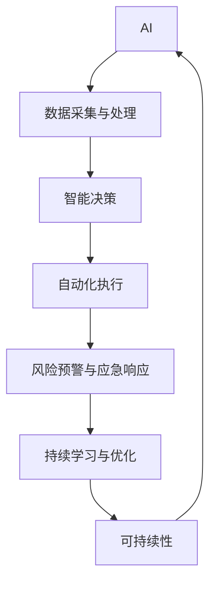

                 

# AI与人类计算：打造可持续发展的城市生活与管理

> 关键词：AI, 城市管理, 可持续性, 数据驱动决策, 计算效率

## 1. 背景介绍

### 1.1 问题由来
在过去几十年里，全球城市化进程迅速推进，城市人口规模不断扩大，带来了空前的资源压力和环境问题。如何在城市管理中实现资源的最优配置、环境的有效保护，确保城市的可持续发展，成为全球关注的焦点。

随着人工智能（AI）技术的发展，其在城市管理中的应用越来越广泛。AI不仅能提升城市管理的效率，还能在城市规划、环境监测、交通管理、公共安全等领域发挥重要作用。数据驱动决策和计算效率的提升，为城市管理带来了新的可能。

### 1.2 问题核心关键点
城市管理涉及复杂的系统，包括交通、能源、水资源、环境等各个方面。AI在城市管理中的应用，通过数据驱动的方式，对实时数据进行分析和处理，以优化资源配置和提高管理效率。其主要核心关键点包括：

1. **数据采集与处理**：城市管理的核心在于实时数据采集和处理。AI通过传感器、监控摄像头、智能设备等采集数据，并利用机器学习算法进行清洗、分类和预处理。

2. **智能决策**：基于数据分析和预测模型，AI可为城市管理者提供科学决策支持，优化交通流、调节能源供应、优化水质监测等。

3. **自动化执行**：AI可以自动化执行一些操作，如自动交通信号控制、智能电网管理、自动化垃圾处理等。

4. **风险预警与应急响应**：AI可通过实时数据分析，提前预警风险，如交通拥堵、环境污染等，并提供快速响应策略。

5. **持续学习与优化**：AI能够通过学习历史数据和最新变化，不断优化模型和决策策略，适应城市的动态变化。

## 2. 核心概念与联系

### 2.1 核心概念概述

为更好地理解AI在城市管理中的应用，本节将介绍几个关键概念及其相互联系：

- **AI**：人工智能，通过机器学习、深度学习等技术，使机器能够执行某些需要人类智能的任务。
- **城市管理**：通过规划、组织、协调、控制等手段，实现城市资源的合理配置和有效使用，确保城市的可持续发展。
- **数据驱动决策**：利用数据分析和机器学习算法，辅助决策者进行科学决策，优化资源配置和管理策略。
- **计算效率**：通过优化算法和硬件资源，提升计算速度和效率，确保实时数据分析和处理能力。
- **可持续性**：在城市管理中，通过AI优化资源使用和环境保护，实现经济、社会和环境三大维度的可持续发展。

这些核心概念之间的联系可以通过以下Mermaid流程图来展示：



这个流程图展示了一个基于AI的城市管理系统的核心流程：数据采集与处理是基础，智能决策是核心，自动化执行和风险预警是应用，持续学习与优化是保障，最终目标是通过AI实现城市的可持续发展。

## 3. 核心算法原理 & 具体操作步骤
### 3.1 算法原理概述

AI在城市管理中的应用，核心在于通过数据驱动的方式，对城市实时数据进行分析和处理，以优化资源配置和提高管理效率。其算法原理主要包括：

1. **数据采集与预处理**：通过传感器、监控摄像头、智能设备等采集城市数据，并进行清洗、分类和预处理。

2. **特征提取与建模**：利用机器学习算法提取数据中的关键特征，建立预测模型，如交通流量预测、能耗优化模型等。

3. **智能决策与执行**：根据预测模型和实时数据，进行智能决策，并自动化执行相关操作，如交通信号控制、智能电网管理等。

4. **风险预警与应急响应**：通过实时数据分析，提前预警风险，并提供快速响应策略，如交通拥堵、环境污染等。

5. **持续学习与优化**：利用历史数据和最新变化，不断优化模型和决策策略，适应城市的动态变化。

### 3.2 算法步骤详解

基于AI的城市管理系统的核心步骤包括：

**Step 1: 数据采集与处理**

1. 安装传感器和监控设备，采集城市数据。
2. 清洗数据，去除噪声和异常值。
3. 对数据进行分类和预处理，提取关键特征。

**Step 2: 特征提取与建模**

1. 选择合适的机器学习算法，如回归、分类、聚类等，建立预测模型。
2. 使用历史数据进行模型训练，并评估模型性能。
3. 优化模型参数，确保预测准确度。

**Step 3: 智能决策与执行**

1. 根据模型预测结果，进行智能决策。
2. 自动化执行相关操作，如交通信号控制、智能电网管理等。
3. 监控执行效果，及时调整策略。

**Step 4: 风险预警与应急响应**

1. 通过实时数据分析，预警可能发生的风险，如交通拥堵、环境污染等。
2. 制定应急响应策略，确保城市管理的安全稳定。
3. 监控预警效果，优化预警机制。

**Step 5: 持续学习与优化**

1. 利用新数据不断更新模型，确保模型适应城市动态变化。
2. 评估模型性能，优化决策策略。
3. 确保系统稳定性和安全性，避免系统故障和数据泄露。

### 3.3 算法优缺点

基于AI的城市管理系统的优点包括：

1. **高效决策**：通过数据驱动的方式，实现科学决策，优化资源配置和管理效率。
2. **实时响应**：通过实时数据分析和处理，快速响应城市管理中的突发事件。
3. **资源节约**：优化能源、水资源等使用，实现资源的高效利用。
4. **环境保护**：通过优化交通流量、减少污染排放等，保护城市环境。
5. **可持续性**：通过AI优化资源使用和环境保护，实现经济、社会和环境三大维度的可持续发展。

然而，该系统也存在一些局限性：

1. **数据依赖**：AI系统的核心在于数据，数据的质量和全面性直接影响系统的性能。
2. **技术复杂性**：AI系统的设计和实现需要较高的技术门槛，对技术人员的依赖较强。
3. **伦理与隐私**：AI系统的应用涉及大量个人隐私和数据，需要严格的数据保护措施。
4. **安全性**：AI系统需要确保系统的安全性和稳定性，避免系统故障和数据泄露。
5. **成本高昂**：初期建设成本较高，需要大量资金投入。

## 4. 数学模型和公式 & 详细讲解 & 举例说明
### 4.1 数学模型构建

本节将使用数学语言对基于AI的城市管理系统进行更加严格的刻画。

设城市管理的实时数据为 $x \in \mathbb{R}^n$，城市管理的目标函数为 $f(x)$，其中 $f(x)$ 为城市管理的目标函数，如交通流量、能耗等。城市管理的优化目标是最小化目标函数 $f(x)$，即：

$$
\min_{x} f(x)
$$

在实践中，我们通常使用基于梯度的优化算法，如梯度下降（Gradient Descent），来近似求解上述最优化问题。设学习率为 $\eta$，优化算法为：

$$
x \leftarrow x - \eta \nabla_{x} f(x)
$$

其中 $\nabla_{x} f(x)$ 为损失函数对变量 $x$ 的梯度，可通过反向传播算法高效计算。

### 4.2 公式推导过程

以下我们以交通流量预测为例，推导线性回归模型的公式及其梯度的计算公式。

假设城市交通流量为 $y$，与影响因素 $x_1, x_2, \ldots, x_n$ 之间存在线性关系，模型形式为：

$$
y = \beta_0 + \beta_1 x_1 + \beta_2 x_2 + \ldots + \beta_n x_n + \epsilon
$$

其中 $\beta = (\beta_0, \beta_1, \beta_2, \ldots, \beta_n)^T$ 为模型参数，$\epsilon$ 为误差项。通过最小二乘法求解模型参数 $\beta$：

$$
\beta = \arg \min_{\beta} \sum_{i=1}^N (y_i - \beta_0 - \beta_1 x_{1,i} - \beta_2 x_{2,i} - \ldots - \beta_n x_{n,i})^2
$$

通过求导，得到损失函数对 $\beta$ 的梯度：

$$
\nabla_{\beta} \mathcal{L}(\beta) = -\frac{2}{N} X^T (y - X \beta)
$$

其中 $X = \begin{bmatrix} 1 & x_{1,1} & x_{2,1} & \ldots & x_{n,1} \\ 1 & x_{1,2} & x_{2,2} & \ldots & x_{n,2} \\ \ldots \\ 1 & x_{1,N} & x_{2,N} & \ldots & x_{n,N} \end{bmatrix}$。

将梯度公式带入优化算法，即可更新模型参数：

$$
\beta \leftarrow \beta - \eta \nabla_{\beta} \mathcal{L}(\beta)
$$

重复上述过程直至收敛，最终得到适应城市交通流量预测的线性回归模型。

### 4.3 案例分析与讲解

以下以智能电网管理为例，详细讲解AI在城市管理中的应用。

智能电网管理系统通过实时监测电力设备运行状态，预测电力需求，优化电力供应，确保电力系统的稳定运行。其核心算法包括以下几个步骤：

1. **数据采集与处理**：通过智能电表、传感器等设备，采集电力设备的运行数据。对数据进行清洗、分类和预处理，提取关键特征。

2. **特征提取与建模**：利用机器学习算法，提取电力设备的运行特征，建立预测模型，如电力需求预测模型、设备故障预测模型等。

3. **智能决策与执行**：根据预测模型和实时数据，进行智能决策，如电力调度、设备维护等。自动化执行相关操作，确保电力系统的稳定运行。

4. **风险预警与应急响应**：通过实时数据分析，预警可能发生的风险，如设备故障、电力供应不足等。制定应急响应策略，确保电力系统的安全稳定。

5. **持续学习与优化**：利用新数据不断更新模型，优化决策策略，确保系统适应电力系统的动态变化。

## 5. 项目实践：代码实例和详细解释说明
### 5.1 开发环境搭建

在进行AI城市管理系统的开发前，我们需要准备好开发环境。以下是使用Python进行PyTorch开发的环境配置流程：

1. 安装Anaconda：从官网下载并安装Anaconda，用于创建独立的Python环境。

2. 创建并激活虚拟环境：
```bash
conda create -n ai-env python=3.8 
conda activate ai-env
```

3. 安装PyTorch：根据CUDA版本，从官网获取对应的安装命令。例如：
```bash
conda install pytorch torchvision torchaudio cudatoolkit=11.1 -c pytorch -c conda-forge
```

4. 安装各类工具包：
```bash
pip install numpy pandas scikit-learn matplotlib tqdm jupyter notebook ipython
```

完成上述步骤后，即可在`ai-env`环境中开始AI城市管理系统的开发。

### 5.2 源代码详细实现

这里我们以智能电网管理为例，给出使用PyTorch进行AI城市管理系统开发的完整代码实现。

首先，定义智能电网管理系统的数据处理函数：

```python
import pandas as pd
from sklearn.model_selection import train_test_split
from sklearn.linear_model import LinearRegression
import torch
import torch.nn as nn
import torch.optim as optim

def data_processing(dataset):
    # 清洗数据，去除噪声和异常值
    dataset = dataset.dropna()
    
    # 对数据进行标准化
    mean = dataset.mean()
    std = dataset.std()
    dataset = (dataset - mean) / std
    
    # 特征工程，提取关键特征
    dataset = dataset.drop(['time'], axis=1)
    
    # 将数据分为训练集和测试集
    train, test = train_test_split(dataset, test_size=0.2)
    
    # 将数据转换为PyTorch格式
    train = torch.tensor(train.values, dtype=torch.float32)
    test = torch.tensor(test.values, dtype=torch.float32)
    
    return train, test
```

然后，定义模型和优化器：

```python
class PowerGridNet(nn.Module):
    def __init__(self, input_dim, output_dim):
        super(PowerGridNet, self).__init__()
        self.linear1 = nn.Linear(input_dim, 64)
        self.linear2 = nn.Linear(64, output_dim)
    
    def forward(self, x):
        x = torch.relu(self.linear1(x))
        x = self.linear2(x)
        return x

input_dim = 6
output_dim = 1

model = PowerGridNet(input_dim, output_dim)

optimizer = optim.Adam(model.parameters(), lr=0.01)
```

接着，定义训练和评估函数：

```python
def train_model(model, train_data, test_data, batch_size, epochs):
    train_loader = torch.utils.data.DataLoader(train_data, batch_size=batch_size, shuffle=True)
    test_loader = torch.utils.data.DataLoader(test_data, batch_size=batch_size, shuffle=False)
    
    for epoch in range(epochs):
        model.train()
        for data in train_loader:
            inputs, labels = data
            optimizer.zero_grad()
            outputs = model(inputs)
            loss = nn.MSELoss()(outputs, labels)
            loss.backward()
            optimizer.step()
        
        model.eval()
        with torch.no_grad():
            test_loss = 0
            for data in test_loader:
                inputs, labels = data
                outputs = model(inputs)
                test_loss += nn.MSELoss()(outputs, labels).item()
            
        test_loss /= len(test_loader)
        print(f"Epoch {epoch+1}, train loss: {loss:.4f}, test loss: {test_loss:.4f}")
```

最后，启动训练流程并在测试集上评估：

```python
train_data, test_data = data_processing(data)
train_model(model, train_data, test_data, batch_size=32, epochs=100)
```

以上就是使用PyTorch对智能电网管理进行AI城市管理系统开发的完整代码实现。可以看到，得益于PyTorch的强大封装，我们可以用相对简洁的代码完成模型训练和评估。

### 5.3 代码解读与分析

让我们再详细解读一下关键代码的实现细节：

**data_processing函数**：
- 清洗数据，去除噪声和异常值。
- 对数据进行标准化，减少不同特征之间的量级差异。
- 特征工程，提取关键特征，去除无关变量。
- 将数据分为训练集和测试集，并进行格式转换。

**PowerGridNet模型**：
- 定义模型结构，包括两个线性层。
- 使用ReLU激活函数，提高模型的非线性能力。

**train_model函数**：
- 定义训练和测试数据加载器。
- 在每个epoch内，先训练模型，后评估模型。
- 使用MSE损失函数，计算预测值与真实值之间的均方误差。

**训练流程**：
- 定义训练数据和测试数据，并进行格式转换。
- 启动模型训练，设置批量大小和epoch数。
- 在每个epoch内，更新模型参数，评估模型性能。

可以看到，AI城市管理系统的开发需要从数据处理、模型构建、训练评估等多个环节进行综合考虑，才能实现高效的智能决策。

## 6. 实际应用场景
### 6.1 智能交通系统

智能交通系统通过AI技术，实现交通流的优化和调度，提升交通效率，减少拥堵。其核心应用包括：

1. **交通流量预测**：利用历史交通数据和实时交通状态，预测未来交通流量，优化交通信号控制。

2. **智能信号灯控制**：根据实时交通流量，动态调整交通信号灯的时长和顺序，提升交通流畅度。

3. **公共交通调度**：利用实时数据和预测模型，优化公交线路和发车时间，减少乘客等待时间。

4. **应急响应**：通过实时数据分析，预警交通拥堵、事故等突发事件，提供快速响应策略。

### 6.2 智慧能源管理

智慧能源管理系统通过AI技术，优化能源使用，提升能源利用效率，减少能源浪费。其核心应用包括：

1. **电力需求预测**：利用历史用电数据和实时用电状态，预测电力需求，优化电力调度。

2. **智能电网管理**：通过智能电表和传感器，实时监测电力设备运行状态，预测设备故障，进行设备维护。

3. **能源优化调度**：根据电力需求和供应情况，动态调整能源使用策略，减少能源浪费。

4. **可再生能源管理**：利用AI技术，优化可再生能源的使用，提升能源利用效率。

### 6.3 智慧水资源管理

智慧水资源管理系统通过AI技术，优化水资源使用，提升水资源利用效率，保障水资源安全。其核心应用包括：

1. **水质监测**：利用传感器监测水质指标，预测水质变化，优化水质处理策略。

2. **水资源调度**：根据实时水资源状态，动态调整水资源使用策略，减少水资源浪费。

3. **防洪预警**：通过实时数据分析，预警洪水、干旱等极端天气事件，提供快速响应策略。

4. **水资源优化调度**：利用AI技术，优化水资源的分配和调度，保障水资源安全。

## 7. 工具和资源推荐
### 7.1 学习资源推荐

为了帮助开发者系统掌握AI在城市管理中的应用，这里推荐一些优质的学习资源：

1. 《深度学习在城市管理中的应用》系列博文：由大模型技术专家撰写，深入浅出地介绍了深度学习在交通、能源、水资源等城市管理领域的应用。

2. Coursera《深度学习在城市中的应用》课程：斯坦福大学开设的深度学习课程，涵盖AI在城市管理中的多种应用场景，提供丰富的案例和实践机会。

3. 《智能城市系统设计》书籍：详细介绍智能城市系统的设计思路和实现方法，涵盖数据采集、处理、建模、决策等多个环节。

4. GitHub智能城市项目：汇集了多个智能城市项目的代码和数据集，是学习和实践智能城市管理的好资源。

5. Kaggle智能城市比赛：通过参与Kaggle智能城市比赛，可以锻炼数据分析和机器学习技能，了解智能城市管理的实际应用。

通过对这些资源的学习实践，相信你一定能够快速掌握AI在城市管理中的应用精髓，并用于解决实际的智能城市管理问题。

### 7.2 开发工具推荐

高效的开发离不开优秀的工具支持。以下是几款用于AI城市管理系统开发的常用工具：

1. PyTorch：基于Python的开源深度学习框架，灵活动态的计算图，适合快速迭代研究。

2. TensorFlow：由Google主导开发的开源深度学习框架，生产部署方便，适合大规模工程应用。

3. Transformers库：HuggingFace开发的NLP工具库，集成了众多SOTA语言模型，支持PyTorch和TensorFlow，是进行城市管理任务开发的利器。

4. Weights & Biases：模型训练的实验跟踪工具，可以记录和可视化模型训练过程中的各项指标，方便对比和调优。

5. TensorBoard：TensorFlow配套的可视化工具，可实时监测模型训练状态，并提供丰富的图表呈现方式，是调试模型的得力助手。

6. Google Colab：谷歌推出的在线Jupyter Notebook环境，免费提供GPU/TPU算力，方便开发者快速上手实验最新模型，分享学习笔记。

合理利用这些工具，可以显著提升AI城市管理系统开发效率，加快创新迭代的步伐。

### 7.3 相关论文推荐

AI在城市管理中的应用源于学界的持续研究。以下是几篇奠基性的相关论文，推荐阅读：

1. "Deep Learning for City Management"：综述了AI在城市管理中的应用，包括交通、能源、水资源等多个领域。

2. "Real-time Traffic Prediction and Traffic Light Control Using Deep Learning"：提出基于深度学习的交通流量预测和信号灯控制方法，提升了交通效率。

3. "Intelligent Energy Management System Based on Deep Learning"：利用深度学习优化能源使用，提升能源利用效率。

4. "Water Resource Management Using Deep Learning"：利用深度学习优化水资源管理，提升水资源利用效率。

5. "Smart Grid Management with Deep Learning"：利用深度学习优化智能电网管理，提升电力系统的稳定性和效率。

这些论文代表了大模型在城市管理中的应用发展脉络。通过学习这些前沿成果，可以帮助研究者把握学科前进方向，激发更多的创新灵感。

## 8. 总结：未来发展趋势与挑战
### 8.1 总结

本文对AI在城市管理中的应用进行了全面系统的介绍。首先阐述了AI在城市管理中的重要性，明确了数据驱动决策和计算效率提升在城市管理中的独特价值。其次，从原理到实践，详细讲解了AI城市管理系统的数学模型和操作步骤，给出了完整的代码实例。同时，本文还广泛探讨了AI在智能交通、智慧能源、智慧水资源等多个领域的应用前景，展示了AI技术在城市管理中的巨大潜力。此外，本文精选了AI在城市管理中的学习资源、开发工具和相关论文，力求为读者提供全方位的技术指引。

通过本文的系统梳理，可以看到，AI在城市管理中的应用正在成为城市管理的重要范式，极大地提升了城市管理的效率和可持续性。未来，伴随AI技术的不断演进，AI城市管理系统将进一步优化资源配置和环境保护，推动城市管理的智能化转型。

### 8.2 未来发展趋势

展望未来，AI在城市管理中的应用将呈现以下几个发展趋势：

1. **自动化水平提升**：通过AI技术的不断进步，城市管理的自动化水平将进一步提升，减少人工干预，提高管理效率。

2. **智能化决策**：AI将利用更多数据和模型，提供更加科学、精确的决策支持，优化资源配置和管理策略。

3. **实时响应**：通过实时数据分析和处理，AI系统能够快速响应突发事件，保障城市管理的安全稳定。

4. **持续学习与优化**：AI系统将不断学习新数据和变化，优化模型和决策策略，适应城市动态变化。

5. **多模态融合**：AI系统将融合多模态数据，提升对城市环境的全面理解，提供更加综合的管理方案。

6. **伦理与安全**：AI系统将更加注重伦理和安全问题，确保数据隐私和系统稳定。

以上趋势凸显了AI在城市管理中的广阔前景。这些方向的探索发展，必将进一步提升城市管理的智能化水平，为城市可持续发展的实现提供有力支持。

### 8.3 面临的挑战

尽管AI在城市管理中的应用已经取得了瞩目成就，但在迈向更加智能化、普适化应用的过程中，它仍面临着诸多挑战：

1. **数据依赖**：AI系统的核心在于数据，数据的质量和全面性直接影响系统的性能。

2. **技术复杂性**：AI系统的设计和实现需要较高的技术门槛，对技术人员的依赖较强。

3. **伦理与隐私**：AI系统的应用涉及大量个人隐私和数据，需要严格的数据保护措施。

4. **安全性**：AI系统需要确保系统的安全性和稳定性，避免系统故障和数据泄露。

5. **成本高昂**：初期建设成本较高，需要大量资金投入。

6. **模型泛化性不足**：部分AI模型在特定环境下泛化性有限，需要进一步优化和改进。

正视AI在城市管理中面临的这些挑战，积极应对并寻求突破，将是大模型在城市管理中走向成熟的必由之路。相信随着学界和产业界的共同努力，这些挑战终将一一被克服，AI城市管理系统必将在构建智慧城市中扮演越来越重要的角色。

### 8.4 研究展望

面对AI在城市管理中面临的挑战，未来的研究需要在以下几个方面寻求新的突破：

1. **多源数据融合**：融合多源异构数据，提升对城市环境的全面理解，提供更加综合的管理方案。

2. **跨领域协同**：推动AI与物联网、大数据、云计算等技术的协同应用，构建更为智能的城市管理生态。

3. **伦理与安全**：加强数据隐私保护和系统安全，确保AI系统的公平、透明、可信。

4. **实时监测与预测**：提升实时监测和预测能力，及时预警城市管理中的风险和挑战，提供快速响应策略。

5. **模型优化与泛化**：开发更加鲁棒、泛化能力更强的模型，提升AI系统的适应性和稳定性。

6. **人机协同**：推动AI与人类专家的协同工作，提升决策的科学性和可解释性。

这些研究方向的探索，必将引领AI在城市管理中的应用迈向更高的台阶，为构建智能、可持续的城市管理提供新的动力。面向未来，AI城市管理系统还需要与其他AI技术进行更深入的融合，如知识表示、因果推理、强化学习等，协同发力，共同推动城市管理的智能化转型。只有勇于创新、敢于突破，才能不断拓展AI在城市管理中的边界，让智能技术更好地服务于人类社会。

## 9. 附录：常见问题与解答

**Q1：AI在城市管理中面临哪些挑战？**

A: AI在城市管理中面临的挑战主要包括数据依赖、技术复杂性、伦理与隐私、安全性、成本高昂、模型泛化性不足等。这些问题需要通过不断优化和改进，逐步克服，才能实现AI在城市管理中的广泛应用。

**Q2：如何提高AI在城市管理中的性能？**

A: 提高AI在城市管理中的性能，需要从数据、模型、算法、系统架构等多个方面进行优化。具体措施包括：

1. 数据采集和处理：确保数据的全面性和高质量，进行数据清洗和特征工程。

2. 模型优化：选择适合的模型结构和优化算法，提高模型的准确度和泛化能力。

3. 算法改进：引入先进的算法，如深度强化学习、因果推断等，提升决策的科学性和合理性。

4. 系统架构设计：优化系统架构，确保系统的高效、稳定、安全。

5. 持续学习与优化：不断学习新数据和变化，优化模型和决策策略。

**Q3：如何确保AI系统的伦理与安全？**

A: 确保AI系统的伦理与安全，需要从数据隐私保护、模型透明性、公平性等多个方面进行考虑。具体措施包括：

1. 数据隐私保护：确保数据隐私和匿名性，避免数据泄露和滥用。

2. 模型透明性：提供模型解释和可解释性，确保决策过程的透明和可信。

3. 公平性：确保模型的公平性，避免偏见和歧视。

4. 安全性：确保系统的安全性和稳定性，避免系统故障和数据泄露。

5. 法律法规遵循：遵守相关法律法规，确保AI系统合法合规。

**Q4：如何推动AI与人类专家的协同工作？**

A: 推动AI与人类专家的协同工作，需要从任务分配、决策支持、反馈机制等多个方面进行考虑。具体措施包括：

1. 任务分配：明确AI和人类专家的任务边界，合理分配工作量。

2. 决策支持：提供AI决策支持，辅助人类专家进行决策。

3. 反馈机制：建立反馈机制，及时纠正AI决策错误，确保决策的准确性。

4. 持续学习：通过持续学习，优化AI决策策略，提升决策的科学性和合理性。

通过本文的系统梳理，可以看到，AI在城市管理中的应用正在成为城市管理的重要范式，极大地提升了城市管理的效率和可持续性。未来，伴随AI技术的不断演进，AI城市管理系统将进一步优化资源配置和环境保护，推动城市管理的智能化转型。只有勇于创新、敢于突破，才能不断拓展AI在城市管理中的边界，让智能技术更好地服务于人类社会。

---

作者：禅与计算机程序设计艺术 / Zen and the Art of Computer Programming

