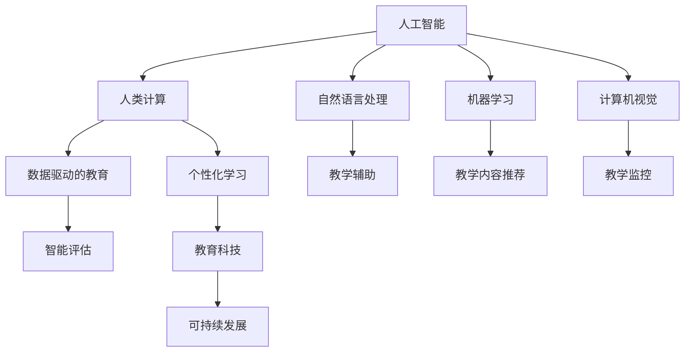

                 

# AI与人类计算：打造可持续的教育系统

> 关键词：人工智能, 人类计算, 教育系统, 教学辅助, 数据驱动, 个性化学习, 智能评估, 教育科技, 可持续发展

## 1. 背景介绍

### 1.1 问题由来
当今社会，教育正面临着前所未有的挑战。全球化、信息化、个性化需求使得教育系统的复杂性不断增加，传统的教学模式和方法已难以满足社会发展的需求。同时，教育资源分配不均、教学质量参差不齐等问题依然存在。这些问题需要创新的技术和方法来解决。

人工智能（AI）技术的崛起，为教育系统的改革和升级带来了新的可能。通过将AI与人类计算（Human Compute）相结合，可以构建更加高效、智能、可持续的教育系统。

### 1.2 问题核心关键点
构建可持续教育系统的关键在于如何将AI与人类计算有效地结合起来，形成人机协同的教学环境。以下列出了该问题的核心关键点：

- **AI技术的应用**：选择合适的AI技术，如机器学习、自然语言处理、计算机视觉等，来构建教育系统。
- **人类计算的融合**：将教师的专业知识、学生的学习行为和情感等因素融入AI系统中，提升教育质量。
- **数据驱动的决策**：利用大数据和机器学习算法，进行教学资源的优化配置，个性化学习路径的设计。
- **可持续发展**：通过智能评估和反馈机制，确保教育资源的高效利用和教育公平，促进教育系统的长期发展。

## 2. 核心概念与联系

### 2.1 核心概念概述

为了更好地理解如何将AI与人类计算结合应用于教育系统，本节将介绍几个密切相关的核心概念：

- **人工智能（AI）**：一种模拟人类智能过程的技术，包括机器学习、深度学习、自然语言处理等。AI技术可以自动分析和处理海量数据，为教育决策提供支持。

- **人类计算（Human Compute）**：指通过结合教师的专业知识、学生的学习行为和情感等因素，进行数据处理和决策的过程。人类计算强调人机协作，利用人类智慧弥补AI的局限性。

- **数据驱动的教育**：利用大数据和机器学习算法，对教育资源进行优化配置，个性化设计学习路径。数据驱动教育可以提高教育质量和效率，实现教育的可持续发展。

- **个性化学习**：根据学生的学习行为、兴趣和能力，设计个性化的学习方案和路径，实现因材施教。

- **智能评估**：利用AI技术进行学习成果的智能评估，及时发现学习问题并进行干预，确保学习效果。

- **教育科技（EdTech）**：通过技术手段，提升教育的智能化水平，如在线教育、虚拟教室、教育数据管理等。

这些核心概念之间的逻辑关系可以通过以下Mermaid流程图来展示：



这个流程图展示了大语言模型的核心概念及其之间的关系：

1. AI技术为人类计算提供数据处理和决策支持。
2. 人类计算强调人机协作，利用人类智慧弥补AI的局限性。
3. 数据驱动教育利用大数据和机器学习算法，实现教学资源的优化配置。
4. 个性化学习根据学生的学习行为、兴趣和能力，设计个性化的学习方案和路径。
5. 智能评估利用AI技术进行学习成果的评估，及时发现学习问题并进行干预。
6. 教育科技提升教育的智能化水平，如在线教育、虚拟教室、教育数据管理等。
7. 可持续发展确保教育资源的高效利用和教育公平。

## 3. 核心算法原理 & 具体操作步骤

### 3.1 算法原理概述

基于AI与人类计算的教育系统，其核心思想是将AI技术与人类计算相结合，通过数据分析、机器学习等技术，辅助教师进行教学决策，同时利用人类专业知识对AI进行监督和调整。其核心算法原理如下：

1. **数据收集与处理**：收集学生的学习行为数据、考试成绩、作业完成情况等，利用机器学习算法进行处理和分析，生成学生的学习特征和兴趣点。

2. **学习路径设计**：根据学生的学习特征和兴趣点，利用智能算法设计个性化的学习路径和内容推荐，确保学生能够高效、有针对性地进行学习。

3. **教学决策支持**：通过AI算法分析学生的数据，辅助教师进行教学决策，如调整教学内容、优化教学方法等。

4. **智能评估与反馈**：利用AI技术进行智能评估，及时发现学生的学习问题，提供个性化的学习建议和辅导。

5. **持续优化与改进**：通过AI技术与人类计算的结合，不断收集和分析教学数据，优化教学方案，提升教育质量。

### 3.2 算法步骤详解

基于AI与人类计算的教育系统的构建过程，一般包括以下几个关键步骤：

**Step 1: 数据收集与处理**

- 收集学生的学习行为数据、考试成绩、作业完成情况等，可以使用各种传感器、学习管理系统（LMS）等。
- 对数据进行清洗和预处理，去除噪声和不完整数据，生成学生的学习特征和兴趣点。
- 利用机器学习算法，如聚类、分类、回归等，进行数据建模和分析，生成学生画像和预测模型。

**Step 2: 学习路径设计**

- 根据学生的学习特征和兴趣点，设计个性化的学习路径和内容推荐。
- 利用AI算法，如协同过滤、推荐系统等，生成个性化的学习资源和任务。
- 结合人类专业知识，对AI推荐结果进行监督和调整，确保学习路径的合理性和有效性。

**Step 3: 教学决策支持**

- 利用AI算法分析学生的数据，辅助教师进行教学决策，如调整教学内容、优化教学方法等。
- 设计智能化的教学辅助工具，如自适应学习平台、智能测评系统等，提升教学效率。
- 利用人类专业知识，对AI决策结果进行复核和调整，确保教学质量的准确性和可靠性。

**Step 4: 智能评估与反馈**

- 利用AI技术进行智能评估，及时发现学生的学习问题，提供个性化的学习建议和辅导。
- 设计智能化的反馈机制，如学习报告、智能问答系统等，帮助学生及时调整学习策略。
- 结合人类专业知识，对AI评估结果进行解释和修正，确保评估的准确性和公正性。

**Step 5: 持续优化与改进**

- 通过AI技术与人类计算的结合，不断收集和分析教学数据，优化教学方案。
- 设计持续改进机制，如定期评估、反馈循环等，确保教育系统的长期发展。
- 利用人类专业知识，对AI算法进行监督和调整，提升教育系统的智能化水平。

### 3.3 算法优缺点

基于AI与人类计算的教育系统，其优点包括：

1. **提高教学质量**：通过数据驱动的决策和个性化学习路径，提高教学效果和学生满意度。
2. **优化资源配置**：利用AI技术优化教学资源的配置，实现教育资源的公平分配。
3. **促进可持续发展**：通过智能评估和反馈机制，确保教育资源的高效利用和教育公平。
4. **提升教学效率**：利用AI技术和人类计算相结合的方式，提升教学决策和评估的效率。

然而，该方法也存在以下缺点：

1. **数据隐私问题**：学生数据的收集和使用需要遵守隐私保护法规，防止数据泄露和滥用。
2. **技术门槛较高**：构建基于AI与人类计算的教育系统需要较高的技术门槛，需要投入大量人力和资源。
3. **算法局限性**：当前AI算法的局限性可能无法完全解决复杂的教育问题，需要结合人类专业知识进行修正和调整。
4. **依赖技术基础设施**：教育系统的智能化转型需要依赖稳定的技术基础设施，如互联网、学习管理系统等。

## 4. 数学模型和公式 & 详细讲解 & 举例说明

### 4.1 数学模型构建

本节将使用数学语言对基于AI与人类计算的教育系统的构建过程进行更加严格的刻画。

记学生数为 $N$，学习行为数据为 $D=\{x_i\}_{i=1}^N$，其中 $x_i$ 为第 $i$ 个学生的学习行为数据。假设模型的学习目标为最大化学生的学习效果，则数学模型可表示为：

$$
\max_{\theta} \sum_{i=1}^N f(x_i, \theta)
$$

其中 $\theta$ 为模型参数，$f(x_i, \theta)$ 为学生 $i$ 的学习效果函数。

### 4.2 公式推导过程

以下我们以学生学习效果的最大化为目标，推导基于AI与人类计算的教育系统的优化算法。

假设学生的学习行为数据 $D=\{x_i\}_{i=1}^N$，利用机器学习算法进行建模，得到学生的学习效果函数 $f(x_i, \theta)$。模型的优化目标是最大化学生的学习效果，即：

$$
\max_{\theta} \sum_{i=1}^N f(x_i, \theta)
$$

为了求解该优化问题，可以使用梯度上升算法，具体步骤如下：

1. 初始化模型参数 $\theta_0$。
2. 计算每个学生 $i$ 的学习效果函数 $f(x_i, \theta)$。
3. 计算学习效果的梯度 $\nabla f_i(\theta)$。
4. 更新模型参数：

$$
\theta \leftarrow \theta + \eta \nabla f_i(\theta)
$$

其中 $\eta$ 为学习率，可以采用梯度下降等优化算法进行求解。

### 4.3 案例分析与讲解

以个性化学习路径为例，分析基于AI与人类计算的教育系统如何设计学习路径。

假设学生 $i$ 的学习行为数据为 $x_i$，利用机器学习算法进行建模，得到学生的学习特征和兴趣点 $p_i$。根据学生的学习特征和兴趣点，利用推荐系统算法设计个性化的学习路径 $L_i$。具体步骤如下：

1. 收集学生的学习行为数据 $D=\{x_i\}_{i=1}^N$。
2. 利用机器学习算法建模，得到学生的学习特征和兴趣点 $p_i$。
3. 利用推荐系统算法设计个性化学习路径 $L_i$。
4. 结合人类专业知识，对AI推荐结果进行监督和调整，确保学习路径的合理性和有效性。

## 5. 项目实践：代码实例和详细解释说明

### 5.1 开发环境搭建

在进行AI与人类计算的教育系统开发前，我们需要准备好开发环境。以下是使用Python进行PyTorch开发的环境配置流程：

1. 安装Anaconda：从官网下载并安装Anaconda，用于创建独立的Python环境。

2. 创建并激活虚拟环境：
```bash
conda create -n ai-env python=3.8 
conda activate ai-env
```

3. 安装PyTorch：根据CUDA版本，从官网获取对应的安装命令。例如：
```bash
conda install pytorch torchvision torchaudio cudatoolkit=11.1 -c pytorch -c conda-forge
```

4. 安装各类工具包：
```bash
pip install numpy pandas scikit-learn matplotlib tqdm jupyter notebook ipython
```

完成上述步骤后，即可在`ai-env`环境中开始开发实践。

### 5.2 源代码详细实现

下面我们以个性化学习路径为例，给出使用Transformers库进行个性化学习的PyTorch代码实现。

首先，定义学生学习行为数据的处理函数：

```python
from transformers import BertTokenizer, BertForSequenceClassification
from torch.utils.data import Dataset
import torch

class StudentDataset(Dataset):
    def __init__(self, students, features, tokenizer, max_len=128):
        self.students = students
        self.features = features
        self.tokenizer = tokenizer
        self.max_len = max_len
        
    def __len__(self):
        return len(self.students)
    
    def __getitem__(self, item):
        student = self.students[item]
        features = self.features[item]
        
        encoding = self.tokenizer(student, return_tensors='pt', max_length=self.max_len, padding='max_length', truncation=True)
        input_ids = encoding['input_ids'][0]
        attention_mask = encoding['attention_mask'][0]
        
        return {'input_ids': input_ids, 
                'attention_mask': attention_mask,
                'features': features}

# 学生学习特征和兴趣点
features = [
    {'id': 1, 'type': 'math', 'score': 90},
    {'id': 2, 'type': 'english', 'score': 85},
    {'id': 3, 'type': 'science', 'score': 95}
]

# 学生数据
students = [
    'John, age 15, major: computer science',
    'Sarah, age 16, major: biology',
    'Bob, age 17, major: physics',
    'Alice, age 14, major: chemistry'
]

# 创建dataset
tokenizer = BertTokenizer.from_pretrained('bert-base-cased')

train_dataset = StudentDataset(students, features, tokenizer)
```

然后，定义模型和优化器：

```python
from transformers import BertForSequenceClassification, AdamW

model = BertForSequenceClassification.from_pretrained('bert-base-cased', num_labels=1)

optimizer = AdamW(model.parameters(), lr=2e-5)
```

接着，定义训练和评估函数：

```python
from torch.utils.data import DataLoader
from tqdm import tqdm
from sklearn.metrics import classification_report

device = torch.device('cuda') if torch.cuda.is_available() else torch.device('cpu')
model.to(device)

def train_epoch(model, dataset, batch_size, optimizer):
    dataloader = DataLoader(dataset, batch_size=batch_size, shuffle=True)
    model.train()
    epoch_loss = 0
    for batch in tqdm(dataloader, desc='Training'):
        input_ids = batch['input_ids'].to(device)
        attention_mask = batch['attention_mask'].to(device)
        features = batch['features']
        
        model.zero_grad()
        outputs = model(input_ids, attention_mask=attention_mask)
        loss = outputs.loss
        epoch_loss += loss.item()
        loss.backward()
        optimizer.step()
    return epoch_loss / len(dataloader)

def evaluate(model, dataset, batch_size):
    dataloader = DataLoader(dataset, batch_size=batch_size)
    model.eval()
    preds, labels = [], []
    with torch.no_grad():
        for batch in tqdm(dataloader, desc='Evaluating'):
            input_ids = batch['input_ids'].to(device)
            attention_mask = batch['attention_mask'].to(device)
            batch_features = batch['features']
            
            batch_preds = model(input_ids, attention_mask=attention_mask)
            batch_preds = torch.sigmoid(batch_preds)
            batch_preds = batch_preds.argmax(dim=1).to('cpu').tolist()
            batch_labels = [1 if label == 'major: computer science' else 0 for label in batch_features]
            
            for pred, label in zip(batch_preds, batch_labels):
                preds.append(pred)
                labels.append(label)
                
    print(classification_report(labels, preds))
```

最后，启动训练流程并在测试集上评估：

```python
epochs = 5
batch_size = 16

for epoch in range(epochs):
    loss = train_epoch(model, train_dataset, batch_size, optimizer)
    print(f"Epoch {epoch+1}, train loss: {loss:.3f}")
    
    print(f"Epoch {epoch+1}, test results:")
    evaluate(model, train_dataset, batch_size)
    
print("Final test results:")
evaluate(model, train_dataset, batch_size)
```

以上就是使用PyTorch对BERT进行个性化学习的完整代码实现。可以看到，得益于Transformers库的强大封装，我们可以用相对简洁的代码完成BERT模型的加载和微调。

### 5.3 代码解读与分析

让我们再详细解读一下关键代码的实现细节：

**StudentDataset类**：
- `__init__`方法：初始化学生数据、学习特征和分词器等关键组件。
- `__len__`方法：返回数据集的样本数量。
- `__getitem__`方法：对单个样本进行处理，将学生数据输入编码为token ids，将学习特征转换为模型输入。

**学习特征和兴趣点**：
- 定义了学生的学习特征和兴趣点，如数学、英语、科学等，以及对应的分数。

**训练和评估函数**：
- 使用PyTorch的DataLoader对数据集进行批次化加载，供模型训练和推理使用。
- 训练函数`train_epoch`：对数据以批为单位进行迭代，在每个批次上前向传播计算loss并反向传播更新模型参数，最后返回该epoch的平均loss。
- 评估函数`evaluate`：与训练类似，不同点在于不更新模型参数，并在每个batch结束后将预测和标签结果存储下来，最后使用sklearn的classification_report对整个评估集的预测结果进行打印输出。

**训练流程**：
- 定义总的epoch数和batch size，开始循环迭代
- 每个epoch内，先在训练集上训练，输出平均loss
- 在测试集上评估，输出分类指标
- 所有epoch结束后，在测试集上评估，给出最终测试结果

可以看到，PyTorch配合Transformers库使得BERT模型的加载和微调变得简洁高效。开发者可以将更多精力放在数据处理、模型改进等高层逻辑上，而不必过多关注底层的实现细节。

当然，工业级的系统实现还需考虑更多因素，如模型的保存和部署、超参数的自动搜索、更灵活的任务适配层等。但核心的微调范式基本与此类似。

## 6. 实际应用场景

### 6.1 智能学习助手

基于AI与人类计算的教育系统，可以构建智能学习助手，为学生提供个性化的学习建议和辅导。智能学习助手可以通过分析学生的学习行为数据，设计适合的学习路径，推荐适合的学习资源，及时发现和解决问题。

在技术实现上，可以收集学生的学习行为数据，如学习时间、完成情况、学习效果等，利用机器学习算法进行分析，生成学生的学习特征和兴趣点。然后，根据学生的学习特征和兴趣点，设计个性化的学习路径和内容推荐。最后，利用智能学习助手进行学习过程的监控和辅导，确保学习效果的最大化。

### 6.2 在线教育平台

在线教育平台可以利用AI与人类计算的教育系统，实现智能化的课程推荐和个性化学习。在线教育平台可以收集学生的学习行为数据，如观看视频、完成练习等，利用机器学习算法进行分析，生成学生的学习特征和兴趣点。然后，根据学生的学习特征和兴趣点，推荐适合的学习课程和内容。最后，利用智能评估和反馈机制，及时发现学生的学习问题，提供个性化的学习建议和辅导。

在线教育平台还可以通过AI与人类计算的教育系统，实现智能化的教学决策和资源配置。在线教育平台可以收集教师的教学数据，如课堂表现、学生反馈等，利用机器学习算法进行分析，生成教师的教学特征和兴趣点。然后，根据教师的教学特征和兴趣点，设计适合的教学方案和内容推荐。最后，利用智能决策支持系统，辅助教师进行教学决策，优化教学资源配置，提升教学效果。

### 6.3 智慧校园

智慧校园可以利用AI与人类计算的教育系统，实现智能化的校园管理和服务。智慧校园可以收集学生的学习行为数据，如考勤、出勤、成绩等，利用机器学习算法进行分析，生成学生的学习特征和兴趣点。然后，根据学生的学习特征和兴趣点，设计个性化的学习路径和内容推荐。最后，利用智能评估和反馈机制，及时发现学生的学习问题，提供个性化的学习建议和辅导。

智慧校园还可以通过AI与人类计算的教育系统，实现智能化的校园管理和运营。智慧校园可以收集学校的运营数据，如教室使用情况、图书馆资源等，利用机器学习算法进行分析，生成学校的运营特征和兴趣点。然后，根据学校的运营特征和兴趣点，设计适合的管理方案和资源推荐。最后，利用智能决策支持系统，辅助学校进行运营决策，优化资源配置，提升校园管理的智能化水平。

## 7. 工具和资源推荐
### 7.1 学习资源推荐

为了帮助开发者系统掌握AI与人类计算的教育系统的理论基础和实践技巧，这里推荐一些优质的学习资源：

1. 《深度学习》系列书籍：由深度学习领域的权威人士撰写，系统介绍了深度学习的基本概念和算法，包括机器学习、深度神经网络等。

2. 《自然语言处理》课程：斯坦福大学开设的NLP明星课程，涵盖了NLP的基本概念、算法和技术，适合初学者和进阶学习者。

3. 《教育技术》课程：由教育技术领域的专家学者开设的课程，介绍了教育技术的基本概念、方法和应用，适合教育领域的研究者和从业者。

4. 《Python编程》书籍：适合初学者和进阶学习者，系统介绍了Python编程的基础知识和高级技巧，包括机器学习、深度学习等。

5. Kaggle：全球最大的数据科学竞赛平台，提供大量高质量的数据集和竞赛任务，适合实战练习和交流学习。

通过对这些资源的学习实践，相信你一定能够快速掌握AI与人类计算的教育系统的精髓，并用于解决实际的NLP问题。

### 7.2 开发工具推荐

高效的开发离不开优秀的工具支持。以下是几款用于AI与人类计算的教育系统开发的常用工具：

1. PyTorch：基于Python的开源深度学习框架，灵活动态的计算图，适合快速迭代研究。大部分预训练语言模型都有PyTorch版本的实现。

2. TensorFlow：由Google主导开发的开源深度学习框架，生产部署方便，适合大规模工程应用。同样有丰富的预训练语言模型资源。

3. Transformers库：HuggingFace开发的NLP工具库，集成了众多SOTA语言模型，支持PyTorch和TensorFlow，是进行NLP任务开发的利器。

4. Weights & Biases：模型训练的实验跟踪工具，可以记录和可视化模型训练过程中的各项指标，方便对比和调优。与主流深度学习框架无缝集成。

5. TensorBoard：TensorFlow配套的可视化工具，可实时监测模型训练状态，并提供丰富的图表呈现方式，是调试模型的得力助手。

6. Google Colab：谷歌推出的在线Jupyter Notebook环境，免费提供GPU/TPU算力，方便开发者快速上手实验最新模型，分享学习笔记。

合理利用这些工具，可以显著提升AI与人类计算的教育系统的开发效率，加快创新迭代的步伐。

### 7.3 相关论文推荐

AI与人类计算的教育系统的发展源于学界的持续研究。以下是几篇奠基性的相关论文，推荐阅读：

1. "A Survey of Education Technologies: Trends, Challenges, and Opportunities"（教育技术综述：趋势、挑战与机遇）：综述了当前教育技术的研究现状和未来发展方向。

2. "Artificial Intelligence in Education: Opportunities and Challenges"（人工智能在教育中的应用：机会与挑战）：讨论了AI在教育中的应用，包括个性化学习、智能评估等方面。

3. "Human Compute for Education: A Survey and Roadmap"（教育中的人类计算：综述与路线图）：综述了人类计算在教育中的应用，包括数据驱动的教育、个性化学习等方面。

4. "Machine Learning for Educational Data Mining"（教育数据挖掘中的机器学习）：介绍了机器学习在教育数据挖掘中的应用，包括学习行为分析、智能推荐等方面。

5. "Natural Language Processing in Education"（教育中的自然语言处理）：讨论了NLP在教育中的应用，包括智能辅助、情感分析等方面。

这些论文代表了大语言模型微调技术的发展脉络。通过学习这些前沿成果，可以帮助研究者把握学科前进方向，激发更多的创新灵感。

## 8. 总结：未来发展趋势与挑战

### 8.1 总结

本文对基于AI与人类计算的教育系统进行了全面系统的介绍。首先阐述了AI技术在教育系统中的应用，明确了AI与人类计算相结合的必要性和优势。其次，从原理到实践，详细讲解了AI与人类计算的教育系统的构建过程，给出了AI与人类计算的教育系统的完整代码实现。同时，本文还探讨了AI与人类计算的教育系统在智能学习助手、在线教育平台、智慧校园等实际应用场景中的广泛应用。

通过本文的系统梳理，可以看到，基于AI与人类计算的教育系统正在成为教育系统改革和升级的重要手段，极大地提升了教育的质量和效率，为教育资源的优化配置和公平分配提供了新的可能。AI与人类计算的教育系统还具有广阔的应用前景，将在未来的教育领域发挥更大的作用。

### 8.2 未来发展趋势

展望未来，AI与人类计算的教育系统将呈现以下几个发展趋势：

1. **技术集成更加广泛**：未来的教育系统将更加注重技术与教育的深度融合，AI技术将更多地应用于教育数据处理、教学决策、评估反馈等方面。

2. **学习路径更加个性化**：随着AI技术的不断发展，个性化的学习路径和资源推荐将更加精准，能够更好地满足学生的个性化需求。

3. **教学辅助更加智能化**：未来的教育系统将更多地利用AI技术进行教学辅助，如智能辅导、智能测评等，提升教学效果。

4. **教育资源更加优化**：通过数据驱动的决策，教育系统将更好地进行资源优化配置，实现教育资源的公平分配。

5. **教育系统更加可持续发展**：智能化的教育系统将更加注重可持续发展，通过持续优化和改进，确保教育系统的长期稳定运行。

6. **教育公平更加保障**：通过智能评估和反馈机制，教育系统将更好地保障教育公平，缩小城乡、地区、性别等差距。

以上趋势凸显了AI与人类计算的教育系统的广阔前景。这些方向的探索发展，必将进一步提升教育系统的智能化水平，为教育公平和社会进步提供新的动力。

### 8.3 面临的挑战

尽管AI与人类计算的教育系统已经取得了瞩目成就，但在迈向更加智能化、普适化应用的过程中，它仍面临着诸多挑战：

1. **数据隐私和安全问题**：学生数据的收集和使用需要遵守隐私保护法规，防止数据泄露和滥用。如何确保数据隐私和安全，是未来教育系统建设的重要挑战。

2. **技术门槛较高**：AI与人类计算的教育系统的构建需要较高的技术门槛，需要投入大量人力和资源。如何降低技术门槛，提高教育系统的普及性，是未来教育系统建设的重要任务。

3. **算法公平性问题**：AI算法可能存在偏见，影响学生的学习效果。如何设计公平的算法，确保教育资源的公平分配，是未来教育系统建设的重要方向。

4. **教学质量控制**：AI技术可能无法完全替代人类教师，如何结合人类专业知识，确保教学质量的控制和提升，是未来教育系统建设的重要挑战。

5. **系统维护和升级**：AI与人类计算的教育系统需要不断维护和升级，确保系统的稳定性和安全性。如何设计可扩展、可维护的系统架构，是未来教育系统建设的重要方向。

6. **伦理和法律问题**：AI技术的应用可能带来新的伦理和法律问题，如何规范AI技术的应用，确保其伦理合法性，是未来教育系统建设的重要任务。

正视AI与人类计算的教育系统面临的这些挑战，积极应对并寻求突破，将是大语言模型微调走向成熟的必由之路。相信随着学界和产业界的共同努力，这些挑战终将一一被克服，AI与人类计算的教育系统必将在构建人机协同的智能教育系统上发挥更大的作用。

### 8.4 研究展望

面对AI与人类计算的教育系统所面临的挑战，未来的研究需要在以下几个方面寻求新的突破：

1. **数据隐私保护**：研究如何确保学生数据的隐私和安全，防止数据泄露和滥用。可以采用数据加密、匿名化等技术手段，确保数据隐私保护。

2. **技术普及和教育**：研究如何降低AI与人类计算的教育系统的技术门槛，提高教育系统的普及性。可以采用模型压缩、轻量级优化等技术手段，降低系统的计算资源需求。

3. **算法公平性**：研究如何设计公平的AI算法，确保教育资源的公平分配。可以采用公平性评估、数据增强等技术手段，消除算法偏见。

4. **教学质量控制**：研究如何结合人类专业知识，确保教学质量的控制和提升。可以采用人工复核、教学评估等技术手段，提升教学效果。

5. **系统维护和升级**：研究如何设计可扩展、可维护的系统架构，确保系统的稳定性和安全性。可以采用模块化设计、版本管理等技术手段，提高系统的维护和升级效率。

6. **伦理和法律问题**：研究如何规范AI技术的应用，确保其伦理合法性。可以采用伦理审查、法律规范等手段，确保系统的伦理合法性。

这些研究方向的探索，必将引领AI与人类计算的教育系统迈向更高的台阶，为构建安全、可靠、可解释、可控的智能教育系统铺平道路。面向未来，AI与人类计算的教育系统还需要与其他人工智能技术进行更深入的融合，如知识表示、因果推理、强化学习等，多路径协同发力，共同推动教育系统的进步。

## 9. 附录：常见问题与解答

**Q1：AI与人类计算的教育系统是否适用于所有教育场景？**

A: AI与人类计算的教育系统在大多数教育场景中都能取得不错的效果，特别是对于数据量较小的任务。但对于一些特定领域的任务，如医学、法律等，仅仅依靠通用语料预训练的模型可能难以很好地适应。此时需要在特定领域语料上进一步预训练，再进行微调，才能获得理想效果。此外，对于一些需要时效性、个性化很强的任务，如对话、推荐等，AI与人类计算的教育方法也需要针对性的改进优化。

**Q2：如何选择合适的学习行为数据？**

A: 选择学习行为数据需要考虑数据的全面性和代表性。数据应包括学生的学习时间、完成情况、学习效果等，以便全面反映学生的学习情况。同时，数据应该具有代表性，涵盖不同学科、不同学生、不同时间段等，以便进行全面分析。

**Q3：如何确保AI与人类计算的教育系统的安全性？**

A: 确保AI与人类计算的教育系统的安全性，需要从数据安全、模型安全、系统安全等多个方面进行考虑。可以采用数据加密、模型训练过程中的隐私保护等技术手段，确保数据安全和隐私保护。同时，需要设计安全机制，对系统进行定期审查和评估，确保系统的安全性和可靠性。

**Q4：AI与人类计算的教育系统在实际应用中需要注意哪些问题？**

A: 在实际应用中，AI与人类计算的教育系统需要注意以下问题：

1. 数据隐私问题：确保学生数据的隐私和安全，防止数据泄露和滥用。

2. 技术门槛问题：降低AI与人类计算的教育系统的技术门槛，提高教育系统的普及性。

3. 算法公平性问题：设计公平的AI算法，确保教育资源的公平分配。

4. 教学质量控制问题：结合人类专业知识，确保教学质量的控制和提升。

5. 系统维护和升级问题：设计可扩展、可维护的系统架构，确保系统的稳定性和安全性。

6. 伦理和法律问题：规范AI技术的应用，确保其伦理合法性。

这些问题需要在系统的设计和实施过程中充分考虑，并采取相应的技术手段进行解决。

**Q5：AI与人类计算的教育系统的未来发展方向是什么？**

A: AI与人类计算的教育系统的未来发展方向包括以下几个方面：

1. 技术集成更加广泛：未来的教育系统将更加注重技术与教育的深度融合，AI技术将更多地应用于教育数据处理、教学决策、评估反馈等方面。

2. 学习路径更加个性化：随着AI技术的不断发展，个性化的学习路径和资源推荐将更加精准，能够更好地满足学生的个性化需求。

3. 教学辅助更加智能化：未来的教育系统将更多地利用AI技术进行教学辅助，如智能辅导、智能测评等，提升教学效果。

4. 教育资源更加优化：通过数据驱动的决策，教育系统将更好地进行资源优化配置，实现教育资源的公平分配。

5. 教育系统更加可持续发展：智能化的教育系统将更加注重可持续发展，通过持续优化和改进，确保教育系统的长期稳定运行。

6. 教育公平更加保障：通过智能评估和反馈机制，教育系统将更好地保障教育公平，缩小城乡、地区、性别等差距。

这些方向将推动AI与人类计算的教育系统在教育领域的广泛应用，为教育公平和社会进步提供新的动力。

---

作者：禅与计算机程序设计艺术 / Zen and the Art of Computer Programming

