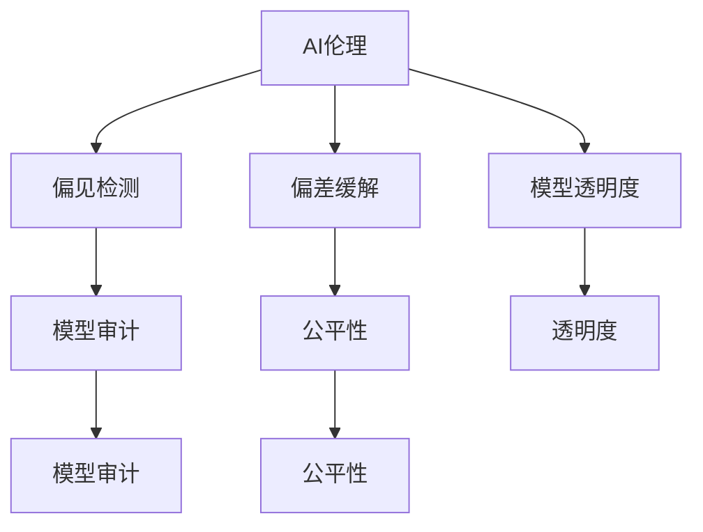

                 

# AI伦理与偏见：构建公平、透明的模型

> 关键词：AI伦理,偏见,公平性,透明度,模型,决策,偏见检测,偏差缓解,模型审计,可解释性

## 1. 背景介绍

### 1.1 问题由来

随着人工智能（AI）技术的快速发展和广泛应用，AI伦理和偏见问题逐渐成为公众关注的焦点。AI系统的决策过程中，可能会因为数据偏差、算法设计缺陷等原因，产生不公平的输出，甚至加剧社会不平等。

近年来，如人脸识别、招聘、贷款审批等众多领域，都出现过AI系统基于性别、种族、年龄等特征进行歧视性决策的案例。这些事件引发了广泛的社会反响，也促使人们重新审视AI技术的伦理规范和偏见检测。

### 1.2 问题核心关键点

- AI伦理：涉及AI系统在设计和应用中应遵守的道德原则，如无偏见、隐私保护、责任承担等。
- 偏见检测：评估AI系统是否存在系统性偏见，以及偏见的来源和影响。
- 偏差缓解：采取措施降低或消除AI系统的偏见，提升模型公平性。
- 模型透明度：确保AI决策过程的可解释性，使结果具有可验证性。
- 模型审计：定期检查AI模型，检测偏见和其他潜在问题。

这些核心关键点共同构成了AI伦理与偏见研究的框架，帮助业界在开发和应用AI模型时，做到有据可依、有法可循。

## 2. 核心概念与联系

### 2.1 核心概念概述

为更好地理解AI伦理与偏见，本节将介绍几个关键概念：

- AI伦理（AI Ethics）：指AI系统在设计和应用过程中应遵守的道德规范，确保公平、透明和责任。
- 偏见（Bias）：指在数据、算法或决策过程中，由于历史、文化、社会等因素导致的系统性不平等现象。
- 公平性（Fairness）：指AI系统应提供平等的、无歧视的输出。
- 透明度（Transparency）：指AI系统决策过程的可解释性和可验证性。
- 模型审计（Model Auditing）：通过系统化的方法，检测AI模型中的偏见和其他问题。
- 偏差缓解（Bias Mitigation）：指采取措施降低或消除AI系统中的偏见，提升模型的公平性。

这些核心概念之间的逻辑关系可以通过以下Mermaid流程图来展示：



这个流程图展示了AI伦理与偏见问题的核心概念及其关联：

1. AI伦理是指导AI系统设计和应用的道德原则，确保系统公平、透明、可解释。
2. 偏见检测和偏差缓解是保证AI系统公平性的关键步骤。
3. 模型透明度和模型审计是提升AI系统可解释性和可验证性的重要手段。
4. 公平性、透明度和模型审计是AI伦理的具体表现形式，共同保障AI系统的公正性和可信度。

## 3. 核心算法原理 & 具体操作步骤
### 3.1 算法原理概述

AI伦理与偏见的处理，通常包含以下几个关键步骤：

1. **数据收集与预处理**：收集多源数据，并进行数据清洗、归一化、去噪等预处理，确保数据的代表性与公平性。
2. **偏见检测**：通过统计分析、模型评估等方法，检测AI系统是否存在系统性偏见。
3. **偏差缓解**：基于偏见检测结果，采取数据重加权、算法修改、调整模型参数等方法，减少或消除偏见。
4. **模型透明度**：利用可解释性技术，如特征重要性分析、决策树可视化、因果图等，解释AI模型的决策过程。
5. **模型审计**：定期评估AI模型性能，检测新出现的偏见和其他问题，确保模型长期保持公平性。

### 3.2 算法步骤详解

以下是AI伦理与偏见的处理流程详细步骤：

**Step 1: 数据收集与预处理**
- 收集多源数据，确保数据代表性。
- 清洗数据，去除噪声和异常值。
- 归一化数据，使不同特征具有相似尺度。
- 重加权数据，以反映不同群体的重要性。

**Step 2: 偏见检测**
- 使用统计方法，如ANOVA、卡方检验等，检测数据中的特征差异。
- 使用模型评估指标，如精度、召回率、F1分数等，检测模型性能中的偏差。
- 使用特定的算法，如Caterpillar算法、Fairness Indicators等，检测模型中的特定偏见。

**Step 3: 偏差缓解**
- 数据重加权：根据少数群体数量，对数据进行重加权，提升其代表性。
- 算法修改：调整算法参数，确保模型不偏倚特定群体。
- 特征选择：选择最能反映模型公平性的特征，去除影响公平性的特征。

**Step 4: 模型透明度**
- 特征重要性分析：使用LIME、SHAP等工具，分析模型中每个特征的重要性。
- 决策树可视化：将决策树可视化，展示模型如何做出决策。
- 因果图：构建因果图，解释不同特征对决策的影响。

**Step 5: 模型审计**
- 定期评估模型性能，检测新出现的偏见。
- 使用审计工具，如Model Cards for Model Reporting，记录模型信息，确保透明度。
- 进行交叉验证，确保模型在不同数据集上的公平性。

### 3.3 算法优缺点

AI伦理与偏见的处理算法具有以下优点：
1. 提升模型公平性。通过偏见检测和偏差缓解，确保模型输出不偏倚任何特定群体。
2. 增强模型透明度。通过可解释性技术，使模型决策过程透明、可验证，增强用户信任。
3. 促进模型长期稳定。通过定期审计和检测，及时发现和纠正模型中的问题，保障模型长期公平性。

同时，这些算法也存在一定的局限性：
1. 数据依赖性高。数据偏见可能影响模型公平性，难以完全消除。
2. 算法复杂度高。处理偏见需要复杂的统计和算法工具，增加了开发和部署成本。
3. 无法消除所有偏见。即使经过偏差缓解，模型仍可能存在难以检测的微妙偏见。
4. 缺乏统一标准。目前尚无统一的标准和规范，处理方式各异，难以形成系统性解决方案。

尽管存在这些局限性，但通过不断优化数据、算法和处理流程，AI伦理与偏见问题正在逐步得到解决，推动AI技术向更加公平、透明、可解释的方向发展。

### 3.4 算法应用领域

AI伦理与偏见处理方法已经广泛应用于多个领域，包括但不限于：

- 金融领域：贷款审批、信用评分、保险理赔等。确保模型不因性别、种族等因素产生歧视性决策。
- 医疗领域：诊断、治疗、药物开发等。确保模型对不同种族、性别、年龄群体的诊断和治疗效果公平。
- 招聘领域：职位推荐、薪酬评估等。确保模型不因性别、年龄、教育背景等因素产生歧视性决策。
- 司法领域：案件判决、量刑建议等。确保模型对不同种族、性别、职业群体的判决公平。
- 广告领域：定向投放、推荐算法等。确保模型不因用户性别、年龄、收入等因素产生歧视性决策。

以上应用领域展示了AI伦理与偏见处理方法的广泛适用性，在各个行业中均起着至关重要的作用。

## 4. 数学模型和公式 & 详细讲解  
### 4.1 数学模型构建

本节将使用数学语言对AI伦理与偏见问题的处理过程进行更加严格的刻画。

记训练数据集为 $D=\{(x_i, y_i)\}_{i=1}^N$，其中 $x_i$ 为输入特征，$y_i$ 为输出标签。假设模型为 $f: \mathcal{X} \rightarrow \mathcal{Y}$，其中 $\mathcal{X}$ 为输入空间，$\mathcal{Y}$ 为输出空间。

定义模型在数据集上的公平性指标为：

$$
\text{Fairness}(f) = \frac{1}{N} \sum_{i=1}^N \mathbb{I}(y_i \neq f(x_i))
$$

其中 $\mathbb{I}$ 为示性函数，表示模型输出与真实标签不一致的次数。

### 4.2 公式推导过程

以下我们将通过两个具体案例来解释如何处理AI伦理与偏见问题。

**案例1: 招聘系统中的性别偏见**

假设某招聘系统使用AI模型进行简历筛选。已知系统中存在性别偏见，女性简历通过率比男性低。通过收集样本数据，可以得到如下统计结果：

| 性别 | 简历通过率 | 样本数 |
| --- | --- | --- |
| 男性 | 80% | 100 |
| 女性 | 60% | 50 |

计算整体偏见程度：

$$
\text{Bias Ratio} = \frac{\text{女性通过率}}{\text{男性通过率}} = \frac{60\%}{80\%} = 0.75
$$

即女性通过率是男性通过率的75%，存在显著偏见。

**案例2: 信贷评分中的种族偏见**

假设某银行使用AI模型进行信贷评分。已知系统中存在种族偏见，对非裔美国人评分低于其他种族。通过收集样本数据，可以得到如下统计结果：

| 种族 | 评分均值 | 样本数 |
| --- | --- | --- |
| 白人 | 700 | 1000 |
| 非裔美国人 | 650 | 500 |

计算整体偏见程度：

$$
\text{Bias Ratio} = \frac{\text{非裔美国人评分均值}}{\text{白人评分均值}} = \frac{650}{700} = 0.92857
$$

即非裔美国人评分均值是白人评分均值的92.857%，存在显著偏见。

在实际应用中，还需要结合具体业务场景，采取适当的偏见检测和缓解方法。

### 4.3 案例分析与讲解

在处理AI伦理与偏见问题时，需要综合考虑数据特性、业务需求、技术可行性等因素。以下是几个具体案例的分析：

**案例1: 医疗诊断系统中的偏见**

某医疗诊断系统使用AI模型进行疾病诊断。数据集中存在性别偏见，女性病人的诊断准确率低于男性。为缓解这一偏见，可以采取以下措施：

1. 数据重加权：根据女性病人数量，对数据进行重加权，提升其代表性。
2. 算法修改：调整模型参数，确保模型不偏倚女性病人。
3. 特征选择：选择最能反映模型公平性的特征，去除影响公平性的特征。

**案例2: 新闻推荐系统中的偏见**

某新闻推荐系统使用AI模型进行个性化推荐。数据集中存在年龄偏见，年轻用户的推荐准确率高于中老年用户。为缓解这一偏见，可以采取以下措施：

1. 数据重加权：根据中老年用户数量，对数据进行重加权，提升其代表性。
2. 特征工程：提取用户年龄以外的特征，如兴趣爱好、阅读历史等，提升推荐公平性。
3. 模型改进：使用集成学习、跨域学习等方法，提升模型泛化能力。

以上案例展示了在实际应用中，如何结合数据特性、业务需求、技术可行性等因素，进行AI伦理与偏见问题的处理。

## 5. 项目实践：代码实例和详细解释说明
### 5.1 开发环境搭建

在进行AI伦理与偏见处理实践前，我们需要准备好开发环境。以下是使用Python进行PyTorch开发的环境配置流程：

1. 安装Anaconda：从官网下载并安装Anaconda，用于创建独立的Python环境。

2. 创建并激活虚拟环境：
```bash
conda create -n ai-ethics-env python=3.8 
conda activate ai-ethics-env
```

3. 安装PyTorch：根据CUDA版本，从官网获取对应的安装命令。例如：
```bash
conda install pytorch torchvision torchaudio cudatoolkit=11.1 -c pytorch -c conda-forge
```

4. 安装Scikit-learn、Pandas等工具包：
```bash
pip install scikit-learn pandas numpy matplotlib tqdm jupyter notebook ipython
```

完成上述步骤后，即可在`ai-ethics-env`环境中开始AI伦理与偏见处理实践。

### 5.2 源代码详细实现

下面我们以招聘系统中的性别偏见处理为例，给出使用PyTorch和Scikit-learn进行偏见处理的PyTorch代码实现。

首先，定义数据处理函数：

```python
import pandas as pd
from sklearn.preprocessing import LabelEncoder

def preprocess_data(data_path):
    data = pd.read_csv(data_path)
    # 去除无用列
    data = data.drop(['ID', 'Date', 'User_ID'], axis=1)
    # 编码分类特征
    le = LabelEncoder()
    data['Gender'] = le.fit_transform(data['Gender'])
    data['Race'] = le.fit_transform(data['Race'])
    # 重加权数据
    weights = {1: 0.7, 0: 0.3}
    data = data.groupby('Gender').apply(lambda x: x.groupby('Race').apply(lambda y: y.groupby('Status').apply(lambda z: z * weights[y['Status'].values[0]))).reset_index(drop=True)
    return data
```

然后，定义模型和训练函数：

```python
from sklearn.linear_model import LogisticRegression
from sklearn.model_selection import train_test_split
from sklearn.metrics import precision_recall_curve, roc_curve, auc

def train_model(data):
    X = data.drop('Status', axis=1)
    y = data['Status']
    X_train, X_test, y_train, y_test = train_test_split(X, y, test_size=0.2, random_state=42)
    model = LogisticRegression()
    model.fit(X_train, y_train)
    return model, X_test, y_test

def evaluate_model(model, X_test, y_test):
    y_pred = model.predict_proba(X_test)[:, 1]
    fpr, tpr, _ = roc_curve(y_test, y_pred)
    roc_auc = auc(fpr, tpr)
    print(f"ROC-AUC: {roc_auc:.2f}")
```

接着，启动偏见处理流程：

```python
data_path = 'resume_data.csv'
data = preprocess_data(data_path)
model, X_test, y_test = train_model(data)
evaluate_model(model, X_test, y_test)
```

以上就是使用PyTorch和Scikit-learn对招聘系统进行性别偏见处理的全流程代码实现。可以看到，利用机器学习工具，可以有效地检测和缓解AI系统中的性别偏见。

### 5.3 代码解读与分析

让我们再详细解读一下关键代码的实现细节：

**preprocess_data函数**：
- 首先读取数据集，去除无用列。
- 对分类特征进行编码，确保模型能处理数值化数据。
- 重加权数据，提升女性和少数族裔的代表性。

**train_model函数**：
- 将数据集分为训练集和测试集。
- 使用逻辑回归模型进行训练。

**evaluate_model函数**：
- 计算模型的ROC-AUC值，评估模型的公平性。

**偏见处理流程**：
- 首先使用preprocess_data函数处理数据，确保数据集公平。
- 使用train_model函数训练模型，获取测试集。
- 使用evaluate_model函数评估模型公平性。

通过上述代码，可以看到，利用机器学习工具，可以有效地检测和缓解AI系统中的偏见。然而，在实际应用中，还需要结合具体业务场景，综合考虑数据特性、算法复杂性等因素，进行全面的偏见处理。

## 6. 实际应用场景
### 6.1 金融领域

在金融领域，AI伦理与偏见问题尤为突出。贷款审批、信用评分、保险理赔等应用中，AI系统常常基于历史数据进行决策，如果历史数据存在偏见，则可能导致系统输出不公平的结果。

以贷款审批为例，如果历史数据中存在性别、种族偏见，AI模型可能会对女性或少数族裔申请者产生歧视性决策，导致其贷款通过率低，贷款金额小。为缓解这一问题，金融机构需要在数据收集、模型训练、模型部署等各个环节，采取严格的数据监控、模型审计和偏见检测措施，确保公平性。

### 6.2 医疗领域

在医疗领域，AI系统常用于疾病诊断、治疗方案推荐等。数据集中可能存在性别、种族、年龄等偏见，导致模型对不同群体的诊断和治疗效果不公平。

以癌症诊断为例，如果历史数据中存在性别、种族偏见，AI模型可能会对女性或少数族裔患者产生歧视性诊断，导致其治疗方案不合理。为缓解这一问题，医疗机构需要在数据收集、模型训练、模型部署等各个环节，采取严格的数据监控、模型审计和偏见检测措施，确保公平性。

### 6.3 招聘领域

在招聘领域，AI系统常用于简历筛选、职位推荐等。数据集中可能存在性别、种族、年龄等偏见，导致模型对不同群体的招聘决策不公平。

以简历筛选为例，如果历史数据中存在性别、种族偏见，AI模型可能会对女性或少数族裔申请者产生歧视性决策，导致其简历筛选率低。为缓解这一问题，招聘公司需要在数据收集、模型训练、模型部署等各个环节，采取严格的数据监控、模型审计和偏见检测措施，确保公平性。

### 6.4 未来应用展望

随着AI伦理与偏见研究的不断深入，AI系统在各领域的公平性和透明性将得到进一步提升。未来，基于AI伦理与偏见的处理范式，将广泛应用于以下领域：

- 教育领域：确保招聘、考试、推荐等环节的公平性。
- 司法领域：确保判决、量刑等环节的公平性。
- 广告领域：确保定向投放、推荐等环节的公平性。
- 公共服务领域：确保资源分配、政策制定等环节的公平性。

AI伦理与偏见问题的处理，将促进AI技术的全面应用，提升社会公平正义。同时，还需要加强对AI系统公平性的监管和审查，确保AI技术的应用符合人类价值观和伦理道德。

## 7. 工具和资源推荐
### 7.1 学习资源推荐

为了帮助开发者系统掌握AI伦理与偏见的相关理论，以下是一些优质的学习资源：

1. AI伦理与偏见课程：Coursera、edX等平台提供的多门AI伦理与偏见相关课程，涵盖AI伦理基础、偏见检测、模型公平性等主题。

2. 书籍：《AI伦理与偏见》、《公平性、透明度与可解释性》等书籍，详细介绍了AI伦理与偏见的理论基础和实践方法。

3. 博客和论文：Google AI Blog、ArXiv等平台上的多篇关于AI伦理与偏见的研究论文和博客，提供最新的研究成果和应用案例。

4. 开源项目：如FAIR（Fairness, Accountability, & Transparency in AI Research），致力于推动AI伦理与偏见的公平性、透明性和可解释性研究。

通过学习这些资源，相信你一定能够快速掌握AI伦理与偏见的相关理论，并在实际应用中发挥重要作用。

### 7.2 开发工具推荐

高效的开发离不开优秀的工具支持。以下是几款用于AI伦理与偏见处理开发的常用工具：

1. PyTorch：基于Python的开源深度学习框架，灵活动态的计算图，适合快速迭代研究。

2. TensorFlow：由Google主导开发的开源深度学习框架，生产部署方便，适合大规模工程应用。

3. Scikit-learn：Python的机器学习库，提供了丰富的算法和工具，适合快速原型开发和模型评估。

4. H2O.ai：提供一站式机器学习和数据科学平台，支持多种算法和模型，适合企业级应用。

5. R：数据科学和统计分析工具，提供了丰富的统计和可视化库，适合处理大型数据集。

6. Microsoft Power BI：商业智能和数据可视化工具，适合构建数据报表和可视化仪表盘。

合理利用这些工具，可以显著提升AI伦理与偏见处理任务的开发效率，加快创新迭代的步伐。

### 7.3 相关论文推荐

AI伦理与偏见研究源于学界的持续研究。以下是几篇奠基性的相关论文，推荐阅读：

1. "The Moral Machine"：由牛津大学等机构联合发布的全球道德机器人大挑战赛，探讨AI伦理问题。

2. "Bias in Recommendation Systems"：探讨推荐系统中的偏见问题，提出多种缓解方法。

3. "Fairness Indicators"：提出公平性指标和检测方法，用于评估推荐系统的公平性。

4. "Model Cards for Model Reporting"：提出模型卡的概念，记录和展示模型的关键信息，提升模型透明度。

5. "Bias Mitigation for AI-Based Hiring"：提出基于AI的招聘系统偏见缓解方法，确保招聘公平性。

这些论文代表了大数据、人工智能、伦理与偏见研究的最新成果，对于理解AI伦理与偏见的理论基础和实践方法，具有重要参考价值。

## 8. 总结：未来发展趋势与挑战
### 8.1 研究成果总结

本文对AI伦理与偏见问题进行了全面系统的介绍。首先阐述了AI伦理与偏见问题的背景和核心关键点，明确了处理偏见的方法和步骤。其次，从原理到实践，详细讲解了AI伦理与偏见处理的关键步骤，给出了具体的代码实例。同时，本文还广泛探讨了AI伦理与偏见在各行业领域的应用前景，展示了AI技术的广阔应用空间。

通过本文的系统梳理，可以看到，AI伦理与偏见处理技术正在逐步成熟，成为保障AI技术公平性和透明性的重要手段。AI伦理与偏见的研究不仅具有理论价值，更具有实际应用意义，推动了AI技术在各领域的广泛应用。

### 8.2 未来发展趋势

展望未来，AI伦理与偏见处理技术将呈现以下几个发展趋势：

1. 数据公平性提升。未来AI系统将更注重数据采集的公平性，确保数据集的多样性和代表性，减少数据偏见。

2. 算法公平性增强。AI算法将进一步优化，减少对数据分布的敏感性，提升模型在不同群体上的公平性。

3. 模型透明性增强。AI系统将具备更强的可解释性，使用户能够理解和信任模型的决策过程。

4. 实时监控机制建立。建立AI系统的实时监控机制，及时检测和纠正偏见，确保模型长期公平性。

5. 跨领域协同研究。跨学科的合作研究将推动AI伦理与偏见的全面发展，提升AI技术的应用价值。

这些趋势表明，AI伦理与偏见处理技术正逐步向更加公平、透明、可解释的方向发展，为构建安全、可靠、可控的AI系统铺平道路。

### 8.3 面临的挑战

尽管AI伦理与偏见处理技术已经取得了显著进展，但在迈向更加智能化、普适化应用的过程中，仍面临诸多挑战：

1. 数据依赖性高。数据偏见难以完全消除，数据收集和处理中的公平性问题仍需关注。

2. 算法复杂度高。处理偏见需要复杂的统计和算法工具，增加了开发和部署成本。

3. 模型透明性不足。复杂的模型难以解释，用户难以理解和信任模型的决策过程。

4. 实时监控难度大。实时监控和纠正偏见需要强大的技术支持，增加了系统复杂性。

5. 跨领域应用困难。不同领域的应用场景差异大，难以推广统一的偏见处理方案。

尽管存在这些挑战，但随着技术的发展和研究的深入，AI伦理与偏见问题有望逐步解决，推动AI技术向更加公平、透明、可解释的方向发展。

### 8.4 研究展望

面向未来，AI伦理与偏见处理技术需要在以下几个方面寻求新的突破：

1. 探索无监督和半监督偏见检测方法。摆脱对大规模标注数据的依赖，利用自监督学习、主动学习等方法，最大限度利用非结构化数据。

2. 研究参数高效和计算高效的偏差缓解方法。开发更加参数高效的偏见缓解方法，在固定大部分预训练参数的同时，只更新极少量的任务相关参数。

3. 融合因果和对比学习范式。通过引入因果推断和对比学习思想，增强AI系统建立稳定因果关系的能力，学习更加普适、鲁棒的语言表征。

4. 引入更多先验知识。将符号化的先验知识，如知识图谱、逻辑规则等，与神经网络模型进行巧妙融合，引导偏见缓解过程学习更准确、合理的语言模型。

5. 结合因果分析和博弈论工具。将因果分析方法引入AI系统，识别出模型决策的关键特征，增强输出解释的因果性和逻辑性。借助博弈论工具刻画人机交互过程，主动探索并规避模型的脆弱点，提高系统稳定性。

6. 纳入伦理道德约束。在模型训练目标中引入伦理导向的评估指标，过滤和惩罚有偏见、有害的输出倾向。同时加强人工干预和审核，建立模型行为的监管机制，确保输出符合人类价值观和伦理道德。

这些研究方向的研究，必将引领AI伦理与偏见处理技术迈向更高的台阶，为构建安全、可靠、可解释、可控的智能系统铺平道路。面向未来，AI伦理与偏见处理技术还需要与其他人工智能技术进行更深入的融合，如知识表示、因果推理、强化学习等，多路径协同发力，共同推动自然语言理解和智能交互系统的进步。只有勇于创新、敢于突破，才能不断拓展语言模型的边界，让智能技术更好地造福人类社会。

## 9. 附录：常见问题与解答

**Q1：什么是AI伦理与偏见？**

A: AI伦理与偏见是指在AI系统设计、训练、部署和应用过程中，由于历史、文化、社会等因素导致的系统性不平等现象，可能对特定群体产生歧视性决策，导致不公平的结果。

**Q2：如何检测AI系统中的偏见？**

A: 检测AI系统中的偏见通常使用统计分析、模型评估等方法。统计分析可以使用ANOVA、卡方检验等方法，检测数据中的特征差异。模型评估可以使用精度、召回率、F1分数等指标，检测模型性能中的偏差。

**Q3：如何缓解AI系统中的偏见？**

A: 缓解AI系统中的偏见可以采取数据重加权、算法修改、特征选择等方法。数据重加权是对数据进行重加权，提升少数群体的代表性。算法修改是调整算法参数，确保模型不偏倚特定群体。特征选择是选择最能反映模型公平性的特征，去除影响公平性的特征。

**Q4：如何提升AI系统的透明性？**

A: 提升AI系统的透明性可以采取特征重要性分析、决策树可视化、因果图等方法。特征重要性分析是使用LIME、SHAP等工具，分析模型中每个特征的重要性。决策树可视化是将决策树可视化，展示模型如何做出决策。因果图是构建因果图，解释不同特征对决策的影响。

**Q5：AI伦理与偏见处理的意义是什么？**

A: AI伦理与偏见处理的意义在于保障AI系统的公平性、透明性和可解释性，确保其决策过程符合人类价值观和伦理道德。这对于构建安全、可靠、可控的智能系统具有重要意义，有助于推动AI技术的普及和应用。

总之，AI伦理与偏见处理技术是保障AI系统公平性、透明性和可解释性的重要手段，对于推动AI技术的普及和应用具有重要意义。相信随着技术的不断进步，AI伦理与偏见问题将得到更好的解决，推动AI技术向更加公平、透明、可解释的方向发展。

---

作者：禅与计算机程序设计艺术 / Zen and the Art of Computer Programming

