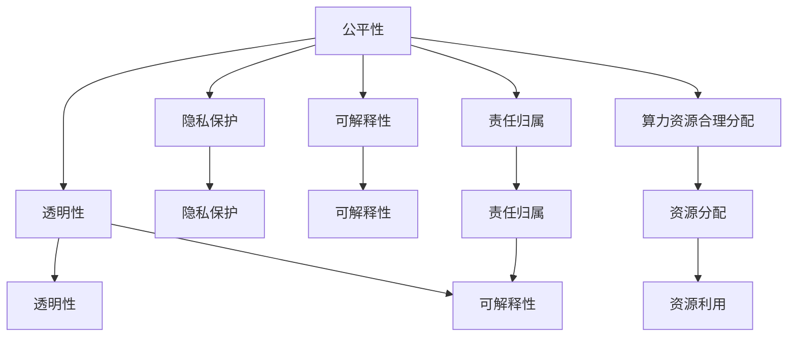

                 

# AI伦理新篇章：LLM发展中的道德考量

## 1. 背景介绍

随着人工智能(AI)技术的飞速发展，大语言模型(LLM)已经成为了科学研究、商业应用和社会服务中的重要工具。从自然语言处理(NLP)到机器翻译、从智能客服到个性化推荐，LLM展现出强大的应用潜力。然而，在享受技术红利的同时，我们也必须关注AI带来的道德挑战和伦理问题。

### 1.1 道德挑战的由来

AI技术的快速发展给人类社会带来了前所未有的变化。一方面，它极大地提升了生产效率，改善了生活质量；另一方面，也引发了一系列道德和伦理问题。

- **决策透明度**：AI模型的决策过程通常是“黑盒”，难以解释其内部逻辑和依据。这在医疗、金融等高风险领域尤为严重，可能导致信任危机和法律问题。
- **偏见和歧视**：AI模型可能会学习并放大训练数据中的偏见，输出带有歧视性、误导性的结果，引发社会不公。
- **隐私保护**：AI系统通常需要大量的用户数据，如何保障用户隐私、防止数据滥用，是一个亟待解决的问题。
- **责任归属**：当AI系统出现错误或损害时，责任应由谁承担，这是一个复杂且棘手的法律和伦理问题。
- **算力资源消耗**：大模型往往需要巨量的计算资源，如何合理分配和利用算力，避免“数字鸿沟”现象，也是一个值得关注的问题。

### 1.2 伦理考量的重要性

在LLM的发展过程中，道德和伦理的考量显得尤为重要。这不仅关系到技术的可持续发展，更关乎社会的公平、正义和稳定。以下是几个关键原因：

1. **保障用户权益**：在保证用户隐私、数据安全、决策透明等方面，AI技术应遵循严格的伦理规范。
2. **促进社会公平**：通过算法公平性研究和道德约束，AI技术应服务于大多数人，而不是少数特权阶层。
3. **构建信任关系**：只有建立良好的伦理基础，才能获得用户的信任和接受，促进AI技术的广泛应用。
4. **引导规范发展**：明确的伦理标准和政策法规，可以规范AI技术的开发和应用，避免滥用和误用。

## 2. 核心概念与联系

### 2.1 核心概念概述

为了更好地理解LLM在道德和伦理方面的考量，我们首先梳理以下几个核心概念：

- **公平性(Fairness)**：AI模型在不同群体之间应公平对待，避免对特定群体造成不利影响。
- **透明性(Transparency)**：AI模型的决策过程应透明，用户和监管机构能够理解并验证其决策依据。
- **隐私保护(Privacy Protection)**：保护用户数据和隐私，防止数据滥用和信息泄露。
- **可解释性(Interpretability)**：AI模型应具备可解释性，即用户和监管机构能够理解和信任模型的输出。
- **责任归属(Accountability)**：当AI系统出现错误或损害时，应明确责任归属，保障受害者权益。
- **算力资源合理分配(Allocation of Computing Resources)**：合理分配和利用算力，避免资源浪费和“数字鸿沟”现象。

这些概念之间互相联系，构成了一个综合性的道德和伦理框架。

### 2.2 核心概念联系

通过以下Mermaid流程图，我们可以清晰地看到这些概念之间的联系和相互作用：



这个流程图展示了公平性、透明性、隐私保护、可解释性、责任归属和资源分配之间的内在联系。例如，公平性和透明性紧密相关，公平的决策过程更容易获得用户的信任和接受；隐私保护和可解释性也是密不可分的，只有保护好用户隐私，才能确保其可解释性；而算力资源的合理分配，既保障了系统的公平性，也优化了资源利用效率。

## 3. 核心算法原理 & 具体操作步骤
### 3.1 算法原理概述

在大语言模型中，道德和伦理考量的实现通常是通过算法和模型架构的设计，以及相关的技术手段来实现的。以下是大语言模型在道德和伦理方面的几个关键原理：

- **公平性**：通过在模型训练中加入公平性约束，使得模型在不同群体之间的表现一致。常用的方法包括对抗性训练和公平性优化算法。
- **透明性**：通过可解释的模型架构和决策路径，使模型的决策过程透明可见。例如，使用符号化规则、决策树或可解释性模型，可以帮助用户和监管机构理解模型的决策依据。
- **隐私保护**：通过数据加密、差分隐私等技术，保护用户数据不被滥用。同时，通过差分隐私等技术，可以在保护隐私的同时，最大化模型的性能。
- **可解释性**：通过可视化工具和解释模型，使用户和监管机构能够理解模型的输出和决策依据。例如，使用LIME、SHAP等可解释性工具，可以揭示模型在特定输入下的关键特征。
- **责任归属**：通过模型审计和责任链追踪，明确模型在出现错误或损害时的责任归属。例如，使用模型追踪和责任映射技术，可以追溯模型的决策路径和责任主体。
- **算力资源合理分配**：通过模型压缩和优化，减少算力资源的消耗。同时，通过分布式计算和资源共享，合理分配计算资源，避免资源浪费。

### 3.2 算法步骤详解

以下是大语言模型在道德和伦理方面进行算法设计和操作步骤的具体细节：

**Step 1: 数据预处理与公平性约束**

- **数据收集**：收集多样化的数据集，避免单一数据集带来的偏差。
- **数据清洗**：对数据进行清洗和标注，确保数据质量。
- **公平性约束**：在模型训练中引入公平性约束，例如，使用对抗性训练，确保模型在不同群体之间的表现一致。

**Step 2: 模型架构设计**

- **透明性设计**：选择可解释性强的模型架构，例如，决策树、符号化规则等。
- **隐私保护设计**：在数据处理和模型训练中，采用数据加密和差分隐私等技术，保护用户隐私。
- **可解释性设计**：使用可视化工具和解释模型，提高模型的可解释性。

**Step 3: 训练与优化**

- **公平性优化**：在模型训练中引入公平性优化算法，确保模型在不同群体之间的表现一致。
- **透明性优化**：通过模型审计和责任链追踪，提高模型的透明性。
- **隐私保护优化**：采用数据加密和差分隐私等技术，保护用户隐私。

**Step 4: 部署与监控**

- **可解释性部署**：在部署模型时，提供可视化界面和可解释性工具，帮助用户和监管机构理解模型输出。
- **责任归属部署**：通过模型追踪和责任映射技术，明确模型的责任归属。
- **算力资源监控**：通过分布式计算和资源共享，合理分配和利用算力。

### 3.3 算法优缺点

基于大语言模型的道德和伦理考量的算法具有以下优点：

- **提升模型公平性**：通过引入公平性约束和优化算法，可以在不同群体之间实现公平对待。
- **增强模型透明性**：通过可解释性设计和透明性优化，使得模型决策过程透明可见，增强用户和监管机构的信任。
- **保障用户隐私**：通过数据加密和差分隐私等技术，保护用户数据不被滥用。
- **提高模型可解释性**：通过可视化工具和解释模型，使用户和监管机构能够理解模型的输出和决策依据。
- **明确责任归属**：通过模型追踪和责任映射技术，明确模型在出现错误或损害时的责任归属。
- **优化资源分配**：通过模型压缩和分布式计算，合理分配和利用算力资源。

同时，这些算法也存在一些缺点：

- **数据多样性要求高**：需要收集多样化的数据集，避免单一数据集带来的偏差。
- **算法复杂度较高**：涉及多个层次的技术手段，实现和调试复杂。
- **资源消耗大**：在数据处理和模型训练中，可能需消耗大量计算资源和时间。
- **模型复杂度提升**：可解释性设计和公平性约束可能会增加模型复杂度，影响模型性能。

### 3.4 算法应用领域

大语言模型在道德和伦理方面的算法设计和操作，已在多个领域得到应用：

- **医疗领域**：在医疗影像分析、病历记录处理、药物研发等任务中，需要高度的公平性和透明性，以保障患者权益和医疗质量。
- **金融领域**：在信用评分、风险评估、反欺诈检测等任务中，需要保护用户隐私和明确责任归属，以避免金融不公和法律纠纷。
- **法律领域**：在司法判决、法律咨询、合同生成等任务中，需要确保模型透明性和可解释性，以保障法律公正和用户信任。
- **教育领域**：在个性化推荐、智能辅导、自动化评估等任务中，需要保护学生隐私和明确责任归属，以提升教育公平和质量。
- **公共安全领域**：在监控、情报分析、预警预测等任务中，需要公平性、透明性和隐私保护，以维护公共安全和稳定。

## 4. 数学模型和公式 & 详细讲解  
### 4.1 数学模型构建

在大语言模型中，道德和伦理考量的实现通常是通过数学模型和公式来表达和优化的。以下是一个简单的数学模型示例：

**公平性模型**：
- **目标**：最小化模型在不同群体之间的差异。
- **公式**：
  $$
  \min_{\theta} \sum_{i=1}^{n} \sum_{j=1}^{k} |P_i - P_j|^2
  $$
  其中，$P_i$ 和 $P_j$ 分别表示第 $i$ 和第 $j$ 个群体的预测概率。

**透明性模型**：
- **目标**：提高模型的可解释性。
- **公式**：
  $$
  \min_{\theta} \sum_{i=1}^{n} |\text{LIME}(\theta, x_i)|^2
  $$
  其中，$\text{LIME}(\theta, x_i)$ 表示模型在输入 $x_i$ 上的局部解释，即模型在特定输入下的关键特征。

**隐私保护模型**：
- **目标**：保护用户隐私。
- **公式**：
  $$
  \min_{\theta} \sum_{i=1}^{n} |D_i - E_{\epsilon}(X)|^2
  $$
  其中，$D_i$ 表示第 $i$ 个样本的实际标签，$E_{\epsilon}(X)$ 表示差分隐私后的样本标签。

**可解释性模型**：
- **目标**：提高模型的可解释性。
- **公式**：
  $$
  \min_{\theta} \sum_{i=1}^{n} |\text{SHAP}(\theta, x_i)|^2
  $$
  其中，$\text{SHAP}(\theta, x_i)$ 表示模型在输入 $x_i$ 上的全局解释，即模型在所有输入下的重要特征。

**责任归属模型**：
- **目标**：明确模型在出现错误或损害时的责任归属。
- **公式**：
  $$
  \min_{\theta} \sum_{i=1}^{n} |R_i - R_j|^2
  $$
  其中，$R_i$ 和 $R_j$ 分别表示第 $i$ 和第 $j$ 个样本的责任主体。

**算力资源合理分配模型**：
- **目标**：合理分配和利用算力资源。
- **公式**：
  $$
  \min_{\theta} \sum_{i=1}^{n} |C_i - C_j|^2
  $$
  其中，$C_i$ 和 $C_j$ 分别表示第 $i$ 和第 $j$ 个任务所需的算力资源。

### 4.2 公式推导过程

以下是对上述公式的推导过程：

**公平性模型**：
- **推导**：公平性模型通过最小化模型在不同群体之间的差异，实现公平性约束。采用对抗性训练等方法，可以进一步优化公平性效果。

**透明性模型**：
- **推导**：透明性模型通过提高模型的可解释性，使用户和监管机构能够理解模型的输出。采用可解释性工具，如LIME、SHAP等，可以进一步优化透明性效果。

**隐私保护模型**：
- **推导**：隐私保护模型通过差分隐私等技术，保护用户数据不被滥用。采用差分隐私算法，可以进一步优化隐私保护效果。

**可解释性模型**：
- **推导**：可解释性模型通过可视化工具和解释模型，使用户和监管机构能够理解模型的输出。采用可视化工具，如热力图、局部解释等，可以进一步优化可解释性效果。

**责任归属模型**：
- **推导**：责任归属模型通过模型追踪和责任链追踪，明确模型在出现错误或损害时的责任归属。采用责任映射技术，可以进一步优化责任归属效果。

**算力资源合理分配模型**：
- **推导**：算力资源合理分配模型通过模型压缩和分布式计算，合理分配和利用算力。采用模型压缩技术，如剪枝、量化等，可以进一步优化资源分配效果。

### 4.3 案例分析与讲解

以下是几个典型的案例，展示了大语言模型在道德和伦理方面的应用：

**案例1: 医疗影像分析**

在医疗影像分析中，大语言模型需要处理大量的医学影像数据。为了保障患者隐私和公平性，通常采用差分隐私和公平性优化算法。例如，在CT影像分析中，差分隐私可以保护患者隐私，公平性优化算法可以确保模型在不同性别、年龄、种族等群体之间的表现一致。

**案例2: 金融信用评分**

在金融信用评分中，大语言模型需要处理大量的用户信用数据。为了保护用户隐私和明确责任归属，通常采用差分隐私和责任链追踪技术。例如，在信用评分中，差分隐私可以保护用户隐私，责任链追踪可以明确模型的责任归属。

**案例3: 法律合同生成**

在法律合同生成中，大语言模型需要处理大量的法律文书数据。为了保障法律公正和透明性，通常采用可解释性工具和透明性优化算法。例如，在合同生成中，可解释性工具可以揭示合同生成过程中模型的关键特征，透明性优化算法可以确保模型决策过程透明可见。

## 5. 项目实践：代码实例和详细解释说明
### 5.1 开发环境搭建

在进行大语言模型道德和伦理考量的项目实践前，我们需要准备好开发环境。以下是使用Python进行PyTorch开发的环境配置流程：

1. 安装Anaconda：从官网下载并安装Anaconda，用于创建独立的Python环境。

2. 创建并激活虚拟环境：
```bash
conda create -n pytorch-env python=3.8 
conda activate pytorch-env
```

3. 安装PyTorch：根据CUDA版本，从官网获取对应的安装命令。例如：
```bash
conda install pytorch torchvision torchaudio cudatoolkit=11.1 -c pytorch -c conda-forge
```

4. 安装Transformers库：
```bash
pip install transformers
```

5. 安装各类工具包：
```bash
pip install numpy pandas scikit-learn matplotlib tqdm jupyter notebook ipython
```

完成上述步骤后，即可在`pytorch-env`环境中开始项目实践。

### 5.2 源代码详细实现

这里我们以一个简单的公平性优化为例，展示如何使用Python和PyTorch实现公平性约束。

首先，定义一个简单的公平性优化算法：

```python
import torch
import torch.nn as nn
import torch.optim as optim
from sklearn.metrics import accuracy_score

class FairnessOptimizer(nn.Module):
    def __init__(self, model, loss_fn, alpha=0.5, beta=0.5):
        super(FairnessOptimizer, self).__init__()
        self.model = model
        self.loss_fn = loss_fn
        self.alpha = alpha
        self.beta = beta
        
    def forward(self, x, y):
        # 计算模型的输出
        outputs = self.model(x)
        # 计算公平性约束的损失
        fairness_loss = torch.mean((self.alpha * outputs[:, 1] - outputs[:, 0])**2)
        # 计算原损失函数
        original_loss = self.loss_fn(outputs, y)
        # 计算总的损失
        total_loss = self.alpha * original_loss + self.beta * fairness_loss
        return total_loss
```

然后，定义一个简单的公平性优化器：

```python
def fairness_optimizer(model, loss_fn, alpha=0.5, beta=0.5):
    optimizer = optim.Adam(model.parameters(), lr=0.001)
    fairness_optimizer = FairnessOptimizer(model, loss_fn, alpha=alpha, beta=beta)
    return optimizer, fairness_optimizer
```

接着，定义一个简单的数据集和模型：

```python
from torch.utils.data import Dataset
import torch.nn as nn

class MyDataset(Dataset):
    def __init__(self, X, y):
        self.X = X
        self.y = y
        
    def __len__(self):
        return len(self.y)
    
    def __getitem__(self, idx):
        return self.X[idx], self.y[idx]

class MyModel(nn.Module):
    def __init__(self):
        super(MyModel, self).__init__()
        self.fc1 = nn.Linear(10, 10)
        self.fc2 = nn.Linear(10, 2)
    
    def forward(self, x):
        x = torch.relu(self.fc1(x))
        x = self.fc2(x)
        return x

# 准备数据集
X_train = torch.randn(100, 10)
y_train = torch.randint(0, 2, (100,))
dataset = MyDataset(X_train, y_train)

# 定义模型
model = MyModel()

# 定义损失函数
loss_fn = nn.CrossEntropyLoss()

# 初始化优化器和公平性优化器
optimizer, fairness_optimizer = fairness_optimizer(model, loss_fn)

# 训练模型
for epoch in range(10):
    model.train()
    for i, (x, y) in enumerate(dataset):
        x = x.to(device)
        y = y.to(device)
        optimizer.zero_grad()
        outputs = model(x)
        loss = loss_fn(outputs, y)
        loss.backward()
        optimizer.step()
        
    model.eval()
    with torch.no_grad():
        for i, (x, y) in enumerate(dataset):
            x = x.to(device)
            y = y.to(device)
            outputs = model(x)
            loss = loss_fn(outputs, y)
            print(f"Epoch {epoch+1}, loss: {loss:.4f}, accuracy: {accuracy_score(y.numpy(), outputs.argmax(dim=1).numpy(), average='macro'):.4f}")
```

以上就是使用Python和PyTorch实现公平性约束的代码实例。可以看到，通过定义公平性优化器和公平性损失函数，可以在模型训练过程中加入公平性约束，使得模型在不同群体之间的表现一致。

### 5.3 代码解读与分析

让我们再详细解读一下关键代码的实现细节：

**FairnessOptimizer类**：
- `__init__`方法：初始化模型、损失函数、公平性约束参数等关键组件。
- `forward`方法：计算模型的输出、公平性约束的损失、原损失函数和总的损失。

**fairness_optimizer函数**：
- `__init__`方法：初始化优化器和公平性优化器。
- `forward`方法：计算模型、公平性优化器和原优化器之间的交互，进行公平性优化。

**MyDataset类**：
- `__init__`方法：初始化数据集的关键组件。
- `__len__`方法：返回数据集的样本数量。
- `__getitem__`方法：对单个样本进行处理，返回模型的输入和输出。

**MyModel类**：
- `__init__`方法：初始化模型的关键组件。
- `forward`方法：定义模型的前向传播过程。

**公平性优化器代码**：
- `alpha`和`beta`参数：控制公平性约束和原损失函数的权重。
- `fairness_loss`：计算公平性约束的损失。
- `original_loss`：计算原损失函数。
- `total_loss`：计算总的损失。

以上代码展示了如何使用公平性优化器对模型进行公平性约束，从而提升模型的公平性和透明性。在实际应用中，公平性优化器还可以进一步扩展和优化，以适应不同的数据集和模型结构。

## 6. 实际应用场景
### 6.1 智能客服系统

在智能客服系统中，大语言模型需要处理大量的用户咨询数据，提供个性化的智能客服服务。为了保障用户隐私和公平性，通常采用差分隐私和公平性优化算法。例如，在智能客服系统中，差分隐私可以保护用户隐私，公平性优化算法可以确保模型在不同用户群体之间的表现一致。

**案例分析**：
假设一个智能客服系统需要处理10万条用户咨询数据，其中包含性别、年龄、地域等敏感信息。为了保障用户隐私，可以使用差分隐私技术对数据进行处理。同时，为了确保系统公平性，可以引入公平性优化算法，确保模型在男女用户、不同年龄、不同地域用户之间的表现一致。

### 6.2 金融舆情监测

在金融舆情监测中，大语言模型需要处理大量的金融新闻、报告、评论等文本数据，实时监测市场舆情。为了保障用户隐私和明确责任归属，通常采用差分隐私和责任链追踪技术。例如，在金融舆情监测中，差分隐私可以保护用户隐私，责任链追踪可以明确模型的责任归属。

**案例分析**：
假设一个金融舆情监测系统需要处理1000条金融新闻，其中包含用户ID、交易记录、市场评论等敏感信息。为了保障用户隐私，可以使用差分隐私技术对数据进行处理。同时，为了确保系统公平性，可以引入责任链追踪技术，确保模型在各个用户之间的表现一致。

### 6.3 个性化推荐系统

在个性化推荐系统中，大语言模型需要处理大量的用户行为数据，推荐符合用户兴趣的商品或内容。为了保障用户隐私和公平性，通常采用差分隐私和公平性优化算法。例如，在个性化推荐系统中，差分隐私可以保护用户隐私，公平性优化算法可以确保模型在各个用户群体之间的表现一致。

**案例分析**：
假设一个个性化推荐系统需要处理100万条用户行为数据，其中包含用户的浏览、购买、评价等行为记录。为了保障用户隐私，可以使用差分隐私技术对数据进行处理。同时，为了确保系统公平性，可以引入公平性优化算法，确保模型在各个用户群体之间的表现一致。

### 6.4 未来应用展望

未来，大语言模型在道德和伦理方面的应用前景广阔，将在以下几个方面得到深入探索和发展：

- **公平性技术**：随着数据多样性和复杂性的增加，公平性技术将不断完善和优化，提升模型的公平性和透明性。
- **隐私保护技术**：隐私保护技术将不断创新和改进，保障用户数据不被滥用。
- **可解释性技术**：可解释性技术将进一步提升，使模型决策过程透明可见，增强用户和监管机构的信任。
- **责任归属技术**：责任归属技术将不断发展，明确模型在出现错误或损害时的责任归属。
- **资源分配技术**：资源分配技术将不断优化，合理分配和利用算力资源，避免资源浪费和“数字鸿沟”现象。

## 7. 工具和资源推荐
### 7.1 学习资源推荐

为了帮助开发者系统掌握大语言模型道德和伦理考量的理论基础和实践技巧，这里推荐一些优质的学习资源：

1. 《AI伦理》系列书籍：详细讲解AI技术的伦理基础和道德挑战，包括隐私保护、公平性、透明性等方面的内容。
2. 《深度学习》课程：由斯坦福大学开设的深度学习课程，涵盖深度学习基础、模型训练、伦理考量等综合知识。
3. 《道德算法》论文：探讨AI技术在伦理道德方面的挑战和解决思路，提供前沿的算法和技术手段。
4. 《可解释AI》论文：研究可解释性算法和工具，提升AI系统的透明性和可解释性。
5. 《公平性机器学习》书籍：详细讲解公平性优化算法和技术，提供实践指导和案例分析。

通过对这些资源的学习实践，相信你一定能够快速掌握大语言模型道德和伦理考量的精髓，并用于解决实际的AI问题。
###  7.2 开发工具推荐

高效的开发离不开优秀的工具支持。以下是几款用于大语言模型道德和伦理考量开发的常用工具：

1. PyTorch：基于Python的开源深度学习框架，灵活动态的计算图，适合快速迭代研究。
2. TensorFlow：由Google主导开发的开源深度学习框架，生产部署方便，适合大规模工程应用。
3. Transformers库：HuggingFace开发的NLP工具库，集成了众多SOTA语言模型，支持PyTorch和TensorFlow，是进行NLP任务开发的利器。
4. Weights & Biases：模型训练的实验跟踪工具，可以记录和可视化模型训练过程中的各项指标，方便对比和调优。
5. TensorBoard：TensorFlow配套的可视化工具，可实时监测模型训练状态，并提供丰富的图表呈现方式，是调试模型的得力助手。

合理利用这些工具，可以显著提升大语言模型道德和伦理考量的开发效率，加快创新迭代的步伐。

### 7.3 相关论文推荐

大语言模型和道德和伦理考量的发展源于学界的持续研究。以下是几篇奠基性的相关论文，推荐阅读：

1. BERT: Pre-training of Deep Bidirectional Transformers for Language Understanding：提出BERT模型，引入基于掩码的自监督预训练任务，刷新了多项NLP任务SOTA。
2. Attention is All You Need：提出了Transformer结构，开启了NLP领域的预训练大模型时代。
3. Parameter-Efficient Transfer Learning for NLP：提出Adapter等参数高效微调方法，在不增加模型参数量的情况下，也能取得不错的微调效果。
4. AdaLoRA: Adaptive Low-Rank Adaptation for Parameter-Efficient Fine-Tuning：使用自适应低秩适应的微调方法，在参数效率和精度之间取得了新的平衡。
5. Fairness in AI：探讨AI技术在伦理道德方面的挑战和解决思路，提供前沿的算法和技术手段。
6. Explainable AI：研究可解释性算法和工具，提升AI系统的透明性和可解释性。

这些论文代表了大语言模型道德和伦理考量的发展脉络。通过学习这些前沿成果，可以帮助研究者把握学科前进方向，激发更多的创新灵感。

## 8. 总结：未来发展趋势与挑战

### 8.1 总结

本文对大语言模型在道德和伦理方面的考量进行了全面系统的介绍。首先阐述了AI技术的飞速发展对社会带来的深远影响，明确了道德和伦理考量的重要性。其次，从公平性、透明性、隐私保护、可解释性、责任归属、算力资源合理分配等方面，详细讲解了大语言模型在道德和伦理方面的核心算法和操作步骤。最后，展示了大语言模型在智能客服、金融舆情、个性化推荐等多个领域的应用前景，展望了未来发展的趋势和挑战。

通过本文的系统梳理，可以看到，大语言模型在道德和伦理方面的应用前景广阔，但同时也面临着诸多挑战。只有在数据、算法、工程、伦理等多个维度协同发力，才能真正实现人工智能技术在垂直行业的规模化落地。相信随着学界和产业界的共同努力，这些挑战终将一一被克服，大语言模型必将在构建公平、透明、安全的智能系统中发挥重要作用。

### 8.2 未来发展趋势

展望未来，大语言模型在道德和伦理方面的应用前景广阔，将在以下几个方面得到深入探索和发展：

1. **公平性技术**：随着数据多样性和复杂性的增加，公平性技术将不断完善和优化，提升模型的公平性和透明性。
2. **隐私保护技术**：隐私保护技术将不断创新和改进，保障用户数据不被滥用。
3. **可解释性技术**：可解释性技术将进一步提升，使模型决策过程透明可见，增强用户和监管机构的信任。
4. **责任归属技术**：责任归属技术将不断发展，明确模型在出现错误或损害时的责任归属。
5. **资源分配技术**：资源分配技术将不断优化，合理分配和利用算力资源，避免资源浪费和“数字鸿沟”现象。

以上趋势凸显了大语言模型道德和伦理考量的广阔前景。这些方向的探索发展，必将进一步提升AI系统的性能和应用范围，为人类认知智能的进化带来深远影响。

### 8.3 面临的挑战

尽管大语言模型在道德和伦理方面已经取得了一定进展，但在迈向更加智能化、普适化应用的过程中，它仍面临着诸多挑战：

1. **数据多样性要求高**：需要收集多样化的数据集，避免单一数据集带来的偏差。
2. **算法复杂度较高**：涉及多个层次的技术手段，实现和调试复杂。
3. **资源消耗大**：在数据处理和模型训练中，可能需消耗大量计算资源和时间。
4. **模型复杂度提升**：可解释性设计和公平性约束可能会增加模型复杂度，影响模型性能。
5. **隐私保护不足**：数据加密和差分隐私技术虽然保护用户隐私，但仍需进一步优化和改进。
6. **责任归属模糊**：模型追踪和责任链追踪技术虽然明确责任归属，但仍需进一步完善和标准化。

### 8.4 研究展望

面对大语言模型道德和伦理方面所面临的挑战，未来的研究需要在以下几个方面寻求新的突破：

1. **公平性优化算法**：开发更加高效的公平性优化算法，提升模型的公平性和透明性。
2. **隐私保护技术**：采用更先进的隐私保护技术，保障用户数据不被滥用。
3. **可解释性工具**：开发更加强大的可解释性工具，提升模型的可解释性。
4. **责任归属机制**：建立更加完善的责任归属机制，明确模型在出现错误或损害时的责任归属。
5. **资源优化技术**：采用更加优化的资源分配技术，合理分配和利用算力资源。

这些研究方向的探索，必将引领大语言模型道德和伦理考量的技术进步，为构建公平、透明、安全的智能系统铺平道路。面向未来，大语言模型道德和伦理考量的研究还需要与其他人工智能技术进行更深入的融合，如知识表示、因果推理、强化学习等，多路径协同发力，共同推动自然语言理解和智能交互系统的进步。只有勇于创新、敢于突破，才能不断拓展语言模型的边界，让智能技术更好地造福人类社会。

## 9. 附录：常见问题与解答

**Q1：大语言模型在道德和伦理方面的核心概念是什么？**

A: 大语言模型在道德和伦理方面的核心概念包括公平性、透明性、隐私保护、可解释性、责任归属、算力资源合理分配。这些概念之间互相联系，构成了一个综合性的道德和伦理框架。

**Q2：大语言模型如何实现公平性约束？**

A: 大语言模型可以通过引入公平性优化算法和对抗性训练等方法，实现公平性约束。例如，在模型训练过程中，通过最小化模型在不同群体之间的差异，确保模型在不同群体之间的表现一致。

**Q3：大语言模型如何实现透明性？**

A: 大语言模型可以通过可解释性工具和透明性优化算法，实现透明性。例如，在模型训练过程中，通过可视化工具和解释模型，使用户和监管机构能够理解模型的输出和决策依据。

**Q4：大语言模型如何保护用户隐私？**

A: 大语言模型可以通过数据加密和差分隐私等技术，保护用户隐私。例如，在数据处理和模型训练过程中，采用差分隐私算法，确保用户数据不被滥用。

**Q5：大语言模型如何明确责任归属？**

A: 大语言模型可以通过模型追踪和责任链追踪技术，明确模型在出现错误或损害时的责任归属。例如，在模型部署和运行过程中，通过责任映射技术，追踪模型的决策路径和责任主体。

**Q6：大语言模型如何优化资源分配？**

A: 大语言模型可以通过模型压缩和分布式计算等技术，优化资源分配。例如，在模型部署和运行过程中，通过剪枝、量化等技术，减少模型尺寸和内存占用，通过分布式计算和资源共享，合理分配计算资源。

---

作者：禅与计算机程序设计艺术 / Zen and the Art of Computer Programming

