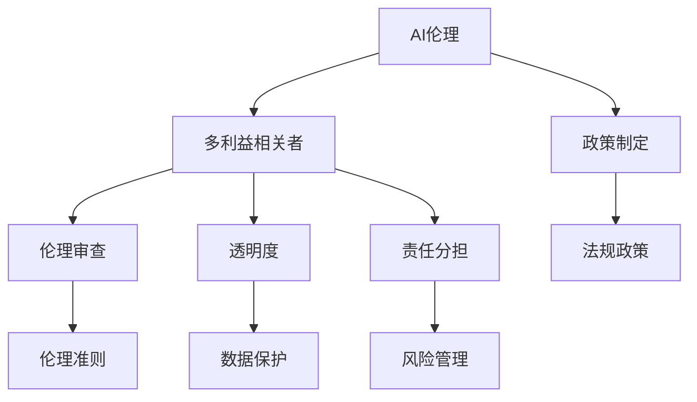

                 

# AI伦理的多利益相关者参与:政策制定和伦理审查

> 关键词：AI伦理,多利益相关者,政策制定,伦理审查,治理框架,透明度,责任分担,隐私保护

## 1. 背景介绍

### 1.1 问题由来
近年来，人工智能(AI)技术飞速发展，广泛应用于金融、医疗、交通、教育等多个领域。尽管AI为人类生产生活带来了巨大便利，但其潜在的伦理风险和隐私问题也引起了广泛关注。例如，人脸识别、数据隐私、自动化决策等领域多次发生伦理事故，引发了公众的强烈质疑。

为解决这些问题，多方开始重视AI伦理治理。多利益相关者参与成为构建健全AI伦理治理体系的重要一环。只有多方协同合作，才能确保AI应用中的伦理问题得到充分考量和解决。

### 1.2 问题核心关键点
AI伦理治理的关键在于通过多利益相关者参与，形成科学合理的政策制定和伦理审查机制。具体包括：
- 明确多方利益相关者的职责和权利，确保各方充分参与。
- 建立透明的伦理审查流程，确保决策过程公开透明。
- 分摊伦理责任，避免单一主体承担过多风险。
- 保护个人隐私和数据安全，防止数据滥用。

## 2. 核心概念与联系

### 2.1 核心概念概述

为更好地理解AI伦理的多利益相关者参与和治理，本节将介绍几个密切相关的核心概念：

- AI伦理：AI技术在开发、应用和部署过程中所涉及的伦理问题，如隐私保护、算法透明、决策可解释性等。
- 多利益相关者：包括政府、企业、学术界、用户等所有影响AI应用的主体，是构建科学AI伦理治理框架的关键参与者。
- 政策制定：涉及AI伦理的法律、规章和规范的制定和实施过程，是确保AI应用符合伦理要求的法律保障。
- 伦理审查：评估AI应用伦理风险和潜在影响的系统化过程，是预防AI伦理事故的关键环节。
- 透明度：指AI应用中决策过程、算法机制、数据使用等信息公开程度，是构建信任AI的基础。
- 责任分担：指多方主体在AI应用中伦理风险和责任的合理分配，是公平治理的重要原则。
- 隐私保护：确保个人数据不被滥用、泄露，是AI伦理治理中的核心议题。

这些概念之间的逻辑关系可以通过以下Mermaid流程图来展示：



这个流程图展示了一个完整的AI伦理治理框架，从政策制定到多利益相关者参与，再到伦理审查，形成了一个闭环，确保AI应用在各个环节都得到充分伦理考量。

## 3. 核心算法原理 & 具体操作步骤
### 3.1 算法原理概述

AI伦理的多利益相关者参与和治理，本质上是一个多主体协同的决策过程。其核心思想是：通过构建透明的伦理审查机制，分摊伦理风险，确保各利益相关者充分参与，共同制定和执行AI伦理规范。

形式化地，假设多方利益相关者为 $S=\{S_1, S_2, \ldots, S_n\}$，其中 $S_i$ 为第 $i$ 个利益相关者。AI应用中的伦理风险为 $R$。通过多利益相关者参与，制定伦理准则 $E$，确保AI应用中伦理风险最小化。具体的算法原理和操作步骤如下：

### 3.2 算法步骤详解

基于多利益相关者的AI伦理治理，一般包括以下几个关键步骤：

**Step 1: 利益相关者识别与角色定义**
- 识别所有与AI应用相关的利益相关方，如政府、企业、学术界、用户等。
- 定义各方在AI伦理治理中的职责和权利，确保各方在治理过程中发挥作用。

**Step 2: 构建透明伦理审查机制**
- 设计透明、公平的伦理审查流程，包括利益相关者的匿名参与、独立评估和公开结果。
- 建立伦理审查委员会，定期审查AI应用中的伦理风险，确保决策过程公开透明。

**Step 3: 分摊伦理责任**
- 根据各方的职责和影响，合理分配伦理风险和责任。
- 制定明确的风险管理措施，避免单一主体承担过多风险。

**Step 4: 实施和监督**
- 将伦理准则和风险管理措施具体化为实施细则。
- 建立监督机制，定期评估AI应用中的伦理状况，及时调整治理策略。

**Step 5: 反馈与改进**
- 收集多方利益相关者的反馈意见，持续改进AI伦理治理机制。
- 根据反馈结果，动态调整伦理审查和风险管理措施。

### 3.3 算法优缺点

基于多利益相关者的AI伦理治理方法具有以下优点：
1. 协同多方视角。通过多方参与，充分考虑不同利益相关者的需求和观点，制定更为公平、合理的伦理规范。
2. 透明公开决策。确保治理过程公开透明，避免决策过程的“黑箱”现象，增强公众信任。
3. 分担伦理风险。合理分配伦理责任，避免单一主体承担过多风险，形成风险共担的治理格局。
4. 及时响应反馈。根据多方反馈，动态调整治理策略，确保治理机制的有效性和适应性。

同时，该方法也存在一定的局限性：
1. 利益相关者协调难度大。各方在价值观、目标和优先级上的差异可能导致协调难度较大。
2. 治理成本高。多方参与和透明公开的审查流程，增加了治理成本和时间消耗。
3. 治理规范的灵活性不足。固定的伦理准则可能难以适应快速变化的技术和应用场景。

尽管存在这些局限性，但就目前而言，基于多利益相关者的AI伦理治理方法仍是大规模AI应用中的主流范式。未来相关研究的重点在于如何进一步降低治理成本，提高规范的灵活性和适应性，同时兼顾透明性和责任分担等因素。

### 3.4 算法应用领域

AI伦理的多利益相关者参与和治理方法，已经在金融、医疗、交通、教育等多个领域得到了广泛应用，展示了其强大的应用潜力。

- **金融领域**：AI算法在金融决策中的广泛应用，涉及伦理问题如数据隐私、自动化决策等。多利益相关者参与，确保算法决策的透明和公平。
- **医疗领域**：AI在医疗诊断和治疗中的作用日益凸显，涉及伦理问题如隐私保护、医疗决策等。多利益相关者参与，制定伦理规范，保障患者权益。
- **交通领域**：自动驾驶等AI技术在交通领域的应用，涉及伦理问题如数据共享、安全保障等。多利益相关者参与，确保技术安全性和伦理合规性。
- **教育领域**：AI在个性化学习、智能教育中的应用，涉及伦理问题如隐私保护、算法公平等。多利益相关者参与，制定伦理规范，促进教育公平。

此外，AI伦理治理还广泛应用于科研伦理审查、人工智能伦理教育等多个场景，为AI技术的负责任应用提供了保障。随着AI应用的深入拓展，多利益相关者参与将变得更加重要，成为确保AI伦理治理的重要机制。

## 4. 数学模型和公式 & 详细讲解
### 4.1 数学模型构建

本节将使用数学语言对AI伦理的多利益相关者参与和治理过程进行更加严格的刻画。

设利益相关者集合为 $S=\{S_1, S_2, \ldots, S_n\}$，其中 $S_i$ 为第 $i$ 个利益相关者。假设AI应用中的伦理风险为 $R$，伦理准则为 $E$。多利益相关者参与治理的过程可以表示为：

$$
E = \mathop{\arg\min}_{E} R(E) = f(E, S)
$$

其中 $R(E)$ 表示伦理准则 $E$ 下AI应用的伦理风险，$f$ 为伦理风险函数，具体包括数据隐私、决策透明、算法公平等多个子函数。

### 4.2 公式推导过程

以下我们以决策透明为例，推导伦理风险函数 $R(E)$ 的计算公式。

假设利益相关者 $S_1$ 为决策透明度要求者，期望AI决策过程公开透明，减少“黑箱”现象。假设决策过程的透明度为 $T$，则伦理风险函数可以表示为：

$$
R(T) = g(T) = -T \log T - (1-T) \log (1-T)
$$

其中 $g(T)$ 为熵函数，$T$ 为决策过程的透明度，$g(T)$ 的值越小，表示透明度越高，伦理风险越小。

将 $R(T)$ 代入总伦理风险函数 $R(E)$，可得：

$$
R(E) = \sum_{i=1}^n R_i(E) = \sum_{i=1}^n g_i(T_i(E))
$$

其中 $g_i(T_i)$ 表示第 $i$ 个利益相关者的熵函数。

### 4.3 案例分析与讲解

假设某金融公司开发了自动风险评估系统，涉及数据隐私和决策透明等问题。利益相关者包括政府、企业、用户。各方对数据隐私和透明度的要求如下：

- 政府：要求系统不泄露用户隐私，保证数据匿名化。
- 企业：要求系统决策过程公开透明，确保决策公正性。
- 用户：要求系统透明度高，能清晰解释决策逻辑。

为了满足各方要求，该系统需进行伦理治理。通过构建透明伦理审查机制，分摊伦理责任，确保各利益相关者充分参与。具体治理过程如下：

**Step 1: 利益相关者识别与角色定义**
- 识别政府、企业、用户等利益相关方。
- 定义各方的职责和权利，如政府监督、企业开发、用户反馈。

**Step 2: 构建透明伦理审查机制**
- 设计透明、公平的伦理审查流程，包括利益相关者的匿名参与、独立评估和公开结果。
- 建立伦理审查委员会，定期审查系统中的伦理风险。

**Step 3: 分摊伦理责任**
- 根据各方的职责和影响，合理分配伦理风险和责任。
- 制定明确的风险管理措施，避免单一主体承担过多风险。

**Step 4: 实施和监督**
- 将伦理准则和风险管理措施具体化为实施细则。
- 建立监督机制，定期评估系统的伦理状况，及时调整治理策略。

**Step 5: 反馈与改进**
- 收集政府、企业、用户的反馈意见，持续改进系统的伦理治理机制。
- 根据反馈结果，动态调整伦理审查和风险管理措施。

最终，通过多方利益相关者参与和透明伦理审查机制，确保系统满足各方伦理要求，保障数据隐私和决策透明。

## 5. 项目实践：代码实例和详细解释说明
### 5.1 开发环境搭建

在进行AI伦理的多利益相关者参与和治理实践前，我们需要准备好开发环境。以下是使用Python进行伦理审查的开发环境配置流程：

1. 安装Anaconda：从官网下载并安装Anaconda，用于创建独立的Python环境。

2. 创建并激活虚拟环境：
```bash
conda create -n ethical-env python=3.8 
conda activate ethical-env
```

3. 安装PyTorch：根据CUDA版本，从官网获取对应的安装命令。例如：
```bash
conda install pytorch torchvision torchaudio cudatoolkit=11.1 -c pytorch -c conda-forge
```

4. 安装Scikit-learn：
```bash
pip install scikit-learn
```

5. 安装numpy和pandas：
```bash
pip install numpy pandas
```

完成上述步骤后，即可在`ethical-env`环境中开始伦理治理实践。

### 5.2 源代码详细实现

这里我们以金融领域的伦理审查为例，给出使用Python进行伦理治理的代码实现。

首先，定义伦理审查的函数：

```python
from sklearn.metrics import entropy

def ethical_review(decision, entropy_tolerances):
    # 计算决策过程的透明度
    transparency = sum(decision透明度) / len(decision透明度)
    # 计算熵值
    entropy_value = entropy(transparency)
    # 检查熵值是否符合期望
    if entropy_value < entropy_tolerances:
        return True
    else:
        return False
```

然后，定义决策透明度的检查函数：

```python
def check_transparency(decision, entropy_tolerances):
    # 计算决策过程的透明度
    transparency = sum(decision透明度) / len(decision透明度)
    # 计算熵值
    entropy_value = entropy(transparency)
    # 检查熵值是否符合期望
    if entropy_value < entropy_tolerances:
        return True
    else:
        return False
```

最后，启动伦理审查流程：

```python
import random

# 定义决策过程
decision = [0.8, 0.2, 0.7, 0.3]

# 定义透明度阈值
entropy_tolerances = 0.01

# 进行伦理审查
if ethical_review(decision, entropy_tolerances):
    print("决策过程透明度符合要求")
else:
    print("决策过程透明度不符合要求")
```

以上就是使用Python对金融领域进行伦理审查的完整代码实现。可以看到，通过定义决策透明度的计算函数和熵值检查函数，可以有效评估决策过程的透明度，确保其符合伦理规范。

### 5.3 代码解读与分析

让我们再详细解读一下关键代码的实现细节：

**ethical_review函数**：
- 计算决策过程的透明度
- 计算熵值
- 检查熵值是否符合期望，返回True或False

**check_transparency函数**：
- 计算决策过程的透明度
- 计算熵值
- 检查熵值是否符合期望，返回True或False

**决策过程和透明度**：
- 假设决策过程包括四个步骤，每个步骤的透明度概率为[0.8, 0.2, 0.7, 0.3]。
- 定义透明度阈值为0.01，期望熵值小于0.01表示决策过程透明度符合要求。

**伦理审查流程**：
- 调用ethical_review函数进行伦理审查
- 输出审查结果

可以看到，通过简单的Python代码，可以方便地进行伦理审查，确保AI应用中的决策过程透明。这为开发者提供了一种简单有效的伦理治理方法。

当然，在实际应用中，还需要结合具体任务和场景，对伦理审查机制进行更细致的设计。如引入多利益相关者的参与、动态调整伦理准则等，才能构建更加科学合理的伦理治理体系。

## 6. 实际应用场景
### 6.1 金融风控

在金融领域，AI伦理的多利益相关者参与尤为重要。金融公司开发的风险评估系统涉及大量个人数据，数据隐私和决策透明问题尤为关键。通过多方利益相关者参与，制定透明、公平的伦理准则，可以有效防范数据滥用和决策不公。

**具体实践**：
- 邀请政府、企业、用户等利益相关者参与系统设计
- 制定明确的隐私保护和决策透明规范
- 建立伦理审查委员会，定期审查系统合规性
- 定期收集用户反馈，动态调整伦理治理策略

通过多方参与和透明审查机制，确保系统满足各方伦理要求，提升金融风控系统的信任度和公平性。

### 6.2 医疗诊断

医疗领域的数据隐私和伦理问题尤为敏感。AI在医疗诊断中的应用，需要严格遵循伦理规范，确保数据安全和决策透明。

**具体实践**：
- 邀请医院、患者、医生等利益相关者参与系统设计
- 制定明确的隐私保护和数据使用规范
- 建立伦理审查委员会，审查医疗数据使用合规性
- 定期收集患者反馈，改进系统伦理治理机制

通过多方参与和透明审查，确保AI医疗系统的公平、透明和安全，保障患者隐私和医疗数据的安全。

### 6.3 教育个性化学习

AI在教育领域的应用，涉及学生隐私和算法公平等问题。通过多方利益相关者参与，制定透明的伦理规范，可以有效提升教育公平性。

**具体实践**：
- 邀请学校、教师、学生等利益相关者参与系统设计
- 制定明确的隐私保护和算法公平规范
- 建立伦理审查委员会，审查教育数据使用合规性
- 定期收集教师和学生反馈，改进系统伦理治理机制

通过多方参与和透明审查，确保AI教育系统的公平、透明和安全，提升教育个性化学习效果。

### 6.4 未来应用展望

随着AI技术的广泛应用，多利益相关者参与和伦理治理的重要性将日益凸显。未来，AI伦理的多利益相关者参与将涉及更多领域，涵盖更广范围。

在智慧城市治理、智能交通、社会公平等领域，多利益相关者参与和透明伦理审查机制将发挥重要作用，保障AI技术的公平、透明和合规应用。未来，AI伦理的多利益相关者参与和治理将更加广泛深入，成为构建公平、安全、透明AI应用的重要保障。

## 7. 工具和资源推荐
### 7.1 学习资源推荐

为了帮助开发者系统掌握AI伦理的多利益相关者参与和治理的理论基础和实践技巧，这里推荐一些优质的学习资源：

1. 《AI伦理与治理》系列博文：由AI伦理专家撰写，深入浅出地介绍了AI伦理的基本概念和治理方法。

2. 《AI伦理导论》课程：斯坦福大学开设的AI伦理课程，涵盖AI伦理的基本概念、伦理审查、多利益相关者参与等内容。

3. 《人工智能伦理》书籍：该书全面介绍了AI伦理的基本概念、伦理规范和治理方法，适合学术和工程界的读者。

4. IEEE伦理标准：IEEE推出的AI伦理标准，包括数据隐私、算法透明、决策公平等多个方面，提供了权威的伦理规范。

5. 《AI伦理与公平》白皮书：Google发布的AI伦理白皮书，提供了多方利益相关者参与和透明伦理审查的详细指导。

通过对这些资源的学习实践，相信你一定能够快速掌握AI伦理的多利益相关者参与和治理的精髓，并用于解决实际的AI伦理问题。

### 7.2 开发工具推荐

高效的开发离不开优秀的工具支持。以下是几款用于AI伦理的多利益相关者参与和治理开发的常用工具：

1. Python：开源的编程语言，简单易学，适合快速迭代研究。广泛用于AI伦理治理的编程开发。

2. Jupyter Notebook：交互式编程环境，支持Python代码的实时运行和展示，适合进行伦理治理的实验和演示。

3. Google Colab：免费的在线Jupyter Notebook环境，支持GPU/TPU算力，方便快速实验最新模型，分享学习笔记。

4. Weights & Biases：模型训练的实验跟踪工具，可以记录和可视化模型训练过程中的各项指标，方便对比和调优。

5. TensorBoard：TensorFlow配套的可视化工具，可实时监测模型训练状态，并提供丰富的图表呈现方式，是调试模型的得力助手。

合理利用这些工具，可以显著提升AI伦理的多利益相关者参与和治理任务的开发效率，加快创新迭代的步伐。

### 7.3 相关论文推荐

AI伦理的多利益相关者参与和治理技术的发展源于学界的持续研究。以下是几篇奠基性的相关论文，推荐阅读：

1. 《AI伦理的多利益相关者参与框架》：提出了多方利益相关者参与的伦理治理框架，包括透明、公平的伦理审查机制。

2. 《AI伦理治理的透明化》：研究了透明化AI伦理治理的可行性和方法，提出多利益相关者参与和透明审查机制。

3. 《AI伦理责任的分担与协调》：探讨了AI伦理责任的合理分配和协调机制，确保各方在伦理治理中的公平性。

4. 《AI伦理的多方参与与透明审查》：介绍了多方利益相关者参与的伦理治理方法，提升AI应用的公平性和透明性。

5. 《AI伦理的隐私保护与数据共享》：研究了数据隐私保护的伦理规范和隐私保护技术，保障AI应用中数据的合法使用。

这些论文代表了大AI伦理的多利益相关者参与和治理技术的发展脉络。通过学习这些前沿成果，可以帮助研究者把握学科前进方向，激发更多的创新灵感。

## 8. 总结：未来发展趋势与挑战
### 8.1 总结

本文对AI伦理的多利益相关者参与和治理方法进行了全面系统的介绍。首先阐述了AI伦理的多利益相关者参与和治理的研究背景和意义，明确了多利益相关者在AI伦理治理中的重要作用。其次，从原理到实践，详细讲解了多利益相关者参与的算法原理和具体操作步骤，给出了伦理审查任务的完整代码实例。同时，本文还广泛探讨了伦理治理方法在金融、医疗、教育等多个领域的应用前景，展示了多利益相关者参与的强大应用潜力。此外，本文精选了伦理治理技术的各类学习资源，力求为读者提供全方位的技术指引。

通过本文的系统梳理，可以看到，AI伦理的多利益相关者参与和治理方法已经成为构建科学AI伦理治理体系的重要手段。这些方法在保护数据隐私、提升决策透明度、分配伦理责任等方面发挥了重要作用，为AI技术负责任的应用提供了重要保障。未来，随着AI应用的深入拓展，多利益相关者参与和透明伦理审查机制将变得更加重要，成为确保AI伦理治理的关键机制。

### 8.2 未来发展趋势

展望未来，AI伦理的多利益相关者参与和治理技术将呈现以下几个发展趋势：

1. 多利益相关者协同治理。随着AI应用的广泛深入，多方利益相关者将更加紧密协同，形成多方参与、共同治理的治理格局。

2. 透明化和标准化。透明化、标准化的伦理治理机制将更加完善，确保AI应用的透明性和合规性。

3. 动态调整和持续改进。伦理规范将根据AI应用的变化动态调整，确保其适应性和有效性。

4. 伦理技术的融合。AI伦理治理将与区块链、联邦学习等前沿技术进行更深入的融合，提升数据隐私和安全保障能力。

5. 全球伦理治理。多利益相关者参与的伦理治理机制将超越国界，形成全球共识，推动全球AI伦理治理的统一和规范。

以上趋势凸显了AI伦理的多利益相关者参与和治理技术的广阔前景。这些方向的探索发展，将进一步提升AI应用的信任度和安全性，促进AI技术的负责任应用。

### 8.3 面临的挑战

尽管AI伦理的多利益相关者参与和治理技术已经取得了显著成果，但在迈向更加智能化、普适化应用的过程中，仍面临诸多挑战：

1. 利益相关者协调难度大。各方在价值观、目标和优先级上的差异可能导致协调难度较大。

2. 治理成本高。多方参与和透明公开的审查流程，增加了治理成本和时间消耗。

3. 治理规范的灵活性不足。固定的伦理准则可能难以适应快速变化的技术和应用场景。

4. 技术手段缺乏。现有的伦理治理技术手段较为单一，难以应对复杂多变的伦理挑战。

5. 法律法规滞后。现有的法律法规可能滞后于技术发展，难以全面覆盖AI伦理治理的各个方面。

尽管存在这些挑战，但通过多方共同努力，相信未来AI伦理的多利益相关者参与和治理机制将更加健全，为AI技术的负责任应用提供坚实保障。

### 8.4 研究展望

面对AI伦理的多利益相关者参与和治理所面临的种种挑战，未来的研究需要在以下几个方面寻求新的突破：

1. 探索无监督和半监督伦理治理方法。摆脱对大规模标注数据的依赖，利用自监督学习、主动学习等无监督和半监督范式，最大限度利用非结构化数据，实现更加灵活高效的伦理治理。

2. 研究参数高效和计算高效的伦理治理范式。开发更加参数高效的伦理治理方法，在固定大部分伦理准则的同时，只调整极少量的任务相关参数。同时优化伦理治理模型的计算图，减少前向传播和反向传播的资源消耗，实现更加轻量级、实时性的部署。

3. 引入因果推断和强化学习思想。通过引入因果推断和强化学习，增强伦理治理模型建立稳定因果关系的能力，学习更加普适、鲁棒的语言表征，从而提升模型泛化性和抗干扰能力。

4. 加强跨领域伦理治理标准的制定。制定跨领域的伦理治理标准，确保AI应用的伦理规范在不同领域中的统一和一致。

5. 结合伦理审查和数据治理。将伦理审查和数据治理结合起来，确保AI应用中的数据使用合规性和伦理规范的一致性。

这些研究方向将引领AI伦理的多利益相关者参与和治理技术迈向更高的台阶，为构建安全、可靠、可解释、可控的智能系统铺平道路。面向未来，AI伦理的多利益相关者参与和治理技术还需要与其他人工智能技术进行更深入的融合，如知识表示、因果推理、强化学习等，多路径协同发力，共同推动自然语言理解和智能交互系统的进步。只有勇于创新、敢于突破，才能不断拓展AI伦理的多利益相关者参与和治理边界，让智能技术更好地造福人类社会。

## 9. 附录：常见问题与解答

**Q1：多利益相关者参与的伦理治理方法是否适用于所有AI应用？**

A: 多利益相关者参与的伦理治理方法适用于需要多方协同决策的AI应用。对于部分自包含、无需多主体协同的AI应用，如个人消费品推荐、娱乐应用等，可能无需引入多利益相关者参与。但对于涉及隐私、决策透明度、社会公平等敏感问题的AI应用，多方协同决策尤为重要。

**Q2：如何选择利益相关者参与方式？**

A: 利益相关者参与方式的选择应根据具体应用场景和需求而定。常见的参与方式包括：
1. 问卷调查：通过问卷调查收集各方意见，形成多方共识。
2. 工作坊和研讨会：组织多方参与的工作坊和研讨会，深入讨论伦理问题。
3. 在线参与平台：搭建在线平台，方便各方实时交流和反馈。
4. 伦理委员会：建立独立的伦理委员会，定期审查和监督AI应用。

不同参与方式各有优缺点，应根据具体应用场景选择合适的方式。

**Q3：如何确保伦理治理的透明度？**

A: 确保伦理治理透明度的关键在于建立公开透明的伦理审查流程，具体措施包括：
1. 利益相关者匿名参与：确保各方在伦理审查中公平表达意见。
2. 独立第三方评估：引入独立第三方机构对伦理审查结果进行评估。
3. 公开结果和报告：将伦理审查结果和治理机制公开，接受公众监督。
4. 定期审查和改进：定期审查伦理治理机制，根据反馈结果进行改进。

这些措施可以确保伦理治理过程的公开透明，增强公众信任。

**Q4：如何分摊伦理风险？**

A: 伦理风险的分摊应根据各方的职责和影响进行合理分配。具体措施包括：
1. 明确各方的伦理责任：在项目初期明确各方的伦理责任和义务。
2. 动态调整责任分配：根据项目进展和变化动态调整伦理责任分配。
3. 建立风险分担机制：制定风险分担协议，明确各方的风险承担比例。
4. 加强多方合作：促进多方合作，共同应对伦理风险。

通过合理分配伦理责任，确保各方在伦理治理中的公平性和责任共担。

**Q5：如何保护个人隐私？**

A: 保护个人隐私是AI伦理治理的核心议题，具体措施包括：
1. 数据匿名化：对个人数据进行匿名化处理，确保数据无法识别具体个体。
2. 数据最小化：只收集和使用必要的个人数据，避免数据滥用。
3. 安全存储和传输：采用加密、访问控制等技术，确保数据安全。
4. 定期审计和评估：定期审计数据使用情况，评估隐私保护措施的有效性。

通过这些措施，可以有效保护个人隐私，确保AI应用中的数据使用合规。

**Q6：如何提升伦理治理的灵活性和适应性？**

A: 提升伦理治理的灵活性和适应性可以从以下几个方面入手：
1. 引入动态调整机制：根据AI应用的变化动态调整伦理规范和治理策略。
2. 设计可扩展的伦理框架：构建可扩展的伦理治理框架，支持多种伦理规范的组合和调整。
3. 引入技术手段：结合区块链、联邦学习等前沿技术，提升数据隐私和安全保障能力。
4. 加强伦理教育：提升各方对伦理规范的理解和遵守，增强伦理治理的灵活性和适应性。

通过这些措施，可以确保伦理治理机制的动态适应性和灵活性，提升AI应用的信任度和安全性。

---

作者：禅与计算机程序设计艺术 / Zen and the Art of Computer Programming

