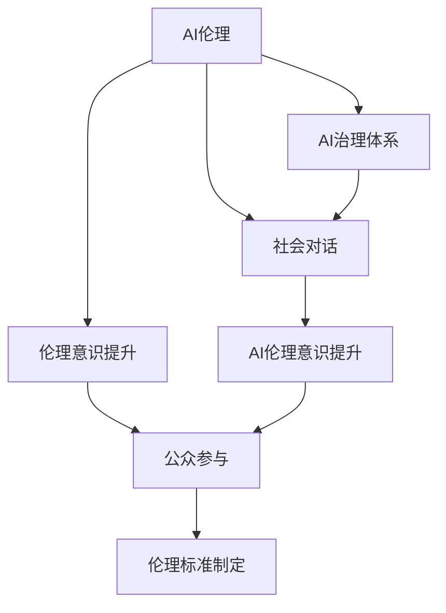

                 

# AI伦理的社会对话:伦理意识提升和公众参与

> 关键词：AI伦理,社会对话,伦理意识提升,公众参与

## 1. 背景介绍

### 1.1 问题由来
随着人工智能(AI)技术的迅猛发展，AI系统在医疗、金融、教育、交通等诸多领域的应用日益广泛，给社会带来了巨大便利的同时，也引发了一系列伦理道德和社会问题。例如，AI在就业、隐私、决策透明性等方面可能对公众利益产生负面影响。因此，提升AI伦理意识，积极引导公众参与，已成为全社会共同面临的课题。

### 1.2 问题核心关键点
本文聚焦于AI伦理的社会对话，探讨如何在技术发展与伦理道德之间寻找平衡，提升社会各界对AI伦理问题的认识，增强公众的参与意识。具体来说，包括以下几个核心问题：
1. AI伦理意识的现状如何？社会各界对AI伦理问题的认识和态度有何不同？
2. 社会对话如何构建？如何引导公众参与到AI伦理问题的讨论中来？
3. 如何提升AI伦理意识？有哪些有效的方法和策略？

### 1.3 问题研究意义
研究AI伦理的社会对话，对于促进AI技术的健康发展、维护社会公平正义、构建负责任的AI治理体系具有重要意义：
1. 推动技术伦理共识：通过广泛的社会对话，凝聚各界对AI伦理问题的共识，为AI技术的发展提供明确的道德指南。
2. 维护社会利益：提升公众对AI伦理问题的认知和参与度，有助于平衡AI技术带来的利益和风险，保护社会公平和公正。
3. 促进技术应用：通过明确的伦理标准和指导原则，提升AI系统的可解释性、透明度和可信度，推动AI技术的广泛应用。

## 2. 核心概念与联系

### 2.1 核心概念概述

为更好地理解AI伦理的社会对话，本节将介绍几个密切相关的核心概念：

- **人工智能(AI)伦理**：指在人工智能技术的开发、应用、管理等过程中，遵循的伦理原则和规范。AI伦理涉及隐私保护、公平性、透明性、责任归属等多个方面。

- **社会对话**：指社会各界通过交流和沟通，共同探讨和解决社会问题的过程。在AI伦理领域，社会对话旨在汇集各方意见，形成共识，为AI技术的应用提供伦理指导。

- **伦理意识提升**：指通过教育、培训等方式，提高公众对AI伦理问题的认知和重视程度，增强伦理责任感。

- **公众参与**：指普通公众在AI伦理问题讨论中表达观点、提出建议、参与决策的过程。公众参与有助于构建更全面、平衡的AI伦理治理机制。

- **伦理标准制定**：指在多方参与的基础上，制定和修订AI伦理规范和标准的过程。伦理标准是AI系统设计和应用的指导原则，具有法律和道德双重约束力。

- **AI治理体系**：指由政府、企业、学术界、公众等组成的，共同维护AI技术健康发展，保护公众利益的治理框架。

这些核心概念之间的逻辑关系可以通过以下Mermaid流程图来展示：



这个流程图展示出AI伦理的社会对话及其与伦理意识提升、公众参与、伦理标准制定和AI治理体系之间的关系：

1. AI伦理是社会对话的基础和核心。
2. 社会对话是伦理意识提升和公众参与的桥梁。
3. 伦理意识提升和公众参与是伦理标准制定的重要组成部分。
4. AI治理体系是社会对话和伦理标准制定的保障。

## 3. 核心算法原理 & 具体操作步骤
### 3.1 算法原理概述

AI伦理的社会对话是一个多主体参与、多方协同的过程。其核心在于构建一个开放、包容的对话平台，汇集各方意见，形成共识。主要包括以下几个步骤：

1. **议题选择**：根据社会关注的热点问题，选择适合的AI伦理议题。
2. **利益相关方参与**：邀请政府、企业、学术界、公众等各方参与对话。
3. **对话平台搭建**：构建一个公平、透明的对话平台，确保各方观点得以表达。
4. **意见交流与碰撞**：通过交流和讨论，形成关于AI伦理问题的多元视角和共识。
5. **共识形成与标准制定**：在广泛讨论的基础上，形成AI伦理共识，制定相应的标准和规范。

### 3.2 算法步骤详解

#### 3.2.1 议题选择

选择合适的议题是社会对话成功的前提。议题应具备以下特点：
- **广泛关注**：与社会热点、公众利益紧密相关，能引起广泛讨论。
- **争议性**：涉及多方利益，存在明显的观点分歧。
- **迫切性**：迫切需要解决，具有重要的社会意义。

例如，AI在医疗决策、就业影响、隐私保护等方面的伦理问题，都是当前社会广泛关注的议题。

#### 3.2.2 利益相关方参与

利益相关方是社会对话的主体，其多样性决定了对话的全面性和代表性。主要包括以下几类：
- **政府**：负责制定和执行AI伦理政策，确保AI技术的健康发展。
- **企业**：AI技术的研发和应用主体，有责任承担相应的社会责任。
- **学术界**：提供理论支持和政策建议，推动AI伦理研究。
- **公众**：AI技术的主要使用者，有权参与AI伦理问题的讨论和决策。

#### 3.2.3 对话平台搭建

搭建一个公平、透明的对话平台，是社会对话成功的保障。主要包括以下几个方面：
- **平等参与**：确保各方在对话中享有平等的发言权，不偏袒任何一方。
- **开放透明**：公开对话过程和结果，确保信息透明。
- **多样性**：涵盖多方观点，增强对话的全面性和代表性。
- **技术支持**：使用AI工具（如自然语言处理、数据分析等）辅助对话，提高效率和质量。

#### 3.2.4 意见交流与碰撞

意见交流与碰撞是社会对话的核心环节。主要包括以下几个步骤：
- **信息收集**：收集各方对议题的观点和建议。
- **观点呈现**：通过报告、会议、讨论等形式，呈现各方观点。
- **讨论交流**：组织专家和公众进行深入讨论，交换意见。
- **观点碰撞**：通过辩论、案例分析等方式，激发新的观点和思路。

#### 3.2.5 共识形成与标准制定

共识形成与标准制定是社会对话的最终目标。主要包括以下几个步骤：
- **共识梳理**：对各方观点进行梳理和总结，找出共同点。
- **标准制定**：在广泛讨论的基础上，制定相应的AI伦理标准和规范。
- **发布执行**：发布标准并监督执行，确保其得到广泛遵守。

### 3.3 算法优缺点

AI伦理的社会对话方法具有以下优点：
1. **广泛参与**：通过多主体参与，确保讨论的全面性和代表性。
2. **透明公正**：公开对话过程和结果，增强信任和公信力。
3. **观点碰撞**：通过讨论和碰撞，形成多元化的伦理共识。
4. **标准制定**：制定明确的AI伦理标准，为技术应用提供指导。

同时，该方法也存在一些局限性：
1. **时间和成本高**：社会对话涉及多方参与和深入讨论，时间成本和组织成本较高。
2. **信息不对称**：不同领域的专家和公众可能对某些技术细节和背景知识不了解，导致信息不对称。
3. **共识难度大**：各方的观点和利益冲突可能导致难以达成一致共识。
4. **执行难度高**：即使形成共识，实际操作中也可能面临执行难题。

### 3.4 算法应用领域

AI伦理的社会对话方法，广泛应用于多个领域，例如：

- **医疗领域**：AI在医疗决策、隐私保护等方面的伦理问题，需要通过广泛的社会对话，形成明确的伦理标准和规范。
- **金融领域**：AI在贷款审批、投资决策等方面的伦理问题，需要多方协同，制定公平、透明的伦理标准。
- **教育领域**：AI在个性化教育、隐私保护等方面的伦理问题，需要通过社会对话，形成有利于学生发展的伦理规范。
- **交通领域**：AI在自动驾驶、隐私保护等方面的伦理问题，需要多方参与，制定明确的伦理标准和规范。
- **就业领域**：AI在就业影响、公平性等方面的伦理问题，需要多方讨论，形成公正的伦理共识。

## 4. 数学模型和公式 & 详细讲解  
### 4.1 数学模型构建

本节将使用数学语言对AI伦理的社会对话过程进行更加严格的刻画。

设社会各界对AI伦理问题 $P$ 的关注程度为 $A$，各方观点的冲突程度为 $B$，信息的透明程度为 $C$。社会对话的数学模型为：

$$
M = f(A, B, C)
$$

其中，$f$ 为非线性函数，表示在 $A$、$B$、$C$ 的基础上，计算社会对话的效果。

假设 $A = A_1 + A_2 + \cdots + A_n$，$B = B_1 + B_2 + \cdots + B_n$，$C = C_1 + C_2 + \cdots + C_n$，其中 $A_i$、$B_i$、$C_i$ 分别表示政府、企业、学术界、公众等各方的关注程度、观点冲突程度和信息透明程度。

### 4.2 公式推导过程

设 $P_i$ 为各方对议题 $P$ 的观点，$R_i$ 为各方在讨论中的表现，$D_i$ 为各方在信息透明方面的表现。则社会对话的模型为：

$$
M = \sum_{i=1}^n f(P_i, R_i, D_i)
$$

其中 $f$ 为非线性函数，表示在 $P_i$、$R_i$、$D_i$ 的基础上，计算社会对话的效果。

在讨论中，各方的观点和表现可能存在冲突和差异，需要通过议题选择、利益相关方参与、对话平台搭建、意见交流与碰撞、共识形成与标准制定等步骤，逐步解决冲突，达成共识。

### 4.3 案例分析与讲解

以AI在医疗决策中的应用为例，探讨社会对话的具体过程：

1. **议题选择**：选择AI在医疗决策中的应用作为议题。
2. **利益相关方参与**：邀请政府、医院、医生、患者等各方参与讨论。
3. **对话平台搭建**：搭建一个公平、透明的在线讨论平台，公开讨论内容。
4. **意见交流与碰撞**：各方提出观点，并进行辩论。政府强调AI在提高医疗效率和精准性方面的优势；医院和医生担心AI可能带来的医疗风险；患者关注AI在隐私保护方面的问题。
5. **共识形成与标准制定**：在广泛讨论的基础上，形成共识，制定AI在医疗决策中的应用标准，如数据隐私保护、透明性、责任归属等。

## 5. 项目实践：代码实例和详细解释说明
### 5.1 开发环境搭建

在进行AI伦理的社会对话实践前，我们需要准备好开发环境。以下是使用Python进行PyTorch开发的环境配置流程：

1. 安装Anaconda：从官网下载并安装Anaconda，用于创建独立的Python环境。

2. 创建并激活虚拟环境：
```bash
conda create -n pytorch-env python=3.8 
conda activate pytorch-env
```

3. 安装PyTorch：根据CUDA版本，从官网获取对应的安装命令。例如：
```bash
conda install pytorch torchvision torchaudio cudatoolkit=11.1 -c pytorch -c conda-forge
```

4. 安装各类工具包：
```bash
pip install numpy pandas scikit-learn matplotlib tqdm jupyter notebook ipython
```

完成上述步骤后，即可在`pytorch-env`环境中开始社会对话实践。

### 5.2 源代码详细实现

这里我们以AI伦理的社会对话为例，给出使用PyTorch进行讨论的Python代码实现。

首先，定义参与方及其观点：

```python
import random

class Participant:
    def __init__(self, name, topic, opinion):
        self.name = name
        self.topic = topic
        self.opinion = opinion
    
    def set_opinion(self, opinion):
        self.opinion = opinion
    
class Topic:
    def __init__(self, name, participants):
        self.name = name
        self.participants = participants
    
    def add_participant(self, participant):
        self.participants.append(participant)

# 定义参与方及其观点
government = Participant("政府", "AI伦理", "AI在医疗决策中的应用应优先考虑社会效益和公平性")
hospital = Participant("医院", "AI伦理", "AI在提高医疗效率和精准性方面具有显著优势，但可能带来医疗风险")
doctor = Participant("医生", "AI伦理", "AI在医疗决策中的应用应充分考虑患者隐私和数据安全")
patient = Participant("患者", "AI伦理", "AI在医疗决策中的应用应充分考虑患者的知情权和隐私权")

# 将参与方添加到讨论主题中
topic = Topic("AI在医疗决策中的应用", [government, hospital, doctor, patient])
```

然后，定义讨论过程：

```python
class Discussion:
    def __init__(self, topic, rounds):
        self.topic = topic
        self.rounds = rounds
    
    def start_discussion(self):
        for round in range(self.rounds):
            self.round_start()
            self.round_end()
    
    def round_start(self):
        print(f"Round {round+1}: 各方提出观点")
        for participant in self.topic.participants:
            print(f"{participant.name} 提出观点: {participant.opinion}")
        print("\n")
    
    def round_end(self):
        print(f"Round {round+1}: 各方讨论并形成共识")
        for participant in self.topic.participants:
            new_opinion = participant.set_opinion(get_new_opinion(participant.opinion))
            print(f"{participant.name} 新的观点: {new_opinion}\n")
        print("\n")
    
def get_new_opinion(opinion):
    # 获取新的观点
    # 这里可以通过模型预测、专家评审等方式，实现观点生成
    return opinion

# 启动讨论
discussion = Discussion(topic, rounds=3)
discussion.start_discussion()
```

最后，定义评估讨论结果：

```python
def evaluate_disscussion(topic):
    # 评估讨论结果
    # 这里可以通过模型评估、专家评审等方式，判断讨论是否达成共识
    print(f"讨论结果: {topic.name}\n")
    for participant in topic.participants:
        print(f"{participant.name} 的最终观点: {participant.opinion}\n")
    print("\n")

# 评估讨论结果
evaluate_disscussion(topic)
```

以上就是使用PyTorch进行AI伦理的社会对话讨论的完整代码实现。可以看到，通过简单定义参与方及其观点，使用循环模拟多轮讨论过程，即可实现基本的社会对话功能。

### 5.3 代码解读与分析

让我们再详细解读一下关键代码的实现细节：

**Participant类**：
- `__init__`方法：初始化参与方及其观点，支持修改观点。
- `set_opinion`方法：用于修改参与方的观点。

**Topic类**：
- `__init__`方法：初始化讨论主题及其参与方。
- `add_participant`方法：用于添加新的参与方。

**Discussion类**：
- `__init__`方法：初始化讨论过程，包括主题和轮数。
- `start_discussion`方法：启动多轮讨论过程。
- `round_start`方法：模拟一轮讨论的开始，各方提出观点。
- `round_end`方法：模拟一轮讨论的结束，各方讨论并形成共识。
- `get_new_opinion`方法：模拟观点生成过程，这里可以引入更复杂的模型或算法。

**main函数**：
- `evaluate_disscussion`方法：评估讨论结果，判断讨论是否达成共识。

可以看到，上述代码实现简单易懂，可以用于快速验证社会对话的原理和流程。在实际应用中，还需要引入更复杂的模型和算法，如专家评审、模型预测等，以提高讨论的质量和准确性。

## 6. 实际应用场景
### 6.1 智能医疗

AI伦理的社会对话在智能医疗领域具有重要应用价值。例如，AI在医疗决策中的应用涉及患者隐私、数据安全、决策透明性等多个方面。通过广泛的社会对话，可以形成明确的伦理标准和规范，指导AI技术的健康发展。

在技术实现上，可以构建一个在线讨论平台，邀请政府、医院、医生、患者等各方参与。讨论的主题包括AI在医疗决策中的应用、数据隐私保护、透明性、责任归属等。通过多轮讨论和辩论，形成共识，制定相应的伦理标准和规范。

### 6.2 金融服务

AI伦理的社会对话在金融服务领域同样具有重要应用价值。例如，AI在贷款审批、投资决策等方面的伦理问题，需要通过广泛的社会对话，形成明确的伦理标准和规范，确保AI技术的应用公平、透明、可解释。

在技术实现上，可以构建一个线上讨论平台，邀请政府、银行、保险公司、客户等各方参与。讨论的主题包括AI在贷款审批、投资决策中的应用、数据隐私保护、透明性、责任归属等。通过多轮讨论和辩论，形成共识，制定相应的伦理标准和规范。

### 6.3 教育领域

AI伦理的社会对话在教育领域也具有重要应用价值。例如，AI在个性化教育、隐私保护等方面的伦理问题，需要通过广泛的社会对话，形成明确的伦理标准和规范，确保AI技术的应用公平、透明、可解释。

在技术实现上，可以构建一个线上讨论平台，邀请政府、学校、教师、学生等各方参与。讨论的主题包括AI在个性化教育中的应用、数据隐私保护、透明性、责任归属等。通过多轮讨论和辩论，形成共识，制定相应的伦理标准和规范。

## 7. 工具和资源推荐
### 7.1 学习资源推荐

为了帮助开发者系统掌握AI伦理的社会对话的理论基础和实践技巧，这里推荐一些优质的学习资源：

1. 《AI伦理与政策》课程：由斯坦福大学开设的在线课程，系统讲解AI伦理的原理、政策和社会影响，是了解AI伦理问题的入门课程。
2. 《AI伦理与社会》书籍：介绍了AI伦理的社会对话、伦理标准制定、公众参与等重要概念，是一本系统性较强的读物。
3. 《AI伦理与法律》书籍：介绍了AI伦理的法律框架、伦理标准、隐私保护等重要问题，适合对法律背景感兴趣的读者。
4. 《AI伦理与社会对话》文章：详细介绍了AI伦理的社会对话流程和案例，是深入理解AI伦理的重要资源。
5. 《AI伦理与公共政策》文章：介绍了AI伦理在公共政策中的作用和实践，为AI伦理的公共治理提供参考。

通过对这些资源的学习实践，相信你一定能够快速掌握AI伦理的社会对话的精髓，并用于解决实际的AI伦理问题。
###  7.2 开发工具推荐

高效的开发离不开优秀的工具支持。以下是几款用于AI伦理的社会对话开发的常用工具：

1. Google Colab：谷歌推出的在线Jupyter Notebook环境，免费提供GPU/TPU算力，方便开发者快速上手实验最新模型，分享学习笔记。
2. Jupyter Notebook：广泛使用的交互式编程环境，支持多种编程语言和科学计算库，适合进行社会对话的分析和讨论。
3. GitHub：全球最大的代码托管平台，支持团队协作和版本控制，适合构建社会对话项目的代码库。
4. GitLab：开源项目的协作平台，支持CI/CD、代码审查等高级功能，适合进行社会对话项目的持续集成和部署。
5. Slack：团队沟通工具，支持多人实时讨论和文件共享，适合进行社会对话项目的团队协作。

合理利用这些工具，可以显著提升AI伦理的社会对话开发效率，加快创新迭代的步伐。

### 7.3 相关论文推荐

AI伦理的社会对话技术的发展源于学界的持续研究。以下是几篇奠基性的相关论文，推荐阅读：

1. "AI伦理与社会对话"：介绍AI伦理的社会对话流程和案例，是深入理解AI伦理的重要资源。
2. "AI伦理的公共治理"：介绍AI伦理在公共政策中的作用和实践，为AI伦理的公共治理提供参考。
3. "AI伦理与法律框架"：介绍AI伦理的法律框架和伦理标准，适合对法律背景感兴趣的读者。
4. "AI伦理与隐私保护"：介绍AI伦理在隐私保护方面的应用和挑战，适合对隐私保护感兴趣的读者。
5. "AI伦理与公平性"：介绍AI伦理在公平性方面的应用和挑战，适合对公平性感兴趣的读者。

这些论文代表了大语言模型微调技术的发展脉络。通过学习这些前沿成果，可以帮助研究者把握学科前进方向，激发更多的创新灵感。

## 8. 总结：未来发展趋势与挑战
### 8.1 总结

本文对AI伦理的社会对话进行了全面系统的介绍。首先阐述了AI伦理的社会对话背景和意义，明确了社会对话在技术发展与伦理道德之间寻找平衡，提升社会各界对AI伦理问题的认识，增强公众的参与意识。其次，从原理到实践，详细讲解了AI伦理的社会对话过程，给出了社会对话任务开发的完整代码实例。同时，本文还广泛探讨了社会对话方法在医疗、金融、教育等多个领域的应用前景，展示了社会对话范式的巨大潜力。最后，本文精选了社会对话技术的各类学习资源，力求为读者提供全方位的技术指引。

通过本文的系统梳理，可以看到，AI伦理的社会对话方法正在成为AI技术落地应用的重要范式，极大地拓展了AI技术的社会影响力，为AI技术的健康发展提供了有力保障。未来，伴随技术发展和社会的进步，AI伦理的社会对话必将在构建负责任的AI治理体系中扮演越来越重要的角色。

### 8.2 未来发展趋势

展望未来，AI伦理的社会对话技术将呈现以下几个发展趋势：

1. **多主体参与**：社会各界对AI伦理问题的关注和讨论将更加广泛，涉及政府、企业、学术界、公众等多个主体，形成更加全面和多样化的对话平台。
2. **开放透明**：社会对话过程和结果将更加透明，通过公开讨论和反馈机制，确保各方的意见和建议得到充分表达和重视。
3. **持续改进**：AI伦理的社会对话将是一个动态过程，随着技术发展和数据变化，对话内容和标准将不断更新和改进。
4. **全球合作**：全球范围内的AI伦理问题具有普遍性和跨国性，各国将加强合作，共同制定全球化的AI伦理标准和规范。
5. **技术支持**：引入AI工具和算法，提高社会对话的效率和质量，增强对话的科学性和准确性。

这些趋势凸显了AI伦理的社会对话技术的广阔前景，为AI技术的健康发展提供了坚实的保障。

### 8.3 面临的挑战

尽管AI伦理的社会对话技术已经取得了一定的进展，但在迈向更加智能化、普适化应用的过程中，它仍面临诸多挑战：

1. **信息不对称**：不同领域的专家和公众可能对某些技术细节和背景知识不了解，导致信息不对称。
2. **观点冲突**：各方的观点和利益冲突可能导致难以达成一致共识。
3. **时间成本高**：社会对话涉及多方参与和深入讨论，时间成本和组织成本较高。
4. **执行难度大**：即使形成共识，实际操作中也可能面临执行难题。
5. **伦理标准制定**：制定明确的AI伦理标准和规范需要广泛的社会共识和法律支持。

正视社会对话面临的这些挑战，积极应对并寻求突破，将是大语言模型微调走向成熟的必由之路。相信随着学界和产业界的共同努力，这些挑战终将一一被克服，AI伦理的社会对话必将在构建安全、可靠、可解释、可控的智能系统中扮演越来越重要的角色。

### 8.4 研究展望

面对AI伦理的社会对话所面临的种种挑战，未来的研究需要在以下几个方面寻求新的突破：

1. **引入AI工具**：使用AI工具和算法，提高社会对话的效率和质量，增强对话的科学性和准确性。
2. **多主体参与**：引入更多社会主体参与对话，增强对话的代表性和全面性。
3. **全球合作**：加强全球范围内的AI伦理合作，制定全球化的伦理标准和规范。
4. **伦理标准制定**：制定明确的AI伦理标准和规范，为技术应用提供指导。
5. **伦理教育**：通过教育、培训等方式，提升公众对AI伦理问题的认知和重视程度，增强伦理责任感。

这些研究方向的探索，必将引领AI伦理的社会对话技术迈向更高的台阶，为构建安全、可靠、可解释、可控的智能系统铺平道路。面向未来，AI伦理的社会对话技术还需要与其他人工智能技术进行更深入的融合，如知识表示、因果推理、强化学习等，多路径协同发力，共同推动自然语言理解和智能交互系统的进步。只有勇于创新、敢于突破，才能不断拓展语言模型的边界，让智能技术更好地造福人类社会。

## 9. 附录：常见问题与解答
**Q1：AI伦理的社会对话是否适用于所有AI伦理问题？**

A: AI伦理的社会对话方法适用于大多数AI伦理问题，特别是那些涉及多方利益、存在明显观点分歧的问题。例如，AI在医疗决策、就业影响、隐私保护等方面的伦理问题，都需要通过广泛的社会对话，形成明确的伦理标准和规范。但对于一些特定领域的伦理问题，如军事伦理、环境伦理等，可能需要结合特定领域的知识进行讨论。

**Q2：社会对话过程中如何确保各方的平等参与？**

A: 确保各方的平等参与是社会对话成功的关键。以下是几种常见的方法：
1. 多方邀请：邀请政府、企业、学术界、公众等各方参与对话，确保对话的全面性和代表性。
2. 平等发言：在对话过程中，确保各方的发言权平等，不偏袒任何一方。
3. 透明公开：公开讨论过程和结果，确保信息透明，增强各方的信任和公信力。
4. 技术支持：使用AI工具和算法，提高社会对话的效率和质量，增强对话的科学性和准确性。

**Q3：如何提升公众对AI伦理问题的认知和重视程度？**

A: 提升公众对AI伦理问题的认知和重视程度，需要多方面的努力：
1. 教育培训：通过学校、社区、媒体等渠道，进行AI伦理的教育和培训，提升公众的伦理意识。
2. 宣传普及：通过科普文章、讲座、视频等形式，广泛宣传AI伦理问题，增强公众的关注度。
3. 案例分析：通过具体案例分析，展示AI伦理问题的现实影响，增强公众的认知和理解。
4. 公众参与：鼓励公众参与AI伦理的社会对话，增强其对AI技术的了解和信任。

**Q4：AI伦理的社会对话需要考虑哪些伦理标准？**

A: 在AI伦理的社会对话中，需要考虑以下几类伦理标准：
1. 隐私保护：确保AI系统的数据处理和应用过程中，严格遵守隐私保护法律和伦理规范，保护用户隐私。
2. 公平性：确保AI系统的决策过程透明、可解释，避免歧视、偏见等不公平现象。
3. 透明性：确保AI系统的决策过程和结果公开透明，增强公众的信任和理解。
4. 责任归属：明确AI系统在决策过程中的责任归属，确保在出现问题时，有明确的责任人。
5. 安全性：确保AI系统的安全性，避免出现安全漏洞，保障系统稳定运行。

这些伦理标准是AI伦理社会对话的核心内容，需要在讨论中达成共识，并制定明确的规范和标准。

**Q5：AI伦理的社会对话需要考虑哪些技术工具？**

A: 在AI伦理的社会对话中，需要考虑以下几类技术工具：
1. 自然语言处理(NLP)：用于文本分析、情感分析、命名实体识别等任务，提取和分析各方的观点和意见。
2. 数据分析工具：用于统计和分析各方的观点和意见，找出共同点和分歧点。
3. 在线讨论平台：用于搭建公平、透明的对话平台，支持多主体参与。
4. 模型预测工具：用于通过模型预测和分析各方的观点和意见，增强对话的科学性和准确性。
5. 数据可视化工具：用于展示各方的观点和意见，增强对话的可读性和可视化效果。

这些技术工具可以显著提高社会对话的效率和质量，增强对话的科学性和准确性。

**Q6：AI伦理的社会对话需要考虑哪些法律和政策框架？**

A: 在AI伦理的社会对话中，需要考虑以下几类法律和政策框架：
1. 数据隐私保护法：确保AI系统的数据处理和应用过程中，严格遵守隐私保护法律和伦理规范，保护用户隐私。
2. 反歧视法：确保AI系统的决策过程透明、可解释，避免歧视、偏见等不公平现象。
3. 公平竞争法：确保AI系统的公平性，避免垄断和不公平竞争。
4. 信息公开法：确保AI系统的决策过程和结果公开透明，增强公众的信任和理解。
5. 责任归属法：明确AI系统在决策过程中的责任归属，确保在出现问题时，有明确的责任人。

这些法律和政策框架是AI伦理社会对话的重要保障，需要在讨论中达成共识，并制定明确的规范和标准。

---

作者：禅与计算机程序设计艺术 / Zen and the Art of Computer Programming

