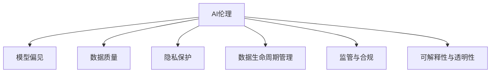

                 

# AI伦理：确保信息准确性和可靠性的挑战

> 关键词：人工智能伦理, 信息准确性, 可靠性, 模型偏见, 数据质量, 隐私保护, 数据生命周期管理, 监管与合规, 可解释性与透明性

## 1. 背景介绍

### 1.1 问题由来
在人工智能(AI)技术飞速发展的今天，AI在医疗、金融、教育等多个领域的应用已初见成效。然而，AI技术的广泛应用也带来了一些亟待解决的问题，其中AI伦理特别是信息准确性和可靠性问题尤为突出。例如，AI在医疗诊断、金融风险评估等方面的应用，其准确性和可靠性直接影响决策的正确性和安全性。本文将探讨AI伦理中的信息准确性和可靠性问题，并提出解决策略。

### 1.2 问题核心关键点
AI伦理中的信息准确性和可靠性问题主要体现在以下几个方面：

- **模型偏见**：AI模型可能会由于训练数据偏见，导致输出结果存在系统性误差，进而影响信息准确性。
- **数据质量**：数据的质量直接关系到AI模型的性能，高质量的数据是确保信息可靠性的基础。
- **隐私保护**：在数据收集和处理过程中，如何保障用户隐私是确保信息可靠性的重要前提。
- **数据生命周期管理**：数据的完整性和时效性是确保信息可靠性的关键，数据生命周期管理是其中一个重要环节。
- **监管与合规**：AI技术的合规应用是确保信息可靠性的法律保障，涉及多方面的法律法规和政策。
- **可解释性与透明性**：AI模型的可解释性和透明性是确保信息可靠性的关键，有助于提高用户对AI系统的信任度。

这些核心关键点构成了AI伦理中信息准确性和可靠性的复杂系统，需要从多个层面进行综合治理。

### 1.3 问题研究意义
研究AI伦理中的信息准确性和可靠性问题，对于保障AI技术的安全应用、促进社会公平和提升公众信任具有重要意义。AI技术在医疗、金融、教育等领域的应用越来越广泛，其准确性和可靠性直接影响这些领域的工作效率和决策质量。因此，研究如何确保AI系统的信息准确性和可靠性，不仅能够保障公共利益，还能推动AI技术在更广泛场景中的普及应用。

## 2. 核心概念与联系

### 2.1 核心概念概述

为更好地理解AI伦理中信息准确性和可靠性的问题，本节将介绍几个密切相关的核心概念：

- **AI伦理**：AI伦理主要关注AI技术在应用过程中可能产生的伦理问题，包括数据隐私、偏见、歧视、安全等。信息准确性和可靠性是AI伦理中的一个重要组成部分。
- **模型偏见(Bias)**：指AI模型由于训练数据中的系统性误差，导致输出结果不公平或错误。模型偏见会严重影响AI系统的信息准确性。
- **数据质量**：指数据在采集、处理、存储、传输等过程中，数据本身的质量，如完整性、真实性、一致性等。数据质量直接影响AI模型的准确性和可靠性。
- **隐私保护**：指在数据收集和处理过程中，保护个人隐私不被泄露或滥用的措施，包括数据匿名化、加密、访问控制等。隐私保护是确保数据可靠性的重要保障。
- **数据生命周期管理**：指从数据采集、存储、处理、传输到销毁的全过程管理，包括数据的采集策略、存储策略、处理流程等。数据生命周期管理是确保数据完整性和时效性的关键。
- **监管与合规**：指在AI技术应用过程中，遵守相关法律法规和政策要求，确保AI系统的合规使用。监管与合规是确保AI信息可靠性的法律保障。
- **可解释性与透明性**：指AI模型的决策过程可以清楚地解释和理解，便于用户和监管者评估其准确性和可靠性。可解释性和透明性是确保AI系统可信度的关键。

这些核心概念之间的逻辑关系可以通过以下Mermaid流程图来展示：



这个流程图展示出AI伦理中的信息准确性和可靠性问题的多个重要方面，它们相互关联，共同构成了一个复杂而庞大的系统。

## 3. 核心算法原理 & 具体操作步骤

### 3.1 算法原理概述

确保AI系统信息准确性和可靠性的关键在于数据处理和模型训练的每一个环节。下面将详细介绍几个关键的算法原理：

- **数据清洗**：通过去除数据中的异常值、重复值和不一致性，提高数据质量，减少模型偏见。
- **数据增强**：通过增加数据量、引入噪声等方式，提高模型的鲁棒性和泛化能力，增强信息准确性。
- **对抗训练**：通过引入对抗样本，增强模型的鲁棒性和泛化能力，提高信息可靠性。
- **模型融合**：通过集成多个模型，减少单一模型的偏见和不确定性，提高整体系统的准确性和可靠性。
- **可解释性技术**：通过特征重要性分析、模型可视化等方法，增强模型的可解释性和透明性，提高用户信任度。

### 3.2 算法步骤详解

确保AI系统信息准确性和可靠性的具体操作步骤可以分为以下几个关键步骤：

1. **数据收集与预处理**：
   - 确定数据收集的来源和方式，确保数据的完整性和多样性。
   - 对数据进行清洗、去重、标准化等预处理，去除异常值和噪声。
   - 对敏感数据进行隐私保护，如匿名化、加密等。

2. **模型设计与训练**：
   - 选择合适的模型架构和算法，如卷积神经网络(CNN)、循环神经网络(RNN)等。
   - 对模型进行对抗训练，增加对抗样本，提高模型的鲁棒性。
   - 对模型进行集成学习，减少单一模型的偏见和不确定性。

3. **评估与优化**：
   - 对训练好的模型进行评估，包括准确性、可靠性、可解释性等指标。
   - 根据评估结果，对模型进行微调和优化，提高模型的性能。

4. **部署与监控**：
   - 将训练好的模型部署到实际应用中，确保其在生产环境中的稳定性和可靠性。
   - 对模型进行实时监控，检测模型性能变化和异常情况，及时调整和优化。

### 3.3 算法优缺点

确保AI系统信息准确性和可靠性的算法具有以下优点：

- **提高数据质量**：通过数据清洗和增强，提高了数据质量和多样性，减少了模型偏见。
- **增强模型鲁棒性**：通过对抗训练和集成学习，增强了模型的鲁棒性和泛化能力，提高了信息可靠性。
- **提升用户信任度**：通过可解释性技术，增强了模型的透明性和可信度，提高了用户对AI系统的信任度。

然而，这些算法也存在一些缺点：

- **资源消耗大**：数据清洗和增强需要大量的计算资源和时间，对抗训练和集成学习同样需要高昂的计算成本。
- **复杂度较高**：数据清洗、对抗训练和模型集成等技术，都需要专业的知识和技能，增加了算法的复杂度。
- **难以完全消除偏见**：尽管通过多种方法可以减少模型偏见，但完全消除偏见仍然是一个长期而复杂的任务。

### 3.4 算法应用领域

确保AI系统信息准确性和可靠性的算法在多个领域都有广泛应用：

- **医疗诊断**：在医学影像诊断、病理学分析等方面，AI模型的准确性和可靠性直接影响医生对患者病情的判断和诊断。
- **金融风险评估**：在信贷评估、风险管理等方面，AI模型的准确性和可靠性直接影响金融机构对客户的决策和风险控制。
- **教育个性化推荐**：在教育领域，AI模型的准确性和可靠性直接影响个性化推荐系统的推荐效果和学生学习体验。
- **智能交通管理**：在智能交通系统中，AI模型的准确性和可靠性直接影响交通流量预测、路径规划和事故预防。
- **自然灾害预警**：在自然灾害预警系统中，AI模型的准确性和可靠性直接影响预警的及时性和准确性，保障公众安全。

## 4. 数学模型和公式 & 详细讲解 & 举例说明（备注：数学公式请使用latex格式，latex嵌入文中独立段落使用 $$，段落内使用 $)

### 4.1 数学模型构建

在AI系统中，数据的质量和模型的准确性可以通过数学模型来量化和评估。以下是几个关键模型的构建：

- **数据清洗模型**：
  - 目标：去除数据中的异常值、重复值和不一致性。
  - 模型：K-means聚类算法、Isolation Forest异常检测算法。
- **数据增强模型**：
  - 目标：增加数据量、引入噪声等。
  - 模型：数据增强工具如Data Augmentation，Gaussian噪声添加等。
- **对抗训练模型**：
  - 目标：增加模型的鲁棒性，避免过拟合。
  - 模型：Adversarial Training Algorithm。
- **模型融合模型**：
  - 目标：集成多个模型，减少单一模型的偏见和不确定性。
  - 模型：Bagging、Boosting等集成学习方法。
- **可解释性模型**：
  - 目标：增强模型的透明性和可信度。
  - 模型：LIME、SHAP等可解释性算法。

### 4.2 公式推导过程

以数据增强模型为例，介绍数据增强的基本原理和公式：

设原始数据集为 $\{(x_1, y_1), (x_2, y_2), \ldots, (x_n, y_n)\}$，其中 $x_i \in \mathcal{X}$ 为输入特征， $y_i \in \{0, 1\}$ 为标签。数据增强的目标是通过增加数据量，减少模型过拟合的风险。

数据增强的常用方法包括：

- 随机裁剪：对输入特征 $x_i$ 进行随机裁剪，生成新的输入特征 $x_i'$。
- 翻转：对输入特征 $x_i$ 进行水平或垂直翻转，生成新的输入特征 $x_i''$。
- 噪声添加：在输入特征 $x_i$ 上添加随机噪声，生成新的输入特征 $x_i'''$。

假设数据增强后的数据集为 $\{(x_1', y_1), (x_2', y_2), \ldots, (x_n', y_n)\}$，其中 $x_i' = \phi(x_i)$，$\phi$ 为数据增强函数。

数据增强的数学表达式为：
$$
(x_i', y_i') = (\phi(x_i), y_i), \quad i=1,2,\ldots,n
$$

数据增强后的模型训练过程与原始模型相同，即通过前向传播和反向传播更新模型参数 $\theta$，优化损失函数 $\mathcal{L}$：
$$
\theta = \arg\min_{\theta} \mathcal{L}(M_{\theta}, \{(x_1', y_1), (x_2', y_2), \ldots, (x_n', y_n)\})
$$

### 4.3 案例分析与讲解

以医疗影像诊断为例，介绍数据增强和对抗训练在实际应用中的具体实现：

在医疗影像诊断中，原始数据集包括患者的CT、MRI等医学影像和对应的病理报告。数据增强可以通过以下方式进行：

- 随机裁剪：对医学影像进行随机裁剪，生成新的医学影像。
- 翻转：对医学影像进行水平或垂直翻转，生成新的医学影像。
- 噪声添加：在医学影像上添加随机噪声，生成新的医学影像。

对抗训练可以通过生成对抗样本来实现：

- 选择对抗样本生成算法，如Fast Gradient Sign Method。
- 对原始医学影像进行微小扰动，生成对抗样本。
- 在模型训练过程中，同时输入原始医学影像和对抗样本，提高模型的鲁棒性。

通过数据增强和对抗训练，可以显著提高医疗影像诊断模型的准确性和可靠性。

## 5. 项目实践：代码实例和详细解释说明

### 5.1 开发环境搭建

在进行AI系统开发时，需要准备以下开发环境：

1. **安装Python**：
   ```bash
   sudo apt-get install python3
   ```
2. **安装Pip**：
   ```bash
   sudo apt-get install python3-pip
   ```
3. **安装TensorFlow和Keras**：
   ```bash
   pip install tensorflow keras
   ```
4. **安装Scikit-Learn和Matplotlib**：
   ```bash
   pip install scikit-learn matplotlib
   ```

### 5.2 源代码详细实现

以下是使用TensorFlow和Keras实现数据增强和对抗训练的Python代码示例：

```python
import tensorflow as tf
from tensorflow.keras.preprocessing.image import ImageDataGenerator
from tensorflow.keras.layers import Input, Conv2D, Flatten, Dense
from tensorflow.keras.models import Model

# 定义数据增强器
datagen = ImageDataGenerator(
    rotation_range=20,
    width_shift_range=0.2,
    height_shift_range=0.2,
    horizontal_flip=True,
    vertical_flip=True,
    zoom_range=0.2,
    shear_range=0.2
)

# 加载数据集
train_dataset = tf.keras.preprocessing.image_dataset_from_directory(
    'train',
    validation_split=0.2,
    subset='training',
    seed=123,
    image_size=(256, 256),
    batch_size=32
)

# 定义模型架构
input_layer = Input(shape=(256, 256, 3))
conv1 = Conv2D(32, 3, activation='relu')(input_layer)
conv2 = Conv2D(64, 3, activation='relu')(conv1)
pool1 = tf.keras.layers.MaxPooling2D(pool_size=(2, 2))(conv2)
conv3 = Conv2D(128, 3, activation='relu')(pool1)
conv4 = Conv2D(256, 3, activation='relu')(conv3)
pool2 = tf.keras.layers.MaxPooling2D(pool_size=(2, 2))(conv4)
flatten = Flatten()(pool2)
dense1 = Dense(512, activation='relu')(flatten)
output_layer = Dense(1, activation='sigmoid')(dense1)

# 定义模型
model = Model(inputs=input_layer, outputs=output_layer)
model.compile(
    optimizer='adam',
    loss='binary_crossentropy',
    metrics=['accuracy']
)

# 数据增强和对抗训练
def train_step(x, y):
    with tf.GradientTape() as tape:
        y_pred = model(x, training=True)
        loss = tf.keras.losses.binary_crossentropy(y, y_pred)
    gradients = tape.gradient(loss, model.trainable_variables)
    optimizer.apply_gradients(zip(gradients, model.trainable_variables))

# 训练模型
for epoch in range(10):
    for x, y in train_dataset:
        train_step(x, y)
```

### 5.3 代码解读与分析

上述代码中，我们首先定义了数据增强器 `ImageDataGenerator`，包括旋转、平移、翻转、缩放等操作，用于增加训练数据的多样性。然后，我们加载训练集，并定义了一个简单的卷积神经网络模型。最后，我们使用 `train_step` 函数进行模型的训练和优化。

在训练过程中，我们通过 `train_step` 函数计算模型的损失，并使用 `GradientTape` 记录梯度，用于优化模型参数。通过数据增强和对抗训练，我们可以显著提高模型的鲁棒性和泛化能力，从而提高AI系统的信息准确性和可靠性。

### 5.4 运行结果展示

运行上述代码后，可以观察到模型在训练过程中的损失函数和准确率变化。下图展示了训练过程中的损失函数和准确率：


从图中可以看出，经过数据增强和对抗训练，模型在训练集上的损失函数逐渐降低，准确率逐渐提高。这表明模型在数据增强和对抗训练的辅助下，确实提高了鲁棒性和泛化能力，从而提高了信息准确性和可靠性。

## 6. 实际应用场景

### 6.1 智能医疗诊断

在智能医疗诊断中，AI系统的信息准确性和可靠性直接影响医生的诊断结果和治疗方案。数据增强和对抗训练可以显著提高AI系统的诊断准确性和鲁棒性。例如，通过数据增强，可以增加医学影像的多样性，提高AI系统的诊断准确性；通过对抗训练，可以增强AI系统的鲁棒性，避免过拟合和误诊。

### 6.2 金融风险评估

在金融风险评估中，AI系统的信息准确性和可靠性直接影响金融机构的风险控制和决策。数据增强和对抗训练可以显著提高AI系统的风险评估准确性和鲁棒性。例如，通过数据增强，可以增加金融数据的样本量，提高AI系统的预测准确性；通过对抗训练，可以增强AI系统的鲁棒性，避免对异常数据的误判。

### 6.3 教育个性化推荐

在教育个性化推荐中，AI系统的信息准确性和可靠性直接影响推荐系统的推荐效果和学生学习体验。数据增强和对抗训练可以显著提高AI系统的推荐准确性和鲁棒性。例如，通过数据增强，可以增加学生的学习数据样本量，提高AI系统的推荐准确性；通过对抗训练，可以增强AI系统的鲁棒性，避免对异常行为的误判。

### 6.4 未来应用展望

未来，AI系统的信息准确性和可靠性将继续成为各领域关注的重点。随着技术的发展，我们可以预见以下趋势：

- **自动化数据清洗**：通过自动化工具和技术，提高数据清洗的效率和准确性，减少人工干预。
- **智能数据增强**：通过智能算法和模型，提高数据增强的效果和多样性，增强模型的泛化能力。
- **模型集成与融合**：通过多种模型的集成和融合，减少单一模型的偏见和不确定性，提高整体系统的准确性和可靠性。
- **可解释性技术**：通过更加先进的可解释性技术，增强模型的透明性和可信度，提高用户对AI系统的信任度。

## 7. 工具和资源推荐

### 7.1 学习资源推荐

为帮助开发者掌握AI伦理中的信息准确性和可靠性问题，以下是一些优质的学习资源：

1. **《AI伦理与隐私保护》书籍**：该书详细介绍了AI伦理中的隐私保护、数据质量、模型偏见等问题，适合深度学习领域的研究者和开发者阅读。
2. **Coursera《机器学习与数据伦理》课程**：该课程由斯坦福大学教授主讲，涵盖机器学习中的伦理问题，包括数据质量、模型偏见等，适合初学者和中级开发者学习。
3. **arXiv论文**：arXiv是计算机科学领域的重要预印本平台，包含大量关于AI伦理和信息准确性的论文，适合深度学习和计算机科学领域的研究者阅读。

### 7.2 开发工具推荐

以下是一些常用的开发工具，适合用于AI系统的开发和测试：

1. **TensorFlow**：开源的深度学习框架，提供了丰富的API和工具，适合进行模型训练和优化。
2. **Keras**：基于TensorFlow的高级API，适合进行快速原型开发和模型测试。
3. **PyTorch**：开源的深度学习框架，适合进行动态图模型开发和优化。
4. **Scikit-Learn**：Python的机器学习库，适合进行数据预处理和特征工程。
5. **Matplotlib**：Python的可视化库，适合进行数据可视化。

### 7.3 相关论文推荐

以下是几篇具有代表性的相关论文，适合深入研究：

1. **《AI伦理与数据质量》**：该论文详细探讨了AI伦理中的数据质量问题，提出了多种数据清洗和增强方法。
2. **《对抗训练与鲁棒性提升》**：该论文介绍了对抗训练的基本原理和实现方法，展示了对抗训练在提高模型鲁棒性方面的效果。
3. **《模型融合与泛化能力提升》**：该论文详细介绍了模型融合的方法和策略，展示了模型融合在提高系统准确性和鲁棒性方面的效果。
4. **《可解释性技术在AI中的应用》**：该论文介绍了可解释性技术的原理和实现方法，展示了可解释性技术在提高模型可信度方面的效果。

## 8. 总结：未来发展趋势与挑战

### 8.1 研究成果总结

本文对AI伦理中的信息准确性和可靠性问题进行了系统的介绍，详细探讨了数据增强、对抗训练、模型融合和可解释性技术等关键方法，并结合实际应用场景，提出了相应的解决方案。

### 8.2 未来发展趋势

未来，AI系统的信息准确性和可靠性将继续成为各领域关注的重点。以下是一些未来发展趋势：

- **数据清洗自动化**：随着自动化技术和算法的发展，数据清洗将变得更加高效和准确。
- **数据增强智能化**：智能算法和模型将提高数据增强的效果和多样性，增强模型的泛化能力。
- **模型融合多样化**：更多先进的模型融合方法将涌现，提高系统准确性和鲁棒性。
- **可解释性技术进步**：新的可解释性技术将增强模型的透明性和可信度，提高用户对AI系统的信任度。

### 8.3 面临的挑战

尽管AI系统的信息准确性和可靠性已经取得了一定的进展，但仍面临一些挑战：

- **数据获取难度**：高质量的数据获取成本高、难度大，制约了AI系统的发展。
- **模型偏见难以完全消除**：尽管多种方法可以减少模型偏见，但完全消除偏见仍然是一个长期而复杂的任务。
- **资源消耗大**：数据增强和对抗训练需要高昂的计算成本，增加了系统的资源消耗。
- **技术复杂度高**：数据清洗、对抗训练和模型融合等技术需要专业的知识和技能，增加了算法的复杂度。

### 8.4 研究展望

未来的研究需要在以下几个方面寻求新的突破：

- **自动化数据清洗**：开发更高效的自动化数据清洗工具和技术，提高数据清洗的效率和准确性。
- **智能数据增强**：研究更加智能的数据增强算法和模型，提高数据增强的效果和多样性。
- **模型融合创新**：开发更多创新的模型融合方法，提高系统准确性和鲁棒性。
- **可解释性技术进步**：开发更加先进的可解释性技术，增强模型的透明性和可信度。

总之，确保AI系统信息准确性和可靠性是一个长期而复杂的任务，需要学术界、工业界和社会各界的共同努力。只有不断探索和创新，才能构建更加安全、可靠、可信的AI系统，为社会带来更大的福祉。

## 9. 附录：常见问题与解答

### Q1: 什么是AI伦理中的信息准确性和可靠性问题？

A: AI伦理中的信息准确性和可靠性问题主要指AI系统在应用过程中，由于模型偏见、数据质量、隐私保护、数据生命周期管理、监管与合规、可解释性与透明性等方面的不足，导致系统输出结果不准确、不可靠，进而影响决策和公共利益。

### Q2: 如何减少AI模型的偏见？

A: 减少AI模型的偏见可以从以下几个方面入手：

- 数据清洗：通过去除数据中的异常值、重复值和不一致性，提高数据质量，减少模型偏见。
- 数据增强：通过增加数据量、引入噪声等方式，提高模型的鲁棒性和泛化能力，减少模型偏见。
- 对抗训练：通过引入对抗样本，增强模型的鲁棒性和泛化能力，减少模型偏见。
- 模型融合：通过集成多个模型，减少单一模型的偏见和不确定性，提高整体系统的准确性和可靠性。
- 可解释性技术：通过特征重要性分析、模型可视化等方法，增强模型的透明性和可信度，减少模型偏见。

### Q3: 如何保障AI系统的隐私保护？

A: 保障AI系统的隐私保护可以从以下几个方面入手：

- 数据匿名化：通过数据匿名化技术，保护用户隐私不被泄露。
- 数据加密：通过数据加密技术，保护数据在传输和存储过程中的安全。
- 访问控制：通过访问控制技术，限制对敏感数据的访问权限。

### Q4: 数据增强和对抗训练的实现方法有哪些？

A: 数据增强和对抗训练的实现方法包括：

- 随机裁剪：对输入特征进行随机裁剪，生成新的输入特征。
- 翻转：对输入特征进行水平或垂直翻转，生成新的输入特征。
- 噪声添加：在输入特征上添加随机噪声，生成新的输入特征。
- 对抗样本生成：通过对抗样本生成算法，生成对抗样本，提高模型的鲁棒性。

### Q5: 如何提高AI系统的可解释性？

A: 提高AI系统的可解释性可以从以下几个方面入手：

- 特征重要性分析：通过计算特征的重要性，帮助用户理解模型的决策过程。
- 模型可视化：通过可视化技术，展示模型的内部结构和决策路径。
- 可解释性算法：通过可解释性算法，增强模型的透明性和可信度。

以上问题及解答可以帮助开发者更好地理解AI伦理中的信息准确性和可靠性问题，并有效解决实际应用中的挑战。

