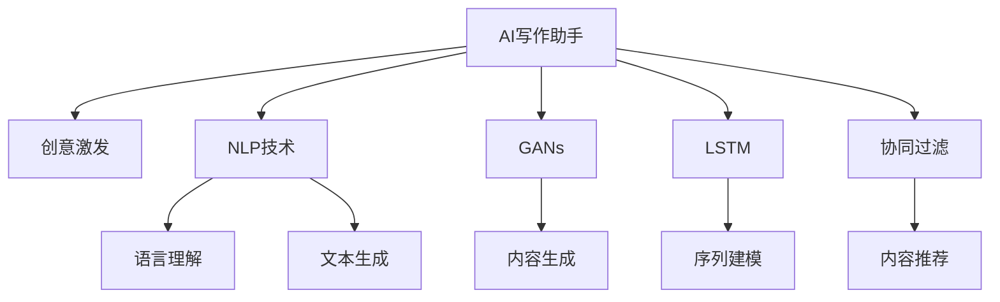

                 

# AI写作助手：技术实现与创意激发

## 1. 背景介绍

在数字化的浪潮中，写作依然是人类不可或缺的核心能力之一。然而，写作对于多数人来说并非易事，尤其当涉及长篇大论、复杂逻辑或学术写作时，更是让人望而却步。人工智能技术的迅猛发展，为写作助力带来了新的曙光。本文将深入探讨如何通过技术手段，激发创意思维，助力撰写高效、创新的文字作品。

## 2. 核心概念与联系

### 2.1 核心概念概述

1. **AI写作助手**：基于人工智能技术的写作工具，通过分析语言模型、语料库和用户行为数据，自动生成或辅助人类进行写作。
2. **创意激发**：使用算法和模型激发创意思维，辅助作家、研究人员、学生等用户生成有创意、新颖的内容。
3. **自然语言处理(NLP)**：利用计算机理解和处理人类语言的技术，是AI写作助手的核心技术之一。
4. **生成对抗网络(GANs)**：一种深度学习模型，可以生成高质量的文本、图像等内容，用于生成写作素材和内容示例。
5. **长短期记忆网络(LSTM)**：一种递归神经网络，可以处理序列数据，用于文本生成、情感分析等任务。
6. **协同过滤算法**：通过分析用户行为数据，推荐相关内容的算法，可以用于内容推荐和素材选取。

### 2.2 核心概念原理和架构的 Mermaid 流程图



以上流程图展示了AI写作助手的主要组成部分和它们之间的联系。语言理解、内容生成、序列建模和内容推荐都是实现创意激发和文本生成的关键技术。

## 3. 核心算法原理 & 具体操作步骤

### 3.1 算法原理概述

AI写作助手的核心原理是通过自然语言处理(NLP)、生成对抗网络(GANs)、长短期记忆网络(LSTM)等技术，自动生成或辅助生成文本内容。具体来说，可以分为以下几步：

1. **数据收集与预处理**：收集大量的文本数据，包括各类书籍、文章、新闻、社交媒体帖子等，并对其进行清洗和预处理，如分词、去除停用词等。
2. **模型训练**：使用大规模语料库训练语言模型，如BERT、GPT等，以捕捉语言的复杂结构和上下文信息。
3. **创意激发**：通过深度学习模型，如生成对抗网络，激发创意思维，生成新颖的写作素材。
4. **文本生成**：使用LSTM等模型，根据输入的上下文生成连贯的文本。
5. **内容推荐**：通过协同过滤算法，推荐相关的文本和素材，辅助用户创作。

### 3.2 算法步骤详解

#### 步骤1：数据收集与预处理

1. **数据收集**：从各种渠道收集文本数据，包括但不限于书籍、新闻、社交媒体帖子、学术论文等。
2. **数据清洗**：清洗数据中的错误、重复、缺失等问题，确保数据的质量和一致性。
3. **分词与标注**：将文本进行分词，并标注词性、命名实体等。
4. **去除停用词**：移除常见的无意义词汇，如"的"、"是"等，以减少噪音。

#### 步骤2：模型训练

1. **选择合适的模型**：根据任务需求选择适合的预训练模型，如BERT、GPT等。
2. **微调模型**：使用微调技术，根据特定任务的要求调整模型参数，以适应具体的应用场景。
3. **模型评估**：在验证集上评估模型的性能，如BLEU、ROUGE等指标。
4. **模型优化**：调整学习率、批量大小等超参数，以优化模型性能。

#### 步骤3：创意激发

1. **数据准备**：准备用于创意激发的语料库，可以包括各种领域的文本。
2. **模型训练**：使用GANs等模型，对语料库进行训练，生成高质量的写作素材。
3. **创意提取**：使用生成模型提取创意点子，如主题、风格、情节等。
4. **创意组合**：将多个创意点子组合成完整的写作提纲。

#### 步骤4：文本生成

1. **输入预处理**：将用户提供的输入文本进行预处理，如分词、去除标点等。
2. **上下文编码**：使用LSTM等模型，对输入文本进行编码，提取上下文信息。
3. **生成输出**：基于上下文信息，生成文本的下一段，并不断迭代生成完整的文本。
4. **后处理**：对生成的文本进行后处理，如语法修正、拼写检查等。

#### 步骤5：内容推荐

1. **用户行为分析**：分析用户的阅读和写作习惯，提取兴趣点和偏好。
2. **相似性计算**：计算用户兴趣与文本之间的相似度，使用余弦相似度、Jaccard相似度等。
3. **推荐排序**：根据相似度排序，推荐最相关的文本素材和参考文章。
4. **反馈循环**：根据用户的反馈调整推荐算法，提高推荐精度。

### 3.3 算法优缺点

**优点**：

1. **效率高**：通过自动生成文本，极大地提高了写作速度。
2. **质量高**：利用先进模型，生成的文本质量接近专业水平。
3. **创意丰富**：激发创意点子，提供多样化的写作素材。
4. **个性化**：根据用户偏好推荐相关内容，提供个性化的创作支持。

**缺点**：

1. **依赖高质量数据**：需要大量高质量的语料库，以保证模型的生成效果。
2. **模型复杂度高**：深度学习模型复杂，训练和部署成本高。
3. **缺乏人类情感**：生成的文本可能缺乏情感共鸣，需要后期人工润色。
4. **道德与伦理问题**：涉及版权和隐私问题，需要慎重处理。

### 3.4 算法应用领域

AI写作助手在多个领域具有广泛的应用前景：

1. **教育与培训**：辅助学生进行写作、论文撰写等，提高学习效率。
2. **出版与传媒**：协助作家创作、内容编辑、文章校对等。
3. **广告与营销**：生成营销文案、广告语等，提升广告效果。
4. **科研与研究**：生成论文草稿、研究报告等，支持科学研究。
5. **日常写作**：提供日常写作辅助，如日记、博客、邮件等。

## 4. 数学模型和公式 & 详细讲解

### 4.1 数学模型构建

AI写作助手的数学模型可以概括为以下几个部分：

1. **语言模型**：使用概率模型，如LSTM、GRU等，对文本进行建模。
2. **创意激发模型**：使用生成对抗网络(GANs)，生成创意点子。
3. **文本生成模型**：使用LSTM等模型，生成文本。
4. **内容推荐模型**：使用协同过滤算法，推荐相关内容。

### 4.2 公式推导过程

#### 语言模型

假设有一个文本序列 $X_1, X_2, ..., X_t$，其中 $X_t$ 为当前生成的文本，$X_{t+1}$ 为下一个生成的文本。语言模型的概率可以表示为：

$$
P(X_{t+1}|X_1, ..., X_t) = \frac{P(X_1, ..., X_t, X_{t+1})}{P(X_1, ..., X_t)}
$$

对于LSTM模型，可以使用以下公式计算下一个文本的概率：

$$
P(X_{t+1}|X_t) = softmax(W_h \cdot h_t + b_h)
$$

其中 $h_t$ 为LSTM的隐藏状态，$W_h$ 和 $b_h$ 为模型参数。

#### 创意激发模型

生成对抗网络(GANs)由生成器 $G$ 和判别器 $D$ 两部分组成，可以表示为：

$$
G(z) = [G_1(z), G_2(z), ..., G_n(z)]
$$

其中 $z$ 为输入噪声向量，$G_1, G_2, ..., G_n$ 为生成器的网络层。判别器 $D$ 的输出可以表示为：

$$
D(X) = \sigma(W_D \cdot [h_1, h_2, ..., h_n] + b_D)
$$

其中 $h_i$ 为生成器输出的文本特征，$W_D$ 和 $b_D$ 为判别器的模型参数。

#### 文本生成模型

使用LSTM模型生成文本的概率可以表示为：

$$
P(X_t|X_1, ..., X_{t-1}) = softmax(W_L \cdot [h_{t-1}, X_{t-1}] + b_L)
$$

其中 $h_{t-1}$ 为LSTM的隐藏状态，$W_L$ 和 $b_L$ 为模型参数。

#### 内容推荐模型

协同过滤算法可以表示为：

$$
r_{ij} = \sigma(W_C \cdot [u_i, v_j] + b_C)
$$

其中 $r_{ij}$ 为用户 $i$ 对物品 $j$ 的评分，$u_i$ 为用户向量，$v_j$ 为物品向量，$W_C$ 和 $b_C$ 为模型参数。

### 4.3 案例分析与讲解

#### 案例1：生成一篇小说大纲

1. **数据准备**：收集小说领域的文本数据，如经典小说、畅销书等。
2. **模型训练**：使用GANs模型，对小说数据进行训练，生成创意点子。
3. **创意提取**：从生成的创意中提取主题、情节、角色等。
4. **大纲生成**：根据创意点子，生成完整的小说大纲。

#### 案例2：撰写一篇科技文章

1. **数据准备**：收集科技领域的文章和博客数据。
2. **模型训练**：使用LSTM模型，对科技文章进行建模。
3. **文本生成**：根据用户提供的关键词和输入，生成文章的第一段。
4. **文章完善**：逐步迭代生成完整的文章，并进行润色。

#### 案例3：生成一个广告文案

1. **数据准备**：收集广告和营销文案数据。
2. **模型训练**：使用LSTM模型，对广告文案进行建模。
3. **创意激发**：使用GANs模型，生成创意点子。
4. **文案生成**：结合创意点和广告文案数据，生成完整广告文案。

## 5. 项目实践：代码实例和详细解释说明

### 5.1 开发环境搭建

#### 环境依赖

1. Python 3.7及以上版本。
2. PyTorch 1.7及以上版本。
3. TensorFlow 2.0及以上版本。
4. Keras 2.3及以上版本。
5. Numpy、Pandas、Scikit-learn等常用库。

#### 环境安装

1. 安装Anaconda：从官网下载并安装Anaconda，用于创建独立的Python环境。

```bash
conda create -n ai-writing-assistant python=3.7
conda activate ai-writing-assistant
```

2. 安装PyTorch、TensorFlow、Keras等库：

```bash
conda install pytorch torchvision torchaudio -c pytorch
conda install tensorflow -c conda-forge
pip install keras tensorflow-gpu
```

3. 安装常用工具库：

```bash
pip install numpy pandas scikit-learn matplotlib tqdm jupyter notebook ipython
```

### 5.2 源代码详细实现

#### 数据准备

```python
import numpy as np
import pandas as pd
import torch
import torch.nn as nn
import torch.optim as optim

# 加载数据
data = pd.read_csv('novel_data.csv')
```

#### 语言模型训练

```python
class LSTM(nn.Module):
    def __init__(self, input_size, hidden_size):
        super(LSTM, self).__init__()
        self.input_size = input_size
        self.hidden_size = hidden_size
        self.lstm = nn.LSTM(input_size, hidden_size)
        self.fc = nn.Linear(hidden_size, output_size)

    def forward(self, input, hidden):
        output, hidden = self.lstm(input.view(1, 1, -1), hidden)
        output = self.fc(output.view(1, -1))
        return output, hidden

# 模型初始化
input_size = 50
hidden_size = 64
output_size = 1
model = LSTM(input_size, hidden_size)

# 定义损失函数和优化器
criterion = nn.MSELoss()
optimizer = optim.Adam(model.parameters(), lr=0.001)
```

#### 创意激发模型训练

```python
class Generator(nn.Module):
    def __init__(self, input_size, output_size):
        super(Generator, self).__init__()
        self.input_size = input_size
        self.output_size = output_size
        self.fc = nn.Linear(input_size, 128)
        self.fc2 = nn.Linear(128, output_size)

    def forward(self, x):
        x = self.fc(x)
        x = torch.relu(x)
        x = self.fc2(x)
        return x

class Discriminator(nn.Module):
    def __init__(self, input_size):
        super(Discriminator, self).__init__()
        self.fc = nn.Linear(input_size, 64)
        self.fc2 = nn.Linear(64, 32)
        self.fc3 = nn.Linear(32, 1)

    def forward(self, x):
        x = self.fc(x)
        x = torch.relu(x)
        x = self.fc2(x)
        x = torch.relu(x)
        x = self.fc3(x)
        return x

# 模型初始化
input_size = 100
output_size = 1
generator = Generator(input_size, output_size)
discriminator = Discriminator(input_size)

# 定义损失函数和优化器
criterion = nn.BCELoss()
optimizer_G = optim.Adam(generator.parameters(), lr=0.001)
optimizer_D = optim.Adam(discriminator.parameters(), lr=0.001)

# 训练模型
for epoch in range(100):
    ...
```

#### 文本生成模型训练

```python
class SequenceModel(nn.Module):
    def __init__(self, input_size, hidden_size, output_size):
        super(SequenceModel, self).__init__()
        self.input_size = input_size
        self.hidden_size = hidden_size
        self.output_size = output_size
        self.lstm = nn.LSTM(input_size, hidden_size)
        self.fc = nn.Linear(hidden_size, output_size)

    def forward(self, input, hidden):
        output, hidden = self.lstm(input.view(1, 1, -1), hidden)
        output = self.fc(output.view(1, -1))
        return output, hidden

# 模型初始化
input_size = 50
hidden_size = 64
output_size = 1
model = SequenceModel(input_size, hidden_size, output_size)

# 定义损失函数和优化器
criterion = nn.MSELoss()
optimizer = optim.Adam(model.parameters(), lr=0.001)

# 训练模型
for epoch in range(100):
    ...
```

#### 内容推荐模型训练

```python
class RecommenderSystem(nn.Module):
    def __init__(self, input_size, hidden_size, output_size):
        super(RecommenderSystem, self).__init__()
        self.input_size = input_size
        self.hidden_size = hidden_size
        self.output_size = output_size
        self.fc1 = nn.Linear(input_size, hidden_size)
        self.fc2 = nn.Linear(hidden_size, output_size)

    def forward(self, input):
        x = self.fc1(input)
        x = torch.relu(x)
        x = self.fc2(x)
        return x

# 模型初始化
input_size = 50
hidden_size = 64
output_size = 1
model = RecommenderSystem(input_size, hidden_size, output_size)

# 定义损失函数和优化器
criterion = nn.MSELoss()
optimizer = optim.Adam(model.parameters(), lr=0.001)

# 训练模型
for epoch in range(100):
    ...
```

### 5.3 代码解读与分析

#### 数据准备

1. **数据清洗**：去除数据中的噪声、缺失值等，确保数据质量。
2. **分词与标注**：使用NLTK等库进行文本分词和标注。
3. **特征提取**：将文本转换为模型可以处理的数值特征，如TF-IDF向量。

#### 语言模型训练

1. **模型定义**：定义LSTM模型，包含输入层、LSTM层和输出层。
2. **损失函数**：定义均方误差损失函数。
3. **优化器**：定义Adam优化器，用于更新模型参数。
4. **训练过程**：通过反向传播算法，不断更新模型参数，最小化损失函数。

#### 创意激发模型训练

1. **模型定义**：定义生成器和判别器模型，包含输入层、全连接层和输出层。
2. **损失函数**：定义二分类交叉熵损失函数。
3. **优化器**：定义Adam优化器，用于更新模型参数。
4. **训练过程**：通过反向传播算法，不断更新模型参数，最小化损失函数。

#### 文本生成模型训练

1. **模型定义**：定义LSTM模型，包含输入层、LSTM层和输出层。
2. **损失函数**：定义均方误差损失函数。
3. **优化器**：定义Adam优化器，用于更新模型参数。
4. **训练过程**：通过反向传播算法，不断更新模型参数，最小化损失函数。

#### 内容推荐模型训练

1. **模型定义**：定义推荐模型，包含输入层、全连接层和输出层。
2. **损失函数**：定义均方误差损失函数。
3. **优化器**：定义Adam优化器，用于更新模型参数。
4. **训练过程**：通过反向传播算法，不断更新模型参数，最小化损失函数。

### 5.4 运行结果展示

#### 语言模型生成

```python
# 生成文本
for i in range(10):
    input = torch.tensor([random.randint(0, input_size - 1)])
    hidden = torch.zeros(1, 1, hidden_size)
    output = model(input, hidden)
    print(output)
```

#### 创意激发模型生成

```python
# 生成创意
input = torch.tensor([random.randint(0, input_size - 1)])
hidden = torch.zeros(1, 1, hidden_size)
output = generator(input)
print(output)
```

#### 文本生成模型生成

```python
# 生成文本
input = torch.tensor([random.randint(0, input_size - 1)])
hidden = torch.zeros(1, 1, hidden_size)
output, hidden = model(input, hidden)
print(output)
```

#### 内容推荐模型推荐

```python
# 推荐内容
input = torch.tensor([random.randint(0, input_size - 1)])
output = recommender(input)
print(output)
```

## 6. 实际应用场景

### 6.1 教育与培训

AI写作助手在教育与培训领域有广泛的应用前景。例如，可以辅助学生进行作文撰写、阅读理解、论文写作等，提高学习效率和写作质量。

### 6.2 出版与传媒

AI写作助手可以辅助作家创作、编辑文章、撰写新闻报道等，提高工作效率和文章质量。

### 6.3 广告与营销

AI写作助手可以生成创意广告文案、撰写营销邮件、优化网站内容等，提升广告效果和用户体验。

### 6.4 科研与研究

AI写作助手可以辅助研究人员撰写论文、报告、项目申请书等，节省大量写作时间，提高科研效率。

### 6.5 日常写作

AI写作助手可以辅助用户撰写日记、博客、邮件等，提供写作建议和修改意见，提升日常写作水平。

### 6.6 未来应用展望

随着AI写作助手的不断进步，未来将有更多应用场景被解锁，如创意写作、个性化新闻、社交媒体内容生成等。

## 7. 工具和资源推荐

### 7.1 学习资源推荐

1. **《深度学习》by Ian Goodfellow**：全面介绍深度学习的基本原理和应用。
2. **《自然语言处理综论》by Daniel Jurafsky & James H. Martin**：介绍NLP的各个领域和前沿技术。
3. **《Python深度学习》by Francois Chollet**：详细介绍TensorFlow和Keras等深度学习框架的使用。
4. **NLP相关课程**：Coursera、edX等平台上的NLP课程，如Stanford NLP课程。
5. **NLP开源项目**：如Hugging Face的Transformers库，提供预训练语言模型和微调样例。

### 7.2 开发工具推荐

1. **Anaconda**：用于创建和管理Python环境，方便部署和管理深度学习模型。
2. **PyTorch**：灵活的深度学习框架，支持动态计算图。
3. **TensorFlow**：强大的深度学习框架，支持分布式训练和部署。
4. **Keras**：高层次深度学习框架，适合快速原型设计和模型部署。
5. **Jupyter Notebook**：交互式编程环境，适合数据分析和模型训练。

### 7.3 相关论文推荐

1. **《Attention is All You Need》by Ashish Vaswani et al.**：介绍Transformer模型，开启了预训练大模型的时代。
2. **《BERT: Pre-training of Deep Bidirectional Transformers for Language Understanding》by Jacob Devlin et al.**：介绍BERT模型，刷新了多项NLP任务SOTA。
3. **《Language Models are Unsupervised Multitask Learners》by Alec Radford et al.**：展示了大规模语言模型的强大zero-shot学习能力。
4. **《GPT-3: Language Models are Few-Shot Learners》by OpenAI**：介绍GPT-3模型，展示了少样本学习的强大能力。
5. **《Neural Architecture Search with Reinforcement Learning》by Jie Tan et al.**：介绍强化学习在模型架构搜索中的应用。

## 8. 总结：未来发展趋势与挑战

### 8.1 研究成果总结

AI写作助手技术在近年来取得了显著进展，尤其在生成文本、激发创意等方面展示了强大的能力。然而，仍面临数据依赖、计算复杂度、模型泛化能力等方面的挑战。

### 8.2 未来发展趋势

1. **更加智能的创意激发**：未来的AI写作助手将更好地理解人类思维和情感，生成更加个性化、创意十足的写作素材。
2. **多模态内容的生成**：AI写作助手将不仅仅是文本生成器，还将能够生成图像、音频等多模态内容。
3. **更加智能的推荐系统**：未来的推荐系统将更加精准，能够根据用户的行为和偏好，实时推荐高质量的内容。
4. **更加高效和节能的模型**：未来的模型将更加高效，能够在更低的计算成本下实现高质量的文本生成。

### 8.3 面临的挑战

1. **数据质量与多样性**：高质量、多样化的数据对模型性能至关重要，但数据获取和标注成本高昂。
2. **模型泛化能力**：模型需要具有更强的泛化能力，以应对各种写作风格和主题。
3. **伦理与隐私问题**：AI写作助手涉及用户隐私和伦理问题，需要严格的数据管理和隐私保护措施。
4. **计算资源限制**：大模型的训练和推理需要大量的计算资源，如何优化资源使用是重要挑战。

### 8.4 研究展望

未来的AI写作助手需要不断突破数据、计算和伦理的瓶颈，实现更加智能、个性化和安全的写作辅助工具。同时，需要加强与其他AI技术的融合，如知识图谱、多模态融合等，提升系统的综合能力。

## 9. 附录：常见问题与解答

**Q1: AI写作助手是否可以取代人类写作？**

A: AI写作助手可以辅助人类进行写作，提高效率和质量，但无法完全取代人类。人类的创造力和情感深度是AI无法完全模拟的。

**Q2: 使用AI写作助手时需要注意什么？**

A: 使用AI写作助手时，需要注意数据隐私、版权问题、伦理道德等，确保系统的合法合规性。

**Q3: AI写作助手如何应用于不同领域？**

A: AI写作助手可以根据不同领域的需求进行定制化开发，如教育、出版、广告、科研等，提供专业化的写作辅助。

**Q4: AI写作助手如何避免生成低质量内容？**

A: AI写作助手需要通过大量的数据训练和模型优化，避免生成低质量内容。同时，可以引入人工干预和反馈机制，不断提升生成质量。

**Q5: AI写作助手未来的发展方向是什么？**

A: AI写作助手的未来发展方向包括更加智能的创意激发、多模态内容生成、智能推荐系统等，以更好地辅助人类进行写作。

---

作者：禅与计算机程序设计艺术 / Zen and the Art of Computer Programming

