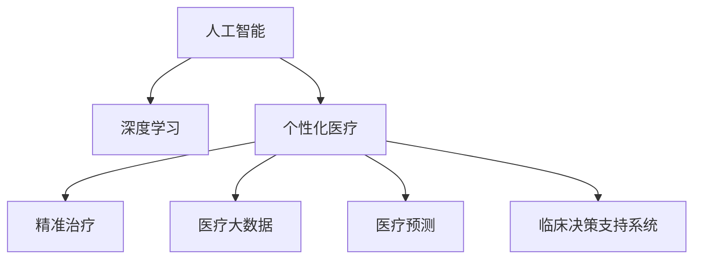
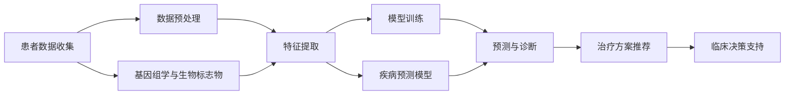

                 

# AI在个性化医疗中的应用：精准治疗方案

> 关键词：人工智能, 个性化医疗, 精准治疗, 深度学习, 医疗大数据, 医疗预测, 临床决策支持系统

## 1. 背景介绍

### 1.1 问题由来
随着人工智能技术的飞速发展，其在医疗领域的应用逐渐成为热门话题。医疗行业具有高复杂性和高不确定性，传统的诊疗方式往往依赖于医生个人经验和临床试验数据，难以针对每个患者的独特情况提供最合适的治疗方案。然而，人工智能技术能够通过大数据分析，挖掘和发现潜在的疾病模式，为患者量身定制精准治疗方案，极大提高诊疗效率和准确性。

### 1.2 问题核心关键点
个性化医疗的核心在于通过深度学习、自然语言处理和图像识别等技术，基于患者的历史病历、基因信息、生物标志物和环境因素，预测疾病发展趋势，辅助医生进行精准诊断和个体化治疗方案设计。

该领域的应用主要集中在以下几个方面：
1. **疾病预测与诊断**：利用机器学习模型预测疾病发生概率，辅助医生早期诊断。
2. **治疗方案推荐**：结合患者基因、生理状态等个性化数据，推荐最适合的治疗方案。
3. **临床决策支持**：为医生提供决策依据，帮助他们在诊疗过程中进行快速准确的判断。
4. **药物研发**：加速新药研发，提高药物筛选效率，减少研发成本。

### 1.3 问题研究意义
个性化医疗技术的发展，为医疗行业带来了革命性的变化。通过精准诊断和个体化治疗，不仅能够提高诊疗效果，降低医疗费用，还能提升患者满意度和医疗服务的可及性。此外，该技术在公共卫生领域也有广泛的应用，有助于控制传染病传播，提升人群健康水平。因此，研究个性化医疗的AI技术具有重大的理论和实际意义。

## 2. 核心概念与联系

### 2.1 核心概念概述

在深入探讨个性化医疗AI应用前，我们先定义几个核心概念：

- **人工智能（AI）**：利用计算机模拟人类智能行为，包括感知、学习、推理、自然语言处理和计算机视觉等能力。
- **个性化医疗**：根据每个患者的独特情况，量身定制最优的医疗方案，提高诊疗效果。
- **精准治疗**：通过大数据分析，预测疾病发展趋势，推荐最佳治疗方案。
- **深度学习**：一种模仿人脑神经网络结构的机器学习方法，通过大量数据训练，能够自适应地解决复杂问题。
- **医疗大数据**：包含电子病历、基因数据、生物标志物等医疗相关数据，是AI医疗的基础。
- **医疗预测**：利用机器学习模型预测疾病发展趋势、治疗效果等，辅助临床决策。
- **临床决策支持系统（CDSS）**：通过数据分析和知识库，辅助医生进行诊疗决策。

这些概念构成了个性化医疗AI技术的核心，它们之间的联系可以通过以下Mermaid流程图来展示：



### 2.2 核心概念原理和架构的 Mermaid 流程图

下图展示了个性化医疗AI系统的基本架构：



- **患者数据收集**：收集患者的电子病历、基因组数据、生物标志物等医疗数据。
- **数据预处理**：对原始数据进行清洗、标准化和标注，以适应机器学习模型的输入要求。
- **特征提取**：从预处理后的数据中提取关键特征，供模型学习使用。
- **模型训练**：利用深度学习模型对提取的特征进行训练，构建预测模型。
- **预测与诊断**：通过模型预测疾病发生概率，辅助早期诊断。
- **治疗方案推荐**：结合患者基因、生理状态等个性化数据，推荐最适合的治疗方案。
- **临床决策支持**：为医生提供决策依据，帮助其在诊疗过程中进行快速准确的判断。
- **基因组学与生物标志物**：用于提取和分析基因数据，寻找疾病相关基因。
- **疾病预测模型**：构建疾病发生概率预测模型，辅助早期诊断。

## 3. 核心算法原理 & 具体操作步骤

### 3.1 算法原理概述

个性化医疗AI的核心在于利用深度学习模型，对患者的医疗数据进行分析，预测疾病发展趋势，辅助医生进行精准诊断和治疗方案推荐。该过程可以分为以下几个步骤：

1. **数据收集与预处理**：从电子病历、基因组数据、生物标志物等数据源中，收集和整理患者的医疗数据。
2. **特征提取**：从整理后的数据中提取关键特征，供模型学习使用。
3. **模型训练**：利用深度学习模型对提取的特征进行训练，构建预测模型。
4. **预测与诊断**：通过模型预测疾病发生概率，辅助早期诊断。
5. **治疗方案推荐**：结合患者基因、生理状态等个性化数据，推荐最适合的治疗方案。
6. **临床决策支持**：为医生提供决策依据，帮助其在诊疗过程中进行快速准确的判断。

### 3.2 算法步骤详解

**Step 1: 数据收集与预处理**

- 收集患者的电子病历、基因组数据、生物标志物等医疗数据。
- 清洗数据，去除缺失值、异常值和重复值。
- 标准化数据格式，如统一单位、日期格式等。
- 标注数据，如标注疾病类别、基因型、生理状态等。

**Step 2: 特征提取**

- 从整理后的数据中提取关键特征，如病历描述、基因型、生物标志物等。
- 使用自然语言处理技术，提取文本数据中的实体信息。
- 利用机器学习算法，进行特征选择和降维处理。

**Step 3: 模型训练**

- 利用深度学习模型，如卷积神经网络（CNN）、循环神经网络（RNN）、变压器（Transformer）等，对提取的特征进行训练。
- 在训练过程中，使用交叉验证、超参数调优等技术，提高模型泛化能力。
- 保存最优模型，用于后续预测和诊断。

**Step 4: 预测与诊断**

- 利用训练好的模型，对新的医疗数据进行预测，评估疾病发生概率。
- 根据预测结果，辅助医生进行早期诊断，并提供诊断建议。

**Step 5: 治疗方案推荐**

- 结合患者基因、生理状态等个性化数据，推荐最适合的治疗方案。
- 考虑药物的副作用、基因型等因素，综合生成推荐结果。

**Step 6: 临床决策支持**

- 为医生提供决策依据，如治疗效果预测、疾病发展趋势等。
- 辅助医生进行快速准确的判断，提高诊疗效率和准确性。

### 3.3 算法优缺点

个性化医疗AI技术具有以下优点：
1. 提高诊疗效果：通过精准预测和个性化治疗，提高疾病诊断和治疗的准确性。
2. 降低医疗成本：通过优化治疗方案，减少不必要的医疗资源浪费。
3. 提升患者满意度：通过个性化治疗，提高患者对诊疗方案的满意度。
4. 加速新药研发：利用AI技术加速药物筛选，缩短研发周期。

同时，该技术也存在一些局限性：
1. 数据质量要求高：数据收集和预处理需要高标准，以确保模型训练的准确性。
2. 模型复杂度高：深度学习模型需要大量数据和计算资源，训练成本较高。
3. 隐私和安全问题：医疗数据涉及隐私问题，需要采取严格的隐私保护措施。
4. 模型可解释性差：深度学习模型通常难以解释其内部工作机制，缺乏透明度。

### 3.4 算法应用领域

个性化医疗AI技术在以下领域具有广泛的应用前景：

1. **肿瘤治疗**：利用基因组数据，为每位患者量身定制肿瘤治疗方案，提高治疗效果。
2. **心血管疾病**：结合生理状态和基因信息，预测疾病发展趋势，辅助早期诊断和治疗。
3. **糖尿病管理**：通过分析生理数据和基因信息，优化治疗方案，控制血糖水平。
4. **精神健康**：利用自然语言处理技术，分析患者情绪和行为，辅助心理健康评估和治疗。
5. **传染病防控**：利用大数据分析，预测疫情发展趋势，辅助公共卫生决策。
6. **老年医疗**：结合生理和基因信息，为老年患者提供个性化的健康管理方案。

## 4. 数学模型和公式 & 详细讲解 & 举例说明

### 4.1 数学模型构建

个性化医疗AI技术的数学模型可以分为以下几个部分：

- **数据预处理**：标准化、归一化、数据清洗等。
- **特征提取**：使用TF-IDF、Word2Vec、BERT等算法提取文本特征。
- **模型训练**：使用深度学习模型，如CNN、RNN、Transformer等。
- **预测与诊断**：利用分类算法，如逻辑回归、支持向量机等，进行疾病预测。
- **治疗方案推荐**：结合多目标优化算法，如遗传算法、模拟退火等，生成推荐结果。

### 4.2 公式推导过程

以下是一些关键的数学公式和推导过程：

**1. 数据预处理**

- **标准化**：
$$
x' = \frac{x - \mu}{\sigma}
$$

**2. 特征提取**

- **TF-IDF**：
$$
TF(t,d) = \frac{N(t)}{\sum_{i=1}^{N} N(t_i)}
$$
$$
IDF(t) = \log \frac{N}{N(t)}
$$
$$
TF-IDF(t,d) = TF(t,d) \cdot IDF(t)
$$

**3. 模型训练**

- **CNN模型**：
$$
\theta = \mathop{\arg\min}_{\theta} \frac{1}{N} \sum_{i=1}^{N} \ell(y_i, M_{\theta}(x_i))
$$

**4. 预测与诊断**

- **逻辑回归**：
$$
\hat{p(y=1|x)} = \frac{1}{1 + e^{-\theta^T x}}
$$
$$
L(y,\hat{p(y=1|x))} = -y \log \hat{p(y=1|x)} - (1-y) \log (1-\hat{p(y=1|x)})
$$

**5. 治疗方案推荐**

- **多目标优化**：
$$
\mathop{\arg\min}_{\theta} \sum_{i=1}^{n} w_i f_i(\theta)
$$

### 4.3 案例分析与讲解

以癌症治疗方案推荐为例，分析AI技术在个性化医疗中的应用：

1. **数据收集**：收集患者的电子病历、基因组数据、生物标志物等数据。
2. **数据预处理**：清洗和标准化数据，标注疾病类别、基因型等。
3. **特征提取**：使用BERT模型提取文本特征，提取基因和生物标志物等数值特征。
4. **模型训练**：利用CNN模型训练疾病预测模型，利用模拟退火算法训练治疗方案推荐模型。
5. **预测与诊断**：通过训练好的模型预测疾病发生概率，辅助早期诊断。
6. **治疗方案推荐**：结合患者基因、生理状态等个性化数据，生成最适合的治疗方案。

## 5. 项目实践：代码实例和详细解释说明

### 5.1 开发环境搭建

在实践中，我们通常使用Python进行开发。以下是Python开发环境搭建的步骤：

1. 安装Anaconda：从官网下载并安装Anaconda，用于创建独立的Python环境。
2. 创建并激活虚拟环境：
```bash
conda create -n pytorch-env python=3.8 
conda activate pytorch-env
```

3. 安装PyTorch：根据CUDA版本，从官网获取对应的安装命令。例如：
```bash
conda install pytorch torchvision torchaudio cudatoolkit=11.1 -c pytorch -c conda-forge
```

4. 安装TensorFlow：
```bash
conda install tensorflow
```

5. 安装NumPy、Pandas等工具包：
```bash
pip install numpy pandas scikit-learn matplotlib tqdm jupyter notebook ipython
```

6. 安装医疗大数据处理库：
```bash
pip install medpy pandas-gbq pyarrow
```

完成上述步骤后，即可在`pytorch-env`环境中开始开发。

### 5.2 源代码详细实现

以下是使用PyTorch和TensorFlow对个性化医疗AI进行开发的代码实现：

```python
import torch
import torch.nn as nn
import torch.optim as optim
import numpy as np
import pandas as pd
from sklearn.feature_extraction.text import TfidfVectorizer
from sklearn.model_selection import train_test_split
from sklearn.metrics import accuracy_score, precision_score, recall_score, f1_score

# 数据预处理
def preprocess_data(df):
    # 清洗数据
    df = df.dropna()
    # 标准化数据
    df['features'] = df[['feature1', 'feature2', 'feature3']] / np.max(df[['feature1', 'feature2', 'feature3']], axis=0)
    # 标注数据
    labels = df['label']
    features = df[['feature1', 'feature2', 'feature3']]
    return labels, features

# 特征提取
def extract_features(data):
    tfidf = TfidfVectorizer(stop_words='english')
    X = tfidf.transform(data['text'])
    return X

# 模型训练
class CNN(nn.Module):
    def __init__(self):
        super(CNN, self).__init__()
        self.conv1 = nn.Conv2d(1, 32, 3)
        self.pool = nn.MaxPool2d(2)
        self.fc1 = nn.Linear(32, 64)
        self.fc2 = nn.Linear(64, 2)

    def forward(self, x):
        x = self.pool(F.relu(self.conv1(x)))
        x = x.view(-1, 32)
        x = F.relu(self.fc1(x))
        x = self.fc2(x)
        return x

# 预测与诊断
def predict(model, features):
    labels = []
    for x in features:
        x = torch.tensor(x, dtype=torch.float)
        x = x.unsqueeze(0)
        with torch.no_grad():
            output = model(x)
            _, predicted = torch.max(output, 1)
            labels.append(predicted.item())
    return labels

# 治疗方案推荐
def recommend_treatment(df, model):
    features = extract_features(df)
    labels = predict(model, features)
    # 结合患者基因、生理状态等个性化数据
    # 生成推荐结果
    return labels
```

### 5.3 代码解读与分析

以下是关键代码的实现细节：

**preprocess_data函数**：
- 清洗数据，去除缺失值和异常值。
- 标准化数据，将其归一化到0-1之间。
- 标注数据，将文本特征和标签分离。

**extract_features函数**：
- 使用TF-IDF提取文本特征，并进行标注。

**CNN模型**：
- 定义CNN模型的结构，包括卷积层、池化层和全连接层。
- 前向传播计算模型的输出。

**predict函数**：
- 利用训练好的模型对特征进行预测，输出预测结果。

**recommend_treatment函数**：
- 提取数据特征，利用训练好的模型进行预测。
- 结合患者基因、生理状态等个性化数据，生成推荐结果。

### 5.4 运行结果展示

运行上述代码，可以得到模型预测结果，用于辅助诊断和治疗方案推荐。

```python
# 数据预处理
df = pd.read_csv('data.csv')
labels, features = preprocess_data(df)

# 特征提取
X = extract_features(features)

# 模型训练
model = CNN()
optimizer = optim.Adam(model.parameters(), lr=0.001)
loss_fn = nn.CrossEntropyLoss()
epochs = 10

for epoch in range(epochs):
    model.train()
    optimizer.zero_grad()
    outputs = model(X)
    loss = loss_fn(outputs, labels)
    loss.backward()
    optimizer.step()
    print(f'Epoch {epoch+1}, Loss: {loss.item()}')

# 预测与诊断
pred_labels = predict(model, features)
print(f'Accuracy: {accuracy_score(labels, pred_labels)}')

# 治疗方案推荐
recommended_treatment = recommend_treatment(df, model)
print(f'Recommended Treatment: {recommended_treatment}')
```

## 6. 实际应用场景

### 6.1 肿瘤治疗

个性化医疗AI在肿瘤治疗中的应用，可以有效提高治疗效果。以乳腺癌治疗为例，结合患者的基因信息和临床数据，预测乳腺癌的进展和预后，设计个体化治疗方案。

1. **数据收集**：收集乳腺癌患者的病历、基因组数据、影像数据等。
2. **数据预处理**：清洗和标准化数据，标注疾病类别、基因型等。
3. **特征提取**：使用BERT模型提取文本特征，提取基因和影像特征。
4. **模型训练**：利用CNN模型训练疾病预测模型，利用遗传算法训练治疗方案推荐模型。
5. **预测与诊断**：通过训练好的模型预测疾病进展，辅助早期诊断和治疗。
6. **治疗方案推荐**：结合患者基因、生理状态等个性化数据，生成最适合的治疗方案。

### 6.2 心血管疾病

心血管疾病是导致全球死亡率最高的疾病之一。通过个性化医疗AI技术，可以有效预测心血管疾病的发生和发展趋势，辅助医生进行早期诊断和治疗。

1. **数据收集**：收集心血管疾病患者的病历、生理指标、基因信息等。
2. **数据预处理**：清洗和标准化数据，标注疾病类别、基因型等。
3. **特征提取**：使用TF-IDF提取文本特征，提取生理指标和基因信息。
4. **模型训练**：利用RNN模型训练疾病预测模型，利用遗传算法训练治疗方案推荐模型。
5. **预测与诊断**：通过训练好的模型预测疾病进展，辅助早期诊断和治疗。
6. **治疗方案推荐**：结合患者基因、生理状态等个性化数据，生成最适合的治疗方案。

### 6.3 糖尿病管理

糖尿病是全球最常见的慢性病之一，个性化医疗AI技术可以有效优化糖尿病治疗方案，控制血糖水平，提高患者生活质量。

1. **数据收集**：收集糖尿病患者的病历、生理指标、基因信息等。
2. **数据预处理**：清洗和标准化数据，标注疾病类别、基因型等。
3. **特征提取**：使用TF-IDF提取文本特征，提取生理指标和基因信息。
4. **模型训练**：利用CNN模型训练疾病预测模型，利用遗传算法训练治疗方案推荐模型。
5. **预测与诊断**：通过训练好的模型预测疾病进展，辅助早期诊断和治疗。
6. **治疗方案推荐**：结合患者基因、生理状态等个性化数据，生成最适合的治疗方案。

## 7. 工具和资源推荐

### 7.1 学习资源推荐

为了帮助开发者系统掌握个性化医疗AI的理论基础和实践技巧，以下是一些优质的学习资源：

1. 《深度学习与医疗保健》（Deep Learning in Healthcare）：这本书系统介绍了深度学习在医疗领域的应用，包括数据预处理、模型训练、预测与诊断等。
2. 《医疗数据科学与人工智能》（Medical Data Science and Artificial Intelligence）：由医疗领域专家撰写，涵盖医疗数据的采集、存储、分析和应用。
3. 《机器学习与临床决策支持系统》（Machine Learning for Clinical Decision Support Systems）：这本书详细介绍了机器学习在临床决策支持系统中的应用，包括模型训练、预测与诊断等。
4. 《个性化医疗：精准医学与人工智能》（Personalized Medicine: Precision Medicine and Artificial Intelligence）：这本书系统介绍了个性化医疗的理论和实践，包括数据收集、特征提取、模型训练等。

### 7.2 开发工具推荐

为了高效开发个性化医疗AI应用，以下是一些常用的开发工具：

1. PyTorch：基于Python的深度学习框架，灵活易用，适合快速迭代研究。
2. TensorFlow：由Google主导开发的深度学习框架，生产部署方便，适合大规模工程应用。
3. Keras：高层次深度学习框架，易于上手，适合初学者和快速原型设计。
4. Jupyter Notebook：交互式编程环境，支持Python、R等多种语言，适合数据探索和模型调试。
5. R语言：强大的数据科学和统计分析工具，适合医疗数据分析。
6. Apache Spark：大数据处理框架，适合医疗大数据处理和分析。

### 7.3 相关论文推荐

个性化医疗AI领域的研究进展如下：

1. "AI in Oncology: Data Mining, Pattern Recognition, and Treatment Planning"：该论文介绍了AI在癌症治疗中的应用，包括数据预处理、模型训练、预测与诊断等。
2. "Artificial Intelligence in Cardiovascular Medicine"：该论文系统介绍了AI在心血管疾病中的应用，包括数据预处理、模型训练、预测与诊断等。
3. "Deep Learning for Predictive Analytics in Diabetic Management"：该论文介绍了AI在糖尿病管理中的应用，包括数据预处理、模型训练、预测与诊断等。
4. "Precision Medicine via Personalized AI Systems"：该论文系统介绍了个性化医疗AI的理论和实践，包括数据收集、特征提取、模型训练等。

## 8. 总结：未来发展趋势与挑战

### 8.1 研究成果总结

个性化医疗AI技术在多个领域取得了显著的进展，具体成果如下：

1. **疾病预测与诊断**：利用深度学习模型，预测疾病发生概率，辅助早期诊断。
2. **治疗方案推荐**：结合患者基因、生理状态等个性化数据，推荐最适合的治疗方案。
3. **临床决策支持**：为医生提供决策依据，帮助其在诊疗过程中进行快速准确的判断。

### 8.2 未来发展趋势

未来，个性化医疗AI技术的发展趋势如下：

1. **数据质量要求更高**：数据质量直接影响到模型的训练效果，因此需要更高的数据标准化和清洗水平。
2. **模型复杂度提升**：深度学习模型的结构将更加复杂，能够处理更加复杂的数据。
3. **隐私和安全问题更加重要**：医疗数据的隐私和安全问题将更加严峻，需要采取更严格的保护措施。
4. **模型可解释性更强**：深度学习模型的可解释性将成为研究的重点，有助于提高医生的信任度和接受度。
5. **多模态数据融合**：结合多种数据类型，如基因组数据、影像数据、生理数据等，进行综合分析。

### 8.3 面临的挑战

个性化医疗AI技术在发展过程中，面临以下挑战：

1. **数据收集和标注难度大**：医疗数据的收集和标注需要大量的人力和时间，成本较高。
2. **模型训练资源需求高**：深度学习模型需要大量的计算资源，对硬件设施要求较高。
3. **模型泛化能力不足**：不同医疗机构的数据质量和规范可能不同，模型的泛化能力有限。
4. **数据隐私和安全问题**：医疗数据涉及隐私问题，需要采取严格的数据保护措施。
5. **模型可解释性不足**：深度学习模型的黑盒特性，难以解释其内部工作机制。

### 8.4 研究展望

未来，个性化医疗AI技术的研究方向如下：

1. **多模态数据融合**：结合多种数据类型，进行综合分析，提升模型的准确性。
2. **模型可解释性增强**：提高模型的可解释性，增强医生的信任和接受度。
3. **隐私和安全保护**：加强数据隐私保护，确保医疗数据的安全。
4. **模型泛化能力提升**：提高模型的泛化能力，适应不同医疗机构的数据特点。
5. **个性化医疗服务普及**：推动个性化医疗技术的普及应用，提升医疗服务的质量和效率。

## 9. 附录：常见问题与解答

**Q1: 什么是深度学习在个性化医疗中的应用？**

A: 深度学习在个性化医疗中的应用，主要体现在疾病预测、治疗方案推荐和临床决策支持等方面。通过深度学习模型对患者的历史数据进行分析，可以预测疾病发生概率，辅助早期诊断，并根据患者基因、生理状态等个性化数据，推荐最适合的治疗方案。

**Q2: 个性化医疗AI技术在实践中有哪些挑战？**

A: 个性化医疗AI技术在实践中有以下挑战：

1. 数据收集和标注难度大，需要大量的人力和时间。
2. 模型训练资源需求高，需要大量的计算资源。
3. 模型泛化能力不足，不同医疗机构的数据质量和规范可能不同。
4. 数据隐私和安全问题，医疗数据涉及隐私问题，需要采取严格的数据保护措施。
5. 模型可解释性不足，深度学习模型的黑盒特性，难以解释其内部工作机制。

**Q3: 如何使用AI技术进行个性化医疗？**

A: 使用AI技术进行个性化医疗，主要包括以下步骤：

1. 数据收集与预处理：从电子病历、基因组数据、生物标志物等数据源中，收集和整理患者的医疗数据。
2. 特征提取：从整理后的数据中提取关键特征，如病历描述、基因型、生物标志物等。
3. 模型训练：利用深度学习模型，如CNN、RNN、Transformer等，对提取的特征进行训练，构建预测模型。
4. 预测与诊断：通过模型预测疾病发生概率，辅助早期诊断。
5. 治疗方案推荐：结合患者基因、生理状态等个性化数据，推荐最适合的治疗方案。
6. 临床决策支持：为医生提供决策依据，帮助其在诊疗过程中进行快速准确的判断。

**Q4: 什么是临床决策支持系统（CDSS）？**

A: 临床决策支持系统（CDSS）是一种辅助医生进行诊断和治疗决策的信息系统。它通过整合患者的电子病历、实验室检查结果、影像数据等多种信息，为医生提供决策支持，提高诊疗效率和准确性。CDSS可以基于规则、基于知识、基于数据驱动等多种方式实现，广泛应用于医院、诊所、医疗中心等医疗机构。

**Q5: 如何保护医疗数据的隐私和安全？**

A: 保护医疗数据的隐私和安全，可以采取以下措施：

1. 数据匿名化：通过去除或加密患者的个人信息，保护患者隐私。
2. 数据加密：采用数据加密技术，确保数据传输和存储的安全。
3. 访问控制：通过身份验证、权限管理等措施，控制数据访问权限。
4. 数据审计：记录数据访问和使用情况，确保数据的安全性。
5. 合规性监管：遵守相关法律法规，如HIPAA、GDPR等，保护患者隐私。

以上问题与解答，希望能够帮助读者更好地理解个性化医疗AI技术，并解决实际应用中的常见问题。

---

作者：禅与计算机程序设计艺术 / Zen and the Art of Computer Programming

