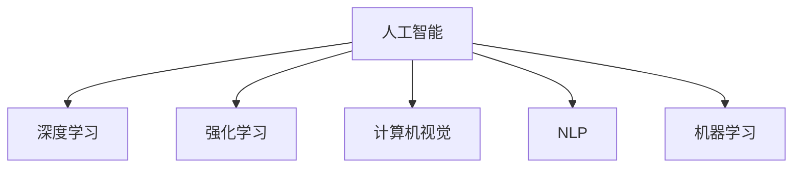

                 

# AI在复杂问题处理中的优势

> 关键词：人工智能,复杂问题,深度学习,强化学习,计算机视觉,自然语言处理,机器学习

## 1. 背景介绍

### 1.1 问题由来
随着信息技术的高速发展，人类面临的问题日益复杂多样。从自动驾驶、医疗诊断、金融风控到智能制造、环境监测，无数场景下问题的解决都需要依靠先进的智能算法。然而，传统基于规则或经验的方法往往难以应对复杂的非结构化数据和动态环境，而人工智能（AI）技术凭借其强大的数据处理和推理能力，逐渐成为解决复杂问题的重要手段。

### 1.2 问题核心关键点
AI在复杂问题处理中的优势主要体现在以下几个方面：
- **数据处理能力**：AI能够高效处理海量非结构化数据，从中提取有价值的特征和模式。
- **鲁棒性**：通过学习从海量数据中提取的模型，AI系统能够在不同场景下保持稳定表现。
- **适应性**：AI系统能够根据新数据和新环境灵活调整模型参数，适应变化。
- **可解释性**：尽管AI系统表现强大，但仍需具备一定的可解释性，以便人类理解和监督。

### 1.3 问题研究意义
AI技术在复杂问题处理中的应用，对于提升决策质量、优化资源配置、推动产业升级具有重要意义：

1. **决策支持**：通过数据驱动的智能算法，AI能够提供更精准、可靠的决策建议。
2. **资源优化**：在能源管理、交通调度等领域，AI技术能够有效优化资源配置，提升系统效率。
3. **创新驱动**：AI技术能够为科学研究、艺术创作等领域带来新的创意和突破。
4. **普惠服务**：AI技术能够提供普惠性的智能服务，如医疗诊断、教育辅助等，促进社会公平。
5. **安全保障**：在网络安全、公共安全等领域，AI技术能够识别和防范潜在的威胁。

## 2. 核心概念与联系

### 2.1 核心概念概述

为更好地理解AI在复杂问题处理中的优势，本节将介绍几个关键概念：

- **人工智能(AI)**：利用算法和模型，模拟人类智能行为的计算系统，能够在多领域实现决策、推理、识别等功能。
- **深度学习(Deep Learning)**：一种基于神经网络的机器学习技术，通过多层次非线性变换学习数据特征。
- **强化学习(Reinforcement Learning)**：通过与环境互动，优化决策策略以最大化奖励的机器学习范式。
- **计算机视觉(Computer Vision)**：利用计算机技术处理、分析和理解图像和视频信息的科学。
- **自然语言处理(Natural Language Processing, NLP)**：研究如何让计算机理解和处理人类语言的技术。
- **机器学习(Machine Learning)**：赋予计算机自动学习和改进能力的技术，是AI的核心组成部分。

这些核心概念之间的逻辑关系可以通过以下Mermaid流程图来展示：



这个流程图展示了AI所涉及的主要技术和应用方向：

1. **深度学习**：AI的核心，利用神经网络处理高维数据。
2. **强化学习**：AI的另一个重要分支，通过互动优化策略。
3. **计算机视觉**：处理和理解视觉信息，是AI的一个重要应用方向。
4. **自然语言处理**：理解和生成人类语言，是AI的另一重要应用方向。
5. **机器学习**：是AI的基础，赋予模型学习和改进能力。

这些概念共同构成了AI的完整框架，使其能够在各种复杂问题中发挥强大作用。

## 3. 核心算法原理 & 具体操作步骤

### 3.1 算法原理概述

AI在复杂问题处理中，通常采用深度学习、强化学习等算法进行模型训练。这些算法通过大量数据训练，学习出复杂的模式和规则，用于解决特定问题。其核心思想是：通过机器学习，模型能够从数据中学习规律，并通过特定的算法优化模型参数，从而解决复杂问题。

### 3.2 算法步骤详解

#### 3.2.1 数据准备
AI模型训练的第一步是数据准备。数据可以是结构化数据（如表格、数据库），也可以是非结构化数据（如文本、图像）。对于非结构化数据，通常需要预先处理成模型可以接受的格式，如提取特征、进行编码等。

#### 3.2.2 模型设计
根据问题类型，选择合适的模型架构。对于图像识别问题，可以使用卷积神经网络（CNN）；对于自然语言处理问题，可以使用循环神经网络（RNN）或Transformer等。

#### 3.2.3 模型训练
模型训练过程中，将数据划分为训练集、验证集和测试集，使用训练集对模型进行迭代训练，调整模型参数，以最小化损失函数。在训练过程中，通常会使用正则化技术（如L2正则化、Dropout）防止过拟合，并使用验证集监控模型性能。

#### 3.2.4 模型评估
训练完成后，使用测试集评估模型性能，计算准确率、召回率、F1分数等指标。根据评估结果，可以选择继续调整模型参数，或使用优化后的模型进行实际应用。

#### 3.2.5 模型部署
将训练好的模型部署到实际应用中，可以是API接口、移动应用、嵌入式系统等。

### 3.3 算法优缺点

AI在复杂问题处理中的优势包括：

1. **高效率**：能够处理大量数据，并从中找到规律，进行快速决策。
2. **自适应**：根据新数据和新环境调整模型，适应变化。
3. **创新性**：通过学习大量的数据，能够发现新的模式和规律，推动技术创新。
4. **普适性**：能够应用于多个领域，解决复杂问题。

同时，AI也存在一些缺点：

1. **高成本**：数据准备、模型训练和部署需要大量计算资源。
2. **依赖数据**：模型的效果高度依赖于数据质量，数据偏差可能导致错误决策。
3. **可解释性**：部分模型（如深度学习）的决策过程难以解释，缺乏透明性。
4. **鲁棒性**：面对复杂的场景和变化的环境，模型可能出现不稳定的表现。

### 3.4 算法应用领域

AI在多个领域中得到了广泛应用，以下是几个典型应用场景：

- **自动驾驶**：通过计算机视觉和深度学习技术，自动驾驶系统能够识别道路、行人、车辆等，并做出安全驾驶决策。
- **医疗诊断**：利用图像处理和深度学习技术，AI系统能够辅助医生进行病灶识别、病理分析等工作。
- **金融风控**：通过数据分析和强化学习技术，AI系统能够识别潜在风险，进行精准的信用评估和风险管理。
- **智能制造**：利用机器学习和计算机视觉技术，AI系统能够优化生产流程，提高生产效率和质量。
- **环境保护**：通过数据挖掘和深度学习技术，AI系统能够分析环境数据，进行污染监测和治理。

## 4. 数学模型和公式 & 详细讲解 & 举例说明

### 4.1 数学模型构建

本节将使用数学语言对AI在复杂问题处理中的核心算法进行详细解释。

以**图像识别**为例，假设我们有$m$个训练样本$x_1, x_2, ..., x_m$和对应的标签$y_1, y_2, ..., y_m$。我们的目标是通过训练一个深度神经网络$N(x;w)$，将输入的图像$x$映射到标签$y$。

模型的参数$w$通过最小化损失函数$\mathcal{L}(N)$进行优化，损失函数通常选择交叉熵损失函数：

$$
\mathcal{L}(N) = -\frac{1}{m} \sum_{i=1}^m \log(N(x_i;w))
$$

其中，$N(x;w)$为模型在输入$x$下的输出，通常是一个概率分布。

### 4.2 公式推导过程

#### 4.2.1 交叉熵损失函数
交叉熵损失函数是深度学习中常用的损失函数，用于衡量预测值和真实标签之间的差异。设模型在输入$x_i$下的输出为$\hat{y}_i = N(x_i;w)$，真实标签为$y_i$，则交叉熵损失函数定义为：

$$
\mathcal{L}(N) = -\frac{1}{m} \sum_{i=1}^m y_i \log(\hat{y}_i) + (1-y_i) \log(1-\hat{y}_i)
$$

将其展开得到：

$$
\mathcal{L}(N) = -\frac{1}{m} \sum_{i=1}^m (y_i \log(\hat{y}_i) + (1-y_i) \log(1-\hat{y}_i))
$$

通过反向传播算法，可以计算出模型参数$w$的梯度，进而进行优化。

#### 4.2.2 梯度下降算法
梯度下降算法是深度学习中最常用的优化算法之一。其基本思想是：通过计算损失函数对模型参数的梯度，沿着梯度的反方向更新参数，使损失函数逐渐减小。假设模型参数$w$的梯度为$\nabla_w \mathcal{L}(N)$，则梯度下降算法的更新公式为：

$$
w_{t+1} = w_t - \eta \nabla_w \mathcal{L}(N)
$$

其中，$\eta$为学习率，控制每次参数更新的步长。

### 4.3 案例分析与讲解

#### 4.3.1 图像分类
假设我们使用卷积神经网络（CNN）进行图像分类任务。网络结构如下：

```
Input layer -> Convolutional layer -> ReLU -> Pooling layer -> Convolutional layer -> ReLU -> Pooling layer -> Fully connected layer -> Softmax layer
```

其中，输入层为$28 \times 28$的灰度图像，卷积层和池化层用于提取图像特征，全连接层和Softmax层用于分类。

假设我们有一个包含$mnist$数据集的训练集，每个样本为$28 \times 28$的灰度图像和对应的数字标签。通过反向传播算法，我们不断调整卷积层和全连接层的权重，使得模型能够准确识别手写数字。

#### 4.3.2 文本分类
假设我们使用循环神经网络（RNN）进行文本分类任务。网络结构如下：

```
Input layer -> LSTM layer -> Fully connected layer -> Softmax layer
```

其中，输入层为文本的词向量表示，LSTM层用于处理文本序列，全连接层和Softmax层用于分类。

假设我们有一个包含IMDB电影评论的数据集，每个样本为电影评论文本和对应的情感标签。通过反向传播算法，我们不断调整LSTM层和全连接层的权重，使得模型能够准确识别电影评论的情感倾向。

## 5. 项目实践：代码实例和详细解释说明

### 5.1 开发环境搭建

在进行AI项目实践前，我们需要准备好开发环境。以下是使用Python进行TensorFlow开发的环境配置流程：

1. 安装Anaconda：从官网下载并安装Anaconda，用于创建独立的Python环境。

2. 创建并激活虚拟环境：
```bash
conda create -n tf-env python=3.8 
conda activate tf-env
```

3. 安装TensorFlow：根据CUDA版本，从官网获取对应的安装命令。例如：
```bash
pip install tensorflow
```

4. 安装各类工具包：
```bash
pip install numpy pandas scikit-learn matplotlib tqdm jupyter notebook ipython
```

完成上述步骤后，即可在`tf-env`环境中开始AI项目实践。

### 5.2 源代码详细实现

下面我们以图像识别任务为例，给出使用TensorFlow进行卷积神经网络（CNN）训练的Python代码实现。

首先，定义图像数据处理函数：

```python
import tensorflow as tf
from tensorflow.keras.datasets import mnist
from tensorflow.keras.models import Sequential
from tensorflow.keras.layers import Conv2D, MaxPooling2D, Flatten, Dense, Dropout

def load_data():
    (x_train, y_train), (x_test, y_test) = mnist.load_data()
    x_train = x_train.reshape((x_train.shape[0], 28, 28, 1))
    x_test = x_test.reshape((x_test.shape[0], 28, 28, 1))
    x_train = x_train.astype('float32') / 255
    x_test = x_test.astype('float32') / 255
    y_train = tf.keras.utils.to_categorical(y_train, 10)
    y_test = tf.keras.utils.to_categorical(y_test, 10)
    return (x_train, y_train), (x_test, y_test)

(x_train, y_train), (x_test, y_test) = load_data()

model = Sequential()
model.add(Conv2D(32, kernel_size=(3, 3), activation='relu', input_shape=(28, 28, 1)))
model.add(MaxPooling2D(pool_size=(2, 2)))
model.add(Conv2D(64, kernel_size=(3, 3), activation='relu'))
model.add(MaxPooling2D(pool_size=(2, 2)))
model.add(Flatten())
model.add(Dense(128, activation='relu'))
model.add(Dropout(0.5))
model.add(Dense(10, activation='softmax'))

model.compile(loss='categorical_crossentropy', optimizer='adam', metrics=['accuracy'])
model.summary()
```

然后，定义训练和评估函数：

```python
def train(model, x_train, y_train, epochs=10, batch_size=128):
    model.fit(x_train, y_train, epochs=epochs, batch_size=batch_size, validation_data=(x_test, y_test))

def evaluate(model, x_test, y_test):
    _, accuracy = model.evaluate(x_test, y_test)
    print('Test accuracy:', accuracy)
```

最后，启动训练流程并在测试集上评估：

```python
train(model, x_train, y_train)
evaluate(model, x_test, y_test)
```

以上就是使用TensorFlow进行图像分类任务训练的完整代码实现。可以看到，TensorFlow提供了丰富的API和模型组件，使得模型构建和训练过程变得非常直观和高效。

### 5.3 代码解读与分析

让我们再详细解读一下关键代码的实现细节：

**load_data函数**：
- 从TensorFlow内置数据集加载函数中获取MNIST数据集。
- 对图像数据进行预处理，包括reshape、归一化、one-hot编码等。
- 返回处理后的训练集和测试集。

**Sequential模型**：
- 定义了卷积层、池化层、全连接层和Dropout层，用于构建CNN模型。
- 使用`compile`方法设置模型的损失函数、优化器和评估指标。
- 使用`summary`方法输出模型结构和参数信息。

**train函数**：
- 使用`fit`方法对模型进行训练，指定训练轮数、批次大小和验证集。
- 在每个epoch结束时，自动评估模型在测试集上的性能。

**evaluate函数**：
- 使用`evaluate`方法评估模型在测试集上的准确率。
- 打印测试集上的准确率。

## 6. 实际应用场景

### 6.1 智能医疗
智能医疗是AI应用的一个重要方向，通过深度学习技术，AI系统能够辅助医生进行疾病诊断、治疗方案制定等工作。例如，利用卷积神经网络（CNN）对医学影像进行分析和诊断，使用循环神经网络（RNN）对电子病历进行分析和预测。

#### 6.1.1 医学影像识别
假设我们有一张X光片，需要判断是否存在骨折。通过深度学习技术，我们训练一个CNN模型，将X光片输入模型，输出一个概率分布，表示骨折的概率。模型的输入为$28 \times 28$的灰度图像，输出为两个类别（骨折或不骨折）的概率。通过调整模型参数，使得模型能够准确识别骨折情况。

#### 6.1.2 电子病历分析
假设我们有一份电子病历，包含患者的症状、检查结果、诊断等信息。通过自然语言处理技术，我们训练一个RNN模型，将电子病历文本输入模型，输出一个概率分布，表示患者的诊断结果。模型的输入为文本序列，输出为多个可能的诊断结果的概率。通过调整模型参数，使得模型能够准确识别患者的诊断结果。

### 6.2 智能制造
智能制造是工业4.0的重要方向，通过机器学习和计算机视觉技术，AI系统能够优化生产流程，提高生产效率和质量。例如，利用深度学习技术对生产数据进行分析，预测设备故障，优化生产计划，提高生产线的稳定性和可靠性。

#### 6.2.1 设备故障预测
假设我们有一个生产线，需要预测设备是否发生故障。通过深度学习技术，我们训练一个CNN模型，将设备传感器数据输入模型，输出一个概率分布，表示设备是否发生故障。模型的输入为时间序列数据，输出为两个类别（故障或正常）的概率。通过调整模型参数，使得模型能够准确预测设备的故障情况。

#### 6.2.2 生产计划优化
假设我们有一个生产线，需要优化生产计划，提高生产效率。通过机器学习技术，我们训练一个回归模型，将生产数据输入模型，输出一个预测的生产计划。模型的输入为历史生产数据，输出为下一个生产计划的时间、数量等参数。通过调整模型参数，使得模型能够准确预测和优化生产计划。

### 6.3 智能交通
智能交通是AI应用的另一个重要方向，通过深度学习技术，AI系统能够优化交通流量，提高道路通行效率。例如，利用卷积神经网络（CNN）对交通视频进行分析，识别和预测交通情况，使用强化学习技术对交通信号灯进行控制和优化。

#### 6.3.1 交通视频分析
假设我们有一段交通视频，需要识别和预测交通情况。通过深度学习技术，我们训练一个CNN模型，将交通视频输入模型，输出一个概率分布，表示不同交通情况（如拥堵、通行、事故等）的概率。模型的输入为视频帧序列，输出为多个交通情况的概率。通过调整模型参数，使得模型能够准确识别和预测交通情况。

#### 6.3.2 交通信号控制
假设我们有一个交通信号灯系统，需要优化交通信号灯的控制。通过强化学习技术，我们训练一个智能控制模型，将交通数据输入模型，输出一个信号灯的控制策略。模型的输入为交通流量、车辆速度等参数，输出为信号灯的控制状态（绿灯、黄灯、红灯等）。通过调整模型参数，使得模型能够智能控制交通信号灯，提高道路通行效率。

## 7. 工具和资源推荐

### 7.1 学习资源推荐

为了帮助开发者系统掌握AI在复杂问题处理中的应用，这里推荐一些优质的学习资源：

1. **《深度学习》**：Ian Goodfellow所著，全面介绍了深度学习的基本概念和算法，是学习AI的必读书籍之一。

2. **CS231n《卷积神经网络》**：斯坦福大学开设的计算机视觉课程，涵盖卷积神经网络的理论和实践，是学习计算机视觉的重要资源。

3. **CS224n《自然语言处理》**：斯坦福大学开设的NLP课程，涵盖了自然语言处理的基本概念和算法，是学习NLP的重要资源。

4. **《Python机器学习》**：Sebastian Raschka所著，介绍了Python在机器学习中的应用，适合入门学习和实践。

5. **Kaggle平台**：全球最大的数据科学竞赛平台，提供丰富的数据集和竞赛项目，是学习AI应用的好地方。

通过对这些资源的学习实践，相信你一定能够快速掌握AI在复杂问题处理中的应用，并用于解决实际的AI问题。

### 7.2 开发工具推荐

高效的开发离不开优秀的工具支持。以下是几款用于AI开发的常用工具：

1. **PyTorch**：基于Python的开源深度学习框架，灵活动态的计算图，适合快速迭代研究。

2. **TensorFlow**：由Google主导开发的开源深度学习框架，生产部署方便，适合大规模工程应用。

3. **Jupyter Notebook**：免费的交互式计算环境，支持多种编程语言，是AI研究的重要工具。

4. **GitHub**：全球最大的代码托管平台，提供丰富的开源项目和协作工具，是AI研究和开发的理想平台。

5. **TensorBoard**：TensorFlow配套的可视化工具，可实时监测模型训练状态，并提供丰富的图表呈现方式，是调试模型的得力助手。

合理利用这些工具，可以显著提升AI项目开发的效率，加快创新迭代的步伐。

### 7.3 相关论文推荐

AI在复杂问题处理中的应用源于学界的持续研究。以下是几篇奠基性的相关论文，推荐阅读：

1. **《ImageNet Classification with Deep Convolutional Neural Networks》**：AlexNet论文，首次展示了深度卷积神经网络在图像分类任务中的强大能力。

2. **《Attention is All You Need》**：Transformer论文，提出了Transformer模型，开启了NLP领域的预训练大模型时代。

3. **《Deep Residual Learning for Image Recognition》**：ResNet论文，提出了残差网络，解决了深度神经网络训练中的梯度消失问题。

4. **《Training Recurrent Neural Networks by Prediction》**：RNN论文，提出了循环神经网络，用于处理序列数据。

5. **《Building End-to-End Object Detectors with Region Proposal Networks》**：R-CNN论文，提出了区域建议网络，用于图像目标检测。

这些论文代表了大AI在复杂问题处理中的发展脉络。通过学习这些前沿成果，可以帮助研究者把握学科前进方向，激发更多的创新灵感。

## 8. 总结：未来发展趋势与挑战

### 8.1 总结

本文对AI在复杂问题处理中的应用进行了全面系统的介绍。首先阐述了AI在复杂问题处理中的优势，明确了其在数据处理、自适应、普适性等方面的独特价值。其次，从原理到实践，详细讲解了深度学习、强化学习等核心算法的数学原理和操作步骤，给出了AI项目开发的完整代码实例。同时，本文还广泛探讨了AI在医疗、制造、交通等多个领域的应用前景，展示了AI技术的广阔前景。

通过本文的系统梳理，可以看到，AI技术在复杂问题处理中的强大能力，正在推动各行各业的智能化升级。未来的研究需要在数据、算法、工程、业务等多个维度协同发力，共同推动AI技术的进一步发展。

### 8.2 未来发展趋势

展望未来，AI在复杂问题处理中的发展趋势如下：

1. **模型规模增大**：随着算力成本的下降和数据规模的扩张，AI模型的参数量还将持续增长。超大规模模型蕴含的丰富知识，有望支撑更加复杂多变的任务处理。

2. **技术融合深入**：AI技术与计算机视觉、自然语言处理等领域的深度融合，将推动跨模态智能系统的发展。

3. **模型优化加速**：模型压缩、剪枝、量化等技术将进一步提升AI模型的推理速度和资源效率，降低硬件成本。

4. **数据治理加强**：数据隐私保护、数据治理等技术将推动AI模型的合规应用。

5. **人机协同增强**：AI系统将与人类专家协同工作，提升决策的可靠性和可解释性。

6. **多模态智能发展**：多模态智能系统将融合视觉、语音、文本等多种信息源，提升系统的综合理解和处理能力。

以上趋势凸显了AI技术在复杂问题处理中的巨大潜力，未来的研究需要从多维度进行突破，才能更好地应对复杂多变的现实世界问题。

### 8.3 面临的挑战

尽管AI在复杂问题处理中已经取得了瞩目成就，但在迈向更加智能化、普适化应用的过程中，它仍面临着诸多挑战：

1. **数据获取困难**：高质量标注数据的获取和处理成本高昂，尤其是在复杂领域和长尾场景下。

2. **模型复杂度高**：超大规模模型的训练和推理需要高计算资源，且容易受到硬件限制。

3. **模型解释性不足**：部分模型（如深度学习）的决策过程难以解释，缺乏透明性。

4. **模型鲁棒性不足**：面对复杂的场景和变化的环境，模型可能出现不稳定的表现。

5. **数据隐私问题**：数据隐私保护和治理成为AI应用的重要挑战，尤其是在涉及敏感信息的应用中。

6. **技术规范缺失**：AI技术的标准化和规范制定尚未成熟，可能导致系统的不稳定和不可控。

这些挑战需要各界共同努力，通过技术创新和政策规范，推动AI技术向更加成熟和可靠的阶段发展。

### 8.4 研究展望

面对AI在复杂问题处理中面临的挑战，未来的研究需要在以下几个方面寻求新的突破：

1. **数据增强技术**：开发更加高效的数据增强方法，减少对标注数据的依赖，提高数据利用率。

2. **模型压缩技术**：开发更加高效的模型压缩技术，降低计算成本，提高系统效率。

3. **可解释性研究**：开发更加可解释的AI模型，增强系统的透明性和可信度。

4. **鲁棒性提升**：开发更加鲁棒的AI模型，提升系统在复杂环境下的稳定性和泛化能力。

5. **隐私保护技术**：开发更加隐私保护的技术，确保数据安全和用户隐私。

6. **标准化规范**：推动AI技术的标准化和规范制定，提升系统的稳定性和可控性。

这些研究方向的探索，必将引领AI技术迈向更高的台阶，为构建安全、可靠、可解释、可控的智能系统铺平道路。面向未来，AI技术还需要与其他人工智能技术进行更深入的融合，如知识表示、因果推理、强化学习等，多路径协同发力，共同推动AI技术的进步。

## 9. 附录：常见问题与解答

**Q1：AI技术在复杂问题处理中面临哪些挑战？**

A: AI技术在复杂问题处理中面临的挑战包括：

1. **数据获取困难**：高质量标注数据的获取和处理成本高昂，尤其是在复杂领域和长尾场景下。
2. **模型复杂度高**：超大规模模型的训练和推理需要高计算资源，且容易受到硬件限制。
3. **模型解释性不足**：部分模型（如深度学习）的决策过程难以解释，缺乏透明性。
4. **模型鲁棒性不足**：面对复杂的场景和变化的环境，模型可能出现不稳定的表现。
5. **数据隐私问题**：数据隐私保护和治理成为AI应用的重要挑战，尤其是在涉及敏感信息的应用中。
6. **技术规范缺失**：AI技术的标准化和规范制定尚未成熟，可能导致系统的不稳定和不可控。

**Q2：如何提高AI模型的可解释性？**

A: 提高AI模型的可解释性可以从以下几个方面入手：

1. **模型可视化**：使用可视化工具，如TensorBoard，展示模型的训练过程和决策路径，帮助理解模型的内部工作机制。
2. **特征重要性分析**：使用SHAP、LIME等方法，分析模型输入特征对输出的影响，识别关键特征。
3. **模型分解**：使用注意力机制、局部激活模型等方法，将模型分解为多个子模型，提高解释性。
4. **交互式解释工具**：开发交互式解释工具，如LIME、SHAP等，提供实时解释和可视化。

通过以上方法，可以有效地提高AI模型的可解释性，增强系统的透明性和可信度。

**Q3：如何提升AI模型的鲁棒性？**

A: 提升AI模型的鲁棒性可以从以下几个方面入手：

1. **数据增强**：通过回译、旋转、裁剪等方法，扩充训练集，增强模型的泛化能力。
2. **对抗训练**：引入对抗样本，训练模型对噪声和攻击的鲁棒性。
3. **正则化技术**：使用L2正则化、Dropout等技术，防止过拟合，增强模型的泛化能力。
4. **多模型集成**：训练多个模型，取平均输出，抑制过拟合，提高鲁棒性。
5. **模型压缩**：使用剪枝、量化等技术，减少模型规模，提高模型的稳定性和鲁棒性。

通过以上方法，可以有效提升AI模型的鲁棒性，使其在复杂环境和变化条件下保持稳定表现。

**Q4：AI技术在复杂问题处理中有哪些典型应用场景？**

A: AI技术在复杂问题处理中的典型应用场景包括：

1. **自动驾驶**：通过计算机视觉和深度学习技术，自动驾驶系统能够识别道路、行人、车辆等，并做出安全驾驶决策。
2. **医疗诊断**：利用图像处理和深度学习技术，AI系统能够辅助医生进行病灶识别、病理分析等工作。
3. **金融风控**：通过数据分析和强化学习技术，AI系统能够识别潜在风险，进行精准的信用评估和风险管理。
4. **智能制造**：利用机器学习和计算机视觉技术，AI系统能够优化生产流程，提高生产效率和质量。
5. **环境保护**：通过数据挖掘和深度学习技术，AI系统能够分析环境数据，进行污染监测和治理。

这些应用场景展示了AI技术在复杂问题处理中的广泛应用，具有重要的社会和经济价值。

**Q5：AI技术在复杂问题处理中面临的主要挑战有哪些？**

A: AI技术在复杂问题处理中面临的主要挑战包括：

1. **数据获取困难**：高质量标注数据的获取和处理成本高昂，尤其是在复杂领域和长尾场景下。
2. **模型复杂度高**：超大规模模型的训练和推理需要高计算资源，且容易受到硬件限制。
3. **模型解释性不足**：部分模型（如深度学习）的决策过程难以解释，缺乏透明性。
4. **模型鲁棒性不足**：面对复杂的场景和变化的环境，模型可能出现不稳定的表现。
5. **数据隐私问题**：数据隐私保护和治理成为AI应用的重要挑战，尤其是在涉及敏感信息的应用中。
6. **技术规范缺失**：AI技术的标准化和规范制定尚未成熟，可能导致系统的不稳定和不可控。

这些挑战需要通过技术创新和政策规范，共同推动AI技术向更加成熟和可靠的阶段发展。

---

作者：禅与计算机程序设计艺术 / Zen and the Art of Computer Programming

