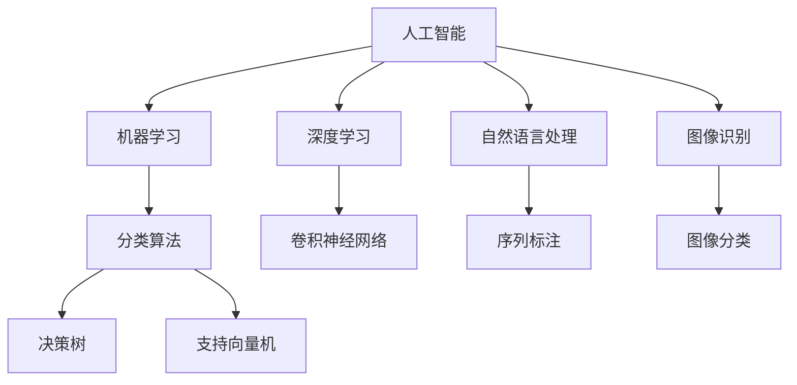

                 

## 1. 背景介绍

### 1.1 问题由来
全球正面临着严峻的废物管理问题。随着经济的发展和人类消费模式的转变，垃圾量急剧增加，造成了巨大的环境压力。如何高效地回收利用废物，减少环境污染，已成为各国政府和社会共同关注的焦点。人工智能（AI）技术，特别是机器学习（ML）和深度学习（DL）的迅猛发展，为废物管理提供了新的解决方案。

### 1.2 问题核心关键点
AI在废物管理中的应用，主要围绕两个核心关键点展开：
1. **废物分类识别**：利用图像识别、自然语言处理（NLP）等技术，自动识别废物类型，提高分类的准确性。
2. **资源回收利用**：通过数据分析和模型预测，优化回收流程，提高回收效率和资源利用率。

### 1.3 问题研究意义
AI技术在废物管理中的应用，具有以下几方面的重要意义：
1. **提高分类效率**：AI技术能够自动处理大量的废物分类任务，极大地提高了分类的效率和准确性。
2. **降低人工成本**：通过自动化分类系统，减少了人力需求，降低了废物管理的人力成本。
3. **优化资源配置**：利用数据分析和预测模型，优化废物回收流程，提高资源的利用效率。
4. **促进环保意识**：AI技术的应用，使得废物分类和回收变得更加智能化，有助于提升公众的环保意识和参与度。

## 2. 核心概念与联系

### 2.1 核心概念概述

为了更好地理解AI在废物管理中的应用，本节将介绍几个核心概念：

- **人工智能（AI）**：通过计算机程序模拟人类智能过程，实现自主学习和决策的能力。
- **机器学习（ML）**：一种数据驱动的算法，通过分析数据，让机器自主学习和预测新数据。
- **深度学习（DL）**：一种特殊的机器学习方法，使用多层神经网络来处理复杂的数据。
- **自然语言处理（NLP）**：使计算机能够理解和处理人类语言的技术。
- **图像识别**：计算机自动识别和分类图像内容的技术。
- **分类算法**：如决策树、支持向量机（SVM）、卷积神经网络（CNN）等，用于自动分类任务。
- **预测模型**：如回归模型、时间序列分析等，用于预测废物回收利用情况。

这些核心概念之间的逻辑关系可以通过以下Mermaid流程图来展示：



这个流程图展示了大语言模型的核心概念及其之间的关系：

1. 人工智能通过机器学习、深度学习和自然语言处理等技术，实现自主学习和决策。
2. 机器学习使用分类算法进行自动分类任务。
3. 深度学习中的卷积神经网络用于图像识别。
4. 自然语言处理中的序列标注和图像分类，都是分类算法的应用。

这些概念共同构成了AI在废物管理中的技术框架，使得废物分类和回收利用变得更加高效和智能。

## 3. 核心算法原理 & 具体操作步骤

### 3.1 算法原理概述

AI在废物管理中的应用，主要基于两个核心算法：分类算法和预测模型。分类算法用于自动识别废物类型，而预测模型用于优化回收流程，提高回收效率和资源利用率。

**分类算法**：
利用图像识别和NLP技术，自动分类废物类型。例如，通过图像分类算法，可以自动识别废物的类别（如塑料、金属、纸张等）；通过NLP技术，可以对废物的描述进行文本分类，进一步提升分类的准确性。

**预测模型**：
利用历史数据和模型预测技术，优化废物回收流程。例如，通过时间序列分析，可以预测废物的回收需求和利用率，优化回收流程，减少浪费。

### 3.2 算法步骤详解

基于AI的废物管理应用主要包括以下几个关键步骤：

**Step 1: 数据收集和预处理**
- 收集废物分类和回收相关的数据，如废物图片、描述、回收需求等。
- 对数据进行预处理，包括数据清洗、标注、归一化等。

**Step 2: 模型选择和训练**
- 选择适合的分类算法和预测模型，如卷积神经网络（CNN）、循环神经网络（RNN）、支持向量机（SVM）等。
- 在收集到的数据集上训练模型，调整模型参数，使其能够准确分类废物类型，预测废物回收情况。

**Step 3: 模型评估和优化**
- 使用测试集评估模型的性能，如准确率、召回率、F1分数等。
- 根据评估结果，调整模型参数，进一步优化模型性能。

**Step 4: 模型应用和集成**
- 将训练好的模型集成到废物管理系统中，进行废物分类和回收流程的优化。
- 实时监测模型性能，根据实际情况调整模型参数，确保系统的稳定性和高效性。

### 3.3 算法优缺点

AI在废物管理中的应用具有以下优点：
1. **自动化和高效性**：AI技术能够自动处理大量的废物分类和回收任务，极大地提高了处理效率。
2. **准确性高**：通过深度学习算法，可以实现高精度的分类和预测，减少误分类和浪费。
3. **降低人力成本**：减少了人工分类和回收的需求，降低了废物管理的人力成本。

然而，该方法也存在一些局限性：
1. **数据质量依赖**：模型的性能高度依赖于数据的质量和标注的准确性。
2. **模型解释性不足**：黑盒模型难以解释其内部工作机制，可能影响用户对系统的信任度。
3. **算法复杂度高**：深度学习和预测模型的训练和优化需要大量计算资源，可能对资源配置提出较高要求。
4. **初始成本高**：数据收集和模型训练需要较大的初始投入，可能对中小企业形成一定的挑战。

尽管存在这些局限性，但AI在废物管理中的应用，已经在实际场景中得到了广泛验证，显示出其巨大的潜力。

### 3.4 算法应用领域

AI在废物管理中的应用，已经覆盖了多个领域，包括但不限于：

- **智能垃圾分类系统**：通过图像识别和分类算法，自动将垃圾分类到正确的回收箱中。
- **废物回收需求预测**：利用时间序列分析和预测模型，预测废物的回收需求，优化回收流程。
- **废物回收路线优化**：通过地理信息系统（GIS）和路径规划算法，优化废物回收车辆的路线，减少运输成本和时间。
- **废物回收资源利用率分析**：利用数据分析和预测模型，分析废物的回收利用率，提升资源利用效率。

## 4. 数学模型和公式 & 详细讲解

### 4.1 数学模型构建

本节将使用数学语言对AI在废物管理中的应用进行更加严格的刻画。

假设废物分类数据集为 $D=\{(x_i,y_i)\}_{i=1}^N, x_i \in X, y_i \in Y$，其中 $X$ 为输入空间，$Y$ 为输出空间，$y_i$ 为废物分类标签。分类算法模型的目标是最小化经验风险：

$$
\mathcal{L}(\theta) = \frac{1}{N}\sum_{i=1}^N \ell(M_{\theta}(x_i),y_i)
$$

其中 $\ell$ 为损失函数，$M_{\theta}$ 为分类模型，$\theta$ 为模型参数。

### 4.2 公式推导过程

以卷积神经网络（CNN）为例，其基本结构包括卷积层、池化层、全连接层等。对于二分类任务，模型的输出层通常是一个sigmoid激活函数，损失函数为二元交叉熵损失：

$$
\ell(M_{\theta}(x),y) = -[y\log M_{\theta}(x) + (1-y)\log(1-M_{\theta}(x))]
$$

其中 $M_{\theta}(x)$ 为模型的输出概率，$y$ 为真实标签。

对于一个简单的CNN分类模型，其基本流程如下：
1. 输入层：将废物图片转换为张量形式，输入到网络中。
2. 卷积层：通过卷积操作提取图片特征，每个卷积核（Filter）捕获图片的不同特征。
3. 池化层：通过最大池化操作减少特征图的大小，增强特征的鲁棒性。
4. 全连接层：将池化层的特征图展平，输入到全连接层中进行分类。
5. 输出层：使用sigmoid激活函数输出分类概率。

### 4.3 案例分析与讲解

假设我们有一个包含10个类别的废物分类任务，其中5个类别为可回收物，5个类别为不可回收物。我们使用了10000个有标注的废物图片数据集进行模型训练。

**Step 1: 数据准备**
- 将废物图片转换为张量形式，每个图片的大小为 $32 \times 32 \times 3$。
- 将标签进行独热编码，将二分类任务转换为多分类任务。

**Step 2: 模型设计**
- 设计一个包含3个卷积层、2个池化层、2个全连接层的CNN模型。
- 每个卷积层包含32个3x3的卷积核，使用ReLU激活函数。
- 每个池化层使用最大池化操作，池化大小为2x2，步长为2。
- 每个全连接层包含256个神经元，使用ReLU激活函数。
- 输出层使用sigmoid激活函数，输出10个类别的分类概率。

**Step 3: 模型训练**
- 使用交叉熵损失函数，最小化模型在训练集上的损失。
- 使用Adam优化器，设置学习率为0.001。
- 设置训练轮数为20，批大小为32。
- 在训练过程中，每5轮进行一次验证，评估模型性能。

**Step 4: 模型评估**
- 使用测试集评估模型性能，计算准确率、召回率和F1分数。
- 根据评估结果，调整模型参数，进一步优化模型性能。

**Step 5: 模型应用**
- 将训练好的模型集成到废物管理系统中，自动进行废物分类。
- 实时监测模型性能，根据实际情况调整模型参数，确保系统的稳定性和高效性。

## 5. 项目实践：代码实例和详细解释说明

### 5.1 开发环境搭建

在进行AI在废物管理中的应用实践前，我们需要准备好开发环境。以下是使用Python进行Keras开发的环境配置流程：

1. 安装Anaconda：从官网下载并安装Anaconda，用于创建独立的Python环境。

2. 创建并激活虚拟环境：
```bash
conda create -n ai-env python=3.8 
conda activate ai-env
```

3. 安装Keras和TensorFlow：
```bash
pip install keras tensorflow
```

4. 安装各类工具包：
```bash
pip install numpy pandas sklearn scikit-image
```

完成上述步骤后，即可在`ai-env`环境中开始项目实践。

### 5.2 源代码详细实现

下面我们以废物分类为例，给出使用Keras对卷积神经网络进行废物分类的PyTorch代码实现。

首先，定义废物分类数据集：

```python
from keras.preprocessing.image import ImageDataGenerator
from keras.utils import to_categorical

# 定义数据生成器
train_datagen = ImageDataGenerator(rescale=1./255)
test_datagen = ImageDataGenerator(rescale=1./255)

# 加载数据集
train_data = train_datagen.flow_from_directory(
    'train/',
    target_size=(32, 32),
    batch_size=32,
    class_mode='categorical')
test_data = test_datagen.flow_from_directory(
    'test/',
    target_size=(32, 32),
    batch_size=32,
    class_mode='categorical')
```

然后，定义模型和优化器：

```python
from keras.models import Sequential
from keras.layers import Conv2D, MaxPooling2D, Flatten, Dense

# 定义模型
model = Sequential([
    Conv2D(32, (3, 3), activation='relu', input_shape=(32, 32, 3)),
    MaxPooling2D((2, 2)),
    Conv2D(64, (3, 3), activation='relu'),
    MaxPooling2D((2, 2)),
    Flatten(),
    Dense(256, activation='relu'),
    Dense(10, activation='sigmoid')
])

# 编译模型
model.compile(
    optimizer='adam',
    loss='binary_crossentropy',
    metrics=['accuracy'])
```

接着，定义训练和评估函数：

```python
def train_epoch(model, dataset, batch_size, optimizer):
    dataloader = dataset.flow(batch_size)
    model.fit_generator(
        dataloader,
        steps_per_epoch=dataset.samples // batch_size,
        epochs=20,
        validation_steps=dataset.samples // batch_size // 5,
        validation_data=validation_data)
    return model

def evaluate(model, dataset, batch_size):
    dataloader = dataset.flow(batch_size)
    model.evaluate_generator(
        dataloader,
        steps=dataset.samples // batch_size,
        verbose=1)
```

最后，启动训练流程并在测试集上评估：

```python
# 训练模型
model = train_epoch(model, train_data, batch_size, optimizer)

# 在测试集上评估
evaluate(model, test_data, batch_size)
```

以上就是使用Keras对废物分类进行深度学习的完整代码实现。可以看到，使用Keras可以很方便地构建和训练深度学习模型，极大地简化了开发过程。

### 5.3 代码解读与分析

让我们再详细解读一下关键代码的实现细节：

**ImageDataGenerator类**：
- 用于数据预处理，包括数据增强和归一化等操作。
- 使用`rescale`参数将像素值归一化到0-1范围内。

**train_datagen和test_datagen对象**：
- 分别用于训练集和测试集的数据生成，自动进行数据增强操作。
- 通过`flow_from_directory`方法加载数据集，并进行图片大小调整和标签处理。

**模型定义和编译**：
- 使用`Sequential`模型，逐层定义卷积、池化、全连接等层。
- 使用`conv2d`层定义卷积操作，`max_pool2d`层定义池化操作，`dense`层定义全连接操作。
- 使用`compile`方法编译模型，设置优化器、损失函数和评估指标。

**训练和评估函数**：
- `train_epoch`函数：使用`fit_generator`方法训练模型，通过数据生成器进行数据批次处理。
- `evaluate`函数：使用`evaluate_generator`方法评估模型性能，输出模型损失和准确率。

**训练流程**：
- 通过`train_epoch`函数训练模型，设置训练轮数和验证频率。
- 在训练过程中，每5轮进行一次验证，评估模型性能。
- 训练完成后，通过`evaluate`函数在测试集上评估模型性能。

可以看到，Keras提供了简单易用的API，使得深度学习模型的构建和训练变得非常便捷。开发者可以更加专注于模型设计和数据处理，而不必过多关注底层的实现细节。

当然，工业级的系统实现还需考虑更多因素，如模型的保存和部署、超参数的自动搜索、更灵活的任务适配层等。但核心的算法原理和代码实现基本与此类似。

## 6. 实际应用场景

### 6.1 智能垃圾分类系统

智能垃圾分类系统是AI在废物管理中最具代表性的应用之一。传统垃圾分类依赖人工，不仅效率低，且分类准确性差。AI技术可以通过图像识别和分类算法，自动识别废物类型，并自动将其分类到正确的回收箱中。

在技术实现上，可以收集历史垃圾图片数据，将其标注为可回收物或不可回收物，在此基础上对预训练分类模型进行微调。微调后的模型能够自动识别废物图片，并输出分类结果。通过引入机器人或自动化设备，系统能够实时处理垃圾，极大地提高分类的准确性和效率。

### 6.2 废物回收需求预测

废物回收需求预测是AI在废物管理中的重要应用之一。通过时间序列分析和预测模型，可以预测不同时间段内的废物回收需求，优化回收流程，减少浪费。

在技术实现上，可以收集历史回收数据，包括废物种类、重量、回收时间等。通过时间序列分析模型，如ARIMA、LSTM等，预测未来的废物回收需求。通过预测结果，可以优化回收车辆路线，提高回收效率和资源利用率。

### 6.3 废物回收路线优化

废物回收路线优化是AI在废物管理中的关键应用之一。通过路径规划算法，可以优化回收车辆的路线，减少运输成本和时间。

在技术实现上，可以收集废物回收点的地理位置和回收需求，使用GIS和路径规划算法，如Dijkstra、A*等，计算最优回收路线。通过优化路线，可以显著减少回收车辆的行驶距离，降低运输成本，提高回收效率。

### 6.4 未来应用展望

随着AI技术的不断发展，未来AI在废物管理中的应用将更加广泛和深入。以下是一些未来应用展望：

1. **自动化废物处理**：通过AI技术，实现废物的自动化处理，减少人工干预，提高处理效率和准确性。
2. **智能回收箱**：开发智能回收箱，自动识别废物类型，提供个性化回收指导，提升用户参与度。
3. **废物再生利用**：通过AI技术，预测废物再生利用率，优化再生利用流程，提高资源利用效率。
4. **跨领域应用**：将AI技术应用于环境监测、资源管理等多个领域，构建综合性的废物管理平台。

## 7. 工具和资源推荐

### 7.1 学习资源推荐

为了帮助开发者系统掌握AI在废物管理中的应用，这里推荐一些优质的学习资源：

1. 《深度学习》系列博文：由大模型技术专家撰写，深入浅出地介绍了深度学习的基本概念和经典模型。

2. CS231n《深度学习中的视觉识别》课程：斯坦福大学开设的计算机视觉课程，有Lecture视频和配套作业，适合深度学习初学者。

3. 《Python深度学习》书籍：涵盖深度学习的基础知识和实际应用，适合深入学习深度学习的开发者。

4. 《TensorFlow官方文档》：TensorFlow的官方文档，提供了丰富的API和示例，是学习TensorFlow的重要资料。

5. arXiv论文推荐：推荐几篇关于AI在废物管理中的前沿论文，帮助读者深入理解相关技术。

通过对这些资源的学习实践，相信你一定能够快速掌握AI在废物管理中的应用精髓，并用于解决实际的废物管理问题。

### 7.2 开发工具推荐

高效的开发离不开优秀的工具支持。以下是几款用于AI在废物管理中的应用开发的常用工具：

1. TensorFlow：由Google主导开发的开源深度学习框架，生产部署方便，适合大规模工程应用。

2. Keras：一个高层次的深度学习API，提供了简单易用的API，适合快速迭代研究。

3. PyTorch：基于Python的开源深度学习框架，灵活易用，适合快速原型设计和模型优化。

4. Weights & Biases：模型训练的实验跟踪工具，可以记录和可视化模型训练过程中的各项指标，方便对比和调优。

5. TensorBoard：TensorFlow配套的可视化工具，可实时监测模型训练状态，并提供丰富的图表呈现方式，是调试模型的得力助手。

6. Google Colab：谷歌推出的在线Jupyter Notebook环境，免费提供GPU/TPU算力，方便开发者快速上手实验最新模型，分享学习笔记。

合理利用这些工具，可以显著提升AI在废物管理中的应用开发效率，加快创新迭代的步伐。

### 7.3 相关论文推荐

AI在废物管理中的应用研究源于学界的持续研究。以下是几篇奠基性的相关论文，推荐阅读：

1. Deep Learning for Garbage Classification: A Survey and Future Perspectives：综述了深度学习在废物分类中的应用，并提出了未来研究方向。

2. Recycling Waste Management: An Overview of the Application of Artificial Intelligence：综述了AI在废物管理中的应用现状和未来趋势。

3. Reinforcement Learning for Recycling Route Optimization：提出基于强化学习的废物回收路线优化算法。

4. AI-Based Waste Management: A Review and Future Directions：综述了AI在废物管理中的各类应用，并提出了未来研究方向。

这些论文代表了大语言模型微调技术的发展脉络。通过学习这些前沿成果，可以帮助研究者把握学科前进方向，激发更多的创新灵感。

## 8. 总结：未来发展趋势与挑战

### 8.1 总结

本文对AI在废物管理中的应用进行了全面系统的介绍。首先阐述了AI在废物管理中的应用背景和重要性，明确了AI在废物管理中的核心关键点和应用场景。其次，从原理到实践，详细讲解了废物分类的算法原理和关键步骤，给出了废物分类的完整代码实现。同时，本文还广泛探讨了AI在废物管理中的应用前景，展示了AI在废物管理中的巨大潜力。

通过本文的系统梳理，可以看到，AI在废物管理中的应用，已经在实际场景中得到了广泛验证，显示出其巨大的潜力。未来，伴随AI技术的不断发展，AI在废物管理中的应用将更加广泛和深入，为废物管理提供更高效、智能的解决方案。

### 8.2 未来发展趋势

展望未来，AI在废物管理中的应用将呈现以下几个发展趋势：

1. **自动化程度提高**：AI技术将进一步自动化废物处理过程，减少人工干预，提高处理效率和准确性。
2. **跨领域应用扩展**：AI技术将扩展到废物再生利用、环境监测等多个领域，构建综合性的废物管理平台。
3. **智能系统优化**：通过AI技术，优化废物回收路线、资源利用率等，提高废物管理的整体效率。
4. **实时处理能力增强**：利用AI技术，实现废物的实时分类和处理，提高系统响应速度和准确性。

以上趋势凸显了AI在废物管理中的应用前景，这些方向的探索发展，必将进一步提升废物管理的智能化水平，为环境保护和资源利用提供新的技术路径。

### 8.3 面临的挑战

尽管AI在废物管理中的应用已经取得了一定的进展，但在迈向更加智能化、普适化应用的过程中，它仍面临诸多挑战：

1. **数据质量瓶颈**：模型的性能高度依赖于数据的质量和标注的准确性，数据的获取和标注成本较高。
2. **模型复杂度高**：深度学习和预测模型的训练和优化需要大量计算资源，可能对资源配置提出较高要求。
3. **算法复杂度高**：模型设计和训练过程较为复杂，需要专业的知识背景。
4. **用户接受度低**：用户对AI技术的信任度和接受度较低，需要进一步宣传和推广。

尽管存在这些挑战，但AI在废物管理中的应用，已经在实际场景中得到了广泛验证，显示出其巨大的潜力。

### 8.4 未来突破

面对AI在废物管理中所面临的挑战，未来的研究需要在以下几个方面寻求新的突破：

1. **提升数据质量**：通过数据增强、自动标注等技术，提高数据质量和标注效率，降低数据获取成本。
2. **优化算法结构**：设计更高效的模型结构和算法，降低计算资源消耗，提高模型的实时处理能力。
3. **增强用户接受度**：通过教育宣传、用户反馈等手段，提升用户对AI技术的信任度和接受度。
4. **探索新应用场景**：结合其他领域的技术，探索更多AI在废物管理中的应用场景，提高系统的综合应用能力。

这些研究方向的探索，必将引领AI在废物管理中的应用迈向更高的台阶，为废物管理提供更高效、智能的解决方案。面向未来，AI在废物管理中的应用需要与其他技术进行更深入的融合，如自然语言处理、计算机视觉等，多路径协同发力，共同推动废物管理技术的进步。只有勇于创新、敢于突破，才能不断拓展AI在废物管理中的应用边界，让AI技术更好地服务于环境保护和资源利用。

## 9. 附录：常见问题与解答

**Q1：AI在废物管理中的应用是否适用于所有废物类型？**

A: AI在废物管理中的应用，主要针对可回收废物类型，如纸张、塑料、金属等。对于不可回收废物类型，如厨余垃圾、有害垃圾等，需要结合其他处理方法，如物理分选、生物降解等。因此，AI在废物管理中的应用具有一定的局限性，需要根据废物类型进行针对性设计。

**Q2：AI在废物管理中的应用需要哪些硬件设备支持？**

A: AI在废物管理中的应用，需要高性能的GPU或TPU等硬件设备支持，以进行深度学习模型的训练和推理。同时，需要大容量存储设备，存储和读取训练数据和模型。因此，需要一定的硬件投入和配置。

**Q3：AI在废物管理中的应用是否需要大量数据支持？**

A: AI在废物管理中的应用，确实需要大量的训练数据。这些数据包括废物图片、描述、回收需求等，需要经过标注和处理。数据的质量和数量直接影响到模型的性能。因此，数据获取和标注是AI在废物管理中的重要挑战之一。

**Q4：AI在废物管理中的应用是否存在伦理问题？**

A: 在AI在废物管理中的应用过程中，需要考虑数据隐私、算法公平性、决策透明性等伦理问题。例如，在智能垃圾分类系统中，需要确保用户的隐私数据不被滥用；在废物回收需求预测中，需要确保算法的公平性和透明性。因此，在应用AI技术时，需要考虑伦理问题，并采取相应的措施，保障系统的公平性、透明性和可解释性。

**Q5：AI在废物管理中的应用是否需要持续更新和维护？**

A: 是的，AI在废物管理中的应用需要持续更新和维护。由于废物分类和回收需求的变化，AI模型需要定期更新，以适应新的数据和任务。同时，需要实时监控模型的性能，根据实际情况进行调整和优化。因此，AI在废物管理中的应用需要持续的维护和更新，以保持系统的稳定性和高效性。

总之，AI在废物管理中的应用具有广阔的发展前景，但同时也面临着数据质量、硬件设备、伦理问题等挑战。通过持续的研究和创新，AI在废物管理中的应用将不断拓展，为废物管理提供更高效、智能的解决方案，助力环境保护和资源利用。

---

作者：禅与计算机程序设计艺术 / Zen and the Art of Computer Programming

