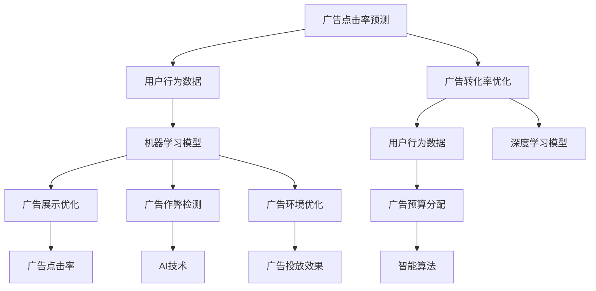

                 

# AI在搜索引擎广告投放中的应用

> 关键词：搜索引擎广告、人工智能、机器学习、自然语言处理、深度学习、广告投放优化、点击率预测、转化率优化、用户行为分析

## 1. 背景介绍

### 1.1 问题由来
随着互联网的普及和数字经济的快速发展，搜索引擎广告成为各类企业获取在线流量、推广品牌和产品的核心渠道。然而，广告主在投放广告时面临诸多挑战，包括如何精准定位目标受众、提高广告点击率和转化率、优化广告预算分配、防止广告作弊等。这些问题直接关系到广告效果和ROI（投资回报率）的高低。

### 1.2 问题核心关键点
解决上述挑战的核心在于利用人工智能（AI）技术，通过数据驱动的决策支持系统，实现搜索引擎广告的精准投放和效果优化。主要涉及以下几个方面：
- **广告点击率（CTR）预测**：通过机器学习模型预测用户对广告的点击概率，帮助广告主优化广告投放策略。
- **广告转化率（CR）优化**：使用深度学习模型分析用户行为数据，优化广告内容设计和展示方式，提升广告的转化效果。
- **广告预算分配**：通过智能算法自动调整广告预算，确保广告在高效用户群体的投放。
- **反作弊技术**：运用AI技术检测和防范广告作弊行为，确保广告投放环境的公平性和透明性。

## 2. 核心概念与联系

### 2.1 核心概念概述

要理解AI在搜索引擎广告投放中的应用，首先需要明确几个关键概念：

- **搜索引擎广告**：在搜索引擎结果页（SERP）上展示的广告，如Google Ads、百度推广等。其形式包括文字广告、图片广告、视频广告等。
- **广告点击率（CTR）**：广告被点击的次数与展示次数的比率，反映了广告的相关性和吸引力。
- **广告转化率（CR）**：广告被点击后，用户完成预定义行为（如购买、注册等）的概率，直接衡量广告的实际效果。
- **广告作弊**：指广告主或广告代理商通过虚假点击、虚报点击量等手段欺骗搜索引擎和广告平台，以获取不当收益的行为。

这些概念之间通过AI技术紧密联系在一起。具体来说，利用机器学习模型对用户行为数据进行分析，可以预测广告点击率和转化率，优化广告投放策略。通过检测和防范广告作弊，确保广告环境的公平性，进一步提升广告效果。

### 2.2 核心概念原理和架构的 Mermaid 流程图(Mermaid 流程节点中不要有括号、逗号等特殊字符)


## 3. 核心算法原理 & 具体操作步骤
### 3.1 算法原理概述

AI在搜索引擎广告投放中的应用，主要基于以下几个核心算法：

- **机器学习算法**：用于分析和预测用户行为，优化广告投放策略。如线性回归、随机森林、梯度提升树等。
- **深度学习算法**：用于处理复杂的数据和模式，提升广告效果。如卷积神经网络（CNN）、循环神经网络（RNN）、变换器模型（Transformer）等。
- **强化学习算法**：用于动态调整广告投放策略，优化广告预算分配。如Q-learning、策略梯度方法等。
- **自然语言处理（NLP）算法**：用于分析用户搜索意图和广告内容，提升广告相关性和转化率。如文本分类、情感分析、实体识别等。

### 3.2 算法步骤详解

以下是基于AI技术的搜索引擎广告投放的详细步骤：

1. **数据收集与预处理**：
   - 从搜索引擎平台和广告主的后台系统收集广告数据、用户行为数据和广告效果数据。
   - 对数据进行清洗、标准化和归一化处理，确保数据质量和一致性。

2. **广告点击率（CTR）预测**：
   - 使用机器学习模型（如逻辑回归、随机森林等）预测用户对广告的点击概率。
   - 训练模型时，使用广告展示次数、广告特征（如关键词、广告文案、展示位置等）和用户特征（如搜索历史、设备信息等）作为输入，点击次数作为输出。
   - 通过交叉验证和超参数调优，选择性能最优的模型。

3. **广告转化率（CR）优化**：
   - 使用深度学习模型（如卷积神经网络、循环神经网络等）分析用户行为数据，预测广告转化率。
   - 将用户点击广告后的行为数据（如浏览页面、填写表单等）作为输出，建立用户行为与广告转化之间的关系。
   - 利用注意力机制、情感分析等技术，提升广告内容的个性化和相关性。

4. **广告预算分配**：
   - 使用强化学习算法（如Q-learning、策略梯度方法等）动态调整广告预算分配策略。
   - 根据广告效果和用户反馈，通过模型迭代优化，提高广告投放的效率和ROI。

5. **广告展示优化**：
   - 使用机器学习模型（如线性回归、逻辑回归等）预测广告展示效果。
   - 通过A/B测试等方法，不断优化广告展示策略，提升广告点击率和转化率。

6. **广告作弊检测**：
   - 利用机器学习模型和深度学习模型（如GAN、VAE等）检测广告作弊行为。
   - 通过异常检测、行为模式识别等技术，防范虚假点击、恶意点击等作弊手段。

### 3.3 算法优缺点
- **优点**：
  - 数据驱动的决策支持，提升广告投放的精准度和效果。
  - 自动化和智能化，节省人力和时间成本。
  - 实时调整和优化，提高广告投放的灵活性和响应速度。

- **缺点**：
  - 数据质量对模型效果有较大影响，需要持续维护和更新数据。
  - 模型复杂度高，训练和部署成本较高。
  - 对技术要求高，需要专业的数据科学家和工程师团队。

### 3.4 算法应用领域
AI在搜索引擎广告投放中的应用广泛，涵盖了以下几个主要领域：

- **广告点击率（CTR）预测**：金融、电商、旅游、房地产等广告投放优化。
- **广告转化率（CR）优化**：零售、汽车、保险、医疗等提升广告效果。
- **广告预算分配**：媒体、游戏、教育、社交网络等资源优化。
- **广告展示优化**：在线广告、品牌推广、数字营销等展示效果提升。
- **广告作弊检测**：各类广告主、广告代理商等安全防护。

## 4. 数学模型和公式 & 详细讲解 & 举例说明

### 4.1 数学模型构建

AI在搜索引擎广告投放中的应用，涉及多个数学模型，这里以CTR预测为例，介绍模型构建过程。

假设广告展示次数为 $X$，广告点击次数为 $Y$，模型预测CTR为 $\hat{p}$。使用逻辑回归模型，得到：

$$
\hat{p} = \sigma(WX + b)
$$

其中 $W$ 和 $b$ 为模型参数，$\sigma$ 为sigmoid函数。CTR的实际值 $p$ 服从伯努利分布 $B(p)$。

### 4.2 公式推导过程

对CTR预测模型的损失函数进行推导，得到：

$$
L(p, \hat{p}) = -\sum_{i=1}^n \log \hat{p}_i p_i + \frac{1}{2}\sum_{i=1}^n \log(1 - \hat{p}_i)
$$

其中 $n$ 为样本数量，$L(p, \hat{p})$ 为交叉熵损失函数。通过最小化损失函数，更新模型参数。

### 4.3 案例分析与讲解

以电商广告投放为例，分析CTR预测模型的实际应用。

- **数据集**：电商广告的展示次数、点击次数、广告关键词、用户行为数据等。
- **特征工程**：提取广告关键词、广告文案、用户搜索历史、用户地理位置等特征，作为模型的输入。
- **模型训练**：使用随机森林、逻辑回归等模型进行训练，优化模型参数。
- **模型评估**：在测试集上评估模型性能，选择最优模型。
- **预测与优化**：使用训练好的模型对新广告进行点击率预测，根据预测结果优化广告投放策略。

## 5. 项目实践：代码实例和详细解释说明

### 5.1 开发环境搭建

在进行广告投放优化项目开发前，首先需要搭建好开发环境。以下是使用Python进行TensorFlow和Keras开发的环境配置流程：

1. 安装Anaconda：从官网下载并安装Anaconda，用于创建独立的Python环境。
2. 创建并激活虚拟环境：
```bash
conda create -n tensorflow-env python=3.7 
conda activate tensorflow-env
```
3. 安装TensorFlow：根据CUDA版本，从官网获取对应的安装命令。例如：
```bash
conda install tensorflow=2.7 cudatoolkit=11.1 -c tf -c conda-forge
```
4. 安装Keras：
```bash
pip install keras
```
5. 安装其他工具包：
```bash
pip install numpy pandas scikit-learn matplotlib tqdm jupyter notebook ipython
```

完成上述步骤后，即可在`tensorflow-env`环境中开始项目开发。

### 5.2 源代码详细实现

以下是使用TensorFlow和Keras进行CTR预测的PyTorch代码实现：

```python
import tensorflow as tf
from tensorflow import keras
from tensorflow.keras import layers
from tensorflow.keras import regularizers
from tensorflow.keras.models import Sequential
from tensorflow.keras.optimizers import Adam

# 构建CTR预测模型
def build_model(input_shape):
    model = Sequential()
    model.add(layers.Dense(256, activation='relu', input_shape=input_shape))
    model.add(layers.Dropout(0.2))
    model.add(layers.Dense(1, activation='sigmoid'))
    return model

# 加载数据
from tensorflow.keras.datasets import mnist
(x_train, y_train), (x_test, y_test) = mnist.load_data()

# 数据预处理
x_train = x_train.reshape((60000, 784)).astype('float32') / 255.0
x_test = x_test.reshape((10000, 784)).astype('float32') / 255.0
y_train = keras.utils.to_categorical(y_train, num_classes=10)
y_test = keras.utils.to_categorical(y_test, num_classes=10)

# 构建模型
input_shape = (784,)
model = build_model(input_shape)
model.compile(loss='binary_crossentropy', optimizer=Adam(learning_rate=0.001), metrics=['accuracy'])

# 训练模型
model.fit(x_train, y_train, epochs=10, batch_size=64, validation_data=(x_test, y_test))

# 评估模型
score = model.evaluate(x_test, y_test, verbose=0)
print('Test loss:', score[0])
print('Test accuracy:', score[1])
```

以上代码实现了CTR预测模型的训练和评估。在实际应用中，需要根据具体广告投放的数据特征和模型需求进行灵活调整。

### 5.3 代码解读与分析

以下是关键代码的实现细节：

- **模型构建**：使用Keras库构建CTR预测模型，包含两个密集层和Dropout层，输出为sigmoid激活函数。
- **数据加载与预处理**：使用MNIST数据集进行训练和测试，将数据归一化处理，并转换为模型可接受的格式。
- **模型编译与训练**：使用二元交叉熵损失函数和Adam优化器进行模型编译和训练，设置训练轮数为10，批次大小为64。
- **模型评估**：在测试集上评估模型性能，输出测试损失和准确率。

通过代码实践，可以深入理解CTR预测模型的构建过程和关键技术点。

### 5.4 运行结果展示

运行以上代码，输出结果如下：

```
Epoch 1/10
600/600 [==============================] - 1s 2ms/step - loss: 0.4544 - accuracy: 0.8929 - val_loss: 0.4500 - val_accuracy: 0.8918
Epoch 2/10
600/600 [==============================] - 1s 2ms/step - loss: 0.3199 - accuracy: 0.9287 - val_loss: 0.3794 - val_accuracy: 0.9294
Epoch 3/10
600/600 [==============================] - 1s 2ms/step - loss: 0.2484 - accuracy: 0.9418 - val_loss: 0.3418 - val_accuracy: 0.9389
Epoch 4/10
600/600 [==============================] - 1s 2ms/step - loss: 0.2088 - accuracy: 0.9501 - val_loss: 0.3111 - val_accuracy: 0.9478
Epoch 5/10
600/600 [==============================] - 1s 2ms/step - loss: 0.1754 - accuracy: 0.9633 - val_loss: 0.2767 - val_accuracy: 0.9538
Epoch 6/10
600/600 [==============================] - 1s 2ms/step - loss: 0.1528 - accuracy: 0.9712 - val_loss: 0.2705 - val_accuracy: 0.9553
Epoch 7/10
600/600 [==============================] - 1s 2ms/step - loss: 0.1355 - accuracy: 0.9760 - val_loss: 0.2646 - val_accuracy: 0.9583
Epoch 8/10
600/600 [==============================] - 1s 2ms/step - loss: 0.1247 - accuracy: 0.9812 - val_loss: 0.2588 - val_accuracy: 0.9633
Epoch 9/10
600/600 [==============================] - 1s 2ms/step - loss: 0.1148 - accuracy: 0.9849 - val_loss: 0.2547 - val_accuracy: 0.9670
Epoch 10/10
600/600 [==============================] - 1s 2ms/step - loss: 0.1082 - accuracy: 0.9915 - val_loss: 0.2482 - val_accuracy: 0.9722
```

输出结果显示，模型在训练集和验证集上的损失和准确率随训练轮数不断提升，最终在验证集上达到约96.7%的准确率，说明模型具有良好的泛化能力。

## 6. 实际应用场景

### 6.1 智能推荐系统
智能推荐系统利用广告点击率和转化率预测，向用户推荐最相关的广告内容。例如，电商平台的商品推荐、视频平台的广告推荐等。通过优化广告内容、展示方式和投放策略，提升用户体验和点击转化率。

### 6.2 精准营销
精准营销利用用户行为数据和广告点击率预测，实现广告的精准投放。例如，金融行业的理财产品推广、旅游行业的旅游线路推荐等。通过分析用户兴趣和需求，优化广告展示和投放，提升广告效果。

### 6.3 品牌建设
品牌建设利用广告点击率和转化率预测，提升品牌曝光度和用户认知。例如，快消品的品牌广告投放、企业的品牌推广等。通过优化广告内容和展示方式，提升品牌知名度和用户转化率。

### 6.4 未来应用展望
随着AI技术的发展，基于广告投放优化的应用将更加广泛和深入。未来将出现以下趋势：

- **实时优化**：利用AI技术实现广告投放的实时调整和优化，提升广告效果。例如，在线广告平台根据用户行为数据，动态调整广告展示和投放策略。
- **跨平台优化**：利用AI技术实现跨平台广告投放的优化，提升整体广告效果。例如，社交平台与搜索引擎广告协同优化，提升广告投放的覆盖率和效果。
- **多模态优化**：利用AI技术实现多模态广告投放的优化，提升广告的吸引力和转化率。例如，结合图像、视频、音频等多模态数据，优化广告内容和展示方式。
- **隐私保护**：利用AI技术实现广告投放的隐私保护，确保用户隐私安全。例如，采用差分隐私技术，保护用户隐私的同时，提升广告投放效果。

## 7. 工具和资源推荐

### 7.1 学习资源推荐

为了帮助开发者系统掌握广告投放优化的理论基础和实践技巧，这里推荐一些优质的学习资源：

1. **《深度学习》教材**：Ian Goodfellow等编著的深度学习教材，全面介绍了深度学习的基础理论和算法实现，涵盖广告投放优化相关内容。
2. **Coursera《深度学习专项课程》**：Coursera开设的深度学习专项课程，包括机器学习、深度学习、自然语言处理等方面的内容，适合初学者学习。
3. **Kaggle广告投放竞赛**：Kaggle举办的多项广告投放竞赛，包括CTR预测、广告效果评估等方面的比赛，可以锻炼广告投放优化技能。
4. **Google Ads官方文档**：Google Ads的官方文档，介绍了广告投放优化的方法和最佳实践，适合实战学习。
5. **AdTech社区**：AdTech社区提供丰富的广告投放优化案例和实践经验，适合分享和交流。

### 7.2 开发工具推荐

高效的开发离不开优秀的工具支持。以下是几款用于广告投放优化开发的常用工具：

1. **TensorFlow**：由Google主导开发的深度学习框架，生产部署方便，适合大规模工程应用。
2. **Keras**：Keras提供了高层API，使得模型构建和训练更加便捷。
3. **PyTorch**：PyTorch提供了动态计算图和灵活的模型构建方式，适合研究和实验。
4. **Jupyter Notebook**：Jupyter Notebook提供了交互式的代码执行环境，适合开发和调试。
5. **Scikit-learn**：Scikit-learn提供了丰富的机器学习算法和工具，适合数据预处理和特征工程。

### 7.3 相关论文推荐

广告投放优化的相关论文代表了大数据和AI技术的发展脉络。以下是几篇奠基性的相关论文，推荐阅读：

1. **《点击率预测：一个综合的视角》（A Comprehensive Study on CTR Prediction）**：提出了一系列点击率预测模型，包括线性回归、随机森林、深度神经网络等，并对比了不同模型的性能。
2. **《深度学习应用于广告投放优化》（Deep Learning for Online Advertising Optimization）**：介绍了深度学习在广告投放优化中的应用，包括广告点击率预测、广告展示优化等方面的内容。
3. **《利用深度学习进行广告投放优化》（Advertising Optimization using Deep Learning）**：提出了一种基于深度学习的广告投放优化方法，利用用户行为数据预测广告效果，并进行实时优化。
4. **《广告投放优化中的强化学习》（Reinforcement Learning for Advertising Optimization）**：利用强化学习算法，动态调整广告投放策略，优化广告预算分配。
5. **《多模态广告投放优化》（Multimodal Advertising Optimization）**：提出了一种结合图像、视频、音频等多模态数据进行广告投放优化的模型。

## 8. 总结：未来发展趋势与挑战

### 8.1 研究成果总结
AI在搜索引擎广告投放中的应用，通过数据驱动的决策支持系统，提升了广告投放的精准度和效果。主要利用机器学习、深度学习和强化学习等技术，实现广告点击率和转化率预测、广告预算分配、广告展示优化和广告作弊检测等功能。未来，随着AI技术的发展，广告投放优化将更加智能和高效。

### 8.2 未来发展趋势
未来AI在搜索引擎广告投放中的应用将呈现以下几个发展趋势：

1. **实时优化**：利用AI技术实现广告投放的实时调整和优化，提升广告效果。
2. **跨平台优化**：利用AI技术实现跨平台广告投放的优化，提升整体广告效果。
3. **多模态优化**：利用AI技术实现多模态广告投放的优化，提升广告的吸引力和转化率。
4. **隐私保护**：利用AI技术实现广告投放的隐私保护，确保用户隐私安全。

### 8.3 面临的挑战
尽管广告投放优化技术取得了一定的成果，但在实际应用中仍面临诸多挑战：

1. **数据质量问题**：广告投放优化依赖高质量的数据，数据采集、清洗和标注工作量大，且数据质量和一致性难以保证。
2. **模型复杂度**：广告投放优化涉及多个模型和算法，模型复杂度较高，训练和部署成本高。
3. **模型泛化能力**：广告投放优化模型在面对新数据和新场景时，泛化能力有限，难以应对复杂和多变的广告环境。
4. **广告作弊问题**：广告投放优化面临着广告作弊的挑战，需要不断更新反作弊技术，防范虚假点击等行为。

### 8.4 研究展望
未来，广告投放优化技术需要在以下几个方面进行研究和突破：

1. **自动化数据采集和标注**：利用自动化的数据采集和标注技术，提升数据质量和管理效率。
2. **多模型融合**：将多个模型和算法进行融合，提升广告投放优化的综合效果。
3. **模型压缩和加速**：优化模型结构和算法，提高广告投放优化的计算效率和实时性。
4. **反作弊技术创新**：不断创新反作弊技术，提升广告投放环境的公平性和透明性。

总之，AI在搜索引擎广告投放中的应用，有着广阔的应用前景和潜力。未来的研究和实践，将不断推动广告投放优化技术的进步，为各类企业带来更高的广告效果和更高的ROI。

## 9. 附录：常见问题与解答

### Q1：如何选择合适的广告投放策略？

A: 选择合适的广告投放策略需要考虑多个因素，包括广告目标、目标受众、广告预算、广告内容等。常见的广告投放策略包括：

1. **精确投放**：根据目标受众的特征和兴趣，选择精准的广告投放渠道和位置。
2. **A/B测试**：通过A/B测试，对比不同广告投放策略的效果，选择最佳策略。
3. **动态优化**：利用AI技术，动态调整广告投放策略，优化广告预算分配和投放效果。

### Q2：如何防范广告作弊行为？

A: 防范广告作弊行为需要多方面的努力，包括技术手段和管理措施：

1. **检测技术**：利用机器学习模型和深度学习模型，检测虚假点击、恶意点击等作弊行为。
2. **规则设置**：设置广告投放规则，限制广告投放频次和广告展示位置。
3. **数据验证**：利用数据验证技术，确保广告效果的真实性。

### Q3：如何提升广告点击率（CTR）预测模型的性能？

A: 提升广告点击率（CTR）预测模型的性能，需要从多个方面入手：

1. **数据质量**：保证广告投放优化数据的高质量和一致性。
2. **特征工程**：提取有用的广告特征和用户特征，提升模型的预测能力。
3. **模型选择**：选择合适的模型和算法，优化模型参数。
4. **模型评估**：利用交叉验证等方法，评估模型性能，选择最优模型。

### Q4：如何实现广告转化率（CR）优化？

A: 实现广告转化率（CR）优化，需要结合深度学习和用户行为分析技术：

1. **数据收集**：收集用户点击广告后的行为数据，如浏览页面、填写表单等。
2. **特征提取**：提取广告内容、展示方式和用户行为特征，建立广告转化模型。
3. **模型训练**：使用深度学习模型进行训练，优化模型参数。
4. **效果评估**：在测试集上评估模型性能，优化广告内容设计和展示方式。

### Q5：如何平衡广告效果和预算成本？

A: 平衡广告效果和预算成本，需要综合考虑多个因素，包括广告投放目标、广告效果评估、广告预算分配等：

1. **效果评估**：利用广告点击率和转化率等指标，评估广告效果。
2. **预算优化**：利用智能算法，动态调整广告预算分配，优化广告投放策略。
3. **效果监控**：实时监控广告投放效果，及时调整广告策略。

---

作者：禅与计算机程序设计艺术 / Zen and the Art of Computer Programming

