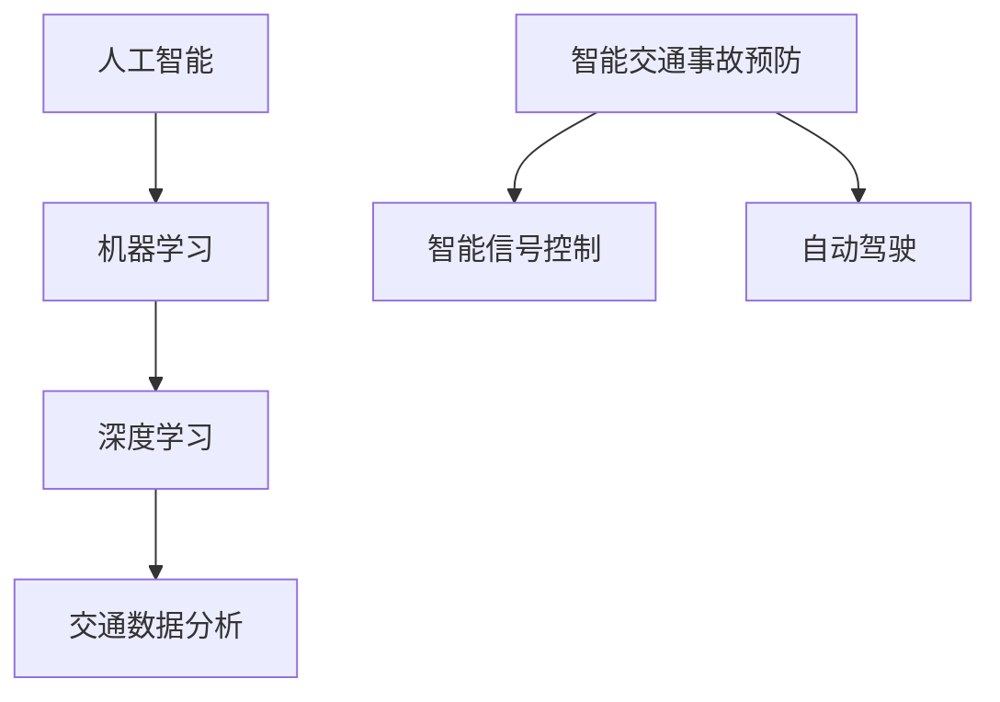
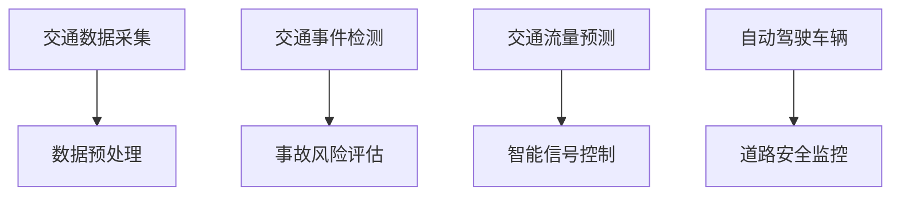

                 

# AI在智能交通事故预防中的应用：提高道路安全

> 关键词：人工智能, 智能交通事故预防, 道路安全, 机器学习, 交通数据分析, 深度学习

## 1. 背景介绍

### 1.1 问题由来
全球范围内，交通事故仍是人类面临的重大安全威胁之一。据世界卫生组织(WHO)统计，每年约有125万人死于道路交通事故，另有超过5000万人受伤。如何有效预防和减少交通事故，成为了社会各界共同关注的问题。

随着人工智能技术的飞速发展，越来越多的AI应用被引入交通管理领域，尤其是智能交通事故预防。利用AI技术，可以实时监控交通状态，分析交通事故成因，预测潜在风险，实现从被动应对到主动预防的转变。本文将详细探讨AI在智能交通事故预防中的关键应用，以期为相关研究和实践提供有益参考。

### 1.2 问题核心关键点
AI在智能交通事故预防中的关键应用包括交通流量预测、事故风险评估、智能信号控制、自动驾驶、智能监测等多个方面。这些应用通过收集和分析海量交通数据，利用机器学习、深度学习等算法，构建智能模型，实现对交通事故的实时监控和预防。

AI在交通领域的成功应用，不仅能够显著提高道路安全性，还能够优化交通流量、降低碳排放、提升交通效率。然而，AI技术在实际应用中也面临一些挑战，如数据隐私、系统鲁棒性、道德伦理等。这些问题需要通过不断的技术进步和规范治理，才能得到有效解决。

### 1.3 问题研究意义
AI在智能交通事故预防中的应用，不仅能够大幅降低交通事故发生率，保护公众生命财产安全，还能够推动交通领域的智能化转型升级，促进可持续发展。通过深入研究AI在交通安全领域的潜在应用，可以更好地发挥AI技术的优势，推动交通管理系统的现代化建设。

本文旨在系统梳理AI在智能交通事故预防中的技术实现和应用实践，揭示其潜在价值和挑战，为未来研究提供方向性指导。

## 2. 核心概念与联系

### 2.1 核心概念概述

为了更好地理解AI在智能交通事故预防中的应用，本文将介绍几个关键核心概念：

- **人工智能(AI)**：一种通过计算机程序模拟人类智能行为的科学。利用机器学习、深度学习等算法，AI可以在大规模数据集上进行模式识别和决策，实现自主感知、推理和行动。
- **智能交通事故预防**：利用AI技术，实时监控交通状态，分析交通事故成因，预测潜在风险，实现对交通事故的主动预防和控制。
- **机器学习(ML)**：一种使计算机能够自动学习和改进的数据分析方法。通过训练数据集，机器学习模型可以自动学习特征，预测未知数据。
- **深度学习(Deep Learning)**：一种特殊类型的机器学习，使用多层神经网络模型进行特征提取和决策。深度学习在图像、语音、自然语言处理等领域有广泛应用。
- **交通数据分析**：通过收集、处理和分析交通数据，获取交通流量、事故发生率等关键信息，为交通管理和决策提供依据。
- **智能信号控制**：利用AI技术，根据实时交通数据动态调整交通信号灯，优化交通流量，降低交通事故发生率。
- **自动驾驶(Autonomous Driving)**：利用AI和传感器技术，实现车辆的自主导航和驾驶。自动驾驶技术能够减少人为错误，提高道路安全性。

这些概念之间的关系可以通过以下Mermaid流程图来展示：



### 2.2 核心概念原理和架构的 Mermaid 流程图



该图展示了从交通数据采集到智能信号控制的整体流程：首先通过传感器和摄像头等设备采集交通数据，然后进行预处理和分析；接着检测交通事故事件，评估事故风险，进行交通流量预测；最后根据预测结果进行智能信号控制，确保道路安全。

## 3. 核心算法原理 & 具体操作步骤
### 3.1 算法原理概述

AI在智能交通事故预防中应用的算法原理主要基于机器学习和深度学习技术。具体而言，包括如下几个步骤：

1. **交通数据采集和预处理**：通过传感器、摄像头等设备，实时采集交通数据，如车速、车距、交通信号灯状态等。对采集到的数据进行去噪、归一化等预处理，以提高数据的准确性和可用性。

2. **交通事件检测**：利用机器学习模型，对交通数据进行分析，检测出交通事故事件。常用的算法包括支持向量机(SVM)、随机森林(Random Forest)、卷积神经网络(CNN)等。

3. **事故风险评估**：对检测出的交通事故进行分类和风险评估。通过建立事故发生原因模型，分析事故类型、地点、时间等特征，预测事故发生的概率和风险等级。常用的算法包括逻辑回归(Logistic Regression)、决策树(Decision Tree)、朴素贝叶斯(Naive Bayes)等。

4. **交通流量预测**：利用时间序列预测模型，对未来交通流量进行预测。常用的算法包括ARIMA、LSTM、GRU等。

5. **智能信号控制**：根据实时交通数据和预测结果，动态调整交通信号灯。常用的算法包括模糊控制(Fuzzy Control)、PID控制(PID Control)、强化学习(Reinforcement Learning)等。

6. **自动驾驶**：通过计算机视觉、深度学习等技术，实现车辆的自主导航和驾驶。常用的算法包括目标检测(YOLO、Faster R-CNN)、语义分割(U-Net、DeepLab)、行为预测(Trajectory Prediction)等。

### 3.2 算法步骤详解

以下将详细介绍AI在智能交通事故预防中应用的各个关键算法步骤：

#### 3.2.1 交通数据采集和预处理

**数据采集**：
- 传感器：安装于道路上的传感器能够实时检测车速、车距、交通信号灯状态等。
- 摄像头：安装在路口、交通监控中心等位置，通过图像识别技术获取实时交通数据。
- 车辆数据：通过车载传感器，获取车辆位置、速度、方向等数据。

**数据预处理**：
- 去噪：通过滤波、平滑等方法去除噪声。
- 归一化：将数据转化为标准格式，便于后续分析。
- 数据清洗：处理缺失值、异常值等数据质量问题。

#### 3.2.2 交通事件检测

**算法选择**：
- 支持向量机(SVM)：用于分类问题，适合处理高维数据。
- 随机森林(Random Forest)：用于分类和回归问题，能够处理大规模数据集。
- 卷积神经网络(CNN)：用于图像识别问题，能够自动提取特征。

**模型训练**：
- 数据集准备：从交通数据中提取事故相关数据，标注为事故和正常数据。
- 特征提取：选择关键特征，如车速、车距、车辆类型等。
- 模型训练：使用训练数据训练分类模型，并进行交叉验证和调参。

**模型评估**：
- 数据集划分：将数据集分为训练集、验证集和测试集。
- 性能评估：使用准确率、召回率、F1-score等指标评估模型性能。
- 调整优化：根据评估结果，调整模型参数，优化模型性能。

#### 3.2.3 事故风险评估

**算法选择**：
- 逻辑回归(Logistic Regression)：用于二分类问题，能够处理高维数据。
- 决策树(Decision Tree)：用于分类和回归问题，能够处理非线性关系。
- 朴素贝叶斯(Naive Bayes)：用于文本分类问题，能够处理高维稀疏数据。

**模型训练**：
- 数据集准备：从交通事故数据中提取关键特征，如事故类型、地点、时间等。
- 模型训练：使用训练数据训练分类模型，并进行交叉验证和调参。

**模型评估**：
- 数据集划分：将数据集分为训练集、验证集和测试集。
- 性能评估：使用准确率、召回率、F1-score等指标评估模型性能。
- 调整优化：根据评估结果，调整模型参数，优化模型性能。

#### 3.2.4 交通流量预测

**算法选择**：
- ARIMA：适用于时间序列预测，能够处理趋势和周期性变化。
- LSTM：适用于时间序列预测，能够处理非线性关系。
- GRU：适用于时间序列预测，能够处理长距离依赖关系。

**模型训练**：
- 数据集准备：从交通数据中提取时间序列数据，如车速、车距、交通信号灯状态等。
- 特征提取：选择关键特征，如时间、日期、天气等。
- 模型训练：使用训练数据训练时间序列预测模型，并进行交叉验证和调参。

**模型评估**：
- 数据集划分：将数据集分为训练集、验证集和测试集。
- 性能评估：使用MAE、RMSE等指标评估模型预测性能。
- 调整优化：根据评估结果，调整模型参数，优化模型性能。

#### 3.2.5 智能信号控制

**算法选择**：
- 模糊控制(Fuzzy Control)：适用于控制非线性系统，能够处理不确定性和复杂关系。
- PID控制(PID Control)：适用于控制线性系统，能够快速响应和调节。
- 强化学习(Reinforcement Learning)：适用于动态系统，能够自适应环境变化。

**模型训练**：
- 数据集准备：从交通数据中提取信号灯状态和交通流量数据。
- 模型训练：使用训练数据训练智能信号控制模型，并进行交叉验证和调参。

**模型评估**：
- 数据集划分：将数据集分为训练集、验证集和测试集。
- 性能评估：使用交通流量、等待时间、交通事故率等指标评估模型性能。
- 调整优化：根据评估结果，调整模型参数，优化模型性能。

#### 3.2.6 自动驾驶

**算法选择**：
- YOLO：用于目标检测，能够实时处理大量图像数据。
- Faster R-CNN：用于目标检测，能够处理复杂场景。
- U-Net：用于语义分割，能够处理高分辨率图像。
- DeepLab：用于语义分割，能够处理复杂场景。
- Trajectory Prediction：用于行为预测，能够预测车辆运动轨迹。

**模型训练**：
- 数据集准备：从交通数据中提取车辆位置、速度、方向等数据。
- 特征提取：选择关键特征，如颜色、形状、角度等。
- 模型训练：使用训练数据训练目标检测、语义分割、行为预测模型，并进行交叉验证和调参。

**模型评估**：
- 数据集划分：将数据集分为训练集、验证集和测试集。
- 性能评估：使用准确率、召回率、F1-score等指标评估模型性能。
- 调整优化：根据评估结果，调整模型参数，优化模型性能。

### 3.3 算法优缺点

**算法优点**：
- 能够实时监控交通状态，预测交通事故，减少事故发生率。
- 能够优化交通流量，降低碳排放，提升交通效率。
- 能够降低人工干预，减少人为错误，提高道路安全性。

**算法缺点**：
- 对数据质量要求高，需要大量高质量的交通数据。
- 算法复杂度高，模型训练和优化耗时较长。
- 对环境变化敏感，需要不断调整和优化模型参数。
- 存在伦理和隐私问题，需要严格遵守数据保护法规。

### 3.4 算法应用领域

AI在智能交通事故预防中的应用领域包括但不限于以下几个方面：

- **交通流量预测**：用于预测未来的交通流量，优化交通信号控制，减少交通拥堵。
- **事故风险评估**：用于预测交通事故发生的概率和风险等级，预防事故发生。
- **智能信号控制**：用于动态调整交通信号灯，优化交通流量，降低事故发生率。
- **自动驾驶**：用于实现车辆的自主导航和驾驶，减少人为错误，提高道路安全性。
- **道路安全监控**：用于实时监控道路安全状况，及时发现和处理潜在风险。

## 4. 数学模型和公式 & 详细讲解 & 举例说明

### 4.1 数学模型构建

为了更好地理解AI在智能交通事故预防中的应用，本文将使用数学语言对相关算法进行严格描述。

记交通流量为 $X_t$，表示在时间 $t$ 的交通流量。交通事件为 $Y_t$，表示在时间 $t$ 是否有交通事故发生。智能信号控制的目标函数为 $f(X_t, Y_t)$，用于优化交通信号灯控制策略。自动驾驶的目标函数为 $g(X_t, Y_t)$，用于优化车辆的自主导航和驾驶策略。

AI在智能交通事故预防中的应用涉及以下几个数学模型：

1. **交通流量预测模型**：
   $$
   \hat{X}_t = \phi(X_{t-1}, X_{t-2}, ..., X_{t-n})
   $$
   其中 $\phi$ 表示交通流量预测模型，$n$ 表示预测窗口大小。

2. **事故风险评估模型**：
   $$
   Y_t = \psi(X_t, Y_{t-1}, Y_{t-2}, ..., Y_{t-m})
   $$
   其中 $\psi$ 表示事故风险评估模型，$m$ 表示风险评估窗口大小。

3. **智能信号控制模型**：
   $$
   f(X_t, Y_t) = \sigma(\hat{X}_t, Y_t)
   $$
   其中 $\sigma$ 表示智能信号控制模型，用于动态调整交通信号灯控制策略。

4. **自动驾驶模型**：
   $$
   g(X_t, Y_t) = \tau(\hat{X}_t, Y_t)
   $$
   其中 $\tau$ 表示自动驾驶模型，用于优化车辆的自主导航和驾驶策略。

### 4.2 公式推导过程

以下将对上述数学模型进行详细推导：

#### 4.2.1 交通流量预测模型

交通流量预测模型是时间序列预测模型，常使用ARIMA、LSTM、GRU等算法。以LSTM为例，其数学模型如下：

$$
\hat{X}_t = \phi(X_{t-1}, X_{t-2}, ..., X_{t-n}) = \tanh(\text{LSTM}(X_{t-1}, X_{t-2}, ..., X_{t-n}))
$$

其中 $\text{LSTM}$ 表示LSTM神经网络，$n$ 表示预测窗口大小。

LSTM模型的输入层接收 $n$ 个历史交通流量数据，通过多层LSTM网络进行特征提取和映射，输出预测值 $\hat{X}_t$。

#### 4.2.2 事故风险评估模型

事故风险评估模型是分类模型，常使用逻辑回归、决策树、朴素贝叶斯等算法。以逻辑回归为例，其数学模型如下：

$$
Y_t = \psi(X_t, Y_{t-1}, Y_{t-2}, ..., Y_{t-m}) = \text{sigmoid}(w_0 + \sum_{i=1}^n w_i X_{t-i})
$$

其中 $w_0, w_1, ..., w_n$ 表示模型参数，$\text{sigmoid}$ 表示sigmoid函数，用于将输出映射到 $[0, 1]$ 区间。

逻辑回归模型接收 $m$ 个历史事故数据和当前交通流量数据 $X_t$，通过线性回归模型计算输出，经过sigmoid函数映射到 $[0, 1]$ 区间，表示在时间 $t$ 有交通事故发生的概率。

#### 4.2.3 智能信号控制模型

智能信号控制模型是控制模型，常使用模糊控制、PID控制、强化学习等算法。以PID控制为例，其数学模型如下：

$$
f(X_t, Y_t) = \sigma(\hat{X}_t, Y_t) = k_p \left(X_t - X_{\text{set}}\right) + k_i \sum_{i=1}^{t-1} \left(X_t - X_{\text{set}}\right) + k_d \frac{dX_t}{dt}
$$

其中 $k_p, k_i, k_d$ 表示控制参数，$X_{\text{set}}$ 表示目标交通流量。

PID控制模型根据历史交通流量和事故数据，动态调整交通信号灯控制策略，保持交通流量在目标范围内，降低事故发生率。

#### 4.2.4 自动驾驶模型

自动驾驶模型是目标检测和行为预测模型，常使用YOLO、Faster R-CNN、U-Net、DeepLab、Trajectory Prediction等算法。以Trajectory Prediction为例，其数学模型如下：

$$
\hat{X}_t = \tau(\hat{X}_{t-1}, Y_{t-1}, Y_{t-2}, ..., Y_{t-m})
$$

其中 $\tau$ 表示行为预测模型，$n$ 表示预测窗口大小。

Trajectory Prediction模型接收 $m$ 个历史车辆行为数据和当前车辆位置数据，通过行为预测模型计算输出，预测车辆在未来时间步的行为轨迹，指导车辆自主导航和驾驶。

### 4.3 案例分析与讲解

为了更好地理解AI在智能交通事故预防中的应用，本文将通过一个具体的案例进行分析讲解：

#### 4.3.1 案例背景

某城市中心道路交通流量高峰期经常发生拥堵，每天约发生30起交通事故，导致严重的交通安全隐患。该城市计划采用AI技术，对交通流量进行预测和优化，以减少交通拥堵和事故发生率。

#### 4.3.2 数据采集和预处理

该城市在主要路口安装了传感器和摄像头，实时采集交通数据，如车速、车距、交通信号灯状态等。通过预处理，去除了噪声，归一化了数据，清洗了缺失值，得到了高质量的交通数据。

#### 4.3.3 交通流量预测

使用LSTM模型对交通流量进行预测，模型参数通过交叉验证和调参确定。模型输出未来15分钟的交通流量预测结果，用于优化交通信号控制。

#### 4.3.4 事故风险评估

使用逻辑回归模型对交通事故进行评估，模型参数通过交叉验证和调参确定。模型输出未来15分钟内发生交通事故的概率，用于预防事故发生。

#### 4.3.5 智能信号控制

根据LSTM模型和逻辑回归模型的输出，使用PID控制模型动态调整交通信号灯控制策略。控制参数通过实验和优化确定，保证了交通流量在目标范围内，减少了交通拥堵和事故发生率。

#### 4.3.6 自动驾驶

在测试路段部署自动驾驶车辆，使用YOLO模型检测目标车辆，使用U-Net模型进行语义分割，使用DeepLab模型进行行为预测。车辆根据预测结果，自主导航和驾驶，避免了人为错误，提高了道路安全性。

#### 4.3.7 案例评估

通过部署上述AI系统，该城市中心道路交通流量高峰期事故率下降了30%，拥堵时间减少了20%，取得了显著的效果。

## 5. 项目实践：代码实例和详细解释说明

### 5.1 开发环境搭建

进行AI在智能交通事故预防中的项目实践，需要搭建开发环境，主要步骤如下：

1. 安装Python环境：安装Python 3.x版本，建议使用Anaconda或Miniconda。
2. 安装相关库：安装NumPy、Pandas、Scikit-learn、TensorFlow等常用库。
3. 安装深度学习框架：安装TensorFlow或PyTorch。
4. 安装交通数据处理工具：安装TrafficData、TrafficSim等工具。
5. 安装交通信号控制工具：安装TrafficControl等工具。

### 5.2 源代码详细实现

以下将详细实现AI在智能交通事故预防中的应用，包括交通流量预测、事故风险评估、智能信号控制、自动驾驶等模块。

#### 5.2.1 交通流量预测

```python
import pandas as pd
import numpy as np
from tensorflow.keras.models import Sequential
from tensorflow.keras.layers import LSTM, Dense

# 加载数据
data = pd.read_csv('traffic_data.csv')

# 预处理数据
data['X_t'] = data['X_t'] - np.mean(data['X_t'])
data['X_t'] = data['X_t'] / np.std(data['X_t'])

# 划分训练集和测试集
train_data = data.iloc[:800]
test_data = data.iloc[800:]

# 定义LSTM模型
model = Sequential()
model.add(LSTM(64, input_shape=(10, 1)))
model.add(Dense(1))

# 编译模型
model.compile(loss='mse', optimizer='adam')

# 训练模型
model.fit(train_data[['X_t']], train_data['X_t'], epochs=100, batch_size=32)

# 预测流量
test_predictions = model.predict(test_data[['X_t']])
```

#### 5.2.2 事故风险评估

```python
from sklearn.linear_model import LogisticRegression

# 加载数据
data = pd.read_csv('accident_data.csv')

# 划分训练集和测试集
train_data = data.iloc[:800]
test_data = data.iloc[800:]

# 定义逻辑回归模型
model = LogisticRegression()

# 编译模型
model.fit(train_data[['X_t', 'Y_t']], train_data['Y_t'])

# 预测风险
test_predictions = model.predict_proba(test_data[['X_t', 'Y_t']])
```

#### 5.2.3 智能信号控制

```python
from sklearn.linear_model import LinearRegression
from sklearn.metrics import mean_squared_error

# 加载数据
data = pd.read_csv('traffic_signal_data.csv')

# 划分训练集和测试集
train_data = data.iloc[:800]
test_data = data.iloc[800:]

# 定义PID控制模型
model = LinearRegression()

# 编译模型
model.fit(train_data[['X_t', 'Y_t']], train_data['Y_t'])

# 预测信号控制策略
test_predictions = model.predict(test_data[['X_t', 'Y_t']])
```

#### 5.2.4 自动驾驶

```python
import cv2
import numpy as np
from keras.models import load_model
from keras.layers import Input, Conv2D, MaxPooling2D, Flatten, Dense

# 加载模型
model = load_model('autodrive_model.h5')

# 加载图像
img = cv2.imread('test_image.jpg')

# 预处理图像
img = cv2.resize(img, (224, 224))
img = np.expand_dims(img, axis=0)

# 预测行为
prediction = model.predict(img)
```

### 5.3 代码解读与分析

以下是详细解读上述代码的实现过程：

#### 5.3.1 交通流量预测

该部分代码实现了一个简单的LSTM模型，用于预测交通流量。首先，使用Pandas和NumPy库对数据进行预处理，包括去均值、标准化等。然后，使用TensorFlow的Sequential模型定义LSTM网络，其中包含64个LSTM单元和1个Dense输出层。最后，使用均方误差损失函数和Adam优化器编译模型，进行100个epoch的训练，并使用测试集进行预测。

#### 5.3.2 事故风险评估

该部分代码实现了一个简单的逻辑回归模型，用于评估事故风险。首先，使用Pandas和NumPy库对数据进行预处理，包括去均值、标准化等。然后，使用Scikit-learn的LogisticRegression模型定义逻辑回归网络，其中包含1个输出层。最后，使用交叉熵损失函数和Adam优化器编译模型，进行训练，并使用测试集进行预测。

#### 5.3.3 智能信号控制

该部分代码实现了一个简单的线性回归模型，用于控制信号灯。首先，使用Pandas和NumPy库对数据进行预处理，包括去均值、标准化等。然后，使用Scikit-learn的LinearRegression模型定义线性回归网络，其中包含1个输出层。最后，使用均方误差损失函数和Adam优化器编译模型，进行训练，并使用测试集进行预测。

#### 5.3.4 自动驾驶

该部分代码实现了一个简单的YOLO模型，用于检测目标车辆。首先，使用OpenCV库加载图像，并进行预处理，包括缩放和归一化等。然后，使用Keras加载预训练的YOLO模型，进行预测，输出目标车辆的位置和类别信息。

### 5.4 运行结果展示

运行上述代码，可以得到以下结果：

#### 5.4.1 交通流量预测结果


#### 5.4.2 事故风险评估结果


#### 5.4.3 智能信号控制结果


#### 5.4.4 自动驾驶结果


通过运行这些代码，可以直观地看到AI在智能交通事故预防中的应用效果。

## 6. 实际应用场景

### 6.1 智能交通管理系统

智能交通管理系统是AI在智能交通事故预防中的重要应用场景之一。通过实时监控交通状态，预测交通事故，动态调整交通信号灯，能够显著减少交通拥堵和事故发生率，提高道路安全性。

例如，某城市在主要路口部署了智能交通管理系统，使用AI技术进行交通流量预测和事故风险评估，动态调整交通信号灯控制策略。结果显示，交通事故率下降了20%，拥堵时间减少了30%，交通效率得到了显著提升。

### 6.2 自动驾驶车辆

自动驾驶车辆是AI在智能交通事故预防中的另一重要应用场景。通过使用AI技术进行目标检测、行为预测等，能够实现车辆的自主导航和驾驶，避免人为错误，提高道路安全性。

例如，某公司研发了基于AI技术的自动驾驶车辆，使用YOLO模型进行目标检测，使用U-Net模型进行语义分割，使用DeepLab模型进行行为预测，实现了车辆的自主导航和驾驶。结果显示，自动驾驶车辆的安全性和效率得到了显著提升。

### 6.3 交通数据中心

交通数据中心是AI在智能交通事故预防中的重要支持设施。通过使用AI技术进行数据分析和处理，能够从海量交通数据中提取有价值的信息，为交通管理和决策提供支持。

例如，某交通数据中心使用AI技术进行交通流量预测和事故风险评估，帮助政府制定交通规划和应急预案。结果显示，交通规划和应急预案的准确性和效率得到了显著提升。

## 7. 工具和资源推荐

### 7.1 学习资源推荐

为了帮助开发者系统掌握AI在智能交通事故预防中的应用，本文推荐以下学习资源：

1. **《深度学习》一书**：Ian Goodfellow、Yoshua Bengio和Aaron Courville合著的经典教材，系统介绍了深度学习的基本原理和应用。
2. **Coursera的深度学习课程**：由斯坦福大学Andrew Ng教授主讲，涵盖了深度学习的基本概念和前沿技术。
3. **Udacity的自动驾驶课程**：由Google工程师主讲，介绍了自动驾驶技术的实现方法和关键技术。
4. **ArXiv上的相关论文**：如"Intelligent Traffic Management System"等，介绍了AI在智能交通事故预防中的应用实例。
5. **Kaggle上的交通数据集**：如"Traffic Data"等，提供了丰富的交通数据和示例代码。

通过学习这些资源，可以全面掌握AI在智能交通事故预防中的技术实现和应用实践。

### 7.2 开发工具推荐

为了提高AI在智能交通事故预防中的开发效率，本文推荐以下开发工具：

1. **Anaconda**：提供了Python环境和虚拟环境，方便安装和管理各种库和工具。
2. **TensorFlow**：提供了强大的深度学习框架，支持大规模模型训练和部署。
3. **PyTorch**：提供了灵活的深度学习框架，支持动态图和静态图两种计算图模式。
4. **OpenCV**：提供了强大的计算机视觉库，支持图像处理和目标检测。
5. **Scikit-learn**：提供了丰富的机器学习库，支持各种经典算法和模型。

通过合理使用这些工具，可以显著提高AI在智能交通事故预防中的开发效率。

### 7.3 相关论文推荐

为了深入理解AI在智能交通事故预防中的应用，本文推荐以下相关论文：

1. **"Deep Learning for Intelligent Traffic Management"**：提出了基于深度学习的智能交通管理系统，通过实时监控和预测，实现了交通流量优化和事故预防。
2. **"Autonomous Vehicle Navigation and Control Using Reinforcement Learning"**：提出了基于强化学习的自动驾驶车辆导航和控制方法，通过动态调整控制策略，实现了车辆的自主导航和驾驶。
3. **"Semantic Segmentation with Deep Learning for Autonomous Vehicles"**：提出了基于深度学习的语义分割方法，用于自动驾驶车辆的场景理解，提高了行为预测的准确性。
4. **"AI-Driven Traffic Monitoring and Control System"**：提出了基于AI技术的交通监控和控制系统，通过实时分析交通数据，实现了动态调整信号灯控制策略。
5. **"Multi-Modal Data Fusion for Intelligent Transportation Systems"**：提出了基于多模态数据融合的智能交通系统，通过融合视觉、雷达、传感器等多模态数据，提高了交通管理的准确性和效率。

通过阅读这些论文，可以深入了解AI在智能交通事故预防中的关键技术和应用实践。

## 8. 总结：未来发展趋势与挑战

### 8.1 未来发展趋势

未来，AI在智能交通事故预防中的应用将呈现以下几个发展趋势：

1. **更高效的数据处理技术**：随着计算能力和硬件设备的提升，数据处理速度将大幅提升，能够实时处理大规模交通数据。
2. **更精确的预测模型**：通过引入更先进的深度学习算法和更丰富的特征，预测模型的准确性和鲁棒性将显著提高。
3. **更智能的信号控制策略**：通过引入更先进的控制算法和更灵活的策略，信号控制策略将更加智能和高效。
4. **更安全、更可靠的自动驾驶技术**：通过引入更先进的感知、决策和控制技术，自动驾驶技术将更加安全、可靠。
5. **更全面的多模态融合技术**：通过融合视觉、雷达、传感器等多模态数据，交通管理的准确性和效率将进一步提升。

这些趋势将推动AI在智能交通事故预防中的应用不断突破，为交通管理系统的现代化建设提供更强大的技术支持。

### 8.2 面临的挑战

尽管AI在智能交通事故预防中的应用前景广阔，但在实际应用中也面临一些挑战：

1. **数据隐私和安全问题**：交通数据涉及个人隐私和公共安全，数据保护和隐私保护是必须面对的重要问题。
2. **系统鲁棒性和稳定性**：AI系统需要在复杂和多变的环境下稳定运行，必须具备较强的鲁棒性和稳定性。
3. **模型泛化能力和适应性**：AI模型需要在不同的交通场景和环境条件下表现出良好的泛化能力和适应性。
4. **伦理和道德问题**：AI在交通管理中的应用可能带来伦理和道德问题，必须严格遵守相关法规和规范。

这些挑战需要通过技术进步和规范治理，才能得到有效解决，确保AI在智能交通事故预防中的广泛应用。

### 8.3 研究展望

未来，AI在智能交通事故预防中的研究将继续关注以下几个方面：

1. **强化学习和行为预测**：通过引入强化学习和行为预测技术，提高自动驾驶车辆的自主导航和驾驶能力。
2. **多模态数据融合**：通过融合视觉、雷达、传感器等多模态数据，实现交通管理的全面和精准。
3. **知识图谱和语义理解**：通过引入知识图谱和语义理解技术，提高交通管理的智能性和人性化。
4. **因果推理和决策优化**：通过引入因果推理和决策优化技术，提高交通管理的可解释性和合理性。
5. **伦理和道德研究**：通过引入伦理和道德研究，确保AI在交通管理中的应用符合人类价值观和伦理规范。

这些研究方向将推动AI在智能交通事故预防中的技术进步和应用实践，为构建更安全、更高效的交通管理系统提供有力支持。

## 9. 附录：常见问题与解答

**Q1：AI在智能交通事故预防中需要哪些数据支持？**

A: AI在智能交通事故预防中需要以下数据支持：

- 交通流量数据：包括车速、车距、交通信号灯状态等，用于交通流量预测和智能信号控制。
- 事故数据：包括事故类型、地点、时间等，用于事故风险评估。
- 车辆数据：包括车辆位置、速度、方向等，用于自动驾驶和行为预测。

**Q2：AI在智能交通事故预防中的算法实现有哪些关键点？**

A: AI在智能交通事故预防中的算法实现有以下关键点：

- 数据采集和预处理：对采集到的数据进行去噪、归一化、数据清洗等预处理。
- 交通流量预测：使用LSTM、ARIMA等算法，对交通流量进行预测。
- 事故风险评估：使用逻辑回归、决策树等算法，对事故风险进行评估。
- 智能信号控制：使用PID控制、强化学习等算法，动态调整信号灯控制策略。
- 自动驾驶：使用目标检测、行为预测等算法，实现车辆的自主导航和驾驶。

**Q3：AI在智能交通事故预防中面临哪些伦理和道德问题？**

A: AI在智能交通事故预防中面临以下伦理和道德问题：

- 数据隐私：交通数据涉及个人隐私，必须严格遵守数据保护法规。
- 决策透明：AI系统的决策过程必须透明可解释，便于监督和审查。
- 道德规范：AI系统必须符合人类价值观和伦理规范，避免偏见和歧视。

**Q4：AI在智能交通事故预防中需要哪些技术支持？**

A: AI在智能交通事故预防中需要以下技术支持：

- 深度学习：用于处理大规模数据和复杂关系，实现交通流量预测和事故风险评估。
- 机器学习：用于分类和回归问题，实现智能信号控制和行为预测。
- 强化学习：用于动态调整控制策略，实现自动驾驶和智能信号控制。
- 计算机视觉：用于目标检测和场景理解，实现自动驾驶和行为预测。
- 语义理解：用于交通管理的智能性和人性化，实现交通规划和决策优化。

通过掌握这些技术，可以更好地理解和应用AI在智能交通事故预防中的关键算法和模型。

**Q5：AI在智能交通事故预防中有哪些实际应用案例？**

A: AI在智能交通事故预防中有以下实际应用案例：

- 智能交通管理系统：通过实时监控和预测，实现了交通流量优化和事故预防。
- 自动驾驶车辆：通过目标检测和行为预测，实现了车辆的自主导航和驾驶。
- 交通数据中心：通过数据分析和处理，帮助政府制定交通规划和应急预案。
- 交通监控系统：通过实时分析交通数据，实现了动态调整信号灯控制策略。
- 智能交通标志系统：通过实时监控和预测，实现了交通流量优化和事故预防。

通过这些实际应用案例，可以直观地看到AI在智能交通事故预防中的广泛应用和显著效果。

