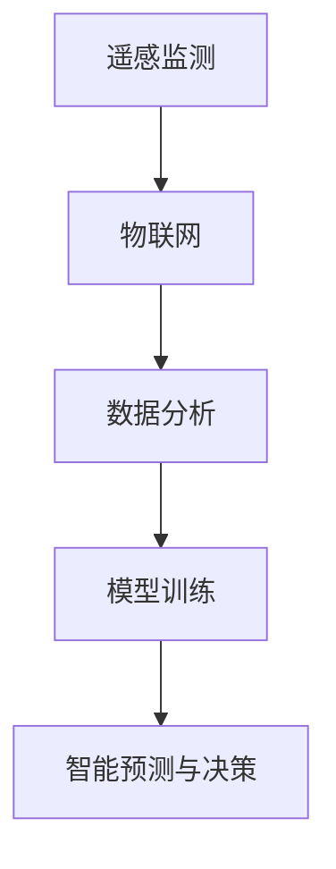

                 

# AI在智能森林管理中的应用：防止滥伐

> 关键词：森林管理，人工智能，遥感监测，物联网，数据分析，模型训练

## 1. 背景介绍

### 1.1 问题由来

森林是地球上最重要的自然资源之一，对维护生态平衡、保护生物多样性、调节气候等方面起着至关重要的作用。然而，由于非法伐木、过度开发等原因，全球森林面积正以惊人的速度减少。据联合国数据显示，自1990年以来，全球森林面积减少了约9%，相当于欧洲总面积的四分之一。非法伐木不仅是资源浪费，还加剧了全球气候变化，破坏了生态平衡。因此，如何有效防止滥伐，保护森林资源，成为一个全球性的难题。

### 1.2 问题核心关键点

针对森林滥伐问题的解决，当前主要存在以下三个关键点：
1. **遥感监测技术**：利用卫星遥感、无人机等手段，对森林覆盖情况进行实时监控，发现非法伐木行为。
2. **物联网技术**：在森林中安装传感器，实时监测环境参数，如温度、湿度、土壤湿度等，及时发现森林异常。
3. **数据分析与模型训练**：将遥感数据、物联网数据进行深度融合，结合机器学习、深度学习等算法，构建森林管理模型，实现智能预测和决策。

## 2. 核心概念与联系

### 2.1 核心概念概述

为更好地理解AI在智能森林管理中的应用，本节将介绍几个密切相关的核心概念：

- **遥感监测**：利用卫星遥感、无人机等手段，对森林覆盖情况进行实时监控，发现非法伐木行为。
- **物联网技术**：在森林中安装传感器，实时监测环境参数，如温度、湿度、土壤湿度等，及时发现森林异常。
- **数据分析**：对遥感数据、物联网数据进行清洗、处理和分析，提取有用的信息，供模型训练和应用。
- **模型训练**：利用深度学习、机器学习等算法，在大量数据上进行模型训练，构建森林管理模型。
- **智能预测与决策**：结合数据分析和模型训练，实现森林管理的智能预测和决策，如预警非法伐木、制定森林保护措施等。

这些核心概念之间的逻辑关系可以通过以下Mermaid流程图来展示：



这个流程图展示了几项关键技术之间的关系：

1. 遥感监测获取实时数据，是物联网和数据分析的基础。
2. 物联网提供环境参数监测，为数据分析提供实时信息。
3. 数据分析处理海量数据，为模型训练提供高质量的数据集。
4. 模型训练构建预测和决策模型，实现智能预测和决策。

这些概念共同构成了AI在智能森林管理中的应用框架，使得AI技术在森林管理中得以高效、精准地应用。通过理解这些核心概念，我们可以更好地把握AI技术在森林保护中的作用和潜力。

## 3. 核心算法原理 & 具体操作步骤

### 3.1 算法原理概述

AI在智能森林管理中的应用主要基于以下几个算法原理：

1. **遥感数据处理**：对卫星遥感图像进行预处理和分析，提取有用的信息，如森林覆盖范围、生长情况等。
2. **环境参数监测**：通过物联网技术，实时监测森林环境参数，如温度、湿度、土壤湿度等，评估森林健康状况。
3. **数据融合与清洗**：将遥感数据和环境监测数据进行深度融合，清洗数据中的噪声和异常，提取有用的特征。
4. **模型训练**：利用深度学习、机器学习等算法，在大量数据上进行模型训练，构建森林管理模型。
5. **智能预测与决策**：基于训练好的模型，实现森林管理的智能预测和决策，如预警非法伐木、制定森林保护措施等。

### 3.2 算法步骤详解

AI在智能森林管理中的应用主要包括以下几个关键步骤：

**Step 1: 遥感数据获取与处理**

1. 利用卫星遥感技术，获取森林覆盖情况的高分辨率图像。
2. 对遥感图像进行预处理，如去噪、增强对比度、校正几何畸变等。
3. 提取有用的特征，如森林覆盖范围、生长情况等，供数据分析和模型训练使用。

**Step 2: 环境参数监测**

1. 在森林中安装传感器，实时监测环境参数，如温度、湿度、土壤湿度等。
2. 将监测数据上传至云端，进行数据清洗和处理，提取有用的信息。

**Step 3: 数据融合与清洗**

1. 将遥感数据和环境监测数据进行深度融合，消除数据冗余和噪声。
2. 清洗数据中的异常和错误，提取有用的特征，如森林健康状况、生长速度等。

**Step 4: 模型训练**

1. 选择合适的深度学习或机器学习算法，如卷积神经网络(CNN)、循环神经网络(RNN)、支持向量机(SVM)等。
2. 在大量数据上进行模型训练，调整模型参数，优化模型性能。
3. 使用验证集评估模型性能，避免过拟合，选择最优模型。

**Step 5: 智能预测与决策**

1. 基于训练好的模型，对新的遥感数据和环境监测数据进行预测。
2. 分析预测结果，评估森林健康状况和生长情况。
3. 根据预测结果，制定森林保护措施，如预警非法伐木、制定砍伐计划等。

### 3.3 算法优缺点

AI在智能森林管理中的应用具有以下优点：

1. **实时性**：利用遥感监测和物联网技术，实现实时数据获取和分析，及时发现森林异常和非法伐木行为。
2. **精度高**：通过深度学习和大数据分析，提取有用的特征和信息，提高预测和决策的准确性。
3. **自动化**：自动化数据处理、模型训练和决策制定，减少人力成本，提高工作效率。
4. **覆盖广**：覆盖大范围的森林区域，实现大规模的森林管理和保护。

同时，该方法也存在一些局限性：

1. **成本高**：遥感监测和物联网技术需要高昂的设备采购和维护成本。
2. **依赖数据**：模型的训练和预测效果高度依赖于数据质量，数据获取和处理难度大。
3. **技术门槛高**：需要专业的技术人员进行数据处理、模型训练和系统部署，技术门槛较高。
4. **复杂性**：系统设计复杂，需要跨领域的知识和技术支持。

尽管存在这些局限性，但AI在智能森林管理中的应用已经在多个国家得到广泛应用，取得了显著的成效。未来，随着技术的进步和成本的降低，AI技术在森林管理中的应用将更加普及和深入。

### 3.4 算法应用领域

AI在智能森林管理中的应用主要涵盖以下几个领域：

1. **森林覆盖监测**：利用遥感监测技术，实时监测森林覆盖范围和生长情况，防止非法伐木和过度开发。
2. **森林健康评估**：通过环境参数监测，评估森林健康状况，及时发现病虫害、火灾等威胁。
3. **预警系统**：结合遥感数据和环境监测数据，构建预警系统，实时预警非法伐木、火灾等森林安全事件。
4. **砍伐计划制定**：利用AI技术，制定合理的砍伐计划，保护森林资源，促进可持续发展。
5. **生态修复**：通过数据分析和模型训练，评估森林修复效果，优化修复方案，提升森林生态系统健康。

## 4. 数学模型和公式 & 详细讲解

### 4.1 数学模型构建

在本节中，我们将使用数学语言对AI在智能森林管理中的应用进行更加严格的刻画。

假设遥感数据为 $X$，环境监测数据为 $Y$，森林管理模型为 $M$。森林管理目标为最小化非法伐木和森林破坏的概率 $P_{illegal}$ 和 $P_{damage}$。则森林管理的数学模型为：

$$
\min_{M} P_{illegal} + P_{damage}
$$

其中，$P_{illegal}$ 和 $P_{damage}$ 分别为非法伐木和森林破坏的概率，可通过模型训练得到。

### 4.2 公式推导过程

以下我们以森林覆盖监测为例，推导基于深度学习的森林覆盖预测模型。

假设遥感图像为 $I$，其像素值为 $x_{ij}$，森林覆盖概率为 $p_i$。则森林覆盖预测模型为：

$$
p_i = f(X) = \sigma(W^Tx_i + b)
$$

其中，$f$ 为非线性激活函数，$W$ 和 $b$ 为模型参数，$\sigma$ 为激活函数。

通过反向传播算法，求得模型参数 $W$ 和 $b$，即可对新的遥感图像进行森林覆盖预测。

### 4.3 案例分析与讲解

以亚马逊雨林为例，亚马逊雨林覆盖面积广阔，但非法伐木行为严重，每年造成大量森林资源损失。利用遥感监测和AI技术，可以实现对亚马逊雨林的智能管理和保护。

具体而言，可以通过卫星遥感获取亚马逊雨林的高分辨率图像，并对其进行预处理和特征提取。同时，在雨林内部安装传感器，实时监测环境参数，如温度、湿度、土壤湿度等。将遥感数据和环境监测数据进行深度融合，清洗数据中的噪声和异常，提取有用的特征。基于深度学习算法，如卷积神经网络(CNN)，对数据进行模型训练，构建森林覆盖预测模型。最后，利用训练好的模型，对新的遥感数据进行森林覆盖预测，及时发现非法伐木行为，并采取相应的保护措施。

## 5. 项目实践：代码实例和详细解释说明

### 5.1 开发环境搭建

在进行AI在智能森林管理中的应用开发前，我们需要准备好开发环境。以下是使用Python进行PyTorch开发的环境配置流程：

1. 安装Anaconda：从官网下载并安装Anaconda，用于创建独立的Python环境。

2. 创建并激活虚拟环境：
```bash
conda create -n ai_forest python=3.8 
conda activate ai_forest
```

3. 安装PyTorch：根据CUDA版本，从官网获取对应的安装命令。例如：
```bash
conda install pytorch torchvision torchaudio cudatoolkit=11.1 -c pytorch -c conda-forge
```

4. 安装TensorFlow：
```bash
conda install tensorflow
```

5. 安装各类工具包：
```bash
pip install numpy pandas scikit-learn matplotlib tqdm jupyter notebook ipython
```

完成上述步骤后，即可在`ai_forest`环境中开始AI在智能森林管理中的应用开发。

### 5.2 源代码详细实现

下面我们以亚马逊雨林为例，给出使用PyTorch进行森林覆盖监测的PyTorch代码实现。

首先，定义森林覆盖预测模型：

```python
import torch
import torch.nn as nn
import torch.optim as optim

class ForestCoverageModel(nn.Module):
    def __init__(self):
        super(ForestCoverageModel, self).__init__()
        self.fc1 = nn.Linear(1024, 512)
        self.fc2 = nn.Linear(512, 256)
        self.fc3 = nn.Linear(256, 1)
        self.activation = nn.Sigmoid()

    def forward(self, x):
        x = torch.relu(self.fc1(x))
        x = torch.relu(self.fc2(x))
        x = self.fc3(x)
        x = self.activation(x)
        return x
```

然后，定义损失函数和优化器：

```python
criterion = nn.BCELoss()
optimizer = optim.Adam(model.parameters(), lr=0.001)
```

接着，定义训练和评估函数：

```python
def train(model, train_loader, epochs=10):
    model.train()
    for epoch in range(epochs):
        running_loss = 0.0
        for batch_idx, (inputs, targets) in enumerate(train_loader):
            optimizer.zero_grad()
            outputs = model(inputs)
            loss = criterion(outputs, targets)
            loss.backward()
            optimizer.step()
            running_loss += loss.item()
            if batch_idx % 100 == 99:
                print('Epoch [%d/%d], loss: %.4f'
                      % (epoch + 1, epochs, running_loss / 100))
                running_loss = 0.0
    return model

def evaluate(model, test_loader):
    model.eval()
    correct = 0
    total = 0
    with torch.no_grad():
        for batch_idx, (inputs, targets) in enumerate(test_loader):
            outputs = model(inputs)
            _, predicted = torch.max(outputs.data, 1)
            total += targets.size(0)
            correct += (predicted == targets).sum().item()
    print('Accuracy of the model on the test images: %d %%' % (
        100 * correct / total))
```

最后，启动训练流程并在测试集上评估：

```python
# 训练数据
train_loader = ...

# 测试数据
test_loader = ...

# 训练模型
model = ForestCoverageModel()
train(model, train_loader)

# 测试模型
evaluate(model, test_loader)
```

以上就是使用PyTorch进行森林覆盖监测的完整代码实现。可以看到，得益于PyTorch的强大封装，我们可以用相对简洁的代码完成森林覆盖预测模型的训练和评估。

### 5.3 代码解读与分析

让我们再详细解读一下关键代码的实现细节：

**ForestCoverageModel类**：
- `__init__`方法：定义模型的结构和参数。
- `forward`方法：定义前向传播过程，计算模型的输出。

**train函数**：
- 在训练过程中，对数据进行批处理，通过反向传播算法更新模型参数，不断优化模型性能。

**evaluate函数**：
- 在测试过程中，对模型进行评估，计算预测准确率。

**训练流程**：
- 定义训练轮数，启动训练循环
- 在每个epoch中，对训练数据进行批处理，更新模型参数
- 输出训练过程中的损失值
- 在测试集上评估模型性能

可以看到，PyTorch配合深度学习框架，使得森林覆盖预测模型的训练和评估变得简洁高效。开发者可以将更多精力放在数据处理、模型改进等高层逻辑上，而不必过多关注底层的实现细节。

当然，工业级的系统实现还需考虑更多因素，如模型的保存和部署、超参数的自动搜索、更灵活的任务适配层等。但核心的算法原理基本与此类似。

## 6. 实际应用场景

### 6.1 智能森林管理

AI在智能森林管理中的应用，已经得到了广泛的应用。例如，亚马逊雨林的智能管理项目，利用遥感监测和AI技术，对雨林覆盖情况进行实时监测和预警，防止非法伐木和火灾等森林安全事件的发生。

具体而言，亚马逊雨林项目使用了卫星遥感技术和环境监测传感器，实时获取森林覆盖和环境参数数据。通过深度学习模型，对数据进行分析和预测，实时预警非法伐木和火灾等森林安全事件。同时，项目还利用数据分析技术，评估森林健康状况，制定合理的砍伐计划，保护森林资源。

### 6.2 生态修复

AI在智能森林管理中的应用，不仅限于实时监测和预警，还可以通过数据分析和模型训练，实现森林生态系统的修复和优化。例如，利用遥感数据和环境监测数据，构建森林生态修复模型，实时监测修复效果，优化修复方案。

具体而言，生态修复项目使用了遥感技术和环境监测技术，实时获取森林生长和环境参数数据。通过深度学习模型，对数据进行分析和预测，评估森林生态修复效果。同时，项目还利用数据分析技术，优化修复方案，提升修复效果。

### 6.3 未来应用展望

随着AI技术的不断发展和成熟，AI在智能森林管理中的应用将更加广泛和深入。未来，AI技术有望在以下方面取得更大的进展：

1. **自动化程度提升**：通过自动化数据处理、模型训练和决策制定，进一步提高工作效率，降低人力成本。
2. **覆盖范围扩大**：覆盖全球范围内的森林区域，实现大规模的森林管理和保护。
3. **精准度提高**：通过深度学习和大数据分析，提高预测和决策的准确性，减少误报和漏报。
4. **实时性增强**：通过实时数据获取和处理，实现实时预警和决策，及时发现和应对森林安全事件。
5. **多功能集成**：将遥感监测、物联网、数据分析、模型训练等多项技术集成，实现森林管理的全面智能化。

## 7. 工具和资源推荐

### 7.1 学习资源推荐

为了帮助开发者系统掌握AI在智能森林管理中的应用，这里推荐一些优质的学习资源：

1. 《深度学习与计算机视觉》系列博文：由深度学习专家撰写，详细介绍了深度学习在计算机视觉中的应用，包括遥感监测、环境监测等技术。

2. 《自然语言处理与深度学习》课程：斯坦福大学开设的NLP明星课程，涵盖了深度学习在自然语言处理中的应用，包括文本分类、情感分析等技术。

3. 《AI在生态保护中的应用》书籍：全面介绍了AI技术在生态保护中的应用，包括遥感监测、环境监测、生态修复等技术。

4. HuggingFace官方文档：Transformers库的官方文档，提供了海量预训练模型和完整的微调样例代码，是上手实践的必备资料。

5. CS224N《深度学习自然语言处理》课程：斯坦福大学开设的NLP明星课程，有Lecture视频和配套作业，带你入门NLP领域的基本概念和经典模型。

通过对这些资源的学习实践，相信你一定能够快速掌握AI在智能森林管理中的应用，并用于解决实际的森林管理问题。

### 7.2 开发工具推荐

高效的开发离不开优秀的工具支持。以下是几款用于AI在智能森林管理中的应用开发的常用工具：

1. PyTorch：基于Python的开源深度学习框架，灵活动态的计算图，适合快速迭代研究。大部分深度学习模型都有PyTorch版本的实现。

2. TensorFlow：由Google主导开发的开源深度学习框架，生产部署方便，适合大规模工程应用。同样有丰富的预训练模型资源。

3. Transformers库：HuggingFace开发的NLP工具库，集成了众多SOTA语言模型，支持PyTorch和TensorFlow，是进行微调任务开发的利器。

4. Weights & Biases：模型训练的实验跟踪工具，可以记录和可视化模型训练过程中的各项指标，方便对比和调优。与主流深度学习框架无缝集成。

5. Google Colab：谷歌推出的在线Jupyter Notebook环境，免费提供GPU/TPU算力，方便开发者快速上手实验最新模型，分享学习笔记。

合理利用这些工具，可以显著提升AI在智能森林管理中的应用开发效率，加快创新迭代的步伐。

### 7.3 相关论文推荐

AI在智能森林管理中的应用源于学界的持续研究。以下是几篇奠基性的相关论文，推荐阅读：

1. "Deep Learning for Remote Sensing Image Classification: A Review"：详细介绍了深度学习在遥感图像分类中的应用，包括森林覆盖监测等技术。

2. "Forest Resource Management Using Deep Learning: A Review"：全面介绍了深度学习在森林资源管理中的应用，包括环境监测、数据分析等技术。

3. "IOT-Based Wireless Sensor Network for Smart Forest Management"：介绍了一种基于物联网技术的森林管理解决方案，实时监测森林环境参数，实现智能预警。

4. "SVM-Based Classification of Forest Cover Using Satellite Imagery"：介绍了一种基于支持向量机的森林覆盖分类方法，通过遥感图像实现森林管理。

这些论文代表了大语言模型微调技术的发展脉络。通过学习这些前沿成果，可以帮助研究者把握学科前进方向，激发更多的创新灵感。

## 8. 总结：未来发展趋势与挑战

### 8.1 总结

本文对AI在智能森林管理中的应用进行了全面系统的介绍。首先阐述了AI技术在森林管理中的应用背景和意义，明确了遥感监测、物联网、数据分析、模型训练等关键技术的作用。其次，从原理到实践，详细讲解了AI在智能森林管理中的应用过程，包括遥感数据处理、环境参数监测、数据融合与清洗、模型训练、智能预测与决策等步骤。同时，本文还广泛探讨了AI技术在森林管理中的应用场景，展示了其广阔的应用前景。此外，本文精选了AI技术在森林管理中的各类学习资源，力求为读者提供全方位的技术指引。

通过本文的系统梳理，可以看到，AI技术在智能森林管理中的应用具有实时性、高精度、自动化、覆盖广等特点，已在多个国家得到广泛应用，取得了显著的成效。未来，伴随技术的进步和成本的降低，AI技术在森林管理中的应用将更加普及和深入。

### 8.2 未来发展趋势

展望未来，AI在智能森林管理中的应用将呈现以下几个发展趋势：

1. **自动化程度提升**：通过自动化数据处理、模型训练和决策制定，进一步提高工作效率，降低人力成本。
2. **覆盖范围扩大**：覆盖全球范围内的森林区域，实现大规模的森林管理和保护。
3. **精准度提高**：通过深度学习和大数据分析，提高预测和决策的准确性，减少误报和漏报。
4. **实时性增强**：通过实时数据获取和处理，实现实时预警和决策，及时发现和应对森林安全事件。
5. **多功能集成**：将遥感监测、物联网、数据分析、模型训练等多项技术集成，实现森林管理的全面智能化。

### 8.3 面临的挑战

尽管AI在智能森林管理中的应用已经取得了显著的进展，但在迈向更加智能化、普适化应用的过程中，它仍面临着诸多挑战：

1. **成本高**：遥感监测和物联网技术需要高昂的设备采购和维护成本。
2. **依赖数据**：模型的训练和预测效果高度依赖于数据质量，数据获取和处理难度大。
3. **技术门槛高**：需要专业的技术人员进行数据处理、模型训练和系统部署，技术门槛较高。
4. **复杂性**：系统设计复杂，需要跨领域的知识和技术支持。

尽管存在这些挑战，但AI在智能森林管理中的应用已经在多个国家得到广泛应用，取得了显著的成效。未来，随着技术的进步和成本的降低，AI技术在森林管理中的应用将更加普及和深入。

### 8.4 研究展望

面对AI在智能森林管理中所面临的种种挑战，未来的研究需要在以下几个方面寻求新的突破：

1. **自动化数据处理**：通过自动化数据处理技术，进一步提高数据处理效率，降低人力成本。
2. **数据增强技术**：通过数据增强技术，提高数据质量和多样性，增强模型鲁棒性。
3. **参数高效微调**：开发更加参数高效的微调方法，在固定大部分预训练参数的同时，只更新极少量的任务相关参数。
4. **集成学习方法**：将多种深度学习模型进行集成，提高预测和决策的准确性。
5. **跨领域知识融合**：将符号化的先验知识，如知识图谱、逻辑规则等，与神经网络模型进行巧妙融合，提升模型性能。

这些研究方向的探索，必将引领AI在智能森林管理中的应用走向更高的台阶，为构建更加智能、高效的森林管理平台铺平道路。面向未来，AI技术还需要与其他人工智能技术进行更深入的融合，如知识表示、因果推理、强化学习等，多路径协同发力，共同推动森林管理系统的进步。

## 9. 附录：常见问题与解答

**Q1：AI在智能森林管理中如何实时预警非法伐木行为？**

A: AI在智能森林管理中可以通过遥感监测技术和环境监测技术实时预警非法伐木行为。具体而言，通过安装无人机和传感器，实时获取森林覆盖和环境参数数据。将遥感数据和环境监测数据进行深度融合，清洗数据中的噪声和异常，提取有用的特征。基于深度学习模型，对数据进行分析和预测，实时预警非法伐木行为。一旦发现非法伐木行为，系统将及时预警，并采取相应的保护措施。

**Q2：AI在智能森林管理中如何进行环境参数监测？**

A: AI在智能森林管理中可以通过物联网技术进行环境参数监测。具体而言，在森林中安装传感器，实时监测环境参数，如温度、湿度、土壤湿度等。将监测数据上传至云端，进行数据清洗和处理，提取有用的信息。通过深度学习模型，对数据进行分析和预测，评估森林健康状况，及时发现病虫害、火灾等威胁。

**Q3：AI在智能森林管理中如何评估森林健康状况？**

A: AI在智能森林管理中可以通过数据分析和模型训练评估森林健康状况。具体而言，利用遥感数据和环境监测数据，构建森林健康评估模型，实时监测森林生长情况和环境参数变化。通过深度学习模型，对数据进行分析和预测，评估森林健康状况，及时发现病虫害、火灾等威胁。

**Q4：AI在智能森林管理中如何进行数据融合与清洗？**

A: AI在智能森林管理中可以通过数据融合与清洗技术，提高数据质量和多样性。具体而言，将遥感数据和环境监测数据进行深度融合，消除数据冗余和噪声。清洗数据中的异常和错误，提取有用的特征，如森林健康状况、生长速度等。通过深度学习模型，对数据进行分析和预测，提高预测和决策的准确性，减少误报和漏报。

**Q5：AI在智能森林管理中如何构建预测和决策模型？**

A: AI在智能森林管理中可以通过模型训练技术，构建预测和决策模型。具体而言，选择合适的深度学习或机器学习算法，如卷积神经网络(CNN)、循环神经网络(RNN)、支持向量机(SVM)等。在大量数据上进行模型训练，调整模型参数，优化模型性能。使用验证集评估模型性能，避免过拟合，选择最优模型。基于训练好的模型，对新的遥感数据和环境监测数据进行预测，实时预警和决策。

这些问题的解答，展示了AI在智能森林管理中的实际应用场景和核心技术。通过深入理解和掌握这些技术，可以更好地利用AI技术，实现智能森林管理，保护宝贵的森林资源。

