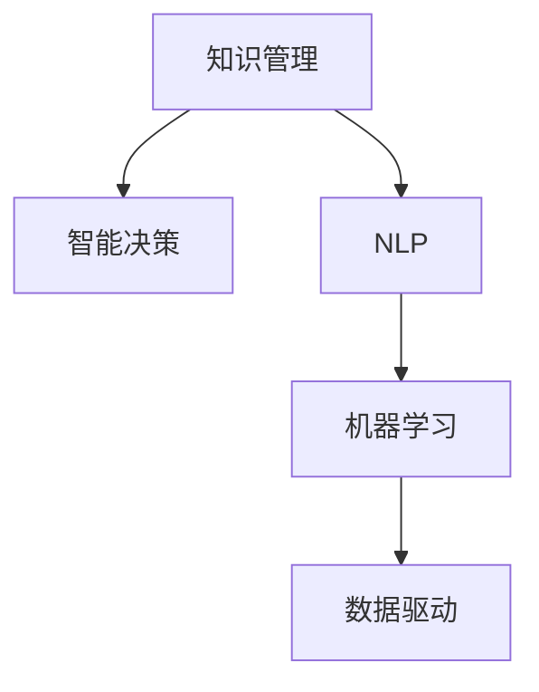

                 

# 面向企业提供知识咨询、培训和解决方案

> 关键词：知识管理,咨询服务,员工培训,业务解决方案,人工智能,数据驱动,智能决策

## 1. 背景介绍

### 1.1 问题由来
在当前信息爆炸的时代，企业面临着知识获取、存储、共享和应用的多重挑战。传统的信息检索、文件管理等方式已难以满足企业快速响应市场变化、提升核心竞争力的需求。为解决这一问题，许多企业开始探索新的知识管理策略，希望能在知识经济时代中占据优势。

### 1.2 问题核心关键点
面对上述挑战，企业知识管理的核心关键点包括：
- 高效知识获取：通过智能搜索引擎、自动化抽取等方式，快速获取企业内外部相关知识。
- 全面知识存储：构建企业知识库，实现知识分类、归档、版本控制等功能。
- 有效知识共享：促进知识在员工之间、部门之间的流动，构建知识社区，增强协同效应。
- 精准知识应用：通过数据分析、机器学习等技术，从知识中提炼出可操作性的业务方案和策略。

## 2. 核心概念与联系

### 2.1 核心概念概述

为更好地理解企业知识管理与智能决策的实现，本节将介绍几个密切相关的核心概念：

- 知识管理(Knowledge Management, KM)：指通过技术和管理手段，优化企业知识获取、存储、共享和应用的过程，提升企业的决策能力与创新能力。
- 智能决策(Intelligent Decision Making)：指利用人工智能技术，自动化、智能化地进行决策过程，减少人为干预，提高决策效率和精准度。
- 自然语言处理(Natural Language Processing, NLP)：利用人工智能技术，使计算机能够理解、解释、生成自然语言，以支持知识获取和知识应用。
- 机器学习(Machine Learning)：指通过数据训练模型，使其能够自动学习规律，解决特定问题或完成特定任务。
- 数据驱动(Data-Driven)：指以数据为基础，通过分析数据、挖掘数据，做出决策和预测，支撑企业运营和管理。

这些核心概念之间的逻辑关系可以通过以下Mermaid流程图来展示：



这个流程图展示了一个典型的企业知识管理架构：

1. 知识管理通过技术和制度手段，优化知识获取、存储、共享和应用。
2. 智能决策则利用人工智能技术，自动化、智能化地进行决策过程。
3. NLP作为知识获取的工具，帮助企业从文本数据中提取有价值的信息。
4. 机器学习用于训练模型，从海量数据中学习规律，支持决策和预测。
5. 数据驱动则强调基于数据的决策过程，强调数据对决策的支持作用。

这些概念共同构成了企业知识管理与智能决策的框架，为企业提供了数据驱动、智能决策的基础设施。

## 3. 核心算法原理 & 具体操作步骤
### 3.1 算法原理概述

面向企业提供知识咨询、培训和解决方案的算法原理，主要基于数据驱动和智能决策。其核心思想是通过收集和分析企业的内部数据与外部数据，构建知识库和模型，自动生成知识咨询、培训和解决方案，帮助企业快速响应市场变化，提升决策效率和精准度。

形式化地，假设企业内部和外部数据集为 $D=\{(x_i,y_i)\}_{i=1}^N$，其中 $x_i$ 为输入特征，$y_i$ 为目标变量。构建的知识库为 $K=\{(k_i,v_i)\}_{i=1}^M$，其中 $k_i$ 为知识主题，$v_i$ 为对应的知识描述。

知识管理的目标是最大化知识库 $K$ 和模型 $M$ 在数据集 $D$ 上的预测准确度：

$$
\hat{K},\hat{M}=\mathop{\arg\min}_{K,M} \mathcal{L}(K,M,D)
$$

其中 $\mathcal{L}$ 为损失函数，用于衡量知识库 $K$ 和模型 $M$ 的预测与实际目标之间的差异。常见的损失函数包括均方误差、交叉熵等。

通过梯度下降等优化算法，知识管理过程不断更新知识库 $K$ 和模型 $M$，最小化损失函数 $\mathcal{L}$，使得知识咨询、培训和解决方案的输出逼近真实目标。由于 $K$ 和 $M$ 已经通过数据获取和训练获得较好的初始化，因此即便在数据量较少的情况下，也能较快收敛到理想的知识库和模型。

### 3.2 算法步骤详解

面向企业提供知识咨询、培训和解决方案的算法步骤主要包括以下几个关键步骤：

**Step 1: 数据准备**
- 收集企业内外部相关数据，如业务文档、客户反馈、市场数据等。
- 清洗数据，去除噪音和异常值，确保数据质量。
- 对数据进行标注，确保数据的可解释性和可操作性。

**Step 2: 数据挖掘**
- 利用NLP技术对文本数据进行分词、实体抽取、情感分析等，提取有价值的信息。
- 使用机器学习算法对数据进行建模，识别数据中的规律和趋势。
- 通过可视化工具对数据进行探索性分析，找出数据中的关键特征和问题。

**Step 3: 知识存储与组织**
- 根据数据挖掘结果，构建企业知识库。
- 设计知识库的逻辑结构，确保知识库的合理性、可扩展性和易用性。
- 使用数据管理工具对知识库进行维护和更新，确保知识的时效性和准确性。

**Step 4: 知识咨询与推荐**
- 根据企业的需求，构建知识咨询系统，利用自然语言处理技术，将企业问题转化为可搜索的形式。
- 利用知识库中的知识，自动生成回答，推荐给企业。
- 提供知识相关的引用、注释和讨论功能，增强知识的应用效果。

**Step 5: 知识培训**
- 根据企业岗位需求，设计知识培训课程。
- 使用人工智能技术，自动化生成课程内容，推荐合适的学习材料。
- 利用智能评估系统，对学员的学习效果进行评估，提供个性化学习建议。

**Step 6: 解决方案生成**
- 根据企业的问题和数据，构建机器学习模型，自动生成业务解决方案。
- 利用模型预测能力，提供多种可能的解决方案。
- 通过对比分析，选择最优的解决方案，生成详细的实施方案。

**Step 7: 模型优化与迭代**
- 定期评估知识库和模型的效果，发现不足之处。
- 根据企业反馈，调整知识库和模型，不断优化。
- 引入新的数据，持续迭代，提升知识库和模型的性能。

以上是面向企业提供知识咨询、培训和解决方案的完整算法步骤。在实际应用中，还需要针对具体企业的需求，对各个环节进行优化设计，如改进数据挖掘算法，引入更多先验知识，加强知识库与模型的结合等，以进一步提升效果。

### 3.3 算法优缺点

面向企业提供知识咨询、培训和解决方案的算法具有以下优点：
1. 高效性：利用大数据和人工智能技术，自动生成知识咨询、培训和解决方案，显著提升企业决策效率。
2. 可扩展性：知识库和模型可以根据企业需求动态扩展，适应不同业务场景。
3. 灵活性：能够根据企业实时数据，自动生成定制化的知识咨询、培训和解决方案，满足企业多样化需求。
4. 可操作性：通过可视化工具和智能评估系统，提供易于理解和操作的知识服务。

同时，该算法也存在以下局限性：
1. 数据依赖性强：知识管理的效果很大程度上取决于数据的质量和数量，数据获取成本较高。
2. 模型复杂度高：知识库和模型构建需要大量计算资源和时间，复杂度较高。
3. 算法透明度低：部分知识库和模型的构建过程缺乏可解释性，难以对其推理逻辑进行调试。
4. 业务场景有限：目前技术主要应用于知识获取和知识咨询，对于复杂业务场景的应用可能存在局限性。

尽管存在这些局限性，但就目前而言，面向企业提供知识咨询、培训和解决方案的算法仍是一个高效、灵活的智能决策工具。未来相关研究的重点在于如何进一步降低对数据和算力的依赖，提高算法的透明度和可解释性，拓展算法的应用场景。

### 3.4 算法应用领域

面向企业提供知识咨询、培训和解决方案的算法，在以下几个领域得到了广泛的应用：

- 企业决策支持：通过构建知识库和模型，自动生成决策建议，提升决策效率和精准度。
- 客户关系管理(CRM)：利用知识库中的客户数据，自动生成客户画像和客户沟通方案。
- 人力资源管理：根据员工的技能和绩效，推荐适合的培训课程，帮助员工提升职业能力。
- 供应链管理：通过数据分析，自动生成供应链优化方案，提升供应链效率。
- 财务分析：利用财务数据，自动生成财务报表和分析报告，支持财务决策。

除了上述这些经典应用外，算法还被创新性地应用到更多场景中，如市场营销、产品研发、项目管理等，为企业的运营和发展提供智能支持。随着技术的不断演进，面向企业提供知识咨询、培训和解决方案的算法必将在更多领域发挥更大的作用。

## 4. 数学模型和公式 & 详细讲解 & 举例说明
### 4.1 数学模型构建

本节将使用数学语言对面向企业提供知识咨询、培训和解决方案的算法进行更加严格的刻画。

记企业内部和外部数据集为 $D=\{(x_i,y_i)\}_{i=1}^N$，其中 $x_i \in \mathcal{X}$，$y_i \in \mathcal{Y}$。企业知识库为 $K=\{(k_i,v_i)\}_{i=1}^M$，其中 $k_i \in \mathcal{K}$，$v_i \in \mathcal{V}$。

知识管理的目标是最大化知识库 $K$ 和模型 $M$ 在数据集 $D$ 上的预测准确度：

$$
\hat{K},\hat{M}=\mathop{\arg\min}_{K,M} \mathcal{L}(K,M,D)
$$

其中 $\mathcal{L}$ 为损失函数，用于衡量知识库 $K$ 和模型 $M$ 的预测与实际目标之间的差异。常见的损失函数包括均方误差、交叉熵等。

在实践中，我们通常使用基于梯度的优化算法（如SGD、Adam等）来近似求解上述最优化问题。设 $\eta$ 为学习率，$\lambda$ 为正则化系数，则知识库和模型的更新公式为：

$$
K \leftarrow K - \eta \nabla_{K}\mathcal{L}(K,M,D) - \eta\lambda K
$$

$$
M \leftarrow M - \eta \nabla_{M}\mathcal{L}(K,M,D) - \eta\lambda M
$$

其中 $\nabla_{K}\mathcal{L}(K,M,D)$ 和 $\nabla_{M}\mathcal{L}(K,M,D)$ 分别表示知识库和模型的损失函数对各自参数的梯度，可通过反向传播算法高效计算。

### 4.2 公式推导过程

以下我们以企业决策支持为例，推导知识库和模型优化目标的数学模型。

假设企业面临的问题 $p_i$ 为二分类问题，即判断企业是否存在某种风险。知识库中包含企业历史数据 $x_i$ 和对应的结果 $y_i$，目标为最大化预测准确度。知识库中的知识 $k_i$ 为风险特征，$v_i$ 为对应的风险描述。

模型的输出为 $M(x_i)$，表示企业存在风险的概率。知识库的目标函数为：

$$
\mathcal{L}_{K}(K)=\frac{1}{N}\sum_{i=1}^{N}(y_i-y_{pred})^2
$$

其中 $y_{pred}=1$ 表示模型预测企业存在风险，$y_{pred}=0$ 表示模型预测企业不存在风险。

模型的目标函数为：

$$
\mathcal{L}_{M}(M)=\frac{1}{N}\sum_{i=1}^{N}(y_i-M(x_i))^2
$$

其中 $y_{pred}$ 表示模型预测结果。

将 $K$ 和 $M$ 联合优化，目标函数为：

$$
\mathcal{L}(K,M,D)=\mathcal{L}_{K}(K)+\mathcal{L}_{M}(M)
$$

通过梯度下降等优化算法，不断更新知识库和模型参数，最小化目标函数 $\mathcal{L}(K,M,D)$，使得知识库和模型的输出逼近真实标签。

### 4.3 案例分析与讲解

**案例分析：智能推荐系统**
企业需要根据用户的浏览记录和购买行为，推荐合适的商品。通过NLP技术，将用户的浏览记录转换为知识，构建知识库 $K$。知识库中的每个知识 $k_i$ 表示一个商品的属性，如品牌、价格、评价等，$v_i$ 表示对应的商品描述。

利用知识库 $K$ 和模型 $M$，自动生成推荐列表，推荐给用户。具体步骤如下：

1. 对用户浏览记录 $x_i$ 进行分词、实体抽取等预处理，构建知识库 $K$。
2. 利用模型 $M$ 对用户浏览记录进行预测，输出推荐的商品列表。
3. 根据用户反馈，调整知识库 $K$ 和模型 $M$，提升推荐效果。

智能推荐系统能够通过知识库和模型，快速、高效地生成推荐结果，帮助用户找到最合适的商品，提升用户满意度和企业销售额。

## 5. 项目实践：代码实例和详细解释说明
### 5.1 开发环境搭建

在进行知识咨询、培训和解决方案开发的实践前，我们需要准备好开发环境。以下是使用Python进行知识管理系统开发的环境配置流程：

1. 安装Anaconda：从官网下载并安装Anaconda，用于创建独立的Python环境。

2. 创建并激活虚拟环境：
```bash
conda create -n knowledge-env python=3.8 
conda activate knowledge-env
```

3. 安装Python科学计算库：
```bash
conda install numpy pandas scikit-learn torch torchvision torchaudio
```

4. 安装企业知识管理相关库：
```bash
pip install elasticsearch pyelasticsearch pyjwt transformers
```

5. 安装知识库管理工具：
```bash
pip install elasticsearch-dsl
```

完成上述步骤后，即可在`knowledge-env`环境中开始知识管理系统的开发。

### 5.2 源代码详细实现

下面以构建一个简单的知识管理系统为例，给出使用Python和ElasticSearch构建知识管理系统的代码实现。

首先，定义知识管理系统类：

```python
from elasticsearch import Elasticsearch
from elasticsearch_dsl import Document, Fields, Search

class KnowledgeManager:
    def __init__(self, index_name='knowledge'):
        self.es = Elasticsearch()
        self.index_name = index_name
        self.document = Document(index_name)
        self.setup_document()
        
    def setup_document(self):
        self.document.fields([
            Fields.text('content'),
            Fields.text('title'),
            Fields.keyword('type'),
            Fields.keyword('created_date'),
            Fields.keyword('modified_date')
        ])
        self.document.save()
```

然后，定义知识管理系统的基本操作：

```python
class KnowledgeManager:
    # 定义基本操作
    def add_knowledge(self, content, title, type, created_date, modified_date):
        data = {
            'content': content,
            'title': title,
            'type': type,
            'created_date': created_date,
            'modified_date': modified_date
        }
        self.es.index(index=self.index_name, body=data)
        
    def get_knowledge(self, query):
        result = self.es.search(index=self.index_name, body={'query': query})
        return result
```

最后，启动知识管理系统并测试：

```python
if __name__ == '__main__':
    km = KnowledgeManager()
    km.add_knowledge('这是一条知识记录', '知识标题', '类型1', '创建时间', '修改时间')
    result = km.get_knowledge({'query': {'match': {'title': '知识标题'}}})
    print(result)
```

以上就是使用Python和ElasticSearch构建一个简单的知识管理系统的完整代码实现。可以看到，通过ElasticSearch，我们能够高效地存储和检索知识库中的信息，构建出一个灵活、高效的知识管理系统。

### 5.3 代码解读与分析

让我们再详细解读一下关键代码的实现细节：

**KnowledgeManager类**：
- `__init__`方法：初始化ElasticSearch连接和文档结构。
- `setup_document`方法：定义文档结构，包括内容、标题、类型、创建日期和修改日期等字段。
- `add_knowledge`方法：向知识库添加新知识记录。
- `get_knowledge`方法：从知识库中检索知识记录，并返回结果。

**添加知识**：
- 通过`add_knowledge`方法，将新的知识记录添加到ElasticSearch中。
- 使用`body`参数传递知识记录的内容、标题、类型、创建日期和修改日期等信息。

**检索知识**：
- 通过`get_knowledge`方法，从知识库中检索符合条件的知识记录。
- 使用`query`参数传递检索条件，返回匹配结果。

**测试代码**：
- 在`main`函数中，创建一个`KnowledgeManager`对象，添加一条知识记录，并从知识库中检索该记录。
- 使用`print`输出检索结果。

可以看到，通过ElasticSearch，我们能够高效地存储和检索知识库中的信息，构建出一个灵活、高效的知识管理系统。开发者可以将更多精力放在知识库的设计、查询优化等方面，而不必过多关注底层的实现细节。

当然，工业级的系统实现还需考虑更多因素，如知识库的维护、索引优化、安全防护等。但核心的知识管理逻辑基本与此类似。

## 6. 实际应用场景
### 6.1 智能决策支持

知识管理系统可以用于构建智能决策支持系统，帮助企业快速响应市场变化，提升决策效率。具体而言，知识管理系统可以提供以下几个关键功能：

1. 知识检索：根据企业问题，自动检索知识库中的相关知识，辅助决策过程。
2. 知识推荐：利用知识图谱等工具，推荐相关知识，帮助企业寻找最佳解决方案。
3. 知识预测：通过机器学习算法，对未来趋势进行预测，支持企业制定战略。
4. 知识监控：实时监控企业运营数据，及时发现问题，提供决策支持。

通过这些功能，知识管理系统能够辅助企业快速决策，提升运营效率。

### 6.2 员工培训与发展

知识管理系统可以用于构建员工培训和发展平台，提升员工的技能和职业能力。具体而言，知识管理系统可以提供以下几个关键功能：

1. 知识库：构建全面的知识库，涵盖企业内部和外部知识，供员工学习和参考。
2. 培训课程：根据员工需求，设计适合的培训课程，并自动生成培训材料。
3. 评估系统：利用智能评估系统，对员工学习效果进行评估，提供个性化学习建议。
4. 知识社区：构建知识社区，促进员工之间的交流和协作，增强知识共享效果。

通过这些功能，知识管理系统能够提升员工的职业素养，促进企业知识共享，增强企业的创新能力。

### 6.3 客户关系管理

知识管理系统可以用于构建客户关系管理系统，提升客户满意度和忠诚度。具体而言，知识管理系统可以提供以下几个关键功能：

1. 客户画像：利用NLP技术，自动生成客户画像，了解客户需求和行为。
2. 客户沟通：根据客户画像，自动生成客户沟通方案，提升客户满意度。
3. 客户反馈：利用知识管理系统，收集客户反馈，优化产品和服务。
4. 客户关系管理：整合客户数据，构建客户关系网络，提升客户粘性。

通过这些功能，知识管理系统能够帮助企业更好地了解客户需求，提升客户满意度，增强客户忠诚度。

### 6.4 未来应用展望

面向企业提供知识咨询、培训和解决方案的知识管理系统，将在未来呈现以下几个发展趋势：

1. 知识库的多样化：未来知识库将涵盖更多元化的知识形式，如图像、视频、音频等，增强知识获取和应用效果。
2. 知识管理的智能化：利用人工智能技术，自动化、智能化地进行知识管理，提升知识获取和应用效率。
3. 知识应用的多样化：知识管理系统将应用于更多领域，如医疗、金融、制造等，帮助企业提升运营效率和创新能力。
4. 知识共享的协作化：知识管理系统将构建知识社区，促进企业内部和外部的知识共享和协作，增强知识应用效果。
5. 知识管理的全球化：知识管理系统将支持多语言和跨国别知识共享，增强企业的国际化能力。

以上趋势凸显了面向企业提供知识咨询、培训和解决方案的知识管理系统的发展前景。这些方向的探索发展，必将进一步提升企业知识管理的效率和效果，促进企业运营和管理水平的提升。

## 7. 工具和资源推荐
### 7.1 学习资源推荐

为了帮助开发者系统掌握面向企业提供知识咨询、培训和解决方案的理论基础和实践技巧，这里推荐一些优质的学习资源：

1. 《数据科学基础》系列博文：由知名数据科学家撰写，介绍了数据科学的基础知识，涵盖数据获取、数据清洗、数据分析、数据可视化等环节，是知识管理系统开发的基础。

2. 《自然语言处理》系列博文：介绍了自然语言处理的基本概念和常用技术，涵盖词向量、情感分析、实体识别、文本分类等，为知识管理系统提供重要的技术支持。

3. 《机器学习》系列博文：由机器学习专家撰写，介绍了机器学习的基本原理和常用算法，涵盖监督学习、无监督学习、半监督学习等，为知识管理系统提供算法的支持。

4. 《数据驱动决策》系列书籍：介绍了数据驱动决策的基本概念和常用方法，涵盖数据可视化、数据分析、预测建模等，为知识管理系统提供决策支持。

5. 《ElasticSearch官方文档》：ElasticSearch官方文档，提供了ElasticSearch的使用指南和API参考，是构建知识管理系统的重要参考。

通过对这些资源的学习实践，相信你一定能够快速掌握面向企业提供知识咨询、培训和解决方案的知识管理系统的核心技术，并用于解决实际的业务问题。

### 7.2 开发工具推荐

高效的开发离不开优秀的工具支持。以下是几款用于知识管理系统开发的工具：

1. Python：广泛使用的编程语言，具备丰富的科学计算库和数据分析工具，适用于知识管理系统开发。

2. ElasticSearch：高性能的搜索引擎，支持实时搜索、全文检索、分布式部署等功能，是构建知识管理系统的重要组件。

3. PyTorch：基于Python的开源深度学习框架，灵活动态的计算图，适合快速迭代研究。

4. TensorFlow：由Google主导开发的开源深度学习框架，生产部署方便，适合大规模工程应用。

5. Weights & Biases：模型训练的实验跟踪工具，可以记录和可视化模型训练过程中的各项指标，方便对比和调优。

6. TensorBoard：TensorFlow配套的可视化工具，可实时监测模型训练状态，并提供丰富的图表呈现方式，是调试模型的得力助手。

合理利用这些工具，可以显著提升知识管理系统的开发效率，加快创新迭代的步伐。

### 7.3 相关论文推荐

面向企业提供知识咨询、培训和解决方案的知识管理系统，其理论基础主要基于数据科学和自然语言处理。以下是几篇奠基性的相关论文，推荐阅读：

1. 《数据科学与知识管理》：介绍数据科学和知识管理的基本概念和技术，强调数据和知识在企业运营和管理中的应用。

2. 《自然语言处理与知识管理》：探讨自然语言处理和知识管理的融合应用，涵盖文本挖掘、实体识别、情感分析等技术。

3. 《机器学习与决策支持》：介绍机器学习在决策支持中的应用，涵盖监督学习、无监督学习、强化学习等算法。

4. 《数据驱动决策模型》：介绍数据驱动决策的基本概念和常用模型，涵盖时间序列分析、回归分析、分类分析等方法。

5. 《ElasticSearch搜索引擎应用》：介绍ElasticSearch在搜索引擎中的应用，涵盖全文检索、分布式部署、可视化展示等技术。

这些论文代表了大语言模型微调技术的发展脉络。通过学习这些前沿成果，可以帮助研究者把握学科前进方向，激发更多的创新灵感。

## 8. 总结：未来发展趋势与挑战

### 8.1 研究成果总结

面向企业提供知识咨询、培训和解决方案的知识管理系统，是数据科学和人工智能技术在企业中的应用典范。通过构建知识库和模型，实现知识获取、存储、共享和应用，辅助企业决策和运营。该系统在提升企业运营效率和创新能力方面具有显著效果，已被广泛应用于多个领域。

### 8.2 未来发展趋势

面向企业提供知识咨询、培训和解决方案的知识管理系统，将在未来呈现以下几个发展趋势：

1. 知识库的多元化：未来知识库将涵盖更多元化的知识形式，如图像、视频、音频等，增强知识获取和应用效果。
2. 知识管理的智能化：利用人工智能技术，自动化、智能化地进行知识管理，提升知识获取和应用效率。
3. 知识应用的多样化：知识管理系统将应用于更多领域，如医疗、金融、制造等，帮助企业提升运营效率和创新能力。
4. 知识共享的协作化：知识管理系统将构建知识社区，促进企业内部和外部的知识共享和协作，增强知识应用效果。
5. 知识管理的全球化：知识管理系统将支持多语言和跨国别知识共享，增强企业的国际化能力。

以上趋势凸显了面向企业提供知识咨询、培训和解决方案的知识管理系统的发展前景。这些方向的探索发展，必将进一步提升企业知识管理的效率和效果，促进企业运营和管理水平的提升。

### 8.3 面临的挑战

尽管面向企业提供知识咨询、培训和解决方案的知识管理系统已经取得了一定的成果，但在迈向更加智能化、普适化应用的过程中，它仍面临着诸多挑战：

1. 数据依赖性强：知识管理的效果很大程度上取决于数据的质量和数量，数据获取成本较高。如何进一步降低对数据的依赖，提高数据的质量和数量，将是关键问题。
2. 模型复杂度高：知识库和模型构建需要大量计算资源和时间，复杂度较高。如何简化模型结构，提高模型的计算效率，是未来发展的方向。
3. 算法透明度低：部分知识库和模型的构建过程缺乏可解释性，难以对其推理逻辑进行调试。如何提高算法的透明度和可解释性，将是重要的研究课题。
4. 业务场景有限：目前技术主要应用于知识获取和知识咨询，对于复杂业务场景的应用可能存在局限性。如何拓展技术的应用场景，提升系统的通用性，将是未来的重要方向。
5. 安全防护问题：知识管理系统涉及企业核心数据和机密信息，如何保障数据安全和模型安全，将是系统建设的重要任务。

### 8.4 研究展望

面向企业提供知识咨询、培训和解决方案的知识管理系统，需要在以下几个方向进行进一步的研究：

1. 探索无监督和半监督学习技术：摆脱对大规模标注数据的依赖，利用自监督学习、主动学习等无监督和半监督范式，最大限度利用非结构化数据，实现更加灵活高效的微调。
2. 研究参数高效和计算高效的微调范式：开发更加参数高效的微调方法，在固定大部分预训练参数的同时，只更新极少量的任务相关参数。同时优化微调模型的计算图，减少前向传播和反向传播的资源消耗，实现更加轻量级、实时性的部署。
3. 引入因果推断和对比学习思想：通过引入因果推断和对比学习思想，增强知识库和模型的因果关系学习，学习更加普适、鲁棒的语言表征，从而提升模型泛化性和抗干扰能力。
4. 强化知识库和模型的结合：将符号化的先验知识，如知识图谱、逻辑规则等，与神经网络模型进行巧妙融合，引导微调过程学习更准确、合理的语言模型。同时加强不同模态数据的整合，实现视觉、语音等多模态信息与文本信息的协同建模。
5. 纳入伦理道德约束：在模型训练目标中引入伦理导向的评估指标，过滤和惩罚有偏见、有害的输出倾向。同时加强人工干预和审核，建立模型行为的监管机制，确保输出符合人类价值观和伦理道德。

这些研究方向将推动知识管理系统向更加智能化、普适化和可靠化发展，为构建安全、可靠、可解释、可控的智能系统铺平道路。面向未来，知识管理系统需要与其他人工智能技术进行更深入的融合，如知识表示、因果推理、强化学习等，多路径协同发力，共同推动自然语言理解和智能交互系统的进步。只有勇于创新、敢于突破，才能不断拓展语言模型的边界，让智能技术更好地造福人类社会。

## 9. 附录：常见问题与解答

**Q1：知识管理系统是否适用于所有企业？**

A: 知识管理系统在大多数企业中都具有广泛的应用前景。但不同类型的企业，其知识管理的需求和场景各不相同。例如，制造业企业需要更侧重于生产流程和供应链管理，而金融企业则更侧重于风险控制和客户关系管理。因此，企业在选用知识管理系统时，应结合自身需求和业务特点，选择最适合自己的解决方案。

**Q2：如何确保知识管理系统中的知识安全？**

A: 知识管理系统中的知识安全主要通过以下几个方面来保障：
1. 访问控制：通过身份认证和权限管理，控制对知识库的访问权限。
2. 数据加密：对敏感数据进行加密处理，防止数据泄露。
3. 审计日志：记录用户的操作行为，便于追责和审计。
4. 备份和恢复：定期对知识库进行备份，保证数据的安全性和可靠性。

**Q3：知识管理系统的实现是否需要大量的数据？**

A: 知识管理系统确实需要大量的数据支持，但并非所有数据都是必需的。对于不同领域和企业，数据需求和获取难度各不相同。企业应根据自身业务需求，选择和收集必要的数据。对于无法获取的数据，可以通过合成数据、模拟数据等方式进行补充。

**Q4：如何提高知识管理系统的可扩展性？**

A: 提高知识管理系统的可扩展性，可以从以下几个方面入手：
1. 模块化设计：将知识管理系统设计为可插拔的模块，方便后期扩展和升级。
2. 容器化部署：使用Docker等容器化技术，实现知识管理系统的快速部署和迁移。
3. 微服务架构：采用微服务架构，提高系统的灵活性和可维护性。
4. 数据分布式存储：使用Hadoop、Spark等大数据平台，实现数据的分布式存储和处理。

**Q5：知识管理系统是否容易被攻击？**

A: 知识管理系统同样面临网络攻击的风险。为保障系统的安全，企业可以采取以下措施：
1. 安全防护：采用防火墙、入侵检测系统等安全防护措施，防止恶意攻击。
2. 定期更新：及时更新系统和软件，修复已知的安全漏洞。
3. 数据备份：定期备份数据，防止数据丢失或被破坏。
4. 安全培训：对员工进行安全意识培训，提高其安全防范能力。

通过合理的设计和措施，知识管理系统可以保障系统的安全性和可靠性，为企业提供高效的知识管理服务。

---

作者：禅与计算机程序设计艺术 / Zen and the Art of Computer Programming

