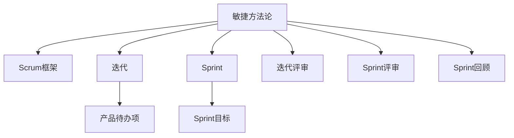

                 

# 项目管理：从启动到收尾的全流程指南

> 关键词：项目管理,敏捷开发,Scrum,敏捷方法论,瀑布模型,项目计划,风险管理,成本控制,交付质量,绩效评估

## 1. 背景介绍

### 1.1 问题由来
随着企业信息化进程的加速，项目管理已经成为企业管理中不可或缺的重要组成部分。传统的项目管理方法如瀑布模型已无法适应快速变化的市场需求，敏捷开发方法论如Scrum成为越来越多企业的选择。然而，尽管敏捷开发方法论得到广泛应用，许多企业在项目管理的实践中仍然存在诸多问题，如项目延期、质量不达标、成本超支、团队协作不畅等。

### 1.2 问题核心关键点
为应对这些问题，本文将介绍敏捷开发方法论的核心原则和实践，重点探讨Scrum框架下从项目启动到收尾的全流程管理方法。本文分为以下几部分：

- 敏捷方法论的核心理念
- Scrum框架的基本组成和关键角色
- 敏捷项目启动的准备工作
- 敏捷项目执行的具体流程
- 敏捷项目收尾的标准和评估
- 敏捷项目风险管理和成本控制
- 敏捷项目管理中的团队协作和绩效评估

## 2. 核心概念与联系

### 2.1 核心概念概述

为更好地理解敏捷项目管理的核心方法，本节将介绍几个密切相关的核心概念：

- 敏捷方法论(Agile Methodology)：一种以客户需求和市场变化为中心，通过迭代、增量和自适应的方式实现项目目标的方法论。敏捷方法论强调快速响应变化、持续交付价值和团队协作。

- Scrum框架(Scrum Framework)：一种敏捷开发框架，通过定期迭代和跨功能团队协作，实现快速交付高质量软件产品。Scrum框架由Scrum Master、Product Owner、开发团队和Sprint四个关键角色组成。

- 迭代(Iteration)：敏捷开发中的核心概念，指将整个项目分解成若干短周期的迭代过程，每个迭代周期为1-4周，每个迭代产生一个可交付成果。

- Sprint(Scrum Sprint)：Scrum框架中迭代的基本单元，通常持续2-4周，以增量交付可用的产品增量。Sprint开始前需完成Sprint计划，结束时需完成Sprint评审和回顾。

- 产品待办项(Product Backlog)：一个有序的待办事项列表，包含项目中的所有需求和功能，由Product Owner负责管理和优先级排序。

- Sprint目标(Sprint Goal)：Sprint中需完成的关键任务和目标，由开发团队和Product Owner共同确定。

这些核心概念之间的逻辑关系可以通过以下Mermaid流程图来展示：



这个流程图展示了一些敏捷项目管理的核心概念及其之间的关系：

1. 敏捷方法论通过Scrum框架实现项目管理。
2. 迭代是敏捷开发的基本单元，通过Sprint周期实现增量交付。
3. Sprint包含Sprint目标和产品待办项，是敏捷项目管理的关键组成部分。
4. Sprint结束后需进行Sprint评审和回顾，提升项目管理和团队协作。

这些概念共同构成了敏捷项目管理的基本框架，有助于理解敏捷开发的核心思想和实践。

## 3. 核心算法原理 & 具体操作步骤

### 3.1 算法原理概述

敏捷项目管理的关键在于快速响应变化、持续交付价值和团队协作。其核心思想是：通过定期迭代和增量交付，不断改进项目管理和团队协作，最终实现高质量的项目交付。

形式化地，假设项目任务集为 $T$，项目周期为 $I$。敏捷项目管理的目标是找到最优的交付策略 $\pi$，使得总交付价值 $V(\pi)$ 最大化。具体而言，每个迭代周期内的交付价值为 $V_i$，需满足 $V_i = c_i \times v_i$，其中 $c_i$ 为迭代周期内的工作量，$v_i$ 为该周期内交付的价值。

敏捷项目的优化目标是最小化项目周期 $I$，即找到最优迭代周期 $T^*$：

$$
T^* = \mathop{\arg\min}_{I} I
$$

通过迭代优化，敏捷项目管理能够在快速变化的市场环境中持续交付高质量的项目成果。

### 3.2 算法步骤详解

敏捷项目管理一般包括以下几个关键步骤：

**Step 1: 准备项目启动**
- 定义项目愿景和目标，明确项目范围和需求。
- 组建项目团队，包括Product Owner、Scrum Master和开发团队。
- 准备项目启动文档，包括项目计划、需求文档、技术方案等。

**Step 2: 确定产品待办项**
- 收集项目需求和功能，优先级排序，生成产品待办项列表。
- Product Owner需确保产品待办项符合项目愿景和目标。

**Step 3: 定义Sprint目标**
- 与Product Owner共同确定Sprint目标和优先级，确保目标可实现。
- 开发团队需充分理解Sprint目标，确保任务可交付。

**Step 4: 执行Sprint**
- 开始Sprint计划，选择合适的Sprint任务。
- 每日站会，团队成员更新任务进度。
- 每天完成Sprint任务，更新进度和问题。
- 每日站会后，团队成员进行回顾和总结。

**Step 5: Sprint评审**
- 每个Sprint结束后，进行Sprint评审，展示交付成果，确认是否满足Sprint目标。
- Product Owner和利益相关者评估交付成果，提出改进建议。

**Step 6: Sprint回顾**
- Sprint评审后，进行Sprint回顾，分析Sprint中的问题和改进点。
- 团队成员分享Sprint中的经验教训，提出改进措施。

**Step 7: 项目收尾**
- 项目完成后，进行项目收尾，编制项目文档和总结报告。
- 项目经理需确保项目交付符合验收标准，项目文档完整齐全。
- 利益相关者进行项目验收，确认项目成功交付。

以上是敏捷项目管理的一般流程。在实际应用中，还需要针对具体项目的特点，对各个环节进行优化设计，如改进迭代周期、选择任务分配策略、优化团队协作机制等，以进一步提升项目管理效率。

### 3.3 算法优缺点

敏捷项目管理具有以下优点：
1. 灵活应对变化：通过迭代和增量交付，敏捷项目管理能够快速响应市场变化，灵活调整项目需求。
2. 持续交付价值：敏捷项目管理通过不断优化迭代周期和任务分配，确保项目交付高质量、高价值的软件产品。
3. 团队协作高效：敏捷项目管理强调团队协作和沟通，通过每日站会和Sprint评审等机制，确保团队成员高效协同。
4. 透明度高：敏捷项目管理过程透明公开，项目进展和问题可实时共享，便于及时沟通和调整。

同时，该方法也存在一定的局限性：
1. 依赖经验：敏捷项目管理对项目经理和团队成员的经验要求较高，新手可能需要一定时间适应。
2. 缺乏规范：敏捷项目管理较灵活，缺乏严格的规范和标准，需团队成员高度自觉和自驱。
3. 效率较低：敏捷项目管理需频繁进行站会和评审，可能影响项目进展速度。
4. 风险管理不足：敏捷项目管理较为注重交付速度，对风险管理和成本控制相对忽略。

尽管存在这些局限性，但就目前而言，敏捷项目管理仍是最为主流和有效的方法之一。未来相关研究的重点在于如何进一步提升敏捷项目管理的方法论，优化敏捷项目的各个环节，提高项目管理效率和成功率。

### 3.4 算法应用领域

敏捷项目管理的应用范围非常广泛，以下是几个典型的应用场景：

- 软件开发：敏捷项目管理在软件开发中应用最为广泛，通过迭代和增量交付，确保软件质量和技术进步。
- 产品开发：敏捷项目管理同样适用于产品开发，通过不断迭代和改进，快速响应市场变化，提升产品质量和竞争力。
- 市场营销：敏捷项目管理在市场营销中也有应用，通过市场调研和快速反馈，不断优化营销策略和渠道。
- 项目管理：敏捷项目管理可应用于各种类型的项目管理，通过迭代和增量交付，提升项目管理的效率和质量。

此外，敏捷项目管理还被广泛应用于创业公司的产品开发、服务业的流程优化等众多领域，为项目管理带来了新的思路和方法。

## 4. 数学模型和公式 & 详细讲解 & 举例说明

### 4.1 数学模型构建

本节将使用数学语言对敏捷项目管理的过程进行更加严格的刻画。

假设项目总任务为 $T=\{t_1, t_2, ..., t_N\}$，每个任务需完成的工作量为 $c_t$，交付价值为 $v_t$。敏捷项目管理的目标是找到最优的迭代周期 $I$，使得总交付价值 $V$ 最大化，即：

$$
V = \sum_{t=1}^N c_t v_t
$$

给定一个迭代周期 $I$，每次迭代的交付价值为 $V_I = \sum_{t \in I} c_t v_t$。因此，总交付价值可以表示为：

$$
V = \frac{N}{I} V_I
$$

其中 $N/I$ 为迭代周期数。

### 4.2 公式推导过程

以下我们推导迭代周期 $I$ 对总交付价值 $V$ 的影响：

假设 $I_0$ 为初始迭代周期，$V_{I_0}$ 为初始总交付价值，$N/I_0$ 为初始迭代周期数。令 $I = I_0 + k$，其中 $k$ 为迭代周期增加量。则有：

$$
V_{I+k} = \sum_{t=1}^N c_t v_t = V_{I_0} + k \frac{N}{I_0} V_{I_0}
$$

进一步推导得：

$$
V = V_{I_0} + \sum_{k=1}^{N/I} k \frac{N}{I_0} V_{I_0}
$$

令 $a = N/V_{I_0}$，则：

$$
V = V_{I_0} \left(1 + \frac{a}{I_0} \sum_{k=1}^{N/I} k \right)
$$

这是一个关于 $I$ 的递增函数，因此在 $I_0$ 较小的前提下，增加迭代周期 $I$ 可以显著提升总交付价值 $V$。

### 4.3 案例分析与讲解

假设一个软件开发项目需要开发 $N=10$ 个功能，每个功能的交付价值 $v_t=100$，开发工作量 $c_t=5$。如果初始迭代周期 $I_0=2$，则有：

$$
V_{I_0} = 10 \times 5 \times 100 = 5000
$$

迭代周期增加量为 $k=2$，则有：

$$
V_{I_0+2} = 10 \times 5 \times 100 + 2 \times \frac{10}{2} \times 5 \times 100 = 7000
$$

因此，增加迭代周期可以显著提升总交付价值，但也需注意过度增加迭代周期可能带来的管理复杂性和效率降低。

## 5. 项目实践：代码实例和详细解释说明

### 5.1 开发环境搭建

在进行敏捷项目管理实践前，我们需要准备好开发环境。以下是使用Python进行Scrum工具开发的环境配置流程：

1. 安装Anaconda：从官网下载并安装Anaconda，用于创建独立的Python环境。

2. 创建并激活虚拟环境：
```bash
conda create -n scrum-env python=3.8 
conda activate scrum-env
```

3. 安装Scrum库：
```bash
pip install scrum
```

4. 安装各类工具包：
```bash
pip install pandas numpy matplotlib scikit-learn
```

完成上述步骤后，即可在`scrum-env`环境中开始敏捷项目管理实践。

### 5.2 源代码详细实现

下面我们以敏捷项目管理的基本流程为例，给出使用Scrum库的Python代码实现。

首先，定义敏捷项目的基本组件：

```python
from scrum import ScrumProject, ScrumIteration
from datetime import datetime

# 创建敏捷项目
project = ScrumProject()
project.name = "Project A"
project.start_date = datetime(2022, 1, 1)
project.end_date = datetime(2022, 6, 30)
project.product_backlog = [
    {"id": 1, "name": "Task 1", "value": 50, "estimated_effort": 10},
    {"id": 2, "name": "Task 2", "value": 70, "estimated_effort": 15},
    # 以此类推
]
```

然后，定义Sprint和任务分配：

```python
# 创建Sprint
iteration_1 = ScrumIteration(project, start_date=datetime(2022, 1, 1), end_date=datetime(2022, 2, 28))
iteration_2 = ScrumIteration(project, start_date=datetime(2022, 2, 28), end_date=datetime(2022, 3, 31))

# 分配任务到Sprint
iteration_1.add_task({"id": 1, "name": "Task 1", "value": 50, "estimated_effort": 10})
iteration_2.add_task({"id": 2, "name": "Task 2", "value": 70, "estimated_effort": 15})
```

接着，执行Sprint：

```python
# 开始Sprint
iteration_1.start()
iteration_2.start()

# 每日站会
for day in range(1, 28):
    iteration_1.daily_standup(datetime(2022, 1, day))
    iteration_2.daily_standup(datetime(2022, 2, day))

# 每日任务完成
for day in range(1, 28):
    iteration_1.complete_task(datetime(2022, 1, day))
    iteration_2.complete_task(datetime(2022, 2, day))

# 每个Sprint结束后，进行评审和回顾
iteration_1.review()
iteration_1.retrospective()
iteration_2.review()
iteration_2.retrospective()
```

最后，完成项目收尾：

```python
# 项目收尾
project.complete()
project.end()

# 项目报告
project.report()
```

以上就是使用Scrum库对敏捷项目管理进行Python代码实现的完整流程。可以看到，Scrum库提供了丰富的功能，使得敏捷项目管理过程变得简单易行。

### 5.3 代码解读与分析

让我们再详细解读一下关键代码的实现细节：

**ScrumProject类**：
- `__init__`方法：初始化敏捷项目的基本信息，如项目名称、起始和结束日期等。
- `name`属性：项目名称。
- `start_date`和`end_date`属性：项目起始和结束日期。
- `product_backlog`属性：产品待办项列表，包含每个任务的信息。

**ScrumIteration类**：
- `__init__`方法：初始化Sprint的基本信息，如Sprint开始和结束日期。
- `start`方法：开始Sprint。
- `end`方法：结束Sprint。
- `daily_standup`方法：每日站会。
- `add_task`方法：添加任务到Sprint。
- `complete_task`方法：完成任务。
- `review`方法：Sprint评审。
- `retrospective`方法：Sprint回顾。

**每日站会**：
- `daily_standup`方法：每日站会，更新任务进度，记录当天完成的工作和遇到的问题。

**Sprint评审和回顾**：
- `review`方法：Sprint评审，展示交付成果，确认是否满足Sprint目标。
- `retrospective`方法：Sprint回顾，分析Sprint中的问题和改进点。

通过以上代码实现，可以完成敏捷项目管理的各个环节，使得项目管理过程更加透明和高效。

当然，工业级的系统实现还需考虑更多因素，如用户界面设计、数据存储和报告生成等。但核心的敏捷项目管理流程基本与此类似。

## 6. 实际应用场景

### 6.1 软件开发项目

敏捷项目管理在软件开发项目中应用最为广泛。软件开发项目通常涉及多个团队和复杂的技术栈，通过敏捷方法论，可以快速响应需求变化，确保软件质量和技术进步。

具体而言，软件开发项目可以通过敏捷项目管理实现：

- 快速响应需求变化：通过迭代和增量交付，敏捷项目管理能够快速响应市场变化，灵活调整项目需求。
- 确保软件质量：敏捷项目管理通过持续集成和持续交付，确保软件质量和技术进步。
- 提升团队协作效率：敏捷项目管理强调团队协作和沟通，通过每日站会和Sprint评审等机制，确保团队成员高效协同。
- 透明公开：敏捷项目管理过程透明公开，项目进展和问题可实时共享，便于及时沟通和调整。

### 6.2 产品开发项目

敏捷项目管理同样适用于产品开发项目，通过不断迭代和改进，快速响应市场变化，提升产品质量和竞争力。

具体而言，产品开发项目可以通过敏捷项目管理实现：

- 快速响应市场变化：通过迭代和增量交付，敏捷项目管理能够快速响应市场变化，灵活调整产品需求。
- 提升产品质量：敏捷项目管理通过持续集成和持续交付，确保产品质量和技术进步。
- 提升团队协作效率：敏捷项目管理强调团队协作和沟通，通过每日站会和Sprint评审等机制，确保团队成员高效协同。
- 透明公开：敏捷项目管理过程透明公开，产品进展和问题可实时共享，便于及时沟通和调整。

### 6.3 市场营销项目

敏捷项目管理在市场营销项目中也有应用，通过市场调研和快速反馈，不断优化营销策略和渠道。

具体而言，市场营销项目可以通过敏捷项目管理实现：

- 快速响应市场变化：通过迭代和增量交付，敏捷项目管理能够快速响应市场变化，灵活调整营销策略。
- 提升市场效果：敏捷项目管理通过持续监测和快速反馈，确保市场效果和技术进步。
- 提升团队协作效率：敏捷项目管理强调团队协作和沟通，通过每日站会和Sprint评审等机制，确保团队成员高效协同。
- 透明公开：敏捷项目管理过程透明公开，市场进展和问题可实时共享，便于及时沟通和调整。

## 7. 工具和资源推荐

### 7.1 学习资源推荐

为了帮助开发者系统掌握敏捷项目管理的理论基础和实践技巧，这里推荐一些优质的学习资源：

1. 《Scrum敏捷项目管理》书籍：详细介绍了敏捷项目管理的基本概念和方法，包括Scrum框架和敏捷开发实践。

2. 《敏捷开发实践指南》课程：由知名敏捷专家讲解，涵盖敏捷项目管理、Scrum框架、精益开发等核心内容。

3. 《Scrum from the Trenches》书籍：通过实际案例和经验分享，帮助读者深入理解敏捷项目管理的具体实践。

4. Scrum.org官方文档：Scrum.org提供的官方文档，包含Scrum框架和敏捷项目管理的标准流程和最佳实践。

5. Agile Alliance网站：Agile Alliance提供的各种资源和培训，包括敏捷项目管理、Scrum框架、敏捷开发等。

通过对这些资源的学习实践，相信你一定能够快速掌握敏捷项目管理的方法论，并用于解决实际的项目管理问题。

### 7.2 开发工具推荐

高效的开发离不开优秀的工具支持。以下是几款用于敏捷项目管理开发的常用工具：

1. JIRA：JIRA是一款功能强大的敏捷项目管理工具，支持Scrum框架，具有任务管理、Sprint管理、报表分析等功能。

2. Trello：Trello是一款简单易用的敏捷项目管理工具，支持Scrum框架，以看板形式展示任务进度，便于团队协作。

3. Confluence：Confluence是一款企业级协作工具，支持敏捷项目管理，提供任务跟踪、文档管理和知识共享等功能。

4. Agilefant：Agilefant是一款开源的敏捷项目管理工具，支持Scrum框架，具有任务管理、Sprint管理、报表分析等功能。

5. VersionOne：VersionOne是一款功能丰富的敏捷项目管理工具，支持Scrum框架，具有任务管理、Sprint管理、报表分析等功能。

合理利用这些工具，可以显著提升敏捷项目管理的开发效率，加快创新迭代的步伐。

### 7.3 相关论文推荐

敏捷项目管理的发展源于学界的持续研究。以下是几篇奠基性的相关论文，推荐阅读：

1. Agile Processes in Software Engineering: A Report of the Ada Report to the Software Engineering Institute: 该报告提出了敏捷方法论的核心概念和基本原则。

2. Scrum Guide: Scrum框架的官方指南，详细介绍了Scrum框架的核心概念和实践。

3. Agile Project Management with Scrum: 该书籍通过实际案例和经验分享，帮助读者深入理解敏捷项目管理的具体实践。

4. Agile Software Development, Principles, Patterns, and Practices: 该书籍详细介绍了敏捷开发方法论的核心概念和方法，包括Scrum框架。

5. Lean Software Development: 该书籍通过实际案例和经验分享，帮助读者深入理解精益开发和敏捷开发的具体实践。

这些论文代表了大敏捷项目管理的发展脉络。通过学习这些前沿成果，可以帮助研究者把握学科前进方向，激发更多的创新灵感。

## 8. 总结：未来发展趋势与挑战

### 8.1 总结

本文对敏捷项目管理方法进行了全面系统的介绍。首先阐述了敏捷方法论的核心理念和Scrum框架的基本组成，明确了敏捷项目管理在快速变化的市场环境中的独特价值。其次，从原理到实践，详细讲解了敏捷项目管理的具体流程，包括项目启动、任务分配、Sprint执行、项目收尾等环节。同时，本文还探讨了敏捷项目管理在软件开发、产品开发、市场营销等不同领域的应用场景，展示了敏捷项目管理范式的巨大潜力。

通过本文的系统梳理，可以看到，敏捷项目管理已经成为项目管理的重要范式，极大地拓展了项目管理的方法论，为各类项目的快速响应和高效执行提供了有力保障。未来，伴随敏捷项目管理的方法论和工具的不断发展，相信项目管理技术将迎来新的突破，为各行各业带来变革性影响。

### 8.2 未来发展趋势

展望未来，敏捷项目管理将呈现以下几个发展趋势：

1. 技术创新：随着敏捷项目管理工具和平台的发展，敏捷项目管理将更加智能化、自动化。AI和大数据技术将广泛应用于任务分配、Sprint计划、风险预测等环节，提高项目管理效率和决策精度。

2. 数据驱动：敏捷项目管理将更加数据驱动，通过分析历史数据和实时数据，优化项目管理和团队协作。项目管理平台将提供更加全面的数据报表和分析工具，帮助团队和利益相关者更好地理解项目进展和风险。

3. 协同化增强：敏捷项目管理将更加注重协同化，通过实时协作工具和平台，实现团队成员之间的无缝沟通和协作。项目管理平台将提供更加丰富的协作功能，如即时通讯、任务评论、视频会议等。

4. 知识管理：敏捷项目管理将更加注重知识管理，通过知识库和文档管理系统，记录和分享项目经验、最佳实践和教训。项目管理平台将提供更加丰富的知识管理功能，帮助团队和利益相关者更好地积累和传播知识。

5. 持续改进：敏捷项目管理将更加注重持续改进，通过定期回顾和改进会议，不断优化项目管理流程和方法。项目管理平台将提供更加智能化的反馈和改进建议，帮助团队和利益相关者更好地提升项目管理效果。

以上趋势凸显了敏捷项目管理技术的广阔前景。这些方向的探索发展，必将进一步提升敏捷项目管理的效率和成功率，为各类项目的管理和执行提供有力支持。

### 8.3 面临的挑战

尽管敏捷项目管理已经取得了瞩目成就，但在迈向更加智能化、普适化应用的过程中，它仍面临着诸多挑战：

1. 对团队要求高：敏捷项目管理对团队成员的经验和能力要求较高，新手可能需要一定时间适应。

2. 过程灵活性：敏捷项目管理较灵活，缺乏严格的规范和标准，需团队成员高度自觉和自驱。

3. 管理复杂性：敏捷项目管理过程中，需频繁进行站会和评审，可能影响项目进展速度。

4. 风险管理不足：敏捷项目管理较为注重交付速度，对风险管理和成本控制相对忽略。

尽管存在这些挑战，但就目前而言，敏捷项目管理仍是最为主流和有效的方法之一。未来相关研究的重点在于如何进一步提升敏捷项目管理的方法论，优化敏捷项目的各个环节，提高项目管理效率和成功率。

### 8.4 研究展望

面对敏捷项目管理所面临的种种挑战，未来的研究需要在以下几个方面寻求新的突破：

1. 探索新的敏捷方法论：除了Scrum框架，未来可能涌现更多适合特定场景的敏捷方法论，如Lean、Extreme Programming等，需深入研究其核心思想和实践。

2. 研究敏捷工具的智能化：未来的敏捷项目管理工具将更加智能化，通过AI和大数据技术，实现任务分配、Sprint计划、风险预测等自动化功能。

3. 融合敏捷与其他方法论：敏捷项目管理需与其他项目管理方法论进行更多融合，如瀑布模型、Kanban等，形成更加全面、高效的项目管理方法。

4. 研究敏捷项目风险管理：敏捷项目管理需更加注重风险管理，通过AI和大数据技术，实时监测项目风险，及时调整项目计划。

5. 研究敏捷项目的绩效评估：敏捷项目管理需建立更加科学、全面的绩效评估指标体系，通过数据分析和反馈机制，提升项目管理和团队协作的效果。

这些研究方向的探索，必将引领敏捷项目管理技术迈向更高的台阶，为各类项目的快速响应和高效执行提供有力保障。面向未来，敏捷项目管理技术还需要与其他项目管理技术进行更多融合，共同推动项目管理技术的发展和创新。

## 9. 附录：常见问题与解答

**Q1：敏捷项目管理适用于所有类型的项目吗？**

A: 敏捷项目管理适用于复杂、变化多端的项目，如软件开发、产品开发、市场营销等。但对于一些规范性强、结构清晰的项目，如建筑工程、政府项目等，可能并不适用。需根据项目的具体特点和需求选择适合的项目管理方法。

**Q2：敏捷项目管理如何确定迭代周期？**

A: 迭代周期需根据项目需求和团队能力进行合理设定。一般建议Sprint周期为2-4周，根据项目复杂度和团队成员的经验，可以适当调整。在实际项目中，需根据团队反馈和项目进展，不断优化迭代周期。

**Q3：敏捷项目管理中如何处理团队协作问题？**

A: 敏捷项目管理强调团队协作和沟通，需通过每日站会和Sprint评审等机制，确保团队成员高效协同。需建立良好的团队氛围和文化，增强团队成员之间的信任和合作。同时需引入协作工具，如JIRA、Trello等，帮助团队成员更好地协作和沟通。

**Q4：敏捷项目管理中如何处理风险和变更？**

A: 敏捷项目管理需建立风险管理机制，通过定期回顾和改进会议，及时识别和处理项目风险。需建立变更管理流程，通过变更评审和批准机制，确保变更的可控性和合理性。需引入风险管理工具，如Confluence等，帮助团队和利益相关者更好地识别和处理项目风险。

**Q5：敏捷项目管理中的绩效评估如何进行？**

A: 敏捷项目管理需建立科学、全面的绩效评估指标体系，包括项目进展、团队协作、交付成果、客户满意度等。需定期进行回顾和改进会议，分析项目进展和团队协作，提出改进措施。需引入绩效评估工具，如JIRA、Confluence等，帮助团队和利益相关者更好地评估项目绩效。

通过以上常见问题的解答，相信你对敏捷项目管理有了更深入的了解和认识。敏捷项目管理在各类项目中的应用前景广阔，需根据具体项目的特点和需求，不断优化项目管理流程和方法，提升项目管理效率和效果。

---

作者：禅与计算机程序设计艺术 / Zen and the Art of Computer Programming

