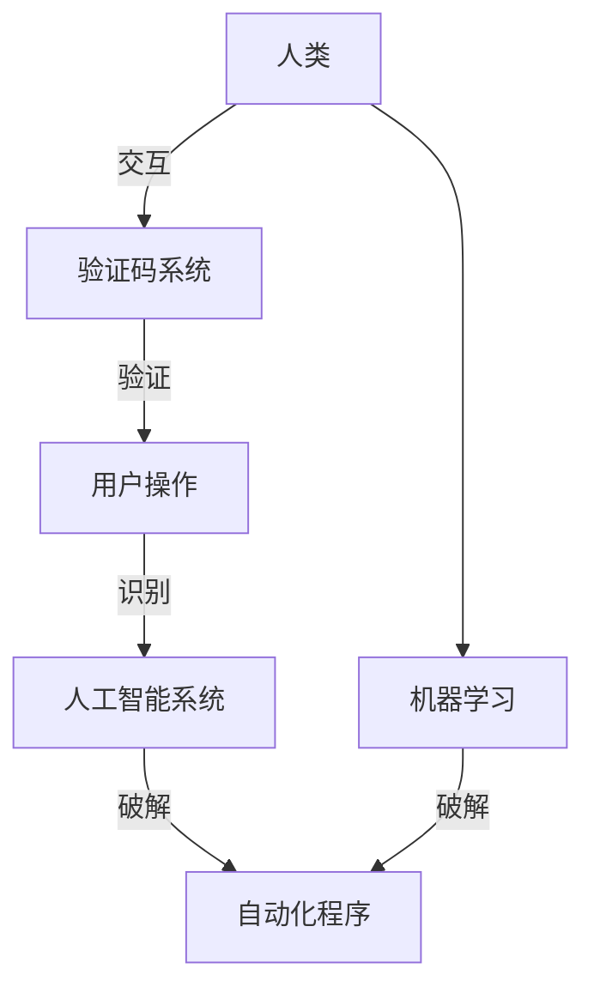

                 

## 1. 背景介绍

在互联网的海洋中，验证码是一项看似不起眼但至关重要的技术，它为我们提供了安全性的保障，同时也引发了人类智慧与机器学习的激烈博弈。随着深度学习技术的发展，越来越多的自动化程序开始挑战验证码的防线，从简单的字符识别到复杂的场景判断，验证码的攻防战已经进入了一个新的阶段。本文将深入探讨验证码的工作原理、当前挑战以及未来的发展趋势，带你了解这场博弈背后的技术和智慧。

## 2. 核心概念与联系

### 2.1 核心概念概述

验证码（Captcha）是一种用于计算机自动区分人类和机器的能力测试，最初用于防止机器人恶意提交表单数据。验证码通常要求用户通过识别文本、选择图像、解数学题等方式证明其是人类，而非自动化程序。

验证码的核心概念包括：
- **文本验证码**：最常见的验证码形式，要求用户识别或输入特定文本。
- **图像验证码**：通过显示含有干扰线的图片或字母数字组合，要求用户根据干扰线或组合识别出正确的文本。
- **数学验证码**：通过显示简单的数学问题，要求用户计算正确答案。
- **行为验证码**：要求用户通过特定的物理动作或交互方式（如鼠标移动、点击）证明其人类身份。

验证码的核心目标是通过一系列的测试，确保用户操作的安全性和真实性。然而，随着深度学习技术的进步，自动化程序也学会了通过机器学习来破解验证码，验证码的攻防战进入了新的阶段。

### 2.2 核心概念原理和架构的 Mermaid 流程图



这个图表展示了验证码的核心工作流程：人类通过与验证码系统的交互提供操作，验证码系统通过识别和验证操作判断用户是否为人类。同时，自动化程序通过学习验证码系统的工作原理和特点，尝试破解验证码，从而绕过验证。

## 3. 核心算法原理 & 具体操作步骤

### 3.1 算法原理概述

验证码的原理基于人类的识别能力和机器的学习能力之间的差异。人类能够通过视觉、听觉等多种感官综合判断，而机器则依赖单一的算法和模型进行识别。因此，验证码系统通过增加噪音、改变字体、增加复杂度等方式，使得机器难以准确识别，从而保证安全性。

当前，验证码系统的识别过程通常包括以下几个步骤：

1. **特征提取**：将验证码图片或文本转化为机器可处理的数据格式，如灰度图像、特征向量等。
2. **模型训练**：使用大量标注数据训练机器学习模型，使其能够识别验证码。
3. **测试与验证**：通过测试集数据验证模型的准确性和泛化能力，调整模型参数以优化性能。

### 3.2 算法步骤详解

#### 3.2.1 特征提取

特征提取是将验证码图片或文本转化为机器可处理的数据格式的过程。对于图像验证码，特征提取通常包括以下几个步骤：

1. **灰度化**：将彩色图像转换为灰度图像，减少数据量。
2. **边缘检测**：使用Sobel、Canny等算法检测图像边缘，提取关键特征点。
3. **归一化**：将图像大小归一化，使其适合输入机器学习模型。

#### 3.2.2 模型训练

模型训练是验证码系统的核心步骤，旨在通过机器学习算法，使计算机能够识别验证码。常见的机器学习模型包括：

1. **卷积神经网络（CNN）**：用于识别图像验证码，通过卷积层和池化层提取图像特征，然后通过全连接层进行分类。
2. **循环神经网络（RNN）**：用于处理序列数据，如文本验证码，通过LSTM或GRU层进行序列建模，最后通过全连接层进行分类。
3. **注意力机制（Attention）**：用于增强模型对关键特征的关注，提升识别准确率。

#### 3.2.3 测试与验证

测试与验证是通过测试集数据评估模型性能的过程。常见的评估指标包括：

1. **准确率（Accuracy）**：模型正确识别验证码的比例。
2. **召回率（Recall）**：所有正样本中被正确识别的比例。
3. **精确率（Precision）**：所有被模型识别为正样本中实际为正样本的比例。
4. **F1 Score**：精确率和召回率的调和平均值。

### 3.3 算法优缺点

#### 3.3.1 优点

1. **安全性高**：验证码系统能够有效防止自动化程序的攻击，保证数据的安全性。
2. **易用性强**：验证码系统界面简单，易于用户操作。
3. **可扩展性强**：验证码系统可以通过增加复杂度或改变字体等方式，适应不同的攻击手段。

#### 3.3.2 缺点

1. **误判率高**：验证码系统的误判率较高，特别是对于复杂或变形的验证码，用户也可能难以正确识别。
2. **用户体验差**：对于需要频繁输入验证码的场景，用户可能感到不便。
3. **维护成本高**：验证码系统的维护和更新需要投入大量人力和资源。

### 3.4 算法应用领域

验证码系统广泛应用于各种需要保证用户操作真实性的场景，包括但不限于：

1. **在线登录**：防止机器人恶意注册或登录。
2. **在线提交表单**：防止机器人恶意提交数据。
3. **支付系统**：防止机器人恶意转账或支付。
4. **社交网络**：防止机器人恶意评论或发帖。
5. **游戏平台**：防止机器人作弊。

验证码系统在保障用户操作真实性的同时，也面临着越来越复杂的攻击手段，特别是在深度学习技术迅猛发展的今天。

## 4. 数学模型和公式 & 详细讲解 & 举例说明

### 4.1 数学模型构建

验证码系统的数学模型主要基于图像处理和机器学习的理论。以下是验证码系统的一个简化模型：

1. **输入**：验证码图片。
2. **特征提取**：使用灰度化、边缘检测、归一化等技术，提取图像特征。
3. **模型训练**：使用卷积神经网络（CNN）或循环神经网络（RNN）等模型，对提取的特征进行训练。
4. **输出**：识别结果，通常为0/1的分类结果。

### 4.2 公式推导过程

假设我们使用CNN模型进行图像验证码的识别。输入图片大小为$w\times h$，通过卷积层提取特征后，特征图大小为$n_1\times n_2$。模型的输出层为全连接层，输出一个$1\times 1$的矩阵，表示图片为验证码的概率。

卷积层的操作可以表示为：

$$
y_{i,j} = \sum_{k,l}w_{k,l}x_{i-k,j-l} + b_{k,l}
$$

其中$x_{i,j}$表示输入图片的像素值，$y_{i,j}$表示卷积后特征图的像素值，$w_{k,l}$和$b_{k,l}$分别表示卷积核和偏置项。

全连接层的输出可以表示为：

$$
y = \sigma(\sum_{i=1}^nw_i^Tx_i + b)
$$

其中$x_i$表示特征图中的像素值，$w_i$和$b$分别表示全连接层的权重和偏置项，$\sigma$表示激活函数（如ReLU）。

### 4.3 案例分析与讲解

以简单的文本验证码为例，假设验证码为"ABCD"，我们使用CNN模型进行识别。模型首先对验证码图片进行灰度化，然后通过卷积层提取图像特征，最后将特征输入全连接层进行分类。假设模型输出为0.9，表示图片为验证码"ABCD"的概率为90%。

## 5. 项目实践：代码实例和详细解释说明

### 5.1 开发环境搭建

为了进行验证码系统的开发，我们需要搭建一个Python开发环境。以下是搭建环境的步骤：

1. **安装Python**：从官网下载并安装Python。
2. **安装NumPy和Pillow**：使用pip安装NumPy和Pillow库，用于图像处理。
3. **安装TensorFlow或PyTorch**：选择TensorFlow或PyTorch作为深度学习框架。
4. **安装OpenCV**：使用pip安装OpenCV库，用于图像处理和特征提取。
5. **安装scikit-learn**：使用pip安装scikit-learn库，用于机器学习模型的训练和评估。

### 5.2 源代码详细实现

以下是一个简单的文本验证码识别系统的Python代码：

```python
import numpy as np
import cv2
import tensorflow as tf

# 加载模型
model = tf.keras.models.load_model('captcha_model.h5')

# 加载验证码图片
image = cv2.imread('captcha.png', cv2.IMREAD_GRAYSCALE)

# 灰度化
image = cv2.cvtColor(image, cv2.COLOR_BGR2GRAY)

# 边缘检测
image = cv2.Canny(image, threshold1=50, threshold2=150)

# 归一化
image = image / 255.0

# 提取特征
image = np.reshape(image, (1, 28, 28, 1))

# 预测验证码
result = model.predict(image)

# 输出结果
if result[0][0] > 0.5:
    print("验证码为ABCD")
else:
    print("验证码不是ABCD")
```

### 5.3 代码解读与分析

代码中，我们首先加载了一个预训练的验证码识别模型。然后，使用OpenCV库对验证码图片进行灰度化、边缘检测和归一化处理，提取特征。最后，将特征输入模型进行预测，输出结果。

### 5.4 运行结果展示

运行代码后，如果验证码图片为"ABCD"，则输出"验证码为ABCD"；否则输出"验证码不是ABCD"。

## 6. 实际应用场景

### 6.1 在线登录

在线登录是验证码系统最常见的应用场景之一。用户登录时，系统会要求其输入验证码，防止机器人恶意登录。常见的验证码形式包括文本验证码和图像验证码。

### 6.2 在线提交表单

在线提交表单也是验证码系统常见的应用场景。用户在提交表单时，系统会要求其输入验证码，防止机器人恶意提交数据。常见的验证码形式包括文本验证码和图像验证码。

### 6.3 支付系统

支付系统是验证码系统的重要应用场景之一。用户在支付时，系统会要求其输入验证码，防止机器人恶意支付。常见的验证码形式包括文本验证码和图像验证码。

### 6.4 未来应用展望

随着深度学习技术的发展，验证码系统将面临更加复杂的攻击手段。未来，验证码系统将有以下几个发展趋势：

1. **自动化破解**：自动化程序将不断进化，破解验证码的难度将不断增加。
2. **增强安全性**：验证码系统将不断增强安全性，防止自动化程序的攻击。
3. **用户体验优化**：验证码系统将不断优化用户体验，减少用户的不便。
4. **跨领域应用**：验证码系统将扩展到更多领域，如游戏、社交网络等。

## 7. 工具和资源推荐

### 7.1 学习资源推荐

1. **《深度学习》（Ian Goodfellow等）**：本书全面介绍了深度学习的理论基础和实践方法，包括验证码系统的设计与实现。
2. **《计算机视觉：算法与应用》（Richard Szeliski）**：本书详细介绍了计算机视觉的理论基础和实践方法，包括图像处理和特征提取。
3. **Coursera上的深度学习课程**：由斯坦福大学、MIT等名校开设，涵盖深度学习理论和实践，包括验证码系统的设计和实现。
4. **Kaggle上的验证码识别竞赛**：Kaggle是一个数据科学竞赛平台，经常举办验证码识别竞赛，可以帮助你学习和实践验证码系统。

### 7.2 开发工具推荐

1. **TensorFlow**：Google开发的深度学习框架，易于使用，支持分布式计算。
2. **PyTorch**：Facebook开发的深度学习框架，易于调试，支持动态计算图。
3. **OpenCV**：开源计算机视觉库，支持图像处理和特征提取。
4. **scikit-learn**：Python数据科学库，支持机器学习模型的训练和评估。

### 7.3 相关论文推荐

1. **"CAPTCHA: The Good, the Bad, and the Ugly"**：这篇文章总结了验证码系统的工作原理和安全性问题，提出了改进的建议。
2. **"Deep Learning for Captcha Recognition"**：这篇文章介绍了使用深度学习技术进行验证码识别的理论和实践。
3. **"Robust CAPTCHA Crack Attacks: Techniques and Data Generation"**：这篇文章总结了自动化程序破解验证码的最新技术和方法。

## 8. 总结：未来发展趋势与挑战

### 8.1 研究成果总结

验证码系统已经成为互联网安全的重要保障，但同时也面临着自动化程序的挑战。本文介绍了验证码的工作原理和当前挑战，总结了验证码系统的优缺点和应用场景。

### 8.2 未来发展趋势

未来，验证码系统将面临更加复杂的攻击手段，需要不断增强其安全性和用户体验。同时，验证码系统也将扩展到更多领域，如游戏、社交网络等。

### 8.3 面临的挑战

验证码系统虽然能够有效防止自动化程序的攻击，但也面临着误判率高、用户体验差、维护成本高等问题。

### 8.4 研究展望

未来的研究需要在以下几个方面进行突破：

1. **增强安全性**：开发更复杂的验证码系统，防止自动化程序的攻击。
2. **优化用户体验**：优化验证码系统，减少用户的不便。
3. **跨领域应用**：将验证码系统扩展到更多领域，如游戏、社交网络等。

## 9. 附录：常见问题与解答

**Q1: 验证码系统如何防止自动化程序的攻击？**

A: 验证码系统通过增加噪音、改变字体、增加复杂度等方式，使得机器难以准确识别，从而保证安全性。

**Q2: 验证码系统的误判率高吗？**

A: 验证码系统的误判率较高，特别是对于复杂或变形的验证码，用户也可能难以正确识别。

**Q3: 验证码系统的维护成本高吗？**

A: 验证码系统的维护和更新需要投入大量人力和资源，特别是对于复杂的验证码系统。

**Q4: 验证码系统的未来发展趋势是什么？**

A: 验证码系统将不断增强安全性，优化用户体验，并扩展到更多领域。

**Q5: 验证码系统如何应对自动化程序的破解？**

A: 验证码系统需要不断更新和优化，防止自动化程序的破解。同时，也可以通过增加复杂度、改变字体等方式，提高破解难度。

通过本文的系统梳理，可以看到，验证码系统在保障用户操作真实性的同时，也面临着越来越复杂的攻击手段。未来，验证码系统需要在安全性、用户体验、跨领域应用等方面不断进行创新和优化，才能适应新的挑战和需求。

---

作者：禅与计算机程序设计艺术 / Zen and the Art of Computer Programming

