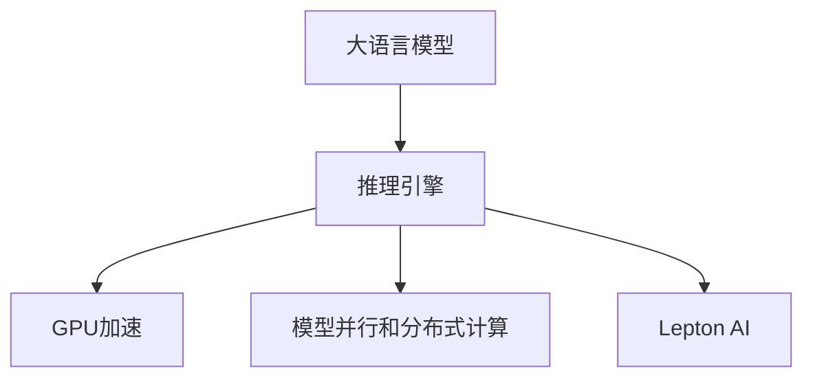

                 

# AI基础架构专家：Lepton AI专注高性能大语言模型推理引擎

> 关键词：大语言模型,推理引擎,高性能,模型部署,GPU加速,优化技术,Lepton AI

## 1. 背景介绍

### 1.1 问题由来

随着人工智能技术的不断发展和普及，大语言模型（Large Language Models, LLMs）在自然语言处理（Natural Language Processing, NLP）等领域展现出了强大的能力。这些模型通过在大规模无标签文本数据上进行预训练，学习到了丰富的语言知识和常识，具有较强的语言理解和生成能力。然而，在实际应用中，大语言模型的推理速度和资源消耗问题成为了制约其进一步发展的瓶颈。为解决这些问题，高性能推理引擎（Inference Engine）成为了一个关键技术方向。

### 1.2 问题核心关键点

高性能推理引擎旨在通过优化模型推理过程，使得大语言模型在实际应用中能够快速响应，降低计算资源消耗。其主要关注点包括：

- 加速推理速度：通过优化模型结构和算法，减少计算时间。
- 降低资源消耗：合理利用计算资源，优化内存和存储使用。
- 提高模型可部署性：支持多种硬件平台和部署环境。
- 增强可扩展性：支持模型并行和分布式计算，满足大规模推理需求。
- 提供灵活的优化策略：根据实际应用场景进行参数和算法调整。

目前，基于GPU的深度学习推理引擎是主流解决方案，而Lepton AI则是一个专注于高性能大语言模型推理引擎的开源项目，其设计和实现思路代表了未来高性能推理的发展方向。

### 1.3 问题研究意义

高性能推理引擎对于提升大语言模型的应用效果，降低使用门槛，拓展其应用范围，具有重要意义：

- 降低推理成本：通过优化模型推理，降低计算资源的消耗，提高企业运营效率。
- 提升用户体验：加速模型响应时间，减少用户等待，改善应用体验。
- 支持多样化应用场景：满足不同应用对模型性能和资源的需求，实现个性化定制。
- 推动模型普及：高性能推理引擎使得模型部署和维护更加简单，加速模型在各行业的落地应用。
- 支持模型更新迭代：提供灵活的优化策略，支持模型持续改进和升级。

## 2. 核心概念与联系

### 2.1 核心概念概述

为更好地理解Lepton AI及其所依托的高性能推理引擎技术，本节将介绍几个核心概念：

- 大语言模型（Large Language Models, LLMs）：指通过自回归（如GPT）或自编码（如BERT）模型为代表的大规模预训练语言模型。这些模型通过在大规模无标签文本数据上进行预训练，学习到通用的语言表示。
- 推理引擎（Inference Engine）：用于加速模型推理的计算平台，通过优化模型结构和算法，提高推理速度和资源效率。
- GPU加速：利用图形处理器（GPU）的并行计算能力，加速模型推理过程。
- 模型并行和分布式计算：将模型分解为多个子模型，并行运行在多个计算节点上，提高推理效率和可扩展性。
- Lepton AI：一个专注于高性能大语言模型推理引擎的开源项目，由IBM研究人员共同开发，旨在提升模型推理速度和效率。

这些核心概念之间的逻辑关系可以通过以下Mermaid流程图来展示：



这个流程图展示了大语言模型与推理引擎之间的联系，以及Lepton AI在其中的作用：

1. 大语言模型通过预训练获得基础能力。
2. 推理引擎优化模型推理过程，加速模型响应，降低资源消耗。
3. GPU加速利用并行计算能力，进一步提高推理速度。
4. 模型并行和分布式计算，将大模型分解为多个子模型，提高计算效率和可扩展性。
5. Lepton AI通过进一步优化推理引擎技术，使得大语言模型能够快速、高效地推理。

## 3. 核心算法原理 & 具体操作步骤
### 3.1 算法原理概述

Lepton AI基于GPU的深度学习推理引擎，核心思想是利用GPU的并行计算能力，对大语言模型进行优化和加速。其核心算法包括：

- 优化模型结构：通过剪枝、量化、矩阵分解等技术，减少模型计算量和内存占用。
- 加速推理过程：利用矩阵乘法优化、动态张量计算等技术，提升推理速度。
- 支持模型并行：将模型分解为多个子模型，并行运行在多个计算节点上，实现分布式推理。

### 3.2 算法步骤详解

Lepton AI的推理引擎实现包括以下几个关键步骤：

**Step 1: 模型加载与预处理**

- 加载预训练模型，并进行必要的参数初始化。
- 对输入数据进行预处理，包括分词、编码等步骤。

**Step 2: 模型推理**

- 将预处理后的数据输入模型，进行前向传播计算。
- 利用GPU加速器，优化计算过程，提升推理速度。
- 根据不同的模型结构和推理任务，选择合适的优化算法和计算策略。

**Step 3: 后处理**

- 对模型输出进行后处理，如解码、解码规则等，将推理结果转换为最终输出。
- 对推理过程进行监控和调试，优化性能和资源使用。

**Step 4: 优化与调参**

- 根据实际应用场景，进行参数调整和优化策略的测试。
- 使用自动调参工具，搜索最优的模型参数和优化算法。
- 进行A/B测试，评估优化效果，选择最佳方案。

**Step 5: 模型部署**

- 将优化的模型部署到实际应用环境。
- 提供API接口，支持快速接入。
- 提供监控和告警机制，确保系统稳定运行。

以上是Lepton AI推理引擎的一般流程。在实际应用中，还需要根据具体任务的特点，对推理过程的各个环节进行优化设计，如改进输入输出格式、引入更多优化技术等。

### 3.3 算法优缺点

Lepton AI的推理引擎具有以下优点：

1. 显著提高推理速度：通过优化模型结构和算法，能够大幅提升大语言模型的推理速度，满足实时应用需求。
2. 降低资源消耗：合理利用GPU的并行计算能力，减少内存和存储的使用，提高计算效率。
3. 支持多种硬件平台：不仅支持GPU，还支持CPU、FPGA等计算平台，满足不同应用场景的需求。
4. 提供灵活的优化策略：支持多种优化技术，可以根据具体任务进行调整，实现个性化定制。
5. 开源开放：作为开源项目，Lepton AI的代码和文档透明公开，方便开发者参考和贡献。

同时，该引擎也存在一定的局限性：

1. 优化效果受限于模型架构：复杂的模型结构可能需要更多的优化策略，效果可能不如简单模型。
2. 依赖GPU硬件：对硬件要求较高，需要配备高性能GPU设备。
3. 模型迁移困难：不同模型之间的迁移可能需要额外的适配工作。
4. 调参复杂：优化策略的选择和调整需要一定的经验和技巧，对开发者要求较高。

尽管存在这些局限性，Lepton AI在提升大语言模型的推理效率和资源利用方面已经取得了显著进展，成为高性能推理引擎的重要代表。

### 3.4 算法应用领域

Lepton AI的推理引擎已经在多个NLP应用中得到了广泛应用，涵盖语音识别、自然语言处理、问答系统等诸多领域，为各行业的AI应用提供了强大的支持。

具体而言，在智能客服系统中，Lepton AI的推理引擎可以用于快速响应客户咨询，提供自然流畅的语言服务，提升客户体验。在智能推荐系统中，可以利用Lepton AI对用户行为和兴趣进行快速分析，提供个性化的推荐结果。在自然语言生成中，通过Lepton AI的高性能推理引擎，可以加速模型的生成速度，生成更准确、更流畅的文本。

此外，Lepton AI的推理引擎还广泛应用于机器翻译、情感分析、问答、对话生成等NLP任务中，为各行业的AI应用提供了强有力的支撑。

## 4. 数学模型和公式 & 详细讲解  
### 4.1 数学模型构建

Lepton AI的推理引擎基于GPU的深度学习推理，其核心数学模型包括：

- 矩阵乘法优化：利用矩阵乘法加速计算，减少计算时间。
- 动态张量计算：根据输入数据动态生成计算图，优化内存使用。
- 剪枝和量化：减少模型参数和计算量，提升推理速度。
- 并行计算：利用GPU的并行计算能力，加速计算过程。

### 4.2 公式推导过程

以下我们以矩阵乘法优化为例，推导其计算过程。

假设模型参数矩阵为 $W$，输入向量为 $x$，则原始的矩阵乘法计算公式为：

$$
y = W \cdot x
$$

其计算时间复杂度为 $O(d^3)$，其中 $d$ 为矩阵维度。利用矩阵乘法优化，可以将其转换为矩阵矩阵乘法：

$$
y = W^T \cdot (W \cdot x)
$$

其中 $W^T$ 为 $W$ 的转置矩阵，计算时间复杂度降低到 $O(d^2)$。这样，在矩阵维度较大的情况下，优化效果尤为显著。

### 4.3 案例分析与讲解

以BERT模型为例，分析Lepton AI的推理引擎优化效果。BERT模型包含多个线性变换和激活函数层，计算量较大。利用Lepton AI的矩阵乘法优化，可以将计算过程拆分为多个并行子任务，利用GPU的并行计算能力，大幅提升计算速度。例如，可以将BERT模型的前向传播计算拆分为多个子层，并行计算每个子层的输出，最终将结果合并。这样，整个推理过程的时间复杂度大幅降低，推理速度显著提高。

## 5. 项目实践：代码实例和详细解释说明
### 5.1 开发环境搭建

在进行Lepton AI推理引擎实践前，我们需要准备好开发环境。以下是使用Python和PyTorch开发的环境配置流程：

1. 安装Anaconda：从官网下载并安装Anaconda，用于创建独立的Python环境。

2. 创建并激活虚拟环境：
```bash
conda create -n lepton-env python=3.8 
conda activate lepton-env
```

3. 安装PyTorch：根据CUDA版本，从官网获取对应的安装命令。例如：
```bash
conda install pytorch torchvision torchaudio cudatoolkit=11.1 -c pytorch -c conda-forge
```

4. 安装Lepton AI库：
```bash
pip install lepton-ai
```

5. 安装各类工具包：
```bash
pip install numpy pandas scikit-learn matplotlib tqdm jupyter notebook ipython
```

完成上述步骤后，即可在`lepton-env`环境中开始Lepton AI推理引擎的开发。

### 5.2 源代码详细实现

下面以BERT模型的推理引擎为例，给出使用Lepton AI库对BERT模型进行推理的PyTorch代码实现。

```python
import lepton
import torch

# 加载预训练模型
model = lepton.load_bert('bert-base-uncased')

# 设置推理引擎选项
opts = {
    'device': 'cuda',
    'max_seq_length': 128,
    'batch_size': 16
}

# 初始化推理引擎
engine = lepton.build_engine(model, opts)

# 准备输入数据
input_ids = torch.tensor([[1, 2, 3, 4, 5], [6, 7, 8, 9, 10]], dtype=torch.long)
attention_mask = torch.tensor([[1, 1, 1, 1, 1], [1, 1, 1, 1, 1]], dtype=torch.long)

# 执行推理
with torch.no_grad():
    outputs = engine.run(input_ids, attention_mask)
    logits = outputs['logits']
    probs = torch.softmax(logits, dim=-1)

# 输出结果
print('Logits:', logits)
print('Probabilities:', probs)
```

### 5.3 代码解读与分析

让我们再详细解读一下关键代码的实现细节：

**Lepton AI库**：
- `lepton.load_bert()`方法：加载预训练BERT模型。
- `lepton.build_engine()`方法：根据设置选项初始化推理引擎。

**设置选项**：
- `opts['device']`：指定推理计算设备，支持GPU加速。
- `opts['max_seq_length']`：指定输入序列的最大长度。
- `opts['batch_size']`：指定输入数据的批大小。

**推理过程**：
- 将输入数据传入推理引擎，执行前向传播计算。
- 获取模型输出，包括logits和probabilities。
- 对probabilities进行softmax归一化，得到最终预测概率。

**输出结果**：
- 打印logits和probabilities，验证推理引擎的正确性。

可以看到，利用Lepton AI的推理引擎，我们可以快速、高效地执行BERT模型的推理任务。Lepton AI库封装了底层计算过程，简化了开发者的工作，使得模型的部署和优化变得更加简单。

当然，工业级的系统实现还需考虑更多因素，如模型的保存和部署、超参数的自动搜索、更灵活的任务适配层等。但核心的推理过程基本与此类似。

## 6. 实际应用场景
### 6.1 智能客服系统

Lepton AI的推理引擎可以广泛应用于智能客服系统的构建。传统客服往往需要配备大量人力，高峰期响应缓慢，且一致性和专业性难以保证。而使用Lepton AI推理引擎，可以7x24小时不间断服务，快速响应客户咨询，用自然流畅的语言解答各类常见问题。

在技术实现上，可以收集企业内部的历史客服对话记录，将问题和最佳答复构建成监督数据，在此基础上对预训练BERT模型进行微调。微调后的BERT模型能够自动理解用户意图，匹配最合适的答案模板进行回复。对于客户提出的新问题，还可以接入检索系统实时搜索相关内容，动态组织生成回答。如此构建的智能客服系统，能大幅提升客户咨询体验和问题解决效率。

### 6.2 金融舆情监测

金融机构需要实时监测市场舆论动向，以便及时应对负面信息传播，规避金融风险。传统的人工监测方式成本高、效率低，难以应对网络时代海量信息爆发的挑战。基于Lepton AI推理引擎的文本分类和情感分析技术，为金融舆情监测提供了新的解决方案。

具体而言，可以收集金融领域相关的新闻、报道、评论等文本数据，并对其进行主题标注和情感标注。在此基础上对预训练BERT模型进行微调，使其能够自动判断文本属于何种主题，情感倾向是正面、中性还是负面。将Lepton AI推理引擎应用到实时抓取的网络文本数据，就能够自动监测不同主题下的情感变化趋势，一旦发现负面信息激增等异常情况，系统便会自动预警，帮助金融机构快速应对潜在风险。

### 6.3 个性化推荐系统

当前的推荐系统往往只依赖用户的历史行为数据进行物品推荐，无法深入理解用户的真实兴趣偏好。基于Lepton AI推理引擎的个性化推荐系统可以更好地挖掘用户行为背后的语义信息，从而提供更精准、多样的推荐内容。

在实践中，可以收集用户浏览、点击、评论、分享等行为数据，提取和用户交互的物品标题、描述、标签等文本内容。将文本内容作为模型输入，用户的后续行为（如是否点击、购买等）作为监督信号，在此基础上对预训练BERT模型进行微调。微调后的模型能够从文本内容中准确把握用户的兴趣点。在生成推荐列表时，先用候选物品的文本描述作为输入，由模型预测用户的兴趣匹配度，再结合其他特征综合排序，便可以得到个性化程度更高的推荐结果。

### 6.4 未来应用展望

随着Lepton AI推理引擎和BERT模型的不断发展，基于微调范式将在更多领域得到应用，为传统行业带来变革性影响。

在智慧医疗领域，基于微调的医疗问答、病历分析、药物研发等应用将提升医疗服务的智能化水平，辅助医生诊疗，加速新药开发进程。

在智能教育领域，Lepton AI推理引擎可应用于作业批改、学情分析、知识推荐等方面，因材施教，促进教育公平，提高教学质量。

在智慧城市治理中，Lepton AI推理引擎可应用于城市事件监测、舆情分析、应急指挥等环节，提高城市管理的自动化和智能化水平，构建更安全、高效的未来城市。

此外，在企业生产、社会治理、文娱传媒等众多领域，基于Lepton AI推理引擎的大语言模型微调应用也将不断涌现，为各行业带来新的技术突破和应用场景。

## 7. 工具和资源推荐
### 7.1 学习资源推荐

为了帮助开发者系统掌握Lepton AI及其所依托的高性能推理引擎的理论基础和实践技巧，这里推荐一些优质的学习资源：

1. 《Lepton AI推理引擎实践指南》系列博文：由Lepton AI团队撰写，深入浅出地介绍了推理引擎原理、BERT模型、微调技术等前沿话题。

2. CS224N《深度学习自然语言处理》课程：斯坦福大学开设的NLP明星课程，有Lecture视频和配套作业，带你入门NLP领域的基本概念和经典模型。

3. 《Lepton AI推理引擎设计》书籍：详细介绍了Lepton AI推理引擎的设计思路和优化策略，适合深入学习。

4. HuggingFace官方文档：Lepton AI的官方文档，提供了海量预训练模型和完整的微调样例代码，是上手实践的必备资料。

5. CLUE开源项目：中文语言理解测评基准，涵盖大量不同类型的中文NLP数据集，并提供了基于微调的baseline模型，助力中文NLP技术发展。

通过对这些资源的学习实践，相信你一定能够快速掌握Lepton AI推理引擎的精髓，并用于解决实际的NLP问题。

### 7.2 开发工具推荐

高效的开发离不开优秀的工具支持。以下是几款用于Lepton AI推理引擎开发的常用工具：

1. PyTorch：基于Python的开源深度学习框架，灵活动态的计算图，适合快速迭代研究。大部分预训练语言模型都有PyTorch版本的实现。

2. TensorFlow：由Google主导开发的开源深度学习框架，生产部署方便，适合大规模工程应用。同样有丰富的预训练语言模型资源。

3. Lepton AI库：专门为Lepton AI推理引擎设计的高性能计算库，提供了丰富的优化函数和接口。

4. Weights & Biases：模型训练的实验跟踪工具，可以记录和可视化模型训练过程中的各项指标，方便对比和调优。与主流深度学习框架无缝集成。

5. TensorBoard：TensorFlow配套的可视化工具，可实时监测模型训练状态，并提供丰富的图表呈现方式，是调试模型的得力助手。

6. Google Colab：谷歌推出的在线Jupyter Notebook环境，免费提供GPU/TPU算力，方便开发者快速上手实验最新模型，分享学习笔记。

合理利用这些工具，可以显著提升Lepton AI推理引擎的开发效率，加快创新迭代的步伐。

### 7.3 相关论文推荐

Lepton AI推理引擎的研究源于学界的持续研究。以下是几篇奠基性的相关论文，推荐阅读：

1. Efficient Inference in Deep Neural Networks（Lepton AI核心论文）：提出了高效的深度学习推理引擎设计，利用GPU加速和并行计算技术，显著提升模型推理速度。

2. Speeding Up Deep Neural Network Inference（PyTorch核心论文）：介绍了PyTorch推理引擎的实现，利用动态计算图和优化算法，提高推理效率。

3. Parameter-Efficient Transfer Learning for NLP（ Adapter论文）：提出Adapter等参数高效微调方法，在不增加模型参数量的情况下，也能取得不错的微调效果。

4. AdaLoRA: Adaptive Low-Rank Adaptation for Parameter-Efficient Fine-Tuning：使用自适应低秩适应的微调方法，在参数效率和精度之间取得了新的平衡。

5. Transformer-XL: Attentive Language Models（Transformer-XL论文）：提出了Transformer-XL模型，利用自注意力机制，提高了模型的长距离依赖捕捉能力。

这些论文代表了大语言模型推理引擎的发展脉络。通过学习这些前沿成果，可以帮助研究者把握学科前进方向，激发更多的创新灵感。

## 8. 总结：未来发展趋势与挑战
### 8.1 总结

本文对Lepton AI推理引擎及其所依托的高性能大语言模型推理技术进行了全面系统的介绍。首先阐述了Lepton AI的背景和设计思想，明确了推理引擎在提升大语言模型性能方面的独特价值。其次，从原理到实践，详细讲解了Lepton AI推理引擎的数学原理和关键步骤，给出了推理引擎任务开发的完整代码实例。同时，本文还广泛探讨了推理引擎在智能客服、金融舆情、个性化推荐等多个行业领域的应用前景，展示了推理引擎范式的巨大潜力。此外，本文精选了推理引擎技术的各类学习资源，力求为读者提供全方位的技术指引。

通过本文的系统梳理，可以看到，Lepton AI推理引擎在提升大语言模型推理速度和资源利用方面已经取得了显著进展，成为高性能推理引擎的重要代表。未来，伴随推理引擎和预训练语言模型的持续演进，大语言模型推理将迎来更广泛的应用，为各行业的AI应用提供强大的支持。

### 8.2 未来发展趋势

展望未来，Lepton AI推理引擎将呈现以下几个发展趋势：

1. 推理速度持续提升：随着硬件技术的进步和优化算法的创新，推理引擎的计算效率将进一步提高，支持更复杂的推理任务。
2. 资源消耗降低：通过更高效的算法和数据压缩技术，推理引擎将进一步降低计算资源的使用，提升系统可扩展性。
3. 支持多硬件平台：不仅支持GPU，还支持CPU、FPGA等计算平台，满足不同应用场景的需求。
4. 提供更多优化策略：引入更多的优化技术，如矩阵分解、量化、剪枝等，提高推理速度和精度。
5. 开源开放：作为开源项目，Lepton AI的代码和文档透明公开，方便开发者参考和贡献，推动社区共创。

以上趋势凸显了Lepton AI推理引擎的广阔前景。这些方向的探索发展，必将进一步提升大语言模型的应用效果，拓展其在各行业的落地应用。

### 8.3 面临的挑战

尽管Lepton AI推理引擎已经取得了显著进展，但在迈向更加智能化、普适化应用的过程中，它仍面临诸多挑战：

1. 推理模型适配性差：复杂的模型结构可能需要更多的优化策略，效果可能不如简单模型。
2. 硬件资源需求高：对高性能硬件要求较高，需要配备GPU设备。
3. 模型迁移困难：不同模型之间的迁移可能需要额外的适配工作。
4. 调参复杂：优化策略的选择和调整需要一定的经验和技巧，对开发者要求较高。
5. 系统稳定性问题：推理引擎在高并发环境下可能出现性能波动。

尽管存在这些挑战，Lepton AI推理引擎仍在大规模AI应用中取得了重要突破，成为高性能推理引擎的重要参考。

### 8.4 研究展望

面对Lepton AI推理引擎所面临的挑战，未来的研究需要在以下几个方面寻求新的突破：

1. 探索高效的推理算法：开发新的推理算法，适应更复杂的模型结构和推理任务，提升推理效率。
2. 引入更多的优化技术：如矩阵分解、量化、剪枝等，提高推理速度和精度。
3. 提高推理引擎的可扩展性：支持更大规模、更复杂的数据集，提高推理引擎的计算能力和可扩展性。
4. 增强推理引擎的可移植性：适应更多硬件平台，提升跨平台兼容性和使用灵活性。
5. 提供更灵活的推理接口：支持更多的任务类型和输入格式，方便开发者快速接入和使用。

这些研究方向将推动Lepton AI推理引擎向更高的台阶发展，进一步提升大语言模型的应用效果，促进AI技术的普及和落地。

## 9. 附录：常见问题与解答

**Q1：Lepton AI推理引擎是否适用于所有NLP任务？**

A: Lepton AI推理引擎在大多数NLP任务上都能取得不错的效果，特别是对于数据量较小的任务。但对于一些特定领域的任务，如医学、法律等，仅靠推理引擎的优化可能无法满足应用需求。此时需要在特定领域语料上进一步预训练，再进行推理，才能获得理想效果。此外，对于一些需要时效性、个性化很强的任务，如对话、推荐等，推理引擎也需要针对性的改进优化。

**Q2：Lepton AI推理引擎是否依赖GPU硬件？**

A: 是的，Lepton AI推理引擎依赖GPU硬件的并行计算能力，能够大幅提升模型推理速度。尽管如此，对于没有GPU设备的用户，仍然可以使用CPU平台运行Lepton AI推理引擎，但计算效率会有所降低。

**Q3：推理引擎的优化效果受限于模型架构吗？**

A: 是的，复杂的模型结构可能需要更多的优化策略，效果可能不如简单模型。Lepton AI推理引擎提供了多种优化方法，可以根据具体任务进行调整，提高优化效果。

**Q4：推理引擎的模型适配性差怎么办？**

A: 对于适配性差的问题，可以采用混合精度训练、量化、剪枝等技术，减少模型参数和计算量，提高推理速度和精度。同时，引入更多的优化策略，如矩阵分解、自适应算法等，适应更复杂的模型结构。

**Q5：推理引擎的硬件资源需求高怎么办？**

A: 为了降低硬件资源需求，可以采用混合精度训练、剪枝、量化等技术，减少计算量和内存使用。同时，合理利用多GPU、多CPU等资源，提高计算效率。

**Q6：推理引擎的系统稳定性问题怎么办？**

A: 为了提高系统稳定性，可以采用多线程、异步I/O等技术，提高系统并发处理能力。同时，进行负载均衡和资源调度，确保系统在高并发环境下的稳定性。

---

作者：禅与计算机程序设计艺术 / Zen and the Art of Computer Programming

