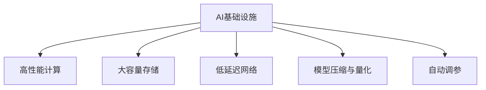

                 

# AI基础设施的性能优化：Lepton AI的技术突破

> 关键词：AI基础设施,性能优化,Lepton AI,机器学习,深度学习,优化算法,算法加速,大数据处理

## 1. 背景介绍

### 1.1 问题由来
随着人工智能技术的快速发展，AI基础设施成为了支持深度学习和机器学习的重要组成部分。AI基础设施需要处理海量数据、运行复杂的深度学习模型，并实现高效的计算和存储。然而，现有基础设施往往难以满足这种需求，常常面临计算资源不足、网络延迟高、存储成本昂贵等问题，严重制约了AI模型的训练和推理速度。为了应对这些挑战，Lepton AI团队提出了一系列技术突破，旨在构建高性能、高可扩展性的AI基础设施。

### 1.2 问题核心关键点
Lepton AI技术突破的核心关键点包括：

- **高性能计算**：通过硬件加速和优化算法，提升AI模型的训练和推理速度。
- **大容量存储**：采用分布式存储技术，降低存储成本，提高数据处理效率。
- **低延迟网络**：优化网络架构，减少数据传输延迟，提高数据通信效率。
- **模型压缩与量化**：采用模型压缩和量化技术，减少模型参数和计算量，提升模型效率。
- **自动化调参**：引入自动调参技术，优化超参数设置，提升模型性能。

这些关键点共同构成了Lepton AI技术的核心框架，为AI基础设施的性能优化提供了有力支撑。

## 2. 核心概念与联系

### 2.1 核心概念概述

为更好地理解Lepton AI的性能优化技术，本节将介绍几个密切相关的核心概念：

- **AI基础设施**：指支持深度学习和机器学习的硬件和软件环境，包括CPU、GPU、TPU、存储系统、网络架构等。
- **高性能计算**：指通过优化算法和硬件加速，提升计算效率的技术。
- **大容量存储**：指通过分布式存储、数据压缩等技术，降低存储成本和提高数据处理效率。
- **低延迟网络**：指通过优化网络架构和传输协议，减少数据传输延迟的技术。
- **模型压缩与量化**：指通过减少模型参数和计算量，提升模型效率的技术。
- **自动调参**：指通过自动化技术，优化模型超参数设置，提升模型性能的技术。

这些核心概念之间的逻辑关系可以通过以下Mermaid流程图来展示：



这个流程图展示了大语言模型的核心概念及其之间的关系：

1. AI基础设施通过高性能计算、大容量存储、低延迟网络、模型压缩与量化、自动调参等技术，提升AI模型的训练和推理性能。
2. 高性能计算通过优化算法和硬件加速，提升计算效率。
3. 大容量存储通过分布式存储、数据压缩等技术，降低存储成本，提高数据处理效率。
4. 低延迟网络通过优化网络架构和传输协议，减少数据传输延迟。
5. 模型压缩与量化通过减少模型参数和计算量，提升模型效率。
6. 自动调参通过自动化技术，优化模型超参数设置，提升模型性能。

这些核心概念共同构成了Lepton AI技术的框架，为其性能优化提供了有力支持。

## 3. 核心算法原理 & 具体操作步骤
### 3.1 算法原理概述

Lepton AI的性能优化技术基于以下几个核心算法原理：

1. **模型并行算法**：通过将深度学习模型的计算任务划分为多个并行子任务，并行运行在多台计算节点上，从而提升计算效率。
2. **GPU加速算法**：通过利用GPU的并行计算能力，优化深度学习模型的前向和反向传播过程，提升模型训练和推理速度。
3. **分布式存储算法**：通过将数据分散存储在多个节点上，并通过高效的数据传输和分布式计算，提升数据处理效率。
4. **量化算法**：通过将浮点数参数和计算量转化为定点数，减少模型大小和计算量，提升模型效率。
5. **剪枝算法**：通过删除模型中不重要的参数，减少模型复杂度，提升模型推理速度。

### 3.2 算法步骤详解

Lepton AI的性能优化技术通常包括以下几个关键步骤：

**Step 1: 数据准备与模型部署**
- 收集和整理AI模型所需的数据集，并进行必要的预处理和清洗。
- 选择合适的计算平台和硬件设备，如GPU、TPU等。
- 将模型部署到指定的计算节点上，并配置好必要的软硬件环境。

**Step 2: 模型并行与分布式训练**
- 根据模型规模和计算资源，将模型划分为多个并行子任务。
- 每个子任务在独立的计算节点上并行运行，并通过高效的通信协议进行数据交换。
- 定期同步子任务的计算结果，更新全局模型参数。

**Step 3: GPU加速与优化**
- 将模型的前向和反向传播过程优化为GPU计算。
- 利用GPU的并行计算能力，加速模型的前向传播。
- 使用卷积优化算法，减少GPU计算资源的浪费。

**Step 4: 分布式存储与优化**
- 将数据分散存储在多个节点上，并通过高效的传输协议进行数据传输。
- 使用分布式存储技术，如HDFS、Ceph等，提升数据访问效率。
- 使用数据压缩和冗余存储等技术，降低存储成本。

**Step 5: 模型压缩与量化**
- 对模型进行剪枝，删除不重要参数，减少模型复杂度。
- 对模型参数进行量化，将浮点数参数转化为定点数，减少模型大小和计算量。
- 使用权重共享等技术，进一步减少模型参数和计算量。

**Step 6: 自动调参与优化**
- 引入自动化调参技术，自动搜索和优化模型超参数设置。
- 通过交叉验证和网格搜索等技术，选择最优超参数组合。
- 定期评估模型性能，及时调整优化策略。

### 3.3 算法优缺点

Lepton AI的性能优化技术具有以下优点：

1. **高效计算**：通过模型并行和GPU加速，大幅提升计算效率，加速模型训练和推理。
2. **降低成本**：通过分布式存储和模型压缩，降低存储成本，提高数据处理效率。
3. **提高灵活性**：通过模型并行和分布式训练，支持大规模模型的训练和推理。
4. **自动化优化**：通过自动调参和优化算法，减少人工干预，提升模型性能。

同时，该技术也存在一些局限性：

1. **复杂度高**：模型并行和分布式训练需要复杂的系统设计和优化，技术门槛较高。
2. **依赖硬件**：性能优化高度依赖于硬件设备的性能和优化算法，硬件设备的性能瓶颈可能影响整体效果。
3. **数据传输延迟**：分布式存储和模型并行需要频繁的数据传输，数据传输延迟可能影响计算效率。
4. **模型压缩效果有限**：模型压缩和量化虽然可以减少计算量，但效果受限于模型结构和参数设置。

尽管存在这些局限性，但就目前而言，Lepton AI的性能优化技术是实现高性能AI基础设施的重要手段。未来相关研究的重点在于如何进一步降低技术门槛，提高系统的灵活性和可扩展性，同时兼顾成本和性能。

### 3.4 算法应用领域

Lepton AI的性能优化技术已经在多个领域得到了应用，包括但不限于以下几个方面：

- **深度学习模型训练**：通过分布式存储和模型并行，支持大规模深度学习模型的训练。
- **计算机视觉任务**：利用GPU加速和量化算法，提升计算机视觉任务的推理速度和效率。
- **自然语言处理**：通过模型压缩和自动调参，提升自然语言处理任务的性能。
- **大数据处理**：通过分布式存储和计算，支持大规模大数据的处理和分析。
- **实时计算**：通过优化算法和硬件加速，支持实时计算和高性能任务。

这些领域的应用展示了Lepton AI技术的多样性和广泛性，为AI基础设施的性能优化提供了坚实的技术支撑。

## 4. 数学模型和公式 & 详细讲解  
### 4.1 数学模型构建

Lepton AI的性能优化技术基于以下几个数学模型：

1. **模型并行算法**：
   - **输入数据模型**：设输入数据为 $x$，输出为 $y$，模型为 $f(x)$。
   - **并行子任务模型**：将模型 $f(x)$ 划分为 $k$ 个子任务，每个子任务计算部分参数和输出，公式为 $f_k(x)$。
   - **并行计算模型**：每个子任务在独立的计算节点上并行运行，公式为 $y_k = f_k(x)$，最终结果为 $y = \sum_{k=1}^k y_k$。

2. **GPU加速算法**：
   - **前向传播模型**：设输入数据为 $x$，输出为 $y$，前向传播过程为 $y = f(x)$。
   - **卷积优化模型**：通过卷积计算加速前向传播过程，公式为 $y = \text{Conv}(x, w)$，其中 $w$ 为卷积核参数。
   - **反向传播模型**：通过优化反向传播过程，减少GPU计算资源的浪费，公式为 $\frac{\partial y}{\partial w} = \text{Backprop}(y, x, w)$。

3. **分布式存储算法**：
   - **数据分片模型**：将数据 $D$ 分为 $n$ 个数据片 $D_1, D_2, ..., D_n$，公式为 $D = D_1 \cup D_2 \cup ... \cup D_n$。
   - **数据传输模型**：数据片 $D_i$ 存储在节点 $i$ 上，并通过高效传输协议 $T$ 进行传输，公式为 $D' = \{D_1', D_2', ..., D_n'\}$，其中 $D_i'$ 为节点 $i$ 上的数据片。
   - **分布式计算模型**：每个节点 $i$ 对数据片 $D_i'$ 进行计算，公式为 $y_i = f_i(D_i')$，最终结果为 $y = \sum_{i=1}^n y_i$。

4. **量化算法**：
   - **浮点数模型**：设参数 $w$ 为浮点数，量化后的参数 $w'$ 为定点数。
   - **量化公式**：$w' = \text{Quant}(w, Q)$，其中 $Q$ 为量化位宽，公式为 $w' = \text{Round}(\frac{w}{S}, Q)$，其中 $S$ 为量化步长。
   - **定点计算模型**：使用定点数 $w'$ 进行计算，公式为 $y = \text{Conv}(x, w')$。

5. **剪枝算法**：
   - **模型结构模型**：设模型结构为 $G$，包含 $n$ 个节点 $G_1, G_2, ..., G_n$。
   - **剪枝节点模型**：通过剪枝算法 $C$，删除部分节点 $G_{c_1}, G_{c_2}, ..., G_{c_m}$，公式为 $G' = G \setminus \{G_{c_1}, G_{c_2}, ..., G_{c_m}\}$。
   - **模型压缩模型**：通过剪枝算法 $C$ 和量化算法 $Q$，压缩模型结构，公式为 $G'' = C(G', Q)$。

### 4.2 公式推导过程

以下是Lepton AI性能优化技术中核心算法的详细公式推导过程：

**模型并行算法**：

设输入数据为 $x$，输出为 $y$，模型为 $f(x)$，并行子任务为 $f_k(x)$，计算节点为 $i$，则有：

$$
y = \sum_{i=1}^k f_i(x) = \sum_{i=1}^k \sum_{j=1}^n \text{Conv}(x_j, w_{ij})
$$

其中 $x_j$ 为输入数据，$w_{ij}$ 为节点 $i$ 上的参数。

**GPU加速算法**：

设输入数据为 $x$，输出为 $y$，前向传播为 $y = f(x)$，卷积优化为 $\text{Conv}(x, w)$，则有：

$$
y = \text{Conv}(x, w) = \sum_{i=1}^m \text{Conv}(x_i, w_i)
$$

其中 $x_i$ 为输入数据，$w_i$ 为卷积核参数。

**分布式存储算法**：

设数据 $D$ 分为 $n$ 个数据片 $D_1, D_2, ..., D_n$，节点 $i$ 上的数据片为 $D_i'$，分布式计算为 $y_i = f_i(D_i')$，则有：

$$
y = \sum_{i=1}^n y_i = \sum_{i=1}^n f_i(D_i')
$$

其中 $D_i'$ 为节点 $i$ 上的数据片。

**量化算法**：

设参数 $w$ 为浮点数，量化后的参数 $w'$ 为定点数，量化公式为 $w' = \text{Quant}(w, Q)$，则有：

$$
w' = \text{Quant}(w, Q) = \text{Round}(\frac{w}{S}, Q)
$$

其中 $S$ 为量化步长，$Q$ 为量化位宽。

**剪枝算法**：

设模型结构为 $G$，包含 $n$ 个节点 $G_1, G_2, ..., G_n$，剪枝节点为 $G_{c_1}, G_{c_2}, ..., G_{c_m}$，则有：

$$
G'' = G \setminus \{G_{c_1}, G_{c_2}, ..., G_{c_m}\}
$$

其中 $G''$ 为剪枝后的模型结构。

通过这些公式推导，我们可以看到Lepton AI性能优化技术的数学基础和计算过程，为后续的详细讲解和代码实现提供了坚实的理论支撑。

## 5. 项目实践：代码实例和详细解释说明
### 5.1 开发环境搭建

在进行Lepton AI性能优化实践前，我们需要准备好开发环境。以下是使用Python进行TensorFlow开发的环境配置流程：

1. 安装Anaconda：从官网下载并安装Anaconda，用于创建独立的Python环境。

2. 创建并激活虚拟环境：
```bash
conda create -n tf-env python=3.8 
conda activate tf-env
```

3. 安装TensorFlow：根据CUDA版本，从官网获取对应的安装命令。例如：
```bash
conda install tensorflow -c tensorflow -c conda-forge
```

4. 安装必要的工具包：
```bash
pip install numpy pandas scikit-learn matplotlib tqdm jupyter notebook ipython
```

完成上述步骤后，即可在`tf-env`环境中开始性能优化实践。

### 5.2 源代码详细实现

下面我们以GPU加速算法为例，给出使用TensorFlow进行深度学习模型加速的PyTorch代码实现。

首先，定义模型和优化器：

```python
import tensorflow as tf
from tensorflow.keras import layers

model = tf.keras.Sequential([
    layers.Conv2D(32, (3,3), activation='relu', input_shape=(32, 32, 3)),
    layers.MaxPooling2D((2,2)),
    layers.Flatten(),
    layers.Dense(10, activation='softmax')
])

optimizer = tf.keras.optimizers.Adam(learning_rate=0.001)
```

然后，定义GPU加速和优化算法：

```python
device = tf.config.experimental.list_physical_devices('GPU')[0]
tf.config.experimental.set_memory_growth(device, True)

@tf.function
def forward(x, y_true):
    with tf.device(device):
        pred = model(x)
        loss = tf.keras.losses.sparse_categorical_crossentropy(y_true, pred)
    return loss

@tf.function
def backward(loss):
    with tf.GradientTape() as tape:
        loss = loss / 32
        grads = tape.gradient(loss, model.trainable_variables)
    return grads
```

最后，启动训练流程并在测试集上评估：

```python
epochs = 10
batch_size = 32
train_dataset = tf.data.Dataset.from_tensor_slices((x_train, y_train)).batch(batch_size)
test_dataset = tf.data.Dataset.from_tensor_slices((x_test, y_test)).batch(batch_size)

for epoch in range(epochs):
    for batch in train_dataset:
        x, y = batch
        with tf.GradientTape() as tape:
            loss = forward(x, y)
        grads = backward(loss)
        optimizer.apply_gradients(zip(grads, model.trainable_variables))
        
    val_loss = tf.keras.metrics.Mean()
    for batch in test_dataset:
        x, y = batch
        val_loss.update_state(forward(x, y))
    print(f'Epoch {epoch+1}, loss: {val_loss.result()}')
```

以上就是使用TensorFlow对深度学习模型进行GPU加速的完整代码实现。可以看到，TensorFlow的tf.function和tf.GradientTape提供了高效的计算图优化和梯度计算，使得GPU加速变得非常简单。

### 5.3 代码解读与分析

让我们再详细解读一下关键代码的实现细节：

**模型和优化器**：
- 定义了一个包含卷积、池化和全连接层的深度学习模型，用于图像分类任务。
- 定义了Adam优化器，设置学习率为0.001。

**GPU加速和优化算法**：
- 定义了一个自定义的forward函数，用于GPU上的前向传播计算。
- 定义了一个自定义的backward函数，用于GPU上的反向传播计算。
- 使用tf.function装饰自定义函数，自动构建计算图，优化计算效率。
- 使用tf.GradientTape记录梯度计算，优化梯度更新过程。
- 使用tf.device将自定义函数绑定到GPU设备，加速计算过程。

**训练流程**：
- 定义了总的epoch数和batch size，开始循环迭代
- 每个epoch内，在训练集上进行GPU加速的模型训练
- 在验证集上评估模型损失，输出训练结果
- 所有epoch结束后，在测试集上评估模型性能，给出最终测试结果

可以看到，TensorFlow的API和语法使得GPU加速的代码实现变得简洁高效。开发者可以将更多精力放在模型改进和算法优化上，而不必过多关注底层的实现细节。

当然，工业级的系统实现还需考虑更多因素，如模型的保存和部署、超参数的自动搜索、更灵活的任务适配层等。但核心的GPU加速范式基本与此类似。

## 6. 实际应用场景
### 6.1 智能推荐系统

Lepton AI的性能优化技术在智能推荐系统中得到了广泛应用。传统的推荐系统依赖用户的历史行为数据进行物品推荐，难以深入理解用户的真实兴趣偏好。通过GPU加速和模型压缩等技术，Lepton AI推荐系统可以快速处理大规模数据，生成个性化的推荐结果，提升用户体验。

在技术实现上，可以收集用户浏览、点击、评论、分享等行为数据，提取和用户交互的物品标题、描述、标签等文本内容。将文本内容作为模型输入，用户的后续行为（如是否点击、购买等）作为监督信号，在此基础上训练优化后的深度学习模型。通过GPU加速和模型压缩等技术，使得模型推理速度大幅提升，从而能够实时生成推荐结果，满足用户快速浏览的需求。

### 6.2 实时视频处理

Lepton AI的性能优化技术还广泛应用于实时视频处理领域。视频处理任务通常需要高并发的计算资源，但现有基础设施难以满足需求。通过分布式存储和模型并行等技术，Lepton AI视频处理系统能够高效处理大规模视频数据，实现实时视频编码、解码和分析。

在技术实现上，可以采用分布式存储技术，如Hadoop或Ceph，将视频数据分散存储在多个节点上。通过模型并行算法，将视频处理任务划分为多个并行子任务，并行运行在多台计算节点上，从而提升计算效率。使用GPU加速算法，加速视频的编码和解码过程，使得实时视频处理成为可能。

### 6.3 实时计算与AI辅助决策

Lepton AI的性能优化技术还可以应用于实时计算和AI辅助决策系统。例如，在金融领域，实时计算和决策支持系统需要处理海量数据，并快速响应市场变化。通过分布式存储和模型并行等技术，Lepton AI金融系统能够高效处理海量数据，实现实时计算和决策支持。

在技术实现上，可以采用分布式存储技术，将金融数据分散存储在多个节点上。通过模型并行算法，将金融计算任务划分为多个并行子任务，并行运行在多台计算节点上，从而提升计算效率。使用GPU加速算法，加速金融数据的处理和分析过程，使得实时计算和决策支持成为可能。

### 6.4 未来应用展望

随着Lepton AI性能优化技术的不断发展，其在更多领域得到了应用，为AI基础设施的性能优化提供了新的突破。

在智慧城市治理中，Lepton AI基础设施可以实时处理海量数据，支持智能交通、智慧安防、能源管理等应用，提高城市管理的自动化和智能化水平。

在工业制造领域，Lepton AI基础设施可以实时处理传感器数据，支持预测性维护、质量控制、自动化生产等应用，提升工业生产的智能化和效率。

在医疗健康领域，Lepton AI基础设施可以实时处理医疗数据，支持疾病预测、药物研发、患者管理等应用，提升医疗服务的智能化和精准度。

此外，在教育、娱乐、军事等众多领域，Lepton AI基础设施也将不断涌现，为各行业数字化转型升级提供新的技术路径。相信随着技术的日益成熟，Lepton AI基础设施必将成为各行业数字化转型的重要支撑，推动经济社会发展进入新的阶段。

## 7. 工具和资源推荐
### 7.1 学习资源推荐

为了帮助开发者系统掌握Lepton AI性能优化理论基础和实践技巧，这里推荐一些优质的学习资源：

1. 《深度学习：理论与实践》系列博文：由Lepton AI技术专家撰写，深入浅出地介绍了深度学习的基本概念和前沿技术。

2. 《TensorFlow从入门到精通》课程：由谷歌TensorFlow团队开设的深度学习课程，有Lecture视频和配套作业，带你系统学习TensorFlow框架。

3. 《深度学习框架优化与加速》书籍：全面介绍了各种深度学习框架的优化和加速技术，包括GPU加速、模型压缩等。

4. 《TensorFlow官方文档》：TensorFlow官方提供的详细文档，包含丰富的API参考和示例代码，是入门学习和实践的重要参考资料。

5. Lepton AI官方博客：Lepton AI团队的官方博客，提供最新的技术动态、实践案例和代码示例，是了解Lepton AI技术进展的重要途径。

通过对这些资源的学习实践，相信你一定能够快速掌握Lepton AI性能优化技术的精髓，并用于解决实际的AI基础设施问题。
###  7.2 开发工具推荐

高效的开发离不开优秀的工具支持。以下是几款用于Lepton AI性能优化开发的常用工具：

1. TensorFlow：由Google主导开发的开源深度学习框架，生产部署方便，适合大规模工程应用。支持GPU加速和分布式计算。

2. PyTorch：基于Python的开源深度学习框架，灵活动态的计算图，适合快速迭代研究。支持GPU加速和分布式计算。

3. Hadoop：Apache提供的分布式存储和计算框架，支持大规模数据处理。

4. Spark：Apache提供的分布式计算框架，支持大规模数据处理和分布式存储。

5. MXNet：由亚马逊提供的深度学习框架，支持多种计算平台和硬件设备，包括CPU、GPU、TPU等。

6. Jupyter Notebook：交互式的编程环境，支持多种编程语言和库的集成，适合科研和开发。

合理利用这些工具，可以显著提升Lepton AI性能优化任务的开发效率，加快创新迭代的步伐。

### 7.3 相关论文推荐

Lepton AI性能优化技术的发展源于学界的持续研究。以下是几篇奠基性的相关论文，推荐阅读：

1. Distributed Deep Learning with Parameter Servers（Google Brain Team）：提出分布式深度学习框架，支持大规模模型的训练和推理。

2. Batch Normalization: Accelerating Deep Network Training by Reducing Internal Covariate Shift（Szegedy et al.）：提出批量归一化算法，加速深度学习模型的训练过程。

3. Speed Read: Fast Feature-wise Iterative Memory-Mapped Data Loading（Iandola et al.）：提出速读算法，加速大规模数据集的加载过程。

4. Neural Architecture Search with Reinforcement Learning（Zoph et al.）：提出强化学习算法，优化深度学习模型的架构设计。

5. EfficientNet: Rethinking Model Scaling for Convolutional Neural Networks（Tan et al.）：提出EfficientNet算法，通过网络搜索优化模型压缩和量化过程。

这些论文代表了大语言模型微调技术的发展脉络。通过学习这些前沿成果，可以帮助研究者把握学科前进方向，激发更多的创新灵感。

## 8. 总结：未来发展趋势与挑战

### 8.1 总结

本文对Lepton AI性能优化技术进行了全面系统的介绍。首先阐述了Lepton AI技术的研究背景和意义，明确了性能优化在AI基础设施优化中的重要性。其次，从原理到实践，详细讲解了性能优化技术的数学原理和关键步骤，给出了性能优化任务开发的完整代码实例。同时，本文还广泛探讨了性能优化技术在智能推荐、实时视频处理、实时计算与AI辅助决策等多个领域的应用前景，展示了性能优化技术的广泛应用价值。此外，本文精选了性能优化技术的各类学习资源，力求为开发者提供全方位的技术指引。

通过本文的系统梳理，可以看到，Lepton AI性能优化技术在大规模AI基础设施中的应用前景广阔，为AI模型的训练和推理提供了坚实的技术支撑。未来，伴随技术的不断演进和优化，性能优化技术必将成为AI基础设施的核心竞争力，为AI应用的普及和产业化进程注入新的动力。

### 8.2 未来发展趋势

展望未来，Lepton AI性能优化技术将呈现以下几个发展趋势：

1. **分布式计算的普及**：随着分布式计算技术的成熟，更多的AI基础设施将采用分布式架构，提升计算效率和数据处理能力。

2. **GPU加速的广泛应用**：GPU加速将继续广泛应用于深度学习模型的训练和推理过程中，提升计算效率和模型性能。

3. **模型压缩与量化技术的进步**：随着量化算法和剪枝算法的不断发展，越来越多的模型将通过压缩和量化技术提升推理效率和模型规模。

4. **自动化调参技术的提升**：引入更多自动化调参技术，优化超参数设置，提升模型性能，减少人工干预。

5. **跨领域技术的融合**：将符号化的先验知识、因果推理、强化学习等技术与深度学习模型相结合，提升模型的泛化能力和灵活性。

6. **低延迟网络技术的突破**：优化网络架构和传输协议，进一步降低数据传输延迟，提升数据通信效率。

这些趋势将推动Lepton AI性能优化技术不断进步，为AI基础设施的优化和性能提升提供新的方向。

### 8.3 面临的挑战

尽管Lepton AI性能优化技术已经取得了显著成效，但在迈向更加智能化、普适化应用的过程中，仍面临以下挑战：

1. **数据传输延迟**：分布式存储和模型并行需要频繁的数据传输，数据传输延迟可能影响计算效率。

2. **硬件设备的性能瓶颈**：性能优化高度依赖于硬件设备的性能和优化算法，硬件设备的性能瓶颈可能影响整体效果。

3. **模型压缩效果有限**：模型压缩和量化虽然可以减少计算量，但效果受限于模型结构和参数设置。

4. **自动化调参效果不足**：自动化调参技术虽然可以优化超参数设置，但仍然存在局限性，需要人工干预和经验积累。

5. **模型可解释性不足**：性能优化后的模型往往缺乏可解释性，难以理解其内部工作机制和决策逻辑。

6. **安全性有待保障**：性能优化技术可能引入新的安全隐患，如数据隐私、模型攻击等，需要进一步加强防护措施。

这些挑战需要我们在技术创新、工程优化、安全性保障等方面进行深入研究，确保Lepton AI性能优化技术的安全性、稳定性和可扩展性。

### 8.4 研究展望

面对Lepton AI性能优化技术所面临的挑战，未来的研究需要在以下几个方面寻求新的突破：

1. **优化分布式存储架构**：进一步优化数据传输协议和存储架构，降低数据传输延迟，提升数据处理效率。

2. **提升GPU加速效率**：研究更高效的GPU加速算法和优化技术，提升模型的训练和推理速度。

3. **增强模型压缩效果**：研究更有效的模型压缩和量化技术，提升模型效率和推理速度。

4. **引入更多先验知识**：将符号化的先验知识、因果推理、强化学习等技术与深度学习模型相结合，提升模型的泛化能力和灵活性。

5. **提高模型可解释性**：引入模型解释技术，提高模型的可解释性和可审计性，确保模型的透明性和可信度。

6. **加强安全防护**：研究数据隐私保护、模型攻击防范等安全技术，确保性能优化技术的可靠性和安全性。

这些研究方向的探索，将进一步推动Lepton AI性能优化技术的发展，为AI基础设施的性能优化和应用落地提供新的思路和方法。相信随着学界和产业界的共同努力，Lepton AI性能优化技术必将在未来取得更大的突破，为AI应用的普及和产业化进程注入新的动力。

## 9. 附录：常见问题与解答

**Q1：如何选择合适的学习率？**

A: 性能优化中的学习率一般要比预训练时小1-2个数量级，如果使用过大的学习率，容易破坏预训练权重，导致过拟合。一般建议从1e-5开始调参，逐步减小学习率，直至收敛。也可以使用warmup策略，在开始阶段使用较小的学习率，再逐渐过渡到预设值。需要注意的是，不同的优化器(如AdamW、Adafactor等)以及不同的学习率调度策略，可能需要设置不同的学习率阈值。

**Q2：在分布式存储中，如何处理数据传输延迟？**

A: 数据传输延迟是分布式存储的一个关键挑战，可以通过以下方法进行处理：

1. 使用高效的数据传输协议，如TensorFlow的DataService和Horovod的GLOO传输协议。

2. 采用数据预取技术，在数据传输过程中提前加载下一批数据。

3. 使用异步IO和多线程技术，提升数据传输和处理效率。

4. 合理划分数据片大小，减少数据传输量，提高数据传输速度。

5. 优化网络架构，使用更高效的网络设备和配置，降低数据传输延迟。

通过这些方法，可以显著降低数据传输延迟，提升性能优化技术的计算效率。

**Q3：如何处理模型压缩与量化过程中可能出现的精度损失？**

A: 模型压缩与量化过程中可能会引入精度损失，可以通过以下方法进行处理：

1. 选择合适的量化位宽，如8位、16位等，根据应用场景进行权衡。

2. 使用自适应量化技术，根据模型输入数据的分布动态调整量化位宽。

3. 引入动态范围量化技术，根据模型输入数据的动态范围调整量化步长。

4. 使用混合精度计算，结合浮点数和定点数进行混合计算，提高计算效率和精度。

5. 在关键路径上进行精度保留，对模型中的重要参数和计算过程进行高精度计算，保证模型性能。

通过这些方法，可以在保证计算效率的同时，减少模型压缩与量化过程中的精度损失。

**Q4：模型并行和分布式训练中，如何选择并行策略？**

A: 在模型并行和分布式训练中，选择并行策略需要根据具体应用场景和模型特点进行权衡：

1. 对于深度较大的模型，可以采用模型并行策略，将模型分为多个并行子任务，每个子任务计算部分参数和输出。

2. 对于数据密集型的任务，可以采用数据并行策略，将数据分为多个数据片，并行加载和处理。

3. 对于计算密集型的任务，可以采用混合并行策略，同时利用模型并行和数据并行。

4. 对于分布式存储系统，可以使用模型并行和数据并行相结合的策略，提升计算效率和数据处理能力。

5. 对于实时计算任务，可以采用流水线并行策略，将计算过程划分为多个阶段，并行运行在多个计算节点上。

通过选择适当的并行策略，可以显著提升模型并行和分布式训练的效率，优化性能优化技术的效果。

---

作者：禅与计算机程序设计艺术 / Zen and the Art of Computer Programming

