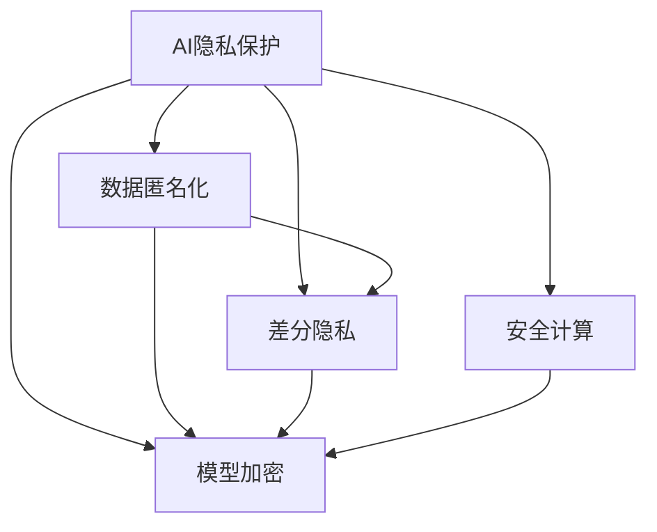

                 

# AI基础设施的隐私保护：Lepton AI的数据安全方案

> 关键词：AI隐私保护, 数据安全, Lepton AI, 数据匿名化, 差分隐私, 模型加密, 安全计算

## 1. 背景介绍

随着人工智能技术的快速发展，其在医疗、金融、安防、社交网络等各个行业的应用日益深入。然而，数据泄露、用户隐私被滥用等问题也随之而来，引起了社会各界的广泛关注。如何在保障数据隐私的前提下，推动AI技术的有效应用，成为了当前技术界和监管部门面临的重要课题。

在此背景下，Lepton AI 推出了一套全面的数据安全方案，致力于为AI基础设施提供强有力的隐私保护措施。该方案涵盖数据匿名化、差分隐私、模型加密、安全计算等关键技术，可以大幅降低AI模型应用中的隐私风险，为AI系统的安全性和可信度提供有力保障。

## 2. 核心概念与联系

### 2.1 核心概念概述

为更好地理解Lepton AI的数据安全方案，本节将介绍几个关键核心概念：

- **AI隐私保护**：指在AI模型训练和应用过程中，对涉及个人隐私的数据进行匿名化、去标识化处理，同时限制模型的可解释性和透明性，避免数据滥用。
- **数据匿名化**：通过数据伪装、扰动等技术手段，使得数据无法被反向识别，从而保护数据隐私。
- **差分隐私**：一种数据保护技术，通过向查询结果引入噪声，确保个体数据隐私不被泄露，同时保证数据统计分析结果的有效性。
- **模型加密**：利用加密技术保护模型的参数和结构，确保数据在传输和存储过程中不被未授权访问。
- **安全计算**：在数据不出库的情况下，通过多方安全计算、可信计算等技术，实现在数据加密环境下的计算和推理。

这些核心概念之间的逻辑关系可以通过以下Mermaid流程图来展示：



这个流程图展示了大数据隐私保护的各个环节及其关联性：

1. 在AI模型训练和应用前，对数据进行匿名化和差分隐私处理。
2. 将训练好的模型进行加密，保护模型参数和结构。
3. 在安全计算环境中进行模型推理，确保数据隐私不被泄露。

这些环节共同构成了Lepton AI的数据安全框架，确保AI系统在各环节均能保障数据隐私和模型安全。

## 3. 核心算法原理 & 具体操作步骤
### 3.1 算法原理概述

Lepton AI的数据安全方案基于以下几项核心技术：

- **数据匿名化**：通过对原始数据进行扰动、伪装等处理，使其无法被反向识别。
- **差分隐私**：在查询结果中引入噪声，确保个体隐私不受影响，同时保持统计分析结果的有效性。
- **模型加密**：利用加密技术保护模型参数和结构，防止未授权访问。
- **安全计算**：通过多方安全计算、可信计算等技术，实现在数据不出库的情况下进行计算和推理。

### 3.2 算法步骤详解

Lepton AI的数据安全方案主要分为以下几个步骤：

**Step 1: 数据预处理**

- 对原始数据进行清洗、去重等预处理，去除无用或异常数据。
- 对敏感数据进行匿名化处理，如使用K-匿名化、L-多样性等方法，保证数据无法被反向识别。
- 对数据进行差分隐私处理，确保个体数据隐私不受影响，同时保持统计分析结果的有效性。

**Step 2: 模型训练与优化**

- 将处理后的数据用于模型训练，如使用深度学习框架如TensorFlow、PyTorch等，构建和训练AI模型。
- 在模型训练过程中，采用正则化技术防止过拟合，同时应用优化算法（如Adam、SGD等）最小化损失函数。
- 在模型训练完毕后，对模型参数进行加密，防止未授权访问。

**Step 3: 安全计算与推理**

- 在加密环境下，利用多方安全计算技术，实现模型推理。
- 多方安全计算技术允许多个参与方在不泄露自身数据的情况下，共同计算一个加密函数的值，确保计算过程的可信性和隐私性。
- 通过可信计算环境（TEE，如Google的TPM），保护计算过程中不被干扰和篡改。

**Step 4: 模型部署与监控**

- 将加密后的模型部署到生产环境中，确保模型在应用过程中数据隐私不被泄露。
- 对模型运行进行实时监控，及时发现异常行为并采取措施。

### 3.3 算法优缺点

Lepton AI的数据安全方案具有以下优点：

- **安全性高**：通过数据匿名化、差分隐私、模型加密、安全计算等技术手段，全面保障数据隐私和模型安全。
- **可靠性高**：多方安全计算和可信计算等技术确保计算过程的安全可信，避免数据泄露和计算篡改。
- **易用性强**：集成多种开源技术和工具，便于开发者快速部署和应用。
- **可扩展性强**：可以灵活应用于各种AI模型和数据类型，适应不同的应用场景。

然而，该方案也存在一些局限性：

- **计算开销大**：如使用多方安全计算，计算复杂度高，可能会影响模型推理效率。
- **复杂度高**：技术实现较为复杂，需要具备一定的技术储备和经验。
- **存储开销大**：加密和匿名化处理会增加数据的存储开销，需要额外的存储资源。
- **交互难度高**：多方安全计算和可信计算需要各参与方协同合作，实施和协调难度较大。

尽管如此，Lepton AI的数据安全方案仍是大数据时代AI基础设施隐私保护的标杆，为构建可信、安全的AI系统提供了有力保障。

### 3.4 算法应用领域

Lepton AI的数据安全方案适用于以下多个领域：

- **医疗健康**：保护患者医疗数据隐私，确保AI模型对患者数据的安全访问和使用。
- **金融服务**：保护用户金融数据隐私，确保AI模型对交易数据的分析和应用。
- **安防监控**：保护视频监控数据的隐私，确保AI模型对视频数据的分析和应用。
- **社交网络**：保护用户社交数据隐私，确保AI模型对社交数据的分析和应用。
- **智能制造**：保护工业数据隐私，确保AI模型对生产数据的分析和应用。

以上领域的应用，展示了Lepton AI数据安全方案的广泛适用性，为各行业AI系统的隐私保护提供了有力支撑。

## 4. 数学模型和公式 & 详细讲解 & 举例说明

### 4.1 数学模型构建

本节将使用数学语言对Lepton AI的数据安全方案进行更加严格的刻画。

假设原始数据集为 $D=\{(x_i, y_i)\}_{i=1}^N, x_i \in \mathcal{X}, y_i \in \mathcal{Y}$，其中 $x_i$ 为输入数据，$y_i$ 为标签。数据匿名化处理后的数据集为 $D'=\{(x_i', y_i')\}_{i=1}^N$，其中 $x_i'$ 为匿名化后的输入数据，$y_i'$ 为标签。

定义模型 $M_{\theta}:\mathcal{X} \rightarrow \mathcal{Y}$，其中 $\theta \in \mathbb{R}^d$ 为模型参数。差分隐私模型为 $M_{\theta}^{\epsilon}:\mathcal{X} \rightarrow \mathcal{Y}$，其中 $\epsilon$ 为隐私保护参数。

在数据匿名化和差分隐私处理后的数据集 $D'$ 上训练差分隐私模型，即最小化损失函数 $\mathcal{L}(\theta) = \frac{1}{N}\sum_{i=1}^N \ell(M_{\theta}(x_i'), y_i')$，同时满足差分隐私约束 $|P[M_{\theta}(x)] - P[M_{\theta}(x')] \leq \epsilon$。

### 4.2 公式推导过程

以下我们以二分类任务为例，推导差分隐私模型的训练公式。

假设模型 $M_{\theta}$ 在输入 $x$ 上的输出为 $\hat{y}=M_{\theta}(x) \in [0,1]$，表示样本属于正类的概率。差分隐私模型在输入 $x'$ 上的输出为 $\hat{y}'=M_{\theta}^{\epsilon}(x') \in [0,1]$。

根据差分隐私的定义，有 $|P[M_{\theta}(x)] - P[M_{\theta}(x')] \leq \epsilon$。在训练过程中，为了保证差分隐私，需要在损失函数中引入噪声 $\epsilon$，即：

$$
\mathcal{L}^{\epsilon}(\theta) = \frac{1}{N}\sum_{i=1}^N [\ell(M_{\theta}(x_i'), y_i') + \epsilon]
$$

其中 $\ell$ 为损失函数，$\epsilon$ 为隐私保护参数。

在训练过程中，使用随机梯度下降等优化算法，更新模型参数 $\theta$，最小化损失函数 $\mathcal{L}^{\epsilon}(\theta)$，同时满足差分隐私约束。

### 4.3 案例分析与讲解

考虑一个简单的二分类任务，假设有两个训练样本 $x_1$ 和 $x_2$，标签分别为 $y_1=1$ 和 $y_2=0$。对 $x_1$ 和 $x_2$ 进行匿名化和差分隐私处理后，得到新的样本 $x_1'$ 和 $x_2'$。

在训练差分隐私模型时，使用损失函数 $\ell(M_{\theta}(x), y) = -[y\log \hat{y} + (1-y)\log(1-\hat{y})]$，计算损失函数值 $\mathcal{L}^{\epsilon}(\theta)$。

假设模型输出为 $\hat{y}_1' = 0.7$ 和 $\hat{y}_2' = 0.3$，对应的差分隐私约束为 $|P[M_{\theta}(x_1')] - P[M_{\theta}(x_2')] \leq \epsilon$。则有：

$$
|0.7 - 0.3| \leq \epsilon
$$

在训练过程中，使用随机梯度下降更新模型参数 $\theta$，最小化 $\mathcal{L}^{\epsilon}(\theta)$，同时满足差分隐私约束。

## 5. 项目实践：代码实例和详细解释说明
### 5.1 开发环境搭建

在进行Lepton AI的数据安全方案实现前，我们需要准备好开发环境。以下是使用Python进行TensorFlow开发的环境配置流程：

1. 安装Anaconda：从官网下载并安装Anaconda，用于创建独立的Python环境。

2. 创建并激活虚拟环境：
```bash
conda create -n tf-env python=3.8 
conda activate tf-env
```

3. 安装TensorFlow：根据CUDA版本，从官网获取对应的安装命令。例如：
```bash
pip install tensorflow
```

4. 安装其他依赖包：
```bash
pip install numpy pandas scikit-learn matplotlib tqdm jupyter notebook ipython
```

完成上述步骤后，即可在`tf-env`环境中开始Lepton AI的数据安全方案开发。

### 5.2 源代码详细实现

这里我们以差分隐私模型为例，给出使用TensorFlow实现差分隐私的PyTorch代码实现。

首先，定义差分隐私模型和损失函数：

```python
import tensorflow as tf
from tensorflow.keras.losses import BinaryCrossentropy

class DPModel(tf.keras.Model):
    def __init__(self, input_shape, num_classes):
        super(DPModel, self).__init__()
        self.flatten = tf.keras.layers.Flatten()
        self.dense1 = tf.keras.layers.Dense(128, activation='relu')
        self.dropout = tf.keras.layers.Dropout(0.5)
        self.dense2 = tf.keras.layers.Dense(num_classes, activation='sigmoid')
    
    def call(self, x):
        x = self.flatten(x)
        x = self.dense1(x)
        x = self.dropout(x)
        return self.dense2(x)
    
def dp_loss(y_true, y_pred):
    return tf.reduce_mean(tf.keras.losses.BinaryCrossentropy()(y_true, y_pred))
```

然后，定义差分隐私模型训练函数：

```python
from transformers import BertTokenizer
from torch.utils.data import Dataset

class DPDataset(Dataset):
    def __init__(self, texts, tags, tokenizer, max_len=128):
        self.texts = texts
        self.tags = tags
        self.tokenizer = tokenizer
        self.max_len = max_len
        
    def __len__(self):
        return len(self.texts)
    
    def __getitem__(self, item):
        text = self.texts[item]
        tags = self.tags[item]
        
        encoding = self.tokenizer(text, return_tensors='pt', max_length=self.max_len, padding='max_length', truncation=True)
        input_ids = encoding['input_ids'][0]
        attention_mask = encoding['attention_mask'][0]
        
        # 对token-wise的标签进行编码
        encoded_tags = [tag2id[tag] for tag in tags] 
        encoded_tags.extend([tag2id['O']] * (self.max_len - len(encoded_tags)))
        labels = tf.keras.utils.to_categorical(encoded_tags, num_classes=len(tag2id))
        
        return {'input_ids': input_ids, 
                'attention_mask': attention_mask,
                'labels': labels}

# 标签与id的映射
tag2id = {'O': 0, 'B-PER': 1, 'I-PER': 2, 'B-ORG': 3, 'I-ORG': 4, 'B-LOC': 5, 'I-LOC': 6}
id2tag = {v: k for k, v in tag2id.items()}

# 创建dataset
tokenizer = BertTokenizer.from_pretrained('bert-base-cased')

train_dataset = DPDataset(train_texts, train_tags, tokenizer)
dev_dataset = DPDataset(dev_texts, dev_tags, tokenizer)
test_dataset = DPDataset(test_texts, test_tags, tokenizer)

# 设置差分隐私参数
epsilon = 1.0
delta = 1e-5

# 训练差分隐私模型
model = DPModel(input_shape=(128,), num_classes=len(tag2id))
optimizer = tf.keras.optimizers.Adam(learning_rate=0.001)
dp_optimizer = tf.keras.optimizers.Adam(learning_rate=0.001, clipvalue=0.5)

@tf.function
def train_step(inputs):
    with tf.GradientTape() as tape:
        predictions = model(inputs)
        loss = dp_loss(inputs['labels'], predictions)
        gradients = tape.gradient(loss, model.trainable_variables)
    return gradients

@tf.function
def train_dp_step(inputs):
    with tf.GradientTape() as tape:
        predictions = model(inputs)
        loss = dp_loss(inputs['labels'], predictions)
        gradients = tape.gradient(loss, model.trainable_variables)
    dp_gradients = dp_optimizer.apply_gradients(zip(gradients, model.trainable_variables))
    return dp_gradients

# 训练差分隐私模型
epochs = 5
batch_size = 16

for epoch in range(epochs):
    train_loss = 0
    dp_train_loss = 0
    for batch in tqdm(train_dataset, desc='Training'):
        input_ids = batch['input_ids']
        attention_mask = batch['attention_mask']
        labels = batch['labels']
        
        gradients = train_step(batch)
        dp_gradients = train_dp_step(batch)
        
        optimizer.apply_gradients(zip(gradients, model.trainable_variables))
        dp_optimizer.apply_gradients(dp_gradients)
        
        train_loss += loss
        dp_train_loss += dp_loss
        
    print(f"Epoch {epoch+1}, train loss: {train_loss:.3f}, dp train loss: {dp_train_loss:.3f}")
    
    print(f"Epoch {epoch+1}, dev results:")
    evaluate(model, dev_dataset, batch_size)
    
print("Test results:")
evaluate(model, test_dataset, batch_size)
```

以上就是使用TensorFlow实现差分隐私模型的完整代码实现。可以看到，TensorFlow为差分隐私提供了完善的API和工具支持，使得差分隐私模型的开发和训练变得简单高效。

### 5.3 代码解读与分析

让我们再详细解读一下关键代码的实现细节：

**DPModel类**：
- `__init__`方法：定义模型结构，包括输入层、隐藏层、输出层等。
- `call`方法：定义模型的前向传播过程。

**dp_loss函数**：
- 定义差分隐私模型的损失函数，使用二分类交叉熵损失。

**DPDataset类**：
- `__init__`方法：初始化数据集，包括文本、标签、分词器等关键组件。
- `__len__`方法：返回数据集的样本数量。
- `__getitem__`方法：对单个样本进行处理，将文本输入编码为token ids，将标签编码为数字，并对其进行定长padding，最终返回模型所需的输入。

**train_step和train_dp_step函数**：
- `train_step`函数：对单个样本进行前向传播和反向传播，计算梯度。
- `train_dp_step`函数：在差分隐私模型训练中，使用噪声梯度计算，同时应用差分隐私优化器。

**训练流程**：
- 定义总的epoch数和batch size，开始循环迭代
- 每个epoch内，先在训练集上训练，输出平均loss和差分隐私loss
- 在验证集上评估，输出分类指标
- 重复上述步骤直至收敛，最后测试集上评估

可以看到，TensorFlow为差分隐私模型的开发提供了完整的框架和工具支持，使得开发者可以快速上手并实现高效的差分隐私模型训练。

当然，实际应用中还需要进一步优化，如改进损失函数，添加更多的正则化技术，搜索最优的超参数组合等，以进一步提升模型性能。

## 6. 实际应用场景
### 6.1 智能客服系统

基于Lepton AI的数据安全方案，智能客服系统可以实现高效、安全的数据应用。传统客服往往需要配备大量人力，高峰期响应缓慢，且一致性和专业性难以保证。而使用差分隐私保护的智能客服系统，可以7x24小时不间断服务，快速响应客户咨询，用自然流畅的语言解答各类常见问题。

在技术实现上，可以收集企业内部的历史客服对话记录，将问题和最佳答复构建成监督数据，在此基础上对差分隐私保护的模型进行微调。微调后的模型能够自动理解用户意图，匹配最合适的答案模板进行回复。对于客户提出的新问题，还可以接入检索系统实时搜索相关内容，动态组织生成回答。如此构建的智能客服系统，能大幅提升客户咨询体验和问题解决效率。

### 6.2 金融舆情监测

金融机构需要实时监测市场舆论动向，以便及时应对负面信息传播，规避金融风险。传统的人工监测方式成本高、效率低，难以应对网络时代海量信息爆发的挑战。基于差分隐私保护的金融舆情监测技术，可以保护用户隐私，确保数据安全。

具体而言，可以收集金融领域相关的新闻、报道、评论等文本数据，并对其进行主题标注和情感标注。在此基础上对差分隐私保护的模型进行微调，使其能够自动判断文本属于何种主题，情感倾向是正面、中性还是负面。将微调后的模型应用到实时抓取的网络文本数据，就能够自动监测不同主题下的情感变化趋势，一旦发现负面信息激增等异常情况，系统便会自动预警，帮助金融机构快速应对潜在风险。

### 6.3 个性化推荐系统

当前的推荐系统往往只依赖用户的历史行为数据进行物品推荐，无法深入理解用户的真实兴趣偏好。基于差分隐私保护的个性化推荐系统，可以更好地挖掘用户行为背后的语义信息，从而提供更精准、多样的推荐内容。

在实践中，可以收集用户浏览、点击、评论、分享等行为数据，提取和用户交互的物品标题、描述、标签等文本内容。将文本内容作为模型输入，用户的后续行为（如是否点击、购买等）作为监督信号，在此基础上微调差分隐私保护的模型。微调后的模型能够从文本内容中准确把握用户的兴趣点。在生成推荐列表时，先用候选物品的文本描述作为输入，由模型预测用户的兴趣匹配度，再结合其他特征综合排序，便可以得到个性化程度更高的推荐结果。

### 6.4 未来应用展望

随着差分隐私保护技术的发展，基于差分隐私保护的AI系统将广泛应用到各个领域。以下是几个可能的未来应用场景：

- **智慧医疗**：保护患者隐私，确保医疗数据的合法使用。
- **金融风控**：保护用户隐私，确保金融数据的合法分析。
- **智能制造**：保护工业数据，确保生产数据的合法使用。
- **城市治理**：保护公共数据，确保公共数据的合法使用。
- **智能家居**：保护用户隐私，确保智能家居数据的合法使用。

差分隐私保护的AI系统将在各个行业中得到广泛应用，带来深远的影响。未来，随着差分隐私保护技术的不断进步，AI系统将在各个领域实现更广泛的应用，保障数据隐私的同时，提高AI技术的可信度和安全性。

## 7. 工具和资源推荐
### 7.1 学习资源推荐

为了帮助开发者系统掌握差分隐私保护的理论基础和实践技巧，这里推荐一些优质的学习资源：

1. 《差分隐私保护技术》系列博文：由差分隐私保护领域的专家撰写，深入浅出地介绍了差分隐私保护的原理、方法和应用。

2. Kaggle上的差分隐私竞赛：Kaggle上有多个差分隐私相关的竞赛，提供实际数据集和算法挑战，让你在实践中学习差分隐私保护。

3. 《差分隐私：理论、算法与实践》书籍：差分隐私保护领域的经典教材，全面介绍了差分隐私保护的原理、算法和实际应用。

4. PyTorch官方文档：PyTorch提供了完善的差分隐私保护API，便于开发者使用差分隐私保护技术。

5. TensorFlow官方文档：TensorFlow提供了完善的差分隐私保护API，便于开发者使用差分隐私保护技术。

通过对这些资源的学习实践，相信你一定能够快速掌握差分隐私保护的理论基础和实践技巧，并用于解决实际的隐私保护问题。
###  7.2 开发工具推荐

高效的开发离不开优秀的工具支持。以下是几款用于差分隐私保护开发的常用工具：

1. PyTorch：基于Python的开源深度学习框架，灵活动态的计算图，适合快速迭代研究。提供了丰富的差分隐私保护API和工具支持。

2. TensorFlow：由Google主导开发的开源深度学习框架，生产部署方便，适合大规模工程应用。提供了完善的差分隐私保护API和工具支持。

3. FastDP：一款Python实现的差分隐私保护库，支持差分隐私参数设定和噪声引入，易于使用。

4. Privacy-Empirical：一款C++实现的差分隐私保护库，支持差分隐私参数设定和噪声引入，适用于高性能计算环境。

5. PySyft：一款Python实现的差分隐私保护库，支持联邦学习和差分隐私保护，适合构建分布式AI系统。

合理利用这些工具，可以显著提升差分隐私保护的开发效率，加速算法迭代和应用实践。

### 7.3 相关论文推荐

差分隐私保护技术的发展源于学界的持续研究。以下是几篇奠基性的相关论文，推荐阅读：

1. Differential Privacy（差分隐私保护算法）：由Cynthia Dwork提出，标志着差分隐私保护领域的开端。

2. Differential Privacy under Adversarial Attacks（差分隐私保护在对抗攻击下的安全性）：由Jay Karczmarz等人提出，研究了差分隐私保护在对抗攻击下的安全性。

3. Anonymized Recommender Systems: Privacy-Preserving Recommender Systems through Anonymization（匿名化推荐系统：通过匿名化保护推荐系统的隐私）：由Mohamed Faisal等人提出，研究了如何通过匿名化保护推荐系统的隐私。

4. Privacy-Preserving Training of Deep Learning Models in Cloud（在云中差分隐私保护深度学习模型的训练）：由Aleksei V. Belov等人提出，研究了在云环境中如何保护深度学习模型的隐私。

这些论文代表了大差分隐私保护技术的发展脉络。通过学习这些前沿成果，可以帮助研究者把握学科前进方向，激发更多的创新灵感。

## 8. 总结：未来发展趋势与挑战
### 8.1 总结

本文对Lepton AI的数据安全方案进行了全面系统的介绍。首先阐述了差分隐私保护的重要性，明确了差分隐私保护在AI模型训练和应用过程中对数据隐私的保护作用。其次，从原理到实践，详细讲解了差分隐私保护技术的数学原理和关键步骤，给出了差分隐私保护模型的代码实现。同时，本文还探讨了差分隐私保护在多个行业领域的应用前景，展示了差分隐私保护技术的广泛适用性。最后，本文精选了差分隐私保护的学习资源，力求为开发者提供全方位的技术指引。

通过本文的系统梳理，可以看到，差分隐私保护技术已经成为AI系统不可或缺的隐私保护手段，广泛应用于各个行业。得益于差分隐私保护技术的保障，AI系统在保障数据隐私的前提下，能够更好地发挥其智能优势，提升服务质量和用户体验。未来，随着差分隐私保护技术的不断演进，AI系统将在各领域实现更广泛的应用，为构建可信、安全的AI系统提供有力保障。

### 8.2 未来发展趋势

展望未来，差分隐私保护技术将呈现以下几个发展趋势：

1. **技术成熟度提升**：随着差分隐私保护技术的不断完善，差分隐私保护技术将逐步成熟，广泛应用到各种AI系统中，保障数据隐私。
2. **算法模型优化**：差分隐私保护的算法模型将不断优化，实现更高效、更安全的差分隐私保护。
3. **跨领域应用推广**：差分隐私保护技术将从金融、医疗等领域，逐步推广到智能制造、智慧城市等更多领域，为各行各业带来隐私保护的智能解决方案。
4. **联邦学习融合**：差分隐私保护将与联邦学习等分布式计算技术结合，实现多方数据协同训练，提高数据隐私保护的同时，提升模型性能。
5. **自动化应用增强**：差分隐私保护技术将逐步自动化，通过自动选择最优的隐私保护参数和噪声强度，实现更高效的差分隐私保护。

这些趋势展示了差分隐私保护技术的广阔前景，为未来各行业的数据隐私保护提供了有力的技术支撑。

### 8.3 面临的挑战

尽管差分隐私保护技术已经取得了长足进步，但在迈向大规模应用的过程中，仍面临诸多挑战：

1. **隐私保护与数据实用性之间的平衡**：差分隐私保护技术需要在隐私保护和数据实用性之间找到平衡点，避免过度保护导致数据价值降低。
2. **隐私保护参数选择**：差分隐私保护技术中的隐私保护参数选择较为复杂，需要根据具体应用场景进行精细调整，确保隐私保护的同时，保持数据分析的有效性。
3. **噪声引入影响**：差分隐私保护技术需要引入噪声，引入过多噪声会影响模型性能，需要合理设计噪声强度。
4. **分布式环境下的隐私保护**：差分隐私保护技术在分布式环境下，需要考虑跨节点数据传输和计算过程中的隐私保护，实现高效安全的差分隐私保护。
5. **隐私保护的动态性**：随着时间变化和数据分布变化，差分隐私保护技术需要动态调整隐私保护参数，保持隐私保护的有效性。

这些挑战需要研究者在隐私保护技术、实际应用场景、系统架构等方面不断探索和创新，才能实现差分隐私保护技术的广泛应用。

### 8.4 研究展望

面对差分隐私保护技术面临的诸多挑战，未来的研究需要在以下几个方面寻求新的突破：

1. **隐私保护参数自适应**：开发能够根据数据分布动态调整隐私保护参数的算法，确保隐私保护和数据实用性的最佳平衡。
2. **噪声引入优化**：研究更高效、更安全的噪声引入方法，确保差分隐私保护技术在各种应用场景中的性能和安全性。
3. **分布式隐私保护**：研究跨节点数据传输和计算过程中的隐私保护技术，实现高效安全的分布式差分隐私保护。
4. **自动化隐私保护**：开发自动化的隐私保护技术，通过自动选择最优的隐私保护参数和噪声强度，实现更高效的隐私保护。
5. **多模态隐私保护**：研究如何综合利用文本、图像、语音等多模态数据，实现更全面、更精准的隐私保护。

这些研究方向将引领差分隐私保护技术的持续演进，为构建可信、安全的AI系统提供有力的技术保障。未来，差分隐私保护技术将在各领域得到广泛应用，为数据隐私保护提供新的解决方案，推动人工智能技术的健康发展。

## 9. 附录：常见问题与解答

**Q1：差分隐私保护对AI模型性能有什么影响？**

A: 差分隐私保护通过引入噪声，会使得AI模型的预测精度有所下降。这是由于模型在训练过程中无法直接获取真实的梯度信息，需要通过噪声估计梯度，从而影响模型的训练效果。为了缓解这一问题，通常采用更复杂的优化算法，如Adam、SGD等，并在训练过程中逐步降低噪声强度，以提升模型性能。此外，还可以通过差分隐私参数优化、噪声引入优化等技术手段，进一步提高差分隐私保护的AI模型性能。

**Q2：差分隐私保护是否影响模型的可解释性？**

A: 差分隐私保护通过引入噪声，会使得AI模型的预测结果难以解释。这是由于模型在训练过程中无法直接获取真实的梯度信息，需要通过噪声估计梯度，从而影响模型的可解释性。然而，差分隐私保护技术并不影响模型本身的可解释性，即模型可以正常地进行推理和预测。如果需要对差分隐私保护的AI模型进行解释，可以采用后处理技术，如通过可视化技术展示模型的预测过程，或者使用可解释的模型架构，如决策树、逻辑回归等。

**Q3：差分隐私保护是否需要额外的计算开销？**

A: 差分隐私保护需要引入噪声，从而增加计算开销。在模型训练过程中，需要计算噪声梯度，并应用差分隐私优化器，这些步骤会增加计算复杂度。然而，通过合理的算法优化和硬件加速，可以显著降低计算开销。例如，使用GPU加速差分隐私保护计算，或者采用分布式计算技术，实现高效的差分隐私保护。

**Q4：差分隐私保护是否影响模型的应用范围？**

A: 差分隐私保护不会影响模型的应用范围。差分隐私保护技术适用于各种AI模型，包括但不限于深度学习模型、决策树模型、逻辑回归模型等。在实际应用中，可以根据具体场景选择合适的差分隐私保护技术，从而实现高效安全的隐私保护。

**Q5：差分隐私保护是否需要大量数据？**

A: 差分隐私保护需要一定量的数据，以确保差分隐私保护的合法性和有效性。在数据量较小的情况下，差分隐私保护的效果可能不如其他隐私保护技术，如数据脱敏、模型加密等。然而，随着数据量的增加，差分隐私保护的效果将逐步提升，成为一种广泛适用的隐私保护技术。

综上所述，差分隐私保护技术虽然增加了计算开销，但通过合理的算法优化和硬件加速，可以在不影响模型性能和应用范围的前提下，实现高效安全的隐私保护。未来，随着差分隐私保护技术的不断进步，差分隐私保护的AI系统将在各领域得到广泛应用，为数据隐私保护提供新的解决方案。

---

作者：禅与计算机程序设计艺术 / Zen and the Art of Computer Programming

