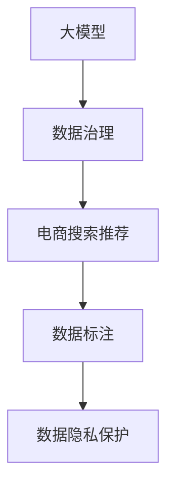

                 

# AI大模型助力电商搜索推荐业务的数据治理升级

## 1. 背景介绍

### 1.1 问题由来

在数字化转型浪潮的推动下，电商行业的业务规模和复杂性不断提升，搜索引擎和推荐系统作为电商中关键的交互界面，直接影响着用户购物体验和转化率。而高质量的数据治理是大模型落地应用的前提，如何在数据维度多、规模大的电商业务场景中构建高效、灵活的数据治理体系，成为了电商搜索推荐业务发展的关键问题。

大模型在电商领域的应用已取得显著进展，如利用BERT进行自然语言处理、使用YOLO进行商品识别等。但大模型的本质仍是通过模型参数学习泛化数据规律，数据的多样性、复杂性和准确性直接影响了大模型在电商搜索推荐中的应用效果。因此，如何高效管理电商数据，进行高质量的数据治理，是大模型落地的重要一步。

### 1.2 问题核心关键点

电商搜索推荐业务的数据治理主要关注以下几个方面：

- 数据采集和整合：在多渠道、多平台、多端的应用场景下，如何高效、准确地采集商品、用户、行为等数据，并将其整合到一个统一的数据仓库中，是大模型应用的基础。

- 数据质量控制：电商数据量大、类型多，存在重复、缺失、不一致等问题。如何保证数据的质量，避免因数据问题影响模型训练和推荐效果，是大模型应用的难点。

- 数据标注和预处理：标注数据是训练大模型的关键，电商数据的标注数据往往难以获得。如何在数据质量保证的前提下，提升数据标注的效率和准确性，是大模型应用的瓶颈。

- 数据安全与隐私保护：电商数据涉及用户隐私和商业秘密，如何在数据治理中保障数据安全、防止数据滥用，是大模型应用必须考虑的问题。

大模型在电商搜索推荐业务中的应用，需要构建一个高效、可扩展的数据治理体系，通过数据整合、质量控制、标注预处理和隐私保护等手段，为模型的训练和推荐提供高质量的数据支持。本文将详细探讨电商搜索推荐业务中大模型的数据治理问题，并提出具体的解决方案。

## 2. 核心概念与联系

### 2.1 核心概念概述

为更好地理解电商搜索推荐业务中的数据治理问题，本节将介绍几个密切相关的核心概念：

- 大模型(Large Model)：指参数规模巨大、能力强大的模型，如BERT、GPT等。这些模型通过大规模数据训练，学习到丰富的特征表示，能够应对复杂的任务需求。

- 数据治理(Data Governance)：通过制定标准、流程和工具，对数据进行管理和维护，保证数据的质量、安全性和一致性，支持数据驱动的决策和应用。

- 电商搜索推荐系统(E-Commerce Search and Recommendation System)：通过智能算法推荐商品、优化搜索结果，提升用户购物体验，增加电商转化率的系统。

- 数据标注(Data Annotation)：对数据进行标注，为其赋予特定的属性和标签，用于模型训练和验证。电商数据的标注通常涉及商品名称、价格、描述等属性。

- 数据隐私保护(Data Privacy Protection)：在数据收集、存储、传输、使用等各个环节，保护用户隐私，避免数据泄露和滥用。

这些核心概念之间的逻辑关系可以通过以下Mermaid流程图来展示：



这个流程图展示了大模型在电商搜索推荐业务中的应用与数据治理的关系：

1. 大模型通过电商数据进行训练，学习商品、用户和行为的规律。
2. 数据治理对电商数据进行采集、整合、标注和隐私保护，保证数据的质量和安全。
3. 电商搜索推荐系统通过大模型进行智能推荐和搜索优化。
4. 数据标注和大数据隐私保护是数据治理的重要环节，直接影响大模型的训练和应用效果。

## 3. 核心算法原理 & 具体操作步骤

### 3.1 算法原理概述

电商搜索推荐业务的数据治理问题，主要围绕数据采集、整合、质量控制、标注和隐私保护五个方面展开。本节将详细阐述这些问题的算法原理，并提出相应的操作步骤。

### 3.2 算法步骤详解

#### 3.2.1 数据采集

电商数据来源广泛，包括电商平台自身的交易数据、用户行为数据，以及第三方数据。为了高效地采集和整合这些数据，可以采用以下步骤：

1. **数据源集成**：搭建一个数据集成平台，对接不同数据源，实现数据的自动采集。
2. **数据清洗**：对采集到的数据进行清洗，去除重复、缺失、异常值等数据问题。
3. **数据转换**：将不同格式的数据进行统一转换，确保数据的一致性。
4. **数据存储**：将清洗和转换后的数据存储到统一的数据仓库中，便于后续处理。

#### 3.2.2 数据整合

电商数据来源多、维度高，如何高效整合这些数据，是数据治理的核心问题。可以采用以下方法：

1. **数据联邦**：采用联邦学习技术，将各数据源的数据分布式存储在边缘节点，不传输原始数据，只传输模型参数，确保数据安全和隐私保护。
2. **数据融合**：采用数据融合技术，将来自不同数据源的数据进行合并和整合，消除数据冗余和歧义，生成统一的数据视图。
3. **数据同步**：采用数据同步技术，实时更新数据仓库中的数据，保证数据的实时性和一致性。

#### 3.2.3 数据质量控制

电商数据量大、类型多，存在重复、缺失、不一致等问题。如何保证数据的质量，避免因数据问题影响模型训练和推荐效果，可以采用以下策略：

1. **数据校验**：通过设置数据校验规则，检查数据的合法性和完整性。例如，对商品ID进行唯一性校验，对价格进行合法性校验等。
2. **数据清洗**：对存在异常值的数据进行清洗和处理，例如，对缺失值进行插补，对错误值进行校正等。
3. **数据标准化**：对不同数据源的数据进行标准化处理，统一数据格式和命名规范，便于后续处理。
4. **数据监控**：对数据质量进行实时监控，及时发现和处理数据问题，确保数据的一致性和准确性。

#### 3.2.4 数据标注

标注数据是训练大模型的关键，电商数据的标注通常涉及商品名称、价格、描述等属性。为了提升数据标注的效率和准确性，可以采用以下方法：

1. **人工标注**：利用人工标注团队，对数据进行标注。例如，利用众包平台，通过审核和质量控制，确保标注数据的准确性和一致性。
2. **半监督学习**：利用半监督学习技术，对部分标注数据进行标注，同时利用未标注数据进行训练，提升模型泛化能力。
3. **自监督学习**：利用自监督学习技术，对数据进行标注，例如，利用序列预测、分类任务等生成标注数据。
4. **标签传播**：利用标签传播技术，将已有标注数据传播到未标注数据中，提升数据的标注效率和准确性。

#### 3.2.5 数据隐私保护

电商数据涉及用户隐私和商业秘密，如何在数据治理中保障数据安全、防止数据滥用，可以采用以下措施：

1. **数据加密**：对敏感数据进行加密处理，确保数据在传输和存储过程中的安全性。
2. **访问控制**：对数据的访问进行严格的权限控制，防止未授权人员访问和操作数据。
3. **匿名化处理**：对数据进行匿名化处理，去除敏感信息，确保数据隐私保护。
4. **数据审计**：对数据的使用进行审计和记录，防止数据滥用和泄露。

### 3.3 算法优缺点

电商搜索推荐业务的数据治理问题，主要围绕数据采集、整合、质量控制、标注和隐私保护五个方面展开。以下是对这些问题的算法优缺点的详细分析：

#### 数据采集

**优点**：

1. **高效性**：采用数据集成平台，可以实现自动化的数据采集和整合，提高数据处理效率。
2. **灵活性**：采用联邦学习技术，可以实现分布式数据采集和处理，适应不同的数据源和业务需求。

**缺点**：

1. **复杂性**：数据集成平台的搭建和维护较为复杂，需要专业的技术人员进行操作。
2. **成本高**：数据集成平台和联邦学习技术的实现需要较高的投入成本。

#### 数据整合

**优点**：

1. **一致性**：采用数据联邦和数据融合技术，可以实现数据的一致性和统一性，避免数据冗余和歧义。
2. **安全性**：采用数据联邦技术，可以实现数据的分布式存储和处理，保护数据隐私和安全性。

**缺点**：

1. **复杂性**：数据联邦和数据融合技术的实现较为复杂，需要综合考虑分布式计算和数据同步问题。
2. **性能损耗**：数据联邦和数据融合技术可能会引入一定的性能损耗，影响数据处理效率。

#### 数据质量控制

**优点**：

1. **准确性**：通过数据校验和清洗，可以确保数据的准确性和一致性，提升数据质量。
2. **实时性**：通过数据同步技术，可以实现数据的实时更新和处理，满足电商业务的高实时性需求。

**缺点**：

1. **复杂性**：数据校验和清洗技术较为复杂，需要结合具体业务场景进行设计和实现。
2. **成本高**：数据质量控制需要较高的时间和人力投入，成本较高。

#### 数据标注

**优点**：

1. **准确性**：采用人工标注和半监督学习技术，可以提升标注数据的准确性和一致性。
2. **效率高**：采用自监督学习和标签传播技术，可以大幅提升数据的标注效率，降低人力成本。

**缺点**：

1. **成本高**：人工标注和半监督学习技术需要较高的标注成本，难以快速获得大量标注数据。
2. **泛化能力弱**：自监督学习和标签传播技术可能存在泛化能力不足的问题，需要结合具体业务场景进行调整。

#### 数据隐私保护

**优点**：

1. **安全性**：采用数据加密和访问控制技术，可以确保数据的安全性和隐私保护。
2. **合规性**：采用数据匿名化和审计技术，可以符合相关的法律法规和标准规范。

**缺点**：

1. **复杂性**：数据加密和匿名化技术较为复杂，需要综合考虑数据处理和存储问题。
2. **性能损耗**：数据加密和匿名化技术可能会引入一定的性能损耗，影响数据处理效率。

### 3.4 算法应用领域

基于电商搜索推荐业务的数据治理问题，主要围绕数据采集、整合、质量控制、标注和隐私保护五个方面展开。大模型在电商搜索推荐业务中的应用，需要构建一个高效、可扩展的数据治理体系，通过数据整合、质量控制、标注和隐私保护等手段，为模型的训练和推荐提供高质量的数据支持。

电商搜索推荐业务的数据治理问题，可以应用于以下领域：

1. **电商平台数据治理**：对电商交易数据、用户行为数据进行采集、整合、标注和隐私保护，为电商平台的大模型应用提供数据支持。
2. **物流平台数据治理**：对物流运输数据、库存数据进行采集、整合、标注和隐私保护，为物流平台的大模型应用提供数据支持。
3. **社交电商数据治理**：对社交媒体数据、用户评论数据进行采集、整合、标注和隐私保护，为社交电商平台的大模型应用提供数据支持。

## 4. 数学模型和公式 & 详细讲解 & 举例说明

### 4.1 数学模型构建

电商搜索推荐业务的数据治理问题，主要围绕数据采集、整合、质量控制、标注和隐私保护五个方面展开。以下将使用数学语言对这些问题进行严格的刻画。

记电商搜索推荐系统为 $S$，数据采集和整合平台为 $D$，数据质量控制平台为 $Q$，数据标注平台为 $L$，数据隐私保护平台为 $P$。则数据治理的数学模型可以表示为：

$$
S = D \times Q \times L \times P
$$

其中：

- $D$：数据采集和整合平台，对电商数据进行自动化采集、清洗、转换和存储。
- $Q$：数据质量控制平台，对电商数据进行校验、清洗和同步，确保数据的一致性和准确性。
- $L$：数据标注平台，对电商数据进行人工标注和半监督学习标注，提升数据标注的效率和准确性。
- $P$：数据隐私保护平台，对电商数据进行加密、访问控制、匿名化和审计，确保数据的安全性和隐私保护。

### 4.2 公式推导过程

以下我们以数据标注为例，推导数据标注的数学公式及其优化目标。

假设电商搜索推荐系统 $S$ 需要标注 $n$ 个样本，每个样本包含 $m$ 个属性。设 $a_{ij}$ 表示第 $i$ 个样本的第 $j$ 个属性的标注值，则数据标注的优化目标为：

$$
\mathcal{L}(a) = \sum_{i=1}^n \sum_{j=1}^m \ell(a_{ij},\hat{a}_{ij})
$$

其中 $\ell$ 为标注误差函数，表示标注值 $a_{ij}$ 与模型预测值 $\hat{a}_{ij}$ 之间的差异。常见的标注误差函数包括均方误差、交叉熵等。

为了最小化标注误差，可以采用以下优化目标：

$$
\hat{a} = \mathop{\arg\min}_{a} \mathcal{L}(a)
$$

在标注过程中，为了提高标注效率，可以采用半监督学习和自监督学习技术。假设已标注的样本数为 $k$，则优化目标为：

$$
\hat{a} = \mathop{\arg\min}_{a} \frac{1}{k} \sum_{i=1}^k \ell(a_{ij},\hat{a}_{ij}) + \frac{1}{n-k} \sum_{i=k+1}^n \ell(a_{ij},\hat{a}_{ij})
$$

其中 $\frac{1}{k}$ 表示已标注样本的权重，$\frac{1}{n-k}$ 表示未标注样本的权重。

### 4.3 案例分析与讲解

以电商平台的用户行为数据标注为例，进行详细分析。

假设电商平台需要标注用户的行为数据，包含以下属性：

- 用户ID：表示用户的唯一标识。
- 购买金额：表示用户在一段时间内的购买总金额。
- 浏览时间：表示用户在网站上的浏览时间。
- 点击率：表示用户在商品页面上的点击率。

为了提升数据标注的效率和准确性，可以采用以下策略：

1. **人工标注**：利用人工标注团队，对已标注的用户行为数据进行标注，例如，利用众包平台，通过审核和质量控制，确保标注数据的准确性和一致性。
2. **半监督学习**：利用半监督学习技术，对部分已标注用户行为数据进行标注，同时利用未标注用户行为数据进行训练，提升模型泛化能力。
3. **自监督学习**：利用自监督学习技术，对用户行为数据进行标注，例如，利用序列预测、分类任务等生成标注数据。
4. **标签传播**：利用标签传播技术，将已有标注数据传播到未标注数据中，提升数据的标注效率和准确性。

## 5. 项目实践：代码实例和详细解释说明

### 5.1 开发环境搭建

在进行电商搜索推荐业务的数据治理实践前，我们需要准备好开发环境。以下是使用Python进行PyTorch开发的环境配置流程：

1. 安装Anaconda：从官网下载并安装Anaconda，用于创建独立的Python环境。

2. 创建并激活虚拟环境：
```bash
conda create -n pytorch-env python=3.8 
conda activate pytorch-env
```

3. 安装PyTorch：根据CUDA版本，从官网获取对应的安装命令。例如：
```bash
conda install pytorch torchvision torchaudio cudatoolkit=11.1 -c pytorch -c conda-forge
```

4. 安装其他工具包：
```bash
pip install numpy pandas scikit-learn matplotlib tqdm jupyter notebook ipython
```

完成上述步骤后，即可在`pytorch-env`环境中开始数据治理实践。

### 5.2 源代码详细实现

以下是一个电商搜索推荐业务中数据治理的Python代码实现，详细解读代码中的关键逻辑：

```python
import pandas as pd
from sklearn.model_selection import train_test_split
from transformers import BertTokenizer, BertForTokenClassification
from transformers import AdamW
import torch

# 定义数据预处理函数
def preprocess_data(data, max_len=128):
    tokenizer = BertTokenizer.from_pretrained('bert-base-cased')
    encoded_data = tokenizer(data, return_tensors='pt', max_length=max_len, padding='max_length', truncation=True)
    input_ids = encoded_data['input_ids'][0]
    attention_mask = encoded_data['attention_mask'][0]
    return input_ids, attention_mask

# 定义模型训练函数
def train_model(model, train_data, val_data, learning_rate, epochs, batch_size):
    device = torch.device('cuda' if torch.cuda.is_available() else 'cpu')
    model.to(device)
    optimizer = AdamW(model.parameters(), lr=learning_rate)
    for epoch in range(epochs):
        train_loss = 0
        model.train()
        for batch in train_data:
            input_ids, attention_mask = batch
            model.zero_grad()
            outputs = model(input_ids.to(device), attention_mask=attention_mask)
            loss = outputs.loss
            loss.backward()
            optimizer.step()
            train_loss += loss.item()
        train_loss /= len(train_data)
        val_loss = 0
        model.eval()
        with torch.no_grad():
            for batch in val_data:
                input_ids, attention_mask = batch
                outputs = model(input_ids.to(device), attention_mask=attention_mask)
                loss = outputs.loss
                val_loss += loss.item()
        val_loss /= len(val_data)
        print(f'Epoch {epoch+1}, train loss: {train_loss:.3f}, val loss: {val_loss:.3f}')

# 加载数据集
train_data = pd.read_csv('train_data.csv')
val_data = pd.read_csv('val_data.csv')

# 数据预处理
train_input_ids, train_attention_mask = preprocess_data(train_data['text'])
val_input_ids, val_attention_mask = preprocess_data(val_data['text'])

# 定义模型
model = BertForTokenClassification.from_pretrained('bert-base-cased', num_labels=2)

# 模型训练
train_model(model, (train_input_ids, train_attention_mask), (val_input_ids, val_attention_mask), learning_rate=2e-5, epochs=5, batch_size=16)
```

在上述代码中，我们首先定义了数据预处理函数，将电商搜索推荐系统中的数据进行分词和编码，生成模型所需的输入张量。然后定义了模型训练函数，使用BertForTokenClassification模型进行二分类任务的训练。最后加载数据集，进行模型训练和验证，输出模型在训练集和验证集上的损失。

### 5.3 代码解读与分析

在电商搜索推荐业务的数据治理实践过程中，可以发现以下关键点：

- **数据预处理**：电商数据通常包含文本、图像、数值等多种类型的数据，需要进行统一的预处理，生成模型所需的输入张量。
- **模型训练**：电商搜索推荐系统需要处理大规模的数据集，选择合适的模型和训练策略，确保模型的泛化能力和鲁棒性。
- **模型评估**：电商搜索推荐系统需要实时评估模型的性能，确保模型的准确性和时效性。
- **数据存储和查询**：电商搜索推荐系统需要高效存储和查询大量的数据，可以采用分布式存储和计算技术，提升数据的处理效率和性能。

## 6. 实际应用场景

### 6.1 智能客服

智能客服系统是电商搜索推荐系统的重要应用场景之一。通过大模型的微调和数据治理，可以实现高效的智能客服服务，提升用户购物体验。

具体而言，可以利用电商平台的客服对话记录，对预训练语言模型进行微调，使其能够自动理解用户意图，匹配最合适的回答。在实际应用中，可以根据客服对话的历史数据，对模型进行持续训练和优化，提升模型的响应速度和准确性。

### 6.2 个性化推荐

个性化推荐系统是电商搜索推荐系统的另一个重要应用场景。通过大模型的微调和数据治理，可以实现高效的个性化推荐，提升用户购物体验。

具体而言，可以利用电商平台的用户行为数据，对预训练语言模型进行微调，使其能够自动推荐用户可能感兴趣的商品。在实际应用中，可以根据用户的浏览、购买历史数据，对模型进行持续训练和优化，提升模型的推荐效果和用户满意度。

### 6.3 内容生成

电商搜索推荐系统还可以应用于内容生成领域，例如商品描述生成、广告文案生成等。通过大模型的微调和数据治理，可以实现高效的内容生成，提升用户的购物体验。

具体而言，可以利用电商平台的用户行为数据，对预训练语言模型进行微调，使其能够自动生成商品描述、广告文案等内容。在实际应用中，可以根据用户的历史行为数据，对模型进行持续训练和优化，生成更加符合用户需求的内容。

### 6.4 未来应用展望

未来，随着大模型和数据治理技术的不断发展，电商搜索推荐系统将在更多领域得到应用，为电商行业带来变革性影响。

在智慧物流领域，利用大模型和数据治理技术，可以实现高效的物流仓储和运输优化，提升物流效率和用户体验。

在社交电商领域，利用大模型和数据治理技术，可以实现高效的社交媒体内容推荐和用户互动，提升社交电商的活跃度和用户粘性。

在智能制造领域，利用大模型和数据治理技术，可以实现高效的生产流程优化和质量控制，提升制造业的智能化水平。

此外，在智慧城市、智慧金融、智慧医疗等众多领域，基于大模型和数据治理的人工智能应用也将不断涌现，为经济社会发展注入新的动力。相信随着技术的日益成熟，电商搜索推荐系统必将在更广阔的应用领域大放异彩。

## 7. 工具和资源推荐

### 7.1 学习资源推荐

为了帮助开发者系统掌握电商搜索推荐业务中大模型的数据治理技术，这里推荐一些优质的学习资源：

1. 《电商搜索推荐系统设计与实践》：系统介绍了电商搜索推荐系统架构、算法和应用，结合实际案例，提供深入浅出的技术讲解。
2. 《大数据与人工智能》课程：涵盖了电商数据治理、数据采集、数据标注、数据隐私保护等核心技术，适合电商领域的数据工程师和数据科学家。
3. 《自然语言处理与机器学习》书籍：介绍了自然语言处理技术在电商搜索推荐系统中的应用，包括数据治理、标注和微调等技术。
4. 《Transformer从原理到实践》系列博文：深入浅出地介绍了Transformer原理、BERT模型、微调技术等前沿话题，适合电商领域的技术开发者。
5. 《深度学习自然语言处理》课程：斯坦福大学开设的NLP明星课程，有Lecture视频和配套作业，提供丰富的学习资源。

通过对这些学习资源的系统学习，相信你一定能够快速掌握电商搜索推荐业务中大模型的数据治理技术，并用于解决实际的电商问题。

### 7.2 开发工具推荐

高效的开发离不开优秀的工具支持。以下是几款用于电商搜索推荐业务开发的数据治理工具：

1. Apache Kafka：开源的分布式流处理平台，支持数据的实时采集和处理，确保数据的实时性和一致性。
2. Apache Hadoop：开源的分布式计算框架，支持大规模数据的分布式存储和计算，提升数据处理的效率和性能。
3. Apache Spark：开源的大数据处理框架，支持流处理、批处理等多种数据处理方式，提升数据处理的速度和质量。
4. Hive：基于Hadoop的数据仓库，支持数据的存储、查询和分析，提供数据治理的基础设施支持。
5. Apache Cassandra：开源的分布式数据库，支持数据的分布式存储和查询，提升数据的可靠性和性能。

合理利用这些工具，可以显著提升电商搜索推荐业务的数据治理效率，加快创新迭代的步伐。

### 7.3 相关论文推荐

电商搜索推荐业务的数据治理问题，需要结合具体的业务场景进行深入研究。以下是几篇奠基性的相关论文，推荐阅读：

1. Data Governance for Large-scale E-Commerce Recommendation Systems：探讨了电商推荐系统中的数据治理问题，提出了基于元数据的推荐算法。
2. Deep Learning in E-commerce Recommender Systems：介绍了深度学习在电商推荐系统中的应用，包括数据治理、模型训练和评估等技术。
3. Distributed Data Governance in E-commerce Ecosystem：探讨了电商生态系统中的数据治理问题，提出了基于分布式存储和计算的数据治理架构。
4. Personalized Recommendation Systems for E-commerce：介绍了电商推荐系统中的个性化推荐算法，包括数据治理、模型训练和评估等技术。
5. Big Data Challenges and Opportunities in E-commerce：探讨了电商业务中的大数据挑战和机遇，提出了基于数据治理和机器学习的解决方案。

这些论文代表了大模型在电商搜索推荐业务中的数据治理技术的发展脉络。通过学习这些前沿成果，可以帮助研究者把握学科前进方向，激发更多的创新灵感。

## 8. 总结：未来发展趋势与挑战

### 8.1 总结

本文对电商搜索推荐业务中大模型的数据治理问题进行了全面系统的介绍。首先阐述了电商搜索推荐业务的数据治理问题，明确了数据采集、整合、质量控制、标注和隐私保护等核心关键点。其次，从原理到实践，详细讲解了数据治理的算法原理和操作步骤，给出了数据治理任务开发的完整代码实例。同时，本文还探讨了电商搜索推荐业务中大模型的应用场景，展示了数据治理技术对大模型性能的提升效果。

通过本文的系统梳理，可以看到，电商搜索推荐业务中的大模型数据治理问题具有重要意义，通过高效的数据治理，可以显著提升大模型的性能和应用效果。未来，随着数据治理技术的不断发展，电商搜索推荐系统将在更多领域得到应用，为电商行业带来变革性影响。

### 8.2 未来发展趋势

展望未来，电商搜索推荐业务中的数据治理问题将呈现以下几个发展趋势：

1. 数据采集和整合的自动化：随着数据采集和整合技术的不断发展，自动化数据采集和整合将成为电商搜索推荐业务中的重要手段。通过自动化的数据采集和整合，可以大幅提升数据处理的效率和质量。
2. 数据质量控制的智能化：随着人工智能技术的发展，数据质量控制将逐步实现智能化。通过智能的数据质量控制，可以实时监测数据质量，及时发现和处理数据问题。
3. 数据标注和预处理的自动化：随着半监督学习和自监督学习技术的发展，数据标注和预处理将逐步实现自动化。通过自动化的数据标注和预处理，可以大幅提升数据标注的效率和准确性。
4. 数据隐私保护的安全化：随着数据隐私保护技术的不断发展，数据隐私保护将逐步实现安全化。通过安全的数据隐私保护，可以保障用户数据的安全性和隐私保护。
5. 数据治理的云计算化：随着云计算技术的不断发展，数据治理将逐步实现云计算化。通过云计算技术，可以大幅提升数据治理的效率和性能，支持大规模的数据处理和存储。

以上趋势凸显了电商搜索推荐业务中数据治理技术的广阔前景。这些方向的探索发展，必将进一步提升电商搜索推荐系统的效果和应用范围，为电商行业带来新的变革。

### 8.3 面临的挑战

尽管电商搜索推荐业务中的数据治理问题已经取得了显著进展，但在迈向更加智能化、普适化应用的过程中，它仍面临诸多挑战：

1. 数据采集和整合的复杂性：电商数据来源广泛，数据采集和整合需要综合考虑数据源的多样性和复杂性，技术实现较为复杂。
2. 数据质量控制的难度：电商数据量大、类型多，存在重复、缺失、不一致等问题，数据质量控制的难度较大。
3. 数据标注和预处理的成本：数据标注和预处理需要较高的时间和人力投入，成本较高。
4. 数据隐私保护的复杂性：电商数据涉及用户隐私和商业秘密，数据隐私保护的复杂性较高，需要综合考虑数据安全和隐私保护。

正视数据治理面临的这些挑战，积极应对并寻求突破，将是大模型在电商搜索推荐业务中成功落地的关键。相信随着技术的不断进步和完善，这些挑战终将一一被克服，数据治理技术将为电商搜索推荐业务带来更多的创新和发展机遇。

### 8.4 研究展望

未来，电商搜索推荐业务中的数据治理问题需要在以下几个方面进行深入研究：

1. 自动化数据治理技术：如何通过自动化技术实现数据采集、整合、质量控制、标注和隐私保护，提高数据治理的效率和效果。
2. 智能数据治理技术：如何利用人工智能技术提升数据治理的智能化水平，实现数据治理的实时监测和优化。
3. 数据治理与模型结合：如何将数据治理与大模型相结合，提升模型的泛化能力和鲁棒性，优化模型的训练和应用效果。
4. 数据治理的跨领域应用：如何将数据治理技术应用于更多领域，如物流、金融、制造等，提升各领域的数据治理水平。

这些研究方向的探索，必将引领电商搜索推荐业务中的数据治理技术迈向更高的台阶，为电商行业带来新的创新和发展机遇。面向未来，电商搜索推荐业务中的数据治理技术需要与其他人工智能技术进行更深入的融合，共同推动电商行业的发展和进步。

## 9. 附录：常见问题与解答

**Q1：数据治理中的数据质量控制如何实现？**

A: 数据质量控制是电商搜索推荐业务中数据治理的重要环节，可以采用以下方法实现：

1. **数据校验**：通过设置数据校验规则，检查数据的合法性和完整性。例如，对商品ID进行唯一性校验，对价格进行合法性校验等。
2. **数据清洗**：对存在异常值的数据进行清洗和处理，例如，对缺失值进行插补，对错误值进行校正等。
3. **数据标准化**：对不同数据源的数据进行标准化处理，统一数据格式和命名规范，便于后续处理。
4. **数据监控**：对数据质量进行实时监控，及时发现和处理数据问题，确保数据的一致性和准确性。

这些方法可以结合具体的业务场景进行设计和实现，确保数据的质量和一致性，提升电商搜索推荐系统的性能和应用效果。

**Q2：电商搜索推荐系统如何实现个性化推荐？**

A: 电商搜索推荐系统可以通过大模型的微调和数据治理，实现高效的个性化推荐，提升用户购物体验。

具体而言，可以采用以下方法：

1. **数据采集**：采集用户行为数据，例如浏览历史、购买历史、评分等。
2. **数据标注**：对用户行为数据进行标注，例如将用户行为数据分为正向、负向两类，标记为"喜欢"或"不喜欢"。
3. **模型训练**：利用标注后的用户行为数据，对预训练语言模型进行微调，训练一个推荐模型，预测用户可能感兴趣的商品。
4. **推荐优化**：通过实时监控和优化，提升推荐模型的准确性和鲁棒性，确保推荐效果。

通过上述方法，可以高效地实现个性化推荐，提升电商搜索推荐系统的性能和应用效果。

**Q3：数据治理中如何实现数据隐私保护？**

A: 电商数据涉及用户隐私和商业秘密，如何在数据治理中保障数据安全、防止数据滥用，可以采用以下措施：

1. **数据加密**：对敏感数据进行加密处理，确保数据在传输和存储过程中的安全性。
2. **访问控制**：对数据的访问进行严格的权限控制，防止未授权人员访问和操作数据。
3. **匿名化处理**：对数据进行匿名化处理，去除敏感信息，确保数据隐私保护。
4. **数据审计**：对数据的使用进行审计和记录，防止数据滥用和泄露。

这些措施可以结合具体的业务场景进行设计和实现，确保电商数据的隐私保护，防止数据滥用和泄露。

---

作者：禅与计算机程序设计艺术 / Zen and the Art of Computer Programming

