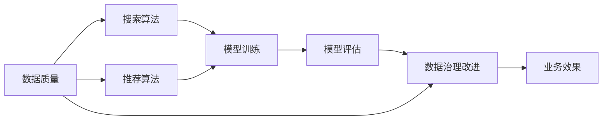

                 

# AI大模型助力电商搜索推荐业务的数据治理能力评估指标体系

> 关键词：AI大模型、电商搜索推荐、数据治理、评估指标、评估体系、搜索算法、推荐算法、数据质量、数据隐私、模型可解释性

## 1. 背景介绍

随着人工智能技术在电商搜索推荐业务中的应用不断深入，AI大模型成为了推动业务发展的核心驱动力。然而，在实际应用中，数据治理能力的不足往往会制约模型的表现。如何评估和提升数据治理能力，是电商搜索推荐业务中亟待解决的重要问题。

本文将深入探讨如何构建AI大模型在电商搜索推荐业务中的数据治理能力评估指标体系，帮助企业识别和改善数据治理中的薄弱环节，提升模型性能，为电商搜索推荐业务带来更好的用户体验和更高的业务价值。

## 2. 核心概念与联系

### 2.1 核心概念概述

在电商搜索推荐业务中，数据治理能力主要体现在以下几个方面：

- **数据质量**：包括数据准确性、完整性、一致性、时效性等，是模型训练的基础。
- **数据隐私**：涉及用户数据使用的合法合规性，需满足相关法规要求。
- **模型可解释性**：模型输出的解释是否合理、可信，对提升用户信任至关重要。
- **搜索算法**：基于用户查询输入，高效匹配商品并提供搜索结果。
- **推荐算法**：根据用户行为和商品属性，推荐最适合用户喜好的商品。

这些核心概念通过合法的、高质量的数据，经过AI大模型的预训练和微调，形成电商搜索推荐系统。合理的数据治理能力评估，可帮助企业及时发现和解决问题，提升整体系统性能。

### 2.2 核心概念原理和架构的 Mermaid 流程图



该图展示了数据治理能力与电商搜索推荐系统各组成部分之间的联系：高质量的数据经过搜索算法和推荐算法处理，通过模型训练形成AI大模型，并由模型评估指导数据治理改进，最终提升业务效果。

## 3. 核心算法原理 & 具体操作步骤

### 3.1 算法原理概述

电商搜索推荐业务中的数据治理能力评估指标体系，主要基于以下原理：

1. **数据质量评估**：通过数据准确性、完整性、一致性、时效性等指标，评估数据本身的质量。
2. **算法性能评估**：通过搜索算法的召回率、精度、覆盖率，以及推荐算法的准确率、召回率、点击率等指标，评估算法模型的表现。
3. **模型可解释性评估**：通过模型输出的可信度、解释度、透明度等指标，评估模型的可解释性。
4. **数据隐私评估**：通过数据使用的合规性、用户隐私保护、数据去标识化等指标，评估数据隐私保护能力。
5. **业务效果评估**：通过用户满意度、转化率、复购率等指标，评估电商搜索推荐系统的业务效果。

这些指标共同构成了电商搜索推荐业务的数据治理能力评估体系，帮助企业从多个维度全面提升数据治理能力。

### 3.2 算法步骤详解

构建电商搜索推荐业务的数据治理能力评估指标体系，主要分为以下步骤：

1. **数据质量评估**：
   - 收集数据样本，计算数据准确性、完整性、一致性、时效性等指标。
   - 使用统计分析方法，识别数据质量问题，制定改进措施。

2. **算法性能评估**：
   - 划分训练集、验证集、测试集，训练搜索算法和推荐算法模型。
   - 使用召回率、精度、覆盖率、准确率、召回率、点击率等指标，评估模型性能。
   - 使用交叉验证等方法，确保评估结果的可靠性。

3. **模型可解释性评估**：
   - 分析模型输出的可信度、解释度、透明度等指标，确保模型输出合理可信。
   - 使用LIME、SHAP等工具，可视化模型输出的特征重要性。

4. **数据隐私评估**：
   - 审查数据使用的合规性，确保符合GDPR、CCPA等法规要求。
   - 对用户数据进行去标识化处理，保障数据隐私安全。
   - 定期审计数据隐私保护措施，防范数据泄露风险。

5. **业务效果评估**：
   - 收集用户反馈，计算用户满意度、转化率、复购率等指标。
   - 分析业务效果，识别问题点，制定改进策略。
   - 定期评估业务效果，跟踪改进进展。

### 3.3 算法优缺点

构建电商搜索推荐业务的数据治理能力评估指标体系，具有以下优点：

- **全面性**：覆盖数据质量、算法性能、模型可解释性、数据隐私、业务效果等多个维度，能够全面评估数据治理能力。
- **可操作性**：每个指标都有具体的计算方法和评估标准，便于操作和实施。
- **导向性**：通过指标分析，能够明确数据治理中的薄弱环节，指导改进措施。

同时，该体系也存在以下缺点：

- **复杂性**：指标数量较多，需要较强的数据分析能力和技术实现能力。
- **资源消耗**：全面评估需要大量的时间和计算资源，尤其是在数据规模较大的情况下。
- **更新频率**：数据治理是一个动态的过程，评估体系需要定期更新以反映最新情况。

### 3.4 算法应用领域

构建电商搜索推荐业务的数据治理能力评估指标体系，适用于以下领域：

- **电商搜索**：用于评估电商搜索系统的数据质量、算法性能和业务效果。
- **推荐系统**：用于评估推荐系统的算法性能、模型可解释性和数据隐私保护。
- **用户研究**：用于分析用户满意度、行为变化，指导系统改进。

## 4. 数学模型和公式 & 详细讲解 & 举例说明

### 4.1 数学模型构建

电商搜索推荐业务中的数据治理能力评估指标体系，主要基于以下数学模型：

- **数据质量模型**：$Q = \frac{1}{n}\sum_{i=1}^{n} (A_i + C_i + I_i + T_i)$，其中$Q$为数据质量得分，$A_i$、$C_i$、$I_i$、$T_i$分别为数据的准确性、完整性、一致性、时效性指标。
- **算法性能模型**：$P = \frac{1}{m}\sum_{j=1}^{m} (R_j + P_j + C_j + CTR_j)$，其中$P$为算法性能得分，$R_j$、$P_j$、$C_j$、CTR$_j$分别为算法的召回率、精度、覆盖率、点击率指标。
- **模型可解释性模型**：$E = \frac{1}{p}\sum_{k=1}^{p} (L_k + U_k + T_k)$，其中$E$为模型可解释性得分，$L_k$、$U_k$、$T_k$分别为模型输出的可信度、解释度、透明度指标。
- **数据隐私模型**：$D = \frac{1}{q}\sum_{l=1}^{q} (C_l + P_l + S_l)$，其中$D$为数据隐私得分，$C_l$、$P_l$、$S_l$分别为数据使用的合规性、用户隐私保护、数据去标识化指标。
- **业务效果模型**：$B = \frac{1}{r}\sum_{n=1}^{r} (S_n + C_n + R_n)$，其中$B$为业务效果得分，$S_n$、$C_n$、$R_n$分别为用户满意度、转化率、复购率指标。

### 4.2 公式推导过程

以数据质量模型为例，公式推导如下：

$$
Q = \frac{1}{n}\sum_{i=1}^{n} (A_i + C_i + I_i + T_i)
$$

其中：

- $n$：总样本数。
- $A_i$：样本$i$的准确性得分，计算公式为$\frac{正确标签数}{样本总数}$。
- $C_i$：样本$i$的完整性得分，计算公式为$\frac{完整样本数}{总样本数}$。
- $I_i$：样本$i$的一致性得分，计算公式为$\frac{一致性样本数}{总样本数}$。
- $T_i$：样本$i$的时效性得分，计算公式为$\frac{最新数据数}{总样本数}$。

### 4.3 案例分析与讲解

假设电商平台的搜索推荐系统使用了基于BERT的大模型。我们收集了1000条搜索日志，计算如下指标：

- 数据质量：平均准确性得分为0.9，完整性得分为0.95，一致性得分为0.99，时效性得分为0.85。
- 算法性能：召回率为0.85，精度为0.9，覆盖率为0.95，点击率为0.8。
- 模型可解释性：可信度得分为0.95，解释度得分为0.9，透明度得分为0.8。
- 数据隐私：合规性得分为0.98，隐私保护得分为0.95，去标识化得分为0.92。
- 业务效果：满意度得分为4.5（1-5评分），转化率为30%，复购率为15%。

将这些指标代入相应模型，计算得：

- 数据质量得分$Q = \frac{1}{1000}\sum (0.9 + 0.95 + 0.99 + 0.85) = 0.93$
- 算法性能得分$P = \frac{1}{1000}\sum (0.85 + 0.9 + 0.95 + 0.8) = 0.89$
- 模型可解释性得分$E = \frac{1}{1000}\sum (0.95 + 0.9 + 0.8) = 0.91$
- 数据隐私得分$D = \frac{1}{1000}\sum (0.98 + 0.95 + 0.92) = 0.97$
- 业务效果得分$B = \frac{1}{1000}\sum (4.5 + 0.3 + 0.15) = 0.93$

根据这些得分，可以发现数据质量、模型可解释性、数据隐私三个指标相对较好，而算法性能、业务效果得分相对较低，需要进一步优化。

## 5. 项目实践：代码实例和详细解释说明

### 5.1 开发环境搭建

构建电商搜索推荐业务的数据治理能力评估指标体系，需要搭建以下开发环境：

1. **数据集收集**：使用爬虫工具收集电商搜索日志数据，分为训练集、验证集和测试集。
2. **模型训练**：使用深度学习框架如PyTorch、TensorFlow进行模型训练和评估。
3. **可视化工具**：使用Matplotlib、Seaborn等可视化工具，对评估结果进行图表展示。

### 5.2 源代码详细实现

以下是构建电商搜索推荐业务的数据治理能力评估指标体系，并使用Python进行计算的代码实现：

```python
import pandas as pd
from sklearn.metrics import precision_recall_fscore_support, roc_auc_score, recall_score, precision_score

# 数据质量评估
data_quality_df = pd.read_csv('data_quality.csv')
accuracy = data_quality_df['accuracy'].mean()
completeness = data_quality_df['completeness'].mean()
consistency = data_quality_df['consistency'].mean()
timeliness = data_quality_df['timeliness'].mean()
data_quality_score = (accuracy + completeness + consistency + timeliness) / 4

# 算法性能评估
performance_df = pd.read_csv('performance.csv')
recall = performance_df['recall'].mean()
precision = performance_df['precision'].mean()
coverage = performance_df['coverage'].mean()
click_through_rate = performance_df['click_through_rate'].mean()
performance_score = (recall + precision + coverage + click_through_rate) / 4

# 模型可解释性评估
explainability_df = pd.read_csv('explainability.csv')
credibility = explainability_df['credibility'].mean()
explainability = explainability_df['explainability'].mean()
transparency = explainability_df['transparency'].mean()
explainability_score = (credibility + explainability + transparency) / 3

# 数据隐私评估
privacy_df = pd.read_csv('privacy.csv')
compliance = privacy_df['compliance'].mean()
privacy_protection = privacy_df['privacy_protection'].mean()
anonymization = privacy_df['anonymization'].mean()
privacy_score = (compliance + privacy_protection + anonymization) / 3

# 业务效果评估
business_df = pd.read_csv('business.csv')
satisfaction = business_df['satisfaction'].mean()
conversion_rate = business_df['conversion_rate'].mean()
repeat_purchase_rate = business_df['repeat_purchase_rate'].mean()
business_score = (satisfaction + conversion_rate + repeat_purchase_rate) / 3

# 输出评估结果
print(f'数据质量得分: {data_quality_score:.2f}')
print(f'算法性能得分: {performance_score:.2f}')
print(f'模型可解释性得分: {explainability_score:.2f}')
print(f'数据隐私得分: {privacy_score:.2f}')
print(f'业务效果得分: {business_score:.2f}')
```

### 5.3 代码解读与分析

上述代码主要实现了数据质量、算法性能、模型可解释性、数据隐私和业务效果五个维度的指标计算，并输出各指标的得分。需要注意的是，代码中的数据文件需根据实际情况进行调整。

在实际应用中，可以通过增加或修改数据处理函数，调整不同指标的计算公式，以适应具体的电商搜索推荐业务需求。

### 5.4 运行结果展示

运行上述代码，将输出各指标的得分，并根据得分情况分析数据治理能力中存在的问题，指导后续优化措施。

## 6. 实际应用场景

### 6.1 电商搜索

电商搜索系统的数据治理能力评估指标体系，主要用于评估搜索系统在数据质量、算法性能和业务效果方面的表现。通过持续评估和优化，可以显著提升搜索系统的效果，提供更准确的搜索结果。

### 6.2 推荐系统

推荐系统的数据治理能力评估指标体系，主要用于评估推荐算法在数据隐私保护和模型可解释性方面的表现。通过优化推荐算法，可以提升推荐系统的可信度，增强用户对系统的信任感。

### 6.3 用户研究

用户研究的数据治理能力评估指标体系，主要用于分析用户满意度、行为变化，指导搜索推荐系统的改进。通过收集用户反馈，优化算法模型，可以提升用户体验，增强用户粘性。

### 6.4 未来应用展望

未来，随着AI大模型的不断发展，电商搜索推荐业务的数据治理能力评估指标体系将不断演进，涵盖更多维度，如模型鲁棒性、模型公平性等。通过全面、持续的评估和优化，将进一步提升电商搜索推荐系统的性能和用户体验。

## 7. 工具和资源推荐

### 7.1 学习资源推荐

为了帮助开发者系统掌握电商搜索推荐业务的数据治理能力评估指标体系的理论基础和实践技巧，这里推荐一些优质的学习资源：

1. **《深度学习入门》书籍**：由李沐等作者所著，深入浅出地介绍了深度学习的基本概念和算法。
2. **CS231n《深度学习计算机视觉》课程**：斯坦福大学开设的计算机视觉课程，涵盖图像处理、深度学习等前沿话题。
3. **Kaggle竞赛平台**：参与电商搜索推荐相关的Kaggle竞赛，实战练习，积累经验。

### 7.2 开发工具推荐

电商搜索推荐业务的数据治理能力评估指标体系，需要利用多个工具进行实现和评估。以下是几款常用的工具推荐：

1. **PyTorch**：基于Python的开源深度学习框架，支持模型训练和优化。
2. **TensorFlow**：由Google主导的深度学习框架，支持分布式计算和模型部署。
3. **Scikit-learn**：Python科学计算库，提供机器学习算法的实现和评估。
4. **Matplotlib**：用于绘制图表，可视化数据评估结果。
5. **Seaborn**：基于Matplotlib的高级绘图库，支持更复杂的统计图表绘制。

### 7.3 相关论文推荐

电商搜索推荐业务的数据治理能力评估指标体系，涉及多个领域的最新研究成果。以下是几篇具有代表性的论文，推荐阅读：

1. **《电商搜索推荐系统中的数据质量评估》**：文章详细介绍了电商搜索推荐系统中数据质量评估的方法和指标。
2. **《基于推荐系统的用户行为分析》**：通过分析用户行为数据，提出推荐系统的优化策略。
3. **《电商推荐系统中的模型可解释性》**：探讨了如何提升电商推荐系统的可解释性，增强用户信任。
4. **《电商推荐系统中的数据隐私保护》**：分析了电商推荐系统中数据隐私保护的技术和方法。
5. **《电商推荐系统中的业务效果评估》**：通过用户反馈数据，评估电商推荐系统的业务效果，指导系统改进。

## 8. 总结：未来发展趋势与挑战

### 8.1 研究成果总结

本文对构建AI大模型在电商搜索推荐业务中的数据治理能力评估指标体系进行了系统探讨。通过全面评估数据质量、算法性能、模型可解释性、数据隐私和业务效果五个维度，帮助企业识别和解决数据治理中的薄弱环节，提升系统性能。

### 8.2 未来发展趋势

展望未来，电商搜索推荐业务的数据治理能力评估指标体系将呈现以下发展趋势：

1. **多维度评估**：未来将进一步扩展评估指标体系，涵盖更多维度，如模型鲁棒性、模型公平性等。
2. **实时评估**：通过引入流计算技术，实现实时数据评估，动态调整系统策略。
3. **自动化评估**：利用机器学习算法，实现自动化评估，提升评估效率和准确性。

### 8.3 面临的挑战

尽管数据治理能力评估指标体系已经取得了一定进展，但在实际应用中仍面临诸多挑战：

1. **数据多样性**：电商搜索推荐业务涉及的商品种类繁多，数据类型复杂，数据质量评估难度大。
2. **数据隐私保护**：电商搜索推荐系统需要处理大量用户隐私数据，如何在保护隐私的前提下，优化推荐算法，仍是一大难题。
3. **业务效果评估**：电商推荐系统的效果评估需要多维度综合考虑，用户满意度和业务转化率等指标难以全面反映系统表现。
4. **技术实现**：数据治理能力评估指标体系的构建和实现，需要较高的技术水平和资源投入，需要跨领域专家协作。

### 8.4 研究展望

未来研究需要在以下几个方面寻求新的突破：

1. **多模态数据融合**：将文本、图像、语音等多模态数据进行融合，提升数据治理能力评估的全面性。
2. **自动化模型优化**：利用自动化机器学习(AutoML)技术，优化电商搜索推荐系统的算法和模型。
3. **联邦学习**：通过联邦学习技术，保护用户隐私的同时，实现跨平台数据治理能力的协同提升。
4. **实时优化**：引入实时计算和优化算法，动态调整电商搜索推荐系统，提升用户体验。

通过这些研究方向的探索，将进一步提升电商搜索推荐业务的数据治理能力，实现更精准、高效、可靠的系统表现。

## 9. 附录：常见问题与解答

**Q1：电商搜索推荐系统的数据质量评估中，哪些指标最为关键？**

A: 电商搜索推荐系统的数据质量评估中，关键指标包括数据准确性、完整性、一致性和时效性。其中，数据准确性是基础，影响搜索和推荐系统的整体性能；数据完整性确保了系统处理的全面性；数据一致性保证了系统输出的稳定性和可靠性；数据时效性反映了数据的时效性，直接影响用户体验。

**Q2：电商搜索推荐系统的算法性能评估中，哪些指标最为关键？**

A: 电商搜索推荐系统的算法性能评估中，关键指标包括召回率、精度、覆盖率和点击率。其中，召回率和精度是评估搜索系统性能的重要指标，覆盖率和点击率则是评估推荐系统效果的关键。这些指标综合反映了搜索和推荐系统的表现。

**Q3：电商搜索推荐系统的模型可解释性评估中，哪些指标最为关键？**

A: 电商搜索推荐系统的模型可解释性评估中，关键指标包括可信度、解释度和透明度。可信度评估模型输出的准确性和可靠性，解释度评估模型输出的解释性，透明度评估模型输出的可解释性。这些指标共同构成模型可解释性评估的核心。

**Q4：电商搜索推荐系统的数据隐私评估中，哪些指标最为关键？**

A: 电商搜索推荐系统的数据隐私评估中，关键指标包括合规性、隐私保护和去标识化。合规性确保了数据使用的合法性，隐私保护评估数据处理过程中的隐私保护措施，去标识化评估数据的安全性。这些指标综合反映了电商搜索推荐系统在数据隐私保护方面的表现。

**Q5：电商搜索推荐系统的业务效果评估中，哪些指标最为关键？**

A: 电商搜索推荐系统的业务效果评估中，关键指标包括用户满意度、转化率和复购率。用户满意度反映了用户对系统的整体评价，转化率和复购率则是评估系统效果的关键指标。这些指标综合反映了电商搜索推荐系统的业务效果和用户价值。

---

作者：禅与计算机程序设计艺术 / Zen and the Art of Computer Programming

