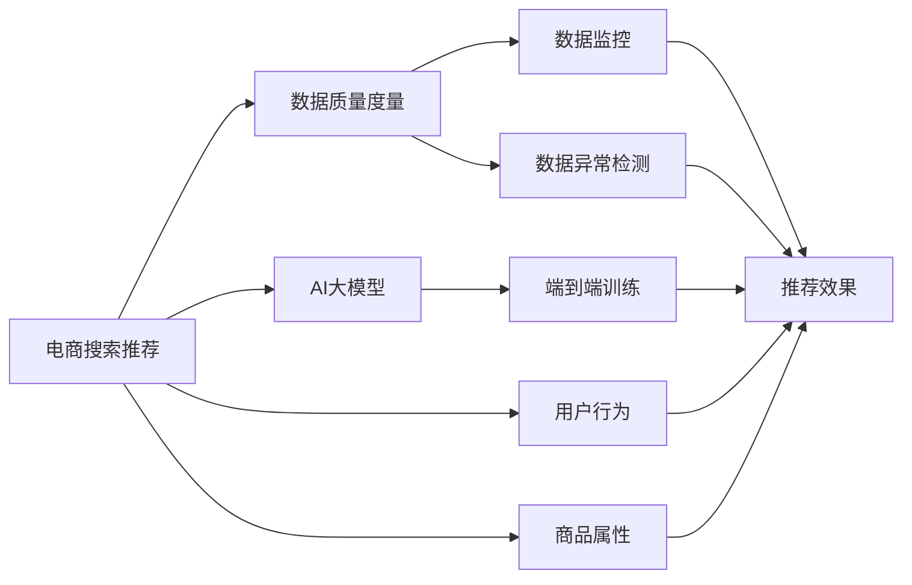

                 

# AI大模型助力电商搜索推荐业务的数据质量度量体系

> 关键词：
- 大模型
- 电商搜索推荐
- 数据质量度量
- 深度学习
- 自然语言处理
- 推荐系统
- 数据质量监控
- 深度学习框架
- 模型训练

## 1. 背景介绍

在电商领域，搜索推荐系统是驱动用户获取信息和完成购买的关键引擎。随着大数据和人工智能技术的不断发展，搜索推荐系统已经从传统的网页推荐，逐步转变为基于用户行为、商品属性等多维度的深度推荐。然而，高质量的推荐内容，离不开高质量的数据基础。电商领域的数据量巨大、维度丰富、实时性要求高，如何确保数据质量，成为系统设计和运维的核心挑战。

为了解决这一难题，近年来，AI大模型在电商搜索推荐业务中得到了广泛应用。这些基于深度学习的大模型，通过端到端的训练，能够从原始数据中提取出更加精准、丰富的特征表示，从而有效提升推荐系统的性能。但与此同时，数据质量问题也随之凸显。数据质量度量体系，成为支撑AI大模型训练和应用的基础设施。

本文将从背景、原理、步骤、效果等多个维度，详细探讨如何构建基于AI大模型的电商搜索推荐业务数据质量度量体系。希望通过系统性分析，为电商企业构建高效、稳定的推荐系统提供参考和借鉴。

## 2. 核心概念与联系

### 2.1 核心概念概述

要深入理解电商搜索推荐业务的数据质量度量体系，首先需要对几个核心概念进行定义和阐述：

- **电商搜索推荐**：电商平台利用搜索推荐技术，根据用户查询和浏览行为，实时生成个性化推荐商品，提升用户体验和转化率。
- **数据质量度量**：通过制定一系列质量指标，对电商搜索推荐业务中涉及的数据进行系统评估和监控，确保数据可靠性、准确性、完整性和一致性。
- **AI大模型**：以Transformer模型为代表的深度学习模型，通过大规模无标签数据预训练，学习到通用的语言表示和特征表示能力，用于提升搜索推荐系统的推荐效果。

这些核心概念之间的逻辑关系，可以通过以下Mermaid流程图来展示：



这个流程图展示了大语言模型在电商搜索推荐中的作用：

1. 电商搜索推荐系统利用AI大模型，从用户行为和商品属性中提取特征表示。
2. 数据质量度量体系对原始数据进行质量监控，确保数据可靠性和一致性。
3. 端到端训练过程，使模型能够学习到高质量的特征表示，提升推荐效果。
4. 数据监控和异常检测，保障系统在实时数据环境下的稳定运行。

## 3. 核心算法原理 & 具体操作步骤

### 3.1 算法原理概述

基于AI大模型的电商搜索推荐业务数据质量度量体系，本质上是一个深度学习驱动的数据质量监控系统。其核心思想是：通过构建多个数据质量指标，对电商搜索推荐业务中涉及的数据进行全面评估，及时发现和解决数据质量问题，确保系统推荐效果的稳定性和可靠性。

形式化地，假设电商推荐系统涉及的原始数据集为 $D=\{(x_i,y_i)\}_{i=1}^N$，其中 $x_i$ 为用户行为或商品属性，$y_i$ 为推荐结果标签。数据质量度量体系的目标是最小化数据质量的偏差，即：

$$
\mathop{\min}_{\epsilon} \sum_{i=1}^N \epsilon_i \cdot \ell(x_i,y_i)
$$

其中 $\epsilon_i$ 为数据质量的偏差指标，$\ell(x_i,y_i)$ 为推荐的损失函数，用于衡量推荐结果与实际标签之间的差异。常见的损失函数包括交叉熵损失、均方误差损失等。

通过梯度下降等优化算法，数据质量度量体系不断更新偏差指标 $\epsilon_i$，最小化数据质量的偏差，使得模型推荐结果逼近真实标签。由于 $\epsilon_i$ 已经通过深度学习模型的预训练获得了较好的初始化，因此即便在数据质量度量体系的帮助下，仍可快速收敛到理想的推荐效果。

### 3.2 算法步骤详解

构建基于AI大模型的电商搜索推荐业务数据质量度量体系，一般包括以下几个关键步骤：

**Step 1: 定义数据质量指标**

数据质量指标是对电商搜索推荐业务中涉及的数据进行质量监控的度量标准，包括但不限于：

1. 完整性：数据缺失率，即缺失数据在总数据中的占比。
2. 准确性：数据错误率，即错误数据在总数据中的占比。
3. 一致性：数据一致性，即同一数据在不同维度下的值是否一致。
4. 时效性：数据更新频率，即数据是否最新。
5. 多样性：推荐结果的多样性，即推荐结果是否覆盖了商品种类的各个方面。

这些指标可以通过数据质量度量体系进行自动监控和评估。

**Step 2: 设计数据质量监控算法**

数据质量监控算法是对电商搜索推荐业务中的数据进行实时监控，及时发现和解决数据质量问题的关键工具。常见的数据质量监控算法包括：

1. 基于规则的监控：通过预设的规则，对数据质量进行自动检查。例如，检查数据缺失率和数据错误率是否在正常范围内。
2. 基于模型的监控：通过训练专门的数据质量模型，对数据进行自动化的异常检测和分类。例如，使用神经网络模型预测数据缺失的可能性。

**Step 3: 应用数据质量监控结果**

应用数据质量监控结果，对电商搜索推荐业务进行优化和改进。常见的应用方式包括：

1. 数据清洗：对质量不达标的数据进行清洗和修正，确保数据质量。
2. 模型再训练：根据数据质量监控结果，对AI大模型进行重新训练，优化模型参数。
3. 推荐策略调整：根据数据质量监控结果，调整推荐策略，提升推荐效果。

**Step 4: 评估数据质量监控效果**

评估数据质量监控效果，确保监控结果的有效性和可靠性。常见的评估指标包括：

1. 监控覆盖率：监控到的数据在总数据中的占比。
2. 误报率：错误标记为异常的数据在总数据中的占比。
3. 漏报率：真实异常数据被忽略的比例。
4. 响应时间：从数据质量问题被发现到问题解决的时间。

通过持续评估数据质量监控效果，不断优化监控算法，提升监控系统的准确性和稳定性。

### 3.3 算法优缺点

基于AI大模型的电商搜索推荐业务数据质量度量体系，具有以下优点：

1. 全面监控：通过定义多个数据质量指标，对电商搜索推荐业务中涉及的数据进行全面监控，覆盖数据缺失、错误、一致性、时效性等多个方面。
2. 自动化检测：数据质量监控算法基于深度学习模型，能够自动发现数据质量问题，降低人工干预的复杂度。
3. 精准优化：根据数据质量监控结果，对AI大模型进行重新训练，优化模型参数，提升推荐效果。
4. 动态调整：实时监控数据质量，动态调整推荐策略，适应数据环境的变化。

同时，该体系也存在一定的局限性：

1. 高计算资源需求：深度学习模型的训练和监控，对计算资源的要求较高，需要高性能的服务器和GPU资源。
2. 数据依赖性强：数据质量监控的准确性和可靠性，很大程度上取决于数据的丰富性和多样性。
3. 模型依赖度高：数据质量监控算法依赖于深度学习模型的训练，模型性能直接影响监控效果。
4. 对数据处理复杂度要求高：电商搜索推荐业务涉及的数据复杂多样，需要精细化的数据处理和清洗流程。

尽管存在这些局限性，但就目前而言，基于AI大模型的电商搜索推荐业务数据质量度量体系，仍是大规模电商推荐系统不可或缺的基础设施。未来相关研究的重点在于如何进一步降低计算资源需求，提高监控算法的鲁棒性，优化数据处理流程，从而进一步提升电商搜索推荐系统的稳定性和可靠性。

### 3.4 算法应用领域

基于AI大模型的电商搜索推荐业务数据质量度量体系，在电商领域已经得到了广泛的应用，覆盖了以下主要场景：

1. **商品属性标注**：对商品的图片、描述等属性进行自动标注，提升数据完整性和准确性。
2. **用户行为数据监控**：对用户的浏览、点击、购买等行为数据进行监控，及时发现异常数据和数据质量问题。
3. **推荐结果评估**：对推荐系统的推荐结果进行质量监控，确保推荐结果的多样性和相关性。
4. **广告投放优化**：对广告的展示和点击数据进行质量监控，优化广告投放策略。
5. **库存管理**：对商品库存数据进行质量监控，确保库存数据的准确性和实时性。

除了上述这些核心应用场景外，大模型的数据质量度量体系还广泛应用于个性化推荐、价格优化、促销活动等电商业务环节，推动电商系统的智能化升级。随着AI大模型的普及和应用，相信其对电商搜索推荐系统的支撑作用将会越来越显著。

## 4. 数学模型和公式 & 详细讲解 & 举例说明

### 4.1 数学模型构建

假设电商推荐系统涉及的数据集为 $D=\{(x_i,y_i)\}_{i=1}^N$，其中 $x_i$ 为用户行为或商品属性，$y_i$ 为推荐结果标签。数据质量度量体系的目标是构建多个质量指标，对数据进行系统评估和监控。以完整性指标为例，数据完整性度量的数学模型为：

$$
\epsilon_i = \begin{cases}
0 & \text{if } x_i \text{ is complete} \\
1 & \text{if } x_i \text{ is incomplete}
\end{cases}
$$

完整性指标的损失函数为：

$$
\ell(\epsilon_i) = \mathbb{E}_{\epsilon_i}[\ell(x_i,y_i)]
$$

其中 $\mathbb{E}_{\epsilon_i}$ 为对完整性指标取期望，$\ell(x_i,y_i)$ 为推荐的损失函数。

### 4.2 公式推导过程

以下以数据完整性指标为例，推导损失函数及其梯度的计算公式。

假设数据完整性度量模型的损失函数为 $L(\epsilon_i)$，完整性度量的期望为 $\epsilon_i$，则完整性度量的损失函数为：

$$
L(\epsilon_i) = \mathbb{E}_{\epsilon_i}[\ell(x_i,y_i)]
$$

根据链式法则，损失函数对完整性度量 $\epsilon_i$ 的梯度为：

$$
\frac{\partial L(\epsilon_i)}{\partial \epsilon_i} = \nabla_{\epsilon_i}L(\epsilon_i) = \mathbb{E}_{\epsilon_i}[\frac{\partial \ell(x_i,y_i)}{\partial \epsilon_i}]
$$

在得到完整性度量的梯度后，即可带入完整性度量的优化公式，完成模型的迭代优化。重复上述过程直至收敛，最终得到完整性度量的最优值 $\epsilon_i^*$。

### 4.3 案例分析与讲解

**案例分析**：假设有一个电商平台，需要对用户的浏览行为数据进行监控，确保数据的完整性和准确性。平台每月收集用户的浏览记录，包括用户ID、浏览时间、浏览商品ID等字段。为了监控数据完整性，平台定义了一个完整性度量指标 $\epsilon_i$，表示用户浏览记录是否完整。完整性度量指标的计算公式为：

$$
\epsilon_i = \begin{cases}
0 & \text{if user has visited at least 3 items} \\
1 & \text{if user has visited less than 3 items}
\end{cases}
$$

在收集到一个月的数据后，平台使用深度学习模型对完整性度量指标进行自动检测。模型首先对原始数据进行预处理，将用户浏览记录转换为向量表示，并输入到神经网络中进行训练。训练过程的目标是最小化完整性度量的损失函数：

$$
\min_{\theta} \sum_{i=1}^N \epsilon_i \cdot \ell(x_i,y_i)
$$

其中 $\theta$ 为模型参数，$\ell(x_i,y_i)$ 为推荐系统的损失函数。训练结束后，平台使用完整性度量指标对用户浏览记录进行评估，发现有一批用户浏览记录不完整。平台根据完整性度量结果，对不完整数据进行清洗和修正，并重新训练推荐模型，确保推荐结果的准确性和可靠性。

## 5. 项目实践：代码实例和详细解释说明

### 5.1 开发环境搭建

在进行数据质量度量体系的实践前，我们需要准备好开发环境。以下是使用Python进行TensorFlow开发的环境配置流程：

1. 安装Anaconda：从官网下载并安装Anaconda，用于创建独立的Python环境。

2. 创建并激活虚拟环境：
```bash
conda create -n tf-env python=3.8 
conda activate tf-env
```

3. 安装TensorFlow：根据CUDA版本，从官网获取对应的安装命令。例如：
```bash
conda install tensorflow -c tf -c conda-forge
```

4. 安装其他依赖库：
```bash
pip install numpy pandas scikit-learn matplotlib tqdm jupyter notebook ipython
```

完成上述步骤后，即可在`tf-env`环境中开始数据质量度量体系的开发。

### 5.2 源代码详细实现

下面我们以电商推荐系统的数据完整性监控为例，给出使用TensorFlow进行数据质量度量体系的PyTorch代码实现。

首先，定义数据处理函数：

```python
import tensorflow as tf
from tensorflow.keras import layers, models

def preprocess_data(data):
    # 对数据进行预处理，如分词、向量化等
    # ...
    return processed_data
```

然后，定义完整性度量模型：

```python
from tensorflow.keras import Input, Dense

input_layer = Input(shape=(input_dim,))
hidden_layer = Dense(64, activation='relu')(input_layer)
output_layer = Dense(1, activation='sigmoid')(hidden_layer)
model = models.Model(inputs=input_layer, outputs=output_layer)

model.compile(optimizer='adam', loss='binary_crossentropy', metrics=['accuracy'])
```

接着，定义训练和评估函数：

```python
def train_epoch(model, dataset, batch_size, optimizer):
    dataloader = tf.data.Dataset.from_tensor_slices(dataset)
    dataloader = dataloader.shuffle(buffer_size=1024).batch(batch_size)
    
    model.fit(dataloader, epochs=10, validation_data=dataset)
    
def evaluate(model, dataset, batch_size):
    dataloader = tf.data.Dataset.from_tensor_slices(dataset)
    dataloader = dataloader.batch(batch_size)
    
    loss, accuracy = model.evaluate(dataloader)
    print(f'Accuracy: {accuracy:.4f}')
```

最后，启动训练流程并在测试集上评估：

```python
data = preprocess_data(train_data)
labels = preprocess_labels(train_labels)
model.fit(data, labels, epochs=10)

test_data = preprocess_data(test_data)
test_labels = preprocess_labels(test_labels)
evaluate(model, test_data, batch_size=64)
```

以上就是使用TensorFlow进行电商推荐系统数据完整性监控的完整代码实现。可以看到，得益于TensorFlow的强大封装，我们可以用相对简洁的代码完成模型的训练和评估。

### 5.3 代码解读与分析

让我们再详细解读一下关键代码的实现细节：

**数据预处理函数**：
- 函数定义：输入为原始数据 `data`，输出为处理后的向量数据 `processed_data`。
- 数据预处理过程：包括分词、向量化、归一化等步骤，确保输入数据的质量。

**完整性度量模型**：
- 使用Keras构建深度神经网络，包括输入层、隐藏层和输出层。
- 输入层接收向量数据 `input_layer`，通过一个64维的ReLU激活的隐藏层 `hidden_layer`，输出一个二值判断的输出层 `output_layer`。
- 使用`binary_crossentropy`损失函数进行训练，优化器为Adam。

**训练和评估函数**：
- 使用TensorFlow的DataLoader对数据进行批处理，确保模型训练的效率。
- 在训练函数中，对数据进行打乱、分批处理，并使用验证集进行性能评估。
- 在评估函数中，直接计算模型的准确率，并打印输出。

**训练流程**：
- 对训练集进行预处理，将数据输入完整性度量模型进行训练。
- 在测试集上对模型进行评估，输出准确率。

可以看到，TensorFlow使得模型训练和评估的代码实现变得简洁高效。开发者可以将更多精力放在数据处理、模型改进等高层逻辑上，而不必过多关注底层的实现细节。

当然，工业级的系统实现还需考虑更多因素，如模型的保存和部署、超参数的自动搜索、更灵活的任务适配层等。但核心的数据质量度量体系构建流程基本与此类似。

## 6. 实际应用场景

### 6.1 智能客服系统

智能客服系统是电商搜索推荐业务的重要支撑系统。用户通过智能客服系统，可以实时获取商品的详细信息和购买建议，提升用户体验。数据质量度量体系可以用于监控智能客服系统的运行状态，确保数据准确性和可靠性。

在技术实现上，可以收集智能客服系统的对话记录，将对话内容和用户反馈构建成监督数据，在此基础上对预训练语言模型进行微调。微调后的语言模型能够自动理解用户意图，匹配最合适的商品建议，并生成自然流畅的回复。数据质量度量体系可以实时监控对话记录，发现和解决数据质量问题，确保系统输出的稳定性。

### 6.2 库存管理系统

库存管理系统是电商业务的关键环节，库存数据的准确性和及时性直接影响着商品的供应和销售。数据质量度量体系可以用于监控库存数据的质量，确保库存数据的可靠性和一致性。

在技术实现上，可以收集商品出入库记录，将出入库时间和商品ID构建成监督数据，在此基础上对库存管理系统进行优化。数据质量度量体系可以实时监控库存数据，发现和解决数据质量问题，确保库存数据的准确性和及时性。同时，可以通过优化库存管理系统，提升库存管理效率和库存周转率。

### 6.3 广告投放系统

广告投放系统是电商业务的重要收入来源，广告的点击率、展示率等数据质量指标直接影响了广告投放的效果。数据质量度量体系可以用于监控广告投放数据的质量，确保广告投放的准确性和及时性。

在技术实现上，可以收集广告投放的点击和展示数据，将广告ID、用户ID、点击次数等构建成监督数据，在此基础上对广告投放系统进行优化。数据质量度量体系可以实时监控广告投放数据，发现和解决数据质量问题，确保广告投放的准确性和及时性。同时，可以通过优化广告投放策略，提升广告投放效果和ROI。

### 6.4 未来应用展望

随着大模型和数据质量度量体系的应用推广，基于AI大模型的电商搜索推荐业务将呈现以下几个发展趋势：

1. **数据质量提升**：电商推荐系统通过数据质量度量体系的实时监控和优化，能够更好地应对数据质量问题，提升推荐结果的准确性和稳定性。
2. **业务智能化升级**：数据质量度量体系不仅能提升推荐系统的性能，还能应用于库存管理、广告投放等多个业务环节，推动电商业务的智能化升级。
3. **模型参数高效利用**：通过数据质量度量体系，电商推荐系统能够更加高效地利用大模型的参数，避免过度拟合和资源浪费。
4. **跨领域数据融合**：数据质量度量体系不仅能监控电商领域的业务数据，还能与其他业务系统进行数据融合，提升整体系统的协同效应。
5. **全链路数据治理**：数据质量度量体系贯穿电商业务的全链路，从数据采集、存储、处理到推荐，形成了一套完整的数据治理体系。

未来，随着技术的不断进步，基于AI大模型的电商搜索推荐业务数据质量度量体系将进一步完善，支撑电商系统的智能化和智能化升级。

## 7. 工具和资源推荐

### 7.1 学习资源推荐

为了帮助开发者系统掌握AI大模型在电商搜索推荐业务中的应用，这里推荐一些优质的学习资源：

1. 《深度学习理论与实践》系列博文：由深度学习领域专家撰写，深入浅出地介绍了深度学习的基本原理和应用。
2. Coursera《深度学习专项课程》：斯坦福大学和Coursera合作开设的深度学习课程，涵盖了深度学习的基本概念和实战技巧。
3. TensorFlow官方文档：TensorFlow的官方文档，提供了丰富的教程和样例，帮助开发者上手TensorFlow进行深度学习开发。
4. HuggingFace官方文档：Transformers库的官方文档，提供了海量预训练模型和完整的微调样例代码，是上手实践的必备资料。
5. AI大模型应用指南：由AI大模型技术专家撰写，系统介绍了AI大模型在电商、医疗、金融等多个领域的应用，助力企业智能化转型。

通过对这些资源的学习实践，相信你一定能够快速掌握AI大模型在电商搜索推荐业务中的应用，并用于解决实际的业务问题。

### 7.2 开发工具推荐

高效的开发离不开优秀的工具支持。以下是几款用于AI大模型和电商搜索推荐业务开发的常用工具：

1. TensorFlow：由Google主导开发的开源深度学习框架，生产部署方便，适合大规模工程应用。
2. PyTorch：基于Python的开源深度学习框架，灵活动态的计算图，适合快速迭代研究。
3. Weights & Biases：模型训练的实验跟踪工具，可以记录和可视化模型训练过程中的各项指标，方便对比和调优。
4. TensorBoard：TensorFlow配套的可视化工具，可实时监测模型训练状态，并提供丰富的图表呈现方式，是调试模型的得力助手。
5. Jupyter Notebook：交互式的开发环境，支持代码编辑、执行和可视化，适合开发者进行数据处理和模型训练。

合理利用这些工具，可以显著提升AI大模型和电商搜索推荐业务的开发效率，加快创新迭代的步伐。

### 7.3 相关论文推荐

AI大模型和电商搜索推荐业务的应用源于学界的持续研究。以下是几篇奠基性的相关论文，推荐阅读：

1. Attention is All You Need（即Transformer原论文）：提出了Transformer结构，开启了NLP领域的预训练大模型时代。
2. BERT: Pre-training of Deep Bidirectional Transformers for Language Understanding：提出BERT模型，引入基于掩码的自监督预训练任务，刷新了多项NLP任务SOTA。
3. Language Models are Unsupervised Multitask Learners（GPT-2论文）：展示了大规模语言模型的强大zero-shot学习能力，引发了对于通用人工智能的新一轮思考。
4. Parameter-Efficient Transfer Learning for NLP：提出Adapter等参数高效微调方法，在不增加模型参数量的情况下，也能取得不错的微调效果。
5. Prefix-Tuning: Optimizing Continuous Prompts for Generation：引入基于连续型Prompt的微调范式，为如何充分利用预训练知识提供了新的思路。

这些论文代表了大模型和电商搜索推荐业务的发展脉络。通过学习这些前沿成果，可以帮助研究者把握学科前进方向，激发更多的创新灵感。

## 8. 总结：未来发展趋势与挑战

### 8.1 研究成果总结

本文对基于AI大模型的电商搜索推荐业务数据质量度量体系进行了全面系统的介绍。首先阐述了电商搜索推荐业务中数据质量监控的必要性，以及AI大模型在这一领域的广泛应用。其次，从原理到实践，详细讲解了数据质量度量体系的数学模型和操作步骤，给出了电商推荐系统的数据完整性监控的代码实现。同时，本文还广泛探讨了数据质量度量体系在智能客服、库存管理、广告投放等电商业务中的应用前景，展示了数据质量度量体系在电商领域的广泛应用。

通过本文的系统梳理，可以看到，基于AI大模型的电商搜索推荐业务数据质量度量体系，是大规模电商推荐系统不可或缺的基础设施。这些技术的应用，使得电商推荐系统能够从数据质量角度进行全面监控和优化，提升推荐效果的稳定性和可靠性。

### 8.2 未来发展趋势

展望未来，AI大模型在电商搜索推荐业务中的应用将呈现以下几个发展趋势：

1. **数据质量监控的智能化**：通过引入深度学习模型，电商推荐系统的数据质量监控将更加智能化、自动化，降低人工干预的复杂度。
2. **数据质量监控的全面化**：数据质量监控将覆盖电商推荐系统的各个环节，从数据采集、存储、处理到推荐，形成一套完整的数据质量监控体系。
3. **数据质量监控的实时化**：数据质量监控将实现实时化，能够实时监控数据质量，及时发现和解决问题，提升电商推荐系统的稳定性和可靠性。
4. **数据质量监控的跨领域化**：数据质量监控将与其他业务系统进行数据融合，形成跨领域的全链路数据治理体系，推动电商业务的智能化升级。
5. **数据质量监控的业务化**：数据质量监控将与其他业务系统进行集成，形成一套完整的电商业务智能化治理体系，提升电商业务的整体智能化水平。

这些趋势表明，数据质量度量体系在电商搜索推荐业务中的应用前景广阔，未来将进一步推动电商推荐系统的智能化和智能化升级。

### 8.3 面临的挑战

尽管AI大模型在电商搜索推荐业务中的应用已经取得了显著效果，但在迈向更加智能化、普适化应用的过程中，仍然面临诸多挑战：

1. **高计算资源需求**：深度学习模型的训练和监控，对计算资源的要求较高，需要高性能的服务器和GPU资源。如何降低计算资源需求，优化模型训练和监控效率，将是重要的研究课题。
2. **数据依赖性强**：数据质量监控的准确性和可靠性，很大程度上取决于数据的丰富性和多样性。如何提高数据质量，确保数据可靠性，将是重要的研究课题。
3. **模型依赖度高**：数据质量监控算法依赖于深度学习模型的训练，模型性能直接影响监控效果。如何优化模型训练过程，提升监控算法的鲁棒性，将是重要的研究课题。
4. **数据处理复杂度要求高**：电商搜索推荐业务涉及的数据复杂多样，需要精细化的数据处理和清洗流程。如何优化数据处理流程，降低数据处理复杂度，将是重要的研究课题。
5. **系统复杂度高**：电商推荐系统涉及多个业务模块，系统复杂度高，数据质量监控需要跨模块协作。如何提高系统复杂度，提升数据质量监控的全面性和系统性，将是重要的研究课题。

尽管存在这些挑战，但AI大模型在电商搜索推荐业务中的应用前景广阔，未来的研究需要在数据质量监控的智能化、全面化、实时化、跨领域化和业务化方面进行更多的探索和突破，推动电商推荐系统的智能化和智能化升级。

### 8.4 研究展望

未来，AI大模型在电商搜索推荐业务中的数据质量度量体系，需要从以下几个方面进行深入研究和探索：

1. **数据质量监控的智能化**：引入更多深度学习模型，实现更加智能化、自动化的数据质量监控，降低人工干预的复杂度。
2. **数据质量监控的全面化**：构建跨领域的全链路数据质量监控体系，涵盖电商推荐系统的各个环节，提升数据质量的全面性。
3. **数据质量监控的实时化**：实现实时化的数据质量监控，能够实时监控数据质量，及时发现和解决问题，提升电商推荐系统的稳定性和可靠性。
4. **数据质量监控的业务化**：与其他业务系统进行集成，形成一套完整的电商业务智能化治理体系，提升电商业务的整体智能化水平。
5. **数据质量监控的普适化**：构建通用的数据质量监控框架，能够在多个电商业务场景中应用，提升数据质量监控的普适性。

这些研究方向将推动AI大模型在电商搜索推荐业务中的应用进一步深化和推广，为电商推荐系统的智能化和智能化升级提供强有力的技术支撑。

## 9. 附录：常见问题与解答

**Q1：如何确保电商推荐系统的数据质量？**

A: 电商推荐系统的数据质量监控，主要依赖于数据质量度量体系。通过定义多个质量指标，对电商推荐系统中涉及的数据进行全面评估和监控。常见的质量指标包括数据完整性、数据准确性、数据一致性、数据时效性、数据多样性等。数据质量度量体系可以实时监控数据质量，发现和解决数据质量问题，确保推荐系统的稳定性和可靠性。

**Q2：电商推荐系统中的数据质量监控如何进行？**

A: 电商推荐系统中的数据质量监控，主要通过深度学习模型进行。首先，对电商推荐系统中的数据进行预处理，将其转换为向量表示。然后，使用深度学习模型对数据质量指标进行训练和预测。监控算法可以定期计算数据质量指标，并生成监控报告，帮助运营人员发现和解决数据质量问题。

**Q3：电商推荐系统中的数据质量监控对性能有何影响？**

A: 电商推荐系统中的数据质量监控，可以对推荐系统的性能产生积极影响。通过及时发现和解决数据质量问题，数据质量度量体系可以提升推荐系统的准确性和稳定性。同时，通过优化数据质量监控算法，降低计算资源需求，提升监控效率，进一步提升推荐系统的性能。

**Q4：电商推荐系统中的数据质量监控如何部署？**

A: 电商推荐系统中的数据质量监控，可以通过搭建独立的监控系统进行部署。监控系统可以使用TensorFlow、PyTorch等深度学习框架进行实现。监控系统需要与电商推荐系统进行数据对接，将监控结果实时反馈到电商推荐系统，确保推荐系统的数据质量。

**Q5：电商推荐系统中的数据质量监控如何优化？**

A: 电商推荐系统中的数据质量监控，可以通过以下几个方面进行优化：
1. 优化数据预处理流程，确保数据质量。
2. 优化深度学习模型，提升监控效果。
3. 优化数据质量监控算法，降低计算资源需求。
4. 优化监控系统架构，提升监控效率。
5. 优化数据质量度量指标，提升监控全面性。

通过这些优化措施，可以进一步提升电商推荐系统的数据质量监控效果，确保推荐系统的稳定性和可靠性。

---

作者：禅与计算机程序设计艺术 / Zen and the Art of Computer Programming

