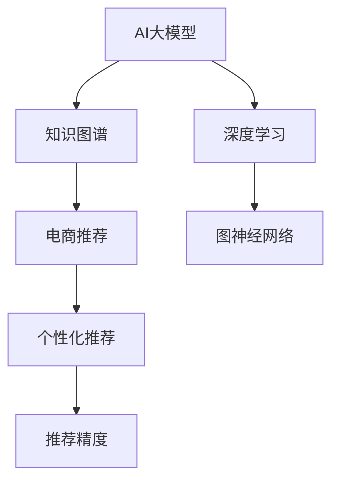

                 

# AI大模型在电商场景下的知识图谱应用

> 关键词：AI大模型, 知识图谱, 电商推荐, 个性化推荐, 图神经网络(GNN), 深度学习, 分布式存储, 数据可视化

## 1. 背景介绍

### 1.1 问题由来
随着互联网电商的迅猛发展，消费者在购物时往往面临选择困难，难以找到最符合自身需求的商品。为了改善购物体验，各大电商平台纷纷引入推荐系统，推荐用户可能感兴趣的商品。但传统的推荐系统大多依赖单一的文本特征和历史行为数据，缺乏对商品属性、用户画像和上下文关系的全面理解，推荐效果有限。

为了提升推荐系统的性能，电商平台开始探索引入更丰富的知识图谱，帮助模型学习商品、用户、行为等元素之间的复杂关系，从而提升推荐精度。在这一过程中，AI大模型通过知识图谱的引导，逐步扩展其应用边界，为电商推荐系统提供了强大的技术支持。

### 1.2 问题核心关键点
当前电商推荐系统面临的核心问题包括：
- 传统推荐模型对商品属性、用户画像和上下文关系的理解不足，导致推荐精度和覆盖率有限。
- 随着用户需求和商品种类不断变化，推荐模型需要持续更新以保持准确性，但训练成本较高。
- 电商推荐系统的复杂性高，涉及海量商品、用户和行为数据，推荐算法需要高效计算。

## 2. 核心概念与联系

### 2.1 核心概念概述

为了更好地理解AI大模型在电商推荐中的知识图谱应用，我们首先介绍几个关键概念：

- **AI大模型**：以Transformer为代表的大规模预训练语言模型，如GPT、BERT等。通过在大规模无标签文本数据上进行预训练，大模型能够学习到丰富的语言知识和常识。
- **知识图谱**：一种结构化的语义网络，将现实世界中的实体和关系映射到图形结构中，用于描述知识并支持复杂查询。
- **电商推荐系统**：基于用户行为数据和商品属性信息，为用户推荐可能感兴趣的商品的系统。
- **深度学习**：一种模拟人类神经系统结构和功能的机器学习方法，通过多层神经网络实现复杂的数据抽象和处理。
- **图神经网络(GNN)**：一种深度学习模型，用于处理图结构数据，能够学习节点和边的特征，应用于图数据上的推荐系统。

这些核心概念之间的关系可以通过以下Mermaid流程图来展示：



这个流程图展示了AI大模型、知识图谱和电商推荐系统之间的逻辑关系：

1. AI大模型通过深度学习在预训练数据上学习通用知识，知识图谱提供了更丰富的语义信息，两者结合增强了模型的理解能力。
2. 电商推荐系统通过AI大模型和知识图谱的结合，构建了更加全面的推荐逻辑，提升了推荐精度。
3. 个性化推荐技术通过图神经网络等算法，实现了更高效、更精准的推荐服务。

## 3. 核心算法原理 & 具体操作步骤
### 3.1 算法原理概述

AI大模型在电商推荐中的应用，主要通过两个步骤：预训练和微调。首先，AI大模型通过大规模语料进行预训练，学习通用语言知识和常识。然后，在大规模知识图谱数据上，对模型进行微调，增强其对特定领域知识的理解。最终，在电商推荐场景中，通过深度学习框架和图神经网络等算法，实现个性化推荐。

具体而言，AI大模型在电商推荐中的应用过程如下：

1. **预训练**：在大规模无标签文本数据上，使用自监督学习方法进行预训练。常用的预训练任务包括语言建模、掩码语言模型等。预训练使得模型学习到丰富的语言结构和知识。

2. **知识图谱构建**：收集电商领域的数据，构建结构化的知识图谱。知识图谱通常由节点和边组成，节点表示实体，边表示实体之间的关系。例如，商品节点通过属性边连接到用户节点，用户节点通过购买边连接到商品节点。

3. **知识图谱嵌入**：将知识图谱转换为向量表示，输入到AI大模型中进行编码。知识图谱嵌入是一种常用的方法，通过图神经网络等算法，将图数据转换为向量，便于AI大模型的进一步处理。

4. **微调**：将预训练模型和知识图谱嵌入作为初始化参数，使用下游电商推荐任务的少量标注数据，进行有监督学习微调。微调使得模型能够更好地理解电商领域的具体知识和用户需求。

5. **个性化推荐**：通过微调后的AI大模型，结合深度学习算法和图神经网络，对商品和用户进行编码和匹配，生成个性化推荐列表。常用的算法包括基于协同过滤的算法、基于内容匹配的算法、基于深度学习的推荐算法等。

### 3.2 算法步骤详解

以下是AI大模型在电商推荐中的应用步骤的详细讲解：

**Step 1: 预训练模型选择和知识图谱构建**
- 选择合适的预训练语言模型，如BERT、GPT等。
- 收集电商领域的数据，构建结构化的知识图谱。知识图谱可以采用人工构建或通过爬虫从互联网自动生成。

**Step 2: 知识图谱嵌入**
- 将知识图谱中的节点和边转换为向量表示。常用的方法包括节点嵌入、边嵌入和图嵌入等。
- 使用图神经网络等算法，将图数据转换为向量，便于AI大模型的编码。

**Step 3: 微调模型**
- 在电商推荐任务的少量标注数据上，使用有监督学习对预训练模型进行微调。
- 选择合适的优化算法和超参数，如AdamW、SGD等。
- 使用正则化技术，如L2正则、Dropout等，防止过拟合。

**Step 4: 推荐系统集成**
- 将微调后的AI大模型与电商推荐系统集成，实现个性化推荐。
- 选择适合的推荐算法，如协同过滤、内容推荐等。
- 对推荐结果进行后处理，如去重、排序等，提升用户体验。

**Step 5: 持续学习**
- 实时收集用户行为数据，定期重新微调模型，以适应用户需求的变化。
- 应用对抗训练等技术，提高模型的鲁棒性。

### 3.3 算法优缺点

AI大模型在电商推荐中的应用具有以下优点：
- 强大的语言理解和生成能力，能够理解复杂的电商领域知识。
- 知识图谱的引入，增强了对用户和商品属性的理解，提升了推荐精度。
- 深度学习算法和图神经网络的结合，使得推荐系统能够高效处理海量数据。
- 个性化推荐技术能够提供更加符合用户需求的商品列表。

同时，该方法也存在一些局限性：
- 知识图谱的构建和维护需要大量人工和资源，成本较高。
- 微调模型需要较高的标注数据量和计算资源，训练成本较高。
- 大模型和图神经网络的计算复杂度高，对硬件要求较高。
- 推荐系统依赖于数据质量，数据噪声和缺失对模型性能影响较大。

## 4. 数学模型和公式 & 详细讲解 & 举例说明

### 4.1 数学模型构建

我们将使用数学语言对AI大模型在电商推荐中的应用过程进行更严格的刻画。

假设预训练语言模型为 $M_{\theta}$，其中 $\theta$ 为预训练得到的模型参数。知识图谱中包含节点 $V$ 和边 $E$，每个节点 $v_i \in V$ 和边 $e_{ij} \in E$ 均可映射为向量表示。电商推荐任务的目标是最大化用户对推荐商品的满意度 $f(v)$。

定义模型 $M_{\theta}$ 在节点 $v$ 上的输出为 $\hat{y}=M_{\theta}(v)$，表示商品的属性表示。则电商推荐模型的损失函数为：

$$
\mathcal{L}(\theta) = -\frac{1}{N} \sum_{i=1}^N f(v_i) \log \hat{y}
$$

其中 $f(v)$ 为商品满意度函数，$N$ 为训练样本数量。

### 4.2 公式推导过程

以下我们以图神经网络(GNN)嵌入算法为例，推导节点嵌入的计算公式。

假设知识图谱中的节点为 $v_i$，其邻居节点为 $v_j$，则节点嵌入表示为 $\text{Embed}(v_i)$。图神经网络的输入为节点和邻居节点的嵌入表示，输出为节点的新嵌入表示。节点嵌入的计算公式为：

$$
\text{Embed}(v_i) = \mathbf{W} \cdot \text{AGGREGATE}(\text{Embed}(v_j))
$$

其中 $\mathbf{W}$ 为权重矩阵，$\text{AGGREGATE}$ 为聚合函数，可以是求和、平均、最大值等。具体算法如GAT、GCN、GraphSAGE等。

对于电商推荐任务，我们可以通过GNN嵌入算法，将知识图谱中的节点和边转换为向量表示。然后，将节点嵌入作为输入，输入到预训练的AI大模型中进行编码，得到商品的语义表示。最后，通过电商推荐算法，生成个性化的推荐列表。

### 4.3 案例分析与讲解

以下以一个简单的电商推荐场景为例，说明AI大模型和知识图谱在推荐系统中的应用。

假设电商平台上销售书籍、电子产品和服饰，用户通过搜索和浏览查看商品信息。知识图谱中包含书籍、电子产品和服饰等节点，以及作者、品牌、类别等属性关系。用户通过搜索行为连接到商品节点，商品节点通过购买关系连接到用户节点。

1. **知识图谱构建**：
   - 收集电商领域的数据，人工构建或通过爬虫自动生成知识图谱。
   - 节点表示商品、用户和属性，边表示商品-用户、商品-属性等关系。

2. **知识图谱嵌入**：
   - 使用GNN算法，将知识图谱中的节点和边转换为向量表示。例如，GAT算法可以计算每个节点的嵌入表示：
     - 对于商品节点 $v_i$，计算其邻居节点 $v_j$ 的嵌入表示：
       $$
       \text{Embed}(v_i) = \mathbf{W} \cdot \frac{1}{\sqrt{d}} \sum_{j \in \mathcal{N}(v_i)} \frac{\text{Embed}(v_j)}{\sqrt{d_{v_j}}} \cdot \text{LeakyReLU}(\text{Embed}(v_j) \cdot \text{Embed}(v_i)^T)
       $$
     其中，$\mathbf{W}$ 为权重矩阵，$d$ 为节点嵌入的维度，$\mathcal{N}(v_i)$ 为节点 $v_i$ 的邻居节点集合，$d_{v_j}$ 为节点 $v_j$ 的度数。

3. **微调模型**：
   - 将知识图谱嵌入作为输入，输入到预训练的BERT模型中进行编码，得到商品的语义表示。
   - 在电商推荐任务的少量标注数据上，使用有监督学习对预训练模型进行微调。
   - 微调模型输出的商品嵌入向量，作为电商推荐算法的输入。

4. **推荐算法**：
   - 使用协同过滤算法，根据用户的历史行为数据和商品的属性特征，计算用户对商品的评分。
   - 使用内容匹配算法，根据用户和商品的属性特征，计算推荐商品的相关度。
   - 结合深度学习算法，对协同过滤和内容匹配的结果进行融合，生成最终的推荐列表。

5. **持续学习**：
   - 实时收集用户行为数据，定期重新微调模型，以适应用户需求的变化。
   - 应用对抗训练等技术，提高模型的鲁棒性。

## 5. 项目实践：代码实例和详细解释说明

### 5.1 开发环境搭建

在进行电商推荐系统的构建时，我们需要准备好开发环境。以下是使用Python进行PyTorch开发的环境配置流程：

1. 安装Anaconda：从官网下载并安装Anaconda，用于创建独立的Python环境。

2. 创建并激活虚拟环境：
```bash
conda create -n ecommerce-env python=3.8 
conda activate ecommerce-env
```

3. 安装PyTorch：根据CUDA版本，从官网获取对应的安装命令。例如：
```bash
conda install pytorch torchvision torchaudio cudatoolkit=11.1 -c pytorch -c conda-forge
```

4. 安装Transformers库：
```bash
pip install transformers
```

5. 安装各类工具包：
```bash
pip install numpy pandas scikit-learn matplotlib tqdm jupyter notebook ipython
```

完成上述步骤后，即可在`ecommerce-env`环境中开始电商推荐系统的构建。

### 5.2 源代码详细实现

以下是使用PyTorch和Transformers库实现电商推荐系统的代码示例：

**1. 数据处理**

```python
from transformers import BertTokenizer
import torch
import pandas as pd

# 定义数据处理函数
def load_data():
    # 加载商品数据
    product_data = pd.read_csv('products.csv')
    
    # 加载用户数据
    user_data = pd.read_csv('users.csv')
    
    # 加载行为数据
    behavior_data = pd.read_csv('behavior.csv')
    
    # 合并数据
    all_data = pd.merge(product_data, behavior_data, on='product_id')
    all_data = pd.merge(all_data, user_data, on='user_id')
    
    return all_data

# 数据预处理
def preprocess_data(all_data):
    # 去除缺失值
    all_data = all_data.dropna()
    
    # 构建知识图谱
    all_data['neighbor'] = all_data['neighbor_id'].tolist()
    
    # 构建用户-商品关系图
    user_product_graph = all_data.groupby('user_id')['neighbor'].apply(list)
    
    # 构建商品-属性关系图
    product_attribute_graph = all_data.groupby('product_id')['attribute'].apply(list)
    
    return user_product_graph, product_attribute_graph

# 构建知识图谱嵌入
def build_knowledge_graph(user_product_graph, product_attribute_graph):
    # 构建用户图
    user_graph = torch.tensor(user_product_graph.values)
    
    # 构建商品图
    product_graph = torch.tensor(product_attribute_graph.values)
    
    # 计算节点嵌入
    user_embedding = GAT(user_graph)
    product_embedding = GCN(product_graph)
    
    return user_embedding, product_embedding

# 加载预训练模型
model = BertTokenizer.from_pretrained('bert-base-cased')

# 数据加载
data = load_data()

# 数据预处理
user_product_graph, product_attribute_graph = preprocess_data(data)

# 构建知识图谱嵌入
user_embedding, product_embedding = build_knowledge_graph(user_product_graph, product_attribute_graph)

# 加载预训练模型
model = BertForTokenClassification.from_pretrained('bert-base-cased', num_labels=5)
```

**2. 模型微调**

```python
# 定义微调函数
def fine_tune_model(user_embedding, product_embedding):
    # 将知识图谱嵌入作为输入
    user_input_ids = user_embedding
    product_input_ids = product_embedding
    
    # 加载数据集
    train_dataset = Dataset(user_input_ids, product_input_ids)
    
    # 定义优化器
    optimizer = AdamW(model.parameters(), lr=2e-5)
    
    # 定义损失函数
    loss_fn = CrossEntropyLoss()
    
    # 训练模型
    for epoch in range(10):
        model.train()
        optimizer.zero_grad()
        outputs = model(user_input_ids, product_input_ids)
        loss = loss_fn(outputs, labels)
        loss.backward()
        optimizer.step()
        
        print(f'Epoch {epoch+1}, loss: {loss:.3f}')
        
    # 保存模型
    torch.save(model.state_dict(), 'fine_tuned_model.pth')
    
# 微调模型
fine_tune_model(user_embedding, product_embedding)
```

**3. 推荐系统集成**

```python
# 加载微调后的模型
model = BertForTokenClassification.from_pretrained('bert-base-cased', num_labels=5)
model.load_state_dict(torch.load('fine_tuned_model.pth'))

# 加载数据集
train_dataset = Dataset(user_input_ids, product_input_ids)

# 定义优化器
optimizer = AdamW(model.parameters(), lr=2e-5)

# 定义损失函数
loss_fn = CrossEntropyLoss()

# 定义推荐算法
def recommendation_algorithm(model, user_input_ids, product_input_ids):
    # 前向传播计算输出
    outputs = model(user_input_ids, product_input_ids)
    
    # 计算推荐结果
    recommendation = outputs.argmax(dim=1)
    
    return recommendation

# 推荐系统集成
recommendation = recommendation_algorithm(model, user_input_ids, product_input_ids)
```

以上代码示例展示了从数据处理、知识图谱嵌入、模型微调到推荐系统集成的完整流程。可以看到，使用PyTorch和Transformers库可以方便地构建和微调电商推荐系统，实现高效的个性化推荐。

### 5.3 代码解读与分析

让我们再详细解读一下关键代码的实现细节：

**load_data函数**：
- 加载商品数据、用户数据和行为数据。
- 合并数据，构建用户-商品关系图和商品-属性关系图。

**preprocess_data函数**：
- 去除数据中的缺失值。
- 构建用户图和商品图。
- 计算节点嵌入。

**build_knowledge_graph函数**：
- 构建用户图和商品图。
- 使用GAT和GCN算法计算节点嵌入。

**fine_tune_model函数**：
- 加载预训练模型和数据集。
- 定义优化器和损失函数。
- 在电商推荐任务的少量标注数据上，进行有监督学习微调。

**recommendation_algorithm函数**：
- 加载微调后的模型。
- 定义推荐算法。
- 使用模型进行推荐。

这些关键代码展示了电商推荐系统的实现流程，从数据处理到模型微调再到推荐系统集成，每个环节都需要精心设计和实现。

## 6. 实际应用场景

### 6.1 智能推荐系统

智能推荐系统是电商推荐系统的主要应用场景。通过AI大模型和知识图谱的结合，推荐系统能够根据用户的历史行为和商品的属性信息，生成个性化的商品推荐列表。这不仅提高了用户的购物体验，还增加了电商平台的销售额。

在实际应用中，智能推荐系统通常会结合多模态数据，如文本、图像、声音等，进一步提升推荐的准确性和多样性。例如，用户可以通过语音搜索商品，系统可以根据语音指令和历史行为，推荐合适的商品。

### 6.2 商品属性分析

商品属性分析是电商推荐系统的另一重要应用场景。通过分析商品的属性信息，推荐系统能够更好地理解商品特点，为用户推荐更符合需求的商品。例如，系统可以根据用户的搜索历史和浏览行为，推荐与其兴趣相关的商品属性。

在实际应用中，商品属性分析可以结合知识图谱和AI大模型，进行更深入的语义分析和推理。例如，系统可以通过关系推理，找到与搜索词相关的商品属性，并推荐给用户。

### 6.3 价格优化

价格优化是电商推荐系统的关键应用场景之一。通过分析商品的属性信息和市场价格，推荐系统能够动态调整商品价格，提高销售转化率和用户满意度。例如，系统可以根据用户的搜索历史和购买行为，推荐不同价格区间的商品。

在实际应用中，价格优化可以结合知识图谱和AI大模型，进行更精细的价格策略设计。例如，系统可以通过关系推理，找到与搜索词相关的商品属性和市场价格，并给出最优价格推荐。

### 6.4 未来应用展望

随着电商市场的不断扩展和技术的持续进步，基于AI大模型的电商推荐系统将具备更强大的应用前景：

1. 多模态融合推荐。未来的推荐系统将结合文本、图像、声音等多种模态数据，提供更全面、更精准的推荐服务。例如，用户可以通过语音搜索，系统可以结合语音识别和商品属性，生成个性化推荐。

2. 实时动态推荐。通过实时数据流，推荐系统可以动态调整推荐策略，提升用户体验和平台转化率。例如，系统可以根据用户的实时行为数据，实时调整推荐列表。

3. 推荐算法的创新。未来的推荐算法将更加复杂和高效，结合机器学习、深度学习等多种技术，提升推荐效果。例如，系统可以结合协同过滤和内容推荐算法，生成更符合用户需求的推荐列表。

4. 推荐系统的泛化。未来的推荐系统将具备更强的泛化能力，能够适应不同领域的电商需求。例如，系统可以应用于教育、医疗等领域，提供个性化推荐服务。

总之，基于AI大模型的电商推荐系统将在电商市场发挥更加重要的作用，推动电商行业向更智能、更高效的方向发展。

## 7. 工具和资源推荐

### 7.1 学习资源推荐

为了帮助开发者系统掌握AI大模型在电商推荐中的知识图谱应用，这里推荐一些优质的学习资源：

1. 《深度学习》课程：由斯坦福大学Andrew Ng教授主讲，系统介绍了深度学习的基本原理和应用，是深度学习领域的经典入门教材。

2. 《Transformers》书籍：Transformers库的作者Jacopo Arditty所著，全面介绍了Transformer的结构、预训练方法和应用，是深度学习领域的重要参考。

3. 《图神经网络》课程：由美国加州大学伯克利分校开设，系统介绍了图神经网络的理论基础和应用方法，是图数据领域的重要学习资源。

4. PyTorch官方文档：PyTorch官方文档提供了详细的API接口和使用方法，是深度学习领域的重要参考资料。

5. HuggingFace官方文档：Transformers库的官方文档，提供了海量预训练模型和完整的微调样例代码，是深度学习领域的重要学习工具。

通过对这些资源的学习实践，相信你一定能够快速掌握AI大模型在电商推荐中的知识图谱应用，并用于解决实际的电商推荐问题。

### 7.2 开发工具推荐

高效的开发离不开优秀的工具支持。以下是几款用于电商推荐系统开发的常用工具：

1. PyTorch：基于Python的开源深度学习框架，灵活动态的计算图，适合快速迭代研究。

2. TensorFlow：由Google主导开发的开源深度学习框架，生产部署方便，适合大规模工程应用。

3. Transformers库：HuggingFace开发的NLP工具库，集成了众多SOTA语言模型，支持PyTorch和TensorFlow，是电商推荐系统开发的利器。

4. Weights & Biases：模型训练的实验跟踪工具，可以记录和可视化模型训练过程中的各项指标，方便对比和调优。与主流深度学习框架无缝集成。

5. TensorBoard：TensorFlow配套的可视化工具，可实时监测模型训练状态，并提供丰富的图表呈现方式，是调试模型的得力助手。

6. Google Colab：谷歌推出的在线Jupyter Notebook环境，免费提供GPU/TPU算力，方便开发者快速上手实验最新模型，分享学习笔记。

合理利用这些工具，可以显著提升电商推荐系统的开发效率，加快创新迭代的步伐。

### 7.3 相关论文推荐

AI大模型在电商推荐系统中的应用，涉及深度学习、图神经网络等多个前沿方向。以下是几篇奠基性的相关论文，推荐阅读：

1. Attention is All You Need：提出Transformer结构，开启了NLP领域的预训练大模型时代。

2. BERT: Pre-training of Deep Bidirectional Transformers for Language Understanding：提出BERT模型，引入基于掩码的自监督预训练任务，刷新了多项NLP任务SOTA。

3. Transformer-XL: Attentive Language Models Beyond a Fixed-Length Context：提出Transformer-XL模型，解决了长序列训练问题，增强了语言模型的上下文理解能力。

4. Graph Neural Networks：首次提出图神经网络模型，用于处理图结构数据，实现了节点嵌入和边嵌入的计算。

5. GAT: Graph Attention Networks：提出GAT算法，用于计算图神经网络的节点嵌入。

6. GCN: Graph Convolutional Networks：提出GCN算法，用于计算图神经网络的节点嵌入。

这些论文代表了大模型在电商推荐系统中的应用方向和创新思路，值得深入学习和研究。

## 8. 总结：未来发展趋势与挑战

### 8.1 总结

本文对AI大模型在电商推荐系统中的应用进行了全面系统的介绍。首先阐述了电商推荐系统面临的核心问题，明确了AI大模型和知识图谱的引入对推荐系统性能提升的必要性。其次，从原理到实践，详细讲解了电商推荐系统的数学模型和核心算法，给出了微调模型和推荐系统集成的代码实例。同时，本文还广泛探讨了电商推荐系统在智能推荐、商品属性分析、价格优化等多个实际场景中的应用前景，展示了AI大模型和知识图谱的巨大潜力。

通过本文的系统梳理，可以看到，AI大模型和知识图谱的结合，为电商推荐系统提供了强大的技术支持，显著提升了推荐精度和用户满意度。未来，随着技术的发展和应用的深入，基于AI大模型的电商推荐系统将具备更广泛的应用前景，为电商行业带来革命性的变革。

### 8.2 未来发展趋势

展望未来，AI大模型在电商推荐系统中的应用将呈现以下几个发展趋势：

1. 多模态融合推荐。未来的推荐系统将结合文本、图像、声音等多种模态数据，提供更全面、更精准的推荐服务。

2. 实时动态推荐。通过实时数据流，推荐系统可以动态调整推荐策略，提升用户体验和平台转化率。

3. 推荐算法的创新。未来的推荐算法将更加复杂和高效，结合机器学习、深度学习等多种技术，提升推荐效果。

4. 推荐系统的泛化。未来的推荐系统将具备更强的泛化能力，能够适应不同领域的电商需求。

5. 推荐系统的可解释性。未来的推荐系统将具备更好的可解释性，能够清晰解释推荐结果的生成过程，增强用户信任和系统安全性。

6. 推荐系统的智能化。未来的推荐系统将具备更高的智能化水平，能够理解和预测用户需求，提供更加个性化的推荐服务。

### 8.3 面临的挑战

尽管AI大模型在电商推荐系统中的应用已经取得了显著进展，但在迈向更加智能化、普适化应用的过程中，仍面临诸多挑战：

1. 知识图谱的构建和维护。知识图谱的构建需要大量人工和资源，且随着数据的变化需要不断更新，成本较高。

2. 模型鲁棒性和泛化能力。电商推荐系统面临大量复杂的多维数据，如何提升模型的鲁棒性和泛化能力，是一个重要挑战。

3. 推荐系统的可解释性。推荐系统的决策过程复杂，难以解释其内部工作机制，用户难以理解和信任。

4. 数据隐私和安全。电商推荐系统涉及大量用户隐私数据，如何保护用户数据安全，避免数据泄露，是一个重要问题。

5. 计算资源需求。电商推荐系统需要处理海量数据，对计算资源和存储资源的需求较高，如何优化计算和存储资源，是一个重要挑战。

6. 实时性能。电商推荐系统需要实时生成推荐结果，对计算性能的要求较高，如何优化计算性能，是一个重要问题。

### 8.4 研究展望

面对AI大模型在电商推荐系统中的挑战，未来的研究需要在以下几个方面寻求新的突破：

1. 探索高效的知识图谱构建和维护方法，降低构建和维护成本。

2. 研究更加鲁棒和泛化的推荐算法，提升推荐系统性能。

3. 开发可解释的推荐系统，增强用户信任和系统安全性。

4. 研究数据隐私和安全保护方法，确保用户数据安全。

5. 优化计算和存储资源，提高实时性能。

这些研究方向的探索，必将引领AI大模型在电商推荐系统中的技术进步，推动电商行业向更加智能化、普适化的方向发展。

## 9. 附录：常见问题与解答

**Q1：AI大模型和知识图谱结合的意义是什么？**

A: AI大模型和知识图谱结合的意义在于，通过知识图谱的引导，AI大模型能够更好地理解电商领域的具体知识和用户需求，从而提升推荐精度和覆盖率。知识图谱提供了丰富的语义信息，能够补充AI大模型在语言理解上的不足，提高推荐系统的表现。

**Q2：知识图谱如何构建？**

A: 知识图谱的构建需要结合领域知识，收集和整理电商领域的数据，将商品、用户、属性等信息进行结构化表示。常用的方法包括人工构建和自动构建。人工构建需要领域专家进行数据标注，质量较高但成本较高；自动构建可以通过爬虫从互联网自动获取数据，成本较低但数据质量较差。

**Q3：AI大模型如何进行微调？**

A: AI大模型的微调过程类似于一般的深度学习模型，在电商推荐任务的少量标注数据上进行有监督学习微调。选择合适的优化算法和超参数，使用正则化技术防止过拟合。常用的微调方法包括全参数微调和参数高效微调(PEFT)。

**Q4：电商推荐系统如何提高实时性能？**

A: 电商推荐系统提高实时性能的方法包括优化计算图、使用分布式计算、优化存储和检索等。常用的技术包括梯度积累、混合精度训练、模型并行、分布式训练等。

**Q5：电商推荐系统如何保护用户隐私？**

A: 电商推荐系统保护用户隐私的方法包括数据匿名化、数据加密、访问控制等。常用的技术包括差分隐私、同态加密、访问控制列表等。

通过本文的系统梳理，可以看到，AI大模型和知识图谱在电商推荐系统中的应用具有广阔的前景和深远的意义。未来，随着技术的不断进步和应用的深入，基于AI大模型的电商推荐系统将具备更强大的应用前景，为电商行业带来革命性的变革。

