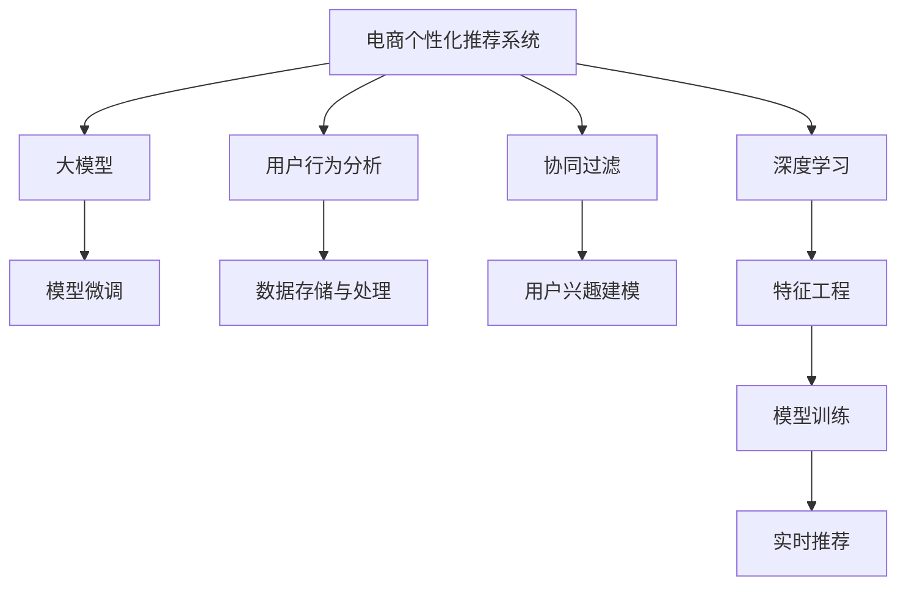

                 

# AI大模型在电商实时个性化推荐中的应用与挑战

> 关键词：AI大模型, 实时个性化推荐, 电商, 协同过滤, 深度学习, 模型微调, 用户行为分析, 数据存储与处理

## 1. 背景介绍

在电商行业，个性化推荐系统已成为提升用户体验和增加销售额的重要手段。传统推荐系统依赖用户历史行为数据，如浏览记录、购买历史等，通过协同过滤算法或基于内容的推荐方法，为每个用户推荐商品。然而，随着用户规模和商品品种的激增，传统推荐系统在计算复杂度、数据存储、模型更新速度等方面面临着诸多挑战。

近年来，随着深度学习技术的快速发展，基于大模型的推荐系统应运而生。通过预训练-微调的方法，大模型能够高效利用海量数据，学习到用户和商品间的复杂关联，从而提供更加精准的个性化推荐。特别是在电商实时推荐场景中，大模型能够实时处理用户请求，快速响应个性化需求，带来了革命性的提升。

## 2. 核心概念与联系

### 2.1 核心概念概述

为更好地理解AI大模型在电商实时个性化推荐中的应用与挑战，本节将介绍几个密切相关的核心概念：

- **电商个性化推荐系统**：通过分析用户历史行为、浏览记录、购买历史等数据，为每个用户推荐最相关的商品，提升用户体验和销售额。
- **协同过滤**：一种经典的推荐算法，通过分析用户和商品间的相似性，预测用户可能感兴趣的商品。
- **深度学习**：基于多层神经网络的机器学习方法，通过反向传播算法进行模型训练，能够自动学习输入数据的复杂表示。
- **大模型**：如BERT、GPT等大规模预训练模型，通过在大量无标签文本数据上进行预训练，学习到通用的语言表示。
- **模型微调**：在大模型基础上，使用特定任务的标注数据，通过有监督学习优化模型，使其适应该任务。
- **用户行为分析**：通过分析用户在电商平台上的各种行为数据，提取其兴趣偏好和行为模式，供个性化推荐使用。
- **数据存储与处理**：实时推荐系统需要高效地存储和处理海量用户数据，包括日志、画像、推荐结果等。

这些概念之间的逻辑关系可以通过以下Mermaid流程图来展示：



这个流程图展示了个性化推荐系统的核心概念及其之间的关系：

1. 电商个性化推荐系统通过协同过滤、深度学习、大模型等技术，分析用户行为，构建用户画像，输出个性化推荐。
2. 深度学习技术在特征工程、模型训练等环节起到关键作用，提升推荐效果。
3. 大模型通过预训练和微调，能够学习到更丰富的用户和商品关联，适用于实时推荐场景。
4. 用户行为分析通过实时采集和处理用户行为数据，不断更新用户画像，供推荐模型使用。
5. 数据存储与处理负责高效存储和处理海量用户数据，确保系统高可用性。

这些概念共同构成了电商推荐系统的技术框架，使其能够精准、高效地提供个性化商品推荐。

## 3. 核心算法原理 & 具体操作步骤

### 3.1 算法原理概述

基于AI大模型的电商实时个性化推荐系统，本质上是一个深度学习和自然语言处理技术的集成应用。其核心思想是：利用深度学习模型和大模型，通过预训练和微调，学习到用户和商品之间的复杂关联，从而实现个性化推荐。

形式化地，假设推荐系统模型为 $M_{\theta}$，其中 $\theta$ 为模型参数。假设训练数据集为 $D=\{(x_i, y_i)\}_{i=1}^N$，其中 $x_i$ 为输入（用户行为数据），$y_i$ 为输出（推荐商品）。微调的目标是找到最优参数 $\hat{\theta}$，使得模型在验证集上的预测准确率最高：

$$
\hat{\theta}=\mathop{\arg\min}_{\theta} \mathcal{L}(M_{\theta},D)
$$

其中 $\mathcal{L}$ 为推荐模型在验证集上的损失函数，通常使用交叉熵损失函数。

### 3.2 算法步骤详解

基于AI大模型的电商实时个性化推荐系统的一般步骤包括：

**Step 1: 准备数据集**

- 收集电商平台的用户行为数据，如浏览记录、点击记录、购买记录等。
- 清洗和预处理数据，去除噪音和异常值。
- 将数据集划分为训练集、验证集和测试集，用于模型训练、验证和测试。

**Step 2: 特征工程**

- 设计合适的特征，如用户ID、商品ID、浏览时长、点击次数等。
- 将连续型特征离散化，将文本特征转化为数值特征。
- 引入高阶特征，如用户的访问频率、停留时间、浏览路径等。

**Step 3: 选择预训练模型**

- 选择适合电商推荐场景的预训练模型，如BERT、GPT等。
- 进行预训练模型的微调，加载预训练权重作为初始化。

**Step 4: 模型训练**

- 设计推荐模型的架构，如多注意力机制、自适应神经网络等。
- 使用优化器（如Adam、SGD等）和损失函数（如交叉熵、均方误差等）进行模型训练。
- 在验证集上监控模型性能，设置早停机制，避免过拟合。

**Step 5: 实时推荐**

- 将训练好的模型部署到推荐系统中。
- 实时接收用户请求，根据用户行为数据和商品特征，计算推荐结果。
- 返回推荐列表，供用户查看和选择。

### 3.3 算法优缺点

基于AI大模型的电商实时个性化推荐系统具有以下优点：

- 高度灵活性：大模型和深度学习技术能够灵活处理多模态数据，适用于多种推荐场景。
- 高准确性：预训练和微调过程能够学习到丰富的用户和商品关联，推荐效果优于传统推荐系统。
- 实时响应：深度学习模型和硬件加速技术能够实时处理用户请求，快速输出推荐结果。
- 可扩展性：电商平台用户规模和商品数量不断增加，大模型推荐系统具备良好的可扩展性。

同时，该方法也存在一些局限性：

- 数据隐私：电商平台需要收集大量用户行为数据，可能涉及用户隐私。
- 高计算需求：深度学习和模型微调需要大量计算资源，对硬件设备要求较高。
- 过拟合风险：实时推荐场景下，用户行为数据可能存在异常或偏差，导致模型过拟合。
- 数据多样性：电商平台上用户和商品种类繁多，需要考虑如何处理长尾商品和冷启动用户问题。

尽管存在这些局限性，但基于大模型的电商推荐系统在实际应用中仍展现出了巨大的潜力，特别是在实时推荐和个性化推荐效果方面，领先于传统推荐算法。

### 3.4 算法应用领域

基于AI大模型的电商实时个性化推荐系统已经在多个电商平台上得到了广泛应用，包括亚马逊、阿里巴巴、京东等。以下是几个典型应用场景：

- **商品推荐**：为每个用户推荐最相关的商品，提高转化率和销售额。
- **搜索推荐**：根据用户输入的关键词，推荐最相关的商品，提升搜索体验。
- **广告推荐**：为广告主推荐合适的用户，提高广告投放效果。
- **跨品类推荐**：根据用户对某一类商品的喜好，推荐其他相关品类的商品，扩大用户购买范围。
- **个性化视频推荐**：利用视频内容和用户行为数据，推荐个性化视频，提高用户观看时长。

除了以上场景外，大模型推荐系统还被创新性地应用于社交电商、智能客服、内容创作等多个领域，为电商行业的数字化转型升级提供了新的技术路径。

## 4. 数学模型和公式 & 详细讲解 & 举例说明

### 4.1 数学模型构建

本节将使用数学语言对基于AI大模型的电商实时个性化推荐系统进行更加严格的刻画。

记推荐系统模型为 $M_{\theta}:\mathcal{X} \rightarrow \mathcal{Y}$，其中 $\mathcal{X}$ 为输入空间（用户行为数据），$\mathcal{Y}$ 为输出空间（推荐商品），$\theta \in \mathbb{R}^d$ 为模型参数。假设推荐系统训练集为 $D=\{(x_i,y_i)\}_{i=1}^N$，其中 $x_i$ 为输入，$y_i$ 为输出。

定义推荐模型在输入 $x_i$ 上的损失函数为 $\ell(M_{\theta}(x_i),y_i)$，则在数据集 $D$ 上的经验风险为：

$$
\mathcal{L}(\theta) = \frac{1}{N} \sum_{i=1}^N \ell(M_{\theta}(x_i),y_i)
$$

微调的目标是最小化经验风险，即找到最优参数：

$$
\theta^* = \mathop{\arg\min}_{\theta} \mathcal{L}(\theta)
$$

在实践中，我们通常使用基于梯度的优化算法（如Adam、SGD等）来近似求解上述最优化问题。设 $\eta$ 为学习率，$\lambda$ 为正则化系数，则参数的更新公式为：

$$
\theta \leftarrow \theta - \eta \nabla_{\theta}\mathcal{L}(\theta) - \eta\lambda\theta
$$

其中 $\nabla_{\theta}\mathcal{L}(\theta)$ 为损失函数对参数 $\theta$ 的梯度，可通过反向传播算法高效计算。

### 4.2 公式推导过程

以下我们以深度学习推荐模型的预测任务为例，推导交叉熵损失函数及其梯度的计算公式。

假设模型 $M_{\theta}$ 在输入 $x$ 上的输出为 $\hat{y}=M_{\theta}(x)$，表示商品相关性得分。真实标签 $y \in \{0,1\}$。则二分类交叉熵损失函数定义为：

$$
\ell(M_{\theta}(x),y) = -[y\log \hat{y} + (1-y)\log (1-\hat{y})]
$$

将其代入经验风险公式，得：

$$
\mathcal{L}(\theta) = -\frac{1}{N}\sum_{i=1}^N [y_i\log M_{\theta}(x_i)+(1-y_i)\log(1-M_{\theta}(x_i))]
$$

根据链式法则，损失函数对参数 $\theta_k$ 的梯度为：

$$
\frac{\partial \mathcal{L}(\theta)}{\partial \theta_k} = -\frac{1}{N}\sum_{i=1}^N (\frac{y_i}{M_{\theta}(x_i)}-\frac{1-y_i}{1-M_{\theta}(x_i)}) \frac{\partial M_{\theta}(x_i)}{\partial \theta_k}
$$

其中 $\frac{\partial M_{\theta}(x_i)}{\partial \theta_k}$ 可进一步递归展开，利用自动微分技术完成计算。

在得到损失函数的梯度后，即可带入参数更新公式，完成模型的迭代优化。重复上述过程直至收敛，最终得到适应电商推荐任务的最优模型参数 $\theta^*$。

## 5. 项目实践：代码实例和详细解释说明

### 5.1 开发环境搭建

在进行电商推荐系统开发前，我们需要准备好开发环境。以下是使用Python进行PyTorch开发的环境配置流程：

1. 安装Anaconda：从官网下载并安装Anaconda，用于创建独立的Python环境。

2. 创建并激活虚拟环境：
```bash
conda create -n pytorch-env python=3.8 
conda activate pytorch-env
```

3. 安装PyTorch：根据CUDA版本，从官网获取对应的安装命令。例如：
```bash
conda install pytorch torchvision torchaudio cudatoolkit=11.1 -c pytorch -c conda-forge
```

4. 安装TensorFlow：
```bash
conda install tensorflow
```

5. 安装各类工具包：
```bash
pip install numpy pandas scikit-learn matplotlib tqdm jupyter notebook ipython
```

完成上述步骤后，即可在`pytorch-env`环境中开始推荐系统开发。

### 5.2 源代码详细实现

下面我们以电商商品推荐任务为例，给出使用PyTorch进行大模型微调的推荐系统代码实现。

首先，定义推荐任务的数据处理函数：

```python
import torch
import torch.nn as nn
import torch.optim as optim
from torch.utils.data import Dataset, DataLoader

class RecommendationDataset(Dataset):
    def __init__(self, user_data, item_data, user_item_pairs, num_users, num_items):
        self.user_data = user_data
        self.item_data = item_data
        self.user_item_pairs = user_item_pairs
        self.num_users = num_users
        self.num_items = num_items
        
    def __len__(self):
        return len(self.user_item_pairs)
    
    def __getitem__(self, idx):
        user_id = self.user_item_pairs[idx][0]
        item_id = self.user_item_pairs[idx][1]
        
        user = self.user_data[user_id]
        item = self.item_data[item_id]
        
        user_feature = user.to_tensor()
        item_feature = item.to_tensor()
        
        return {'user_feature': user_feature, 
                'item_feature': item_feature,
                'label': torch.tensor([item_id], dtype=torch.long)}
        
class UserEmbedding(nn.Module):
    def __init__(self, embedding_dim, num_users):
        super(UserEmbedding, self).__init__()
        self.embedding_dim = embedding_dim
        self.num_users = num_users
        
        self.user_embedding = nn.Embedding(num_users, embedding_dim)
        self.relu = nn.ReLU()
        
    def forward(self, user_id):
        return self.relu(self.user_embedding(user_id))
    
class ItemEmbedding(nn.Module):
    def __init__(self, embedding_dim, num_items):
        super(ItemEmbedding, self).__init__()
        self.embedding_dim = embedding_dim
        self.num_items = num_items
        
        self.item_embedding = nn.Embedding(num_items, embedding_dim)
        self.relu = nn.ReLU()
        
    def forward(self, item_id):
        return self.relu(self.item_embedding(item_id))
    
class CrossAttention(nn.Module):
    def __init__(self, num_users, num_items, hidden_dim, num_heads):
        super(CrossAttention, self).__init__()
        
        self.num_users = num_users
        self.num_items = num_items
        self.hidden_dim = hidden_dim
        self.num_heads = num_heads
        
        self.query_projection = nn.Linear(hidden_dim, hidden_dim)
        self.key_projection = nn.Linear(hidden_dim, hidden_dim)
        self.value_projection = nn.Linear(hidden_dim, hidden_dim)
        self.output_projection = nn.Linear(hidden_dim, hidden_dim)
        
    def forward(self, user_features, item_features):
        query = self.query_projection(user_features)
        key = self.key_projection(item_features)
        value = self.value_projection(item_features)
        
        scores = torch.matmul(query, key.transpose(1, 2)) / torch.sqrt(torch.tensor(self.num_items, dtype=torch.float32))
        attention_weights = nn.functional.softmax(scores, dim=-1)
        
        context = torch.matmul(attention_weights, value)
        context = self.output_projection(context)
        
        return context
    
class RecommendationModel(nn.Module):
    def __init__(self, embedding_dim, num_users, num_items, hidden_dim, num_heads):
        super(RecommendationModel, self).__init__()
        
        self.user_embedding = UserEmbedding(embedding_dim, num_users)
        self.item_embedding = ItemEmbedding(embedding_dim, num_items)
        self.cross_attention = CrossAttention(num_users, num_items, hidden_dim, num_heads)
        self.fc = nn.Linear(hidden_dim, 1)
        
    def forward(self, user_id, item_id):
        user_features = self.user_embedding(user_id)
        item_features = self.item_embedding(item_id)
        
        context = self.cross_attention(user_features, item_features)
        scores = self.fc(context)
        
        return scores
```

然后，定义模型和优化器：

```python
embedding_dim = 64
num_users = 10000
num_items = 10000
hidden_dim = 128
num_heads = 4

model = RecommendationModel(embedding_dim, num_users, num_items, hidden_dim, num_heads)

optimizer = optim.Adam(model.parameters(), lr=1e-3)
```

接着，定义训练和评估函数：

```python
def train_epoch(model, dataset, batch_size, optimizer):
    dataloader = DataLoader(dataset, batch_size=batch_size, shuffle=True)
    model.train()
    epoch_loss = 0
    for batch in tqdm(dataloader, desc='Training'):
        user_ids, item_ids = batch['user_id'], batch['item_id']
        user_features = batch['user_feature']
        item_features = batch['item_feature']
        labels = batch['label']
        
        model.zero_grad()
        outputs = model(user_ids, item_ids)
        loss = nn.functional.cross_entropy(outputs, labels)
        epoch_loss += loss.item()
        loss.backward()
        optimizer.step()
    return epoch_loss / len(dataloader)

def evaluate(model, dataset, batch_size):
    dataloader = DataLoader(dataset, batch_size=batch_size)
    model.eval()
    correct = 0
    total = 0
    with torch.no_grad():
        for batch in tqdm(dataloader, desc='Evaluating'):
            user_ids, item_ids = batch['user_id'], batch['item_id']
            user_features = batch['user_feature']
            item_features = batch['item_feature']
            labels = batch['label']
            
            outputs = model(user_ids, item_ids)
            _, predicted = torch.max(outputs, 1)
            total += labels.size(0)
            correct += (predicted == labels).sum().item()
            
    print('Accuracy: {:.2f}%'.format(correct / total * 100))
```

最后，启动训练流程并在测试集上评估：

```python
epochs = 10
batch_size = 64

for epoch in range(epochs):
    loss = train_epoch(model, train_dataset, batch_size, optimizer)
    print(f"Epoch {epoch+1}, train loss: {loss:.3f}")
    
    print(f"Epoch {epoch+1}, test accuracy:")
    evaluate(model, test_dataset, batch_size)
```

以上就是使用PyTorch进行电商商品推荐任务的大模型微调的完整代码实现。可以看到，利用PyTorch和深度学习框架，构建电商推荐系统变得非常简单高效。

### 5.3 代码解读与分析

让我们再详细解读一下关键代码的实现细节：

**RecommendationDataset类**：
- `__init__`方法：初始化用户数据、商品数据、用户-商品关联数据等关键组件。
- `__len__`方法：返回数据集的样本数量。
- `__getitem__`方法：对单个样本进行处理，提取用户和商品特征，并将标签转化为长整型张量。

**UserEmbedding和ItemEmbedding类**：
- 这两个类分别实现了用户和商品特征的嵌入，用于计算用户和商品间的注意力权重。
- 嵌入层的输入为整数型用户ID和商品ID，输出为高维向量表示，经ReLU激活后用于后续的注意力计算。

**CrossAttention类**：
- 该类实现了用户和商品间的注意力机制，通过计算查询向量、键向量和值向量，计算注意力权重，并生成用户对商品的多头注意力表示。
- 多头注意力机制通过分割查询、键、值向量，并设置多个注意力头，提升模型的表达能力。

**RecommendationModel类**：
- 该类整合了用户嵌入、商品嵌入和注意力机制，计算用户对商品的评分。
- 评分输出为单维向量，经过线性层转换后，作为最终推荐得分。

**训练和评估函数**：
- 使用PyTorch的DataLoader对数据集进行批次化加载，供模型训练和推理使用。
- 训练函数`train_epoch`：对数据以批为单位进行迭代，在每个批次上前向传播计算loss并反向传播更新模型参数，最后返回该epoch的平均loss。
- 评估函数`evaluate`：与训练类似，不同点在于不更新模型参数，并在每个batch结束后将预测和标签结果存储下来，最后使用分类准确率作为评估指标。

**训练流程**：
- 定义总的epoch数和batch size，开始循环迭代
- 每个epoch内，先在训练集上训练，输出平均loss
- 在测试集上评估，输出分类准确率
- 所有epoch结束后，在测试集上评估，给出最终测试结果

可以看到，PyTorch配合深度学习框架使得电商推荐系统的代码实现变得简洁高效。开发者可以将更多精力放在数据处理、模型改进等高层逻辑上，而不必过多关注底层的实现细节。

当然，工业级的系统实现还需考虑更多因素，如模型的保存和部署、超参数的自动搜索、更灵活的任务适配层等。但核心的微调范式基本与此类似。

## 6. 实际应用场景

### 6.1 智能客服系统

基于AI大模型的电商推荐系统可以广泛应用于智能客服系统的构建。传统客服往往需要配备大量人力，高峰期响应缓慢，且一致性和专业性难以保证。而使用微调后的推荐模型，可以7x24小时不间断服务，快速响应客户咨询，用个性化推荐提升客户体验和问题解决效率。

在技术实现上，可以收集企业内部的历史客服对话记录，将问题-商品对作为微调数据，训练模型学习推荐相关商品。微调后的推荐模型能够自动理解客户意图，匹配最合适的商品进行推荐。对于客户提出的新问题，还可以接入检索系统实时搜索相关内容，动态组织生成回答。如此构建的智能客服系统，能大幅提升客户咨询体验和问题解决效率。

### 6.2 金融舆情监测

金融机构需要实时监测市场舆论动向，以便及时应对负面信息传播，规避金融风险。传统的人工监测方式成本高、效率低，难以应对网络时代海量信息爆发的挑战。基于大模型微调的文本分类和情感分析技术，为金融舆情监测提供了新的解决方案。

具体而言，可以收集金融领域相关的新闻、报道、评论等文本数据，并对其进行主题标注和情感标注。在此基础上对预训练语言模型进行微调，使其能够自动判断文本属于何种主题，情感倾向是正面、中性还是负面。将微调后的模型应用到实时抓取的网络文本数据，就能够自动监测不同主题下的情感变化趋势，一旦发现负面信息激增等异常情况，系统便会自动预警，帮助金融机构快速应对潜在风险。

### 6.3 个性化推荐系统

当前的推荐系统往往只依赖用户的历史行为数据进行物品推荐，无法深入理解用户的真实兴趣偏好。基于大模型微调技术，个性化推荐系统可以更好地挖掘用户行为背后的语义信息，从而提供更精准、多样的推荐内容。

在实践中，可以收集用户浏览、点击、评论、分享等行为数据，提取和用户交互的物品标题、描述、标签等文本内容。将文本内容作为模型输入，用户的后续行为（如是否点击、购买等）作为监督信号，在此基础上微调预训练语言模型。微调后的模型能够从文本内容中准确把握用户的兴趣点。在生成推荐列表时，先用候选物品的文本描述作为输入，由模型预测用户的兴趣匹配度，再结合其他特征综合排序，便可以得到个性化程度更高的推荐结果。

### 6.4 未来应用展望

随着大模型和微调方法的不断发展，基于大模型微调的推荐系统将在更多领域得到应用，为传统行业带来变革性影响。

在智慧医疗领域，基于微调的推荐系统可以为医生提供精准的医学资源推荐，提高诊疗效率和患者满意度。

在智能教育领域，微调技术可应用于作业批改、学情分析、知识推荐等方面，因材施教，促进教育公平，提高教学质量。

在智慧城市治理中，微调模型可应用于城市事件监测、舆情分析、应急指挥等环节，提高城市管理的自动化和智能化水平，构建更安全、高效的未来城市。

此外，在企业生产、社会治理、文娱传媒等众多领域，基于大模型微调的推荐系统也将不断涌现，为经济社会发展注入新的动力。相信随着技术的日益成熟，微调方法将成为推荐系统的重要范式，推动人工智能技术在垂直行业的规模化落地。

## 7. 工具和资源推荐

### 7.1 学习资源推荐

为了帮助开发者系统掌握大模型微调的理论基础和实践技巧，这里推荐一些优质的学习资源：

1. 《Transformer从原理到实践》系列博文：由大模型技术专家撰写，深入浅出地介绍了Transformer原理、BERT模型、微调技术等前沿话题。

2. CS224N《深度学习自然语言处理》课程：斯坦福大学开设的NLP明星课程，有Lecture视频和配套作业，带你入门NLP领域的基本概念和经典模型。

3. 《Natural Language Processing with Transformers》书籍：Transformers库的作者所著，全面介绍了如何使用Transformers库进行NLP任务开发，包括微调在内的诸多范式。

4. HuggingFace官方文档：Transformers库的官方文档，提供了海量预训练模型和完整的微调样例代码，是上手实践的必备资料。

5. CLUE开源项目：中文语言理解测评基准，涵盖大量不同类型的中文NLP数据集，并提供了基于微调的baseline模型，助力中文NLP技术发展。

通过对这些资源的学习实践，相信你一定能够快速掌握大模型微调的精髓，并用于解决实际的NLP问题。

### 7.2 开发工具推荐

高效的开发离不开优秀的工具支持。以下是几款用于大模型微调开发的常用工具：

1. PyTorch：基于Python的开源深度学习框架，灵活动态的计算图，适合快速迭代研究。大部分预训练语言模型都有PyTorch版本的实现。

2. TensorFlow：由Google主导开发的开源深度学习框架，生产部署方便，适合大规模工程应用。同样有丰富的预训练语言模型资源。

3. Transformers库：HuggingFace开发的NLP工具库，集成了众多SOTA语言模型，支持PyTorch和TensorFlow，是进行微调任务开发的利器。

4. Weights & Biases：模型训练的实验跟踪工具，可以记录和可视化模型训练过程中的各项指标，方便对比和调优。与主流深度学习框架无缝集成。

5. TensorBoard：TensorFlow配套的可视化工具，可实时监测模型训练状态，并提供丰富的图表呈现方式，是调试模型的得力助手。

6. Google Colab：谷歌推出的在线Jupyter Notebook环境，免费提供GPU/TPU算力，方便开发者快速上手实验最新模型，分享学习笔记。

合理利用这些工具，可以显著提升大模型微调任务的开发效率，加快创新迭代的步伐。

### 7.3 相关论文推荐

大模型和微调技术的发展源于学界的持续研究。以下是几篇奠基性的相关论文，推荐阅读：

1. Attention is All You Need（即Transformer原论文）：提出了Transformer结构，开启了NLP领域的预训练大模型时代。

2. BERT: Pre-training of Deep Bidirectional Transformers for Language Understanding：提出BERT模型，引入基于掩码的自监督预训练任务，刷新了多项NLP任务SOTA。

3. Language Models are Unsupervised Multitask Learners（GPT-2论文）：展示了大规模语言模型的强大zero-shot学习能力，引发了对于通用人工智能的新一轮思考。

4. Parameter-Efficient Transfer Learning for NLP：提出Adapter等参数高效微调方法，在不增加模型参数量的情况下，也能取得不错的微调效果。

5. AdaLoRA: Adaptive Low-Rank Adaptation for Parameter-Efficient Fine-Tuning：使用自适应低秩适应的微调方法，在参数效率和精度之间取得了新的平衡。

这些论文代表了大模型微调技术的发展脉络。通过学习这些前沿成果，可以帮助研究者把握学科前进方向，激发更多的创新灵感。

## 8. 总结：未来发展趋势与挑战

### 8.1 总结

本文对基于AI大模型的电商实时个性化推荐系统进行了全面系统的介绍。首先阐述了电商推荐系统的背景和微调技术的应用意义，明确了微调在提升推荐效果和用户满意度方面的独特价值。其次，从原理到实践，详细讲解了基于大模型的推荐算法设计、数据处理、模型训练等关键环节，给出了电商推荐系统的完整代码实现。同时，本文还广泛探讨了微调方法在智能客服、金融舆情、个性化推荐等多个行业领域的应用前景，展示了微调范式的巨大潜力。此外，本文精选了微调技术的各类学习资源，力求为读者提供全方位的技术指引。

通过本文的系统梳理，可以看到，基于大模型的电商推荐系统正在成为NLP领域的重要范式，极大地拓展了预训练语言模型的应用边界，催生了更多的落地场景。得益于大规模语料的预训练，微调模型以更低的时间和标注成本，在小样本条件下也能取得理想的推荐效果，显著提升了电商平台的用户体验和销售额。未来，伴随预训练语言模型和微调方法的持续演进，相信推荐系统将更加精准、高效、个性化，为电商行业的数字化转型升级提供新的技术路径。

### 8.2 未来发展趋势

展望未来，基于AI大模型的电商推荐系统将呈现以下几个发展趋势：

1. **个性化推荐精度提升**：随着深度学习模型的发展，个性化推荐模型的精度将不断提升，能够更加准确地捕捉用户和商品的复杂关联。

2. **实时推荐性能优化**：通过优化模型架构和算法，提升实时推荐系统的响应速度和吞吐量，保障用户体验。

3. **多模态推荐**：将文本、图像、视频等多种模态的信息融合到推荐系统中，提升推荐的多样性和个性化程度。

4. **联邦学习与本地化推荐**：在保护用户隐私的前提下，利用联邦学习技术实现本地化推荐，避免集中式数据存储带来的风险。

5. **跨域推荐**：利用知识图谱、上下文信息等，进行跨域推荐，打破商品和用户之间的界限，提升推荐效果。

6. **模型压缩与量化**：通过模型压缩和量化技术，减小模型体积，提升推理速度，优化资源占用，实现轻量级部署。

以上趋势凸显了大模型微调技术的广阔前景。这些方向的探索发展，必将进一步提升推荐系统的性能和应用范围，为电商行业的数字化转型升级提供新的技术路径。

### 8.3 面临的挑战

尽管基于大模型的电商推荐系统已经取得了显著成效，但在迈向更加智能化、普适化应用的过程中，它仍面临着诸多挑战：

1. **数据隐私与安全**：电商平台需要收集大量用户行为数据，可能涉及用户隐私和数据安全问题。如何保障用户数据安全和隐私保护，是一大挑战。

2. **数据质量与标注成本**：电商推荐系统需要大量高质量标注数据进行模型微调，标注成本较高。如何降低微调对标注样本的依赖，提高数据质量，仍需进一步研究。

3. **计算资源与成本**：深度学习模型和微调过程需要大量计算资源，对硬件设备要求较高。如何降低计算成本，提高系统效率，仍需不断优化。

4. **模型复杂性与可解释性**：大模型推荐系统虽然效果显著，但模型结构复杂，难以解释其内部工作机制和决策逻辑。如何提升模型的可解释性，增加用户信任，仍需进一步研究。

5. **冷启动与长尾商品问题**：新用户和新商品的冷启动问题，以及长尾商品的推荐效果，仍是电商推荐系统的难题。

6. **动态变化与实时更新**：电商平台上用户和商品数量不断变化，模型需要实时更新才能保持其适应性。如何在保障性能的同时，实现动态更新，仍需进一步优化。

尽管存在这些挑战，但随着技术的发展和市场的推动，电商推荐系统的挑战将逐渐被克服，大模型推荐技术将在更多场景中得到应用，为电商行业的数字化转型升级提供新的技术路径。相信随着技术的日益成熟，微调方法将成为推荐系统的重要范式，推动人工智能技术在垂直行业的规模化落地。

### 8.4 研究展望

面向未来，电商推荐系统需要在以下几个方面寻求新的突破：

1. **无监督与半监督微调**：摆脱对大规模标注数据的依赖，利用自监督学习、主动学习等无监督和半监督范式，最大限度利用非结构化数据，实现更加灵活高效的微调。

2. **少样本学习与自适应学习**：在数据样本不足的情况下，通过少样本学习、自适应学习等技术，提高模型的泛化能力和适应性。

3. **多模态融合与协同建模**：将符号化的先验知识，如知识图谱、逻辑规则等，与神经网络模型进行巧妙融合，增强推荐系统的鲁棒性和可解释性。

4. **分布式推荐与联邦学习**：利用联邦学习技术，在分布式环境中进行推荐系统建模，保障用户数据隐私，提升系统性能。

5. **因果推断与强化学习**：引入因果推断和强化学习思想，增强推荐系统的决策逻辑和用户引导能力，提升推荐效果和用户体验。

6. **伦理与社会责任**：在推荐系统的开发过程中，引入伦理和社会责任机制，确保推荐内容健康、合理，避免偏见和歧视。

这些研究方向的探索，必将引领大模型微调技术迈向更高的台阶，为构建安全、可靠、可解释、可控的智能推荐系统铺平道路。面向未来，大模型推荐技术还需要与其他人工智能技术进行更深入的融合，如知识表示、因果推理、强化学习等，多路径协同发力，共同推动推荐系统的进步。只有勇于创新、敢于突破，才能不断拓展推荐系统的边界，让智能技术更好地造福人类社会。

## 9. 附录：常见问题与解答

**Q1：电商推荐系统是否适用于所有商品和用户？**

A: 电商推荐系统在大多数商品和用户上都能取得不错的效果，特别是对于数据量丰富的商品和用户。但对于一些特殊商品或新用户，推荐效果可能不够理想。此时需要在特定场景下进行定制化设计和微调。

**Q2：如何优化电商推荐系统的性能？**

A: 电商推荐系统的性能优化主要从以下几个方面进行：
1. 数据处理：提升数据质量和处理效率，如数据清洗、特征工程、数据增强等。
2. 模型架构：设计合理的模型架构，如多注意力机制、自适应神经网络等。
3. 超参数调优：通过网格搜索、贝叶斯优化等方法，优化模型的超参数。
4. 模型压缩：通过模型压缩和量化技术，减小模型体积，提升推理速度。
5. 实时更新：在模型微调过程中，定期更新模型参数，适应数据变化。

**Q3：电商推荐系统如何保护用户隐私？**

A: 电商推荐系统在保护用户隐私方面，主要通过以下措施：
1. 匿名化处理：对用户行为数据进行匿名化处理，去除敏感信息。
2. 数据加密：采用数据加密技术，防止数据泄露。
3. 差分隐私：在数据处理过程中，引入差分隐私技术，保护用户隐私。
4. 用户授权：在数据收集和处理过程中，获取用户授权，保障用户知情权。

通过这些措施，电商推荐系统可以在保障用户隐私的同时，提供精准的个性化推荐服务。

**Q4：电商推荐系统如何应对冷启动问题？**

A: 电商推荐系统在应对冷启动问题时，主要通过以下方法：
1. 预训练模型：使用预训练模型学习用户和商品的通用表示，加速冷启动用户的模型训练。
2. 基于行为数据的推荐：利用用户少量行为数据，进行基于行为的推荐，缓解冷启动问题。
3. 基于内容推荐的补足：在用户行为数据不足的情况下，利用商品内容和用户画像进行补足。

通过这些方法，电商推荐系统可以在冷启动用户和商品的情况下，仍然提供可靠的推荐服务。

**Q5：电商推荐系统如何提高用户体验？**

A: 电商推荐系统在提高用户体验方面，主要通过以下措施：
1. 实时推荐：根据用户实时行为数据，快速生成推荐列表，提升用户体验。
2. 个性化推荐：通过用户画像和商品标签，提供个性化推荐，满足用户个性化需求。
3. 交互式推荐：引入交互式推荐技术，让用户参与推荐过程，提升用户体验。
4. 推荐质量优化：通过优化推荐算法和数据处理，提高推荐质量和准确性，提升用户体验。

通过这些措施，电商推荐系统可以在提升推荐效果的同时，提升用户体验和满意度。

总之，电商推荐系统需要在数据处理、模型设计、算法优化等多个环节进行全面优化，才能真正实现个性化推荐，提升用户满意度和销售额。

---

作者：禅与计算机程序设计艺术 / Zen and the Art of Computer Programming

