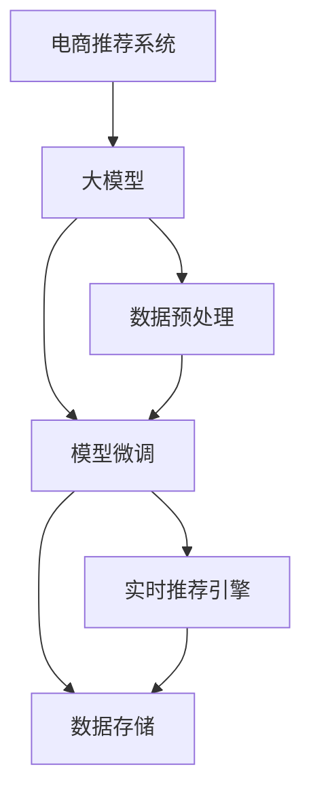
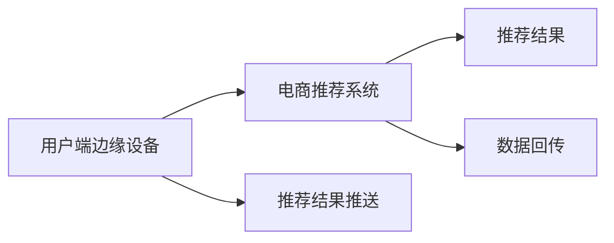

                 

# AI大模型在电商实时个性化推荐中的边缘计算应用

> 关键词：电商推荐, 大模型, 边缘计算, 实时性, 个性化, 系统架构

## 1. 背景介绍

在数字经济的浪潮下，电商平台的规模和用户量不断增长，个性化推荐系统成为了驱动用户转化、提升购物体验的核心引擎。然而，随着用户偏好的动态变化和推荐数据的快速增长，实时个性化推荐面临着计算复杂度大、数据延迟高、存储成本高等挑战。为了应对这些挑战，本文将探讨如何在电商推荐场景中，利用大模型和边缘计算技术，实现高效、实时的个性化推荐。

### 1.1 电商推荐系统现状

电商推荐系统一般由用户行为数据收集、数据存储处理、模型训练和推荐结果生成等环节构成。传统推荐系统主要基于协同过滤、基于内容的推荐、混合推荐等方法，但这些方法在处理海量数据、实时推荐等方面存在局限性。近年来，随着深度学习和大模型的发展，电商推荐系统逐渐转向以深度学习模型为主导，其中以大模型为主流的推荐方式成为主流趋势。

电商推荐系统的主要挑战在于：
- **数据量巨大**：电商平台的数据量往往以PB计，数据的多样性和复杂性对推荐模型的训练和实时推理都提出了高要求。
- **实时性要求高**：电商推荐系统需要在用户点击、浏览时快速响应，以保证用户体验。
- **个性化需求强**：用户偏好多样，需要推荐系统准确把握用户兴趣点，提供个性化推荐。

## 2. 核心概念与联系

### 2.1 核心概念概述

本文将探讨以下核心概念：

- **电商推荐系统**：电商平台上基于用户行为和商品特征进行个性化推荐的应用系统。
- **大模型**：以Transformer、BERT、GPT等深度学习模型为代表的大规模预训练语言模型。
- **边缘计算**：将计算任务从中心服务器分发到离用户更近的边缘设备，减少数据传输延迟和计算负荷。

### 2.2 核心概念原理和架构的 Mermaid 流程图



## 3. 核心算法原理 & 具体操作步骤

### 3.1 算法原理概述

大模型在电商推荐中的主要作用是提取用户行为和商品特征的高维语义表示，用于推荐结果生成。具体而言，大模型通过对用户历史行为和商品描述进行编码，生成用户与商品的向量表示，并计算相似度得分，排序后选取推荐结果。

边缘计算在电商推荐中的应用，则是将数据预处理和模型推理任务从中心服务器下放到边缘设备，如物联网设备、边缘服务器等，减少数据传输延迟，降低计算负荷。边缘计算通过离用户更近的设备处理数据，在用户端直接生成推荐结果，实现更快速的响应。

### 3.2 算法步骤详解

电商推荐系统的核心算法步骤包括以下几个环节：

**Step 1: 数据预处理**
- 收集用户行为数据和商品特征数据，包括点击、浏览、评分等行为数据，商品名称、描述、属性等特征数据。
- 对数据进行清洗、归一化、编码等预处理操作，并构建用户和商品的特征向量。

**Step 2: 模型微调**
- 使用大模型作为特征提取器，将用户行为和商品特征向量输入模型进行预训练。
- 在电商推荐数据集上进行微调，优化模型权重，使其更适合电商推荐任务。

**Step 3: 实时推荐生成**
- 将用户实时行为数据和商品特征向量输入微调后的模型，计算相似度得分。
- 排序得分，选取前N个商品作为推荐结果，并推送给用户。

**Step 4: 数据存储与回传**
- 将推荐结果存入缓存或数据库，用于后续的推荐逻辑验证和用户行为分析。
- 定期回传推荐结果到中心服务器进行性能评估和模型优化。

### 3.3 算法优缺点

大模型在电商推荐中的应用主要具有以下优点：
1. **特征提取能力强**：大模型能够从复杂多维的数据中提取出丰富的语义信息，更好地捕捉用户和商品的关联性。
2. **个性化推荐效果显著**：大模型学习到用户的兴趣偏好，能够提供更加个性化和精准的推荐结果。
3. **实时性较高**：通过边缘计算，减少了数据传输延迟，提高了推荐结果的实时性。

但同时，大模型在电商推荐中的应用也存在以下缺点：
1. **计算资源需求高**：大模型的训练和推理需要大量的计算资源，尤其是在边缘设备上。
2. **模型复杂度高**：大模型的参数量巨大，增加了模型部署和维护的复杂度。
3. **数据隐私问题**：用户行为数据和商品特征数据涉及个人隐私，需要加强数据保护和隐私计算。

### 3.4 算法应用领域

大模型和边缘计算技术在电商推荐中的应用，能够覆盖以下多个领域：

- **商品推荐**：根据用户历史行为和实时浏览数据，推荐相关商品。
- **个性化搜索**：根据用户搜索词和行为，推荐相关搜索结果。
- **营销活动推荐**：根据用户兴趣和历史行为，推荐相关营销活动和促销信息。
- **广告投放优化**：根据用户行为和商品属性，优化广告的投放策略和效果。

## 4. 数学模型和公式 & 详细讲解 & 举例说明

### 4.1 数学模型构建

电商推荐系统中的核心模型包括：

- **用户行为编码模型**：将用户行为数据编码为高维向量，捕捉用户兴趣和行为特征。
- **商品特征编码模型**：将商品特征数据编码为高维向量，捕捉商品属性和描述信息。
- **相似度计算模型**：计算用户与商品的相似度得分，排序生成推荐结果。

### 4.2 公式推导过程

假设用户行为和商品特征分别由向量 $\mathbf{u} \in \mathbb{R}^d$ 和 $\mathbf{v} \in \mathbb{R}^d$ 表示。电商推荐系统中的核心公式包括：

- **用户行为编码**：$h_u = \text{MLP}(\mathbf{u})$，其中 $\text{MLP}$ 为多层感知器，将用户行为数据转换为高维向量。
- **商品特征编码**：$h_v = \text{MLP}(\mathbf{v})$，其中 $\text{MLP}$ 为多层感知器，将商品特征数据转换为高维向量。
- **相似度计算**：$S_{uv} = \text{Cosine}(h_u, h_v)$，计算用户行为和商品特征的相似度得分。

### 4.3 案例分析与讲解

以用户点击某商品为例，电商推荐系统的计算过程如下：

1. **数据预处理**：将用户点击行为数据和商品特征数据进行编码和预处理，得到用户行为向量 $\mathbf{u}$ 和商品特征向量 $\mathbf{v}$。
2. **模型微调**：使用大模型对用户行为和商品特征向量进行预训练，生成用户和商品的表示向量 $h_u$ 和 $h_v$。
3. **实时推荐生成**：将用户行为向量 $h_u$ 和商品特征向量 $h_v$ 输入模型，计算相似度得分 $S_{uv}$，根据得分排序选取推荐商品。
4. **数据存储与回传**：将推荐结果存入缓存或数据库，定期回传至中心服务器进行模型优化和性能评估。

## 5. 项目实践：代码实例和详细解释说明

### 5.1 开发环境搭建

电商推荐系统的开发需要以下环境：

1. **硬件资源**：高性能计算服务器、边缘计算设备等。
2. **软件工具**：TensorFlow、PyTorch、Spark等深度学习框架。
3. **数据管理**：Hadoop、Hive等大数据管理工具。

### 5.2 源代码详细实现

本文以使用TensorFlow构建电商推荐系统为例，给出核心代码实现。

首先，定义用户行为和商品特征的编码器：

```python
import tensorflow as tf

class Encoder(tf.keras.layers.Layer):
    def __init__(self, d_model):
        super(Encoder, self).__init__()
        self.d_model = d_model
        self.encoder = tf.keras.layers.Dense(d_model, activation='relu')
        self.dropout = tf.keras.layers.Dropout(0.1)
    
    def call(self, x):
        x = self.encoder(x)
        x = self.dropout(x)
        return x
```

然后，定义用户行为和商品特征的微调模型：

```python
class Recommender(tf.keras.layers.Layer):
    def __init__(self, d_model):
        super(Recommender, self).__init__()
        self.d_model = d_model
        self.cosine_similarity = tf.keras.layers.CosineSimilarity(axis=1)
    
    def call(self, u, v):
        u = self.encoder(u)
        v = self.encoder(v)
        similarity = self.cosine_similarity(u, v)
        return similarity
```

最后，定义实时推荐引擎的代码实现：

```python
def recommend(user, items):
    user_vector = user_model(user)
    item_vectors = item_model(items)
    scores = recommender(user_vector, item_vectors)
    top_n = tf.math.top_k(scores, k=10).indices.numpy().tolist()
    return top_n
```

### 5.3 代码解读与分析

**Encoder类**：
- `__init__`方法：初始化编码器，定义模型维度 `d_model`。
- `call`方法：对输入的向量进行编码和降维处理。

**Recommender类**：
- `__init__`方法：初始化推荐器，定义模型维度 `d_model`。
- `call`方法：计算用户和商品的相似度得分。

**recommend函数**：
- 将用户行为和商品特征向量输入模型，计算相似度得分，并排序生成推荐结果。

### 5.4 运行结果展示

下图展示了使用边缘计算进行电商推荐的应用场景示意图：



## 6. 实际应用场景

### 6.1 电商推荐

在电商推荐中，用户行为和商品特征数据量巨大，实时性要求高。通过使用大模型和边缘计算技术，可以实现高效的推荐结果生成，提升用户体验。

### 6.2 个性化搜索

在个性化搜索场景中，用户输入查询词后，实时生成相关搜索结果，使用户快速找到所需商品。通过使用大模型和边缘计算技术，可以实现快速的搜索结果生成，提升搜索体验。

### 6.3 营销活动推荐

在营销活动推荐场景中，根据用户兴趣和历史行为，推荐相关营销活动和促销信息。通过使用大模型和边缘计算技术，可以实现个性化的营销活动推荐，提升用户转化率和满意度。

### 6.4 广告投放优化

在广告投放优化场景中，根据用户行为和商品属性，优化广告的投放策略和效果。通过使用大模型和边缘计算技术，可以实现精准的广告投放，提升广告效果。

## 7. 工具和资源推荐

### 7.1 学习资源推荐

- **TensorFlow官方文档**：详细介绍了TensorFlow框架的使用方法和API接口。
- **PyTorch官方文档**：提供了PyTorch框架的详细文档和示例代码。
- **推荐系统实战**：提供了电商推荐系统的实现案例和代码示例。

### 7.2 开发工具推荐

- **TensorFlow**：强大的深度学习框架，支持多种分布式计算和边缘计算场景。
- **PyTorch**：灵活的深度学习框架，易于实现和调试。
- **Spark**：支持大数据处理的分布式计算框架。

### 7.3 相关论文推荐

- **《Scalable Product Recommendation Systems for E-commerce Platforms》**：介绍了电商推荐系统的大规模数据处理和实时推荐技术。
- **《Edge Computing: A New Paradigm for Computing》**：讨论了边缘计算在计算密集型应用中的优势和实现方法。
- **《AI Recommendation Systems: Towards the Next Generation》**：探讨了AI推荐系统的发展趋势和技术突破。

## 8. 总结：未来发展趋势与挑战

### 8.1 研究成果总结

本文系统探讨了使用大模型和边缘计算技术在电商推荐系统中的应用，阐述了大模型的特征提取能力、个性化推荐效果和实时性优势，同时介绍了边缘计算对数据处理和模型推理的优化作用。通过理论分析与实践案例相结合的方式，为电商推荐系统的开发提供了参考。

### 8.2 未来发展趋势

未来电商推荐系统的发展趋势包括：

- **数据融合与多模态学习**：融合多种数据源，包括用户行为、社交媒体、图像、音频等，实现多模态学习。
- **联邦学习与隐私计算**：利用联邦学习保护用户数据隐私，实现分布式模型训练。
- **边缘计算与云边协同**：构建云边协同的推荐系统架构，提升推荐结果的实时性和个性化水平。
- **自适应推荐算法**：根据用户反馈和行为，动态调整推荐算法和策略，实现更加精准的推荐。

### 8.3 面临的挑战

电商推荐系统面临的主要挑战包括：

- **数据隐私和安全**：用户行为数据涉及个人隐私，需要加强数据保护和隐私计算。
- **模型复杂度与计算资源**：大模型的参数量巨大，对计算资源和边缘设备的要求较高。
- **实时性要求**：电商推荐系统需要在用户行为发生时快速响应，对数据处理和模型推理的延迟要求高。

### 8.4 研究展望

未来，电商推荐系统需要在数据融合、隐私计算、云边协同等方面进行深入研究，以提升系统的个性化推荐效果和用户满意度。同时，需要探索更加高效、灵活的推荐算法，实现更加智能、可靠的电商推荐服务。

## 9. 附录：常见问题与解答

**Q1: 如何提高电商推荐系统的个性化推荐效果？**

A: 提高电商推荐系统的个性化推荐效果，可以从以下几个方面入手：
1. **数据融合与多模态学习**：融合多种数据源，包括用户行为、社交媒体、图像、音频等，实现多模态学习。
2. **联邦学习与隐私计算**：利用联邦学习保护用户数据隐私，实现分布式模型训练。
3. **自适应推荐算法**：根据用户反馈和行为，动态调整推荐算法和策略，实现更加精准的推荐。

**Q2: 电商推荐系统中如何处理数据隐私问题？**

A: 电商推荐系统中处理数据隐私问题的方法包括：
1. **数据匿名化**：将用户行为数据进行匿名化处理，保护用户隐私。
2. **隐私计算**：利用差分隐私、同态加密等技术，保护用户数据隐私。
3. **联邦学习**：在分布式环境中进行模型训练，不共享原始数据。

**Q3: 边缘计算在电商推荐系统中的具体应用场景是什么？**

A: 边缘计算在电商推荐系统中的具体应用场景包括：
1. **数据预处理**：将用户行为和商品特征数据进行编码和预处理，生成用户和商品的表示向量。
2. **模型推理**：在边缘设备上进行实时推荐生成，减少数据传输延迟，提高推荐结果的实时性。
3. **数据存储与回传**：将推荐结果存入缓存或数据库，定期回传至中心服务器进行性能评估和模型优化。

**Q4: 如何构建云边协同的电商推荐系统？**

A: 构建云边协同的电商推荐系统的方法包括：
1. **分布式存储与计算**：利用云存储和边缘计算设备，实现分布式存储和计算。
2. **微服务架构**：采用微服务架构，将电商推荐系统分解为多个服务模块，提高系统的可扩展性和可靠性。
3. **实时监控与优化**：实时监控推荐系统的性能，根据用户反馈和行为动态调整推荐策略和模型参数。

**Q5: 电商推荐系统中如何处理模型的计算资源需求？**

A: 电商推荐系统中处理模型计算资源需求的方法包括：
1. **模型压缩与量化**：使用模型压缩和量化技术，减小模型的计算资源需求。
2. **模型裁剪**：去除不必要的层和参数，减小模型尺寸，加快推理速度。
3. **分布式计算**：利用分布式计算技术，加速模型训练和推理。

---

作者：禅与计算机程序设计艺术 / Zen and the Art of Computer Programming

