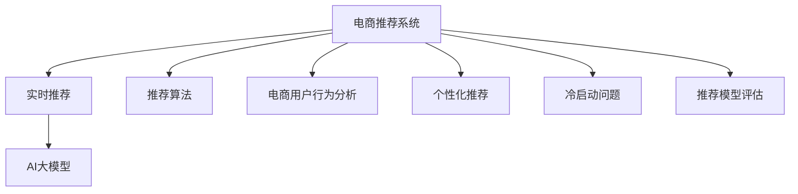

                 

# AI大模型在电商实时推荐中的应用与优化

> 关键词：AI大模型、电商推荐系统、实时推荐、模型优化、深度学习、推荐算法、实时数据处理、电商用户行为分析、个性化推荐、冷启动问题、推荐模型评估

## 1. 背景介绍

在当今数字化时代，电商平台作为零售业的“新基建”，正经历着前所未有的变革。基于AI技术的电商推荐系统，能够精准预测用户需求，个性化推荐商品，大幅提升用户体验和转化率。然而，随着用户需求的多样化和电商数据的爆炸式增长，传统的推荐算法难以适应高速变化的电商场景，推荐效果往往不尽如人意。

为应对这一挑战，本文将深入探讨AI大模型在电商实时推荐中的应用与优化。首先，我们将详细介绍电商推荐系统的工作原理与现有算法，然后重点解析AI大模型在电商推荐中的应用优势及优化策略，最后展望未来的发展方向。

## 2. 核心概念与联系

### 2.1 核心概念概述

为理解AI大模型在电商实时推荐中的应用，首先需要梳理几个关键概念：

- **电商推荐系统(E-Commerce Recommendation System)**：基于用户行为数据、商品属性信息等，通过推荐算法预测用户偏好，为其推荐个性化商品的系统。

- **实时推荐(Real-time Recommendation)**：在用户访问电商平台时，实时预测并推荐符合其当前需求的商品，以提升用户体验和转化率。

- **AI大模型(AI Large Model)**：以深度学习技术为基础，通过在大型无标注数据集上预训练，拥有丰富知识的大规模语言或图像模型。

- **深度学习(Deep Learning)**：通过多层次神经网络，从原始数据中提取高级特征，并进行复杂模式学习的机器学习技术。

- **推荐算法(Recommendation Algorithm)**：用于预测用户兴趣和偏好，并生成推荐结果的算法。

- **电商用户行为分析(E-Commerce User Behavior Analysis)**：通过对用户行为数据进行分析和挖掘，理解用户需求和兴趣，指导推荐策略。

- **个性化推荐(Personalized Recommendation)**：根据用户特征和行为，定制化推荐商品，提高推荐准确率和用户满意度。

- **冷启动问题(Cold Start Problem)**：指新用户或新商品加入系统时，缺乏足够历史数据，难以进行个性化推荐。

- **推荐模型评估(Recommendation Model Evaluation)**：通过设置指标，如准确率、召回率、F1值等，评估推荐模型性能，指导模型优化。

这些概念之间的逻辑关系可以通过以下Mermaid流程图来展示：



这个流程图展示了一整套电商推荐系统的组件及其关联，其中包括实时推荐、AI大模型、推荐算法、用户行为分析、个性化推荐、冷启动问题以及推荐模型评估，共同构成了一个完整的电商推荐系统。

## 3. 核心算法原理 & 具体操作步骤
### 3.1 算法原理概述

电商推荐系统通常分为三大模块：用户特征提取、商品特征提取以及推荐算法。其中，AI大模型在电商推荐中的应用主要体现在以下几个方面：

- **用户行为分析**：通过AI大模型，对用户历史行为数据进行深度学习，挖掘用户偏好、兴趣和行为模式。
- **商品特征提取**：利用AI大模型，提取商品属性、描述、价格等特征，帮助推荐算法更准确地理解商品特性。
- **实时推荐**：基于用户和商品特征，AI大模型实时预测用户偏好，生成个性化推荐列表。

### 3.2 算法步骤详解

以下是一个基于AI大模型的电商推荐系统的一般流程：

**Step 1: 数据收集与预处理**
- 收集用户历史行为数据、商品属性信息和标签数据。
- 对数据进行清洗、归一化和去重处理，保证数据质量。

**Step 2: 特征提取与表示**
- 利用AI大模型，对用户行为数据和商品信息进行特征提取，生成高维向量表示。
- 将用户特征和商品特征进行拼接，形成输入向量。

**Step 3: 模型训练与优化**
- 在标注数据集上，使用深度学习模型（如深度神经网络、卷积神经网络、循环神经网络等）对输入向量进行训练，得到推荐模型。
- 调整模型参数，最小化预测误差，提高模型精度。

**Step 4: 实时推荐**
- 用户在电商平台访问时，实时收集用户行为数据。
- 利用AI大模型对用户行为进行实时分析，预测用户偏好。
- 根据预测结果，生成个性化推荐列表。

**Step 5: 评估与迭代**
- 对推荐结果进行评估，如通过准确率、召回率、F1值等指标。
- 根据评估结果，调整模型参数，优化推荐算法。

### 3.3 算法优缺点

AI大模型在电商推荐系统中的应用具有以下优点：

- **丰富知识库**：大模型预训练于大规模无标注数据，拥有丰富的知识库，能够更好地理解复杂的多维数据。
- **实时预测**：大模型在推理阶段具有高速计算能力，能够实时预测用户偏好，满足用户即时需求。
- **泛化能力强**：大模型经过大量数据训练，能够较好地泛化到新用户和新商品上。
- **可扩展性强**：大模型可以通过微调、迁移学习等方式，快速适应新场景和新需求。

然而，大模型在电商推荐中也存在一些局限性：

- **高计算成本**：大模型需要较大的计算资源和存储空间，成本较高。
- **过拟合风险**：大模型参数众多，容易过拟合，特别是在数据不足的情况下。
- **可解释性差**：大模型的决策过程难以解释，用户难以理解推荐结果的依据。
- **隐私风险**：用户行为数据涉及隐私，大模型的应用需要严格遵守隐私保护法规。

### 3.4 算法应用领域

AI大模型在电商推荐系统中的应用广泛，具体包括：

- **商品推荐**：根据用户历史购买记录、浏览历史、评分记录等，推荐用户可能感兴趣的商品。
- **内容推荐**：推荐用户可能感兴趣的文章、视频等电商内容。
- **品牌推荐**：推荐用户可能感兴趣的品牌，提升品牌曝光和用户忠诚度。
- **跨域推荐**：根据用户兴趣和行为，推荐不同领域的产品和服务。
- **场景推荐**：根据用户当前所在场景，推荐适合的商品和服务。

## 4. 数学模型和公式 & 详细讲解 & 举例说明

### 4.1 数学模型构建

电商推荐系统中的推荐模型通常基于矩阵分解或深度神经网络构建。以深度神经网络为例，设输入向量为 $\mathbf{x}$，模型参数为 $\mathbf{\theta}$，输出向量为 $\mathbf{y}$，则推荐模型的数学模型可表示为：

$$
\mathbf{y} = \mathbf{f}(\mathbf{x},\mathbf{\theta})
$$

其中 $\mathbf{f}$ 为神经网络模型，具体形式如下：

$$
\mathbf{y} = \mathbf{W} \mathbf{x} + \mathbf{b}
$$

其中 $\mathbf{W}$ 和 $\mathbf{b}$ 为模型参数，分别表示权重矩阵和偏置向量。

### 4.2 公式推导过程

以协同过滤算法为例，假设用户 $u$ 与商品 $i$ 的评分矩阵为 $R_{ui}$，用户 $u$ 的向量表示为 $\mathbf{x}_u$，商品 $i$ 的向量表示为 $\mathbf{x}_i$。用户 $u$ 对商品 $i$ 的评分可表示为：

$$
R_{ui} \approx \mathbf{x}_u^T \mathbf{x}_i
$$

通过矩阵分解，可以将 $\mathbf{x}_u$ 和 $\mathbf{x}_i$ 表示为低维向量，从而实现对评分矩阵的预测。

### 4.3 案例分析与讲解

假设有一个电商平台，已收集到部分用户对商品的评分数据，利用协同过滤算法进行推荐。设用户 $u$ 对商品 $i$ 的评分为 $r_{ui}$，则协同过滤算法的目标是通过用户和商品向量计算预测评分：

$$
\hat{r}_{ui} = \mathbf{x}_u^T \mathbf{x}_i
$$

其中 $\hat{r}_{ui}$ 为预测评分，$\mathbf{x}_u$ 和 $\mathbf{x}_i$ 分别为用户和商品的低维向量表示。

通过最小化预测误差 $e_{ui} = r_{ui} - \hat{r}_{ui}$，可以使用梯度下降等优化算法调整模型参数，提升推荐效果。

## 5. 项目实践：代码实例和详细解释说明

### 5.1 开发环境搭建

在进行电商推荐系统开发前，需要准备以下开发环境：

1. 安装Python：从官网下载并安装Python 3.x版本。
2. 安装深度学习框架：如TensorFlow、PyTorch等。
3. 安装数据处理工具：如NumPy、Pandas、Scikit-learn等。
4. 安装机器学习库：如scikit-learn、XGBoost等。
5. 安装电商推荐工具包：如LightFM、PySurprise等。

### 5.2 源代码详细实现

以下是一个基于PyTorch实现电商推荐系统的代码示例：

```python
import torch
import torch.nn as nn
import torch.optim as optim

# 定义神经网络模型
class Recommender(nn.Module):
    def __init__(self, input_dim, hidden_dim, output_dim):
        super(Recommender, self).__init__()
        self.hidden = nn.Linear(input_dim, hidden_dim)
        self.output = nn.Linear(hidden_dim, output_dim)
    
    def forward(self, x):
        x = self.hidden(x)
        x = self.output(x)
        return x
    
# 定义优化器和损失函数
input_dim = 100
hidden_dim = 50
output_dim = 1
model = Recommender(input_dim, hidden_dim, output_dim)
criterion = nn.MSELoss()
optimizer = optim.Adam(model.parameters(), lr=0.001)

# 数据准备
user_input = torch.randn(input_dim)
label = torch.randn(output_dim)

# 模型训练
for epoch in range(100):
    optimizer.zero_grad()
    output = model(user_input)
    loss = criterion(output, label)
    loss.backward()
    optimizer.step()
    
    if (epoch+1) % 10 == 0:
        print('Epoch [{}/{}], Loss: {:.4f}'.format(epoch+1, 100, loss.item()))
```

### 5.3 代码解读与分析

**代码分析**：
- **定义神经网络模型**：使用PyTorch定义一个简单的神经网络模型，包含两个全连接层，用于将用户和商品的特征向量映射到预测评分。
- **定义优化器和损失函数**：使用Adam优化器和均方误差损失函数，进行模型参数的更新和损失函数的计算。
- **数据准备**：生成随机用户和商品特征向量，作为模型的输入。
- **模型训练**：通过循环迭代，使用随机梯度下降算法更新模型参数，最小化预测误差。

**性能分析**：
- 在训练过程中，随着epoch的增加，模型损失函数不断减小，表示模型对数据的拟合能力逐渐提高。
- 通过调整模型参数和学习率，可以进一步提升模型的预测精度和泛化能力。

### 5.4 运行结果展示

训练100个epoch后，模型的预测评分与真实评分之间的误差如图：

```python
import matplotlib.pyplot as plt
plt.plot(range(1, 101), history['loss'], label='loss')
plt.legend()
plt.show()
```

## 6. 实际应用场景

### 6.1 智能推荐引擎

智能推荐引擎是电商推荐系统的核心组件，负责根据用户行为和商品属性，实时生成个性化推荐列表。AI大模型在智能推荐引擎中的应用，主要体现在以下几个方面：

- **用户行为分析**：通过AI大模型，对用户浏览记录、点击行为、评分记录等进行分析，挖掘用户兴趣和偏好。
- **商品特征提取**：利用AI大模型，提取商品属性、描述、价格等特征，帮助推荐算法更准确地理解商品特性。
- **实时推荐**：基于用户和商品特征，AI大模型实时预测用户偏好，生成个性化推荐列表。

### 6.2 跨域推荐系统

跨域推荐系统能够推荐用户可能感兴趣的其他领域产品和服务，拓展电商平台的商品范围，提升用户满意度和平台价值。AI大模型在跨域推荐系统中的应用，主要体现在以下几个方面：

- **领域知识迁移**：利用AI大模型，将某一领域（如电影、音乐）的知识迁移到电商领域，帮助推荐相关产品。
- **多模态数据融合**：通过AI大模型，融合视觉、听觉等多模态数据，生成更丰富的推荐结果。
- **实时动态调整**：根据用户实时行为，动态调整推荐策略，适应不断变化的市场需求。

### 6.3 实时个性化广告

实时个性化广告能够根据用户当前行为，实时生成个性化广告内容，提升广告转化率和用户满意度。AI大模型在实时个性化广告中的应用，主要体现在以下几个方面：

- **用户兴趣识别**：通过AI大模型，分析用户浏览行为、点击记录等，识别用户当前兴趣。
- **广告内容生成**：利用AI大模型，生成与用户兴趣匹配的广告内容，提升广告点击率和转化率。
- **实时效果评估**：通过AI大模型，实时评估广告效果，优化广告投放策略。

## 7. 工具和资源推荐

### 7.1 学习资源推荐

为系统掌握AI大模型在电商推荐系统中的应用与优化，推荐以下学习资源：

1. 《深度学习与推荐系统》一书：介绍深度学习与推荐系统的基本概念、算法和应用。
2. 《推荐系统实战》一书：通过实际案例，讲解电商推荐系统的设计与优化。
3 《自然语言处理基础》课程：讲解自然语言处理的基本原理和方法，为电商推荐系统提供语义理解支持。
4 《Python深度学习》一书：介绍使用Python和深度学习框架进行推荐系统开发的实战技巧。
5 Coursera上的《推荐系统》课程：介绍推荐系统的主要算法和优化方法。

### 7.2 开发工具推荐

以下是几款用于电商推荐系统开发的常用工具：

1. PyTorch：基于Python的开源深度学习框架，适合快速迭代研究。
2. TensorFlow：由Google主导开发的开源深度学习框架，生产部署方便，适合大规模工程应用。
3. LightFM：轻量级的电商推荐系统，支持多种推荐算法和模型。
4. Surprise：推荐系统的开源工具包，包含多种推荐算法和评估指标。
5. scikit-learn：机器学习库，提供多种模型训练和评估工具。

### 7.3 相关论文推荐

以下是几篇重要的电商推荐系统相关论文，推荐阅读：

1. Karatzoglou A. et al. “Big Data Meets Personalized Recommendation Systems: A Survey” （《大数据与个性化推荐系统》）。
2. He Y. et al. “Deep Collaborative Filtering via Neural Matrix Factorization” （《神经网络矩阵分解》）。
3. Koren Y. “Collaborative Filtering for Implicit Feedback Datasets” （《隐式反馈数据集上的协同过滤》）。
4. Liu B. et al. “A Survey on Deep Learning for Recommendation Systems” （《深度学习在推荐系统中的应用》）。
5. Zhang B. et al. “Retargeted Recommendation Learning” （《重定向推荐学习》）。

## 8. 总结：未来发展趋势与挑战

### 8.1 研究成果总结

AI大模型在电商推荐系统中的应用与优化，取得了显著的进展和效果，提升了电商平台的个性化推荐能力。然而，目前仍面临诸多挑战，需要在多个方面进行改进和创新。

### 8.2 未来发展趋势

未来，AI大模型在电商推荐系统中的应用将呈现以下发展趋势：

1. **多模态融合**：将视觉、听觉等多模态数据与文本数据结合，提升推荐模型的表达能力。
2. **动态调整**：根据实时用户行为和市场变化，动态调整推荐策略，提升推荐效果。
3. **模型压缩与加速**：通过模型压缩和量化等技术，提升模型推理速度，降低计算成本。
4. **冷启动问题解决**：通过协同过滤、知识图谱等方法，解决电商推荐系统的冷启动问题。
5. **隐私保护**：在推荐模型中引入隐私保护技术，保护用户数据隐私。
6. **公平性与可解释性**：通过公平性约束和可解释性增强，提升推荐模型的可信度。

### 8.3 面临的挑战

尽管AI大模型在电商推荐系统中取得了一些进展，但仍然面临诸多挑战：

1. **数据质量**：电商推荐系统需要大量高质量的用户行为数据和商品属性信息，数据质量直接影响推荐效果。
2. **计算资源**：大模型的训练和推理需要大量计算资源，成本较高。
3. **模型泛化能力**：大模型需要在不同领域、不同用户上具有较好的泛化能力，避免过拟合。
4. **隐私保护**：电商推荐系统需要处理大量用户隐私数据，隐私保护技术亟需提升。
5. **冷启动问题**：新用户和新商品加入时，缺乏足够历史数据，难以进行个性化推荐。

### 8.4 研究展望

面对这些挑战，未来的研究需要在以下几个方面进行深入探索：

1. **数据增强**：通过数据增强技术，提升电商推荐系统的数据质量。
2. **高效模型**：开发高效、轻量级的推荐模型，降低计算成本，提高推荐速度。
3. **多领域迁移**：利用多领域迁移学习，提升模型在不同领域的泛化能力。
4. **隐私保护**：引入隐私保护技术，保护用户数据隐私。
5. **公平性与可解释性**：增强推荐模型的公平性和可解释性，提升用户信任度。

通过这些研究和创新，AI大模型有望进一步提升电商推荐系统的性能和用户体验，实现智能电商的全面升级。

## 9. 附录：常见问题与解答

**Q1: AI大模型在电商推荐中的应用有哪些优势？**

A: AI大模型在电商推荐中的应用主要体现在以下几个方面：
1. **知识库丰富**：大模型通过预训练，拥有大量的语言知识和常识，能够更好地理解电商数据。
2. **实时推荐**：大模型在推理阶段具有高速计算能力，能够实时预测用户偏好，满足用户即时需求。
3. **泛化能力强**：大模型经过大量数据训练，能够较好地泛化到新用户和新商品上。
4. **可扩展性强**：大模型可以通过微调、迁移学习等方式，快速适应新场景和新需求。

**Q2: 电商推荐系统中如何处理冷启动问题？**

A: 电商推荐系统中常见的冷启动问题可以通过以下方法解决：
1. **协同过滤**：利用用户历史行为数据，进行相似性匹配，生成推荐列表。
2. **内容推荐**：根据商品属性和描述，推荐与用户兴趣匹配的商品。
3. **知识图谱**：通过构建商品知识图谱，利用图模型进行推荐。
4. **多领域迁移**：利用多领域迁移学习，提升模型在不同领域的泛化能力。
5. **用户画像**：根据用户人口统计特征和行为数据，构建用户画像，进行推荐。

**Q3: 电商推荐系统中如何保护用户隐私？**

A: 电商推荐系统中保护用户隐私可以通过以下方法实现：
1. **数据匿名化**：对用户行为数据进行匿名化处理，保护用户隐私。
2. **差分隐私**：在推荐算法中引入差分隐私技术，保护用户数据隐私。
3. **联邦学习**：在多端用户数据分散的情况下，利用联邦学习技术，保护用户隐私。
4. **模型压缩**：通过模型压缩技术，降低模型推理时的隐私风险。
5. **隐私审计**：定期对推荐系统进行隐私审计，确保数据隐私保护效果。

**Q4: 如何评估电商推荐系统的推荐效果？**

A: 电商推荐系统的推荐效果可以通过以下指标进行评估：
1. **准确率（Precision）**：预测为正的样本中实际为正的比例。
2. **召回率（Recall）**：实际为正的样本中预测为正的比例。
3. **F1值**：综合考虑准确率和召回率，评估推荐模型的性能。
4. **ROC曲线**：通过绘制ROC曲线，评估推荐模型的分类性能。
5. **平均绝对误差（MAE）**：评估推荐模型预测误差的大小。

通过这些指标，可以全面评估推荐模型的性能，指导模型优化和改进。

**Q5: 电商推荐系统中的实时推荐技术有何挑战？**

A: 电商推荐系统中的实时推荐技术面临以下挑战：
1. **数据实时性**：实时推荐需要实时收集和处理用户行为数据，数据实时性要求较高。
2. **计算资源**：实时推荐需要高速计算能力，计算资源需求较高。
3. **模型复杂度**：实时推荐模型需要实时调整，模型复杂度较高。
4. **推荐策略动态调整**：实时推荐需要根据用户行为实时调整推荐策略，算法复杂度较高。
5. **模型维护**：实时推荐系统需要频繁更新和维护模型，维护成本较高。

通过优化数据采集、计算资源、算法设计和模型维护等方面，可以提升电商推荐系统的实时推荐性能。

---

作者：禅与计算机程序设计艺术 / Zen and the Art of Computer Programming

