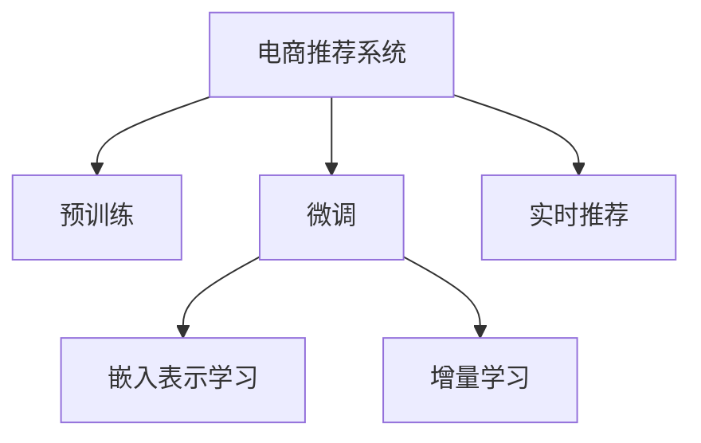

                 

## 1. 背景介绍

在电商领域，推荐系统已经成为用户获取商品信息、提升购物体验的关键手段。传统推荐系统通常基于用户的历史行为数据，如浏览、点击、购买等进行推荐，难以捕捉用户的潜在兴趣和实时偏好。近年来，AI大模型在电商推荐中崭露头角，通过在用户画像、商品标签等语义数据上进行预训练和微调，能够更全面、高效地实现商品推荐。

本文将从电商推荐系统的背景、核心概念、算法原理、具体实现、应用场景、未来趋势及面临的挑战等多个方面，深入探讨AI大模型在电商实时推荐中的应用。

## 2. 核心概念与联系

### 2.1 核心概念概述

为更好地理解AI大模型在电商推荐中的应用，本节将介绍几个密切相关的核心概念：

- **AI大模型**：以自回归(如GPT)或自编码(如BERT)模型为代表的大规模预训练语言模型。通过在大规模无标签文本语料上进行预训练，学习通用的语言表示，具备强大的语言理解和生成能力。

- **电商推荐系统**：基于用户行为数据、商品特征数据等，通过算法模型为用户推荐相关商品的系统。包括协同过滤、基于内容的推荐、深度学习推荐等多种技术。

- **预训练与微调**：预训练是指在大规模无标签文本数据上，通过自监督学习任务训练模型获得语言通用表示的过程；微调是指在预训练模型的基础上，通过有监督地训练来优化模型在特定任务上的性能。

- **嵌入表示学习(Embedding Learning)**：将文本、图像、用户画像等非结构化数据映射为高维向量空间中的点，便于模型处理和相似度计算。

- **增量学习(Incremental Learning)**：指在已有模型基础上，利用新数据不断更新模型参数的过程。

- **实时推荐**：指推荐系统能够根据用户的实时行为和数据，动态生成推荐结果，满足用户个性化需求。

这些核心概念之间的逻辑关系可以通过以下Mermaid流程图来展示：



这个流程图展示了大模型在电商推荐系统的核心概念及其之间的关系：

1. 电商推荐系统通过预训练大模型获得语言通用表示。
2. 微调进一步优化模型在电商推荐任务上的性能。
3. 嵌入表示学习将非结构化数据映射为高维向量，便于模型处理。
4. 增量学习不断更新模型参数，保持模型性能。
5. 实时推荐系统能够根据用户实时行为生成推荐结果。

## 3. 核心算法原理 & 具体操作步骤

### 3.1 算法原理概述

AI大模型在电商推荐中的应用，本质上是一种基于预训练-微调的迁移学习过程。其核心思想是：将预训练的大模型视作一个强大的"特征提取器"，通过在电商推荐系统的标注数据上进行有监督的微调，使得模型输出能够匹配电商推荐任务的目标，从而获得针对特定任务的优化模型。

形式化地，假设预训练模型为 $M_{\theta}$，其中 $\theta$ 为预训练得到的模型参数。给定电商推荐任务 $T$ 的标注数据集 $D=\{(x_i, y_i)\}_{i=1}^N$，其中 $x_i$ 为商品描述、用户画像等语义数据，$y_i$ 为推荐结果。微调的目标是找到新的模型参数 $\hat{\theta}$，使得：

$$
\hat{\theta}=\mathop{\arg\min}_{\theta} \mathcal{L}(M_{\theta},D)
$$

其中 $\mathcal{L}$ 为针对任务 $T$ 设计的损失函数，用于衡量模型预测输出与真实标签之间的差异。常见的损失函数包括交叉熵损失、均方误差损失等。

通过梯度下降等优化算法，微调过程不断更新模型参数 $\theta$，最小化损失函数 $\mathcal{L}$，使得模型输出逼近真实标签。由于 $\theta$ 已经通过预训练获得了较好的初始化，因此即便在电商推荐任务上数据量较小，微调也能较快收敛到理想的模型参数 $\hat{\theta}$。

### 3.2 算法步骤详解

基于预训练大模型的电商推荐系统一般包括以下几个关键步骤：

**Step 1: 准备预训练模型和数据集**
- 选择合适的预训练语言模型 $M_{\theta}$ 作为初始化参数，如 BERT、GPT等。
- 准备电商推荐任务 $T$ 的标注数据集 $D$，划分为训练集、验证集和测试集。标注数据应包括商品描述、用户画像、历史行为记录等语义数据，以及推荐结果。

**Step 2: 添加任务适配层**
- 根据任务类型，在预训练模型顶层设计合适的输出层和损失函数。
- 对于电商推荐任务，通常使用交叉熵损失函数，以衡量推荐结果与用户行为之间的差异。

**Step 3: 设置微调超参数**
- 选择合适的优化算法及其参数，如 AdamW、SGD 等，设置学习率、批大小、迭代轮数等。
- 设置正则化技术及强度，包括权重衰减、Dropout、Early Stopping 等。
- 确定冻结预训练参数的策略，如仅微调顶层，或全部参数都参与微调。

**Step 4: 执行梯度训练**
- 将训练集数据分批次输入模型，前向传播计算损失函数。
- 反向传播计算参数梯度，根据设定的优化算法和学习率更新模型参数。
- 周期性在验证集上评估模型性能，根据性能指标决定是否触发 Early Stopping。
- 重复上述步骤直到满足预设的迭代轮数或 Early Stopping 条件。

**Step 5: 测试和部署**
- 在测试集上评估微调后模型 $M_{\hat{\theta}}$ 的性能，对比微调前后的精度提升。
- 使用微调后的模型对新样本进行推理预测，集成到实际的应用系统中。
- 持续收集新的数据，定期重新微调模型，以适应数据分布的变化。

以上是基于预训练大模型的电商推荐系统的通用流程。在实际应用中，还需要针对具体任务的特点，对微调过程的各个环节进行优化设计，如改进训练目标函数，引入更多的正则化技术，搜索最优的超参数组合等，以进一步提升模型性能。

### 3.3 算法优缺点

基于预训练大模型的电商推荐系统具有以下优点：
1. 高效性：大模型的预训练能力使其能够快速适应电商推荐任务，提升推荐效果。
2. 泛化能力强：大模型能够在电商推荐任务上泛化出更好的结果。
3. 可解释性：大模型通过预训练获得知识，使其推荐过程更具有可解释性。
4. 适应性强：大模型能够适应不同规模的电商推荐系统。

同时，该方法也存在一定的局限性：
1. 依赖标注数据：微调的效果很大程度上取决于标注数据的质量和数量，获取高质量标注数据的成本较高。
2. 迁移能力有限：当电商推荐任务与预训练数据的分布差异较大时，微调的性能提升有限。
3. 可解释性不足：大模型的固有偏见、有害信息等，可能通过微调传递到电商推荐任务，造成负面影响。
4. 计算资源消耗大：大模型的计算资源需求较高，需要高性能的GPU/TPU设备。

尽管存在这些局限性，但就目前而言，基于预训练大模型的电商推荐方法仍是最主流范式。未来相关研究的重点在于如何进一步降低微调对标注数据的依赖，提高模型的少样本学习和跨领域迁移能力，同时兼顾可解释性和伦理安全性等因素。

### 3.4 算法应用领域

基于预训练大模型的电商推荐方法，已经在商品推荐、广告投放、搜索排序等多个电商场景中得到了广泛的应用，成为电商推荐技术的重要手段。具体应用领域包括：

- 个性化推荐：根据用户历史行为和偏好，为用户推荐相关商品，提升用户体验。
- 广告投放：利用用户画像和商品特征，精准投放广告，提高广告转化率。
- 搜索排序：根据用户查询和商品信息，排序搜索结果，提升搜索相关性。
- 风控预警：分析用户行为数据，预测潜在风险，进行风险预警。

除了上述这些经典应用外，大模型推荐技术还创新性地应用于内容推荐、价格预测、物流优化等场景，为电商技术的创新发展提供了新的方向。随着预训练模型和推荐方法的不断进步，相信电商推荐技术将在更多场景中得到应用，为电商企业的运营效率和用户体验带来更大提升。

## 4. 数学模型和公式 & 详细讲解 & 举例说明

### 4.1 数学模型构建

本节将使用数学语言对基于预训练大模型的电商推荐过程进行更加严格的刻画。

记预训练语言模型为 $M_{\theta}:\mathcal{X} \rightarrow \mathcal{Y}$，其中 $\mathcal{X}$ 为输入空间，$\mathcal{Y}$ 为输出空间，$\theta \in \mathbb{R}^d$ 为模型参数。假设电商推荐任务 $T$ 的训练集为 $D=\{(x_i,y_i)\}_{i=1}^N$，其中 $x_i$ 为商品描述、用户画像等语义数据，$y_i$ 为推荐结果。

定义模型 $M_{\theta}$ 在数据样本 $(x,y)$ 上的损失函数为 $\ell(M_{\theta}(x),y)$，则在数据集 $D$ 上的经验风险为：

$$
\mathcal{L}(\theta) = \frac{1}{N} \sum_{i=1}^N \ell(M_{\theta}(x_i),y_i)
$$

微调的优化目标是最小化经验风险，即找到最优参数：

$$
\theta^* = \mathop{\arg\min}_{\theta} \mathcal{L}(\theta)
$$

在实践中，我们通常使用基于梯度的优化算法（如SGD、Adam等）来近似求解上述最优化问题。设 $\eta$ 为学习率，$\lambda$ 为正则化系数，则参数的更新公式为：

$$
\theta \leftarrow \theta - \eta \nabla_{\theta}\mathcal{L}(\theta) - \eta\lambda\theta
$$

其中 $\nabla_{\theta}\mathcal{L}(\theta)$ 为损失函数对参数 $\theta$ 的梯度，可通过反向传播算法高效计算。

### 4.2 公式推导过程

以下我们以二分类任务为例，推导交叉熵损失函数及其梯度的计算公式。

假设模型 $M_{\theta}$ 在输入 $x$ 上的输出为 $\hat{y}=M_{\theta}(x) \in [0,1]$，表示推荐结果属于正类的概率。真实标签 $y \in \{0,1\}$。则二分类交叉熵损失函数定义为：

$$
\ell(M_{\theta}(x),y) = -[y\log \hat{y} + (1-y)\log (1-\hat{y})]
$$

将其代入经验风险公式，得：

$$
\mathcal{L}(\theta) = -\frac{1}{N}\sum_{i=1}^N [y_i\log M_{\theta}(x_i)+(1-y_i)\log(1-M_{\theta}(x_i))]
$$

根据链式法则，损失函数对参数 $\theta_k$ 的梯度为：

$$
\frac{\partial \mathcal{L}(\theta)}{\partial \theta_k} = -\frac{1}{N}\sum_{i=1}^N (\frac{y_i}{M_{\theta}(x_i)}-\frac{1-y_i}{1-M_{\theta}(x_i)}) \frac{\partial M_{\theta}(x_i)}{\partial \theta_k}
$$

其中 $\frac{\partial M_{\theta}(x_i)}{\partial \theta_k}$ 可进一步递归展开，利用自动微分技术完成计算。

在得到损失函数的梯度后，即可带入参数更新公式，完成模型的迭代优化。重复上述过程直至收敛，最终得到适应电商推荐任务的最优模型参数 $\theta^*$。

## 5. 项目实践：代码实例和详细解释说明

### 5.1 开发环境搭建

在进行电商推荐系统的大模型微调实践前，我们需要准备好开发环境。以下是使用Python进行PyTorch开发的环境配置流程：

1. 安装Anaconda：从官网下载并安装Anaconda，用于创建独立的Python环境。

2. 创建并激活虚拟环境：
```bash
conda create -n pytorch-env python=3.8 
conda activate pytorch-env
```

3. 安装PyTorch：根据CUDA版本，从官网获取对应的安装命令。例如：
```bash
conda install pytorch torchvision torchaudio cudatoolkit=11.1 -c pytorch -c conda-forge
```

4. 安装Transformers库：
```bash
pip install transformers
```

5. 安装各类工具包：
```bash
pip install numpy pandas scikit-learn matplotlib tqdm jupyter notebook ipython
```

完成上述步骤后，即可在`pytorch-env`环境中开始微调实践。

### 5.2 源代码详细实现

这里我们以商品推荐任务为例，给出使用Transformers库对BERT模型进行电商推荐微调的PyTorch代码实现。

首先，定义商品推荐任务的标注数据处理函数：

```python
from transformers import BertTokenizer
from torch.utils.data import Dataset
import torch

class RecommendationDataset(Dataset):
    def __init__(self, items, users, tokenizer, max_len=128):
        self.items = items
        self.users = users
        self.tokenizer = tokenizer
        self.max_len = max_len
        
    def __len__(self):
        return len(self.items)
    
    def __getitem__(self, item):
        item = self.items[item]
        user = self.users[item]
        
        item_tokens = self.tokenizer(item, return_tensors='pt', max_length=self.max_len, padding='max_length', truncation=True)
        user_tokens = self.tokenizer(user, return_tensors='pt', max_length=self.max_len, padding='max_length', truncation=True)
        item_ids = item_tokens['input_ids'][0]
        user_ids = user_tokens['input_ids'][0]
        item_attention_mask = item_tokens['attention_mask'][0]
        user_attention_mask = user_tokens['attention_mask'][0]
        
        return {'item_ids': item_ids, 
                'user_ids': user_ids,
                'item_attention_mask': item_attention_mask,
                'user_attention_mask': user_attention_mask}
```

然后，定义模型和优化器：

```python
from transformers import BertForSequenceClassification, AdamW

model = BertForSequenceClassification.from_pretrained('bert-base-cased', num_labels=2)

optimizer = AdamW(model.parameters(), lr=2e-5)
```

接着，定义训练和评估函数：

```python
from torch.utils.data import DataLoader
from tqdm import tqdm
from sklearn.metrics import accuracy_score

device = torch.device('cuda') if torch.cuda.is_available() else torch.device('cpu')
model.to(device)

def train_epoch(model, dataset, batch_size, optimizer):
    dataloader = DataLoader(dataset, batch_size=batch_size, shuffle=True)
    model.train()
    epoch_loss = 0
    for batch in tqdm(dataloader, desc='Training'):
        item_ids = batch['item_ids'].to(device)
        user_ids = batch['user_ids'].to(device)
        item_attention_mask = batch['item_attention_mask'].to(device)
        user_attention_mask = batch['user_attention_mask'].to(device)
        model.zero_grad()
        outputs = model(item_ids, attention_mask=item_attention_mask, user_ids=user_ids, attention_mask=user_attention_mask)
        loss = outputs.loss
        epoch_loss += loss.item()
        loss.backward()
        optimizer.step()
    return epoch_loss / len(dataloader)

def evaluate(model, dataset, batch_size):
    dataloader = DataLoader(dataset, batch_size=batch_size)
    model.eval()
    preds, labels = [], []
    with torch.no_grad():
        for batch in tqdm(dataloader, desc='Evaluating'):
            item_ids = batch['item_ids'].to(device)
            user_ids = batch['user_ids'].to(device)
            item_attention_mask = batch['item_attention_mask'].to(device)
            user_attention_mask = batch['user_attention_mask'].to(device)
            batch_labels = batch['labels'].to(device)
            outputs = model(item_ids, attention_mask=item_attention_mask, user_ids=user_ids, attention_mask=user_attention_mask)
            batch_preds = outputs.logits.argmax(dim=2).to('cpu').tolist()
            batch_labels = batch_labels.to('cpu').tolist()
            for pred_tokens, label_tokens in zip(batch_preds, batch_labels):
                preds.append(pred_tokens[:len(label_tokens)])
                labels.append(label_tokens)
                
    return accuracy_score(labels, preds)

```

最后，启动训练流程并在测试集上评估：

```python
epochs = 5
batch_size = 16

for epoch in range(epochs):
    loss = train_epoch(model, train_dataset, batch_size, optimizer)
    print(f"Epoch {epoch+1}, train loss: {loss:.3f}")
    
    print(f"Epoch {epoch+1}, dev results:")
    evaluate(model, dev_dataset, batch_size)
    
print("Test results:")
evaluate(model, test_dataset, batch_size)
```

以上就是使用PyTorch对BERT进行电商推荐任务微调的完整代码实现。可以看到，得益于Transformers库的强大封装，我们可以用相对简洁的代码完成BERT模型的加载和微调。

### 5.3 代码解读与分析

让我们再详细解读一下关键代码的实现细节：

**RecommendationDataset类**：
- `__init__`方法：初始化商品、用户、分词器等关键组件。
- `__len__`方法：返回数据集的样本数量。
- `__getitem__`方法：对单个样本进行处理，将商品、用户输入编码为token ids，并将注意力掩码一并编码为token ids，最终返回模型所需的输入。

**训练和评估函数**：
- 使用PyTorch的DataLoader对数据集进行批次化加载，供模型训练和推理使用。
- 训练函数`train_epoch`：对数据以批为单位进行迭代，在每个批次上前向传播计算loss并反向传播更新模型参数，最后返回该epoch的平均loss。
- 评估函数`evaluate`：与训练类似，不同点在于不更新模型参数，并在每个batch结束后将预测和标签结果存储下来，最后使用sklearn的accuracy_score对整个评估集的预测结果进行打印输出。

**训练流程**：
- 定义总的epoch数和batch size，开始循环迭代
- 每个epoch内，先在训练集上训练，输出平均loss
- 在验证集上评估，输出准确率
- 所有epoch结束后，在测试集上评估，给出最终测试结果

可以看到，PyTorch配合Transformers库使得BERT微调的代码实现变得简洁高效。开发者可以将更多精力放在数据处理、模型改进等高层逻辑上，而不必过多关注底层的实现细节。

当然，工业级的系统实现还需考虑更多因素，如模型的保存和部署、超参数的自动搜索、更灵活的任务适配层等。但核心的微调范式基本与此类似。

## 6. 实际应用场景

### 6.1 智能客服系统

基于大模型微调的电商推荐技术，可以广泛应用于智能客服系统的构建。传统客服往往需要配备大量人力，高峰期响应缓慢，且一致性和专业性难以保证。而使用微调后的推荐模型，可以7x24小时不间断服务，快速响应客户咨询，用推荐商品满足客户需求。

在技术实现上，可以收集企业内部的历史商品推荐记录，将用户行为和商品推荐结果构建成监督数据，在此基础上对预训练推荐模型进行微调。微调后的推荐模型能够自动理解用户意图，推荐最合适的商品。对于客户提出的新商品，还可以接入检索系统实时搜索相关商品，动态生成推荐结果。如此构建的智能客服系统，能大幅提升客户咨询体验和问题解决效率。

### 6.2 个性化推荐系统

当前的推荐系统往往只依赖用户的历史行为数据进行物品推荐，难以捕捉用户的潜在兴趣和实时偏好。基于大模型微调的推荐技术，能够从商品描述、用户画像等语义数据中学习用户的隐性偏好，实现更全面、个性化的推荐。

在实践中，可以收集用户浏览、点击、购买等行为数据，提取和商品相关的文本描述、标签等语义数据。将文本数据作为模型输入，用户的后续行为（如是否点击、购买等）作为监督信号，在此基础上微调预训练语言模型。微调后的模型能够从文本内容中准确把握用户的兴趣点。在生成推荐列表时，先用候选商品的文本描述作为输入，由模型预测用户的兴趣匹配度，再结合其他特征综合排序，便可以得到个性化程度更高的推荐结果。

### 6.3 实时广告投放

基于大模型微调的电商推荐技术，还可以应用于实时广告投放。广告主希望能够精准投放广告，最大化广告转化率。通过微调后的推荐模型，可以实时分析用户行为数据，预测用户的广告投放兴趣，推荐最合适的广告。此外，模型还能实时动态调整广告预算和投放策略，确保广告效果最优。

### 6.4 未来应用展望

随着大模型推荐技术的不断发展，未来将会在更多领域得到应用，为电商企业带来更大的价值。

在智慧物流领域，基于大模型的推荐技术可以优化仓库管理、库存调配，提升物流效率和配送速度。

在金融风控领域，推荐模型可以用于识别潜在风险客户，进行风险预警。

在内容创作领域，推荐技术可以帮助创作者发现热点话题，提升内容创作质量和传播效果。

此外，在教育、医疗、旅游等多个领域，基于大模型的推荐技术也将不断涌现，为各行各业提供新的价值增长点。相信随着技术的日益成熟，电商推荐技术将在更广阔的应用领域大放异彩，深刻影响人类生活的方方面面。

## 7. 工具和资源推荐
### 7.1 学习资源推荐

为了帮助开发者系统掌握大模型推荐技术的基础理论和技术细节，这里推荐一些优质的学习资源：

1. 《深度学习推荐系统》系列书籍：由推荐系统专家撰写，系统介绍了推荐系统的发展历程、经典模型、应用实例等。

2. 《深度学习与推荐系统》课程：北京大学的推荐系统在线课程，内容涵盖了推荐系统理论、算法、实践等多个方面。

3. 《推荐系统实践》书籍：亚马逊的推荐系统工程师撰写，全面介绍了推荐系统的实际应用和开发经验。

4. Kaggle竞赛平台：大量的推荐系统竞赛项目，让你通过实践掌握推荐系统技术和算法。

5. Weights & Biases：推荐系统实验跟踪工具，可以记录和可视化模型训练过程中的各项指标，方便对比和调优。

通过这些资源的学习实践，相信你一定能够快速掌握大模型推荐技术的精髓，并用于解决实际的推荐问题。
### 7.2 开发工具推荐

高效的开发离不开优秀的工具支持。以下是几款用于大模型推荐开发的常用工具：

1. PyTorch：基于Python的开源深度学习框架，灵活动态的计算图，适合快速迭代研究。大部分预训练语言模型都有PyTorch版本的实现。

2. TensorFlow：由Google主导开发的开源深度学习框架，生产部署方便，适合大规模工程应用。同样有丰富的预训练语言模型资源。

3. Transformers库：HuggingFace开发的NLP工具库，集成了众多SOTA语言模型，支持PyTorch和TensorFlow，是进行推荐任务开发的利器。

4. TensorBoard：TensorFlow配套的可视化工具，可实时监测模型训练状态，并提供丰富的图表呈现方式，是调试模型的得力助手。

5. Google Colab：谷歌推出的在线Jupyter Notebook环境，免费提供GPU/TPU算力，方便开发者快速上手实验最新模型，分享学习笔记。

合理利用这些工具，可以显著提升大模型推荐任务的开发效率，加快创新迭代的步伐。

### 7.3 相关论文推荐

大模型推荐技术的发展源于学界的持续研究。以下是几篇奠基性的相关论文，推荐阅读：

1. Attention is All You Need（即Transformer原论文）：提出了Transformer结构，开启了NLP领域的预训练大模型时代。

2. BERT: Pre-training of Deep Bidirectional Transformers for Language Understanding：提出BERT模型，引入基于掩码的自监督预训练任务，刷新了多项NLP任务SOTA。

3. Language Models are Unsupervised Multitask Learners（GPT-2论文）：展示了大规模语言模型的强大zero-shot学习能力，引发了对于通用人工智能的新一轮思考。

4. Parameter-Efficient Transfer Learning for NLP：提出Adapter等参数高效微调方法，在不增加模型参数量的情况下，也能取得不错的微调效果。

5. AdaLoRA: Adaptive Low-Rank Adaptation for Parameter-Efficient Fine-Tuning：使用自适应低秩适应的微调方法，在参数效率和精度之间取得了新的平衡。

这些论文代表了大模型推荐技术的发展脉络。通过学习这些前沿成果，可以帮助研究者把握学科前进方向，激发更多的创新灵感。

## 8. 总结：未来发展趋势与挑战

### 8.1 总结

本文对基于预训练大模型的电商推荐系统进行了全面系统的介绍。首先阐述了电商推荐系统的背景、核心概念和算法原理，明确了预训练大模型在电商推荐中的独特价值。其次，从原理到实践，详细讲解了电商推荐任务的数学模型和具体实现，给出了微调任务开发的完整代码实例。同时，本文还广泛探讨了推荐系统在智能客服、个性化推荐、实时广告等多个电商场景中的应用前景，展示了预训练大模型的巨大潜力。此外，本文精选了推荐系统的各类学习资源，力求为读者提供全方位的技术指引。

通过本文的系统梳理，可以看到，基于预训练大模型的电商推荐系统正在成为电商推荐技术的重要范式，极大地拓展了电商推荐系统的应用边界，催生了更多的落地场景。受益于大规模语料的预训练，推荐模型在推荐效果上显著优于传统方法，成为电商企业提升运营效率和用户体验的重要手段。未来，伴随预训练模型和推荐方法的不断进步，相信电商推荐技术将在更多场景中得到应用，为电商企业的运营效率和用户体验带来更大提升。

### 8.2 未来发展趋势

展望未来，电商推荐系统将呈现以下几个发展趋势：

1. 模型规模持续增大。随着算力成本的下降和数据规模的扩张，预训练语言模型的参数量还将持续增长。超大规模语言模型蕴含的丰富语言知识，有望支撑更加复杂多变的电商推荐任务。

2. 推荐模型日趋多样化。除了传统的基于内容的推荐、协同过滤等方法，未来会涌现更多基于深度学习的推荐方法，如基于神经网络的推荐模型，以及融合图神经网络的推荐模型。

3. 实时推荐成为常态。推荐系统能够根据用户的实时行为和数据，动态生成推荐结果，满足用户个性化需求。实时代理的推荐系统将成为电商推荐技术的主要趋势。

4. 多模态推荐崛起。当前的推荐模型往往只利用文本数据，未来会融合图像、音频、视频等多模态信息，提升推荐模型的性能。

5. 跨领域推荐出现。推荐系统不再局限于电商领域，而是扩展到更多领域，如金融、医疗、教育等，实现更全面、更精准的推荐。

以上趋势凸显了大模型推荐技术的广阔前景。这些方向的探索发展，必将进一步提升电商推荐系统的性能和应用范围，为电商企业的运营效率和用户体验带来更大提升。

### 8.3 面临的挑战

尽管大模型推荐技术已经取得了瞩目成就，但在迈向更加智能化、普适化应用的过程中，它仍面临着诸多挑战：

1. 数据质量和数量瓶颈。电商推荐系统的效果很大程度上取决于用户行为数据的质量和数量，但数据获取成本高、用户隐私保护难度大。如何提升数据质量、优化数据获取方式，是未来研究的重点。

2. 模型鲁棒性不足。当前推荐模型面对不同数据分布的抗扰性较差，容易出现过拟合现象。如何提高模型的泛化能力和鲁棒性，是一个重要的研究方向。

3. 计算资源消耗大。大模型的计算资源需求较高，需要高性能的GPU/TPU设备。如何优化模型结构、提升计算效率，是一个关键问题。

4. 推荐算法复杂性高。电商推荐系统涉及用户行为、商品属性、时间因素等多个维度，算法设计复杂。如何简化推荐算法、提升算法可解释性，是一个重要研究方向。

5. 用户隐私保护难度大。电商推荐系统需要收集用户行为数据，如何保护用户隐私，避免数据泄露，是一个重要问题。

6. 跨领域推荐难度大。跨领域推荐涉及多个领域的知识融合，技术难度高。如何设计高效的跨领域推荐模型，是一个重要研究方向。

以上挑战需要技术、伦理、法律等多方面的协同努力，才能在大模型推荐技术中实现均衡发展。相信随着技术的不断进步和各方努力，这些挑战终将逐步被克服，大模型推荐技术将在更多领域大放异彩。

### 8.4 研究展望

面对大模型推荐技术所面临的种种挑战，未来的研究需要在以下几个方面寻求新的突破：

1. 探索无监督和半监督推荐方法。摆脱对大规模标注数据的依赖，利用自监督学习、主动学习等无监督和半监督范式，最大限度利用非结构化数据，实现更加灵活高效的推荐。

2. 研究参数高效和计算高效的推荐范式。开发更加参数高效的推荐方法，在固定大部分预训练参数的同时，只更新极少量的任务相关参数。同时优化推荐模型的计算图，减少前向传播和反向传播的资源消耗，实现更加轻量级、实时性的部署。

3. 融合因果推断和对比学习。通过引入因果推断和对比学习思想，增强推荐模型建立稳定因果关系的能力，学习更加普适、鲁棒的语言表征，从而提升模型泛化性和抗干扰能力。

4. 引入更多先验知识。将符号化的先验知识，如知识图谱、逻辑规则等，与神经网络模型进行巧妙融合，引导推荐过程学习更准确、合理的语言模型。同时加强不同模态数据的整合，实现视觉、语音等多模态信息与文本信息的协同建模。

5. 结合因果分析和博弈论工具。将因果分析方法引入推荐模型，识别出模型决策的关键特征，增强推荐输出的因果性和逻辑性。借助博弈论工具刻画人机交互过程，主动探索并规避模型的脆弱点，提高系统稳定性。

6. 纳入伦理道德约束。在推荐模型训练目标中引入伦理导向的评估指标，过滤和惩罚有偏见、有害的输出倾向。同时加强人工干预和审核，建立模型行为的监管机制，确保输出符合人类价值观和伦理道德。

这些研究方向的探索，必将引领大模型推荐技术迈向更高的台阶，为构建智能、可靠、可解释、可控的智能推荐系统铺平道路。面向未来，大模型推荐技术还需要与其他人工智能技术进行更深入的融合，如知识表示、因果推理、强化学习等，多路径协同发力，共同推动智能推荐系统的进步。只有勇于创新、敢于突破，才能不断拓展推荐系统的边界，让智能技术更好地造福人类社会。

## 9. 附录：常见问题与解答

**Q1：AI大模型在电商推荐中的应用是否适用于所有电商场景？**

A: AI大模型在电商推荐中的应用在大多数电商场景上都能取得不错的效果。但对于一些特殊场景，如即时交易、奢侈品等，AI大模型推荐的效果可能不如传统推荐方法。因为这些场景中的商品或服务具有特殊属性，需要结合领域专家的知识进行推荐，而AI大模型可能无法很好地理解这些特殊需求。

**Q2：大模型在电商推荐中的应用是否存在数据隐私问题？**

A: 电商推荐系统需要收集用户行为数据，存在数据隐私问题。为保护用户隐私，通常会采用数据匿名化、差分隐私等技术，确保数据使用过程中的安全性。此外，还可以通过多方安全计算等技术，在保护数据隐私的前提下，实现数据共享和协作。

**Q3：大模型推荐算法是否容易过拟合？**

A: 大模型推荐算法确实存在过拟合的风险。在数据量较小、模型参数较多时，容易发生过拟合现象。为避免过拟合，可以采用数据增强、正则化、早停等技术，同时考虑参数高效的推荐方法，如基于神经网络的推荐模型。

**Q4：大模型推荐系统是否需要进行定期的模型更新？**

A: 电商推荐系统中的大模型推荐算法需要根据用户行为数据和商品数据进行定期的模型更新，以保持推荐模型的最新状态。但模型的更新需要平衡计算资源和时间成本，通常会根据业务需求和数据变化频率进行更新。

**Q5：大模型推荐算法是否适用于低频商品推荐？**

A: 大模型推荐算法通常适用于高频商品推荐，但对于低频商品推荐，由于数据量较少，大模型推荐的效果可能不如传统推荐方法。此时可以考虑结合领域知识，使用基于规则的推荐方法进行补充。

**Q6：大模型推荐系统是否容易受到恶意攻击？**

A: 大模型推荐系统可能会受到恶意攻击，如通过修改用户行为数据进行攻击。为防止恶意攻击，可以采用异常检测、数据清洗等技术，确保推荐系统的安全性。同时，加强对模型的监控和审计，确保模型的公正性和透明度。

通过回答这些常见问题，相信你对大模型推荐技术有了更深入的理解，可以更好地应用于电商推荐系统的实践中。希望本文能够为你提供有益的参考和指导，共同推动电商推荐技术的进步和发展。

---

作者：禅与计算机程序设计艺术 / Zen and the Art of Computer Programming

