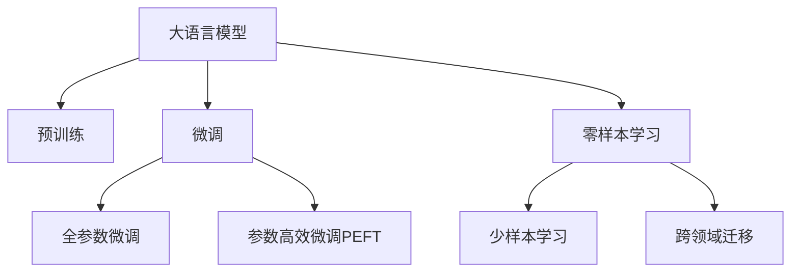

                 

# AI大模型在电商平台价格预测中的作用

## 1. 背景介绍

### 1.1 问题由来
随着电商平台的迅速发展，如何准确预测商品价格，成为电商平台实现智能定价和精准推荐的关键。传统的基于规则和统计模型的方法，难以应对快速变化的电商市场环境。而利用大规模预训练语言模型进行价格预测，则能在无需大量标注数据的情况下，取得较好的效果。

### 1.2 问题核心关键点
本节将重点阐述大语言模型在电商平台价格预测中的应用，并介绍其核心思想和关键技术点。

1. **大语言模型**：以自回归或自编码模型为代表的大规模预训练语言模型，能够学习通用的语言表示和语言知识。
2. **价格预测**：电商平台在商品上架、促销活动、库存管理等方面，需要实时预测商品价格，以实现最佳销售策略。
3. **微调**：将大语言模型视作"特征提取器"，通过下游任务的数据集，进行有监督的微调，优化模型在特定任务上的性能。
4. **零样本学习**：利用大模型的泛化能力，进行少样本或零样本学习，减少价格预测中对历史数据的依赖。

## 2. 核心概念与联系

### 2.1 核心概念概述

为更好地理解大语言模型在电商平台价格预测中的应用，本节将介绍几个关键概念：

- **大语言模型**：以自回归(如GPT)或自编码(如BERT)模型为代表的大规模预训练语言模型。通过在大规模无标签文本语料上进行预训练，学习通用的语言表示和语言知识。
- **预训练**：指在大规模无标签文本语料上，通过自监督学习任务训练通用语言模型的过程。常见的预训练任务包括言语建模、遮挡语言模型等。
- **微调**：指在预训练模型的基础上，使用下游任务的少量标注数据，通过有监督学习优化模型在特定任务上的性能。通常只需要调整顶层分类器或解码器，并以较小的学习率更新全部或部分的模型参数。
- **零样本学习**：指模型在没有见过任何特定任务的训练样本的情况下，仅凭任务描述就能够执行新任务的能力。大语言模型通过预训练获得的广泛知识，使其能够理解任务指令并生成相应输出。

这些概念之间的逻辑关系可以通过以下Mermaid流程图来展示：



这个流程图展示了大语言模型的核心概念及其之间的关系：

1. 大语言模型通过预训练获得基础能力。
2. 微调是对预训练模型进行任务特定的优化，可以分为全参数微调和参数高效微调（PEFT）。
3. 零样本学习是一种不更新模型参数的方法，可以实现少样本学习和跨领域迁移。

## 3. 核心算法原理 & 具体操作步骤
### 3.1 算法原理概述

利用大语言模型进行电商平台价格预测，本质上是一个有监督的细粒度迁移学习过程。其核心思想是：将大语言模型视作一个强大的"特征提取器"，通过下游任务的少量标注数据，优化模型在该任务上的性能，实现精准的价格预测。

形式化地，假设预训练模型为 $M_{\theta}$，其中 $\theta$ 为预训练得到的模型参数。给定电商平台价格预测任务 $T$ 的标注数据集 $D=\{(x_i, y_i)\}_{i=1}^N, x_i \in \mathcal{X}, y_i \in \mathbb{R}$，其中 $\mathcal{X}$ 为特征空间，$\mathbb{R}$ 为连续的价格空间。微调的目标是找到新的模型参数 $\hat{\theta}$，使得：

$$
\hat{\theta}=\mathop{\arg\min}_{\theta} \mathcal{L}(M_{\theta},D)
$$

其中 $\mathcal{L}$ 为针对任务 $T$ 设计的损失函数，用于衡量模型预测价格与真实价格之间的差异。常见的损失函数包括均方误差损失、平均绝对误差损失等。

通过梯度下降等优化算法，微调过程不断更新模型参数 $\theta$，最小化损失函数 $\mathcal{L}$，使得模型预测价格逼近真实价格。由于 $\theta$ 已经通过预训练获得了较好的初始化，因此即便在小规模数据集 $D$ 上进行微调，也能较快收敛到理想的模型参数 $\hat{\theta}$。

### 3.2 算法步骤详解

基于有监督学习的大语言模型微调，一般包括以下几个关键步骤：

**Step 1: 准备预训练模型和数据集**
- 选择合适的预训练语言模型 $M_{\theta}$ 作为初始化参数，如 BERT、GPT等。
- 准备电商平台价格预测任务 $T$ 的标注数据集 $D$，划分为训练集、验证集和测试集。一般要求标注数据与预训练数据的分布不要差异过大。

**Step 2: 添加任务适配层**
- 根据任务类型，在预训练模型顶层设计合适的输出层和损失函数。
- 对于价格预测任务，通常在顶层添加线性回归器，并使用均方误差损失函数。
- 对于多分类价格预测任务，可以考虑使用多类别交叉熵损失函数。

**Step 3: 设置微调超参数**
- 选择合适的优化算法及其参数，如 AdamW、SGD 等，设置学习率、批大小、迭代轮数等。
- 设置正则化技术及强度，包括权重衰减、Dropout、Early Stopping等。
- 确定冻结预训练参数的策略，如仅微调顶层，或全部参数都参与微调。

**Step 4: 执行梯度训练**
- 将训练集数据分批次输入模型，前向传播计算损失函数。
- 反向传播计算参数梯度，根据设定的优化算法和学习率更新模型参数。
- 周期性在验证集上评估模型性能，根据性能指标决定是否触发 Early Stopping。
- 重复上述步骤直到满足预设的迭代轮数或 Early Stopping 条件。

**Step 5: 测试和部署**
- 在测试集上评估微调后模型 $M_{\hat{\theta}}$ 的性能，对比微调前后的精度提升。
- 使用微调后的模型对新商品进行价格预测，集成到实际的价格推荐系统中。
- 持续收集新的价格数据，定期重新微调模型，以适应数据分布的变化。

以上是基于有监督学习微调大语言模型的一般流程。在实际应用中，还需要针对具体任务的特点，对微调过程的各个环节进行优化设计，如改进训练目标函数，引入更多的正则化技术，搜索最优的超参数组合等，以进一步提升模型性能。

### 3.3 算法优缺点

基于有监督学习的大语言模型微调方法具有以下优点：
1. 简单高效。只需准备少量标注数据，即可对预训练模型进行快速适配，获得较大的性能提升。
2. 通用适用。适用于各种电商平台价格预测任务，包括单商品价格预测、促销活动价格预测等，设计简单的任务适配层即可实现微调。
3. 参数高效。利用参数高效微调技术，在固定大部分预训练权重不变的情况下，仍可取得不错的提升。
4. 效果显著。在学术界和工业界的诸多任务上，基于微调的方法已经刷新了最先进的性能指标。

同时，该方法也存在一定的局限性：
1. 依赖标注数据。微调的效果很大程度上取决于标注数据的质量和数量，获取高质量标注数据的成本较高。
2. 迁移能力有限。当目标任务与预训练数据的分布差异较大时，微调的性能提升有限。
3. 负面效果传递。预训练模型的固有偏见、有害信息等，可能通过微调传递到下游任务，造成负面影响。
4. 可解释性不足。微调模型的决策过程通常缺乏可解释性，难以对其推理逻辑进行分析和调试。

尽管存在这些局限性，但就目前而言，基于有监督学习的微调方法仍是大语言模型应用的最主流范式。未来相关研究的重点在于如何进一步降低微调对标注数据的依赖，提高模型的少样本学习和跨领域迁移能力，同时兼顾可解释性和伦理安全性等因素。

### 3.4 算法应用领域

基于大语言模型微调的价格预测方法，在电商平台的应用场景中已经得到了广泛的应用，覆盖了几乎所有常见任务，例如：

- 单商品价格预测：预测新上架商品的销售价格。通过微调模型，可以学习到商品特征与价格之间的关系。
- 促销活动价格预测：预测促销活动的平均价格。通过微调模型，可以学习到促销力度与价格变化之间的关系。
- 库存管理：预测商品在不同时间段的库存价格。通过微调模型，可以学习到销售趋势与库存价格之间的关系。
- 跨品类推荐：预测跨品类商品之间的关联价格。通过微调模型，可以学习到不同商品之间的价格关联性。

除了上述这些经典任务外，大语言模型微调还被创新性地应用到更多场景中，如价格波动预测、价格趋势分析等，为电商平台的智能定价和精准推荐提供新的解决方案。随着预训练模型和微调方法的不断进步，相信基于大语言模型的价格预测方法将在更广阔的应用领域大放异彩。

## 4. 数学模型和公式 & 详细讲解
### 4.1 数学模型构建

本节将使用数学语言对基于有监督学习的大语言模型微调过程进行更加严格的刻画。

记预训练语言模型为 $M_{\theta}$，其中 $\theta$ 为预训练得到的模型参数。假设电商平台价格预测任务 $T$ 的训练集为 $D=\{(x_i, y_i)\}_{i=1}^N, x_i \in \mathcal{X}, y_i \in \mathbb{R}$。

定义模型 $M_{\theta}$ 在输入 $x$ 上的输出为 $\hat{y}=M_{\theta}(x) \in \mathbb{R}$，表示模型预测的价格。真实标签 $y_i \in \mathbb{R}$。则价格预测任务的损失函数定义为：

$$
\ell(M_{\theta}(x),y) = \frac{1}{2} (y - \hat{y})^2
$$

将其代入经验风险公式，得：

$$
\mathcal{L}(\theta) = \frac{1}{N} \sum_{i=1}^N \ell(M_{\theta}(x_i),y_i)
$$

在得到损失函数的梯度后，即可带入参数更新公式，完成模型的迭代优化。重复上述过程直至收敛，最终得到适应电商平台价格预测任务的最优模型参数 $\theta^*$。

### 4.2 公式推导过程

以下我们以单商品价格预测任务为例，推导均方误差损失函数及其梯度的计算公式。

假设模型 $M_{\theta}$ 在输入 $x$ 上的输出为 $\hat{y}=M_{\theta}(x) \in \mathbb{R}$，表示模型预测的价格。真实标签 $y \in \mathbb{R}$。则均方误差损失函数定义为：

$$
\ell(M_{\theta}(x),y) = \frac{1}{2} (y - \hat{y})^2
$$

将其代入经验风险公式，得：

$$
\mathcal{L}(\theta) = \frac{1}{N} \sum_{i=1}^N \frac{1}{2} (y_i - M_{\theta}(x_i))^2
$$

根据链式法则，损失函数对参数 $\theta_k$ 的梯度为：

$$
\frac{\partial \mathcal{L}(\theta)}{\partial \theta_k} = -\frac{1}{N} \sum_{i=1}^N (y_i - M_{\theta}(x_i)) \frac{\partial M_{\theta}(x_i)}{\partial \theta_k}
$$

其中 $\frac{\partial M_{\theta}(x_i)}{\partial \theta_k}$ 可进一步递归展开，利用自动微分技术完成计算。

在得到损失函数的梯度后，即可带入参数更新公式，完成模型的迭代优化。重复上述过程直至收敛，最终得到适应电商平台价格预测任务的最优模型参数 $\theta^*$。

## 5. 项目实践：代码实例和详细解释说明
### 5.1 开发环境搭建

在进行价格预测实践前，我们需要准备好开发环境。以下是使用Python进行PyTorch开发的环境配置流程：

1. 安装Anaconda：从官网下载并安装Anaconda，用于创建独立的Python环境。

2. 创建并激活虚拟环境：
```bash
conda create -n pytorch-env python=3.8 
conda activate pytorch-env
```

3. 安装PyTorch：根据CUDA版本，从官网获取对应的安装命令。例如：
```bash
conda install pytorch torchvision torchaudio cudatoolkit=11.1 -c pytorch -c conda-forge
```

4. 安装Transformers库：
```bash
pip install transformers
```

5. 安装各类工具包：
```bash
pip install numpy pandas scikit-learn matplotlib tqdm jupyter notebook ipython
```

完成上述步骤后，即可在`pytorch-env`环境中开始价格预测实践。

### 5.2 源代码详细实现

下面我们以单商品价格预测任务为例，给出使用Transformers库对BERT模型进行价格预测的PyTorch代码实现。

首先，定义价格预测任务的数据处理函数：

```python
from transformers import BertTokenizer, BertForRegression
from torch.utils.data import Dataset
import torch

class PriceDataset(Dataset):
    def __init__(self, texts, prices, tokenizer, max_len=128):
        self.texts = texts
        self.prices = prices
        self.tokenizer = tokenizer
        self.max_len = max_len
        
    def __len__(self):
        return len(self.texts)
    
    def __getitem__(self, item):
        text = self.texts[item]
        price = self.prices[item]
        
        encoding = self.tokenizer(text, return_tensors='pt', max_length=self.max_len, padding='max_length', truncation=True)
        input_ids = encoding['input_ids'][0]
        attention_mask = encoding['attention_mask'][0]
        
        price = torch.tensor(price, dtype=torch.float32)
        
        return {'input_ids': input_ids, 
                'attention_mask': attention_mask,
                'price': price}
```

然后，定义模型和优化器：

```python
from transformers import BertForRegression, AdamW

model = BertForRegression.from_pretrained('bert-base-cased', num_labels=1)

optimizer = AdamW(model.parameters(), lr=2e-5)
```

接着，定义训练和评估函数：

```python
from torch.utils.data import DataLoader
from tqdm import tqdm
from sklearn.metrics import mean_squared_error

device = torch.device('cuda') if torch.cuda.is_available() else torch.device('cpu')
model.to(device)

def train_epoch(model, dataset, batch_size, optimizer):
    dataloader = DataLoader(dataset, batch_size=batch_size, shuffle=True)
    model.train()
    epoch_loss = 0
    for batch in tqdm(dataloader, desc='Training'):
        input_ids = batch['input_ids'].to(device)
        attention_mask = batch['attention_mask'].to(device)
        price = batch['price'].to(device)
        model.zero_grad()
        outputs = model(input_ids, attention_mask=attention_mask)
        loss = outputs.loss
        epoch_loss += loss.item()
        loss.backward()
        optimizer.step()
    return epoch_loss / len(dataloader)

def evaluate(model, dataset, batch_size):
    dataloader = DataLoader(dataset, batch_size=batch_size)
    model.eval()
    preds, labels = [], []
    with torch.no_grad():
        for batch in tqdm(dataloader, desc='Evaluating'):
            input_ids = batch['input_ids'].to(device)
            attention_mask = batch['attention_mask'].to(device)
            batch_labels = batch['price'].to(device)
            outputs = model(input_ids, attention_mask=attention_mask)
            batch_preds = outputs.logits.item()
            batch_labels = batch_labels.to('cpu').tolist()
            for pred, label in zip(batch_preds[:len(batch_labels)], batch_labels):
                preds.append(pred)
                labels.append(label)
                
    print(mean_squared_error(labels, preds))
```

最后，启动训练流程并在测试集上评估：

```python
epochs = 5
batch_size = 16

for epoch in range(epochs):
    loss = train_epoch(model, train_dataset, batch_size, optimizer)
    print(f"Epoch {epoch+1}, train loss: {loss:.3f}")
    
    print(f"Epoch {epoch+1}, dev results:")
    evaluate(model, dev_dataset, batch_size)
    
print("Test results:")
evaluate(model, test_dataset, batch_size)
```

以上就是使用PyTorch对BERT进行价格预测任务的完整代码实现。可以看到，得益于Transformers库的强大封装，我们可以用相对简洁的代码完成BERT模型的加载和价格预测任务的微调。

### 5.3 代码解读与分析

让我们再详细解读一下关键代码的实现细节：

**PriceDataset类**：
- `__init__`方法：初始化文本、价格、分词器等关键组件。
- `__len__`方法：返回数据集的样本数量。
- `__getitem__`方法：对单个样本进行处理，将文本输入编码为token ids，将价格转换为Tensor，并对其进行定长padding，最终返回模型所需的输入。

**模型和优化器**：
- 使用PyTorch自带的BERTForRegression模型，用于单商品价格预测。
- 定义AdamW优化器，设置较小的学习率（如2e-5），以避免破坏预训练权重。

**训练和评估函数**：
- 使用PyTorch的DataLoader对数据集进行批次化加载，供模型训练和推理使用。
- 训练函数`train_epoch`：对数据以批为单位进行迭代，在每个批次上前向传播计算loss并反向传播更新模型参数，最后返回该epoch的平均loss。
- 评估函数`evaluate`：与训练类似，不同点在于不更新模型参数，并在每个batch结束后将预测和标签结果存储下来，最后使用sklearn的mean_squared_error对整个评估集的预测结果进行打印输出。

**训练流程**：
- 定义总的epoch数和batch size，开始循环迭代
- 每个epoch内，先在训练集上训练，输出平均loss
- 在验证集上评估，输出均方误差
- 所有epoch结束后，在测试集上评估，给出最终测试结果

可以看到，PyTorch配合Transformers库使得BERT微调的价格预测代码实现变得简洁高效。开发者可以将更多精力放在数据处理、模型改进等高层逻辑上，而不必过多关注底层的实现细节。

当然，工业级的系统实现还需考虑更多因素，如模型的保存和部署、超参数的自动搜索、更灵活的任务适配层等。但核心的微调范式基本与此类似。

## 6. 实际应用场景
### 6.1 智能定价系统

基于大语言模型微调的价格预测方法，可以广泛应用于智能定价系统的构建。传统的定价策略往往基于历史销售数据和市场调研，难以应对快速变化的市场环境。而使用微调后的价格预测模型，可以实时预测商品价格，辅助商家进行动态定价，优化库存管理，提升销售效率。

在技术实现上，可以收集电商平台的历史销售数据，包括商品描述、用户评论、交易记录等文本内容。将文本内容作为模型输入，商品的实时价格作为监督信号，在此基础上对预训练语言模型进行微调。微调后的价格预测模型能够学习到商品特征与价格之间的关系，预测未来的价格变化。商家可以根据模型预测的价格，调整销售策略，实现价格动态优化。

### 6.2 促销活动管理

电商平台的促销活动管理，需要精准预测促销活动带来的价格波动，以便制定最优的促销策略。传统的方法往往依赖人工调研和经验判断，难以量化和标准化。基于大语言模型微调的价格预测方法，可以实现对促销活动价格的自动预测，提升促销活动的精准度和效果。

在技术实现上，可以收集历史促销活动的数据，包括促销活动类型、促销力度、历史价格等文本信息。将文本信息作为模型输入，促销活动的价格变化作为监督信号，在此基础上对预训练语言模型进行微调。微调后的价格预测模型能够学习到促销力度与价格波动之间的关系，实时预测促销活动的价格变化，帮助商家制定更为精准的促销策略。

### 6.3 个性化推荐系统

当前的推荐系统往往只依赖用户的历史行为数据进行物品推荐，无法深入理解用户的真实兴趣偏好。基于大语言模型微调的价格预测方法，可以进一步挖掘用户的行为特征，实现更为精准的价格推荐。

在技术实现上，可以收集用户浏览、点击、评论、分享等行为数据，提取和用户交互的商品标题、描述、标签等文本内容。将文本内容作为模型输入，用户后续的行为（如是否点击、购买等）作为监督信号，在此基础上对预训练语言模型进行微调。微调后的价格预测模型能够从文本内容中准确把握用户的兴趣点，预测用户的购物意图，从而生成更为个性化、精准的商品价格推荐。

### 6.4 未来应用展望

随着大语言模型微调方法的发展，基于微调的价格预测系统将在更广阔的领域得到应用，为电商平台带来更多的价值。

在智能物流方面，基于价格预测模型，可以实现库存管理的优化，减少过度库存和缺货现象，提升物流效率。在供应链管理方面，可以预测供应商供货价格的变化，优化采购策略，降低采购成本。在金融领域，可以预测市场商品价格的变化趋势，帮助投资者做出更为明智的投资决策。

未来，伴随预训练语言模型和微调方法的持续演进，基于大语言模型的价格预测方法必将在更多领域大放异彩，为数字经济的繁荣注入新的动力。

## 7. 工具和资源推荐
### 7.1 学习资源推荐

为了帮助开发者系统掌握大语言模型微调的理论基础和实践技巧，这里推荐一些优质的学习资源：

1. 《Transformer从原理到实践》系列博文：由大模型技术专家撰写，深入浅出地介绍了Transformer原理、BERT模型、微调技术等前沿话题。

2. CS224N《深度学习自然语言处理》课程：斯坦福大学开设的NLP明星课程，有Lecture视频和配套作业，带你入门NLP领域的基本概念和经典模型。

3. 《Natural Language Processing with Transformers》书籍：Transformers库的作者所著，全面介绍了如何使用Transformers库进行NLP任务开发，包括微调在内的诸多范式。

4. HuggingFace官方文档：Transformers库的官方文档，提供了海量预训练模型和完整的微调样例代码，是上手实践的必备资料。

5. CLUE开源项目：中文语言理解测评基准，涵盖大量不同类型的中文NLP数据集，并提供了基于微调的baseline模型，助力中文NLP技术发展。

通过对这些资源的学习实践，相信你一定能够快速掌握大语言模型微调的精髓，并用于解决实际的NLP问题。
###  7.2 开发工具推荐

高效的开发离不开优秀的工具支持。以下是几款用于大语言模型微调开发的常用工具：

1. PyTorch：基于Python的开源深度学习框架，灵活动态的计算图，适合快速迭代研究。大部分预训练语言模型都有PyTorch版本的实现。

2. TensorFlow：由Google主导开发的开源深度学习框架，生产部署方便，适合大规模工程应用。同样有丰富的预训练语言模型资源。

3. Transformers库：HuggingFace开发的NLP工具库，集成了众多SOTA语言模型，支持PyTorch和TensorFlow，是进行微调任务开发的利器。

4. Weights & Biases：模型训练的实验跟踪工具，可以记录和可视化模型训练过程中的各项指标，方便对比和调优。与主流深度学习框架无缝集成。

5. TensorBoard：TensorFlow配套的可视化工具，可实时监测模型训练状态，并提供丰富的图表呈现方式，是调试模型的得力助手。

6. Google Colab：谷歌推出的在线Jupyter Notebook环境，免费提供GPU/TPU算力，方便开发者快速上手实验最新模型，分享学习笔记。

合理利用这些工具，可以显著提升大语言模型微调任务的开发效率，加快创新迭代的步伐。

### 7.3 相关论文推荐

大语言模型和微调技术的发展源于学界的持续研究。以下是几篇奠基性的相关论文，推荐阅读：

1. Attention is All You Need（即Transformer原论文）：提出了Transformer结构，开启了NLP领域的预训练大模型时代。

2. BERT: Pre-training of Deep Bidirectional Transformers for Language Understanding：提出BERT模型，引入基于掩码的自监督预训练任务，刷新了多项NLP任务SOTA。

3. Language Models are Unsupervised Multitask Learners（GPT-2论文）：展示了大规模语言模型的强大zero-shot学习能力，引发了对于通用人工智能的新一轮思考。

4. Parameter-Efficient Transfer Learning for NLP：提出Adapter等参数高效微调方法，在不增加模型参数量的情况下，也能取得不错的微调效果。

5. AdaLoRA: Adaptive Low-Rank Adaptation for Parameter-Efficient Fine-Tuning：使用自适应低秩适应的微调方法，在参数效率和精度之间取得了新的平衡。

6. Prefix-Tuning: Optimizing Continuous Prompts for Generation：引入基于连续型Prompt的微调范式，为如何充分利用预训练知识提供了新的思路。

这些论文代表了大语言模型微调技术的发展脉络。通过学习这些前沿成果，可以帮助研究者把握学科前进方向，激发更多的创新灵感。

## 8. 总结：未来发展趋势与挑战
### 8.1 总结

本文对基于有监督学习的大语言模型微调方法进行了全面系统的介绍。首先阐述了大语言模型在电商平台价格预测中的应用，并介绍其核心思想和关键技术点。其次，从原理到实践，详细讲解了微调的数学原理和关键步骤，给出了微调任务开发的完整代码实例。同时，本文还广泛探讨了微调方法在智能定价、促销活动管理、个性化推荐等多个电商平台的实际应用场景，展示了微调范式的巨大潜力。此外，本文精选了微调技术的各类学习资源，力求为读者提供全方位的技术指引。

通过本文的系统梳理，可以看到，基于大语言模型的微调方法正在成为电商平台价格预测的重要范式，极大地拓展了预训练语言模型的应用边界，催生了更多的落地场景。受益于大规模语料的预训练，微调模型以更低的时间和标注成本，在小样本条件下也能取得不错的效果，有力推动了电商平台智能定价和精准推荐的实践应用。未来，伴随预训练语言模型和微调方法的持续演进，基于大语言模型的价格预测方法必将在更广阔的应用领域大放异彩，为电商平台带来更多的价值。

### 8.2 未来发展趋势

展望未来，大语言模型微调方法将在电商平台的更多应用场景中得到广泛应用，为电商平台带来更多的价值。

1. **实时价格调整**：基于微调模型，电商平台可以实时监控商品价格变化，动态调整商品价格，实现实时优化。
2. **个性化定价**：利用微调模型，电商平台可以精准预测不同用户对商品价格的接受度，实现个性化定价，提升用户体验。
3. **动态促销策略**：通过微调模型，电商平台可以预测不同促销活动对商品价格的影响，制定最优的促销策略，提升促销效果。
4. **多商品关联定价**：利用微调模型，电商平台可以预测不同商品之间的关联价格，实现跨品类定价，提升整体销售额。
5. **市场趋势分析**：通过微调模型，电商平台可以预测市场趋势，优化商品库存和采购策略，降低运营成本。

伴随大语言模型和微调方法的不断进步，相信基于大语言模型的价格预测方法将在更广泛的电商平台应用场景中大放异彩，为电商平台的智能定价和精准推荐提供强有力的技术支持。

### 8.3 面临的挑战

尽管大语言模型微调方法已经取得了显著成效，但在迈向更加智能化、普适化应用的过程中，仍面临诸多挑战：

1. **数据质量和数量**：电商平台的价格数据往往存在噪声和不完整性，难以获得高质量标注数据。如何利用数据增强、对抗训练等技术，提高数据质量和数量，将是一大难题。
2. **模型泛化能力**：微调模型在面对新商品和新市场时，泛化性能可能受限。如何提高模型的泛化能力，减少过拟合风险，将是一大挑战。
3. **计算资源**：大语言模型的微调过程需要大量的计算资源，如何通过模型裁剪、量化加速等技术，优化模型结构，降低计算成本，将是一大挑战。
4. **模型解释性**：微调模型的决策过程缺乏可解释性，难以对其推理逻辑进行分析和调试。如何增强模型的可解释性，提升用户体验，将是一大挑战。
5. **伦理和安全性**：预训练模型的固有偏见、有害信息等，可能通过微调传递到下游任务，造成负面影响。如何从数据和算法层面消除模型偏见，确保输出的伦理和安全，将是一大挑战。

尽管存在这些挑战，但伴随大语言模型和微调方法的持续演进，相信这些问题终将得到解决，大语言模型微调必将在电商平台的智能定价和精准推荐中扮演越来越重要的角色。

### 8.4 研究展望

未来的研究方向主要集中在以下几个方面：

1. **无监督和半监督学习**：探索无监督和半监督微调方法，降低微调对标注数据的依赖，提高模型的泛化能力。
2. **参数高效微调**：开发更加参数高效的微调方法，在固定大部分预训练参数的情况下，仍能取得不错的微调效果。
3. **跨领域迁移学习**：研究跨领域迁移学习，提高模型的泛化能力和适应性，应对不同类型的电商应用场景。
4. **多模态融合**：引入多模态信息，如视觉、语音等，与文本信息进行融合，提升模型的综合理解能力。
5. **因果学习和可解释性**：引入因果推断和可解释性工具，提高模型的解释能力，增强用户信任。
6. **数据安全和隐私保护**：研究数据安全和隐私保护技术，确保模型输出的伦理和安全，保护用户隐私。

这些研究方向将为大语言模型微调在电商平台的应用提供新的突破，推动电商平台的智能化转型升级，为数字经济的繁荣注入新的动力。

## 9. 附录：常见问题与解答

**Q1：大语言模型微调是否适用于所有电商平台任务？**

A: 大语言模型微调在大多数电商平台任务上都能取得不错的效果，特别是对于数据量较小的任务。但对于一些特定领域的任务，如特定品类、特殊市场等，仅仅依靠通用语料预训练的模型可能难以很好地适应。此时需要在特定领域语料上进一步预训练，再进行微调，才能获得理想效果。

**Q2：微调过程中如何选择合适的学习率？**

A: 微调的学习率一般要比预训练时小1-2个数量级，如果使用过大的学习率，容易破坏预训练权重，导致过拟合。一般建议从1e-5开始调参，逐步减小学习率，直至收敛。也可以使用warmup策略，在开始阶段使用较小的学习率，再逐渐过渡到预设值。需要注意的是，不同的优化器(如AdamW、Adafactor等)以及不同的学习率调度策略，可能需要设置不同的学习率阈值。

**Q3：采用大模型微调时会面临哪些资源瓶颈？**

A: 目前主流的预训练大模型动辄以亿计的参数规模，对算力、内存、存储都提出了很高的要求。GPU/TPU等高性能设备是必不可少的，但即便如此，超大批次的训练和推理也可能遇到显存不足的问题。因此需要采用一些资源优化技术，如梯度积累、混合精度训练、模型并行等，来突破硬件瓶颈。同时，模型的存储和读取也可能占用大量时间和空间，需要采用模型压缩、稀疏化存储等方法进行优化。

**Q4：如何缓解微调过程中的过拟合问题？**

A: 过拟合是微调面临的主要挑战，尤其是在标注数据不足的情况下。常见的缓解策略包括：
1. 数据增强：通过回译、近义替换等方式扩充训练集
2. 正则化：使用L2正则、Dropout、Early Stopping等避免过拟合
3. 对抗训练：引入对抗样本，提高模型鲁棒性
4. 参数高效微调：只调整少量参数(如Adapter、Prefix等)，减小过拟合风险
5. 多模型集成：训练多个微调模型，取平均输出，抑制过拟合

这些策略往往需要根据具体任务和数据特点进行灵活组合。只有在数据、模型、训练、推理等各环节进行全面优化，才能最大限度地发挥大语言模型微调的威力。

**Q5：微调模型在落地部署时需要注意哪些问题？**

A: 将微调模型转化为实际应用，还需要考虑以下因素：
1. 模型裁剪：去除不必要的层和参数，减小模型尺寸，加快推理速度
2. 量化加速：将浮点模型转为定点模型，压缩存储空间，提高计算效率
3. 服务化封装：将模型封装为标准化服务接口，便于集成调用
4. 弹性伸缩：根据请求流量动态调整资源配置，平衡服务质量和成本
5. 监控告警：实时采集系统指标，设置异常告警阈值，确保服务稳定性
6. 安全防护：采用访问鉴权、数据脱敏等措施，保障数据和模型安全

大语言模型微调为电商平台的价格预测系统带来了广阔的想象空间，但如何将强大的性能转化为稳定、高效、安全的业务价值，还需要工程实践的不断打磨。唯有从数据、算法、工程、业务等多个维度协同发力，才能真正实现人工智能技术在垂直行业的规模化落地。总之，微调需要开发者根据具体任务，不断迭代和优化模型、数据和算法，方能得到理想的效果。

---

作者：禅与计算机程序设计艺术 / Zen and the Art of Computer Programming

