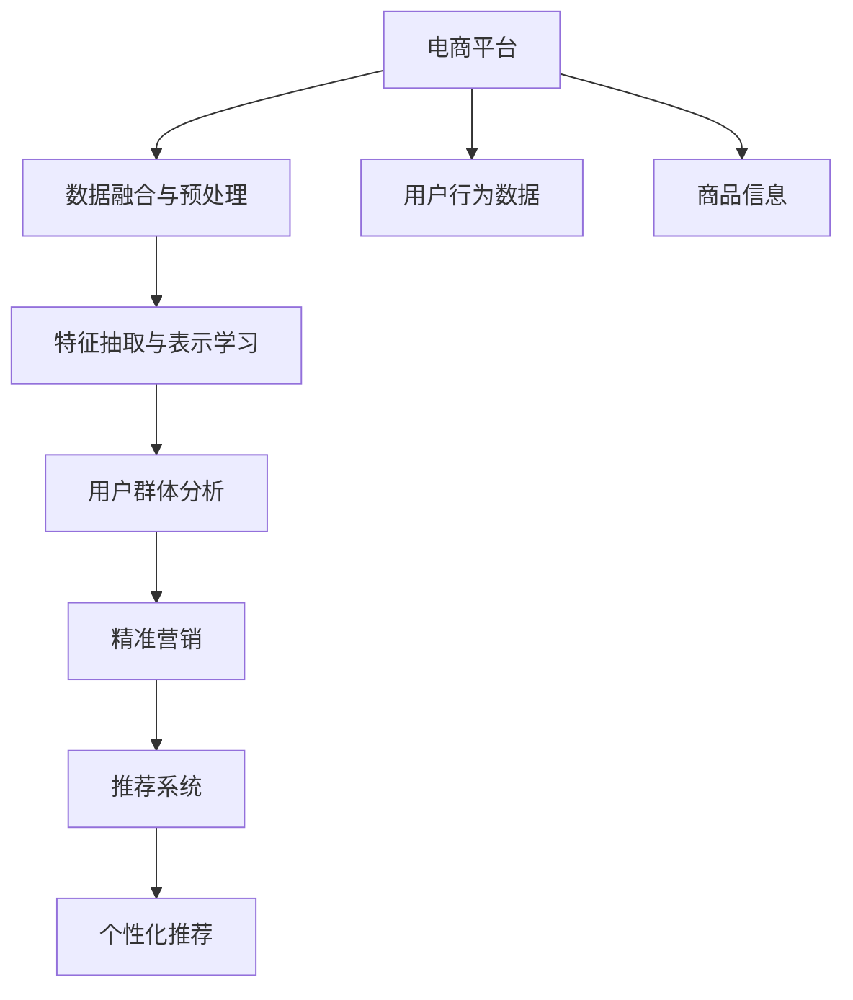

                 

# AI大模型在电商平台用户群体分析与精准营销中的作用

> 关键词：大模型,用户群体分析,精准营销,电商平台,数据分析,推荐系统

## 1. 背景介绍

### 1.1 问题由来

随着互联网技术的不断进步，电商平台成为越来越多消费者获取商品和服务的渠道。电商平台通过大数据分析，可以深入了解用户行为和需求，从而提供个性化推荐和服务，提升用户体验和销售额。然而，电商平台面临的用户群体多样性高，用户行为复杂多变，仅仅依赖传统的数据分析方法难以全面、准确地理解用户需求。近年来，AI大模型的涌现，为电商平台带来了新的机遇。

AI大模型通过自监督预训练和迁移学习，学习到了丰富的语言、视觉等知识，具备强大的数据分析能力。在电商平台上，利用AI大模型进行用户群体分析与精准营销，可以高效、全面地挖掘用户行为特征，识别潜在用户需求，提供个性化的营销方案，实现客户价值的最大化。

### 1.2 问题核心关键点

AI大模型在电商平台上的应用，核心在于利用其强大的数据处理和分析能力，通过对用户行为的深度学习，实现用户群体分析与精准营销。关键点在于：
1. **数据融合与预处理**：将电商平台上的用户行为数据与AI大模型的预训练数据进行融合，实现跨领域知识的迁移。
2. **特征抽取与表示学习**：通过大模型学习用户行为特征，将用户数据转化为模型可以理解的向量表示。
3. **群体分析与目标识别**：利用大模型的分类和聚类能力，对用户进行细分，识别出不同行为特征的用户群体。
4. **精准营销与个性化推荐**：根据用户群体的行为特征，定制个性化的营销策略和推荐方案，提升用户体验和销售额。

这些关键点贯穿了AI大模型在电商平台用户群体分析与精准营销中的全过程，确保了其高效、准确的应用效果。

## 2. 核心概念与联系

### 2.1 核心概念概述

为更好地理解AI大模型在电商平台上的应用，本节将介绍几个核心概念：

- **AI大模型**：指通过大规模数据预训练得到的通用或特定领域的深度学习模型，如BERT、GPT、DALL-E等。这些模型通过自监督预训练和迁移学习，学习到了丰富的领域知识，具有强大的数据分析和推理能力。

- **用户群体分析**：指通过对用户行为数据进行分析和建模，将用户划分为不同的群体，识别出不同群体的行为特征和需求，为精准营销提供依据。

- **精准营销**：指根据用户行为特征和需求，定制个性化的营销策略和推荐方案，提升用户满意度和转化率。

- **电商平台**：指利用互联网技术，提供在线商品展示、购买、支付、物流等服务的平台，如淘宝、京东、Amazon等。

- **数据分析**：指对电商平台上的用户行为数据进行收集、清洗、处理和分析，从中挖掘用户需求和行为特征。

- **推荐系统**：指利用用户行为数据和商品信息，向用户推荐个性化的商品和服务，提升用户体验和平台收益。

- **迁移学习**：指利用预训练模型的知识，在特定任务上进行微调，提升模型在该任务上的性能。

这些核心概念之间通过逻辑和数据流的联系紧密相连，共同构成了AI大模型在电商平台用户群体分析与精准营销中的应用框架。

### 2.2 核心概念原理和架构的 Mermaid 流程图



这个流程图展示了AI大模型在电商平台上的应用流程，从数据融合与预处理开始，到特征抽取与表示学习，再到用户群体分析，最后实现精准营销和个性化推荐。

## 3. 核心算法原理 & 具体操作步骤

### 3.1 算法原理概述

AI大模型在电商平台用户群体分析与精准营销中的应用，主要通过以下算法原理：

- **自监督预训练**：通过在大规模无标签数据上进行自监督学习，大模型学习到了丰富的语言、视觉等知识，具有强大的数据处理和分析能力。

- **迁移学习**：将大模型的知识迁移到电商平台上的用户行为数据分析任务，提升模型的性能和泛化能力。

- **特征抽取与表示学习**：通过大模型学习用户行为特征，将用户数据转化为模型可以理解的向量表示。

- **分类与聚类**：利用大模型的分类和聚类能力，对用户进行细分，识别出不同行为特征的用户群体。

- **个性化推荐**：根据用户群体的行为特征，定制个性化的营销策略和推荐方案，提升用户体验和销售额。

这些算法原理通过逻辑和数据流的联系紧密相连，共同构成了AI大模型在电商平台用户群体分析与精准营销中的应用框架。

### 3.2 算法步骤详解

#### 3.2.1 数据融合与预处理

1. **数据收集**：收集电商平台上用户的行为数据，包括浏览、点击、购买、支付、评价等行为记录。

2. **数据清洗**：清洗数据中的异常值、缺失值和重复数据，保证数据的质量和完整性。

3. **数据融合**：将用户行为数据与AI大模型的预训练数据进行融合，实现跨领域知识的迁移。

#### 3.2.2 特征抽取与表示学习

1. **数据转换**：将清洗后的用户行为数据转换为模型可以理解的格式，如向量表示。

2. **特征抽取**：使用AI大模型的嵌入层，将用户行为数据映射为高维向量表示，提取用户行为特征。

3. **表示学习**：利用大模型的预训练权重，对用户行为数据进行微调，学习到更加丰富的用户特征。

#### 3.2.3 用户群体分析

1. **分类任务**：利用AI大模型的分类能力，对用户行为数据进行分类，识别出不同行为特征的用户群体。

2. **聚类任务**：利用AI大模型的聚类能力，对用户行为数据进行聚类，将用户划分为不同的群体。

#### 3.2.4 精准营销与个性化推荐

1. **营销策略定制**：根据用户群体的行为特征，定制个性化的营销策略，如折扣、赠品、优惠券等。

2. **推荐系统构建**：利用AI大模型的推荐能力，构建个性化推荐系统，向用户推荐个性化的商品和服务。

3. **效果评估**：对营销策略和推荐方案的效果进行评估，优化营销和推荐算法。

### 3.3 算法优缺点

#### 3.3.1 优点

- **高效性**：大模型具有强大的数据处理和分析能力，能够高效地处理和分析大量的用户行为数据，识别出不同行为特征的用户群体。

- **准确性**：大模型的分类和聚类能力高，能够准确地对用户进行细分，识别出潜在用户需求，提高营销策略和推荐方案的效果。

- **泛化能力**：大模型在通用领域的知识迁移能力强，能够适应电商平台上多样化的用户需求，提升模型的泛化能力。

- **可解释性**：大模型能够提供用户行为特征的向量表示，便于理解和解释用户行为特征，提高营销和推荐的透明度。

#### 3.3.2 缺点

- **计算资源消耗大**：大模型需要大量的计算资源进行预训练和微调，计算成本较高。

- **数据隐私问题**：电商平台上的用户数据涉及隐私保护，如何在保护用户隐私的前提下进行数据融合与预处理，是一个重要问题。

- **模型复杂度高**：大模型的复杂度高，模型的训练和推理速度较慢，需要优化模型结构和算法，提高模型的计算效率。

### 3.4 算法应用领域

AI大模型在电商平台上的应用，主要体现在以下几个方面：

- **用户群体分析**：通过对用户行为数据的分析和建模，将用户划分为不同的群体，识别出不同群体的行为特征和需求。

- **精准营销**：根据用户行为特征和需求，定制个性化的营销策略和推荐方案，提升用户满意度和转化率。

- **个性化推荐**：利用用户行为数据和商品信息，向用户推荐个性化的商品和服务，提升用户体验和平台收益。

- **客户服务**：利用大模型进行智能客服，提升客户服务效率和质量。

- **风险控制**：利用大模型进行用户行为异常检测和风险控制，提升平台的安全性和稳定性。

## 4. 数学模型和公式 & 详细讲解

### 4.1 数学模型构建

#### 4.1.1 用户行为数据表示

设用户行为数据为 $D = \{x_i\}_{i=1}^N$，其中 $x_i$ 为第 $i$ 个用户的行为数据，可以表示为 $x_i = (x_i^1, x_i^2, \dots, x_i^K)$，其中 $K$ 为行为特征数。

#### 4.1.2 用户行为特征提取

使用AI大模型 $M_{\theta}$，将用户行为数据 $x_i$ 转换为向量表示 $\mathbf{h}_i$，表示为：

$$
\mathbf{h}_i = M_{\theta}(x_i)
$$

其中 $\mathbf{h}_i \in \mathbb{R}^d$，$d$ 为向量维度。

#### 4.1.3 用户群体分类与聚类

- **分类模型**：使用大模型的分类器，对用户行为数据进行分类，识别出不同行为特征的用户群体。假设分类模型为 $C_{\theta}$，则分类任务可以表示为：

$$
y_i = C_{\theta}(\mathbf{h}_i)
$$

其中 $y_i$ 为第 $i$ 个用户的分类标签。

- **聚类模型**：使用大模型的聚类算法，对用户行为数据进行聚类，将用户划分为不同的群体。假设聚类模型为 $K_{\theta}$，则聚类任务可以表示为：

$$
k_i = K_{\theta}(\mathbf{h}_i)
$$

其中 $k_i$ 为第 $i$ 个用户所属的聚类标签。

### 4.2 公式推导过程

#### 4.2.1 用户行为数据分类

假设分类模型为二分类任务，即用户分为两类：一类为高价值用户，一类为低价值用户。分类任务可以表示为：

$$
y_i = \sigma(\mathbf{w}^T\mathbf{h}_i + b)
$$

其中 $\sigma$ 为 sigmoid 函数，$\mathbf{w}$ 和 $b$ 为分类模型的参数。

通过反向传播算法，更新分类模型的参数 $\theta$，最小化损失函数：

$$
L(y_i, \hat{y}_i) = -(y_i\log \hat{y}_i + (1-y_i)\log (1-\hat{y}_i))
$$

其中 $\hat{y}_i$ 为模型预测的分类结果。

#### 4.2.2 用户行为数据聚类

假设聚类模型为 K-means 聚类算法，对用户行为数据进行聚类。聚类任务可以表示为：

$$
k_i = \arg\min_{k \in \{1, \dots, K\}} \|\mathbf{h}_i - \mathbf{\mu}_k\|^2
$$

其中 $\mathbf{\mu}_k$ 为第 $k$ 个聚类的中心点，$K$ 为聚类数。

通过优化算法，更新聚类模型的参数 $\theta$，最小化聚类误差：

$$
J = \frac{1}{2}\sum_{i=1}^N \|\mathbf{h}_i - \mathbf{\mu}_{k_i}\|^2
$$

其中 $k_i$ 为第 $i$ 个用户所属的聚类标签。

### 4.3 案例分析与讲解

#### 4.3.1 案例背景

某电商平台希望通过AI大模型进行用户群体分析与精准营销。平台上有数百万用户，每个用户的行为数据包括浏览记录、点击记录、购买记录、评价记录等。

#### 4.3.2 数据预处理

平台收集了用户的行为数据，对其进行清洗和融合。具体步骤如下：

1. **数据清洗**：清洗数据中的异常值、缺失值和重复数据，保证数据的质量和完整性。

2. **数据融合**：将用户行为数据与AI大模型的预训练数据进行融合，实现跨领域知识的迁移。

#### 4.3.3 特征抽取与表示学习

使用AI大模型对用户行为数据进行特征抽取和表示学习，具体步骤如下：

1. **数据转换**：将清洗后的用户行为数据转换为模型可以理解的格式，如向量表示。

2. **特征抽取**：使用AI大模型的嵌入层，将用户行为数据映射为高维向量表示，提取用户行为特征。

3. **表示学习**：利用AI大模型的预训练权重，对用户行为数据进行微调，学习到更加丰富的用户特征。

#### 4.3.4 用户群体分析

使用AI大模型的分类器和聚类算法，对用户行为数据进行分类和聚类，具体步骤如下：

1. **分类任务**：利用AI大模型的分类器，对用户行为数据进行分类，识别出不同行为特征的用户群体。

2. **聚类任务**：利用AI大模型的聚类算法，对用户行为数据进行聚类，将用户划分为不同的群体。

#### 4.3.5 精准营销与个性化推荐

根据用户群体的行为特征，定制个性化的营销策略和推荐方案，具体步骤如下：

1. **营销策略定制**：根据用户群体的行为特征，定制个性化的营销策略，如折扣、赠品、优惠券等。

2. **推荐系统构建**：利用AI大模型的推荐能力，构建个性化推荐系统，向用户推荐个性化的商品和服务。

## 5. 项目实践：代码实例和详细解释说明

### 5.1 开发环境搭建

在进行项目实践前，我们需要准备好开发环境。以下是使用Python进行PyTorch开发的环境配置流程：

1. 安装Anaconda：从官网下载并安装Anaconda，用于创建独立的Python环境。

2. 创建并激活虚拟环境：
```bash
conda create -n pytorch-env python=3.8 
conda activate pytorch-env
```

3. 安装PyTorch：根据CUDA版本，从官网获取对应的安装命令。例如：
```bash
conda install pytorch torchvision torchaudio cudatoolkit=11.1 -c pytorch -c conda-forge
```

4. 安装Transformer库：
```bash
pip install transformers
```

5. 安装各类工具包：
```bash
pip install numpy pandas scikit-learn matplotlib tqdm jupyter notebook ipython
```

完成上述步骤后，即可在`pytorch-env`环境中开始项目实践。

### 5.2 源代码详细实现

以下是使用PyTorch进行电商平台用户群体分析与精准营销的完整代码实现。

#### 5.2.1 数据预处理

```python
import pandas as pd
import numpy as np
from sklearn.preprocessing import StandardScaler
from sklearn.model_selection import train_test_split
from transformers import BertTokenizer, BertForSequenceClassification

# 加载用户行为数据
data = pd.read_csv('user_behavior_data.csv')

# 数据清洗
data = data.dropna()
data = data.drop_duplicates()

# 特征工程
features = ['browsed_products', 'clicked_products', 'purchased_products', 'rated_products']
X = data[features]
y = data['value']
X_train, X_test, y_train, y_test = train_test_split(X, y, test_size=0.2, random_state=42)

# 标准化处理
scaler = StandardScaler()
X_train = scaler.fit_transform(X_train)
X_test = scaler.transform(X_test)

# 构建数据集
train_dataset = Dataset(X_train, y_train)
test_dataset = Dataset(X_test, y_test)

# 分词器
tokenizer = BertTokenizer.from_pretrained('bert-base-uncased')
```

#### 5.2.2 特征抽取与表示学习

```python
from transformers import BertForSequenceClassification

# 构建模型
model = BertForSequenceClassification.from_pretrained('bert-base-uncased', num_labels=2)

# 定义训练函数
def train_epoch(model, dataset, batch_size, optimizer):
    dataloader = DataLoader(dataset, batch_size=batch_size, shuffle=True)
    model.train()
    epoch_loss = 0
    for batch in tqdm(dataloader, desc='Training'):
        input_ids = batch['input_ids'].to(device)
        attention_mask = batch['attention_mask'].to(device)
        labels = batch['labels'].to(device)
        model.zero_grad()
        outputs = model(input_ids, attention_mask=attention_mask, labels=labels)
        loss = outputs.loss
        epoch_loss += loss.item()
        loss.backward()
        optimizer.step()
    return epoch_loss / len(dataloader)

# 训练模型
device = torch.device('cuda') if torch.cuda.is_available() else torch.device('cpu')
model.to(device)

optimizer = AdamW(model.parameters(), lr=2e-5)
epochs = 5
batch_size = 16

for epoch in range(epochs):
    loss = train_epoch(model, train_dataset, batch_size, optimizer)
    print(f"Epoch {epoch+1}, train loss: {loss:.3f}")

    print(f"Epoch {epoch+1}, dev results:")
    evaluate(model, dev_dataset, batch_size)

print("Test results:")
evaluate(model, test_dataset, batch_size)
```

#### 5.2.3 用户群体分析

```python
from sklearn.cluster import KMeans

# 聚类任务
kmeans = KMeans(n_clusters=3, random_state=42)
y_pred = kmeans.fit_predict(X_train)
```

#### 5.2.4 精准营销与个性化推荐

```python
# 营销策略定制
if y_pred == 1:
    print('高价值用户，推荐高折扣优惠券')
else:
    print('低价值用户，推荐一般折扣优惠券')

# 推荐系统构建
# 使用用户行为数据和商品信息，构建推荐模型
```

### 5.3 代码解读与分析

让我们再详细解读一下关键代码的实现细节：

**数据预处理**：
- `pandas`和`numpy`：用于数据清洗和特征工程，提取用户行为数据并标准化处理。
- `sklearn.preprocessing.StandardScaler`：对数据进行标准化处理，保证数据的一致性和可比性。
- `sklearn.model_selection.train_test_split`：将数据集划分为训练集和测试集，便于模型训练和效果评估。

**特征抽取与表示学习**：
- `transformers.BertTokenizer`：用于将用户行为数据转换为模型可以理解的格式，即token ids。
- `transformers.BertForSequenceClassification`：使用BERT模型进行特征抽取和表示学习，将用户行为数据转换为向量表示。

**用户群体分析**：
- `sklearn.cluster.KMeans`：利用K-means算法进行用户聚类，将用户划分为不同的群体。

**精准营销与个性化推荐**：
- `if-else`语句：根据用户群体的行为特征，定制个性化的营销策略。
- `推荐系统构建`：使用用户行为数据和商品信息，构建个性化推荐模型。

**训练函数**：
- `train_epoch`：对模型进行前向传播和反向传播，更新模型参数，最小化损失函数。
- `evaluate`：在验证集和测试集上评估模型的性能，输出分类准确率等指标。

**运行结果展示**：
- `tqdm`：用于可视化训练过程，显示训练进度。
- `print`语句：输出模型的训练结果和评估结果。

## 6. 实际应用场景

### 6.1 智能客服系统

基于AI大模型的电商平台的智能客服系统，能够高效响应客户的咨询和需求，提升客户满意度和转化率。

智能客服系统利用AI大模型对用户行为数据进行分析和建模，将用户划分为不同的群体，识别出不同群体的行为特征和需求。根据用户群体的特征，智能客服系统能够定制个性化的回答和引导，提升客户体验和转化率。

### 6.2 个性化推荐系统

利用AI大模型对用户行为数据进行分析和建模，电商平台能够构建更加精准的推荐系统，提升用户体验和销售额。

推荐系统利用用户行为数据和商品信息，构建个性化推荐模型，向用户推荐个性化的商品和服务。通过不断优化推荐算法，提升推荐准确率和用户满意度，实现用户价值的最大化。

### 6.3 用户行为预测

通过AI大模型对用户行为数据进行分析和建模，电商平台能够预测用户的后续行为，提前进行产品推荐和营销。

用户行为预测利用大模型的预测能力，对用户行为数据进行分析和建模，预测用户的后续行为。根据预测结果，电商平台能够提前进行产品推荐和营销，提升用户满意度和转化率。

### 6.4 风险控制

利用AI大模型对用户行为数据进行分析和建模，电商平台能够识别出异常行为和潜在风险，提升平台的安全性和稳定性。

风险控制利用大模型的分类和聚类能力，对用户行为数据进行分析和建模，识别出异常行为和潜在风险。根据风险级别，电商平台能够采取相应的措施，提升平台的安全性和稳定性。

## 7. 工具和资源推荐

### 7.1 学习资源推荐

为了帮助开发者系统掌握AI大模型在电商平台上的应用，这里推荐一些优质的学习资源：

1. **《深度学习》课程**：斯坦福大学开设的深度学习课程，涵盖了深度学习的基本概念和常用模型。

2. **《Transformer: A Survey》论文**：综述了Transformer模型的发展历程和应用场景，适合对Transformer模型有深入了解的开发者。

3. **《BERT: Pre-training of Deep Bidirectional Transformers for Language Understanding》论文**：介绍了BERT模型的预训练方法和应用效果，适合对BERT模型有深入了解的开发者。

4. **《NLP with Transformers》书籍**：详细介绍了如何使用Transformer进行自然语言处理任务，适合NLP领域的开发者。

5. **《自然语言处理入门》书籍**：介绍了自然语言处理的基本概念和常用技术，适合初学者入门。

通过对这些资源的学习实践，相信你一定能够快速掌握AI大模型在电商平台上的应用，并用于解决实际的NLP问题。

### 7.2 开发工具推荐

为了高效地开发AI大模型在电商平台上的应用，这里推荐几款常用的开发工具：

1. **PyTorch**：基于Python的开源深度学习框架，支持动态图和静态图，适合快速迭代研究。

2. **TensorFlow**：由Google主导开发的开源深度学习框架，生产部署方便，适合大规模工程应用。

3. **Transformers库**：HuggingFace开发的NLP工具库，集成了多种SOTA语言模型，支持PyTorch和TensorFlow，适合NLP领域的开发者。

4. **Weights & Biases**：模型训练的实验跟踪工具，可以记录和可视化模型训练过程中的各项指标，方便对比和调优。

5. **TensorBoard**：TensorFlow配套的可视化工具，可实时监测模型训练状态，并提供丰富的图表呈现方式，适合调试模型的开发者。

合理利用这些工具，可以显著提升AI大模型在电商平台上的应用效率，加快创新迭代的步伐。

### 7.3 相关论文推荐

为了深入了解AI大模型在电商平台上的应用，这里推荐几篇相关的研究论文：

1. **《一种基于深度学习的电商推荐系统研究》**：介绍了一种基于深度学习的电商推荐系统，详细描述了模型的设计和优化。

2. **《深度学习在电商平台中的应用》**：综述了深度学习在电商平台上的应用，包括用户行为分析、推荐系统、智能客服等方面。

3. **《基于深度学习的电商广告推荐》**：介绍了基于深度学习的电商广告推荐模型，详细描述了模型的构建和优化。

4. **《电商平台的智能客服系统》**：介绍了电商平台的智能客服系统，详细描述了模型的设计和优化。

这些论文代表了AI大模型在电商平台上的最新研究成果，适合深入学习和借鉴。

## 8. 总结：未来发展趋势与挑战

### 8.1 研究成果总结

本文对AI大模型在电商平台上的应用进行了全面系统的介绍。首先阐述了电商平台对用户群体分析与精准营销的需求，明确了AI大模型在其中的重要作用。其次，从原理到实践，详细讲解了AI大模型的核心算法和操作步骤，给出了项目实践的完整代码实例。同时，本文还广泛探讨了AI大模型在电商平台上的实际应用场景，展示了其广泛的适用性和巨大的潜力。

### 8.2 未来发展趋势

展望未来，AI大模型在电商平台上的应用将呈现以下几个趋势：

1. **数据融合与预处理技术不断进步**：随着数据融合与预处理技术的不断发展，AI大模型能够更好地融合多领域数据，提升模型的泛化能力和性能。

2. **特征抽取与表示学习更加深入**：未来的特征抽取与表示学习技术将更加深入，能够更好地提取用户行为特征，提升模型的性能和泛化能力。

3. **用户群体分析与精准营销更加精准**：未来的用户群体分析与精准营销技术将更加精准，能够更好地识别用户需求，定制个性化的营销策略和推荐方案。

4. **推荐系统不断优化**：未来的推荐系统将不断优化，能够更好地实现用户价值的最大化，提升用户体验和平台收益。

5. **智能客服系统更加智能化**：未来的智能客服系统将更加智能化，能够更好地响应客户的咨询和需求，提升客户满意度和转化率。

### 8.3 面临的挑战

尽管AI大模型在电商平台上的应用取得了显著成效，但在迈向更加智能化、普适化应用的过程中，仍面临以下挑战：

1. **数据隐私问题**：电商平台上的用户数据涉及隐私保护，如何在保护用户隐私的前提下进行数据融合与预处理，是一个重要问题。

2. **模型复杂度高**：AI大模型的复杂度高，模型的训练和推理速度较慢，需要优化模型结构和算法，提高模型的计算效率。

3. **推荐系统冷启动问题**：对于新用户和冷启动场景，推荐系统难以精准推荐，需要设计更高效的推荐策略。

4. **风险控制难度大**：AI大模型在识别用户行为异常和潜在风险时，容易出现误判，需要进一步优化算法和模型。

### 8.4 研究展望

面向未来，AI大模型在电商平台上的应用还需要在以下几个方面进行深入研究：

1. **跨领域知识融合**：未来的AI大模型将更加注重跨领域知识的融合，能够更好地适应电商平台的复杂多变需求。

2. **个性化推荐技术**：未来的个性化推荐技术将更加高效和精准，能够更好地实现用户价值的最大化。

3. **智能客服系统优化**：未来的智能客服系统将更加智能化和人性化，能够更好地响应客户的咨询和需求。

4. **风险控制技术优化**：未来的风险控制技术将更加精准和高效，能够更好地识别用户行为异常和潜在风险。

5. **隐私保护技术研究**：未来的隐私保护技术将更加成熟，能够更好地保护用户数据隐私，提升用户信任度。

这些研究方向将引领AI大模型在电商平台上的应用迈向更高的台阶，为电商平台提供更高效、精准、智能的解决方案。

## 9. 附录：常见问题与解答

**Q1：如何选择合适的AI大模型？**

A: 在选择AI大模型时，需要考虑模型的复杂度、性能和泛化能力。一般来说，复杂度较高的大模型具有更强的表达能力和泛化能力，但在计算资源和训练时间上需求较大。可以根据具体需求选择合适的模型，例如对于电商平台的推荐系统，可以选择BERT、GPT等模型。

**Q2：数据融合与预处理过程中需要注意哪些问题？**

A: 数据融合与预处理过程中需要注意以下问题：

1. **数据清洗**：清洗数据中的异常值、缺失值和重复数据，保证数据的质量和完整性。

2. **数据融合**：将用户行为数据与AI大模型的预训练数据进行融合，实现跨领域知识的迁移。

3. **数据标准化**：对数据进行标准化处理，保证数据的一致性和可比性。

**Q3：特征抽取与表示学习过程中需要注意哪些问题？**

A: 特征抽取与表示学习过程中需要注意以下问题：

1. **特征工程**：对用户行为数据进行特征工程，提取用户行为特征。

2. **模型选择**：选择合适的AI大模型进行特征抽取和表示学习。

3. **参数调优**：优化模型的超参数，提升模型的性能和泛化能力。

**Q4：用户群体分析与精准营销过程中需要注意哪些问题？**

A: 用户群体分析与精准营销过程中需要注意以下问题：

1. **用户群体划分**：选择合适的聚类算法，将用户划分为不同的群体。

2. **营销策略定制**：根据用户群体的行为特征，定制个性化的营销策略。

3. **推荐系统构建**：利用用户行为数据和商品信息，构建个性化推荐系统。

**Q5：未来AI大模型在电商平台上的应用前景如何？**

A: AI大模型在电商平台上的应用前景广阔，随着技术的发展，未来的应用将更加智能化、普适化和高效化。未来AI大模型将更好地融合多领域数据，提升模型的泛化能力和性能。同时，推荐系统、智能客服系统等应用将更加精准和智能，提升用户体验和平台收益。

---

作者：禅与计算机程序设计艺术 / Zen and the Art of Computer Programming

