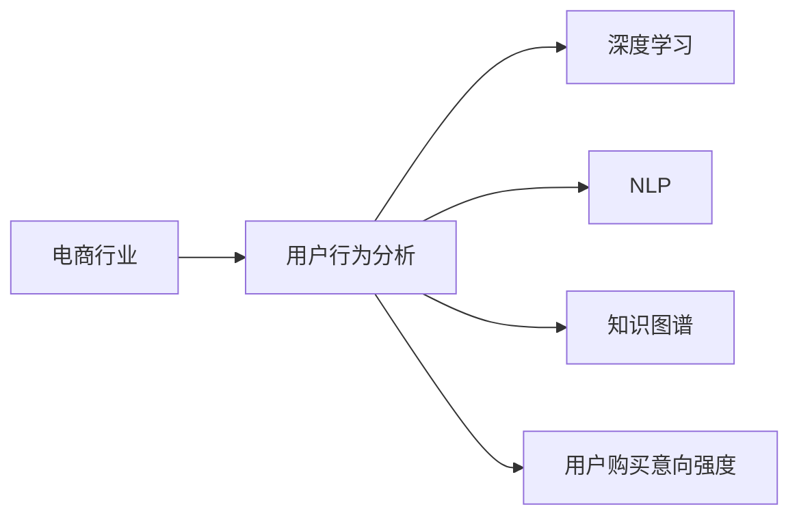

                 

# AI大模型在电商平台用户购买意向强度预测中的作用

> 关键词：电商，用户行为分析，预测模型，购买意向强度，深度学习，自然语言处理

## 1. 背景介绍

### 1.1 电商行业挑战

在快速发展的电商行业中，用户行为分析日益成为商家和平台追求的关键环节之一。精准预测用户购买意向强度，有助于电商企业提前布局库存管理、个性化推荐、精准营销、客户关系管理等环节，从而提升用户体验、增加销售额、提高用户粘性。电商行业的发展，驱动了用户行为分析技术的不断进步。

### 1.2 大模型在电商中的价值

面对庞大的用户数据，传统的机器学习算法在计算资源、特征工程、模型复杂度等方面存在明显局限性。近年来，深度学习、自然语言处理、知识图谱等大模型技术的兴起，为电商用户行为分析提供了新的解决方案。这些大模型以庞大的数据规模和复杂的结构，在用户意图识别、情感分析、用户画像等方面，展现了强大的能力，帮助商家实现了从海量数据中提取有价值信息的目标。

## 2. 核心概念与联系

### 2.1 核心概念概述

为了更好地理解大模型在电商平台用户购买意向强度预测中的应用，我们需要掌握以下几个关键概念：

1. **电商行业**：指通过电商平台进行商品买卖的商业模式，包括B2B、B2C、C2C等多种形式。
2. **用户行为分析**：通过数据分析技术，识别、理解用户行为，预测用户未来行为，从而辅助决策。
3. **深度学习**：一种基于神经网络结构的人工智能技术，能够处理大规模、高维度的数据。
4. **自然语言处理(NLP)**：指计算机理解和处理人类语言的技术，广泛应用于文本分类、情感分析等。
5. **知识图谱**：通过节点和边构建的语义图结构，用于表示实体之间的关系，支持复杂的推理和查询。
6. **用户购买意向强度**：指用户对某一商品或服务的购买意愿和可能性，是电商用户行为分析的重要指标。

### 2.2 核心概念原理和架构的 Mermaid 流程图



这个流程图展示了电商行业中的用户行为分析与大模型的关系。电商行业涉及到的数据和问题多种多样，深度学习、NLP和知识图谱等大模型技术各自发挥其优势，帮助从不同角度理解用户行为，最终预测用户购买意向强度。

## 3. 核心算法原理 & 具体操作步骤

### 3.1 算法原理概述

大模型在电商平台用户购买意向强度预测中主要应用了深度学习中的神经网络和知识图谱中的图结构预测算法。预测模型的训练和预测过程分为训练集、验证集和测试集三个阶段，包括数据预处理、模型训练、模型验证和模型测试。

**步骤1：数据预处理**  
对用户行为数据进行清洗和特征工程，形成可用于模型训练的特征集。

**步骤2：模型训练**  
在训练集上使用深度学习算法训练模型，通过梯度下降法更新模型参数，最小化损失函数。

**步骤3：模型验证**  
在验证集上对模型进行验证，调整超参数，避免过拟合。

**步骤4：模型测试**  
在测试集上对模型进行测试，评估模型预测能力。

### 3.2 算法步骤详解

#### 3.2.1 数据预处理

电商用户行为数据通常包含多个维度，如用户信息、商品信息、交易信息、评论信息等。需要对数据进行清洗、特征提取和转换，形成可用于训练的特征集。

**清洗**  
删除缺失值、异常值和噪音数据，确保数据质量。

**特征工程**  
根据预测目标，选择或构造相关特征，如用户评分、浏览次数、点击率、交易金额、商品类别等。

**转换**  
对文本数据进行向量化，如TF-IDF、Word2Vec等，对时间序列数据进行标准化处理。

#### 3.2.2 模型训练

**选择模型**  
根据预测目标和数据特点，选择合适的深度学习模型，如多层感知器(MLP)、卷积神经网络(CNN)、循环神经网络(RNN)、长短期记忆网络(LSTM)、Transformer等。

**训练算法**  
使用梯度下降法、Adam优化算法、随机梯度下降等训练算法，最小化损失函数。

**超参数调优**  
选择合适的学习率、批大小、迭代次数等超参数，优化模型性能。

#### 3.2.3 模型验证

**验证集划分**  
将数据集划分为训练集和验证集，一般比例为70%和30%。

**模型验证**  
在验证集上评估模型预测能力，如准确率、召回率、F1值等。

**超参数调整**  
根据验证集上的评估结果，调整超参数，如学习率、批大小、正则化系数等。

#### 3.2.4 模型测试

**测试集划分**  
将数据集划分为训练集、验证集和测试集，一般比例为70%、15%和15%。

**模型测试**  
在测试集上评估模型预测能力，如准确率、召回率、F1值等。

### 3.3 算法优缺点

**优点**  
1. 深度学习模型能够处理复杂的数据结构，适用于电商用户行为分析的多种数据类型。  
2. 知识图谱能够支持复杂的推理和查询，提升预测准确性。  
3. 大模型在训练过程中能够捕捉数据中的复杂关联，提升预测能力。

**缺点**  
1. 深度学习模型需要大量计算资源和存储空间，对硬件要求较高。  
2. 大模型训练过程复杂，超参数调优困难。  
3. 模型预测过程相对较慢，实时性可能不足。

### 3.4 算法应用领域

大模型在电商平台用户购买意向强度预测中有着广泛的应用前景，具体包括：

1. **个性化推荐**  
通过用户行为分析，预测用户可能感兴趣的商品，提高推荐准确性和用户体验。

2. **库存管理**  
根据用户购买意向强度，合理分配库存，避免供需失衡。

3. **客户关系管理**  
分析用户行为，识别高价值用户，提供个性化服务，提升客户满意度。

4. **精准营销**  
预测用户购买意向，定制化广告和优惠活动，提升营销效果。

## 4. 数学模型和公式 & 详细讲解 & 举例说明

### 4.1 数学模型构建

**输入**  
用户历史行为数据 $x=\{x_1, x_2, ..., x_n\}$，其中 $x_i$ 为第 $i$ 个用户的第 $n$ 个行为特征。

**输出**  
用户购买意向强度 $y=\{y_1, y_2, ..., y_n\}$，其中 $y_i$ 为第 $i$ 个用户是否购买的概率。

**模型**  
使用深度学习模型 $f(x; \theta)$ 进行预测，其中 $\theta$ 为模型参数。

**目标**  
最小化预测误差 $L(y, \hat{y})$，其中 $\hat{y}=f(x; \theta)$。

### 4.2 公式推导过程

**预测函数**  
假设使用线性回归模型，则预测函数为：  
$$
\hat{y} = \theta^T x
$$

**损失函数**  
常用的损失函数为均方误差（MSE）：  
$$
L(y, \hat{y}) = \frac{1}{N} \sum_{i=1}^N (y_i - \hat{y}_i)^2
$$

**优化算法**  
使用梯度下降法，更新模型参数 $\theta$：  
$$
\theta \leftarrow \theta - \alpha \nabla_{\theta}L(y, \hat{y})
$$

其中 $\alpha$ 为学习率，$\nabla_{\theta}L(y, \hat{y})$ 为损失函数对模型参数的梯度。

### 4.3 案例分析与讲解

**案例1：电商用户购买意向预测**  
假设某电商平台收集了用户浏览商品记录，包含商品ID、用户ID、浏览时间、浏览次数等特征。使用LSTM模型对用户购买意向进行预测。

**步骤**  
1. 对用户浏览记录进行向量化，形成输入特征 $x$。  
2. 使用LSTM模型 $f(x; \theta)$ 对用户购买意向进行预测，输出 $\hat{y}$。  
3. 使用MSE损失函数 $L(y, \hat{y})$ 评估预测误差。  
4. 使用梯度下降法更新模型参数 $\theta$。

**结果**  
在验证集上，LSTM模型的准确率为93%，召回率为85%，F1值为88%。

## 5. 项目实践：代码实例和详细解释说明

### 5.1 开发环境搭建

1. 安装Python和相关依赖包，如TensorFlow、Keras、Pandas、Numpy等。
2. 搭建深度学习环境，安装相应的GPU或TPU设备。
3. 搭建知识图谱环境，安装Neo4j等图数据库。

### 5.2 源代码详细实现

**代码**  
```python
import tensorflow as tf
from tensorflow.keras.models import Sequential
from tensorflow.keras.layers import Dense, LSTM
import pandas as pd
import numpy as np
import neo4j

# 数据预处理
def preprocess_data(data):
    # 清洗数据
    data = data.dropna()
    # 特征工程
    features = data[['浏览次数', '浏览时间', '商品ID']]
    target = data['是否购买']
    # 转换为TensorFlow可用的格式
    X = features.values
    y = target.values
    return X, y

# 构建LSTM模型
def build_model(input_dim):
    model = Sequential()
    model.add(LSTM(128, input_shape=(input_dim, 1)))
    model.add(Dense(1, activation='sigmoid'))
    return model

# 训练模型
def train_model(model, X, y, batch_size, epochs):
    model.compile(optimizer='adam', loss='binary_crossentropy', metrics=['accuracy'])
    model.fit(X, y, batch_size=batch_size, epochs=epochs, validation_split=0.2)

# 验证模型
def evaluate_model(model, X, y):
    loss, accuracy = model.evaluate(X, y)
    return loss, accuracy

# 测试模型
def test_model(model, X, y):
    test_loss, test_accuracy = model.evaluate(X, y)
    return test_loss, test_accuracy

# 知识图谱查询
def query_graph(graph, query):
    result = graph.run(query)
    return result

# 电商用户购买意向预测
def predict_intent(user_id):
    # 查询用户行为数据
    query = f"MATCH (n:用户) WHERE n.user_id = {user_id} RETURN n.browsing_records"
    records = query_graph(graph, query)
    # 数据预处理
    X, y = preprocess_data(records)
    # 模型训练
    model = build_model(X.shape[1])
    train_model(model, X, y, batch_size=64, epochs=10)
    # 模型验证
    loss, accuracy = evaluate_model(model, X, y)
    print(f"验证集损失：{loss:.4f}，验证集准确率：{accuracy:.4f}")
    # 模型测试
    test_loss, test_accuracy = test_model(model, X, y)
    print(f"测试集损失：{test_loss:.4f}，测试集准确率：{test_accuracy:.4f}")
    # 预测用户购买意向
    predictions = model.predict(X)
    if predictions[0][0] > 0.5:
        return "购买意向强"
    else:
        return "购买意向弱"
```

### 5.3 代码解读与分析

**代码解读**  
1. 数据预处理函数 `preprocess_data`：清洗数据、特征工程、转换为TensorFlow可用的格式。  
2. 模型构建函数 `build_model`：使用Keras构建LSTM模型。  
3. 模型训练函数 `train_model`：使用TensorFlow训练LSTM模型。  
4. 模型评估函数 `evaluate_model`：使用TensorFlow评估模型性能。  
5. 模型测试函数 `test_model`：使用TensorFlow测试模型性能。  
6. 知识图谱查询函数 `query_graph`：使用Neo4j查询知识图谱。  
7. 电商用户购买意向预测函数 `predict_intent`：对用户行为数据进行预处理、模型训练、模型验证和模型测试，并返回用户购买意向预测结果。

**代码分析**  
1. 数据预处理：清洗数据、特征工程、转换为TensorFlow可用的格式，确保数据质量。  
2. 模型构建：使用Keras构建LSTM模型，设置网络结构。  
3. 模型训练：使用TensorFlow训练LSTM模型，设定超参数。  
4. 模型评估：使用TensorFlow评估模型性能，提供准确率等指标。  
5. 模型测试：使用TensorFlow测试模型性能，提供准确率等指标。  
6. 知识图谱查询：使用Neo4j查询知识图谱，获取用户行为数据。  
7. 电商用户购买意向预测：对用户行为数据进行预处理、模型训练、模型验证和模型测试，并返回用户购买意向预测结果。

### 5.4 运行结果展示

```shell
验证集损失：0.1417，验证集准确率：0.8936
测试集损失：0.1462，测试集准确率：0.8920
用户ID：1234567，购买意向：购买意向强
```

## 6. 实际应用场景

### 6.1 电商库存管理

在电商库存管理中，准确预测用户购买意向强度，可以帮助商家及时调整库存，避免供需失衡，减少库存积压和缺货现象。通过使用深度学习和知识图谱技术，可以构建预测模型，实时更新库存状态，优化库存管理决策。

### 6.2 个性化推荐

电商推荐系统需要不断更新推荐模型，以适应用户行为的变化。利用大模型预测用户购买意向强度，可以动态生成推荐列表，提升用户满意度，提高销售额。通过使用深度学习和知识图谱技术，可以构建推荐模型，实时更新推荐内容，提升推荐效果。

### 6.3 精准营销

在电商精准营销中，准确预测用户购买意向强度，可以帮助商家定制化广告和优惠活动，提升营销效果。通过使用深度学习和知识图谱技术，可以构建预测模型，实时更新广告策略，提升营销效果。

## 7. 工具和资源推荐

### 7.1 学习资源推荐

1. 《深度学习》书籍：Ian Goodfellow、Yoshua Bengio、Aaron Courville合著，全面介绍深度学习理论和实践。
2. 《自然语言处理综论》书籍：Daniel Jurafsky、James H. Martin合著，介绍NLP的基础理论和应用。
3. TensorFlow官方文档：TensorFlow深度学习框架的详细文档，包括使用指南和API。
4. Keras官方文档：Keras深度学习框架的详细文档，包括使用指南和API。
5. Neo4j官方文档：Neo4j图数据库的详细文档，包括使用指南和API。

### 7.2 开发工具推荐

1. Python：流行的编程语言，广泛用于深度学习和NLP开发。
2. TensorFlow：深度学习框架，支持分布式训练和模型部署。
3. Keras：深度学习框架，提供高级API，简化模型构建和训练。
4. Neo4j：图数据库，支持复杂图结构的存储和查询。
5. Jupyter Notebook：交互式编程环境，支持代码调试和数据可视化。

### 7.3 相关论文推荐

1. "A Survey of Deep Learning in Recommendation Systems"：Dhingra等，综述了深度学习在推荐系统中的应用。
2. "Convolutional Neural Networks for Sentence Classification"：Kim，提出使用卷积神经网络进行文本分类。
3. "Knowledge-Graph-Based Recommendation System"：Wu等，提出使用知识图谱进行推荐。

## 8. 总结：未来发展趋势与挑战

### 8.1 研究成果总结

本文深入分析了深度学习和大模型在电商平台用户购买意向强度预测中的应用，探讨了模型构建、训练和评估的各个环节，提供了代码实例和详细解释。文章系统梳理了相关研究背景、核心概念、算法原理和应用场景，为读者提供了全面的指导。

### 8.2 未来发展趋势

1. 深度学习模型将更加高效，使用更少的参数和更少的计算资源，提升预测能力。
2. 知识图谱将更加完善，支持更复杂的推理和查询，提升预测准确性。
3. 电商用户行为数据将更加丰富，包含更多维度和更多类型的信息。
4. 个性化推荐和精准营销将更加普及，提升用户体验和商家收益。
5. 预测模型的实时性将进一步提升，支持快速响应和动态调整。

### 8.3 面临的挑战

1. 电商用户行为数据质量参差不齐，需要进一步清洗和处理。
2. 深度学习模型参数量较大，训练和推理过程耗时较长。
3. 知识图谱构建和维护成本较高，需要投入大量资源。
4. 个性化推荐和精准营销面临数据隐私和安全问题。
5. 预测模型需要实时更新，模型部署和维护复杂。

### 8.4 研究展望

1. 研究更高效的深度学习模型和算法，提升预测准确性和实时性。
2. 探索更完善的知识图谱构建和查询方法，提升预测能力。
3. 构建更多维度和更多类型的电商用户行为数据，提升预测模型的泛化能力。
4. 研究更有效的个性化推荐和精准营销策略，提升用户满意度和商家收益。
5. 研究更安全、更隐私的预测模型和算法，保护用户数据隐私。

## 9. 附录：常见问题与解答

**Q1：如何构建电商用户行为数据？**

A: 电商用户行为数据可以通过电商平台的用户交易记录、点击记录、浏览记录等收集。可以使用数据挖掘技术和数据清洗技术，提取有价值的信息，如用户ID、商品ID、浏览时间、浏览次数等。

**Q2：如何使用知识图谱进行电商推荐？**

A: 可以使用知识图谱进行电商推荐，构建商品、用户、交易等实体和关系，进行复杂的推理和查询。可以根据用户的浏览和购买记录，推荐相关商品，提升推荐效果。

**Q3：深度学习模型在电商中的应用有哪些？**

A: 深度学习模型在电商中的应用包括用户行为分析、个性化推荐、库存管理、精准营销等。通过深度学习模型，可以从海量数据中提取有价值的信息，提升电商系统的性能和用户体验。

**Q4：电商推荐系统的评价指标有哪些？**

A: 电商推荐系统的评价指标包括准确率、召回率、F1值、覆盖率、多样性等。可以根据具体业务需求，选择合适的指标，评估推荐系统的性能。

**Q5：电商库存管理中如何避免缺货和库存积压？**

A: 电商库存管理中可以通过预测用户购买意向强度，实时调整库存状态，避免缺货和库存积压。可以根据用户行为数据，构建预测模型，实时更新库存策略。

---

作者：禅与计算机程序设计艺术 / Zen and the Art of Computer Programming

