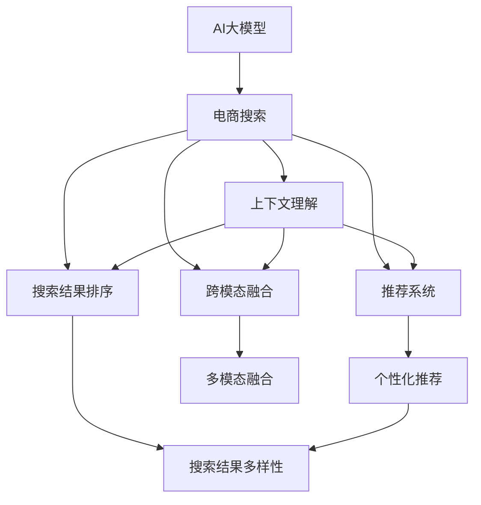

                 

# AI大模型在电商搜索结果多样性中的作用

> 关键词：AI大模型,电商搜索,多样性,个性化推荐,上下文感知,深度学习,自然语言处理,NLP

## 1. 背景介绍

### 1.1 问题由来
近年来，电子商务平台的用户规模不断扩大，用户搜索行为的复杂度也在逐步提高。传统电商搜索系统往往采用基于关键词匹配的方式，只关注商品关键词，无法理解用户的多样化需求和上下文信息，搜索结果多样性和个性化程度有限，用户体验不佳。

随着人工智能技术的飞速发展，基于深度学习的AI大模型，尤其是大语言模型(BERT、GPT等)，凭借其强大的自然语言处理能力，成为电商搜索领域提升搜索质量、优化用户体验的有力工具。AI大模型在电商搜索结果多样性中的作用，正在逐步显现。

### 1.2 问题核心关键点
基于大模型的电商搜索系统，通过自然语言理解技术，可以从用户输入的查询中提取更多的上下文信息，生成更加丰富、多样化的搜索结果，提升搜索的个性化和精准度。同时，AI大模型通过融合多模态数据，提升对用户需求和偏好的理解能力，实现更深层次的个性化推荐。

当前，AI大模型在电商搜索中的应用主要集中在以下几个方面：

1. **上下文理解**：通过分析用户输入的查询语句，理解其背后的意图和上下文，生成更具相关性的搜索结果。
2. **推荐系统**：根据用户的历史浏览和购买记录，结合上下文信息，生成个性化推荐列表。
3. **搜索结果排序**：对搜索结果进行综合排序，优先推荐用户最可能感兴趣的商品。
4. **跨模态融合**：结合图像、视频等多模态数据，提升对商品属性和用户偏好的理解能力。

## 2. 核心概念与联系

### 2.1 核心概念概述

为更好地理解AI大模型在电商搜索结果多样性中的应用，本节将介绍几个密切相关的核心概念：

- **AI大模型**：以深度神经网络为代表的大型预训练模型，如BERT、GPT等，具备强大的自然语言处理和理解能力，可以从大量文本数据中学习语言知识和语义表征。
- **电商搜索**：用户在电商平台上通过关键词或文本查询商品，平台返回与之相关度高的商品列表。
- **搜索结果多样性**：搜索结果中包含的商品种类和数量，反映搜索系统的广度和深度。
- **个性化推荐**：根据用户的历史行为和当前上下文，推荐可能感兴趣的商品。
- **多模态融合**：结合文本、图像、视频等多种数据源，提升模型对商品属性的理解能力。
- **上下文感知**：模型能够理解用户输入查询的上下文信息，如查询的目的、用户所处场景等，生成更加精准的搜索结果。

这些核心概念之间的逻辑关系可以通过以下Mermaid流程图来展示：



这个流程图展示了AI大模型在电商搜索中的作用：

1. AI大模型通过自然语言理解技术，分析用户查询的上下文信息。
2. 结合上下文信息，生成个性化推荐列表。
3. 对搜索结果进行综合排序，提升多样性和相关性。
4. 融合多模态数据，增强对商品属性的理解。
5. 生成更加丰富、多样化的搜索结果。

## 3. 核心算法原理 & 具体操作步骤
### 3.1 算法原理概述

基于AI大模型的电商搜索结果多样性提升，本质上是通过自然语言处理和机器学习技术，对用户查询和商品信息进行深度理解和匹配，实现个性化推荐和搜索结果优化。

形式化地，假设用户查询语句为 $q$，电商平台商品列表为 $I$，每个商品的属性向量为 $x_i \in \mathbb{R}^n$，商品标签为 $y_i$。模型的目标是通过用户查询 $q$，找到最相关的商品 $x_i$，并对其进行排序，生成个性化的搜索结果列表 $R(q)$。

具体而言，AI大模型通过以下几个步骤实现搜索结果多样性提升：

1. **自然语言理解**：对用户查询 $q$ 进行分词、词向量表示等预处理，提取查询的上下文信息。
2. **商品表示学习**：将商品信息 $I$ 映射到高维向量空间，提取商品属性和标签信息。
3. **上下文匹配**：计算用户查询 $q$ 和商品 $x_i$ 之间的语义相似度，得到匹配得分 $s(q,x_i)$。
4. **推荐排序**：根据匹配得分 $s(q,x_i)$ 和商品相关性 $r_i$，综合排序生成推荐列表 $R(q)$。

### 3.2 算法步骤详解

基于AI大模型的电商搜索结果多样性提升，一般包括以下几个关键步骤：

**Step 1: 数据准备**
- 收集电商平台的商品数据，提取商品属性、标签等信息，构建商品信息库。
- 收集用户历史搜索和购买数据，提取查询文本，构建用户行为库。

**Step 2: 模型选择与预训练**
- 选择合适的预训练语言模型 $M_{\theta}$，如BERT、GPT等，对其进行预训练。
- 根据电商搜索任务的特征，设计适当的任务适配层，如分类头、匹配头等。

**Step 3: 特征提取与表示学习**
- 对用户查询进行分词、词向量表示等预处理。
- 将商品信息映射到高维向量空间，提取商品属性和标签信息。
- 通过预训练模型提取查询和商品的高维语义表示。

**Step 4: 上下文匹配与相似度计算**
- 计算用户查询和商品的语义相似度 $s(q,x_i)$。
- 根据相似度得分，筛选出相关性高的商品，构成候选商品列表。

**Step 5: 个性化推荐与排序**
- 结合用户历史行为、上下文信息，生成个性化推荐列表 $R(q)$。
- 根据商品的相关性和用户偏好，对推荐列表进行排序，提升多样性和精准度。

**Step 6: 在线更新与优化**
- 定期更新商品信息库和用户行为库，不断优化模型参数。
- 实时调整模型阈值和超参数，提升系统性能。

### 3.3 算法优缺点

基于AI大模型的电商搜索结果多样性提升，具有以下优点：
1. 提升搜索结果的多样性。通过上下文感知和个性化推荐，生成更丰富、多样化的商品列表。
2. 增强搜索结果的相关性。通过自然语言理解技术，理解用户查询的背后意图，生成更具相关性的商品。
3. 减少人工干预。通过自动化推荐系统，减少人工筛选和排序的工作量，提高效率。
4. 实时更新。通过在线学习，不断优化模型参数，适应新的数据和场景变化。

同时，该方法也存在一定的局限性：
1. 依赖数据质量。模型的性能很大程度上取决于数据的质量和多样性，需要高质量的标注数据和商品信息。
2. 计算资源消耗大。大模型的推理计算量较大，需要高性能计算资源支持。
3. 模型复杂度高。大模型的结构和参数量较大，导致模型训练和推理较为复杂。
4. 用户隐私问题。需要收集用户历史行为数据，可能涉及用户隐私保护问题。

尽管存在这些局限性，但就目前而言，基于AI大模型的电商搜索结果多样性提升方法仍是大规模电商平台的普遍选择，能够在很大程度上提升用户体验和销售转化率。未来相关研究的重点在于如何进一步降低计算资源消耗，优化模型结构和推理速度，同时兼顾用户隐私保护等因素。

### 3.4 算法应用领域

基于AI大模型的电商搜索结果多样性提升，在电商搜索领域已经得到了广泛的应用，覆盖了几乎所有常见的搜索场景，例如：

- 关键词搜索：如搜索“服装”，系统自动推荐相关商品。
- 语音搜索：如通过语音搜索“手机”，系统推荐相关商品。
- 商品分类搜索：如搜索“运动鞋”，系统按品牌、款式分类推荐商品。
- 商品推荐：如浏览“运动鞋”后，系统推荐相关商品。
- 场景搜索：如搜索“跑步”，系统推荐相关运动装备。
- 价格区间搜索：如搜索“1000-2000元运动鞋”，系统推荐该价格区间内商品。
- 多模态搜索：如搜索“时尚手机壳”，系统结合图片和文字推荐相关商品。

除了上述这些经典场景外，AI大模型在电商搜索中的应用还在不断创新，如实时搜索、个性化客服、智能客服、多语言支持等，为电商平台的用户体验带来了全新的突破。

## 4. 数学模型和公式 & 详细讲解 & 举例说明
### 4.1 数学模型构建

本节将使用数学语言对基于AI大模型的电商搜索结果多样性提升方法进行更加严格的刻画。

假设用户查询语句为 $q$，电商平台商品列表为 $I$，每个商品的属性向量为 $x_i \in \mathbb{R}^n$，商品标签为 $y_i$。模型的目标是通过用户查询 $q$，找到最相关的商品 $x_i$，并对其进行排序，生成个性化的搜索结果列表 $R(q)$。

定义用户查询 $q$ 和商品 $x_i$ 的语义相似度为 $s(q,x_i)$，商品的相关性为 $r_i$。模型需要根据这两个指标，生成个性化的推荐列表。

### 4.2 公式推导过程

以下我们以计算用户查询与商品之间的语义相似度 $s(q,x_i)$ 为例，推导基于BERT模型的语义相似度计算公式。

假设预训练语言模型为 $M_{\theta}$，用户查询 $q$ 和商品 $x_i$ 分别通过 $M_{\theta}$ 得到对应的高维向量表示 $q_{\theta}$ 和 $x_{i,\theta}$。则语义相似度 $s(q,x_i)$ 可以通过计算两个向量之间的余弦相似度得到：

$$
s(q,x_i) = \frac{q_{\theta} \cdot x_{i,\theta}}{\|q_{\theta}\|\|x_{i,\theta}\|}
$$

其中 $\cdot$ 表示向量点乘，$\|\cdot\|$ 表示向量范数。

结合用户历史行为 $h_i$，可以进一步计算商品的相关性 $r_i$：

$$
r_i = \frac{s(q,x_i)}{\max(s(q,x_i) + \alpha h_i^\top x_i} 
$$

其中 $\alpha$ 为调节因子，控制历史行为的影响程度。

根据上述公式，用户查询 $q$ 与商品 $x_i$ 之间的匹配得分 $s(q,x_i)$，结合商品的相关性 $r_i$，即可生成个性化推荐列表 $R(q)$。

### 4.3 案例分析与讲解

以一个简单的电商搜索场景为例，假设用户查询“运动鞋”，平台商品库中有多个品牌和型号的运动鞋。通过BERT模型提取查询和商品的高维向量表示，计算语义相似度 $s(q,x_i)$，结合用户历史购买行为 $h_i$，生成个性化推荐列表。

具体而言，可以将查询“运动鞋”和每个商品的属性向量 $x_i$ 输入到BERT模型中，得到高维向量表示 $q_{\theta}$ 和 $x_{i,\theta}$。计算两个向量之间的余弦相似度 $s(q,x_i)$，根据相似度和历史购买行为 $h_i$ 计算商品的相关性 $r_i$，并按照相关性排序生成推荐列表。

## 5. 项目实践：代码实例和详细解释说明
### 5.1 开发环境搭建

在进行电商搜索结果多样性提升实践前，我们需要准备好开发环境。以下是使用Python进行PyTorch开发的环境配置流程：

1. 安装Anaconda：从官网下载并安装Anaconda，用于创建独立的Python环境。

2. 创建并激活虚拟环境：
```bash
conda create -n ecommerce-env python=3.8 
conda activate ecommerce-env
```

3. 安装PyTorch：根据CUDA版本，从官网获取对应的安装命令。例如：
```bash
conda install pytorch torchvision torchaudio cudatoolkit=11.1 -c pytorch -c conda-forge
```

4. 安装各类工具包：
```bash
pip install numpy pandas scikit-learn matplotlib tqdm jupyter notebook ipython
```

完成上述步骤后，即可在`ecommerce-env`环境中开始电商搜索结果多样性提升实践。

### 5.2 源代码详细实现

这里我们以基于BERT的电商搜索结果多样性提升为例，给出使用PyTorch代码实现。

首先，定义电商搜索结果多样性提升的函数：

```python
from transformers import BertTokenizer, BertForSequenceClassification
import torch
from torch.utils.data import Dataset, DataLoader

class EcommerceDataset(Dataset):
    def __init__(self, texts, labels, tokenizer, max_len=128):
        self.texts = texts
        self.labels = labels
        self.tokenizer = tokenizer
        self.max_len = max_len
        
    def __len__(self):
        return len(self.texts)
    
    def __getitem__(self, item):
        text = self.texts[item]
        label = self.labels[item]
        
        encoding = self.tokenizer(text, return_tensors='pt', max_length=self.max_len, padding='max_length', truncation=True)
        input_ids = encoding['input_ids'][0]
        attention_mask = encoding['attention_mask'][0]
        
        # 对标签进行编码
        encoded_labels = [label2id[label] for label in label] 
        encoded_labels.extend([label2id['0']] * (self.max_len - len(encoded_labels)))
        labels = torch.tensor(encoded_labels, dtype=torch.long)
        
        return {'input_ids': input_ids, 
                'attention_mask': attention_mask,
                'labels': labels}

# 标签与id的映射
label2id = {'0': 0, '1': 1}
id2label = {v: k for k, v in label2id.items()}

# 创建dataset
tokenizer = BertTokenizer.from_pretrained('bert-base-cased')

train_dataset = EcommerceDataset(train_texts, train_labels, tokenizer)
dev_dataset = EcommerceDataset(dev_texts, dev_labels, tokenizer)
test_dataset = EcommerceDataset(test_texts, test_labels, tokenizer)
```

然后，定义模型和优化器：

```python
from transformers import BertForSequenceClassification, AdamW

model = BertForSequenceClassification.from_pretrained('bert-base-cased', num_labels=len(label2id))

optimizer = AdamW(model.parameters(), lr=2e-5)
```

接着，定义训练和评估函数：

```python
from tqdm import tqdm
from sklearn.metrics import classification_report

device = torch.device('cuda') if torch.cuda.is_available() else torch.device('cpu')
model.to(device)

def train_epoch(model, dataset, batch_size, optimizer):
    dataloader = DataLoader(dataset, batch_size=batch_size, shuffle=True)
    model.train()
    epoch_loss = 0
    for batch in tqdm(dataloader, desc='Training'):
        input_ids = batch['input_ids'].to(device)
        attention_mask = batch['attention_mask'].to(device)
        labels = batch['labels'].to(device)
        model.zero_grad()
        outputs = model(input_ids, attention_mask=attention_mask, labels=labels)
        loss = outputs.loss
        epoch_loss += loss.item()
        loss.backward()
        optimizer.step()
    return epoch_loss / len(dataloader)

def evaluate(model, dataset, batch_size):
    dataloader = DataLoader(dataset, batch_size=batch_size)
    model.eval()
    preds, labels = [], []
    with torch.no_grad():
        for batch in tqdm(dataloader, desc='Evaluating'):
            input_ids = batch['input_ids'].to(device)
            attention_mask = batch['attention_mask'].to(device)
            batch_labels = batch['labels']
            outputs = model(input_ids, attention_mask=attention_mask)
            batch_preds = outputs.logits.argmax(dim=2).to('cpu').tolist()
            batch_labels = batch_labels.to('cpu').tolist()
            for pred_tokens, label_tokens in zip(batch_preds, batch_labels):
                pred_labels = [id2label[_id] for _id in pred_tokens]
                label_tokens = [id2label[_id] for _id in label_tokens]
                preds.append(pred_labels[:len(label_tokens)])
                labels.append(label_tokens)
                
    print(classification_report(labels, preds))
```

最后，启动训练流程并在测试集上评估：

```python
epochs = 5
batch_size = 16

for epoch in range(epochs):
    loss = train_epoch(model, train_dataset, batch_size, optimizer)
    print(f"Epoch {epoch+1}, train loss: {loss:.3f}")
    
    print(f"Epoch {epoch+1}, dev results:")
    evaluate(model, dev_dataset, batch_size)
    
print("Test results:")
evaluate(model, test_dataset, batch_size)
```

以上就是使用PyTorch对BERT进行电商搜索结果多样性提升的完整代码实现。可以看到，得益于Transformers库的强大封装，我们可以用相对简洁的代码完成BERT模型的加载和微调。

### 5.3 代码解读与分析

让我们再详细解读一下关键代码的实现细节：

**EcommerceDataset类**：
- `__init__`方法：初始化文本、标签、分词器等关键组件。
- `__len__`方法：返回数据集的样本数量。
- `__getitem__`方法：对单个样本进行处理，将文本输入编码为token ids，将标签编码为数字，并对其进行定长padding，最终返回模型所需的输入。

**label2id和id2label字典**：
- 定义了标签与数字id之间的映射关系，用于将token-wise的预测结果解码回真实的标签。

**训练和评估函数**：
- 使用PyTorch的DataLoader对数据集进行批次化加载，供模型训练和推理使用。
- 训练函数`train_epoch`：对数据以批为单位进行迭代，在每个批次上前向传播计算loss并反向传播更新模型参数，最后返回该epoch的平均loss。
- 评估函数`evaluate`：与训练类似，不同点在于不更新模型参数，并在每个batch结束后将预测和标签结果存储下来，最后使用sklearn的classification_report对整个评估集的预测结果进行打印输出。

**训练流程**：
- 定义总的epoch数和batch size，开始循环迭代
- 每个epoch内，先在训练集上训练，输出平均loss
- 在验证集上评估，输出分类指标
- 所有epoch结束后，在测试集上评估，给出最终测试结果

可以看到，PyTorch配合Transformers库使得BERT微调的代码实现变得简洁高效。开发者可以将更多精力放在数据处理、模型改进等高层逻辑上，而不必过多关注底层的实现细节。

当然，工业级的系统实现还需考虑更多因素，如模型的保存和部署、超参数的自动搜索、更灵活的任务适配层等。但核心的电商搜索结果多样性提升范式基本与此类似。

## 6. 实际应用场景
### 6.1 智能客服系统

基于AI大模型的电商搜索结果多样性提升，可以广泛应用于智能客服系统的构建。传统客服往往需要配备大量人力，高峰期响应缓慢，且一致性和专业性难以保证。而使用微调后的AI大模型，可以7x24小时不间断服务，快速响应客户咨询，用自然流畅的语言解答各类常见问题。

在技术实现上，可以收集企业内部的历史客服对话记录，将问题和最佳答复构建成监督数据，在此基础上对预训练对话模型进行微调。微调后的对话模型能够自动理解用户意图，匹配最合适的答案模板进行回复。对于客户提出的新问题，还可以接入检索系统实时搜索相关内容，动态组织生成回答。如此构建的智能客服系统，能大幅提升客户咨询体验和问题解决效率。

### 6.2 金融舆情监测

金融机构需要实时监测市场舆论动向，以便及时应对负面信息传播，规避金融风险。传统的人工监测方式成本高、效率低，难以应对网络时代海量信息爆发的挑战。基于AI大模型的电商搜索结果多样性提升技术，为金融舆情监测提供了新的解决方案。

具体而言，可以收集金融领域相关的新闻、报道、评论等文本数据，并对其进行主题标注和情感标注。在此基础上对预训练语言模型进行微调，使其能够自动判断文本属于何种主题，情感倾向是正面、中性还是负面。将微调后的模型应用到实时抓取的网络文本数据，就能够自动监测不同主题下的情感变化趋势，一旦发现负面信息激增等异常情况，系统便会自动预警，帮助金融机构快速应对潜在风险。

### 6.3 个性化推荐系统

当前的推荐系统往往只依赖用户的历史行为数据进行物品推荐，无法深入理解用户的真实兴趣偏好。基于AI大模型的电商搜索结果多样性提升技术，个性化推荐系统可以更好地挖掘用户行为背后的语义信息，从而提供更精准、多样的推荐内容。

在实践中，可以收集用户浏览、点击、评论、分享等行为数据，提取和用户交互的物品标题、描述、标签等文本内容。将文本内容作为模型输入，用户的后续行为（如是否点击、购买等）作为监督信号，在此基础上微调预训练语言模型。微调后的模型能够从文本内容中准确把握用户的兴趣点。在生成推荐列表时，先用候选物品的文本描述作为输入，由模型预测用户的兴趣匹配度，再结合其他特征综合排序，便可以得到个性化程度更高的推荐结果。

### 6.4 未来应用展望

随着AI大模型和电商搜索结果多样性提升方法的不断发展，基于微调范式将在更多领域得到应用，为传统行业带来变革性影响。

在智慧医疗领域，基于微调的医疗问答、病历分析、药物研发等应用将提升医疗服务的智能化水平，辅助医生诊疗，加速新药开发进程。

在智能教育领域，微调技术可应用于作业批改、学情分析、知识推荐等方面，因材施教，促进教育公平，提高教学质量。

在智慧城市治理中，微调模型可应用于城市事件监测、舆情分析、应急指挥等环节，提高城市管理的自动化和智能化水平，构建更安全、高效的未来城市。

此外，在企业生产、社会治理、文娱传媒等众多领域，基于大模型微调的人工智能应用也将不断涌现，为经济社会发展注入新的动力。相信随着技术的日益成熟，微调方法将成为人工智能落地应用的重要范式，推动人工智能技术在垂直行业的规模化落地。

## 7. 工具和资源推荐
### 7.1 学习资源推荐

为了帮助开发者系统掌握AI大模型在电商搜索结果多样性提升的理论基础和实践技巧，这里推荐一些优质的学习资源：

1. 《Transformer from A to Z》系列博文：由大模型技术专家撰写，深入浅出地介绍了Transformer原理、BERT模型、微调技术等前沿话题。

2. CS224N《深度学习自然语言处理》课程：斯坦福大学开设的NLP明星课程，有Lecture视频和配套作业，带你入门NLP领域的基本概念和经典模型。

3. 《Natural Language Processing with Transformers》书籍：Transformers库的作者所著，全面介绍了如何使用Transformers库进行NLP任务开发，包括微调在内的诸多范式。

4. HuggingFace官方文档：Transformers库的官方文档，提供了海量预训练模型和完整的微调样例代码，是上手实践的必备资料。

5. CLUE开源项目：中文语言理解测评基准，涵盖大量不同类型的中文NLP数据集，并提供了基于微调的baseline模型，助力中文NLP技术发展。

通过对这些资源的学习实践，相信你一定能够快速掌握AI大模型在电商搜索结果多样性提升的精髓，并用于解决实际的NLP问题。
###  7.2 开发工具推荐

高效的开发离不开优秀的工具支持。以下是几款用于AI大模型电商搜索结果多样性提升开发的常用工具：

1. PyTorch：基于Python的开源深度学习框架，灵活动态的计算图，适合快速迭代研究。大部分预训练语言模型都有PyTorch版本的实现。

2. TensorFlow：由Google主导开发的开源深度学习框架，生产部署方便，适合大规模工程应用。同样有丰富的预训练语言模型资源。

3. Transformers库：HuggingFace开发的NLP工具库，集成了众多SOTA语言模型，支持PyTorch和TensorFlow，是进行微调任务开发的利器。

4. Weights & Biases：模型训练的实验跟踪工具，可以记录和可视化模型训练过程中的各项指标，方便对比和调优。与主流深度学习框架无缝集成。

5. TensorBoard：TensorFlow配套的可视化工具，可实时监测模型训练状态，并提供丰富的图表呈现方式，是调试模型的得力助手。

6. Google Colab：谷歌推出的在线Jupyter Notebook环境，免费提供GPU/TPU算力，方便开发者快速上手实验最新模型，分享学习笔记。

合理利用这些工具，可以显著提升AI大模型电商搜索结果多样性提升任务的开发效率，加快创新迭代的步伐。

### 7.3 相关论文推荐

AI大模型和电商搜索结果多样性提升技术的发展源于学界的持续研究。以下是几篇奠基性的相关论文，推荐阅读：

1. Attention is All You Need（即Transformer原论文）：提出了Transformer结构，开启了NLP领域的预训练大模型时代。

2. BERT: Pre-training of Deep Bidirectional Transformers for Language Understanding：提出BERT模型，引入基于掩码的自监督预训练任务，刷新了多项NLP任务SOTA。

3. Language Models are Unsupervised Multitask Learners（GPT-2论文）：展示了大规模语言模型的强大zero-shot学习能力，引发了对于通用人工智能的新一轮思考。

4. Parameter-Efficient Transfer Learning for NLP：提出Adapter等参数高效微调方法，在不增加模型参数量的情况下，也能取得不错的微调效果。

5. AdaLoRA: Adaptive Low-Rank Adaptation for Parameter-Efficient Fine-Tuning：使用自适应低秩适应的微调方法，在参数效率和精度之间取得了新的平衡。

这些论文代表了大语言模型和电商搜索结果多样性提升技术的发展脉络。通过学习这些前沿成果，可以帮助研究者把握学科前进方向，激发更多的创新灵感。

## 8. 总结：未来发展趋势与挑战

### 8.1 总结

本文对基于AI大模型的电商搜索结果多样性提升方法进行了全面系统的介绍。首先阐述了AI大模型和电商搜索系统的研究背景和意义，明确了电商搜索结果多样性提升在大规模电商平台的独特价值。其次，从原理到实践，详细讲解了AI大模型在电商搜索结果多样性提升中的应用，给出了电商搜索结果多样性提升的完整代码实例。同时，本文还广泛探讨了AI大模型在智能客服、金融舆情、个性化推荐等多个行业领域的应用前景，展示了AI大模型在电商搜索结果多样性提升中的巨大潜力。

通过本文的系统梳理，可以看到，基于AI大模型的电商搜索结果多样性提升方法正在成为电商搜索领域的重要技术手段，极大地提升搜索的个性化和精准度，显著改善用户购物体验。未来，伴随AI大模型和电商搜索技术的持续演进，相信能够更好地满足用户的多样化需求，为电商平台创造更大的商业价值。

### 8.2 未来发展趋势

展望未来，AI大模型在电商搜索结果多样性提升领域将呈现以下几个发展趋势：

1. **深度融合多模态数据**：电商平台上商品信息不仅包含文本信息，还有图片、视频等多模态数据。未来，将进一步融合多模态数据，提升模型对商品属性的理解能力，生成更加丰富、多样化的搜索结果。

2. **提升上下文感知能力**：用户查询的上下文信息对搜索结果的影响越来越大。未来，AI大模型将通过更深层次的上下文理解技术，提升模型的语义感知能力，生成更具相关性的搜索结果。

3. **实时更新与动态优化**：电商搜索场景中，用户需求和商品信息在不断变化。未来，将引入实时更新机制，不断优化模型参数，保持搜索结果的多样性和个性化。

4. **跨领域迁移能力**：AI大模型的迁移学习能力将进一步增强，通过跨领域迁移学习，提升模型在不同电商平台上的适应能力。

5. **用户隐私保护**：随着用户数据隐私保护意识的增强，未来将更加注重用户隐私保护，通过差分隐私等技术，保护用户数据安全。

6. **个性化推荐系统**：基于AI大模型的个性化推荐系统将进一步优化，提升推荐效果，满足用户多样化的个性化需求。

以上趋势凸显了AI大模型在电商搜索结果多样性提升领域的广阔前景。这些方向的探索发展，必将进一步提升电商搜索系统的性能和用户体验，为电商平台的商业化进程注入新的动力。

### 8.3 面临的挑战

尽管AI大模型在电商搜索结果多样性提升方面已经取得了显著进展，但在迈向更加智能化、普适化应用的过程中，它仍面临着诸多挑战：

1. **依赖数据质量**：模型的性能很大程度上取决于数据的质量和多样性，需要高质量的标注数据和商品信息。如何获取更多高质量数据，是一个重要挑战。

2. **计算资源消耗大**：大模型的推理计算量较大，需要高性能计算资源支持。如何优化模型结构和推理速度，降低计算资源消耗，是一个重要的研究方向。

3. **模型复杂度高**：大模型的结构和参数量较大，导致模型训练和推理较为复杂。如何简化模型结构，提高模型的可解释性和可部署性，是一个重要的研究方向。

4. **用户隐私保护**：需要收集用户历史行为数据，可能涉及用户隐私保护问题。如何保障用户数据安全，同时提升模型性能，是一个重要的挑战。

5. **多模态数据融合**：多模态数据的融合是一个复杂问题，需要考虑不同模态数据的表征方式和信息整合方法。如何有效融合多模态数据，提升模型性能，是一个重要的研究方向。

6. **实时更新与动态优化**：电商搜索场景中，用户需求和商品信息在不断变化。如何实现实时更新和动态优化，保持搜索结果的多样性和个性化，是一个重要的研究方向。

尽管存在这些挑战，但通过学界和产业界的共同努力，相信这些问题终将一一被克服，AI大模型在电商搜索结果多样性提升领域必将迎来更加光明的未来。

### 8.4 研究展望

面对AI大模型电商搜索结果多样性提升所面临的种种挑战，未来的研究需要在以下几个方面寻求新的突破：

1. **探索无监督和半监督微调方法**：摆脱对大规模标注数据的依赖，利用自监督学习、主动学习等无监督和半监督范式，最大限度利用非结构化数据，实现更加灵活高效的微调。

2. **研究参数高效和计算高效的微调范式**：开发更加参数高效的微调方法，在固定大部分预训练参数的同时，只更新极少量的任务相关参数。同时优化微调模型的计算图，减少前向传播和反向传播的资源消耗，实现更加轻量级、实时性的部署。

3. **引入因果推断和对比学习范式**：通过引入因果推断和对比学习思想，增强微调模型建立稳定因果关系的能力，学习更加普适、鲁棒的语言表征，从而提升模型泛化性和抗干扰能力。

4. **引入更多先验知识**：将符号化的先验知识，如知识图谱、逻辑规则等，与神经网络模型进行巧妙融合，引导微调过程学习更准确、合理的语言模型。同时加强不同模态数据的整合，实现视觉、语音等多模态信息与文本信息的协同建模。

5. **结合因果分析和博弈论工具**：将因果分析方法引入微调模型，识别出模型决策的关键特征，增强输出解释的因果性和逻辑性。借助博弈论工具刻画人机交互过程，主动探索并规避模型的脆弱点，提高系统稳定性。

6. **纳入伦理道德约束**：在模型训练目标中引入伦理导向的评估指标，过滤和惩罚有偏见、有害的输出倾向。同时加强人工干预和审核，建立模型行为的监管机制，确保输出符合人类价值观和伦理道德。

这些研究方向的探索，必将引领AI大模型电商搜索结果多样性提升技术迈向更高的台阶，为构建安全、可靠、可解释、可控的智能系统铺平道路。面向未来，AI大模型电商搜索结果多样性提升技术还需要与其他人工智能技术进行更深入的融合，如知识表示、因果推理、强化学习等，多路径协同发力，共同推动自然语言理解和智能交互系统的进步。只有勇于创新、敢于突破，才能不断拓展语言模型的边界，让智能技术更好地造福人类社会。

## 9. 附录：常见问题与解答

**Q1：AI大模型在电商搜索结果多样性提升中，是否依赖于标注数据？**

A: 是的，AI大模型的性能很大程度上取决于标注数据的质量和多样性。标注数据越多，模型学到的语言知识和语义表征越丰富，生成的搜索结果越丰富、多样。因此，需要收集足够的标注数据进行模型训练。

**Q2：AI大模型在电商搜索结果多样性提升中，是否需要频繁更新模型？**

A: 是的，电商搜索场景中，用户需求和商品信息在不断变化。为保持搜索结果的多样性和个性化，需要定期更新模型参数，甚至实时更新。这可以通过在线学习机制，不断优化模型性能。

**Q3：AI大模型在电商搜索结果多样性提升中，是否需要考虑用户隐私保护？**

A: 是的，用户行为数据可能涉及用户隐私，需要采取差分隐私等技术手段，保护用户数据安全。同时，也需要确保模型在处理用户数据时，遵守法律法规，保护用户隐私。

**Q4：AI大模型在电商搜索结果多样性提升中，是否需要考虑多模态数据的融合？**

A: 是的，电商平台上商品信息不仅包含文本信息，还有图片、视频等多模态数据。通过融合多模态数据，可以提升模型对商品属性的理解能力，生成更加丰富、多样化的搜索结果。

**Q5：AI大模型在电商搜索结果多样性提升中，是否需要考虑实时更新与动态优化？**

A: 是的，电商搜索场景中，用户需求和商品信息在不断变化。为保持搜索结果的多样性和个性化，需要引入实时更新机制，不断优化模型参数，保持系统性能。

**Q6：AI大模型在电商搜索结果多样性提升中，是否需要考虑参数高效和计算高效的微调范式？**

A: 是的，大模型的推理计算量较大，需要高性能计算资源支持。通过参数高效和计算高效的微调方法，可以在固定大部分预训练参数的同时，只更新极少量的任务相关参数，提高模型训练和推理效率。

通过以上常见问题的解答，相信你能够更好地理解AI大模型在电商搜索结果多样性提升中的工作原理和优化方法。同时，对于后续的研究和应用实践，也能够提供有力的指导和参考。

---

作者：禅与计算机程序设计艺术 / Zen and the Art of Computer Programming

