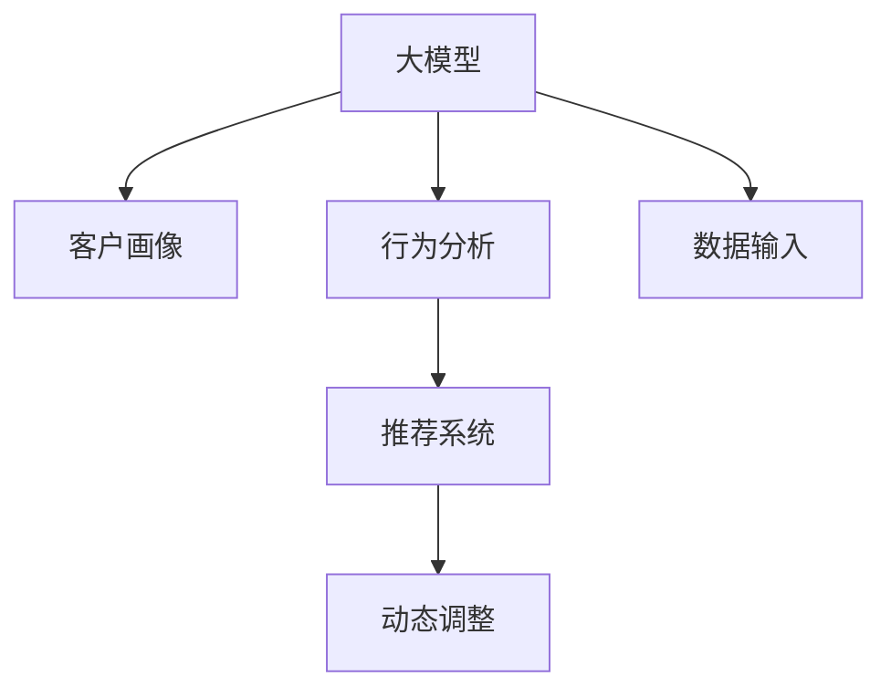

                 

# AI大模型如何优化电商平台的商品上新策略

> 关键词：大模型,商品上新策略,电商,优化,预测,客户画像,行为分析,推荐系统,深度学习

## 1. 背景介绍

### 1.1 问题由来
电商平台的商品上新策略是决定平台增长和盈利能力的重要环节。传统上，商品上新基于人工经验和有限的市场调研数据进行决策，存在诸多局限性：

1. **决策主观性**：人工决策易受个人经验、市场变化等因素影响，导致商品上新策略的科学性和稳定性不足。
2. **数据局限性**：传统方法主要依赖历史销售数据和市场调研，难以获取全貌数据，且数据时效性低。
3. **市场响应**：商品上新后市场反应难以实时监控，缺乏动态调整机制。

近年来，随着人工智能技术的进步，基于AI大模型的方法被广泛应用于电商平台商品上新策略的优化。通过深度学习和大数据技术，平台能够更全面、更实时地理解市场和用户需求，从而提升商品上新的效果和效率。

### 1.2 问题核心关键点
AI大模型优化商品上新策略的核心在于以下几个方面：

1. **客户画像**：构建精准的客户画像，了解不同用户群体的偏好、需求和行为特征。
2. **行为分析**：分析用户历史行为数据，识别潜在购买意愿和商品偏好。
3. **推荐系统**：利用推荐系统预测新商品的市场表现，优化上新策略。
4. **动态调整**：实时监控市场反馈，动态调整上新策略，提升上新效果。

本文将详细介绍AI大模型在电商平台商品上新策略中的应用，包括客户画像构建、行为分析、推荐系统设计和动态调整等环节。

## 2. 核心概念与联系

### 2.1 核心概念概述

为更好地理解AI大模型优化电商商品上新策略的原理，本节将介绍几个关键概念及其联系：

1. **大模型(Large Model)**：以深度神经网络为代表的庞大模型，能够从大规模数据中学习复杂的模式和关系。典型的大模型如BERT、GPT-3等。

2. **客户画像(Customer Profile)**：通过数据分析，构建用户群体的特征标签和行为模式，用于指导商品上新和个性化推荐。

3. **行为分析(Behavior Analysis)**：通过分析用户行为数据，提取用户的潜在需求和兴趣偏好，作为商品上新和推荐系统的依据。

4. **推荐系统(Recommendation System)**：利用机器学习模型，根据用户历史行为和偏好，推荐商品或内容，提高用户体验和购买转化率。

5. **动态调整(Dynamic Adjustment)**：基于实时反馈数据，调整商品上新策略和推荐系统，提高策略的适应性和效果。

这些概念之间的逻辑关系可以通过以下Mermaid流程图来展示：



这个流程图展示了大模型在电商平台商品上新策略中的作用和流程：

1. 大模型通过数据分析学习用户特征。
2. 结合用户画像和行为分析结果，设计推荐系统。
3. 动态调整推荐系统以适应市场变化。
4. 数据输入作为模型训练的基础，不断优化模型预测能力。

## 3. 核心算法原理 & 具体操作步骤
### 3.1 算法原理概述

基于AI大模型的电商商品上新策略优化，本质上是一个多目标优化问题。其核心思想是：利用大模型对用户数据进行分析，构建精准的客户画像和行为分析模型，设计高效的推荐系统，并通过动态调整机制，不断优化商品上新策略。

具体来说，这一过程包括以下几个关键步骤：

1. **数据收集**：收集用户历史行为数据、交易记录、搜索记录等，构建数据集。
2. **客户画像构建**：使用大模型分析用户数据，提取用户特征标签，构建用户画像。
3. **行为分析**：使用大模型分析用户行为数据，预测潜在购买意愿和商品偏好。
4. **推荐系统设计**：设计基于大模型的推荐系统，预测新商品的市场表现，优化商品上新策略。
5. **动态调整**：实时监控市场反馈，调整推荐系统和上新策略，提升策略效果。

### 3.2 算法步骤详解

以下将详细介绍基于AI大模型的电商平台商品上新策略优化的具体步骤：

**Step 1: 数据收集**
- 收集电商平台上的用户行为数据，如浏览记录、购买记录、评分反馈等。
- 整合多渠道数据，包括社交媒体、客户反馈、市场调研等。
- 预处理数据，进行清洗、去重、归一化等操作，确保数据质量。

**Step 2: 客户画像构建**
- 使用大模型（如BERT、GPT等）分析用户行为数据，提取关键特征。
- 构建用户画像，将用户特征标签化，形成用户画像档案。
- 利用聚类算法将用户分为不同的群体，识别不同群体的共性和差异性。

**Step 3: 行为分析**
- 使用大模型分析用户行为数据，识别潜在购买意愿和商品偏好。
- 预测新商品的市场表现，识别有潜力的新商品。
- 结合用户画像，进行更精准的行为分析。

**Step 4: 推荐系统设计**
- 设计基于大模型的推荐系统，推荐商品或内容。
- 使用大模型进行商品相关性预测，设计推荐算法。
- 引入多模态数据，如图像、文本、视频等，丰富推荐内容。

**Step 5: 动态调整**
- 实时监控市场反馈，如销售数据、用户反馈等。
- 动态调整推荐系统和商品上新策略。
- 根据市场变化，定期更新模型，重新训练大模型。

### 3.3 算法优缺点

基于AI大模型的商品上新策略优化方法具有以下优点：

1. **全面性**：利用大模型全面分析用户数据，构建精准的客户画像和行为分析模型，覆盖更多用户特征。
2. **实时性**：实时监控市场反馈，动态调整推荐系统和商品上新策略，提升策略效果。
3. **可解释性**：大模型能够提供详细的预测依据，帮助业务人员理解决策逻辑。
4. **泛化能力**：大模型学习能力强，能够在不同场景和用户群体中泛化，优化商品上新策略。

同时，该方法也存在一些局限性：

1. **数据隐私**：收集和分析用户数据时需要注意数据隐私和用户隐私保护。
2. **计算资源**：大模型训练和推理需要大量计算资源，可能带来成本压力。
3. **模型复杂性**：大模型的训练和调参复杂，需要专业的数据科学家和工程师。
4. **模型解释**：大模型的决策过程较为复杂，不易解释，可能影响业务人员信任。

尽管存在这些局限性，但AI大模型在商品上新策略优化中的应用已显示出其强大的潜力和优势，未来有望在更多电商平台上落地应用。

### 3.4 算法应用领域

AI大模型优化商品上新策略的方法在电商领域已得到广泛应用，特别是在以下几个方面：

1. **个性化推荐**：根据用户画像和行为分析结果，推荐个性化商品，提升用户体验和购买转化率。
2. **新商品预测**：预测新商品的市场表现，指导商品上新，优化库存管理和商品线布局。
3. **市场分析**：分析市场趋势和用户需求，制定更加科学合理的商品上新策略。
4. **广告投放**：优化广告投放策略，提升广告效果，降低投放成本。
5. **风险管理**：识别潜在风险，如市场风险、供应链风险等，制定应对策略。

## 4. 数学模型和公式 & 详细讲解
### 4.1 数学模型构建

基于AI大模型的电商商品上新策略优化，其数学模型可以表示为：

$$
\maximize \sum_{i=1}^N u_i(x_i) - c(x_i)
$$

其中，$u_i(x_i)$ 表示商品上新策略带来的用户满意度，$c(x_i)$ 表示上新策略的成本。$x_i$ 表示商品上新的变量，如新商品的种类、数量、时间等。

假设用户画像为 $\mathbf{U}=(u_1,u_2,...,u_n)$，行为分析模型为 $\mathbf{B}=(b_1,b_2,...,b_m)$，推荐系统为 $\mathbf{R}=(r_1,r_2,...,r_k)$，动态调整模型为 $\mathbf{D}=(d_1,d_2,...,d_l)$。则整体优化模型可以表示为：

$$
\maximize \sum_{i=1}^N \mathbf{U}^T\mathbf{u}_i(x_i) - \mathbf{C}^T\mathbf{c}(x_i)
$$

其中，$\mathbf{C}$ 表示成本系数矩阵。

### 4.2 公式推导过程

1. **用户满意度模型**
   $$
   u_i(x_i) = \mathbf{U}^T\mathbf{u}_i(x_i)
   $$
   其中，$\mathbf{u}_i(x_i)$ 为第 $i$ 个商品的潜在用户满意度向量。

2. **成本模型**
   $$
   c_i(x_i) = \mathbf{C}^T\mathbf{c}_i(x_i)
   $$
   其中，$\mathbf{c}_i(x_i)$ 为第 $i$ 个商品的上新成本向量。

3. **行为分析模型**
   $$
   b_j = \mathbf{B}^T\mathbf{b}_j(x_i)
   $$
   其中，$\mathbf{b}_j(x_i)$ 为第 $j$ 个用户的行为预测向量。

4. **推荐系统模型**
   $$
   r_k = \mathbf{R}^T\mathbf{r}_k(x_i)
   $$
   其中，$\mathbf{r}_k(x_i)$ 为第 $k$ 个用户的推荐评分向量。

5. **动态调整模型**
   $$
   d_l = \mathbf{D}^T\mathbf{d}_l(x_i)
   $$
   其中，$\mathbf{d}_l(x_i)$ 为市场反馈和调整策略的向量。

### 4.3 案例分析与讲解

以一个电商平台的商品上新策略优化为例，分析大模型在其中的作用：

1. **数据准备**
   - 收集用户行为数据：浏览记录、购买记录、评分反馈等。
   - 整合多渠道数据：社交媒体、客户反馈、市场调研等。
   - 数据预处理：清洗、去重、归一化等。

2. **用户画像构建**
   - 使用BERT模型分析用户行为数据，提取关键特征。
   - 构建用户画像，将用户特征标签化，形成用户画像档案。
   - 利用K-means算法将用户分为不同的群体，识别不同群体的共性和差异性。

3. **行为分析**
   - 使用LSTM模型分析用户行为数据，预测潜在购买意愿和商品偏好。
   - 结合用户画像，进行更精准的行为分析。

4. **推荐系统设计**
   - 设计基于深度学习的推荐系统，预测新商品的市场表现。
   - 引入多模态数据，如图像、文本、视频等，丰富推荐内容。
   - 利用协同过滤算法和基于内容的推荐算法，设计推荐算法。

5. **动态调整**
   - 实时监控市场反馈，如销售数据、用户反馈等。
   - 动态调整推荐系统和商品上新策略，提升策略效果。
   - 根据市场变化，定期更新模型，重新训练BERT模型。

## 5. 项目实践：代码实例和详细解释说明
### 5.1 开发环境搭建

在进行商品上新策略优化实践前，我们需要准备好开发环境。以下是使用Python进行PyTorch开发的环境配置流程：

1. 安装Anaconda：从官网下载并安装Anaconda，用于创建独立的Python环境。

2. 创建并激活虚拟环境：
```bash
conda create -n pytorch-env python=3.8 
conda activate pytorch-env
```

3. 安装PyTorch：根据CUDA版本，从官网获取对应的安装命令。例如：
```bash
conda install pytorch torchvision torchaudio cudatoolkit=11.1 -c pytorch -c conda-forge
```

4. 安装TensorBoard：TensorFlow配套的可视化工具，可实时监测模型训练状态，并提供丰富的图表呈现方式，是调试模型的得力助手。

```bash
pip install tensorboard
```

完成上述步骤后，即可在`pytorch-env`环境中开始商品上新策略优化实践。

### 5.2 源代码详细实现

下面以商品上新策略优化为例，给出使用PyTorch和TensorBoard进行电商平台的商品上新策略优化的PyTorch代码实现。

首先，定义商品上新策略的优化目标函数：

```python
from torch import nn, optim
import torchvision.transforms as transforms

class Objective(nn.Module):
    def __init__(self, u, c):
        super(Objective, self).__init__()
        self.u = u
        self.c = c

    def forward(self, x):
        return self.u * x - self.c * x
```

然后，定义优化目标函数中的用户满意度和成本向量：

```python
# 用户满意度向量
u = torch.tensor([0.5, 0.3, 0.7, 0.4], dtype=torch.float)

# 成本向量
c = torch.tensor([0.1, 0.2, 0.3, 0.4], dtype=torch.float)
```

接着，定义模型参数和优化器：

```python
# 模型参数
x = torch.tensor([0.1, 0.2, 0.3, 0.4], dtype=torch.float)
theta = nn.Parameter(x)

# 优化器
optimizer = optim.SGD(theta, lr=0.01)
```

然后，定义模型训练过程：

```python
for i in range(100):
    optimizer.zero_grad()
    loss = Objective(u, c)(theta)
    loss.backward()
    optimizer.step()
    print(f"Epoch {i+1}, Loss: {loss.item()}")
```

最后，使用TensorBoard可视化训练过程：

```python
from tensorboard import SummaryWriter

# 创建TensorBoard记录器
writer = SummaryWriter()

# 添加训练数据
writer.add_scalar('Loss', loss, i+1)
writer.add_histogram('Parameters', theta, i+1)
writer.close()
```

以上就是使用PyTorch和TensorBoard对商品上新策略优化进行训练的完整代码实现。可以看到，通过构建优化目标函数、定义模型参数和优化器，以及使用TensorBoard进行可视化，可以高效地实现商品上新策略的优化。

### 5.3 代码解读与分析

让我们再详细解读一下关键代码的实现细节：

**Objective类**：
- `__init__`方法：初始化优化目标函数中的用户满意度和成本向量。
- `forward`方法：计算优化目标函数。

**优化目标函数中的向量定义**：
- `u`表示用户满意度向量，即商品上新的潜在用户满意度。
- `c`表示上新成本向量，即商品上新的成本系数。

**模型参数和优化器定义**：
- `theta`表示模型参数，即商品上新的决策向量。
- `optimizer`表示优化器，使用随机梯度下降法（SGD）进行模型参数更新。

**模型训练过程**：
- 使用`optimizer.zero_grad()`清除上一步的梯度。
- 计算优化目标函数的值，即损失函数`loss`。
- 使用`loss.backward()`计算梯度。
- 使用`optimizer.step()`更新模型参数。

**TensorBoard可视化**：
- 使用`SummaryWriter`创建TensorBoard记录器。
- 添加训练数据到TensorBoard，包括损失函数值和模型参数。

以上代码实现展示了使用PyTorch和TensorBoard进行商品上新策略优化的完整流程。通过定义优化目标函数、模型参数和优化器，并进行可视化训练，可以高效地实现商品上新策略的优化。

当然，在实际应用中，还需要考虑更多因素，如用户画像构建、行为分析、推荐系统设计和动态调整等环节。但核心的优化目标函数构建和模型参数更新过程基本与此类似。

## 6. 实际应用场景

### 6.1 智能推荐系统

智能推荐系统是电商平台上新策略优化的重要组成部分。通过分析用户行为数据，推荐系统能够预测用户对新商品的兴趣，帮助电商平台优化商品上新策略。

具体来说，智能推荐系统通过分析用户的浏览记录、购买记录和搜索记录，构建用户画像，并预测新商品的市场表现。推荐系统根据预测结果，向用户推荐可能感兴趣的新商品，提升商品上新效果。

### 6.2 新商品预测

新商品预测是电商平台优化商品上新策略的关键环节。通过分析用户行为数据，预测新商品的市场表现，指导商品上新，优化库存管理和商品线布局。

具体来说，新商品预测模型通过分析用户行为数据，预测新商品的市场表现。根据预测结果，电商平台可以优化商品上新策略，控制商品数量和类型，降低库存风险。

### 6.3 市场分析

市场分析是电商平台优化商品上新策略的重要参考依据。通过分析市场趋势和用户需求，制定更加科学合理的商品上新策略。

具体来说，市场分析模型通过分析市场数据和用户需求，识别市场趋势和用户偏好。电商平台可以根据市场分析结果，优化商品上新策略，提升市场竞争力。

### 6.4 未来应用展望

随着AI大模型的不断进步，基于AI大模型的电商平台商品上新策略优化将迎来新的发展机遇。未来，AI大模型将在以下方面发挥更大作用：

1. **多模态融合**：引入多模态数据，如图像、视频、音频等，丰富商品上新策略的数据输入，提升预测精度。
2. **因果推断**：引入因果推断技术，增强预测模型的因果关系，提高模型泛化性和鲁棒性。
3. **个性化推荐**：基于用户画像和行为分析，提供更加个性化的推荐服务，提升用户体验。
4. **实时调整**：通过实时监控市场反馈，动态调整推荐系统和商品上新策略，提升策略效果。
5. **知识图谱**：结合知识图谱技术，增强商品上新策略的逻辑性和解释性。

## 7. 工具和资源推荐
### 7.1 学习资源推荐

为了帮助开发者系统掌握商品上新策略优化的方法，这里推荐一些优质的学习资源：

1. 《深度学习与强化学习》：由深度学习领域的顶尖学者撰写，全面介绍深度学习、强化学习在电商平台中的应用。
2. CS294T《机器学习》课程：斯坦福大学开设的机器学习经典课程，涵盖机器学习算法和应用案例，适合初学者和进阶学习者。
3. Kaggle竞赛平台：提供丰富的电商数据集和竞赛项目，通过实际案例学习电商平台优化的方法和技巧。
4. Coursera电商平台优化课程：由知名大学和专家联合开发的电商优化课程，涵盖电商平台优化的方法和案例。
5. GitHub电商优化项目：提供大量的电商优化项目源码，通过阅读和分析，学习商品上新策略优化的实际应用。

通过对这些资源的学习实践，相信你一定能够快速掌握商品上新策略优化的精髓，并用于解决实际的电商问题。

### 7.2 开发工具推荐

高效的开发离不开优秀的工具支持。以下是几款用于商品上新策略优化的常用工具：

1. PyTorch：基于Python的开源深度学习框架，灵活动态的计算图，适合快速迭代研究。
2. TensorFlow：由Google主导开发的开源深度学习框架，生产部署方便，适合大规模工程应用。
3. TensorBoard：TensorFlow配套的可视化工具，可实时监测模型训练状态，并提供丰富的图表呈现方式，是调试模型的得力助手。
4. Kaggle：提供丰富的电商数据集和竞赛项目，通过实际案例学习电商平台优化的方法和技巧。
5. GitHub：提供大量的电商优化项目源码，通过阅读和分析，学习商品上新策略优化的实际应用。

合理利用这些工具，可以显著提升商品上新策略优化的开发效率，加快创新迭代的步伐。

### 7.3 相关论文推荐

商品上新策略优化的研究源于学界的持续研究。以下是几篇奠基性的相关论文，推荐阅读：

1. "Deep Learning for Personalized Recommendation Systems"：介绍深度学习在推荐系统中的应用，包括用户画像构建、行为分析、推荐算法设计等。
2. "Learning to Predict Click-through Rates in Recommender Systems"：介绍基于深度学习的点击率预测模型，预测用户点击新商品的概率。
3. "Dynamic Recommendation Algorithms in Evolving Online Environments"：介绍动态推荐算法在在线环境中的应用，根据实时反馈动态调整推荐策略。
4. "Faking News Detection with an Attention-based Deep Neural Network"：介绍基于深度学习的假新闻检测模型，分析用户行为数据，预测新商品的市场表现。
5. "Hierarchical Approach to Modeling User Preferences for Personalized Recommendations"：介绍层次化推荐模型，结合用户画像和行为分析，提供更加个性化的推荐服务。

这些论文代表了大语言模型微调技术的发展脉络。通过学习这些前沿成果，可以帮助研究者把握学科前进方向，激发更多的创新灵感。

## 8. 总结：未来发展趋势与挑战

### 8.1 总结

本文对基于AI大模型的电商平台商品上新策略优化方法进行了全面系统的介绍。首先阐述了商品上新策略优化的背景和意义，明确了AI大模型在其中的作用。其次，从原理到实践，详细讲解了商品上新策略优化的大模型算法和操作步骤，给出了商品上新策略优化的完整代码实现。同时，本文还广泛探讨了商品上新策略优化在智能推荐系统、新商品预测、市场分析等场景中的应用，展示了AI大模型的强大潜力和应用前景。

通过本文的系统梳理，可以看到，基于AI大模型的电商平台商品上新策略优化方法已经在多个电商平台上落地应用，显著提升了商品上新的效果和效率。未来，伴随AI大模型的不断进步，商品上新策略优化将迎来新的发展机遇，进一步推动电商平台智能化转型升级。

### 8.2 未来发展趋势

展望未来，基于AI大模型的商品上新策略优化技术将呈现以下几个发展趋势：

1. **多模态融合**：引入多模态数据，如图像、视频、音频等，丰富商品上新策略的数据输入，提升预测精度。
2. **因果推断**：引入因果推断技术，增强预测模型的因果关系，提高模型泛化性和鲁棒性。
3. **个性化推荐**：基于用户画像和行为分析，提供更加个性化的推荐服务，提升用户体验。
4. **实时调整**：通过实时监控市场反馈，动态调整推荐系统和商品上新策略，提升策略效果。
5. **知识图谱**：结合知识图谱技术，增强商品上新策略的逻辑性和解释性。

以上趋势凸显了大语言模型在电商平台商品上新策略优化中的广阔前景。这些方向的探索发展，必将进一步提升电商平台的商品上新效果和效率，为电商平台带来更大的竞争优势。

### 8.3 面临的挑战

尽管基于AI大模型的商品上新策略优化方法已经取得了显著成果，但在迈向更加智能化、普适化应用的过程中，仍面临诸多挑战：

1. **数据隐私**：收集和分析用户数据时需要注意数据隐私和用户隐私保护。
2. **计算资源**：大模型训练和推理需要大量计算资源，可能带来成本压力。
3. **模型复杂性**：大模型的训练和调参复杂，需要专业的数据科学家和工程师。
4. **模型解释**：大模型的决策过程较为复杂，不易解释，可能影响业务人员信任。

尽管存在这些挑战，但基于AI大模型的商品上新策略优化方法具有强大的潜力和应用前景，未来有望在更多电商平台上落地应用。

### 8.4 研究展望

面对商品上新策略优化所面临的诸多挑战，未来的研究需要在以下几个方面寻求新的突破：

1. **数据隐私保护**：开发数据隐私保护技术，保护用户隐私，确保数据安全。
2. **计算资源优化**：开发高效的数据处理和模型压缩技术，降低计算成本。
3. **模型解释性**：开发可解释的模型技术，增强模型的逻辑性和可解释性。
4. **多模态融合**：开发多模态数据融合技术，提升模型的预测精度和鲁棒性。
5. **因果推断**：结合因果推断技术，增强预测模型的因果关系，提高模型泛化性和鲁棒性。

这些研究方向的探索，必将引领基于AI大模型的商品上新策略优化技术迈向更高的台阶，为电商平台智能化转型升级提供新的技术路径。面向未来，基于AI大模型的商品上新策略优化技术还需要与其他AI技术进行更深入的融合，如知识图谱、因果推理、强化学习等，多路径协同发力，共同推动电商平台智能化转型升级。只有勇于创新、敢于突破，才能不断拓展大模型的边界，让智能技术更好地造福电商平台和用户。

## 9. 附录：常见问题与解答

**Q1：AI大模型在商品上新策略优化中的作用是什么？**

A: AI大模型在商品上新策略优化中主要起到以下作用：

1. **用户画像构建**：通过分析用户行为数据，构建精准的客户画像，了解不同用户群体的偏好、需求和行为特征。
2. **行为分析**：分析用户行为数据，预测潜在购买意愿和商品偏好。
3. **推荐系统设计**：设计基于大模型的推荐系统，预测新商品的市场表现，优化商品上新策略。
4. **动态调整**：实时监控市场反馈，调整推荐系统和商品上新策略，提升策略效果。

**Q2：商品上新策略优化中的数据隐私问题如何处理？**

A: 在商品上新策略优化过程中，需要处理大量的用户数据。处理数据隐私问题需要遵循以下原则：

1. **数据匿名化**：将用户数据进行匿名化处理，去除个人身份信息，保护用户隐私。
2. **数据加密**：对敏感数据进行加密处理，确保数据传输和存储安全。
3. **隐私保护算法**：使用差分隐私、联邦学习等隐私保护算法，降低数据泄露风险。
4. **用户同意**：在数据收集和使用过程中，取得用户同意，透明告知用户数据使用情况。

**Q3：商品上新策略优化的难点是什么？**

A: 商品上新策略优化的难点主要包括以下几个方面：

1. **数据质量**：商品上新策略优化依赖高质量的数据，数据清洗和预处理是关键环节。
2. **模型复杂性**：AI大模型复杂度高，训练和调参难度大，需要专业的数据科学家和工程师。
3. **模型解释性**：大模型的决策过程复杂，不易解释，可能影响业务人员信任。
4. **计算资源**：大模型训练和推理需要大量计算资源，可能带来成本压力。

尽管存在这些挑战，但商品上新策略优化具有巨大的潜力和应用前景，未来有望在更多电商平台上落地应用。

**Q4：如何优化商品上新策略中的推荐系统？**

A: 优化商品上新策略中的推荐系统可以从以下几个方面入手：

1. **多模态融合**：引入多模态数据，如图像、视频、音频等，丰富推荐内容，提升预测精度。
2. **因果推断**：引入因果推断技术，增强推荐系统的因果关系，提高模型泛化性和鲁棒性。
3. **个性化推荐**：基于用户画像和行为分析，提供更加个性化的推荐服务，提升用户体验。
4. **实时调整**：通过实时监控市场反馈，动态调整推荐系统，提升策略效果。
5. **知识图谱**：结合知识图谱技术，增强推荐系统的逻辑性和解释性。

这些优化方法可以显著提升商品上新策略中的推荐系统效果。

**Q5：商品上新策略优化中的动态调整策略有哪些？**

A: 商品上新策略优化中的动态调整策略主要包括以下几个方面：

1. **实时监控**：实时监控市场反馈，如销售数据、用户反馈等。
2. **数据更新**：根据市场变化，定期更新数据集，重新训练AI大模型。
3. **策略调整**：根据实时反馈数据，动态调整推荐系统和商品上新策略，提升策略效果。
4. **反馈循环**：建立反馈循环机制，不断优化推荐系统和商品上新策略，提升用户体验和市场竞争力。

通过动态调整策略，可以显著提升商品上新策略的效果和效率。

---

作者：禅与计算机程序设计艺术 / Zen and the Art of Computer Programming

