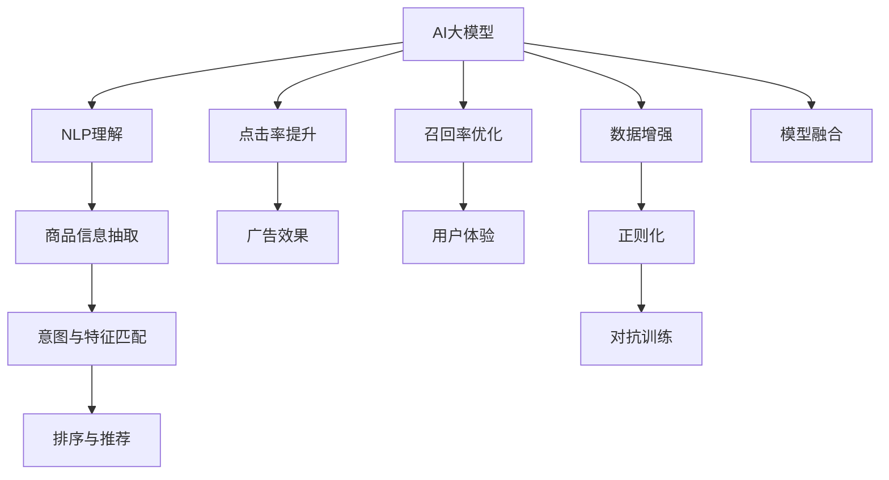

                 

# AI大模型如何提升电商搜索的相关性

> 关键词：AI大模型,电商搜索,自然语言处理(NLP),深度学习,Transformer,BERT,点击率提升,CTR,召回率,自然语言理解

## 1. 背景介绍

### 1.1 问题由来
电商搜索是电商平台上用户获取商品信息的重要渠道。传统的搜索系统主要依靠关键词匹配、静态分类等方式进行排序，但难以充分理解用户查询意图和商品特征，导致搜索结果的相关性和用户体验欠佳。近年来，基于AI大模型的电商搜索系统逐渐成为研究热点，通过预训练模型对大规模文本数据进行学习，获得语义表示和知识图谱，从而实现对用户查询和商品信息的深度理解和匹配。

### 1.2 问题核心关键点
AI大模型在电商搜索中的应用，主要在于通过自然语言处理(NLP)技术，理解用户查询和商品描述，从中提取关键信息，构建用户意图与商品特征的关联图谱，进而提升搜索结果的相关性。具体来说，包括以下几个关键点：

- 用户查询理解：利用NLP技术理解用户查询中的实体、关系和意图。
- 商品信息抽取：通过NLP技术抽取商品描述中的关键信息，构建商品特征向量。
- 意图与特征匹配：将用户查询与商品特征进行语义匹配，评估相关性。
- 排序与推荐：基于匹配结果，进行排序和推荐，优化搜索结果。

## 2. 核心概念与联系

### 2.1 核心概念概述

为更好地理解AI大模型在电商搜索中的应用，本节将介绍几个密切相关的核心概念：

- AI大模型（Large AI Models）：以深度学习为代表的大规模模型，通过自监督或监督学习，学习到丰富的语言表示和知识，能够理解自然语言和处理复杂任务。
- 自然语言处理（Natural Language Processing, NLP）：涉及自然语言理解和自然语言生成，利用计算机技术处理、分析、理解人类语言。
- 深度学习（Deep Learning）：利用多层神经网络模型，自动学习输入数据的表示和模式，广泛应用于计算机视觉、语音识别、自然语言处理等领域。
- 点击率（Click-Through Rate, CTR）：衡量用户点击搜索结果的概率，是电商搜索的重要指标。
- 召回率（Recall Rate）：衡量用户查询相关的商品是否被检索到，是搜索系统性能的重要指标。
- 推荐系统（Recommendation System）：根据用户行为和商品特征，为用户推荐相关商品，提升用户体验。

这些核心概念之间的逻辑关系可以通过以下Mermaid流程图来展示：



这个流程图展示了大模型在电商搜索中的应用逻辑：

1. 大模型通过NLP理解用户查询，抽取商品特征，进行匹配。
2. 基于匹配结果，进行排序和推荐，提升CTR和召回率。
3. 通过广告效果和用户体验指标，反馈优化模型。
4. 结合数据增强、正则化、对抗训练等技术，提升模型性能。
5. 通过多模型融合，进一步提升搜索效果。

## 3. 核心算法原理 & 具体操作步骤
### 3.1 算法原理概述

基于AI大模型的电商搜索系统，主要依赖NLP技术，将自然语言转化为计算机可理解的形式，并通过学习任务数据，提升搜索的相关性和准确性。其核心思想是：利用预训练大模型（如BERT、GPT等），在大量无标签文本数据上预训练语言表示，并通过微调过程，使其在特定任务上优化，从而实现高精度、低成本的搜索。

形式化地，假设大模型为 $M_{\theta}$，训练集为 $D=\{(x_i,y_i)\}_{i=1}^N$，其中 $x_i$ 为用户查询，$y_i$ 为相关商品列表。微调的目标是找到新的模型参数 $\hat{\theta}$，使得模型在新的标注数据上表现最佳。即：

$$
\hat{\theta}=\mathop{\arg\min}_{\theta} \mathcal{L}(M_{\theta},D)
$$

其中 $\mathcal{L}$ 为任务特定的损失函数，用于衡量模型输出与标注数据之间的差异。

### 3.2 算法步骤详解

基于AI大模型的电商搜索系统，其核心步骤包括：

**Step 1: 准备预训练模型和数据集**
- 选择合适的预训练语言模型 $M_{\theta}$ 作为初始化参数，如 BERT、GPT等。
- 准备电商搜索的训练集和测试集，通常包括用户查询和商品描述的标注数据。

**Step 2: 设计任务适配层**
- 根据电商搜索的任务特点，设计任务适配层，如查询匹配层、特征抽取层、意图理解层等。
- 设计损失函数，如交叉熵损失、F1 Score损失等，用于衡量模型输出与标注数据之间的差异。

**Step 3: 设置微调超参数**
- 选择合适的优化算法及其参数，如 AdamW、SGD 等，设置学习率、批大小、迭代轮数等。
- 设置正则化技术及强度，包括权重衰减、Dropout、Early Stopping等。
- 确定冻结预训练参数的策略，如仅微调顶层，或全部参数都参与微调。

**Step 4: 执行梯度训练**
- 将训练集数据分批次输入模型，前向传播计算损失函数。
- 反向传播计算参数梯度，根据设定的优化算法和学习率更新模型参数。
- 周期性在验证集上评估模型性能，根据性能指标决定是否触发 Early Stopping。
- 重复上述步骤直到满足预设的迭代轮数或 Early Stopping 条件。

**Step 5: 测试和部署**
- 在测试集上评估微调后模型 $M_{\hat{\theta}}$ 的性能，对比微调前后的CTR和召回率。
- 使用微调后的模型对新查询进行推理预测，集成到实际的应用系统中。
- 持续收集新的数据，定期重新微调模型，以适应数据分布的变化。

以上是基于AI大模型的电商搜索微调的一般流程。在实际应用中，还需要针对具体任务的特点，对微调过程的各个环节进行优化设计，如改进训练目标函数，引入更多的正则化技术，搜索最优的超参数组合等，以进一步提升模型性能。

### 3.3 算法优缺点

基于AI大模型的电商搜索方法具有以下优点：

1. 快速部署：利用预训练模型，可以快速部署搜索系统，降低开发和部署成本。
2. 理解复杂查询：大模型能够理解复杂的自然语言查询，提取用户意图和关键实体。
3. 提升相关性：通过学习大量标注数据，模型可以提升搜索结果的相关性和准确性。
4. 鲁棒性强：大模型在处理噪声数据和标注错误时，具有较强的鲁棒性。

同时，该方法也存在一定的局限性：

1. 数据标注成本高：电商搜索系统需要大量的标注数据，标注成本较高。
2. 模型复杂度大：大模型通常参数量庞大，计算资源需求高。
3. 隐私保护问题：搜索系统需要处理用户隐私数据，数据安全性和隐私保护问题需特别注意。
4. 过度依赖模型：模型效果依赖于训练数据和模型质量，模型调试和优化难度大。

尽管存在这些局限性，但就目前而言，基于大模型的电商搜索方法仍是最主流和高效的方式。未来相关研究的重点在于如何进一步降低数据标注成本，提高模型鲁棒性，并注重数据隐私保护，同时兼顾模型的可解释性和伦理安全性等因素。

### 3.4 算法应用领域

基于AI大模型的电商搜索方法，在电商平台上已经得到了广泛的应用，涵盖了商品搜索、广告投放、个性化推荐等多个环节，具体如下：

- **商品搜索**：通过查询理解、商品特征抽取和意图匹配，提升搜索结果的相关性和准确性，使用户能够快速找到满意的商品。
- **广告投放**：利用点击率和转化率等指标，为广告主提供精准的投放策略，提升广告效果和用户转化率。
- **个性化推荐**：根据用户行为和商品特征，推荐相关商品，提升用户体验和购物转化率。
- **用户意图理解**：分析用户查询背后的意图，提供更为个性化的搜索建议和商品推荐。

除了上述这些经典应用外，基于大模型的电商搜索方法也在不断地拓展，如实时搜索、多语言搜索、多模态搜索等，为电商搜索带来了新的突破和创新。

## 4. 数学模型和公式 & 详细讲解 & 举例说明
### 4.1 数学模型构建

本节将使用数学语言对基于AI大模型的电商搜索过程进行更加严格的刻画。

假设电商搜索的训练集为 $D=\{(x_i,y_i)\}_{i=1}^N$，其中 $x_i$ 为用户查询，$y_i$ 为相关商品列表。我们假设查询 $x_i$ 的特征向量表示为 $f(x_i)$，商品 $y_i$ 的特征向量表示为 $g(y_i)$。微调的目标是最小化经验风险，即：

$$
\hat{\theta}=\mathop{\arg\min}_{\theta} \mathcal{L}(M_{\theta},D)
$$

其中 $\mathcal{L}$ 为任务特定的损失函数，用于衡量模型输出与标注数据之间的差异。

形式化地，假设模型 $M_{\theta}$ 在输入 $x$ 上的输出为 $h(x)$，相关商品列表为 $y$。则电商搜索的交叉熵损失函数定义为：

$$
\ell(M_{\theta}(x),y) = -\sum_{i=1}^N \log P(M_{\theta}(x_i),y_i)
$$

其中 $P$ 为模型对查询-商品匹配的概率，$P(M_{\theta}(x_i),y_i)=\frac{e^{M_{\theta}(x_i) \cdot y_i}}{\sum_{y_j}e^{M_{\theta}(x_i) \cdot y_j}}$。

将交叉熵损失函数代入经验风险公式，得：

$$
\mathcal{L}(\theta) = -\frac{1}{N}\sum_{i=1}^N \log P(M_{\theta}(x_i),y_i)
$$

在得到损失函数的梯度后，即可带入参数更新公式，完成模型的迭代优化。重复上述过程直至收敛，最终得到适应电商搜索任务的最优模型参数 $\theta^*$。

### 4.2 公式推导过程

以下我们以电商搜索的查询-商品匹配任务为例，推导交叉熵损失函数及其梯度的计算公式。

假设模型 $M_{\theta}$ 在输入 $x$ 上的输出为 $\hat{y}=M_{\theta}(x) \in [0,1]$，表示查询与商品匹配的概率。相关商品列表 $y$ 为二元随机变量，$y_i=1$ 表示商品 $i$ 与查询匹配，$y_i=0$ 表示商品 $i$ 与查询不匹配。则电商搜索的交叉熵损失函数定义为：

$$
\ell(M_{\theta}(x),y) = -\sum_{i=1}^N y_i\log \hat{y}_i+(1-y_i)\log (1-\hat{y}_i)
$$

将其代入经验风险公式，得：

$$
\mathcal{L}(\theta) = -\frac{1}{N}\sum_{i=1}^N (y_i\log \hat{y}_i+(1-y_i)\log(1-\hat{y}_i))
$$

根据链式法则，损失函数对参数 $\theta_k$ 的梯度为：

$$
\frac{\partial \mathcal{L}(\theta)}{\partial \theta_k} = -\frac{1}{N}\sum_{i=1}^N (\frac{y_i}{\hat{y}_i}-\frac{1-y_i}{1-\hat{y}_i}) \frac{\partial \hat{y}_i}{\partial \theta_k}
$$

其中 $\frac{\partial \hat{y}_i}{\partial \theta_k}$ 可进一步递归展开，利用自动微分技术完成计算。

在得到损失函数的梯度后，即可带入参数更新公式，完成模型的迭代优化。重复上述过程直至收敛，最终得到适应电商搜索任务的最优模型参数 $\theta^*$。

### 4.3 案例分析与讲解

以电商平台的商品搜索系统为例，分析其具体实现过程。

假设电商平台有 $N$ 个商品，每个商品有 $d$ 个特征向量 $g_1, g_2, ..., g_d$。对于查询 $x$，首先通过NLP技术进行分词和实体抽取，构建查询的特征向量 $f(x)$。然后，将查询 $x$ 和商品 $y_i$ 的特征向量进行匹配，计算相似度：

$$
\text{similarity}(x,y_i) = f(x)^T \cdot g_i
$$

其中 $T$ 表示向量转置。然后，利用sigmoid函数将相似度转化为查询与商品匹配的概率：

$$
\hat{y}_i = \sigma(\text{similarity}(x,y_i))
$$

最后，根据查询 $x$ 和商品 $y_i$ 的匹配概率，计算电商搜索的交叉熵损失函数，并进行梯度更新。

在实际应用中，商品特征向量 $g_i$ 可以来自商品描述、用户评价等文本信息，或通过图像、音频等非文本信息进行提取。通过多模态融合，可以更全面地理解商品特征，提升查询-商品匹配的精度。

## 5. 项目实践：代码实例和详细解释说明
### 5.1 开发环境搭建

在进行电商搜索系统开发前，我们需要准备好开发环境。以下是使用Python进行PyTorch开发的环境配置流程：

1. 安装Anaconda：从官网下载并安装Anaconda，用于创建独立的Python环境。

2. 创建并激活虚拟环境：
```bash
conda create -n ecommerce-env python=3.8 
conda activate ecommerce-env
```

3. 安装PyTorch：根据CUDA版本，从官网获取对应的安装命令。例如：
```bash
conda install pytorch torchvision torchaudio cudatoolkit=11.1 -c pytorch -c conda-forge
```

4. 安装Transformers库：
```bash
pip install transformers
```

5. 安装各类工具包：
```bash
pip install numpy pandas scikit-learn matplotlib tqdm jupyter notebook ipython
```

完成上述步骤后，即可在`ecommerce-env`环境中开始电商搜索系统的开发。

### 5.2 源代码详细实现

下面以电商平台的商品搜索系统为例，给出使用Transformers库对BERT模型进行微调的PyTorch代码实现。

首先，定义商品搜索的数据处理函数：

```python
from transformers import BertTokenizer
from torch.utils.data import Dataset
import torch

class SearchDataset(Dataset):
    def __init__(self, queries, items, tokenizers, max_len=128):
        self.queries = queries
        self.items = items
        self.tokenizers = tokenizers
        self.max_len = max_len
        
    def __len__(self):
        return len(self.queries)
    
    def __getitem__(self, item):
        query = self.queries[item]
        item = self.items[item]
        
        encoding = self.tokenizers(query, return_tensors='pt', max_length=self.max_len, padding='max_length', truncation=True)
        input_ids = encoding['input_ids'][0]
        attention_mask = encoding['attention_mask'][0]
        
        # 对商品特征进行编码
        item_features = []
        for i in range(len(item)):
            item_features.append(item[i])
        item_features = torch.tensor(item_features, dtype=torch.long)
        
        # 对token-wise的特征进行编码
        encoded_features = [feature2id[feature] for feature in item_features] 
        encoded_features.extend([feature2id['PAD']] * (self.max_len - len(encoded_features)))
        labels = torch.tensor(encoded_features, dtype=torch.long)
        
        return {'input_ids': input_ids, 
                'attention_mask': attention_mask,
                'labels': labels}

# 特征与id的映射
feature2id = {'<UNK>': 0, '<TKS>': 1, '<TGL>': 2, '<PAD>': 3}
id2feature = {v: k for k, v in feature2id.items()}

# 创建dataset
tokenizer = BertTokenizer.from_pretrained('bert-base-cased')

train_dataset = SearchDataset(train_queries, train_items, tokenizer)
dev_dataset = SearchDataset(dev_queries, dev_items, tokenizer)
test_dataset = SearchDataset(test_queries, test_items, tokenizer)
```

然后，定义模型和优化器：

```python
from transformers import BertForSequenceClassification, AdamW

model = BertForSequenceClassification.from_pretrained('bert-base-cased', num_labels=len(feature2id))

optimizer = AdamW(model.parameters(), lr=2e-5)
```

接着，定义训练和评估函数：

```python
from torch.utils.data import DataLoader
from tqdm import tqdm
from sklearn.metrics import classification_report

device = torch.device('cuda') if torch.cuda.is_available() else torch.device('cpu')
model.to(device)

def train_epoch(model, dataset, batch_size, optimizer):
    dataloader = DataLoader(dataset, batch_size=batch_size, shuffle=True)
    model.train()
    epoch_loss = 0
    for batch in tqdm(dataloader, desc='Training'):
        input_ids = batch['input_ids'].to(device)
        attention_mask = batch['attention_mask'].to(device)
        labels = batch['labels'].to(device)
        model.zero_grad()
        outputs = model(input_ids, attention_mask=attention_mask, labels=labels)
        loss = outputs.loss
        epoch_loss += loss.item()
        loss.backward()
        optimizer.step()
    return epoch_loss / len(dataloader)

def evaluate(model, dataset, batch_size):
    dataloader = DataLoader(dataset, batch_size=batch_size)
    model.eval()
    preds, labels = [], []
    with torch.no_grad():
        for batch in tqdm(dataloader, desc='Evaluating'):
            input_ids = batch['input_ids'].to(device)
            attention_mask = batch['attention_mask'].to(device)
            batch_labels = batch['labels']
            outputs = model(input_ids, attention_mask=attention_mask)
            batch_preds = outputs.logits.argmax(dim=2).to('cpu').tolist()
            batch_labels = batch_labels.to('cpu').tolist()
            for pred_tokens, label_tokens in zip(batch_preds, batch_labels):
                pred_features = [id2feature[_id] for _id in pred_tokens]
                label_features = [id2feature[_id] for _id in label_tokens]
                preds.append(pred_features)
                labels.append(label_features)
                
    print(classification_report(labels, preds))
```

最后，启动训练流程并在测试集上评估：

```python
epochs = 5
batch_size = 16

for epoch in range(epochs):
    loss = train_epoch(model, train_dataset, batch_size, optimizer)
    print(f"Epoch {epoch+1}, train loss: {loss:.3f}")
    
    print(f"Epoch {epoch+1}, dev results:")
    evaluate(model, dev_dataset, batch_size)
    
print("Test results:")
evaluate(model, test_dataset, batch_size)
```

以上就是使用PyTorch对BERT进行电商搜索系统微调的完整代码实现。可以看到，得益于Transformers库的强大封装，我们可以用相对简洁的代码完成BERT模型的加载和微调。

### 5.3 代码解读与分析

让我们再详细解读一下关键代码的实现细节：

**SearchDataset类**：
- `__init__`方法：初始化查询、商品、分词器等关键组件。
- `__len__`方法：返回数据集的样本数量。
- `__getitem__`方法：对单个样本进行处理，将查询输入编码为token ids，将商品特征编码为数字，并对其进行定长padding，最终返回模型所需的输入。

**feature2id和id2feature字典**：
- 定义了商品特征与数字id之间的映射关系，用于将token-wise的预测结果解码回真实的特征。

**训练和评估函数**：
- 使用PyTorch的DataLoader对数据集进行批次化加载，供模型训练和推理使用。
- 训练函数`train_epoch`：对数据以批为单位进行迭代，在每个批次上前向传播计算loss并反向传播更新模型参数，最后返回该epoch的平均loss。
- 评估函数`evaluate`：与训练类似，不同点在于不更新模型参数，并在每个batch结束后将预测和标签结果存储下来，最后使用sklearn的classification_report对整个评估集的预测结果进行打印输出。

**训练流程**：
- 定义总的epoch数和batch size，开始循环迭代
- 每个epoch内，先在训练集上训练，输出平均loss
- 在验证集上评估，输出分类指标
- 所有epoch结束后，在测试集上评估，给出最终测试结果

可以看到，PyTorch配合Transformers库使得BERT微调的代码实现变得简洁高效。开发者可以将更多精力放在数据处理、模型改进等高层逻辑上，而不必过多关注底层的实现细节。

当然，工业级的系统实现还需考虑更多因素，如模型的保存和部署、超参数的自动搜索、更灵活的任务适配层等。但核心的微调范式基本与此类似。

## 6. 实际应用场景
### 6.1 智能客服系统

基于大语言模型微调的电商搜索系统，可以广泛应用于智能客服系统的构建。传统客服往往需要配备大量人力，高峰期响应缓慢，且一致性和专业性难以保证。而使用微调后的电商搜索系统，可以24小时不间断服务，快速响应客户咨询，用自然流畅的语言解答各类常见问题。

在技术实现上，可以收集客户的历史聊天记录，将问题和最佳答复构建成监督数据，在此基础上对预训练电商搜索系统进行微调。微调后的电商搜索系统能够自动理解客户意图，匹配最合适的答案模板进行回复。对于客户提出的新问题，还可以接入检索系统实时搜索相关内容，动态组织生成回答。如此构建的智能客服系统，能大幅提升客户咨询体验和问题解决效率。

### 6.2 广告投放系统

电商平台的广告投放系统需要精准匹配用户和商品，提升广告效果和用户转化率。传统的手动投放方式效率低、精度差，难以适应多变的市场和用户需求。基于大语言模型微调的电商搜索系统，可以自动化广告投放流程，提升投放效果。

具体而言，电商搜索系统根据用户行为和商品特征，自动匹配合适的广告商品和投放时间，实现精准投放。同时，系统可以根据广告效果反馈进行优化，不断调整投放策略，实现更高ROI。广告主可以根据投放效果，实时调整预算和策略，确保广告预算的使用效率。

### 6.3 个性化推荐系统

电商平台的个性化推荐系统，需要根据用户行为和商品特征，推荐相关商品，提升用户体验和购物转化率。传统推荐系统往往只依赖用户的历史行为数据，难以充分理解用户真实兴趣。基于大语言模型微调的电商搜索系统，可以通过NLP技术理解用户查询和商品描述，构建用户意图与商品特征的关联图谱，从而实现更准确的个性化推荐。

在实践中，可以收集用户浏览、点击、评论等行为数据，提取和用户交互的商品标题、描述、标签等文本内容。将文本内容作为模型输入，用户的后续行为（如是否点击、购买等）作为监督信号，在此基础上微调预训练电商搜索系统。微调后的电商搜索系统能够从文本内容中准确把握用户的兴趣点，生成更个性化的推荐结果。

### 6.4 未来应用展望

随着大语言模型和微调方法的不断发展，基于微调范式将在更多领域得到应用，为传统行业带来变革性影响。

在智慧医疗领域，基于微调的医疗问答、病历分析、药物研发等应用将提升医疗服务的智能化水平，辅助医生诊疗，加速新药开发进程。

在智能教育领域，微调技术可应用于作业批改、学情分析、知识推荐等方面，因材施教，促进教育公平，提高教学质量。

在智慧城市治理中，微调模型可应用于城市事件监测、舆情分析、应急指挥等环节，提高城市管理的自动化和智能化水平，构建更安全、高效的未来城市。

此外，在企业生产、社会治理、文娱传媒等众多领域，基于大模型微调的人工智能应用也将不断涌现，为经济社会发展注入新的动力。相信随着技术的日益成熟，微调方法将成为人工智能落地应用的重要范式，推动人工智能技术向更广阔的领域加速渗透。

## 7. 工具和资源推荐
### 7.1 学习资源推荐

为了帮助开发者系统掌握大语言模型微调的理论基础和实践技巧，这里推荐一些优质的学习资源：

1. 《Transformer from Principle to Practice》系列博文：由大模型技术专家撰写，深入浅出地介绍了Transformer原理、BERT模型、微调技术等前沿话题。

2. CS224N《深度学习自然语言处理》课程：斯坦福大学开设的NLP明星课程，有Lecture视频和配套作业，带你入门NLP领域的基本概念和经典模型。

3. 《Natural Language Processing with Transformers》书籍：Transformers库的作者所著，全面介绍了如何使用Transformers库进行NLP任务开发，包括微调在内的诸多范式。

4. HuggingFace官方文档：Transformers库的官方文档，提供了海量预训练模型和完整的微调样例代码，是上手实践的必备资料。

5. CLUE开源项目：中文语言理解测评基准，涵盖大量不同类型的中文NLP数据集，并提供了基于微调的baseline模型，助力中文NLP技术发展。

通过对这些资源的学习实践，相信你一定能够快速掌握大语言模型微调的精髓，并用于解决实际的NLP问题。
###  7.2 开发工具推荐

高效的开发离不开优秀的工具支持。以下是几款用于大语言模型微调开发的常用工具：

1. PyTorch：基于Python的开源深度学习框架，灵活动态的计算图，适合快速迭代研究。大部分预训练语言模型都有PyTorch版本的实现。

2. TensorFlow：由Google主导开发的开源深度学习框架，生产部署方便，适合大规模工程应用。同样有丰富的预训练语言模型资源。

3. Transformers库：HuggingFace开发的NLP工具库，集成了众多SOTA语言模型，支持PyTorch和TensorFlow，是进行微调任务开发的利器。

4. Weights & Biases：模型训练的实验跟踪工具，可以记录和可视化模型训练过程中的各项指标，方便对比和调优。与主流深度学习框架无缝集成。

5. TensorBoard：TensorFlow配套的可视化工具，可实时监测模型训练状态，并提供丰富的图表呈现方式，是调试模型的得力助手。

6. Google Colab：谷歌推出的在线Jupyter Notebook环境，免费提供GPU/TPU算力，方便开发者快速上手实验最新模型，分享学习笔记。

合理利用这些工具，可以显著提升大语言模型微调任务的开发效率，加快创新迭代的步伐。

### 7.3 相关论文推荐

大语言模型和微调技术的发展源于学界的持续研究。以下是几篇奠基性的相关论文，推荐阅读：

1. Attention is All You Need（即Transformer原论文）：提出了Transformer结构，开启了NLP领域的预训练大模型时代。

2. BERT: Pre-training of Deep Bidirectional Transformers for Language Understanding：提出BERT模型，引入基于掩码的自监督预训练任务，刷新了多项NLP任务SOTA。

3. Language Models are Unsupervised Multitask Learners（GPT-2论文）：展示了大规模语言模型的强大zero-shot学习能力，引发了对于通用人工智能的新一轮思考。

4. Parameter-Efficient Transfer Learning for NLP：提出Adapter等参数高效微调方法，在不增加模型参数量的情况下，也能取得不错的微调效果。

5. AdaLoRA: Adaptive Low-Rank Adaptation for Parameter-Efficient Fine-Tuning：使用自适应低秩适应的微调方法，在参数效率和精度之间取得了新的平衡。

这些论文代表了大语言模型微调技术的发展脉络。通过学习这些前沿成果，可以帮助研究者把握学科前进方向，激发更多的创新灵感。

## 8. 总结：未来发展趋势与挑战

### 8.1 总结

本文对基于AI大模型的电商搜索方法进行了全面系统的介绍。首先阐述了电商搜索系统的背景和意义，明确了电商搜索任务的特点和挑战。其次，从原理到实践，详细讲解了AI大模型在电商搜索中的应用方法，包括NLP技术、深度学习模型、微调技术等。最后，通过实际应用场景和案例分析，展示了电商搜索系统的具体实现和优化方案。

通过本文的系统梳理，可以看到，基于AI大模型的电商搜索方法在用户意图理解、商品特征抽取、意图匹配等方面具有显著优势，显著提升了电商搜索的相关性和用户体验。未来，伴随AI大模型的不断发展，电商搜索系统将实现更高效的个性化推荐、精准的广告投放，成为智能电商的核心竞争力。

### 8.2 未来发展趋势

展望未来，基于AI大模型的电商搜索技术将呈现以下几个发展趋势：

1. 模型规模持续增大。随着算力成本的下降和数据规模的扩张，预训练语言模型的参数量还将持续增长。超大规模语言模型蕴含的丰富语言知识，有望支撑更加复杂多变的电商搜索任务。

2. 微调方法日趋多样。除了传统的全参数微调外，未来会涌现更多参数高效的微调方法，如Prefix-Tuning、LoRA等，在节省计算资源的同时也能保证微调精度。

3. 持续学习成为常态。随着数据分布的不断变化，电商搜索模型也需要持续学习新知识以保持性能。如何在不遗忘原有知识的同时，高效吸收新样本信息，将成为重要的研究课题。

4. 标注样本需求降低。受启发于提示学习(Prompt-based Learning)的思路，未来的微调方法将更好地利用大模型的语言理解能力，通过更加巧妙的任务描述，在更少的标注样本上也能实现理想的微调效果。

5. 模型通用性增强。经过海量数据的预训练和多领域任务的微调，未来的电商搜索模型将具备更强大的常识推理和跨领域迁移能力，逐步迈向通用人工智能(AGI)的目标。

6. 数据隐私保护。由于电商搜索系统需要处理用户隐私数据，数据安全性和隐私保护问题需特别注意。如何在保证数据隐私的同时，优化电商搜索效果，也将是重要的研究方向。

以上趋势凸显了大语言模型在电商搜索中的应用前景。这些方向的探索发展，必将进一步提升电商搜索系统的性能和应用范围，为智能电商的发展注入新动能。

### 8.3 面临的挑战

尽管基于AI大模型的电商搜索技术已经取得了瞩目成就，但在迈向更加智能化、普适化应用的过程中，它仍面临诸多挑战：

1. 标注成本瓶颈。虽然电商搜索系统需要大量的标注数据，标注成本较高。如何进一步降低微调对标注样本的依赖，将是一大难题。

2. 模型鲁棒性不足。当前电商搜索模型面对域外数据时，泛化性能往往大打折扣。对于测试样本的微小扰动，电商搜索模型的预测也容易发生波动。如何提高电商搜索模型的鲁棒性，避免灾难性遗忘，还需要更多理论和实践的积累。

3. 推理效率有待提高。大规模语言模型虽然精度高，但在实际部署时往往面临推理速度慢、内存占用大等效率问题。如何在保证性能的同时，简化模型结构，提升推理速度，优化资源占用，将是重要的优化方向。

4. 用户隐私保护。电商搜索系统需要处理用户隐私数据，数据安全性和隐私保护问题需特别注意。如何在保证数据隐私的同时，优化电商搜索效果，也将是重要的研究方向。

5. 技术门槛高。电商搜索系统需要综合NLP、深度学习、工程部署等多个领域的知识，技术门槛较高。如何降低技术门槛，使得更多开发者能够快速上手和迭代优化系统，是未来需要解决的重要问题。

尽管存在这些挑战，但通过不断的技术探索和创新，相信大语言模型在电商搜索中的应用将不断拓展，为智能电商带来更加智能化、个性化的体验。

### 8.4 研究展望

面对电商搜索系统所面临的种种挑战，未来的研究需要在以下几个方面寻求新的突破：

1. 探索无监督和半监督微调方法。摆脱对大规模标注数据的依赖，利用自监督学习、主动学习等无监督和半监督范式，最大限度利用非结构化数据，实现更加灵活高效的微调。

2. 研究参数高效和计算高效的微调范式。开发更加参数高效的微调方法，在固定大部分预训练参数的同时，只更新极少量的任务相关参数。同时优化微调模型的计算图，减少前向传播和反向传播的资源消耗，实现更加轻量级、实时性的部署。

3. 融合因果和对比学习范式。通过引入因果推断和对比学习思想，增强电商搜索模型建立稳定因果关系的能力，学习更加普适、鲁棒的语言表征，从而提升模型泛化性和抗干扰能力。

4. 引入更多先验知识。将符号化的先验知识，如知识图谱、逻辑规则等，与神经网络模型进行巧妙融合，引导电商搜索过程学习更准确、合理的语言模型。同时加强不同模态数据的整合，实现视觉、语音等多模态信息与文本信息的协同建模。

5. 结合因果分析和博弈论工具。将因果分析方法引入电商搜索模型，识别出模型决策的关键特征，增强输出解释的因果性和逻辑性。借助博弈论工具刻画人机交互过程，主动探索并规避模型的脆弱点，提高系统稳定性。

6. 纳入伦理道德约束。在模型训练目标中引入伦理导向的评估指标，过滤和惩罚有偏见、有害的输出倾向。同时加强人工干预和审核，建立模型行为的监管机制，确保输出符合人类价值观和伦理道德。

这些研究方向的探索，必将引领基于AI大模型的电商搜索技术迈向更高的台阶，为智能电商的发展注入新动能。面向未来，大语言模型在电商搜索中的应用还需与其他人工智能技术进行更深入的融合，如知识表示、因果推理、强化学习等，多路径协同发力，共同推动电商搜索系统的进步。只有勇于创新、敢于突破，才能不断拓展电商搜索的边界，让智能技术更好地造福电商用户。

## 9. 附录：常见问题与解答
**Q1：电商搜索系统需要收集多少标注数据？**

A: 电商搜索系统需要收集大量的标注数据，具体数量取决于任务的复杂度和数据的覆盖面。一般来说，需要至少几万到几十万的标注数据才能获得较好的微调效果。标注数据不足会导致模型泛化性能差，难以适应新场景和用户需求。

**Q2：如何提高电商搜索系统的点击率（CTR）？**

A: 电商搜索系统可以通过以下方法提高点击率：
1. 优化搜索结果：根据用户的查询意图，优化搜索结果的排序，推荐相关商品。
2. 精细化广告投放：通过A/B测试，优化广告的展示位置、样式、内容等，提高广告点击率。
3. 个性化推荐：根据用户的历史行为和偏好，推荐个性化的商品，提高用户点击意愿。
4. 数据增强：通过回译、近义替换等方式扩充训练集，提升模型泛化能力。
5. 多模态融合：结合文本、图像、音频等多模态信息，提升查询-商品匹配的准确性。

**Q3：电商搜索系统的召回率（Recall Rate）如何优化？**

A: 电商搜索系统可以通过以下方法优化召回率：
1. 增加商品库覆盖面：不断扩展商品库，涵盖更多商品和不同类别。
2. 多轮召回：采用多轮召回策略，每次推荐一批相关商品，提升召回率。
3. 语义匹配：利用NLP技术，理解用户查询的语义，提升匹配准确性。
4. 实时更新：实时更新商品信息，确保搜索系统的及时性和准确性。
5. 数据增强：通过回译、近义替换等方式扩充训练集，提升模型泛化能力。

**Q4：电商搜索系统的模型如何更新？**

A: 电商搜索系统的模型可以通过以下方式更新：
1. 定期微调：定期使用最新的标注数据，重新训练电商搜索模型，优化模型性能。
2. 增量学习：每次更新时，只更新新的数据部分，保留已有数据的学习结果，避免重新训练。
3. 多模型融合：利用多个电商搜索模型的输出结果，进行加权融合，提升模型的综合性能。
4. 数据增强：通过回译、近义替换等方式扩充训练集，提升模型泛化能力。

**Q5：电商搜索系统的推荐算法有哪些？**

A: 电商搜索系统的推荐算法有以下几种：
1. 基于内容的推荐：根据商品描述、标签等特征，推荐相关商品。
2. 协同过滤推荐：根据用户的历史行为和偏好，推荐类似商品。
3. 混合推荐算法：结合基于内容和协同过滤等多种推荐算法，提升推荐效果。
4. 深度学习推荐：利用深度神经网络模型，预测用户对商品的偏好和评分，进行推荐。

这些算法可以根据实际应用场景和数据特点进行选择和优化。在实际应用中，往往需要结合多种算法，构建综合推荐系统，提升推荐效果。

---

作者：禅与计算机程序设计艺术 / Zen and the Art of Computer Programming

