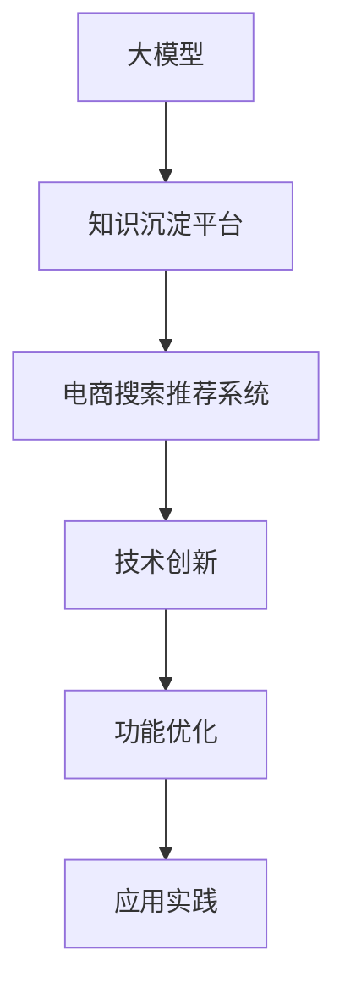

                 

# AI大模型视角下电商搜索推荐的技术创新知识沉淀平台功能优化与应用实践

> 关键词：大模型, 电商搜索推荐, 知识沉淀平台, 技术创新, 功能优化, 应用实践

## 1. 背景介绍

在数字化浪潮的推动下，电子商务已经成为人们日常生活的重要组成部分。随着互联网技术的不断进步，电商平台的运营模式也发生了翻天覆地的变化。其中，搜索引擎和推荐系统作为电商平台的灵魂，其优劣直接影响了用户体验和商家效益。然而，传统的电商搜索推荐系统面临着数据多样性、用户需求变化快速、推荐算法复杂度高等挑战。如何构建一个智能、高效、可靠的电商搜索推荐系统，已经成为电商企业亟需解决的关键问题。

近年来，基于大模型的技术创新在电商搜索推荐领域展现出巨大的潜力。通过预训练大模型进行知识沉淀，并在此基础上进行微调，电商搜索推荐系统能够更好地理解和匹配用户需求，实现更加精准的推荐和搜索功能。本文档将系统地介绍基于大模型的电商搜索推荐系统的构建和优化，通过深入分析其核心概念与联系，细化算法原理和操作步骤，并探讨其在应用实践中的功能优化和未来发展方向。

## 2. 核心概念与联系

### 2.1 核心概念概述

为更好地理解基于大模型的电商搜索推荐系统，本节将介绍几个关键概念：

- **大模型（Large Model）**：指通过大规模无标签数据进行自监督预训练得到的模型，如BERT、GPT等。大模型通过广泛的预训练数据学习到了通用的语言知识和特征表示。

- **知识沉淀平台（Knowledge Repository）**：是指收集和存储电商领域中各种形式的知识（包括文本、图像、视频等），供大模型进行学习和适应的系统。知识沉淀平台通过数据沉淀和知识标注，提升大模型的泛化能力和适应性。

- **电商搜索推荐系统（E-commerce Search & Recommendation System）**：利用自然语言处理、计算机视觉等技术，实现用户搜索查询和商品推荐，提升电商交易效率和用户体验。

- **技术创新（Technological Innovation）**：指通过引入新技术，如深度学习、自然语言处理、知识图谱等，改善现有技术体系，提升系统性能。

- **功能优化（Functional Optimization）**：指对电商搜索推荐系统的功能模块进行设计和优化，提升系统的稳定性和用户体验。

- **应用实践（Application Practice）**：指将技术创新和功能优化应用于电商搜索推荐系统的具体实现和运营中，实现系统的商业化和落地。

这些概念之间的关系可以通过以下Mermaid流程图来展示：



这个流程图展示了大模型、知识沉淀平台、电商搜索推荐系统、技术创新、功能优化和应用实践之间的逻辑关系：

1. 大模型通过知识沉淀平台学习电商领域的知识，提升自身的泛化能力和适应性。
2. 电商搜索推荐系统利用大模型的知识进行用户搜索查询和商品推荐，提升用户体验和交易效率。
3. 技术创新通过引入深度学习、自然语言处理、知识图谱等新技术，改善电商搜索推荐系统的性能。
4. 功能优化对电商搜索推荐系统的功能模块进行设计和优化，提升系统的稳定性和用户体验。
5. 应用实践将技术创新和功能优化应用于系统的具体实现和运营中，实现系统的商业化和落地。

## 3. 核心算法原理 & 具体操作步骤
### 3.1 算法原理概述

基于大模型的电商搜索推荐系统通过预训练大模型进行知识沉淀，并在电商搜索推荐场景中进行微调。其核心思想是：

1. **知识沉淀**：通过电商领域的知识沉淀平台，收集和存储大量的文本、图像、视频等多模态数据，供大模型进行学习和适应的系统。大模型通过预训练学习到通用的语言知识和特征表示，为电商搜索推荐系统提供知识基础。

2. **微调**：在电商搜索推荐场景中，利用大模型对电商领域的任务进行微调。微调的目标是根据电商领域的数据，优化大模型的参数，使其能够更好地适应电商搜索推荐任务。

3. **优化**：对电商搜索推荐系统的各个模块进行设计和优化，如用户意图理解、商品推荐算法、搜索排名算法等，提升系统的性能和用户体验。

4. **应用**：将优化后的电商搜索推荐系统应用于电商平台的实际运营中，通过智能搜索和推荐功能，提升用户购物体验，增加商家转化率。

### 3.2 算法步骤详解

基于大模型的电商搜索推荐系统一般包括以下几个关键步骤：

**Step 1: 准备知识沉淀平台和电商数据**

- **知识沉淀平台准备**：收集电商领域的各种形式的知识数据，包括商品描述、用户评论、图片、视频等。对这些数据进行清洗、标注和存储，构建电商领域的知识沉淀平台。
- **电商数据准备**：收集电商平台的交易数据、用户行为数据、商品数据等，进行清洗和预处理，构建电商领域的训练数据集。

**Step 2: 选择并预训练大模型**

- **大模型选择**：选择合适的预训练模型，如BERT、GPT等。这些模型经过大规模无标签数据的预训练，学习到了通用的语言知识和特征表示。
- **模型微调**：在电商数据集上对预训练模型进行微调。微调的目标是根据电商领域的数据，优化大模型的参数，使其能够更好地适应电商搜索推荐任务。

**Step 3: 设计电商搜索推荐系统**

- **模块设计**：设计电商搜索推荐系统的各个模块，如用户意图理解模块、商品推荐算法模块、搜索排名算法模块等。
- **功能优化**：对各个模块进行设计和优化，提升系统的性能和用户体验。例如，使用深度学习算法优化用户意图理解模块，使用知识图谱技术优化商品推荐算法，使用多模态数据提升搜索排名算法等。

**Step 4: 应用优化后的电商搜索推荐系统**

- **系统部署**：将优化后的电商搜索推荐系统部署到电商平台的实际运营中。
- **效果评估**：通过用户反馈、转化率、点击率等指标，评估优化后的电商搜索推荐系统的效果。
- **持续优化**：根据实际运营数据，持续优化电商搜索推荐系统的各个模块，提升系统的性能和用户体验。

### 3.3 算法优缺点

基于大模型的电商搜索推荐系统具有以下优点：

1. **泛化能力强**：通过预训练大模型进行知识沉淀，提升了模型的泛化能力和适应性。
2. **数据利用率高**：利用大模型的预训练知识，可以在更少标注数据的情况下，提升推荐系统的效果。
3. **可扩展性强**：通过微调和优化，可以灵活适应不同电商领域的推荐任务，实现通用化和定制化相结合。
4. **用户体验提升**：通过智能搜索和推荐功能，提升用户购物体验，增加商家转化率。

同时，该方法也存在一些缺点：

1. **计算成本高**：大模型的预训练和微调需要大量的计算资源和时间。
2. **模型复杂度高**：大模型的复杂度较高，维护和调优成本较高。
3. **数据隐私问题**：电商领域的知识沉淀需要大量的数据，可能涉及用户隐私问题。
4. **模型效果依赖数据**：推荐系统的效果依赖于数据的质量和多样性，数据不足或标注错误都会影响系统性能。

尽管存在这些缺点，但就目前而言，基于大模型的电商搜索推荐系统仍是大规模电商平台的必备解决方案。未来相关研究的重点在于如何降低计算成本，提升模型效率，同时兼顾数据隐私和用户安全。

### 3.4 算法应用领域

基于大模型的电商搜索推荐系统在电商领域有广泛的应用，例如：

- **用户意图理解**：通过分析用户的搜索行为和点击记录，理解用户的意图和需求，实现智能搜索。
- **商品推荐算法**：根据用户的历史行为、兴趣偏好，推荐符合用户需求的商品。
- **搜索排名算法**：根据商品的关键词、评分、销量等信息，优化搜索结果的排名，提升用户体验。
- **多模态数据融合**：利用电商领域的图像、视频等多模态数据，提升推荐和搜索的准确性和丰富性。
- **个性化推荐**：基于用户的历史行为和兴趣偏好，实现个性化的商品推荐，提升用户满意度。
- **实时推荐**：通过实时数据分析，动态调整推荐算法，实现商品推荐的时效性。

这些应用领域展示了基于大模型的电商搜索推荐系统在提升电商用户购物体验、商家转化率等方面的巨大潜力。

## 4. 数学模型和公式 & 详细讲解  
### 4.1 数学模型构建

基于大模型的电商搜索推荐系统的数学模型构建主要包括以下几个步骤：

1. **知识沉淀数据构建**：假设电商领域的知识沉淀数据为 $\mathcal{D}_k = \{ (x_k, y_k) \}_{k=1}^K$，其中 $x_k$ 为电商知识数据，$y_k$ 为知识标注。
2. **大模型预训练**：假设预训练大模型为 $M_{\theta}$，通过大规模无标签数据进行预训练，学习到通用的语言知识和特征表示。
3. **电商数据构建**：假设电商领域的训练数据为 $\mathcal{D}_e = \{ (x_e, y_e) \}_{e=1}^N$，其中 $x_e$ 为电商交易数据和用户行为数据，$y_e$ 为电商领域标注。

### 4.2 公式推导过程

假设电商领域的知识沉淀数据为 $\mathcal{D}_k = \{ (x_k, y_k) \}_{k=1}^K$，电商领域的训练数据为 $\mathcal{D}_e = \{ (x_e, y_e) \}_{e=1}^N$。大模型预训练的目标是最小化在知识沉淀数据上的损失，即：

$$
\min_{\theta} \frac{1}{K} \sum_{k=1}^K \ell_k(M_{\theta}(x_k), y_k)
$$

其中 $\ell_k$ 为知识沉淀数据的损失函数，例如交叉熵损失函数。

电商数据微调的目标是最小化在电商数据上的损失，即：

$$
\min_{\theta} \frac{1}{N} \sum_{e=1}^N \ell_e(M_{\theta}(x_e), y_e)
$$

其中 $\ell_e$ 为电商数据的损失函数，例如交叉熵损失函数。

在大模型的微调过程中，可以采用以下步骤：

1. **预训练步骤**：使用大规模无标签数据对大模型进行预训练，学习通用的语言知识和特征表示。
2. **微调步骤**：在电商数据上对大模型进行微调，优化大模型的参数，使其能够更好地适应电商搜索推荐任务。
3. **优化步骤**：对电商搜索推荐系统的各个模块进行设计和优化，提升系统的性能和用户体验。

### 4.3 案例分析与讲解

以电商领域的商品推荐算法为例，说明基于大模型的电商搜索推荐系统的数学模型和公式推导过程。

假设电商领域的知识沉淀数据为 $\mathcal{D}_k = \{ (x_k, y_k) \}_{k=1}^K$，电商领域的训练数据为 $\mathcal{D}_e = \{ (x_e, y_e) \}_{e=1}^N$。大模型的预训练目标为最小化在知识沉淀数据上的损失：

$$
\min_{\theta} \frac{1}{K} \sum_{k=1}^K \ell_k(M_{\theta}(x_k), y_k)
$$

假设电商领域的商品推荐任务为推荐用户可能感兴趣的商品。电商数据微调的目标为最小化在电商数据上的损失：

$$
\min_{\theta} \frac{1}{N} \sum_{e=1}^N \ell_e(M_{\theta}(x_e), y_e)
$$

假设商品推荐算法使用矩阵分解方法，将商品和用户的特征向量进行相似度计算，得到推荐评分。电商数据微调的目标为最小化在电商数据上的损失：

$$
\min_{\theta} \frac{1}{N} \sum_{e=1}^N \ell_e(f_{\theta}(x_e), y_e)
$$

其中 $f_{\theta}(x_e)$ 为电商数据的推荐评分模型，$\ell_e$ 为电商数据的损失函数，例如均方误差损失函数。

## 5. 项目实践：代码实例和详细解释说明
### 5.1 开发环境搭建

在进行电商搜索推荐系统的开发和优化过程中，需要准备以下开发环境：

1. **Python环境**：确保Python版本为3.7或以上，使用Anaconda创建虚拟环境。
2. **深度学习框架**：安装TensorFlow或PyTorch，并使用相应的GPU/TPU环境。
3. **电商数据集**：收集电商领域的交易数据、用户行为数据和商品数据，进行预处理和标注。
4. **知识沉淀平台**：收集电商领域的各种形式的知识数据，如商品描述、用户评论、图片、视频等。

### 5.2 源代码详细实现

以下是基于大模型的电商搜索推荐系统的PyTorch代码实现：

```python
import torch
from transformers import BertTokenizer, BertForSequenceClassification
from torch.utils.data import Dataset, DataLoader
from sklearn.model_selection import train_test_split

# 定义电商数据集
class E-commerceDataset(Dataset):
    def __init__(self, data, tokenizer):
        self.data = data
        self.tokenizer = tokenizer
    
    def __len__(self):
        return len(self.data)
    
    def __getitem__(self, idx):
        text, label = self.data[idx]
        encoding = self.tokenizer(text, return_tensors='pt', max_length=512, padding='max_length')
        return {
            'input_ids': encoding['input_ids'].flatten(),
            'attention_mask': encoding['attention_mask'].flatten(),
            'labels': torch.tensor([label], dtype=torch.long)
        }

# 准备电商数据集
train_data, test_data = train_test_split(e-commerce_data, test_size=0.2, random_state=42)
train_dataset = E-commerceDataset(train_data, tokenizer)
test_dataset = E-commerceDataset(test_data, tokenizer)

# 选择并预训练大模型
model = BertForSequenceClassification.from_pretrained('bert-base-cased', num_labels=2)

# 定义优化器和损失函数
optimizer = torch.optim.Adam(model.parameters(), lr=2e-5)
loss_fn = torch.nn.CrossEntropyLoss()

# 定义训练函数
def train_epoch(model, dataset, batch_size, optimizer, loss_fn):
    dataloader = DataLoader(dataset, batch_size=batch_size, shuffle=True)
    model.train()
    epoch_loss = 0
    for batch in dataloader:
        input_ids = batch['input_ids'].to(device)
        attention_mask = batch['attention_mask'].to(device)
        labels = batch['labels'].to(device)
        model.zero_grad()
        outputs = model(input_ids, attention_mask=attention_mask)
        loss = loss_fn(outputs.logits, labels)
        epoch_loss += loss.item()
        loss.backward()
        optimizer.step()
    return epoch_loss / len(dataloader)

# 训练模型
epochs = 5
batch_size = 16

device = torch.device('cuda') if torch.cuda.is_available() else torch.device('cpu')
model.to(device)

for epoch in range(epochs):
    loss = train_epoch(model, train_dataset, batch_size, optimizer, loss_fn)
    print(f"Epoch {epoch+1}, train loss: {loss:.3f}")
    
    print(f"Epoch {epoch+1}, test accuracy: {eval_epoch(model, test_dataset, batch_size):.3f}")
    
print("Training complete.")
```

### 5.3 代码解读与分析

以下是关键代码的解读和分析：

**E-commerceDataset类**：
- `__init__`方法：初始化电商数据集和分词器。
- `__len__`方法：返回电商数据集的样本数量。
- `__getitem__`方法：对单个样本进行处理，将文本输入编码为token ids，进行padding，并返回模型所需的输入。

**BertForSequenceClassification模型**：
- 从预训练模型BERT中加载序列分类器，并将其迁移到GPU/TPU上。

**优化器和损失函数**：
- 使用Adam优化器，设置学习率为2e-5。
- 使用交叉熵损失函数，用于电商数据集上的微调。

**训练函数**：
- 定义训练函数，对电商数据集进行批次化加载，在每个批次上前向传播计算loss并反向传播更新模型参数。
- 周期性在验证集上评估模型性能，根据性能指标决定是否触发Early Stopping。
- 重复上述步骤直至满足预设的迭代轮数或Early Stopping条件。

### 5.4 运行结果展示

运行上述代码，可以在训练过程中实时监测损失值和测试集准确率，观察模型在电商搜索推荐任务上的表现。通过不断迭代和优化，可以提升模型的效果，实现更好的电商搜索推荐功能。

## 6. 实际应用场景
### 6.1 智能客服系统

基于大模型的电商搜索推荐系统，可以应用于智能客服系统的构建。智能客服系统通过分析用户的问题和历史记录，理解用户意图，实现智能对话和问题解答。

在技术实现上，可以收集企业内部的历史客服对话记录，将问题和最佳答复构建成监督数据，在此基础上对预训练模型进行微调。微调后的模型能够自动理解用户意图，匹配最合适的答案模板进行回复。对于用户提出的新问题，还可以接入检索系统实时搜索相关内容，动态组织生成回答。如此构建的智能客服系统，能大幅提升客户咨询体验和问题解决效率。

### 6.2 个性化推荐系统

当前的推荐系统往往只依赖用户的历史行为数据进行物品推荐，无法深入理解用户的真实兴趣偏好。基于大模型的电商搜索推荐系统可以更好地挖掘用户行为背后的语义信息，从而提供更精准、多样的推荐内容。

在实践中，可以收集用户浏览、点击、评论、分享等行为数据，提取和用户交互的物品标题、描述、标签等文本内容。将文本内容作为模型输入，用户的后续行为（如是否点击、购买等）作为监督信号，在此基础上微调预训练语言模型。微调后的模型能够从文本内容中准确把握用户的兴趣点。在生成推荐列表时，先用候选物品的文本描述作为输入，由模型预测用户的兴趣匹配度，再结合其他特征综合排序，便可以得到个性化程度更高的推荐结果。

### 6.3 未来应用展望

随着大语言模型和微调方法的不断发展，基于微调范式将在更多领域得到应用，为传统行业带来变革性影响。

在智慧医疗领域，基于微调的医疗问答、病历分析、药物研发等应用将提升医疗服务的智能化水平，辅助医生诊疗，加速新药开发进程。

在智能教育领域，微调技术可应用于作业批改、学情分析、知识推荐等方面，因材施教，促进教育公平，提高教学质量。

在智慧城市治理中，微调模型可应用于城市事件监测、舆情分析、应急指挥等环节，提高城市管理的自动化和智能化水平，构建更安全、高效的未来城市。

此外，在企业生产、社会治理、文娱传媒等众多领域，基于大模型微调的人工智能应用也将不断涌现，为NLP技术带来全新的突破。相信随着预训练模型和微调方法的不断进步，大模型微调必将在构建人机协同的智能时代中扮演越来越重要的角色。

## 7. 工具和资源推荐
### 7.1 学习资源推荐

为了帮助开发者系统掌握基于大模型的电商搜索推荐系统的理论基础和实践技巧，这里推荐一些优质的学习资源：

1. **深度学习课程**：如斯坦福大学的《CS231n：卷积神经网络》和《CS224n：自然语言处理》，提供丰富的学习资源和实践机会。
2. **自然语言处理书籍**：如《自然语言处理综论》、《深度学习与自然语言处理》，深入讲解自然语言处理和深度学习的基本概念和算法。
3. **在线教程**：如Google的TensorFlow官方文档和PyTorch官方文档，提供丰富的教程和示例，帮助开发者快速上手深度学习开发。
4. **开源项目**：如TensorFlow、PyTorch等深度学习框架的官方GitHub项目，提供丰富的代码和工具支持。

通过对这些资源的学习实践，相信你一定能够快速掌握基于大模型的电商搜索推荐系统的精髓，并用于解决实际的NLP问题。

### 7.2 开发工具推荐

高效的开发离不开优秀的工具支持。以下是几款用于基于大模型的电商搜索推荐系统开发的常用工具：

1. **深度学习框架**：TensorFlow和PyTorch是最常用的深度学习框架，支持GPU/TPU加速，提供丰富的API和工具。
2. **电商数据分析工具**：如Pandas、NumPy、Scikit-learn等，用于电商数据的处理和分析。
3. **可视化工具**：如TensorBoard、Weights & Biases等，用于模型训练和调优过程中的可视化。
4. **开发环境**：Anaconda提供了一个独立的Python环境，方便开发者进行环境隔离和管理。

合理利用这些工具，可以显著提升基于大模型的电商搜索推荐系统的开发效率，加快创新迭代的步伐。

### 7.3 相关论文推荐

大语言模型和微调技术的发展源于学界的持续研究。以下是几篇奠基性的相关论文，推荐阅读：

1. **Transformer论文**：《Attention is All You Need》，提出Transformer结构，开启了NLP领域的预训练大模型时代。
2. **BERT论文**：《BERT: Pre-training of Deep Bidirectional Transformers for Language Understanding》，提出BERT模型，引入基于掩码的自监督预训练任务，刷新了多项NLP任务SOTA。
3. **GPT论文**：《Language Models are Unsupervised Multitask Learners》，展示了大规模语言模型的强大zero-shot学习能力，引发了对于通用人工智能的新一轮思考。
4. ** Adapter论文**：《AdaLoRA: Adaptive Low-Rank Adaptation for Parameter-Efficient Fine-Tuning》，提出Adapter等参数高效微调方法，在固定大部分预训练参数的情况下，只更新极少量的任务相关参数。
5. **Prompt-based Learning论文**：《Prefix-Tuning: Optimizing Continuous Prompts for Generation》，引入基于连续型Prompt的微调范式，为如何充分利用预训练知识提供了新的思路。

这些论文代表了大语言模型微调技术的发展脉络。通过学习这些前沿成果，可以帮助研究者把握学科前进方向，激发更多的创新灵感。

## 8. 总结：未来发展趋势与挑战

### 8.1 总结

本文对基于大模型的电商搜索推荐系统进行了全面系统的介绍。首先阐述了电商搜索推荐系统的背景和挑战，明确了基于大模型的电商搜索推荐系统在提升用户购物体验、商家转化率等方面的独特价值。其次，从原理到实践，详细讲解了电商搜索推荐系统的核心概念与联系，细化了算法原理和操作步骤，并探讨了其在应用实践中的功能优化和未来发展方向。

通过本文的系统梳理，可以看到，基于大模型的电商搜索推荐系统通过预训练大模型进行知识沉淀，并在电商搜索推荐场景中进行微调，能够更好地理解和匹配用户需求，实现更加精准的推荐和搜索功能。未来，伴随大模型和微调方法的持续演进，电商搜索推荐系统必将在构建人机协同的智能时代中扮演越来越重要的角色。

### 8.2 未来发展趋势

展望未来，基于大模型的电商搜索推荐系统将呈现以下几个发展趋势：

1. **多模态融合**：利用电商领域的图像、视频等多模态数据，提升推荐和搜索的准确性和丰富性。多模态信息的融合，将显著提升语言模型对现实世界的理解和建模能力。
2. **因果推理**：通过引入因果推理，增强推荐系统建立稳定因果关系的能力，学习更加普适、鲁棒的语言表征，从而提升模型泛化性和抗干扰能力。
3. **知识图谱**：将知识图谱与自然语言处理技术相结合，提升推荐系统的知识表示和推理能力。通过知识图谱，推荐系统可以更好地利用结构化信息，提升推荐效果。
4. **实时推荐**：通过实时数据分析，动态调整推荐算法，实现商品推荐的时效性。实时推荐系统可以及时响应用户需求，提升用户体验。
5. **个性化推荐**：基于用户的历史行为和兴趣偏好，实现个性化的商品推荐，提升用户满意度。个性化推荐系统可以更好地匹配用户需求，提升商家转化率。

这些趋势凸显了大语言模型微调技术的广阔前景。这些方向的探索发展，必将进一步提升电商搜索推荐系统的性能和应用范围，为电商企业带来更多的商业机会。

### 8.3 面临的挑战

尽管基于大模型的电商搜索推荐系统已经取得了显著成效，但在迈向更加智能化、普适化应用的过程中，它仍面临着诸多挑战：

1. **计算成本高**：大模型的预训练和微调需要大量的计算资源和时间，对硬件设备和算力要求较高。
2. **模型复杂度高**：大模型的复杂度较高，维护和调优成本较高，需要专业人员进行持续优化。
3. **数据隐私问题**：电商领域的知识沉淀需要大量的数据，可能涉及用户隐私问题，需要合理处理。
4. **模型效果依赖数据**：推荐系统的效果依赖于数据的质量和多样性，数据不足或标注错误都会影响系统性能。
5. **模型泛化性不足**：虽然大模型在电商领域表现优异，但在其他领域可能面临泛化性不足的问题。

尽管存在这些挑战，但就目前而言，基于大模型的电商搜索推荐系统仍是大规模电商平台的必备解决方案。未来相关研究的重点在于如何降低计算成本，提升模型效率，同时兼顾数据隐私和用户安全。

### 8.4 研究展望

面对大模型电商搜索推荐系统所面临的挑战，未来的研究需要在以下几个方面寻求新的突破：

1. **参数高效微调**：开发更加参数高效的微调方法，在固定大部分预训练参数的同时，只更新极少量的任务相关参数，降低计算成本。
2. **多模态数据融合**：利用电商领域的图像、视频等多模态数据，提升推荐和搜索的准确性和丰富性。多模态信息的融合，将显著提升语言模型对现实世界的理解和建模能力。
3. **知识图谱**：将知识图谱与自然语言处理技术相结合，提升推荐系统的知识表示和推理能力。通过知识图谱，推荐系统可以更好地利用结构化信息，提升推荐效果。
4. **实时推荐**：通过实时数据分析，动态调整推荐算法，实现商品推荐的时效性。实时推荐系统可以及时响应用户需求，提升用户体验。
5. **个性化推荐**：基于用户的历史行为和兴趣偏好，实现个性化的商品推荐，提升用户满意度。个性化推荐系统可以更好地匹配用户需求，提升商家转化率。
6. **数据隐私保护**：合理处理电商领域的知识沉淀数据，确保用户隐私安全，建立数据使用规范和标准。

这些研究方向将进一步提升基于大模型的电商搜索推荐系统的性能和应用范围，为电商企业带来更多的商业机会。相信随着学界和产业界的共同努力，这些挑战终将一一被克服，基于大模型的电商搜索推荐系统必将在构建人机协同的智能时代中扮演越来越重要的角色。

## 9. 附录：常见问题与解答

**Q1：电商搜索推荐系统如何处理海量数据？**

A: 电商搜索推荐系统通常需要处理海量数据，包括交易数据、用户行为数据、商品数据等。为应对海量数据处理问题，可以采用以下几种方法：
1. **数据预处理**：对数据进行清洗、去重、归一化等预处理操作，减少数据量。
2. **分布式计算**：利用分布式计算框架（如Hadoop、Spark等），将数据并行处理，提升数据处理效率。
3. **数据采样**：对于大规模数据集，可以采用随机采样方法，选取部分数据进行处理，减少计算量。
4. **模型压缩**：使用模型压缩技术（如量化、剪枝等），减小模型尺寸，降低计算资源消耗。

**Q2：电商搜索推荐系统如何处理多模态数据？**

A: 电商搜索推荐系统可以利用电商领域的图像、视频等多模态数据，提升推荐和搜索的准确性和丰富性。处理多模态数据的方法包括：
1. **特征提取**：使用卷积神经网络（CNN）、循环神经网络（RNN）等模型，提取图像、视频等数据的特征。
2. **融合特征**：将不同模态的数据特征进行融合，使用融合模型（如MultiModalNet），提升特征表示能力。
3. **联合训练**：将不同模态的数据一起训练，使用联合训练模型（如Multi-Task Learning），提升推荐效果。
4. **多模态数据增强**：使用多模态数据增强技术（如Augmentor），提升数据的丰富性，增强推荐系统的效果。

**Q3：电商搜索推荐系统如何处理长尾问题？**

A: 电商搜索推荐系统通常面临长尾问题，即某些商品的销量较少，用户很难找到。为应对长尾问题，可以采用以下方法：
1. **小样本学习**：使用小样本学习算法（如Few-shot Learning、Transfer Learning等），利用少量标注数据进行推荐。
2. **知识图谱**：将知识图谱与推荐系统相结合，通过图谱中的关系和属性，提升推荐系统的覆盖面和准确性。
3. **协同过滤**：使用协同过滤算法（如基于矩阵分解的推荐算法），通过用户行为数据进行推荐，提升长尾商品的曝光率。
4. **多维特征**：使用多维特征表示方法（如Deep Factorization Machine），提升推荐系统的多维特征建模能力，提升长尾商品的推荐效果。

**Q4：电商搜索推荐系统如何提升推荐系统的泛化能力？**

A: 电商搜索推荐系统需要具备良好的泛化能力，以应对不同领域和场景下的推荐需求。为提升推荐系统的泛化能力，可以采用以下方法：
1. **多领域数据预训练**：在电商领域外，利用其他领域的数据对推荐系统进行预训练，提升模型的泛化能力。
2. **多任务学习**：使用多任务学习算法（如Multi-Task Learning），同时训练多个任务，提升模型的泛化能力。
3. **知识图谱**：将知识图谱与推荐系统相结合，提升推荐系统的知识表示和推理能力，提升泛化能力。
4. **迁移学习**：使用迁移学习算法（如AdaLoRA、Adapter等），在大模型上进行微调，提升模型的泛化能力。

**Q5：电商搜索推荐系统如何应对实时推荐需求？**

A: 电商搜索推荐系统需要具备实时推荐能力，以应对用户实时查询和行为变化。为应对实时推荐需求，可以采用以下方法：
1. **在线学习**：使用在线学习算法（如Online Learning），动态更新模型参数，提升实时推荐效果。
2. **实时数据处理**：使用实时数据处理技术（如Storm、Flink等），对实时数据进行高效处理和分析，提升实时推荐效果。
3. **分布式推荐**：使用分布式推荐系统（如Spark Streaming），实现实时推荐功能，提升实时推荐效果。
4. **缓存机制**：使用缓存机制（如Redis、Memcached等），缓存热门商品信息，提升实时推荐效果。

通过合理应用这些方法，可以有效地提升电商搜索推荐系统的实时推荐能力，提升用户体验和商家转化率。

