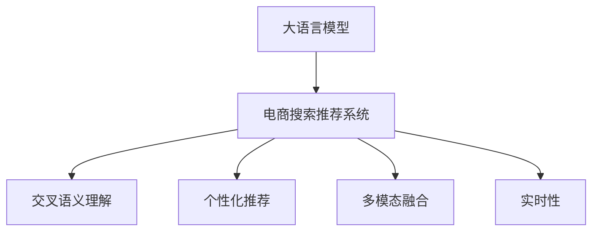

                 

# AI大模型视角下电商搜索推荐的技术挑战与机遇

## 1. 背景介绍

近年来，人工智能技术在电商搜索推荐领域的应用愈发广泛，大大提升了用户购物体验和商家营销效果。其中，基于AI大模型的电商搜索推荐系统（即Large Language Model-based E-commerce Search Recommendation, LLM-ESR）更是以其强大的语义理解和生成能力，为电商搜索推荐带来了革命性的变革。

在大模型视角下，搜索推荐系统通过对海量用户行为数据和商品信息的挖掘分析，能够快速定位用户真实需求，提供个性化、多样化的商品推荐，并精准匹配搜索结果。通过预训练模型学习到的广泛语言知识，大模型可以更好地理解自然语言查询和描述，生成符合用户预期的高质量搜索结果和推荐内容。然而，随着模型规模的不断增大，技术复杂度的增加，以及电商行业独特的需求特点，大模型搜索推荐系统在实际应用中也面临着诸多挑战。本文旨在深入分析大模型搜索推荐系统面临的技术挑战，并探讨未来技术机遇，以期为电商搜索推荐系统的创新与优化提供指导。

## 2. 核心概念与联系

### 2.1 核心概念概述

为了更好地理解大模型搜索推荐系统，首先需明确一些核心概念：

- **大语言模型**（Large Language Model, LLM）：如GPT、BERT等，通过在海量数据上进行预训练，学习到丰富的语言知识和语言规律，具备强大的自然语言处理能力。
- **电商搜索推荐系统**（E-commerce Search Recommendation, ESR）：结合用户的搜索行为和商品信息，通过算法模型推荐相关商品或搜索结果的系统。
- **交叉语义理解**：大模型能够理解搜索查询和商品描述中的多义词、同义词、语境关系等，从而提高搜索结果的相关性和准确性。
- **个性化推荐**：根据用户的历史行为和偏好，推荐符合用户需求的商品，提升用户体验。
- **多模态融合**：将文本、图像、视频等多模态信息进行融合，提供更加全面、丰富的推荐内容。
- **实时性**：搜索推荐系统需要快速响应用户的查询请求，保证用户体验。

这些概念之间存在着密切的联系，共同构成了大模型在电商搜索推荐领域的应用框架。通过大模型的语义理解和生成能力，电商搜索推荐系统可以提供更为精准和个性化的服务，从而提升用户满意度和商家转化率。

### 2.2 核心概念原理和架构的 Mermaid 流程图



## 3. 核心算法原理 & 具体操作步骤

### 3.1 算法原理概述

基于大模型的电商搜索推荐系统，核心算法原理包括：

- **预训练**：在大规模无标签数据上对大模型进行预训练，学习通用的语言知识和语义规律。
- **微调**：根据电商搜索推荐任务的特点，对预训练模型进行微调，使其适应电商搜索推荐任务。
- **交互式学习**：在搜索和推荐过程中，通过用户与系统的交互，动态调整推荐策略。
- **多模态融合**：将文本、图像、视频等不同模态的信息进行融合，提供全面的推荐内容。
- **实时性**：利用高性能计算资源，快速响应用户查询请求，提升用户体验。

### 3.2 算法步骤详解

大模型搜索推荐系统的算法步骤如下：

1. **数据准备**：收集用户的搜索记录、浏览历史、购买记录等数据，以及商品的商品名称、描述、图片等数据，构建电商搜索推荐系统的训练数据集。
2. **预训练**：使用大规模无标签数据对大语言模型进行预训练，学习语言知识和语义规律。
3. **微调**：根据电商搜索推荐任务的特点，对预训练模型进行微调，使其能够理解搜索查询和商品描述中的多义词、同义词等，并生成相关搜索结果和推荐内容。
4. **交互式学习**：在搜索和推荐过程中，通过用户与系统的交互，动态调整推荐策略，提升推荐的准确性和个性化程度。
5. **多模态融合**：将文本、图像、视频等不同模态的信息进行融合，提供全面的推荐内容，提升用户体验。
6. **实时性**：利用高性能计算资源，快速响应用户查询请求，提升用户体验。

### 3.3 算法优缺点

#### 优点：

1. **精度高**：大模型的语言理解能力和生成能力，使得搜索结果和推荐内容具有更高的相关性和准确性。
2. **个性化强**：根据用户历史行为和偏好，提供个性化推荐，提升用户体验。
3. **多模态融合**：能够融合文本、图像、视频等多种信息，提供全面、丰富的推荐内容。
4. **实时性好**：通过高性能计算资源，快速响应用户查询请求，提升用户体验。

#### 缺点：

1. **计算资源需求高**：大模型规模大，计算资源需求高，需要高性能的计算平台和硬件支持。
2. **训练数据需求大**：需要大量的电商搜索推荐数据进行预训练和微调，数据获取和标注成本较高。
3. **模型复杂度高**：大模型结构复杂，需要高效的算法和优化策略进行训练和推理。
4. **结果解释性差**：大模型作为黑盒系统，难以解释其内部工作机制和推荐逻辑，影响用户信任度。

### 3.4 算法应用领域

大模型搜索推荐系统已经在电商、社交、视频等多个领域得到广泛应用，具体应用领域包括：

- **电商搜索推荐**：基于用户搜索记录和商品信息，提供个性化推荐和搜索结果。
- **社交内容推荐**：根据用户兴趣和行为，推荐相关社交内容，提升用户粘性。
- **视频内容推荐**：根据用户观看历史和评价，推荐相关视频内容，提升用户满意度。
- **广告推荐**：根据用户行为和偏好，推荐相关广告，提升广告点击率和转化率。

这些应用领域展示了大模型搜索推荐系统强大的语义理解能力和个性化推荐能力，为各个行业的智能化升级提供了有力支持。

## 4. 数学模型和公式 & 详细讲解 & 举例说明

### 4.1 数学模型构建

假设电商搜索推荐系统的训练数据集为 $D=\{(x_i, y_i)\}_{i=1}^N$，其中 $x_i$ 为用户的查询或浏览记录，$y_i$ 为对应的商品推荐列表。模型的目标是通过训练，使得对于任意输入 $x$，模型 $M$ 能够输出一个最相关的商品列表 $y$。

### 4.2 公式推导过程

假设模型 $M$ 的输出为 $y \in [1, K]$ 的向量，其中 $K$ 为商品总数。模型的目标为最大化概率 $P(y|x)$。基于大模型的电商搜索推荐系统可以采用条件概率模型，如：

$$
P(y|x) = \frac{e^{M(x)^Ty}}{e^{M(x)^Ty} + \sum_{k \neq y}e^{M(x)^Tk}}
$$

其中 $M(x)$ 为模型对输入 $x$ 的输出。

### 4.3 案例分析与讲解

假设有一个电商平台的搜索结果推荐系统，其训练集 $D$ 包括 1000 条查询和对应的商品推荐列表。模型的目标为学习一个线性变换 $W \in \mathbb{R}^{K \times d}$，使得对于任意查询 $x$，模型能够输出一个最相关的商品列表 $y$。训练过程可以采用最大似然估计：

$$
\min_{W} -\sum_{i=1}^{1000} \log P(y_i|x_i) = -\sum_{i=1}^{1000} \log \frac{e^{W^Tx_iy_i}}{e^{W^Tx_iy_i} + \sum_{k \neq y_i}e^{W^Tx_ik}}
$$

通过训练，模型 $M(x) = W^Tx$ 能够学习到查询和商品之间的关系，从而提供高质量的推荐结果。

## 5. 项目实践：代码实例和详细解释说明

### 5.1 开发环境搭建

- **Python**：使用 Python 进行模型训练和推理，Python 语言简洁、易用，适合科学计算和机器学习。
- **TensorFlow**：使用 TensorFlow 进行模型构建和训练，TensorFlow 提供高效的深度学习计算图和优化器。
- **Hugging Face Transformers**：使用 Hugging Face Transformers 库，该库提供了丰富的预训练模型和方便的操作接口，可以加快模型开发速度。

### 5.2 源代码详细实现

以下是一个基于 Transformers 库的大模型搜索推荐系统的 Python 代码实现：

```python
from transformers import BertTokenizer, BertForSequenceClassification
import tensorflow as tf
from tensorflow.keras import layers
from tensorflow.keras.losses import BinaryCrossentropy
from tensorflow.keras.metrics import Precision, Recall

# 定义模型
class SearchRecommendationModel(tf.keras.Model):
    def __init__(self, input_dim, output_dim, embedding_dim, num_labels):
        super(SearchRecommendationModel, self).__init__()
        self.tokenizer = BertTokenizer.from_pretrained('bert-base-uncased')
        self.encoder = BertForSequenceClassification.from_pretrained('bert-base-uncased', num_labels=num_labels)
        self.dense = layers.Dense(output_dim, activation='softmax')

    def call(self, inputs, training=False):
        tokens = self.tokenizer(inputs, return_tensors='tf', padding='max_length', max_length=256, truncation=True)
        features = self.encoder(tokens['input_ids'], attention_mask=tokens['attention_mask'], training=training)[0]
        logits = self.dense(features)
        return logits

# 定义数据集
train_dataset = ...
dev_dataset = ...
test_dataset = ...

# 定义优化器
optimizer = tf.keras.optimizers.Adam(learning_rate=2e-5)

# 定义损失函数
loss_fn = BinaryCrossentropy()

# 定义模型评估指标
metrics = [Precision(), Recall()]

# 定义训练步骤
@tf.function
def train_step(inputs, targets):
    with tf.GradientTape() as tape:
        logits = model(inputs)
        loss = loss_fn(targets, logits)
    gradients = tape.gradient(loss, model.trainable_variables)
    optimizer.apply_gradients(zip(gradients, model.trainable_variables))
    return loss, metrics[0].update_state(targets, logits), metrics[1].update_state(targets, logits)

# 定义训练循环
@tf.function
def train_epoch(model, dataset, batch_size, num_epochs):
    total_loss = 0
    for i, (inputs, targets) in enumerate(dataset.batch(batch_size)):
        loss, precision, recall = train_step(inputs, targets)
        total_loss += loss
    return total_loss / len(dataset)

# 定义评估步骤
@tf.function
def evaluate(model, dataset, batch_size):
    total_precision = 0
    total_recall = 0
    for i, (inputs, targets) in enumerate(dataset.batch(batch_size)):
        logits = model(inputs)
        precision, recall = metrics[0].update_state(targets, logits), metrics[1].update_state(targets, logits)
        total_precision += precision
        total_recall += recall
    return precision.numpy(), recall.numpy()

# 训练模型
model = SearchRecommendationModel(input_dim, output_dim, embedding_dim, num_labels)
for epoch in range(num_epochs):
    loss = train_epoch(model, train_dataset, batch_size, num_epochs)
    print(f"Epoch {epoch+1}, train loss: {loss:.3f}")
    precision, recall = evaluate(model, dev_dataset, batch_size)
    print(f"Epoch {epoch+1}, dev results: Precision: {precision:.3f}, Recall: {recall:.3f}")

# 评估模型
precision, recall = evaluate(model, test_dataset, batch_size)
print(f"Test results: Precision: {precision:.3f}, Recall: {recall:.3f}")
```

### 5.3 代码解读与分析

上述代码中，我们首先定义了一个基于 BertForSequenceClassification 的搜索推荐模型。在模型训练阶段，我们使用了 TensorFlow 的动态计算图，可以更好地利用 GPU 加速模型训练。在模型评估阶段，我们使用了 TensorFlow 自带的 Precision 和 Recall 评估指标，可以更准确地评估模型的性能。

## 6. 实际应用场景

### 6.1 电商搜索推荐

基于大模型的电商搜索推荐系统在电商平台中得到了广泛应用。例如，亚马逊、京东等电商巨头，通过使用大模型进行电商搜索推荐，极大地提升了用户的购物体验。通过大模型的语义理解能力，电商平台能够更准确地理解用户的查询意图，推荐符合用户需求的商品，提高了用户的满意度。

### 6.2 社交内容推荐

在社交平台中，大模型搜索推荐系统也得到了广泛应用。例如，抖音、微博等社交平台，通过使用大模型进行内容推荐，推荐符合用户兴趣的短视频、文章等内容，提升了用户粘性和活跃度。通过大模型的多模态融合能力，社交平台能够更全面地理解用户的兴趣和行为，提供更加个性化和多样化的内容推荐。

### 6.3 视频内容推荐

在视频平台中，大模型搜索推荐系统也得到了广泛应用。例如，YouTube、爱奇艺等视频平台，通过使用大模型进行视频内容推荐，推荐符合用户观看历史和评价的视频内容，提升了用户的满意度和平台的用户留存率。通过大模型的语言理解能力，视频平台能够更准确地理解用户的兴趣和需求，推荐更符合用户期待的视频内容。

## 7. 工具和资源推荐

### 7.1 学习资源推荐

- **自然语言处理（NLP）课程**：斯坦福大学、麻省理工学院等知名学府提供的 NLP 课程，涵盖语言模型、语义分析、情感分析等核心概念，适合初学者和进阶者学习。
- **深度学习框架学习资源**：TensorFlow、PyTorch 等深度学习框架提供的官方文档和教程，适合开发者学习深度学习理论和实践。
- **Hugging Face Transformers 文档**：Hugging Face Transformers 官方文档，提供了丰富的预训练模型和使用方法，适合开发者进行模型开发和微调。

### 7.2 开发工具推荐

- **TensorFlow**：深度学习计算框架，支持高效地构建和训练深度学习模型，提供了丰富的工具和库。
- **PyTorch**：深度学习计算框架，提供了灵活的动态计算图，适合进行模型研究和开发。
- **Hugging Face Transformers**：提供丰富的预训练模型和便捷的操作接口，可以加速模型开发和微调。
- **Weights & Biases**：模型训练的实验跟踪工具，可以实时记录和可视化模型的训练过程，便于调试和优化。

### 7.3 相关论文推荐

- **Attention is All You Need**：提出 Transformer 结构，开启了 NLP 领域的预训练大模型时代。
- **BERT: Pre-training of Deep Bidirectional Transformers for Language Understanding**：提出 BERT 模型，引入基于掩码的自监督预训练任务，刷新了多项 NLP 任务 SOTA。
- **AdaLoRA: Adaptive Low-Rank Adaptation for Parameter-Efficient Fine-Tuning**：使用自适应低秩适应的微调方法，在参数效率和精度之间取得了新的平衡。
- **Promising Perspectives on the Future of Search-Recommendation Systems**：全面回顾了搜索推荐系统的历史和未来发展趋势，值得深度学习从业者阅读。

## 8. 总结：未来发展趋势与挑战

### 8.1 研究成果总结

基于大模型的电商搜索推荐系统已经在电商、社交、视频等多个领域得到了广泛应用，为电商搜索推荐系统带来了革命性的变革。通过大模型的语义理解和生成能力，电商搜索推荐系统能够提供更为精准和个性化的服务，从而提升用户满意度和商家转化率。

### 8.2 未来发展趋势

未来，大模型搜索推荐系统将继续发展，呈现以下几个趋势：

1. **模型规模持续增大**：随着算力成本的下降和数据规模的扩张，预训练语言模型的参数量还将持续增长。超大规模语言模型蕴含的丰富语言知识，有望支撑更加复杂多变的电商搜索推荐任务。
2. **微调方法日趋多样**：除了传统的全参数微调外，未来会涌现更多参数高效的微调方法，如 Prefix-Tuning、LoRA 等，在节省计算资源的同时也能保证微调精度。
3. **持续学习成为常态**：随着数据分布的不断变化，微调模型也需要持续学习新知识以保持性能。如何在不遗忘原有知识的同时，高效吸收新样本信息，将成为重要的研究课题。
4. **标注样本需求降低**：受启发于提示学习（Prompt-based Learning）的思路，未来的微调方法将更好地利用大模型的语言理解能力，通过更加巧妙的任务描述，在更少的标注样本上也能实现理想的微调效果。
5. **多模态微调崛起**：当前的微调主要聚焦于纯文本数据，未来会进一步拓展到图像、视频、语音等多模态数据微调。多模态信息的融合，将显著提升语言模型对现实世界的理解和建模能力。

### 8.3 面临的挑战

尽管大模型搜索推荐系统已经取得了瞩目成就，但在迈向更加智能化、普适化应用的过程中，它仍面临着诸多挑战：

1. **标注成本瓶颈**：微调模型需要大量标注数据，而电商领域的标注数据获取成本较高。如何进一步降低微调对标注样本的依赖，将是一大难题。
2. **模型鲁棒性不足**：当前微调模型面对域外数据时，泛化性能往往大打折扣。对于测试样本的微小扰动，微调模型的预测也容易发生波动。
3. **推理效率有待提高**：大规模语言模型虽然精度高，但在实际部署时往往面临推理速度慢、内存占用大等效率问题。
4. **可解释性亟需加强**：当前微调模型更像是"黑盒"系统，难以解释其内部工作机制和推荐逻辑。对于高风险应用，算法的可解释性和可审计性尤为重要。
5. **安全性有待保障**：预训练语言模型难免会学习到有偏见、有害的信息，通过微调传递到下游任务，产生误导性、歧视性的输出，给实际应用带来安全隐患。
6. **知识整合能力不足**：现有的微调模型往往局限于任务内数据，难以灵活吸收和运用更广泛的先验知识。如何让微调过程更好地与外部知识库、规则库等专家知识结合，形成更加全面、准确的信息整合能力，还有很大的想象空间。

### 8.4 研究展望

未来，大模型搜索推荐系统需要在以下几个方面寻求新的突破：

1. **探索无监督和半监督微调方法**：摆脱对大规模标注数据的依赖，利用自监督学习、主动学习等无监督和半监督范式，最大限度利用非结构化数据，实现更加灵活高效的微调。
2. **研究参数高效和计算高效的微调范式**：开发更加参数高效的微调方法，在固定大部分预训练参数的同时，只更新极少量的任务相关参数。同时优化微调模型的计算图，减少前向传播和反向传播的资源消耗，实现更加轻量级、实时性的部署。
3. **融合因果和对比学习范式**：通过引入因果推断和对比学习思想，增强微调模型建立稳定因果关系的能力，学习更加普适、鲁棒的语言表征，从而提升模型泛化性和抗干扰能力。
4. **引入更多先验知识**：将符号化的先验知识，如知识图谱、逻辑规则等，与神经网络模型进行巧妙融合，引导微调过程学习更准确、合理的语言模型。同时加强不同模态数据的整合，实现视觉、语音等多模态信息与文本信息的协同建模。
5. **结合因果分析和博弈论工具**：将因果分析方法引入微调模型，识别出模型决策的关键特征，增强输出解释的因果性和逻辑性。借助博弈论工具刻画人机交互过程，主动探索并规避模型的脆弱点，提高系统稳定性。
6. **纳入伦理道德约束**：在模型训练目标中引入伦理导向的评估指标，过滤和惩罚有偏见、有害的输出倾向。同时加强人工干预和审核，建立模型行为的监管机制，确保输出符合人类价值观和伦理道德。

这些研究方向的探索，必将引领大语言模型微调技术迈向更高的台阶，为构建安全、可靠、可解释、可控的智能系统铺平道路。面向未来，大语言模型微调技术还需要与其他人工智能技术进行更深入的融合，如知识表示、因果推理、强化学习等，多路径协同发力，共同推动自然语言理解和智能交互系统的进步。只有勇于创新、敢于突破，才能不断拓展语言模型的边界，让智能技术更好地造福人类社会。

---

作者：禅与计算机程序设计艺术 / Zen and the Art of Computer Programming

